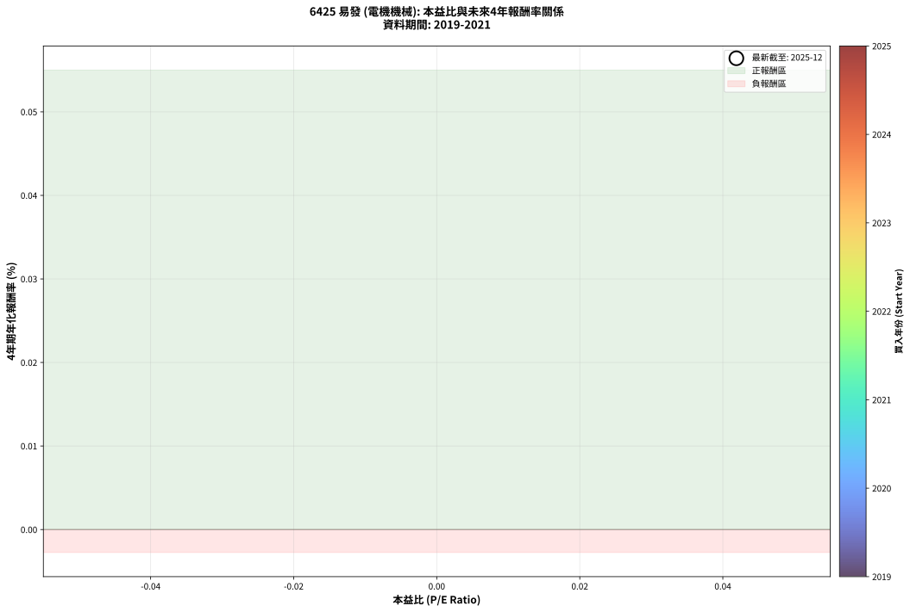
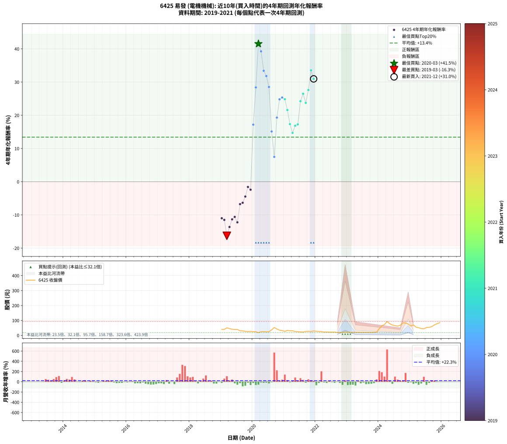

# 6425 易發 - 本益比與未來報酬率分析

!!! info "報告資訊"
    - **股票代號**: 6425
    - **公司名稱**: 易發
    - **產業別**: 電機機械
    - **分析期間**: 2019-2021 (36 個數據點)
    - **資料來源**: Type 12 (ShowMonthlyK_ChartFlow) 月收盤價與本益比
    - **報酬率口徑**: 含現金股利 (簡化: 年度合計，假設每年7/1入帳)
    - **報告生成時間**: 2026-01-04 08:51:20 CST

## 📈 視覺化圖表

### 圖表1: 本益比 vs 未來報酬率關係

*圖表1：6425 易發 本益比與4年期未來報酬率關係 (2019-2021)*

### 圖表2: 歷年買入時點的4年期實際報酬率

*圖表2：6425 易發 歷年買入時點的4年期實際報酬率 (2019-2021)*

## 📍 買點訊號說明

本報告提供兩種買點提示訊號（顯示於圖表2的股價子圖中）：

### ▲ 小綠色三角形（回測驗證）
- **計算方式**: 使用全部歷史資料計算本益比第25百分位數
- **用途**: 事後驗證，顯示歷史上哪些時點確實為低估區
- **限制**: 當下無法判斷，僅供回測參考
- **特性**: 後見之明（Look-Ahead Bias）

### ▲ 小橘色三角形（即時訊號）
- **計算方式**: 使用截至當月的過去5年資料計算本益比第25百分位數
- **用途**: 實際投資決策，當時即可判斷
- **優勢**: 可操作性強，符合實務需求
- **特性**: 無後見之明，滾動窗口計算

!!! tip "如何使用兩種訊號"
    - **綠色▲** 幫助理解歷史估值機會，驗證策略有效性
    - **橘色▲** 可作為實際買進參考，但仍需搭配基本面分析
    - 兩種訊號重疊時，表示即時判斷與事後驗證一致，信心度較高
    - 僅有綠色▲時，表示當時無法判斷（需要未來資料才能確認）
    - 僅有橘色▲時，表示即時判斷為買點，但事後可能不是最佳時機

## 📊 估值分析摘要

| 指標 | 數值 |
|:---:|:---:|
| **目前本益比** (2021-12) | **nan 倍** |
| **歷史平均本益比** | nan 倍 |
| **估值水準** | 🟡 合理範圍 |
| **預期4年年化報酬率** | **+nan%** |
| **歷史平均報酬率** | +13.42% |
| **相關係數 (R²)** | 0.0000 |
| **趨勢線斜率** | 0.0000 |

!!! abstract "核心洞察"
    目前本益比接近歷史平均，預期報酬率符合長期趨勢

    根據歷史數據回測，6425 易發 在目前本益比 **nan倍** 的估值水準下，
    預期未來4年年化報酬率約為 **+nan%**。

    **重要提醒**: 本分析基於歷史數據統計，實際報酬率會受到公司基本面變化、產業趨勢、
    總體經濟環境等多重因素影響。R² = 0.00 表示本益比可解釋約 0.0% 的報酬率變異。

## 📈 歷史估值統計

### 最佳買點 (最高報酬率)

| 項目 | 數值 |
|:---:|:---:|
| 起始時間 | 2020-03 |
| 當時本益比 | nan 倍 |
| 起始價格 | 18.6 元 |
| 4年後價格 | 72.3 元 |
| **4年年化報酬率** | **+41.52%** |

### 最差買點 (最低報酬率)

| 項目 | 數值 |
|:---:|:---:|
| 起始時間 | 2019-03 |
| 當時本益比 | nan 倍 |
| 起始價格 | 50.7 元 |
| 4年後價格 | 20.4 元 |
| **4年年化報酬率** | **-16.28%** |

## 🎯 投資啟示

### 本益比與報酬率關係

趨勢線方程式: **y = 0.0000x + 0.0000**

!!! info "弱相關或正相關"
    本益比與未來報酬率相關性較弱。這可能表示該股票的報酬率更多受到
    公司成長性、產業趨勢等因素影響，而非估值水準。**需綜合考量多項指標**。

### 估值區間建議

基於歷史數據分析:

- **🟢 低估區** (P/E < nan): 預期報酬率較高，可考慮增加持股
- **🟡 合理區** (P/E nan-nan): 預期報酬率符合長期趨勢，正常持有
- **🔴 高估區** (P/E > nan): 預期報酬率較低，可考慮減碼或觀望

!!! danger "風險提示"
    - 過去表現不代表未來結果
    - 本分析假設公司基本面無重大結構性變化
    - 產業環境劇變可能使歷史規律失效
    - 應結合公司財報、產業趨勢、總體經濟等多重因素綜合判斷

!!! success "長期投資觀點"
    歷史數據顯示，在合理或低估的估值水準買入並長期持有，
    往往能獲得較佳的投資報酬。**耐心等待好價格**是價值投資的核心原則。

## 📊 數據品質

- **資料來源**: GoodInfo.tw Type 12 (ShowMonthlyK_ChartFlow)
- **資料頻率**: 月度收盤價與本益比
- **回測期間**: 2019-2021
- **數據點數量**: 36 個 (每個點代表一次4年期回測)

### 計算方法說明

1. **4年期年化報酬率**:
   - 對每個歷史時點，計算其後4年的實際投資報酬率
   - 期末價值(不含股利): 期末價格
   - 期末價值(含現金股利): 期末價格 + 持有期間內的現金股利合計 (簡化: 年度合計，假設每年7/1入帳)
   - 公式: 年化報酬率 = [(期末價值/期初價格)^(1/年數) - 1] × 100%

2. **本益比 (P/E Ratio)**:
   - 使用當時的月收盤價與EPS計算
   - 資料來源: Type 12 月度河流圖本益比數據

3. **趨勢線 (Linear Regression)**:
   - 使用最小平方法擬合線性趨勢線
   - R²值衡量本益比對報酬率的解釋能力

---

*本報告由 Stock Analysis System v1.9.0 自動生成*
*數據更新時間: 2026-01-04 08:51:20 CST*

## 📋 月度回測明細表

（每一列對應時間線圖中的一個買入點；可用來對照 SVG 圖上的每個點。）

| 買入月份 | 賣出月份 | 回測期限_年 | 實際持有年數 | 買入本益比_倍 | 買入收盤價_元 | 賣出收盤價_元 | 現金股利合計_元 | 總報酬率_pct | 年化報酬率_pct |
| --- | --- | --- | --- | --- | --- | --- | --- | --- | --- |
| 2019-01 | 2023-01 | 4 | 4.000 |  | 40.50 | 20.90 | 4.51 | -37.25 | -11.00 |
| 2019-02 | 2023-02 | 4 | 4.000 |  | 39.95 | 20.00 | 4.51 | -38.64 | -11.49 |
| 2019-03 | 2023-03 | 4 | 4.000 |  | 50.70 | 20.40 | 4.51 | -50.86 | -16.28 |
| 2019-04 | 2023-04 | 4 | 4.000 |  | 45.75 | 20.95 | 4.51 | -44.34 | -13.63 |
| 2019-05 | 2023-05 | 4 | 4.000 |  | 41.35 | 21.05 | 4.51 | -38.18 | -11.33 |
| 2019-06 | 2023-06 | 4 | 4.000 |  | 39.30 | 20.60 | 4.51 | -36.10 | -10.59 |
| 2019-07 | 2023-07 | 4 | 4.000 |  | 39.95 | 21.20 | 2.51 | -40.64 | -12.23 |
| 2019-08 | 2023-08 | 4 | 4.000 |  | 30.50 | 20.55 | 2.51 | -24.38 | -6.75 |
| 2019-09 | 2023-09 | 4 | 4.000 |  | 30.10 | 20.65 | 2.51 | -23.05 | -6.34 |
| 2019-10 | 2023-10 | 4 | 4.000 |  | 27.20 | 20.15 | 2.51 | -16.68 | -4.46 |
| 2019-11 | 2023-11 | 4 | 4.000 |  | 25.00 | 20.95 | 2.51 | -6.15 | -1.57 |
| 2019-12 | 2023-12 | 4 | 4.000 |  | 26.80 | 21.80 | 2.51 | -9.28 | -2.41 |
| 2020-01 | 2024-01 | 4 | 4.000 |  | 25.20 | 45.00 | 2.51 | +88.54 | +17.18 |
| 2020-02 | 2024-02 | 4 | 4.000 |  | 24.70 | 64.60 | 2.51 | +171.71 | +28.39 |
| 2020-03 | 2024-03 | 4 | 4.000 |  | 18.65 | 72.30 | 2.51 | +301.14 | +41.52 |
| 2020-04 | 2024-04 | 4 | 4.000 |  | 25.40 | 93.00 | 2.51 | +276.04 | +39.25 |
| 2020-05 | 2024-05 | 4 | 4.000 |  | 25.55 | 78.40 | 2.51 | +216.68 | +33.40 |
| 2020-06 | 2024-06 | 4 | 4.000 |  | 23.75 | 69.20 | 2.51 | +201.95 | +31.82 |
| 2020-07 | 2024-07 | 4 | 4.000 |  | 24.85 | 65.30 | 2.50 | +172.84 | +28.52 |
| 2020-08 | 2024-08 | 4 | 4.000 |  | 37.00 | 62.50 | 2.50 | +75.68 | +15.13 |
| 2020-09 | 2024-09 | 4 | 4.000 |  | 53.00 | 68.20 | 2.50 | +33.40 | +7.47 |
| 2020-10 | 2024-10 | 4 | 4.000 |  | 42.70 | 84.00 | 2.50 | +102.58 | +19.30 |
| 2020-11 | 2024-11 | 4 | 4.000 |  | 35.00 | 82.40 | 2.50 | +142.57 | +24.80 |
| 2020-12 | 2024-12 | 4 | 4.000 |  | 32.00 | 76.50 | 2.50 | +146.88 | +25.35 |
| 2021-01 | 2025-01 | 4 | 4.000 |  | 26.80 | 62.60 | 2.50 | +142.91 | +24.84 |
| 2021-02 | 2025-02 | 4 | 4.000 |  | 33.35 | 70.40 | 2.50 | +118.59 | +21.59 |
| 2021-03 | 2025-03 | 4 | 4.000 |  | 30.60 | 55.50 | 2.50 | +89.54 | +17.33 |
| 2021-04 | 2025-04 | 4 | 4.000 |  | 31.15 | 51.40 | 2.50 | +73.03 | +14.69 |
| 2021-05 | 2025-05 | 4 | 4.000 |  | 25.95 | 45.90 | 2.50 | +86.51 | +16.86 |
| 2021-06 | 2025-06 | 4 | 4.000 |  | 24.70 | 44.20 | 2.50 | +89.07 | +17.26 |
| 2021-07 | 2025-07 | 4 | 4.000 |  | 23.50 | 53.00 | 3.00 | +138.31 | +24.25 |
| 2021-08 | 2025-08 | 4 | 4.000 |  | 22.15 | 53.70 | 3.00 | +155.99 | +26.49 |
| 2021-09 | 2025-09 | 4 | 4.000 |  | 26.50 | 59.10 | 3.00 | +134.35 | +23.73 |
| 2021-10 | 2025-10 | 4 | 4.000 |  | 27.60 | 70.20 | 3.00 | +165.22 | +27.62 |
| 2021-11 | 2025-11 | 4 | 4.000 |  | 25.65 | 78.60 | 3.00 | +218.14 | +33.55 |
| 2021-12 | 2025-12 | 4 | 4.000 |  | 29.95 | 85.10 | 3.00 | +194.16 | +30.96 |
