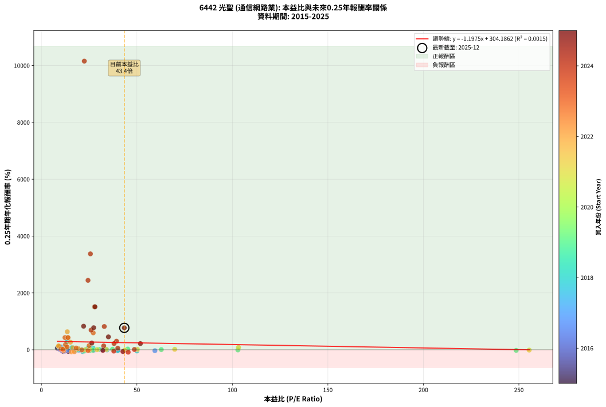
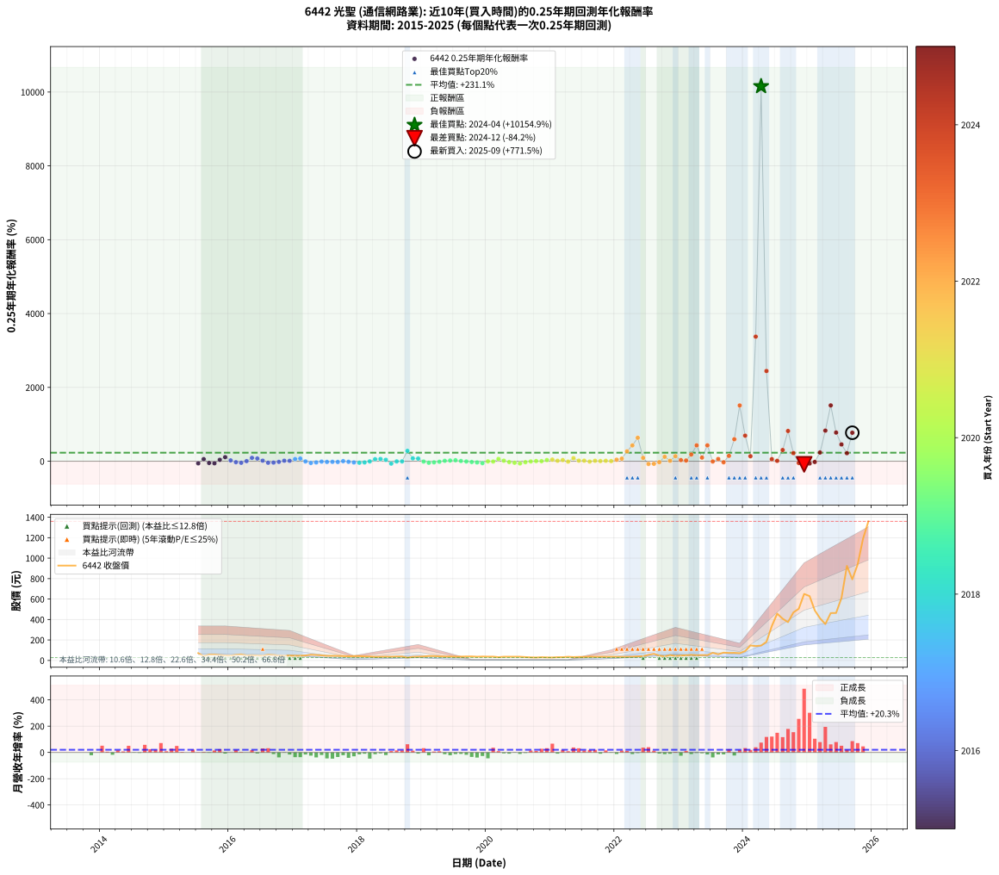

# 6442 光聖 - 本益比與未來報酬率分析

!!! info "報告資訊"
    - **股票代號**: 6442
    - **公司名稱**: 光聖
    - **產業別**: 通信網路業
    - **分析期間**: 2015-2025 (123 個數據點)
    - **資料來源**: Type 12 (ShowMonthlyK_ChartFlow) 月收盤價與本益比
    - **報酬率口徑**: 含現金股利 (簡化: 年度合計，假設每年7/1入帳)
    - **報告生成時間**: 2026-01-06 01:11:38 CST

## 📈 視覺化圖表

### 圖表1: 本益比 vs 未來報酬率關係

*圖表1：6442 光聖 本益比與0.25年期未來報酬率關係 (2015-2025)*

### 圖表2: 歷年買入時點的0.25年期實際報酬率

*圖表2：6442 光聖 歷年買入時點的0.25年期實際報酬率 (2015-2025)*

## 📍 買點訊號說明

本報告提供兩種買點提示訊號（顯示於圖表2的股價子圖中）：

### ▲ 小綠色三角形（回測驗證）
- **計算方式**: 使用全部歷史資料計算本益比第25百分位數
- **用途**: 事後驗證，顯示歷史上哪些時點確實為低估區
- **限制**: 當下無法判斷，僅供回測參考
- **特性**: 後見之明（Look-Ahead Bias）

### ▲ 小橘色三角形（即時訊號）
- **計算方式**: 使用截至當月的過去5年資料計算本益比第25百分位數
- **用途**: 實際投資決策，當時即可判斷
- **優勢**: 可操作性強，符合實務需求
- **特性**: 無後見之明，滾動窗口計算

!!! tip "如何使用兩種訊號"
    - **綠色▲** 幫助理解歷史估值機會，驗證策略有效性
    - **橘色▲** 可作為實際買進參考，但仍需搭配基本面分析
    - 兩種訊號重疊時，表示即時判斷與事後驗證一致，信心度較高
    - 僅有綠色▲時，表示當時無法判斷（需要未來資料才能確認）
    - 僅有橘色▲時，表示即時判斷為買點，但事後可能不是最佳時機

## 📊 估值分析摘要

| 指標 | 數值 |
|:---:|:---:|
| **目前本益比** (2025-09) | **43.41 倍** |
| **歷史平均本益比** | 29.79 倍 |
| **估值水準** | 🔴 相對高估 |
| **預期0.25年年化報酬率** | **+252.20%** |
| **歷史平均報酬率** | +231.06% |
| **相關係數 (R²)** | 0.0015 |
| **趨勢線斜率** | -1.1975 |

!!! abstract "核心洞察"
    目前本益比顯著高於歷史平均，預期未來報酬率可能較低

    根據歷史數據回測，6442 光聖 在目前本益比 **43.4倍** 的估值水準下，
    預期未來0.25年年化報酬率約為 **+252.2%**。

    **重要提醒**: 本分析基於歷史數據統計，實際報酬率會受到公司基本面變化、產業趨勢、
    總體經濟環境等多重因素影響。R² = 0.00 表示本益比可解釋約 0.2% 的報酬率變異。

## 📈 歷史估值統計

### 最佳買點 (最高報酬率)

| 項目 | 數值 |
|:---:|:---:|
| 起始時間 | 2024-04 |
| 當時本益比 | 22.47 倍 |
| 起始價格 | 145.0 元 |
| 0.25年後價格 | 457.5 元 |
| **0.25年年化報酬率** | **+10154.87%** |

### 最差買點 (最低報酬率)

| 項目 | 數值 |
|:---:|:---:|
| 起始時間 | 2024-12 |
| 當時本益比 | 45.45 倍 |
| 起始價格 | 650.0 元 |
| 0.25年後價格 | 412.5 元 |
| **0.25年年化報酬率** | **-84.20%** |

## 🎯 投資啟示

### 本益比與報酬率關係

趨勢線方程式: **y = -1.1975x + 304.1862**

!!! warning "強負相關"
    本益比與未來報酬率呈現強負相關。在高本益比時期買入，未來報酬率顯著較低；
    在低本益比時期買入，未來報酬率顯著較高。**估值紀律至關重要**。

### 估值區間建議

基於歷史數據分析:

- **🟢 低估區** (P/E < 23.8): 預期報酬率較高，可考慮增加持股
- **🟡 合理區** (P/E 23.8-35.7): 預期報酬率符合長期趨勢，正常持有
- **🔴 高估區** (P/E > 35.7): 預期報酬率較低，可考慮減碼或觀望

!!! danger "風險提示"
    - 過去表現不代表未來結果
    - 本分析假設公司基本面無重大結構性變化
    - 產業環境劇變可能使歷史規律失效
    - 應結合公司財報、產業趨勢、總體經濟等多重因素綜合判斷

!!! success "長期投資觀點"
    歷史數據顯示，在合理或低估的估值水準買入並長期持有，
    往往能獲得較佳的投資報酬。**耐心等待好價格**是價值投資的核心原則。

## 📊 數據品質

- **資料來源**: GoodInfo.tw Type 12 (ShowMonthlyK_ChartFlow)
- **資料頻率**: 月度收盤價與本益比
- **回測期間**: 2015-2025
- **數據點數量**: 123 個 (每個點代表一次0.25年期回測)

### 計算方法說明

1. **0.25年期年化報酬率**:
   - 對每個歷史時點，計算其後0.25年的實際投資報酬率
   - 期末價值(不含股利): 期末價格
   - 期末價值(含現金股利): 期末價格 + 持有期間內的現金股利合計 (簡化: 年度合計，假設每年7/1入帳)
   - 公式: 年化報酬率 = [(期末價值/期初價格)^(1/年數) - 1] × 100%

2. **本益比 (P/E Ratio)**:
   - 使用當時的月收盤價與EPS計算
   - 資料來源: Type 12 月度河流圖本益比數據

3. **趨勢線 (Linear Regression)**:
   - 使用最小平方法擬合線性趨勢線
   - R²值衡量本益比對報酬率的解釋能力

---

*本報告由 Stock Analysis System v1.9.0 自動生成*
*數據更新時間: 2026-01-06 01:11:38 CST*

## 📋 月度回測明細表

（每一列對應時間線圖中的一個買入點；可用來對照 SVG 圖上的每個點。）

| 買入月份 | 賣出月份 | 回測期限_年 | 實際持有年數 | 買入本益比_倍 | 買入收盤價_元 | 賣出收盤價_元 | 現金股利合計_元 | 總報酬率_pct | 年化報酬率_pct |
| --- | --- | --- | --- | --- | --- | --- | --- | --- | --- |
| 2015-07 | 2015-10 | 0.25 | 0.252 | 14.10 | 71.20 | 57.80 | 0.00 | -18.82 | -56.30 |
| 2015-08 | 2015-12 | 0.25 | 0.334 | 8.36 | 42.20 | 49.00 | 0.00 | +16.11 | +56.41 |
| 2015-09 | 2015-12 | 0.25 | 0.249 | 11.35 | 57.30 | 49.00 | 0.00 | -14.49 | -46.64 |
| 2015-10 | 2016-01 | 0.25 | 0.252 | 11.45 | 57.80 | 47.20 | 0.00 | -18.34 | -55.26 |
| 2015-11 | 2016-03 | 0.25 | 0.331 | 10.48 | 52.90 | 59.00 | 0.00 | +11.53 | +39.02 |
| 2015-12 | 2016-03 | 0.25 | 0.249 | 9.70 | 49.00 | 59.00 | 0.00 | +20.41 | +110.73 |
| 2016-01 | 2016-05 | 0.25 | 0.331 | 9.45 | 47.20 | 50.50 | 0.00 | +6.99 | +22.63 |
| 2016-02 | 2016-05 | 0.25 | 0.249 | 11.01 | 54.40 | 50.50 | 0.00 | -7.17 | -25.81 |
| 2016-03 | 2016-07 | 0.25 | 0.334 | 12.08 | 59.00 | 46.00 | 3.00 | -16.95 | -42.65 |
| 2016-04 | 2016-07 | 0.25 | 0.249 | 10.07 | 48.65 | 46.00 | 3.00 | +0.72 | +2.92 |
| 2016-05 | 2016-08 | 0.25 | 0.252 | 10.58 | 50.50 | 56.50 | 3.00 | +17.82 | +91.77 |
| 2016-06 | 2016-09 | 0.25 | 0.252 | 10.32 | 48.70 | 53.00 | 3.00 | +14.99 | +74.11 |
| 2016-07 | 2016-10 | 0.25 | 0.252 | 9.86 | 46.00 | 47.75 | 0.00 | +3.80 | +15.98 |
| 2016-08 | 2016-12 | 0.25 | 0.334 | 12.26 | 56.50 | 47.20 | 0.00 | -16.46 | -41.63 |
| 2016-09 | 2016-12 | 0.25 | 0.249 | 11.64 | 53.00 | 47.20 | 0.00 | -10.94 | -37.20 |
| 2016-10 | 2017-01 | 0.25 | 0.252 | 10.61 | 47.75 | 45.45 | 0.00 | -4.82 | -17.80 |
| 2016-11 | 2017-03 | 0.25 | 0.329 | 10.43 | 46.35 | 48.50 | 0.00 | +4.64 | +14.80 |
| 2016-12 | 2017-03 | 0.25 | 0.246 | 10.75 | 47.20 | 48.50 | 0.00 | +2.75 | +11.66 |
| 2017-01 | 2017-05 | 0.25 | 0.329 | 11.13 | 45.45 | 53.00 | 0.00 | +16.61 | +59.64 |
| 2017-02 | 2017-05 | 0.25 | 0.246 | 12.26 | 46.30 | 53.00 | 0.00 | +14.47 | +73.06 |
| 2017-03 | 2017-07 | 0.25 | 0.334 | 13.98 | 48.50 | 44.40 | 3.30 | -1.65 | -4.86 |
| 2017-04 | 2017-07 | 0.25 | 0.249 | 17.64 | 55.80 | 44.40 | 3.30 | -14.52 | -46.72 |
| 2017-05 | 2017-08 | 0.25 | 0.252 | 18.55 | 53.00 | 44.85 | 3.30 | -9.15 | -31.68 |
| 2017-06 | 2017-09 | 0.25 | 0.252 | 19.29 | 49.20 | 44.60 | 3.30 | -2.64 | -10.09 |
| 2017-07 | 2017-10 | 0.25 | 0.252 | 19.79 | 44.40 | 42.10 | 0.00 | -5.18 | -19.04 |
| 2017-08 | 2017-12 | 0.25 | 0.334 | 23.16 | 44.85 | 42.20 | 0.00 | -5.91 | -16.67 |
| 2017-09 | 2017-12 | 0.25 | 0.249 | 27.36 | 44.60 | 42.20 | 0.00 | -5.38 | -19.91 |
| 2017-10 | 2018-01 | 0.25 | 0.252 | 31.81 | 42.10 | 42.30 | 0.00 | +0.48 | +1.90 |
| 2017-11 | 2018-03 | 0.25 | 0.329 | 40.03 | 40.70 | 38.40 | 0.00 | -5.65 | -16.23 |
| 2017-12 | 2018-03 | 0.25 | 0.246 | 59.44 | 42.20 | 38.40 | 0.00 | -9.00 | -31.82 |
| 2018-01 | 2018-05 | 0.25 | 0.329 | 50.01 | 42.30 | 35.60 | 0.00 | -15.84 | -40.84 |
| 2018-02 | 2018-05 | 0.25 | 0.246 | 39.93 | 39.20 | 35.60 | 0.00 | -9.18 | -32.36 |
| 2018-03 | 2018-07 | 0.25 | 0.334 | 34.36 | 38.40 | 35.90 | 2.00 | -1.30 | -3.85 |
| 2018-04 | 2018-07 | 0.25 | 0.249 | 27.13 | 34.00 | 35.90 | 2.00 | +11.47 | +54.63 |
| 2018-05 | 2018-08 | 0.25 | 0.252 | 25.63 | 35.60 | 38.15 | 2.00 | +12.78 | +61.21 |
| 2018-06 | 2018-09 | 0.25 | 0.252 | 24.13 | 36.80 | 37.95 | 2.00 | +8.56 | +38.55 |
| 2018-07 | 2018-10 | 0.25 | 0.252 | 21.62 | 35.90 | 27.70 | 0.00 | -22.84 | -64.28 |
| 2018-08 | 2018-12 | 0.25 | 0.334 | 21.23 | 38.15 | 37.55 | 0.00 | -1.57 | -4.64 |
| 2018-09 | 2018-12 | 0.25 | 0.249 | 19.64 | 37.95 | 37.55 | 0.00 | -1.05 | -4.16 |
| 2018-10 | 2019-01 | 0.25 | 0.252 | 13.39 | 27.70 | 38.80 | 0.00 | +40.07 | +281.09 |
| 2018-11 | 2019-03 | 0.25 | 0.329 | 16.11 | 35.50 | 42.90 | 0.00 | +20.85 | +77.94 |
| 2018-12 | 2019-03 | 0.25 | 0.246 | 16.05 | 37.55 | 42.90 | 0.00 | +14.25 | +71.70 |
| 2019-01 | 2019-05 | 0.25 | 0.329 | 18.29 | 38.80 | 37.70 | 0.00 | -2.84 | -8.38 |
| 2019-02 | 2019-05 | 0.25 | 0.246 | 22.59 | 43.00 | 37.70 | 0.00 | -12.33 | -41.36 |
| 2019-03 | 2019-07 | 0.25 | 0.334 | 25.46 | 42.90 | 36.70 | 1.50 | -10.96 | -29.35 |
| 2019-04 | 2019-07 | 0.25 | 0.249 | 27.07 | 39.70 | 36.70 | 1.50 | -3.78 | -14.32 |
| 2019-05 | 2019-08 | 0.25 | 0.252 | 30.20 | 37.70 | 37.25 | 1.50 | +2.79 | +11.52 |
| 2019-06 | 2019-09 | 0.25 | 0.252 | 37.23 | 38.35 | 38.60 | 1.50 | +4.56 | +19.38 |
| 2019-07 | 2019-10 | 0.25 | 0.252 | 45.22 | 36.70 | 38.95 | 0.00 | +6.13 | +26.65 |
| 2019-08 | 2019-12 | 0.25 | 0.334 | 62.78 | 37.25 | 38.00 | 0.00 | +2.01 | +6.15 |
| 2019-09 | 2019-12 | 0.25 | 0.249 | 102.90 | 38.60 | 38.00 | 0.00 | -1.55 | -6.09 |
| 2019-10 | 2020-01 | 0.25 | 0.252 | 248.60 | 38.95 | 36.70 | 0.00 | -5.78 | -21.04 |
| 2019-11 | 2020-03 | 0.25 | 0.331 |  | 36.05 | 31.80 | 0.00 | -11.79 | -31.52 |
| 2019-12 | 2020-03 | 0.25 | 0.249 |  | 38.00 | 31.80 | 0.00 | -16.32 | -51.08 |
| 2020-01 | 2020-05 | 0.25 | 0.331 |  | 36.70 | 36.30 | 0.00 | -1.09 | -3.25 |
| 2020-02 | 2020-05 | 0.25 | 0.249 |  | 37.00 | 36.30 | 0.00 | -1.89 | -7.38 |
| 2020-03 | 2020-07 | 0.25 | 0.334 |  | 31.80 | 36.10 | 1.36 | +17.80 | +63.30 |
| 2020-04 | 2020-07 | 0.25 | 0.249 |  | 36.20 | 36.10 | 1.36 | +3.48 | +14.72 |
| 2020-05 | 2020-08 | 0.25 | 0.252 |  | 36.30 | 32.70 | 1.36 | -6.17 | -22.34 |
| 2020-06 | 2020-09 | 0.25 | 0.252 |  | 36.00 | 30.10 | 1.36 | -12.61 | -41.44 |
| 2020-07 | 2020-10 | 0.25 | 0.252 |  | 36.10 | 28.70 | 0.00 | -20.50 | -59.78 |
| 2020-08 | 2020-12 | 0.25 | 0.334 |  | 32.70 | 29.70 | 0.00 | -9.17 | -25.03 |
| 2020-09 | 2020-12 | 0.25 | 0.249 |  | 30.10 | 29.70 | 0.00 | -1.33 | -5.23 |
| 2020-10 | 2021-01 | 0.25 | 0.252 |  | 28.70 | 29.00 | 0.00 | +1.05 | +4.21 |
| 2020-11 | 2021-03 | 0.25 | 0.329 |  | 31.60 | 31.75 | 0.00 | +0.47 | +1.45 |
| 2020-12 | 2021-03 | 0.25 | 0.246 |  | 29.70 | 31.75 | 0.00 | +6.90 | +31.11 |
| 2021-01 | 2021-05 | 0.25 | 0.329 |  | 29.00 | 32.75 | 0.00 | +12.93 | +44.79 |
| 2021-02 | 2021-05 | 0.25 | 0.246 |  | 31.75 | 32.75 | 0.00 | +3.15 | +13.41 |
| 2021-03 | 2021-07 | 0.25 | 0.334 |  | 31.75 | 33.80 | 1.00 | +9.61 | +31.60 |
| 2021-04 | 2021-07 | 0.25 | 0.249 | 255.40 | 35.75 | 33.80 | 1.00 | -2.66 | -10.25 |
| 2021-05 | 2021-08 | 0.25 | 0.252 | 103.20 | 32.75 | 37.10 | 1.00 | +16.34 | +82.34 |
| 2021-06 | 2021-09 | 0.25 | 0.252 | 69.80 | 34.55 | 34.90 | 1.00 | +3.91 | +16.44 |
| 2021-07 | 2021-10 | 0.25 | 0.252 | 50.26 | 33.80 | 35.05 | 0.00 | +3.70 | +15.51 |
| 2021-08 | 2021-12 | 0.25 | 0.334 | 43.65 | 37.10 | 35.95 | 0.00 | -3.10 | -9.00 |
| 2021-09 | 2021-12 | 0.25 | 0.249 | 33.97 | 34.90 | 35.95 | 0.00 | +3.01 | +12.63 |
| 2021-10 | 2022-01 | 0.25 | 0.252 | 29.09 | 35.05 | 35.45 | 0.00 | +1.14 | +4.61 |
| 2021-11 | 2022-03 | 0.25 | 0.329 | 25.24 | 34.90 | 36.25 | 0.00 | +3.87 | +12.25 |
| 2021-12 | 2022-03 | 0.25 | 0.246 | 23.04 | 35.95 | 36.25 | 0.00 | +0.83 | +3.43 |
| 2022-01 | 2022-05 | 0.25 | 0.329 | 19.33 | 35.45 | 39.75 | 0.00 | +12.13 | +41.69 |
| 2022-02 | 2022-05 | 0.25 | 0.246 | 16.55 | 34.90 | 39.75 | 0.00 | +13.90 | +69.57 |
| 2022-03 | 2022-07 | 0.25 | 0.334 | 15.22 | 36.25 | 54.80 | 1.20 | +54.48 | +267.69 |
| 2022-04 | 2022-07 | 0.25 | 0.249 | 13.93 | 37.00 | 54.80 | 1.20 | +51.35 | +427.74 |
| 2022-05 | 2022-08 | 0.25 | 0.252 | 13.56 | 39.75 | 64.50 | 1.20 | +65.28 | +635.17 |
| 2022-06 | 2022-09 | 0.25 | 0.252 | 12.75 | 40.85 | 46.90 | 1.20 | +17.75 | +91.29 |
| 2022-07 | 2022-10 | 0.25 | 0.252 | 15.75 | 54.80 | 39.20 | 0.00 | -28.47 | -73.55 |
| 2022-08 | 2022-12 | 0.25 | 0.334 | 17.18 | 64.50 | 43.60 | 0.00 | -32.40 | -69.04 |
| 2022-09 | 2022-12 | 0.25 | 0.249 | 11.64 | 46.90 | 43.60 | 0.00 | -7.04 | -25.39 |
| 2022-10 | 2023-01 | 0.25 | 0.252 | 9.11 | 39.20 | 47.85 | 0.00 | +22.07 | +120.70 |
| 2022-11 | 2023-03 | 0.25 | 0.329 | 11.34 | 51.90 | 53.90 | 0.00 | +3.85 | +12.20 |
| 2022-12 | 2023-03 | 0.25 | 0.246 | 8.99 | 43.60 | 53.90 | 0.00 | +23.62 | +136.47 |
| 2023-01 | 2023-05 | 0.25 | 0.329 | 10.28 | 47.85 | 52.30 | 0.00 | +9.30 | +31.08 |
| 2023-02 | 2023-05 | 0.25 | 0.246 | 11.20 | 50.00 | 52.30 | 0.00 | +4.60 | +20.02 |
| 2023-03 | 2023-07 | 0.25 | 0.334 | 12.62 | 53.90 | 74.10 | 2.10 | +41.37 | +181.95 |
| 2023-04 | 2023-07 | 0.25 | 0.249 | 12.34 | 50.30 | 74.10 | 2.10 | +51.49 | +429.69 |
| 2023-05 | 2023-08 | 0.25 | 0.252 | 13.47 | 52.30 | 60.10 | 2.10 | +18.93 | +99.02 |
| 2023-06 | 2023-09 | 0.25 | 0.252 | 13.93 | 51.40 | 76.10 | 2.10 | +52.14 | +429.09 |
| 2023-07 | 2023-10 | 0.25 | 0.252 | 21.19 | 74.10 | 72.90 | 0.00 | -1.62 | -6.28 |
| 2023-08 | 2023-12 | 0.25 | 0.334 | 18.19 | 60.10 | 70.30 | 0.00 | +16.97 | +59.89 |
| 2023-09 | 2023-12 | 0.25 | 0.249 | 24.47 | 76.10 | 70.30 | 0.00 | -7.62 | -27.25 |
| 2023-10 | 2024-01 | 0.25 | 0.252 | 24.99 | 72.90 | 91.40 | 0.00 | +25.38 | +145.44 |
| 2023-11 | 2024-03 | 0.25 | 0.331 | 27.14 | 73.90 | 140.50 | 0.00 | +90.12 | +595.48 |
| 2023-12 | 2024-03 | 0.25 | 0.249 | 27.79 | 70.30 | 140.50 | 0.00 | +99.86 | +1510.70 |
| 2024-01 | 2024-05 | 0.25 | 0.331 | 26.03 | 91.40 | 181.50 | 0.00 | +98.58 | +693.11 |
| 2024-02 | 2024-05 | 0.25 | 0.249 | 32.62 | 146.50 | 181.50 | 0.00 | +23.89 | +136.28 |
| 2024-03 | 2024-07 | 0.25 | 0.334 | 25.67 | 140.50 | 457.50 | 2.10 | +227.12 | +3374.94 |
| 2024-04 | 2024-07 | 0.25 | 0.249 | 22.47 | 145.00 | 457.50 | 2.10 | +216.97 | +10154.87 |
| 2024-05 | 2024-08 | 0.25 | 0.252 | 24.41 | 181.50 | 408.00 | 2.10 | +125.95 | +2443.73 |
| 2024-06 | 2024-09 | 0.25 | 0.252 | 39.99 | 336.50 | 374.00 | 2.10 | +11.77 | +55.54 |
| 2024-07 | 2024-10 | 0.25 | 0.252 | 48.69 | 457.50 | 469.50 | 0.00 | +2.62 | +10.83 |
| 2024-08 | 2024-12 | 0.25 | 0.334 | 39.32 | 408.00 | 650.00 | 0.00 | +59.31 | +303.20 |
| 2024-09 | 2024-12 | 0.25 | 0.249 | 32.93 | 374.00 | 650.00 | 0.00 | +73.80 | +819.31 |
| 2024-10 | 2025-01 | 0.25 | 0.252 | 38.05 | 469.50 | 629.00 | 0.00 | +33.97 | +219.35 |
| 2024-11 | 2025-03 | 0.25 | 0.329 | 37.92 | 505.00 | 412.50 | 0.00 | -18.32 | -45.98 |
| 2024-12 | 2025-03 | 0.25 | 0.246 | 45.45 | 650.00 | 412.50 | 0.00 | -36.54 | -84.20 |
| 2025-01 | 2025-05 | 0.25 | 0.329 | 42.67 | 629.00 | 463.00 | 0.00 | -26.39 | -60.65 |
| 2025-02 | 2025-05 | 0.25 | 0.246 | 32.21 | 489.00 | 463.00 | 0.00 | -5.32 | -19.89 |
| 2025-03 | 2025-07 | 0.25 | 0.334 | 26.40 | 412.50 | 610.00 | 8.62 | +49.97 | +236.45 |
| 2025-04 | 2025-07 | 0.25 | 0.249 | 22.10 | 355.00 | 610.00 | 8.62 | +74.26 | +829.19 |
| 2025-05 | 2025-08 | 0.25 | 0.252 | 28.05 | 463.00 | 924.00 | 8.62 | +101.43 | +1512.17 |
| 2025-06 | 2025-09 | 0.25 | 0.252 | 27.38 | 464.00 | 793.00 | 8.62 | +72.76 | +776.42 |
| 2025-07 | 2025-10 | 0.25 | 0.252 | 35.09 | 610.00 | 939.00 | 0.00 | +53.93 | +454.30 |
| 2025-08 | 2025-12 | 0.25 | 0.334 | 51.83 | 924.00 | 1360.00 | 0.00 | +47.19 | +218.10 |
| 2025-09 | 2025-12 | 0.25 | 0.249 | 43.41 | 793.00 | 1360.00 | 0.00 | +71.50 | +771.53 |
