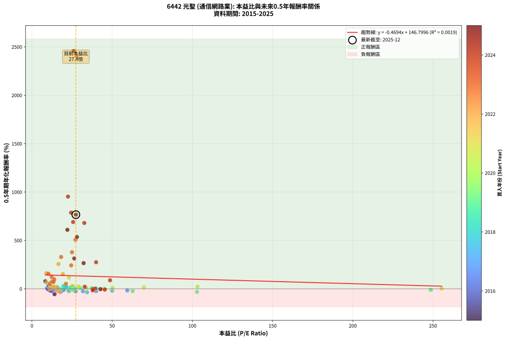
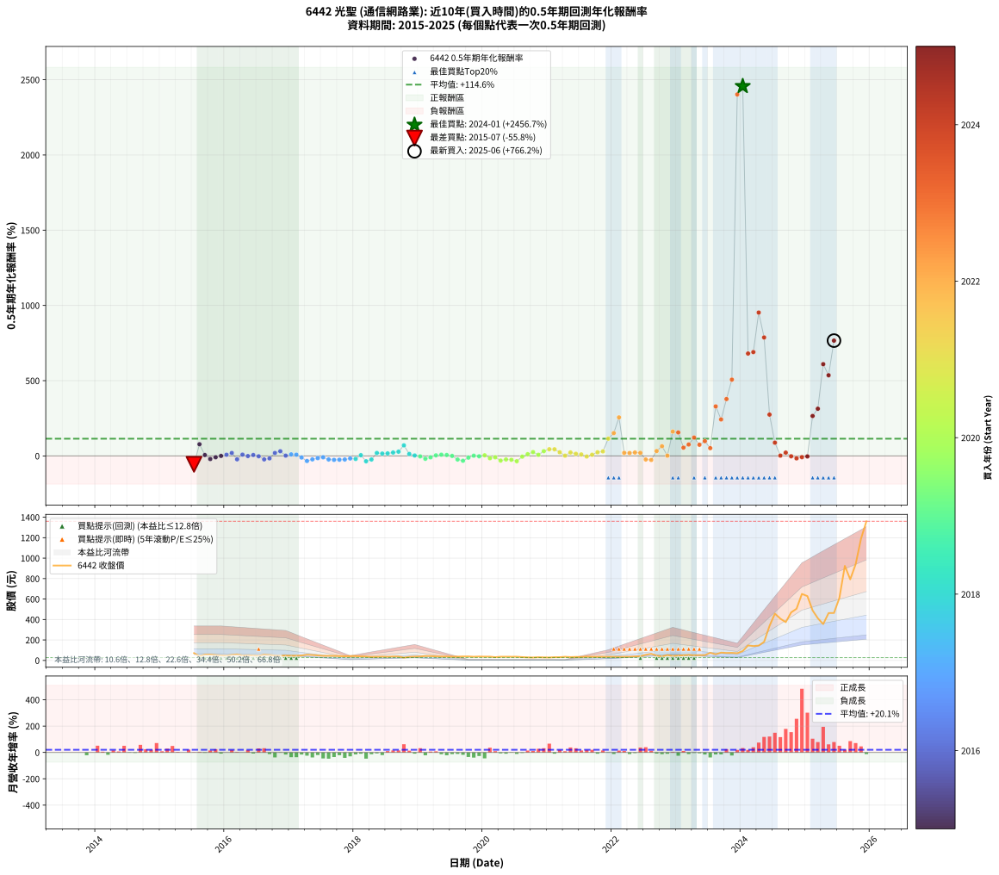

# 6442 光聖 - 本益比與未來報酬率分析

!!! info "報告資訊"
    - **股票代號**: 6442
    - **公司名稱**: 光聖
    - **產業別**: 通信網路業
    - **分析期間**: 2015-2025 (120 個數據點)
    - **資料來源**: Type 12 (ShowMonthlyK_ChartFlow) 月收盤價與本益比
    - **報酬率口徑**: 含現金股利 (簡化: 年度合計，假設每年7/1入帳)
    - **報告生成時間**: 2026-01-04 08:51:21 CST

## 📈 視覺化圖表

### 圖表1: 本益比 vs 未來報酬率關係

*圖表1：6442 光聖 本益比與0.5年期未來報酬率關係 (2015-2025)*

### 圖表2: 歷年買入時點的0.5年期實際報酬率

*圖表2：6442 光聖 歷年買入時點的0.5年期實際報酬率 (2015-2025)*

## 📍 買點訊號說明

本報告提供兩種買點提示訊號（顯示於圖表2的股價子圖中）：

### ▲ 小綠色三角形（回測驗證）
- **計算方式**: 使用全部歷史資料計算本益比第25百分位數
- **用途**: 事後驗證，顯示歷史上哪些時點確實為低估區
- **限制**: 當下無法判斷，僅供回測參考
- **特性**: 後見之明（Look-Ahead Bias）

### ▲ 小橘色三角形（即時訊號）
- **計算方式**: 使用截至當月的過去5年資料計算本益比第25百分位數
- **用途**: 實際投資決策，當時即可判斷
- **優勢**: 可操作性強，符合實務需求
- **特性**: 無後見之明，滾動窗口計算

!!! tip "如何使用兩種訊號"
    - **綠色▲** 幫助理解歷史估值機會，驗證策略有效性
    - **橘色▲** 可作為實際買進參考，但仍需搭配基本面分析
    - 兩種訊號重疊時，表示即時判斷與事後驗證一致，信心度較高
    - 僅有綠色▲時，表示當時無法判斷（需要未來資料才能確認）
    - 僅有橘色▲時，表示即時判斷為買點，但事後可能不是最佳時機

## 📊 估值分析摘要

| 指標 | 數值 |
|:---:|:---:|
| **目前本益比** (2025-06) | **27.38 倍** |
| **歷史平均本益比** | 29.39 倍 |
| **估值水準** | 🟡 合理範圍 |
| **預期0.5年年化報酬率** | **+133.95%** |
| **歷史平均報酬率** | +114.56% |
| **相關係數 (R²)** | 0.0019 |
| **趨勢線斜率** | -0.4694 |

!!! abstract "核心洞察"
    目前本益比接近歷史平均，預期報酬率符合長期趨勢

    根據歷史數據回測，6442 光聖 在目前本益比 **27.4倍** 的估值水準下，
    預期未來0.5年年化報酬率約為 **+133.9%**。

    **重要提醒**: 本分析基於歷史數據統計，實際報酬率會受到公司基本面變化、產業趨勢、
    總體經濟環境等多重因素影響。R² = 0.00 表示本益比可解釋約 0.2% 的報酬率變異。

## 📈 歷史估值統計

### 最佳買點 (最高報酬率)

| 項目 | 數值 |
|:---:|:---:|
| 起始時間 | 2024-01 |
| 當時本益比 | 26.03 倍 |
| 起始價格 | 91.4 元 |
| 0.5年後價格 | 457.5 元 |
| **0.5年年化報酬率** | **+2456.73%** |

### 最差買點 (最低報酬率)

| 項目 | 數值 |
|:---:|:---:|
| 起始時間 | 2015-07 |
| 當時本益比 | 14.10 倍 |
| 起始價格 | 71.2 元 |
| 0.5年後價格 | 47.2 元 |
| **0.5年年化報酬率** | **-55.78%** |

## 🎯 投資啟示

### 本益比與報酬率關係

趨勢線方程式: **y = -0.4694x + 146.7996**

!!! note "負相關"
    本益比與未來報酬率呈現負相關。較低的本益比通常帶來較高的未來報酬率，
    但相關性不算非常強。**估值仍是重要參考指標之一**。

### 估值區間建議

基於歷史數據分析:

- **🟢 低估區** (P/E < 23.5): 預期報酬率較高，可考慮增加持股
- **🟡 合理區** (P/E 23.5-35.3): 預期報酬率符合長期趨勢，正常持有
- **🔴 高估區** (P/E > 35.3): 預期報酬率較低，可考慮減碼或觀望

!!! danger "風險提示"
    - 過去表現不代表未來結果
    - 本分析假設公司基本面無重大結構性變化
    - 產業環境劇變可能使歷史規律失效
    - 應結合公司財報、產業趨勢、總體經濟等多重因素綜合判斷

!!! success "長期投資觀點"
    歷史數據顯示，在合理或低估的估值水準買入並長期持有，
    往往能獲得較佳的投資報酬。**耐心等待好價格**是價值投資的核心原則。

## 📊 數據品質

- **資料來源**: GoodInfo.tw Type 12 (ShowMonthlyK_ChartFlow)
- **資料頻率**: 月度收盤價與本益比
- **回測期間**: 2015-2025
- **數據點數量**: 120 個 (每個點代表一次0.5年期回測)

### 計算方法說明

1. **0.5年期年化報酬率**:
   - 對每個歷史時點，計算其後0.5年的實際投資報酬率
   - 期末價值(不含股利): 期末價格
   - 期末價值(含現金股利): 期末價格 + 持有期間內的現金股利合計 (簡化: 年度合計，假設每年7/1入帳)
   - 公式: 年化報酬率 = [(期末價值/期初價格)^(1/年數) - 1] × 100%

2. **本益比 (P/E Ratio)**:
   - 使用當時的月收盤價與EPS計算
   - 資料來源: Type 12 月度河流圖本益比數據

3. **趨勢線 (Linear Regression)**:
   - 使用最小平方法擬合線性趨勢線
   - R²值衡量本益比對報酬率的解釋能力

---

*本報告由 Stock Analysis System v1.9.0 自動生成*
*數據更新時間: 2026-01-04 08:51:21 CST*

## 📋 月度回測明細表

（每一列對應時間線圖中的一個買入點；可用來對照 SVG 圖上的每個點。）

| 買入月份 | 賣出月份 | 回測期限_年 | 實際持有年數 | 買入本益比_倍 | 買入收盤價_元 | 賣出收盤價_元 | 現金股利合計_元 | 總報酬率_pct | 年化報酬率_pct |
| --- | --- | --- | --- | --- | --- | --- | --- | --- | --- |
| 2015-07 | 2016-01 | 0.5 | 0.504 | 14.10 | 71.20 | 47.20 | 0.00 | -33.71 | -55.78 |
| 2015-08 | 2016-03 | 0.5 | 0.583 | 8.36 | 42.20 | 59.00 | 0.00 | +39.81 | +77.65 |
| 2015-09 | 2016-03 | 0.5 | 0.498 | 11.35 | 57.30 | 59.00 | 0.00 | +2.97 | +6.04 |
| 2015-10 | 2016-05 | 0.5 | 0.583 | 11.45 | 57.80 | 50.50 | 0.00 | -12.63 | -20.67 |
| 2015-11 | 2016-05 | 0.5 | 0.498 | 10.48 | 52.90 | 50.50 | 0.00 | -4.54 | -8.90 |
| 2015-12 | 2016-07 | 0.5 | 0.583 | 9.70 | 49.00 | 46.00 | 3.00 | +0.00 | +0.00 |
| 2016-01 | 2016-07 | 0.5 | 0.498 | 9.45 | 47.20 | 46.00 | 3.00 | +3.81 | +7.80 |
| 2016-02 | 2016-08 | 0.5 | 0.501 | 11.01 | 54.40 | 56.50 | 3.00 | +9.38 | +19.58 |
| 2016-03 | 2016-10 | 0.5 | 0.586 | 12.08 | 59.00 | 47.75 | 3.00 | -13.98 | -22.67 |
| 2016-04 | 2016-10 | 0.5 | 0.501 | 10.07 | 48.65 | 47.75 | 3.00 | +4.32 | +8.80 |
| 2016-05 | 2016-12 | 0.5 | 0.586 | 10.58 | 50.50 | 47.20 | 3.00 | -0.59 | -1.01 |
| 2016-06 | 2016-12 | 0.5 | 0.501 | 10.32 | 48.70 | 47.20 | 3.00 | +3.08 | +6.24 |
| 2016-07 | 2017-01 | 0.5 | 0.504 | 9.86 | 46.00 | 45.45 | 0.00 | -1.20 | -2.36 |
| 2016-08 | 2017-03 | 0.5 | 0.580 | 12.26 | 56.50 | 48.50 | 0.00 | -14.16 | -23.13 |
| 2016-09 | 2017-03 | 0.5 | 0.496 | 11.64 | 53.00 | 48.50 | 0.00 | -8.49 | -16.39 |
| 2016-10 | 2017-05 | 0.5 | 0.580 | 10.61 | 47.75 | 53.00 | 0.00 | +10.99 | +19.69 |
| 2016-11 | 2017-05 | 0.5 | 0.496 | 10.43 | 46.35 | 53.00 | 0.00 | +14.35 | +31.07 |
| 2016-12 | 2017-07 | 0.5 | 0.580 | 10.75 | 47.20 | 44.40 | 3.30 | +1.06 | +1.83 |
| 2017-01 | 2017-07 | 0.5 | 0.496 | 11.13 | 45.45 | 44.40 | 3.30 | +4.95 | +10.24 |
| 2017-02 | 2017-08 | 0.5 | 0.498 | 12.26 | 46.30 | 44.85 | 3.30 | +4.00 | +8.18 |
| 2017-03 | 2017-10 | 0.5 | 0.586 | 13.98 | 48.50 | 42.10 | 3.30 | -6.39 | -10.66 |
| 2017-04 | 2017-10 | 0.5 | 0.501 | 17.64 | 55.80 | 42.10 | 3.30 | -18.64 | -33.75 |
| 2017-05 | 2017-12 | 0.5 | 0.586 | 18.55 | 53.00 | 42.20 | 3.30 | -14.15 | -22.93 |
| 2017-06 | 2017-12 | 0.5 | 0.501 | 19.29 | 49.20 | 42.20 | 3.30 | -7.52 | -14.45 |
| 2017-07 | 2018-01 | 0.5 | 0.504 | 19.79 | 44.40 | 42.30 | 0.00 | -4.73 | -9.17 |
| 2017-08 | 2018-03 | 0.5 | 0.580 | 23.16 | 44.85 | 38.40 | 0.00 | -14.38 | -23.47 |
| 2017-09 | 2018-03 | 0.5 | 0.496 | 27.36 | 44.60 | 38.40 | 0.00 | -13.90 | -26.07 |
| 2017-10 | 2018-05 | 0.5 | 0.580 | 31.81 | 42.10 | 35.60 | 0.00 | -15.44 | -25.09 |
| 2017-11 | 2018-05 | 0.5 | 0.496 | 40.03 | 40.70 | 35.60 | 0.00 | -12.53 | -23.67 |
| 2017-12 | 2018-07 | 0.5 | 0.580 | 59.44 | 42.20 | 35.90 | 2.00 | -10.19 | -16.90 |
| 2018-01 | 2018-07 | 0.5 | 0.496 | 50.01 | 42.30 | 35.90 | 2.00 | -10.40 | -19.88 |
| 2018-02 | 2018-08 | 0.5 | 0.498 | 39.93 | 39.20 | 38.15 | 2.00 | +2.42 | +4.92 |
| 2018-03 | 2018-10 | 0.5 | 0.586 | 34.36 | 38.40 | 27.70 | 2.00 | -22.66 | -35.50 |
| 2018-04 | 2018-10 | 0.5 | 0.501 | 27.13 | 34.00 | 27.70 | 2.00 | -12.65 | -23.65 |
| 2018-05 | 2018-12 | 0.5 | 0.586 | 25.63 | 35.60 | 37.55 | 2.00 | +11.10 | +19.67 |
| 2018-06 | 2018-12 | 0.5 | 0.501 | 24.13 | 36.80 | 37.55 | 2.00 | +7.47 | +15.47 |
| 2018-07 | 2019-01 | 0.5 | 0.504 | 21.62 | 35.90 | 38.80 | 0.00 | +8.08 | +16.67 |
| 2018-08 | 2019-03 | 0.5 | 0.580 | 21.23 | 38.15 | 42.90 | 0.00 | +12.45 | +22.41 |
| 2018-09 | 2019-03 | 0.5 | 0.496 | 19.64 | 37.95 | 42.90 | 0.00 | +13.04 | +28.07 |
| 2018-10 | 2019-05 | 0.5 | 0.580 | 13.39 | 27.70 | 37.70 | 0.00 | +36.10 | +70.07 |
| 2018-11 | 2019-05 | 0.5 | 0.496 | 16.11 | 35.50 | 37.70 | 0.00 | +6.20 | +12.90 |
| 2018-12 | 2019-07 | 0.5 | 0.580 | 16.05 | 37.55 | 36.70 | 1.50 | +1.73 | +3.00 |
| 2019-01 | 2019-07 | 0.5 | 0.496 | 18.29 | 38.80 | 36.70 | 1.50 | -1.55 | -3.10 |
| 2019-02 | 2019-08 | 0.5 | 0.498 | 22.59 | 43.00 | 37.25 | 1.50 | -9.88 | -18.85 |
| 2019-03 | 2019-10 | 0.5 | 0.586 | 25.46 | 42.90 | 38.95 | 1.50 | -5.71 | -9.55 |
| 2019-04 | 2019-10 | 0.5 | 0.501 | 27.07 | 39.70 | 38.95 | 1.50 | +1.89 | +3.81 |
| 2019-05 | 2019-12 | 0.5 | 0.586 | 30.20 | 37.70 | 38.00 | 1.50 | +4.77 | +8.29 |
| 2019-06 | 2019-12 | 0.5 | 0.501 | 37.23 | 38.35 | 38.00 | 1.50 | +3.00 | +6.07 |
| 2019-07 | 2020-01 | 0.5 | 0.504 | 45.22 | 36.70 | 36.70 | 0.00 | +0.00 | +0.00 |
| 2019-08 | 2020-03 | 0.5 | 0.583 | 62.78 | 37.25 | 31.80 | 0.00 | -14.63 | -23.76 |
| 2019-09 | 2020-03 | 0.5 | 0.498 | 102.90 | 38.60 | 31.80 | 0.00 | -17.62 | -32.22 |
| 2019-10 | 2020-05 | 0.5 | 0.583 | 248.60 | 38.95 | 36.30 | 0.00 | -6.80 | -11.38 |
| 2019-11 | 2020-05 | 0.5 | 0.498 |  | 36.05 | 36.30 | 0.00 | +0.69 | +1.40 |
| 2019-12 | 2020-07 | 0.5 | 0.583 |  | 38.00 | 36.10 | 1.36 | -1.42 | -2.42 |
| 2020-01 | 2020-07 | 0.5 | 0.498 |  | 36.70 | 36.10 | 1.36 | +2.07 | +4.20 |
| 2020-02 | 2020-08 | 0.5 | 0.501 |  | 37.00 | 32.70 | 1.36 | -7.95 | -15.23 |
| 2020-03 | 2020-10 | 0.5 | 0.586 |  | 31.80 | 28.70 | 1.36 | -5.47 | -9.16 |
| 2020-04 | 2020-10 | 0.5 | 0.501 |  | 36.20 | 28.70 | 1.36 | -16.96 | -30.99 |
| 2020-05 | 2020-12 | 0.5 | 0.586 |  | 36.30 | 29.70 | 1.36 | -14.44 | -23.36 |
| 2020-06 | 2020-12 | 0.5 | 0.501 |  | 36.00 | 29.70 | 1.36 | -13.72 | -25.52 |
| 2020-07 | 2021-01 | 0.5 | 0.504 |  | 36.10 | 29.00 | 0.00 | -19.67 | -35.26 |
| 2020-08 | 2021-03 | 0.5 | 0.580 |  | 32.70 | 31.75 | 0.00 | -2.91 | -4.95 |
| 2020-09 | 2021-03 | 0.5 | 0.496 |  | 30.10 | 31.75 | 0.00 | +5.48 | +11.37 |
| 2020-10 | 2021-05 | 0.5 | 0.580 |  | 28.70 | 32.75 | 0.00 | +14.11 | +25.54 |
| 2020-11 | 2021-05 | 0.5 | 0.496 |  | 31.60 | 32.75 | 0.00 | +3.64 | +7.48 |
| 2020-12 | 2021-07 | 0.5 | 0.580 |  | 29.70 | 33.80 | 1.00 | +17.17 | +31.39 |
| 2021-01 | 2021-07 | 0.5 | 0.496 |  | 29.00 | 33.80 | 1.00 | +20.00 | +44.47 |
| 2021-02 | 2021-08 | 0.5 | 0.498 |  | 31.75 | 37.10 | 1.00 | +20.00 | +44.18 |
| 2021-03 | 2021-10 | 0.5 | 0.586 |  | 31.75 | 35.05 | 1.00 | +13.54 | +24.21 |
| 2021-04 | 2021-10 | 0.5 | 0.501 | 255.40 | 35.75 | 35.05 | 1.00 | +0.84 | +1.68 |
| 2021-05 | 2021-12 | 0.5 | 0.586 | 103.20 | 32.75 | 35.95 | 1.00 | +12.82 | +22.87 |
| 2021-06 | 2021-12 | 0.5 | 0.501 | 69.80 | 34.55 | 35.95 | 1.00 | +6.95 | +14.34 |
| 2021-07 | 2022-01 | 0.5 | 0.504 | 50.26 | 33.80 | 35.45 | 0.00 | +4.88 | +9.92 |
| 2021-08 | 2022-03 | 0.5 | 0.580 | 43.65 | 37.10 | 36.25 | 0.00 | -2.29 | -3.91 |
| 2021-09 | 2022-03 | 0.5 | 0.496 | 33.97 | 34.90 | 36.25 | 0.00 | +3.87 | +7.96 |
| 2021-10 | 2022-05 | 0.5 | 0.580 | 29.09 | 35.05 | 39.75 | 0.00 | +13.41 | +24.21 |
| 2021-11 | 2022-05 | 0.5 | 0.496 | 25.24 | 34.90 | 39.75 | 0.00 | +13.90 | +30.03 |
| 2021-12 | 2022-07 | 0.5 | 0.580 | 23.04 | 35.95 | 54.80 | 1.20 | +55.77 | +114.60 |
| 2022-01 | 2022-07 | 0.5 | 0.496 | 19.33 | 35.45 | 54.80 | 1.20 | +57.97 | +151.60 |
| 2022-02 | 2022-08 | 0.5 | 0.498 | 16.55 | 34.90 | 64.50 | 1.20 | +88.25 | +255.93 |
| 2022-03 | 2022-10 | 0.5 | 0.586 | 15.22 | 36.25 | 39.20 | 1.20 | +11.45 | +20.32 |
| 2022-04 | 2022-10 | 0.5 | 0.501 | 13.93 | 37.00 | 39.20 | 1.20 | +9.19 | +19.18 |
| 2022-05 | 2022-12 | 0.5 | 0.586 | 13.56 | 39.75 | 43.60 | 1.20 | +12.70 | +22.65 |
| 2022-06 | 2022-12 | 0.5 | 0.501 | 12.75 | 40.85 | 43.60 | 1.20 | +9.67 | +20.23 |
| 2022-07 | 2023-01 | 0.5 | 0.504 | 15.75 | 54.80 | 47.85 | 0.00 | -12.68 | -23.60 |
| 2022-08 | 2023-03 | 0.5 | 0.580 | 17.18 | 64.50 | 53.90 | 0.00 | -16.43 | -26.61 |
| 2022-09 | 2023-03 | 0.5 | 0.496 | 11.64 | 46.90 | 53.90 | 0.00 | +14.93 | +32.41 |
| 2022-10 | 2023-05 | 0.5 | 0.580 | 9.11 | 39.20 | 52.30 | 0.00 | +33.42 | +64.34 |
| 2022-11 | 2023-05 | 0.5 | 0.496 | 11.34 | 51.90 | 52.30 | 0.00 | +0.77 | +1.56 |
| 2022-12 | 2023-07 | 0.5 | 0.580 | 8.99 | 43.60 | 74.10 | 2.10 | +74.77 | +161.66 |
| 2023-01 | 2023-07 | 0.5 | 0.496 | 10.28 | 47.85 | 74.10 | 2.10 | +59.25 | +155.73 |
| 2023-02 | 2023-08 | 0.5 | 0.498 | 11.20 | 50.00 | 60.10 | 2.10 | +24.40 | +54.99 |
| 2023-03 | 2023-10 | 0.5 | 0.586 | 12.62 | 53.90 | 72.90 | 2.10 | +39.15 | +75.74 |
| 2023-04 | 2023-10 | 0.5 | 0.501 | 12.34 | 50.30 | 72.90 | 2.10 | +49.11 | +121.96 |
| 2023-05 | 2023-12 | 0.5 | 0.586 | 13.47 | 52.30 | 70.30 | 2.10 | +38.43 | +74.20 |
| 2023-06 | 2023-12 | 0.5 | 0.501 | 13.93 | 51.40 | 70.30 | 2.10 | +40.86 | +98.13 |
| 2023-07 | 2024-01 | 0.5 | 0.504 | 21.19 | 74.10 | 91.40 | 0.00 | +23.35 | +51.67 |
| 2023-08 | 2024-03 | 0.5 | 0.583 | 18.19 | 60.10 | 140.50 | 0.00 | +133.78 | +328.96 |
| 2023-09 | 2024-03 | 0.5 | 0.498 | 24.47 | 76.10 | 140.50 | 0.00 | +84.63 | +242.30 |
| 2023-10 | 2024-05 | 0.5 | 0.583 | 24.99 | 72.90 | 181.50 | 0.00 | +148.97 | +377.87 |
| 2023-11 | 2024-05 | 0.5 | 0.498 | 27.14 | 73.90 | 181.50 | 0.00 | +145.60 | +506.94 |
| 2023-12 | 2024-07 | 0.5 | 0.583 | 27.79 | 70.30 | 457.50 | 2.10 | +553.77 | +2401.96 |
| 2024-01 | 2024-07 | 0.5 | 0.498 | 26.03 | 91.40 | 457.50 | 2.10 | +402.84 | +2456.73 |
| 2024-02 | 2024-08 | 0.5 | 0.501 | 32.62 | 146.50 | 408.00 | 2.10 | +179.93 | +680.32 |
| 2024-03 | 2024-10 | 0.5 | 0.586 | 25.67 | 140.50 | 469.50 | 2.10 | +235.66 | +689.93 |
| 2024-04 | 2024-10 | 0.5 | 0.501 | 22.47 | 145.00 | 469.50 | 2.10 | +225.24 | +952.72 |
| 2024-05 | 2024-12 | 0.5 | 0.586 | 24.41 | 181.50 | 650.00 | 2.10 | +259.28 | +787.17 |
| 2024-06 | 2024-12 | 0.5 | 0.501 | 39.99 | 336.50 | 650.00 | 2.10 | +93.79 | +274.52 |
| 2024-07 | 2025-01 | 0.5 | 0.504 | 48.69 | 457.50 | 629.00 | 0.00 | +37.49 | +88.13 |
| 2024-08 | 2025-03 | 0.5 | 0.580 | 39.32 | 408.00 | 412.50 | 0.00 | +1.10 | +1.91 |
| 2024-09 | 2025-03 | 0.5 | 0.496 | 32.93 | 374.00 | 412.50 | 0.00 | +10.29 | +21.86 |
| 2024-10 | 2025-05 | 0.5 | 0.580 | 38.05 | 469.50 | 463.00 | 0.00 | -1.38 | -2.37 |
| 2024-11 | 2025-05 | 0.5 | 0.496 | 37.92 | 505.00 | 463.00 | 0.00 | -8.32 | -16.07 |
| 2024-12 | 2025-07 | 0.5 | 0.580 | 45.45 | 650.00 | 610.00 | 8.62 | -4.83 | -8.17 |
| 2025-01 | 2025-07 | 0.5 | 0.496 | 42.67 | 629.00 | 610.00 | 8.62 | -1.65 | -3.30 |
| 2025-02 | 2025-08 | 0.5 | 0.498 | 32.21 | 489.00 | 924.00 | 8.62 | +90.72 | +265.36 |
| 2025-03 | 2025-10 | 0.5 | 0.586 | 26.40 | 412.50 | 939.00 | 8.62 | +129.73 | +313.53 |
| 2025-04 | 2025-10 | 0.5 | 0.501 | 22.10 | 355.00 | 939.00 | 8.62 | +166.94 | +609.69 |
| 2025-05 | 2025-12 | 0.5 | 0.586 | 28.05 | 463.00 | 1360.00 | 8.62 | +195.60 | +535.89 |
| 2025-06 | 2025-12 | 0.5 | 0.501 | 27.38 | 464.00 | 1360.00 | 8.62 | +194.96 | +766.18 |
