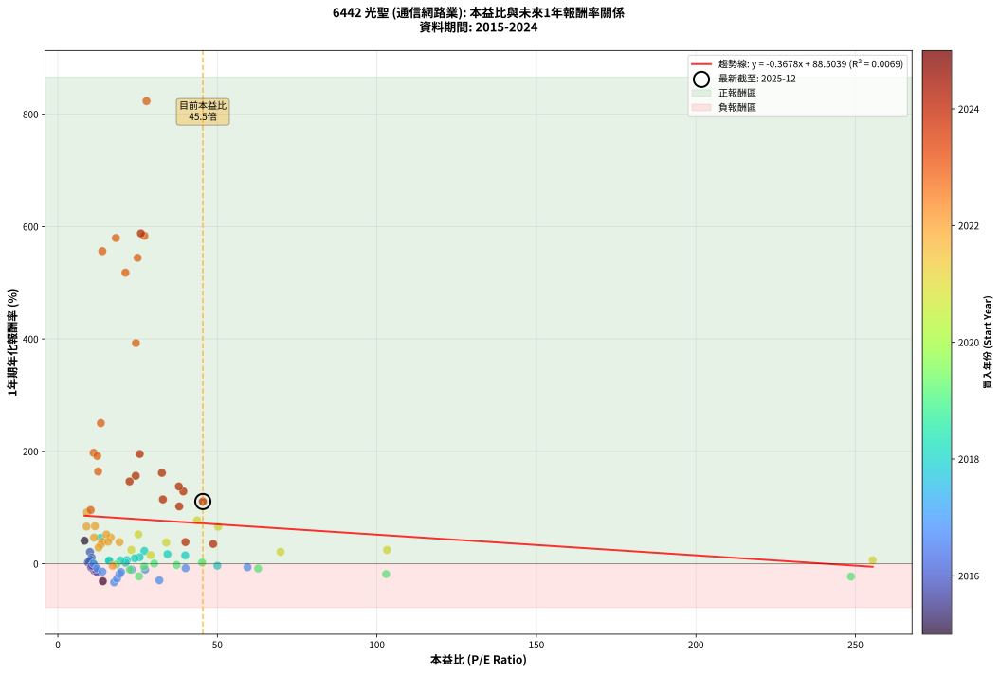
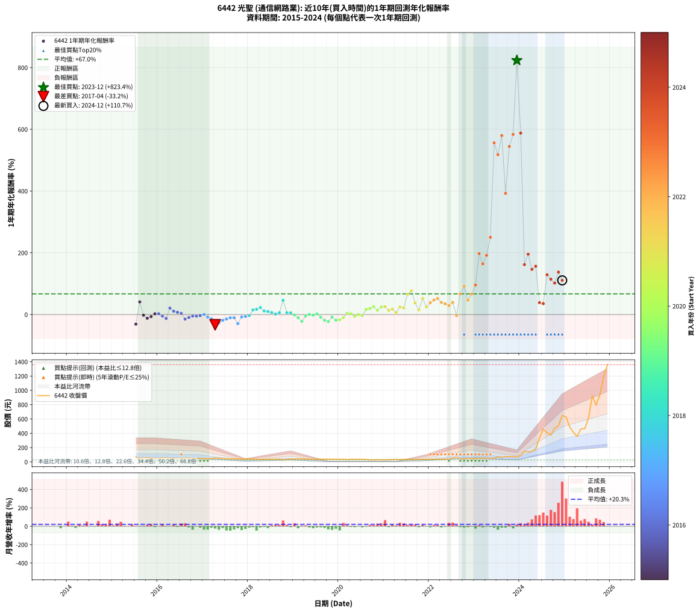

# 6442 光聖 - 本益比與未來報酬率分析

!!! info "報告資訊"
    - **股票代號**: 6442
    - **公司名稱**: 光聖
    - **產業別**: 通信網路業
    - **分析期間**: 2015-2024 (114 個數據點)
    - **資料來源**: Type 12 (ShowMonthlyK_ChartFlow) 月收盤價與本益比
    - **報酬率口徑**: 含現金股利 (簡化: 年度合計，假設每年7/1入帳)
    - **報告生成時間**: 2026-01-10 19:08:22 CST

## 📈 視覺化圖表

### 圖表1: 本益比 vs 未來報酬率關係

*圖表1：6442 光聖 本益比與1年期未來報酬率關係 (2015-2024)*

### 圖表2: 歷年買入時點的1年期實際報酬率

*圖表2：6442 光聖 歷年買入時點的1年期實際報酬率 (2015-2024)*

## 📍 買點訊號說明

本報告提供兩種買點提示訊號（顯示於圖表2的股價子圖中）：

### ▲ 小綠色三角形（回測驗證）
- **計算方式**: 使用全部歷史資料計算本益比第25百分位數
- **用途**: 事後驗證，顯示歷史上哪些時點確實為低估區
- **限制**: 當下無法判斷，僅供回測參考
- **特性**: 後見之明（Look-Ahead Bias）

### ▲ 小橘色三角形（即時訊號）
- **計算方式**: 使用截至當月的過去5年資料計算本益比第25百分位數
- **用途**: 實際投資決策，當時即可判斷
- **優勢**: 可操作性強，符合實務需求
- **特性**: 無後見之明，滾動窗口計算

!!! tip "如何使用兩種訊號"
    - **綠色▲** 幫助理解歷史估值機會，驗證策略有效性
    - **橘色▲** 可作為實際買進參考，但仍需搭配基本面分析
    - 兩種訊號重疊時，表示即時判斷與事後驗證一致，信心度較高
    - 僅有綠色▲時，表示當時無法判斷（需要未來資料才能確認）
    - 僅有橘色▲時，表示即時判斷為買點，但事後可能不是最佳時機

## 📊 估值分析摘要

| 指標 | 數值 |
|:---:|:---:|
| **目前本益比** (2024-12) | **45.45 倍** |
| **歷史平均本益比** | 29.37 倍 |
| **估值水準** | 🔴 相對高估 |
| **預期1年年化報酬率** | **+71.79%** |
| **歷史平均報酬率** | +66.98% |
| **相關係數 (R²)** | 0.0069 |
| **趨勢線斜率** | -0.3678 |

!!! abstract "核心洞察"
    目前本益比顯著高於歷史平均，預期未來報酬率可能較低

    根據歷史數據回測，6442 光聖 在目前本益比 **45.5倍** 的估值水準下，
    預期未來1年年化報酬率約為 **+71.8%**。

    **重要提醒**: 本分析基於歷史數據統計，實際報酬率會受到公司基本面變化、產業趨勢、
    總體經濟環境等多重因素影響。R² = 0.01 表示本益比可解釋約 0.7% 的報酬率變異。

## 📈 歷史估值統計

### 最佳買點 (最高報酬率)

| 項目 | 數值 |
|:---:|:---:|
| 起始時間 | 2023-12 |
| 當時本益比 | 27.79 倍 |
| 起始價格 | 70.3 元 |
| 1年後價格 | 650.0 元 |
| **1年年化報酬率** | **+823.37%** |

### 最差買點 (最低報酬率)

| 項目 | 數值 |
|:---:|:---:|
| 起始時間 | 2017-04 |
| 當時本益比 | 17.64 倍 |
| 起始價格 | 55.8 元 |
| 1年後價格 | 34.0 元 |
| **1年年化報酬率** | **-33.17%** |

## 🎯 投資啟示

### 本益比與報酬率關係

趨勢線方程式: **y = -0.3678x + 88.5039**

!!! note "負相關"
    本益比與未來報酬率呈現負相關。較低的本益比通常帶來較高的未來報酬率，
    但相關性不算非常強。**估值仍是重要參考指標之一**。

### 估值區間建議

基於歷史數據分析:

- **🟢 低估區** (P/E < 23.5): 預期報酬率較高，可考慮增加持股
- **🟡 合理區** (P/E 23.5-35.2): 預期報酬率符合長期趨勢，正常持有
- **🔴 高估區** (P/E > 35.2): 預期報酬率較低，可考慮減碼或觀望

!!! danger "風險提示"
    - 過去表現不代表未來結果
    - 本分析假設公司基本面無重大結構性變化
    - 產業環境劇變可能使歷史規律失效
    - 應結合公司財報、產業趨勢、總體經濟等多重因素綜合判斷

!!! success "長期投資觀點"
    歷史數據顯示，在合理或低估的估值水準買入並長期持有，
    往往能獲得較佳的投資報酬。**耐心等待好價格**是價值投資的核心原則。

## 📊 數據品質

- **資料來源**: GoodInfo.tw Type 12 (ShowMonthlyK_ChartFlow)
- **資料頻率**: 月度收盤價與本益比
- **回測期間**: 2015-2024
- **數據點數量**: 114 個 (每個點代表一次1年期回測)

### 計算方法說明

1. **1年期年化報酬率**:
   - 對每個歷史時點，計算其後1年的實際投資報酬率
   - 期末價值(不含股利): 期末價格
   - 期末價值(含現金股利): 期末價格 + 持有期間內的現金股利合計 (簡化: 年度合計，假設每年7/1入帳)
   - 公式: 年化報酬率 = [(期末價值/期初價格)^(1/年數) - 1] × 100%

2. **本益比 (P/E Ratio)**:
   - 使用當時的月收盤價與EPS計算
   - 資料來源: Type 12 月度河流圖本益比數據

3. **趨勢線 (Linear Regression)**:
   - 使用最小平方法擬合線性趨勢線
   - R²值衡量本益比對報酬率的解釋能力

---

*本報告由 Stock Analysis System v1.9.0 自動生成*
*數據更新時間: 2026-01-10 19:08:22 CST*

## 📋 月度回測明細表

（每一列對應時間線圖中的一個買入點；可用來對照 SVG 圖上的每個點。）

| 買入月份 | 賣出月份 | 回測期限_年 | 實際持有年數 | 買入本益比_倍 | 買入收盤價_元 | 賣出收盤價_元 | 現金股利合計_元 | 總報酬率_pct | 年化報酬率_pct |
| --- | --- | --- | --- | --- | --- | --- | --- | --- | --- |
| 2015-07 | 2016-07 | 1 | 1.002 | 14.10 | 71.20 | 46.00 | 3.00 | -31.18 | -31.13 |
| 2015-08 | 2016-08 | 1 | 1.002 | 8.36 | 42.20 | 56.50 | 3.00 | +41.00 | +40.90 |
| 2015-09 | 2016-09 | 1 | 1.002 | 11.35 | 57.30 | 53.00 | 3.00 | -2.27 | -2.26 |
| 2015-10 | 2016-10 | 1 | 1.002 | 11.45 | 57.80 | 47.75 | 3.00 | -12.20 | -12.17 |
| 2015-11 | 2016-11 | 1 | 1.002 | 10.48 | 52.90 | 46.35 | 3.00 | -6.71 | -6.70 |
| 2015-12 | 2016-12 | 1 | 1.002 | 9.70 | 49.00 | 47.20 | 3.00 | +2.45 | +2.44 |
| 2016-01 | 2017-01 | 1 | 1.002 | 9.45 | 47.20 | 45.45 | 3.00 | +2.65 | +2.64 |
| 2016-02 | 2017-03 | 1 | 1.081 | 11.01 | 54.40 | 48.50 | 3.00 | -5.33 | -4.94 |
| 2016-03 | 2017-03 | 1 | 0.999 | 12.08 | 59.00 | 48.50 | 3.00 | -12.71 | -12.72 |
| 2016-04 | 2017-04 | 1 | 0.999 | 10.07 | 48.65 | 55.80 | 3.00 | +20.86 | +20.88 |
| 2016-05 | 2017-05 | 1 | 0.999 | 10.58 | 50.50 | 53.00 | 3.00 | +10.89 | +10.90 |
| 2016-06 | 2017-06 | 1 | 0.999 | 10.32 | 48.70 | 49.20 | 3.00 | +7.19 | +7.19 |
| 2016-07 | 2017-07 | 1 | 0.999 | 9.86 | 46.00 | 44.40 | 3.30 | +3.70 | +3.70 |
| 2016-08 | 2017-08 | 1 | 0.999 | 12.26 | 56.50 | 44.85 | 3.30 | -14.78 | -14.79 |
| 2016-09 | 2017-09 | 1 | 0.999 | 11.64 | 53.00 | 44.60 | 3.30 | -9.62 | -9.63 |
| 2016-10 | 2017-10 | 1 | 0.999 | 10.61 | 47.75 | 42.10 | 3.30 | -4.92 | -4.92 |
| 2016-11 | 2017-11 | 1 | 0.999 | 10.43 | 46.35 | 40.70 | 3.30 | -5.07 | -5.07 |
| 2016-12 | 2017-12 | 1 | 0.999 | 10.75 | 47.20 | 42.20 | 3.30 | -3.60 | -3.60 |
| 2017-01 | 2018-01 | 1 | 0.999 | 11.13 | 45.45 | 42.30 | 3.30 | +0.33 | +0.33 |
| 2017-02 | 2018-02 | 1 | 0.999 | 12.26 | 46.30 | 39.20 | 3.30 | -8.21 | -8.21 |
| 2017-03 | 2018-03 | 1 | 0.999 | 13.98 | 48.50 | 38.40 | 3.30 | -14.02 | -14.03 |
| 2017-04 | 2018-04 | 1 | 0.999 | 17.64 | 55.80 | 34.00 | 3.30 | -33.15 | -33.17 |
| 2017-05 | 2018-05 | 1 | 0.999 | 18.55 | 53.00 | 35.60 | 3.30 | -26.60 | -26.62 |
| 2017-06 | 2018-06 | 1 | 0.999 | 19.29 | 49.20 | 36.80 | 3.30 | -18.50 | -18.51 |
| 2017-07 | 2018-07 | 1 | 0.999 | 19.79 | 44.40 | 35.90 | 2.00 | -14.64 | -14.65 |
| 2017-08 | 2018-08 | 1 | 0.999 | 23.16 | 44.85 | 38.15 | 2.00 | -10.48 | -10.49 |
| 2017-09 | 2018-09 | 1 | 0.999 | 27.36 | 44.60 | 37.95 | 2.00 | -10.43 | -10.43 |
| 2017-10 | 2018-10 | 1 | 0.999 | 31.81 | 42.10 | 27.70 | 2.00 | -29.45 | -29.47 |
| 2017-11 | 2018-11 | 1 | 0.999 | 40.03 | 40.70 | 35.50 | 2.00 | -7.86 | -7.87 |
| 2017-12 | 2018-12 | 1 | 0.999 | 59.44 | 42.20 | 37.55 | 2.00 | -6.28 | -6.28 |
| 2018-01 | 2019-01 | 1 | 0.999 | 50.01 | 42.30 | 38.80 | 2.00 | -3.55 | -3.55 |
| 2018-02 | 2019-02 | 1 | 0.999 | 39.93 | 39.20 | 43.00 | 2.00 | +14.80 | +14.81 |
| 2018-03 | 2019-03 | 1 | 0.999 | 34.36 | 38.40 | 42.90 | 2.00 | +16.93 | +16.94 |
| 2018-04 | 2019-04 | 1 | 0.999 | 27.13 | 34.00 | 39.70 | 2.00 | +22.65 | +22.66 |
| 2018-05 | 2019-05 | 1 | 0.999 | 25.63 | 35.60 | 37.70 | 2.00 | +11.52 | +11.53 |
| 2018-06 | 2019-06 | 1 | 0.999 | 24.13 | 36.80 | 38.35 | 2.00 | +9.65 | +9.65 |
| 2018-07 | 2019-07 | 1 | 0.999 | 21.62 | 35.90 | 36.70 | 1.50 | +6.41 | +6.41 |
| 2018-08 | 2019-08 | 1 | 0.999 | 21.23 | 38.15 | 37.25 | 1.50 | +1.57 | +1.57 |
| 2018-09 | 2019-09 | 1 | 0.999 | 19.64 | 37.95 | 38.60 | 1.50 | +5.67 | +5.67 |
| 2018-10 | 2019-10 | 1 | 0.999 | 13.39 | 27.70 | 38.95 | 1.50 | +46.03 | +46.07 |
| 2018-11 | 2019-11 | 1 | 0.999 | 16.11 | 35.50 | 36.05 | 1.50 | +5.77 | +5.78 |
| 2018-12 | 2019-12 | 1 | 0.999 | 16.05 | 37.55 | 38.00 | 1.50 | +5.19 | +5.20 |
| 2019-01 | 2020-01 | 1 | 0.999 | 18.29 | 38.80 | 36.70 | 1.50 | -1.55 | -1.55 |
| 2019-02 | 2020-02 | 1 | 0.999 | 22.59 | 43.00 | 37.00 | 1.50 | -10.47 | -10.47 |
| 2019-03 | 2020-03 | 1 | 1.002 | 25.46 | 42.90 | 31.80 | 1.50 | -22.38 | -22.34 |
| 2019-04 | 2020-04 | 1 | 1.002 | 27.07 | 39.70 | 36.20 | 1.50 | -5.04 | -5.03 |
| 2019-05 | 2020-05 | 1 | 1.002 | 30.20 | 37.70 | 36.30 | 1.50 | +0.27 | +0.26 |
| 2019-06 | 2020-06 | 1 | 1.002 | 37.23 | 38.35 | 36.00 | 1.50 | -2.22 | -2.21 |
| 2019-07 | 2020-07 | 1 | 1.002 | 45.22 | 36.70 | 36.10 | 1.36 | +2.07 | +2.07 |
| 2019-08 | 2020-08 | 1 | 1.002 | 62.78 | 37.25 | 32.70 | 1.36 | -8.56 | -8.55 |
| 2019-09 | 2020-09 | 1 | 1.002 | 102.90 | 38.60 | 30.10 | 1.36 | -18.50 | -18.46 |
| 2019-10 | 2020-10 | 1 | 1.002 | 248.60 | 38.95 | 28.70 | 1.36 | -22.82 | -22.78 |
| 2019-11 | 2020-11 | 1 | 1.002 |  | 36.05 | 31.60 | 1.36 | -8.57 | -8.55 |
| 2019-12 | 2020-12 | 1 | 1.002 |  | 38.00 | 29.70 | 1.36 | -18.26 | -18.23 |
| 2020-01 | 2021-01 | 1 | 1.002 |  | 36.70 | 29.00 | 1.36 | -17.28 | -17.24 |
| 2020-02 | 2021-03 | 1 | 1.081 |  | 37.00 | 31.75 | 1.36 | -10.51 | -9.76 |
| 2020-03 | 2021-03 | 1 | 0.999 |  | 31.80 | 31.75 | 1.36 | +4.12 | +4.12 |
| 2020-04 | 2021-04 | 1 | 0.999 |  | 36.20 | 35.75 | 1.36 | +2.51 | +2.52 |
| 2020-05 | 2021-05 | 1 | 0.999 |  | 36.30 | 32.75 | 1.36 | -6.03 | -6.04 |
| 2020-06 | 2021-06 | 1 | 0.999 |  | 36.00 | 34.55 | 1.36 | -0.25 | -0.25 |
| 2020-07 | 2021-07 | 1 | 0.999 |  | 36.10 | 33.80 | 1.00 | -3.60 | -3.60 |
| 2020-08 | 2021-08 | 1 | 0.999 |  | 32.70 | 37.10 | 1.00 | +16.51 | +16.53 |
| 2020-09 | 2021-09 | 1 | 0.999 |  | 30.10 | 34.90 | 1.00 | +19.27 | +19.28 |
| 2020-10 | 2021-10 | 1 | 0.999 |  | 28.70 | 35.05 | 1.00 | +25.61 | +25.63 |
| 2020-11 | 2021-11 | 1 | 0.999 |  | 31.60 | 34.90 | 1.00 | +13.61 | +13.62 |
| 2020-12 | 2021-12 | 1 | 0.999 |  | 29.70 | 35.95 | 1.00 | +24.41 | +24.43 |
| 2021-01 | 2022-01 | 1 | 0.999 |  | 29.00 | 35.45 | 1.00 | +25.69 | +25.71 |
| 2021-02 | 2022-02 | 1 | 0.999 |  | 31.75 | 34.90 | 1.00 | +13.07 | +13.08 |
| 2021-03 | 2022-03 | 1 | 0.999 |  | 31.75 | 36.25 | 1.00 | +17.32 | +17.34 |
| 2021-04 | 2022-04 | 1 | 0.999 | 255.40 | 35.75 | 37.00 | 1.00 | +6.29 | +6.30 |
| 2021-05 | 2022-05 | 1 | 0.999 | 103.20 | 32.75 | 39.75 | 1.00 | +24.43 | +24.45 |
| 2021-06 | 2022-06 | 1 | 0.999 | 69.80 | 34.55 | 40.85 | 1.00 | +21.13 | +21.14 |
| 2021-07 | 2022-07 | 1 | 0.999 | 50.26 | 33.80 | 54.80 | 1.20 | +65.68 | +65.74 |
| 2021-08 | 2022-08 | 1 | 0.999 | 43.65 | 37.10 | 64.50 | 1.20 | +77.09 | +77.16 |
| 2021-09 | 2022-09 | 1 | 0.999 | 33.97 | 34.90 | 46.90 | 1.20 | +37.82 | +37.85 |
| 2021-10 | 2022-10 | 1 | 0.999 | 29.09 | 35.05 | 39.20 | 1.20 | +15.26 | +15.28 |
| 2021-11 | 2022-11 | 1 | 0.999 | 25.24 | 34.90 | 51.90 | 1.20 | +52.15 | +52.19 |
| 2021-12 | 2022-12 | 1 | 0.999 | 23.04 | 35.95 | 43.60 | 1.20 | +24.62 | +24.64 |
| 2022-01 | 2023-01 | 1 | 0.999 | 19.33 | 35.45 | 47.85 | 1.20 | +38.36 | +38.39 |
| 2022-02 | 2023-02 | 1 | 0.999 | 16.55 | 34.90 | 50.00 | 1.20 | +46.70 | +46.74 |
| 2022-03 | 2023-03 | 1 | 0.999 | 15.22 | 36.25 | 53.90 | 1.20 | +52.00 | +52.04 |
| 2022-04 | 2023-04 | 1 | 0.999 | 13.93 | 37.00 | 50.30 | 1.20 | +39.19 | +39.22 |
| 2022-05 | 2023-05 | 1 | 0.999 | 13.56 | 39.75 | 52.30 | 1.20 | +34.59 | +34.62 |
| 2022-06 | 2023-06 | 1 | 0.999 | 12.75 | 40.85 | 51.40 | 1.20 | +28.76 | +28.79 |
| 2022-07 | 2023-07 | 1 | 0.999 | 15.75 | 54.80 | 74.10 | 2.10 | +39.05 | +39.08 |
| 2022-08 | 2023-08 | 1 | 0.999 | 17.18 | 64.50 | 60.10 | 2.10 | -3.57 | -3.57 |
| 2022-09 | 2023-09 | 1 | 0.999 | 11.64 | 46.90 | 76.10 | 2.10 | +66.74 | +66.80 |
| 2022-10 | 2023-10 | 1 | 0.999 | 9.11 | 39.20 | 72.90 | 2.10 | +91.33 | +91.41 |
| 2022-11 | 2023-11 | 1 | 0.999 | 11.34 | 51.90 | 73.90 | 2.10 | +46.44 | +46.47 |
| 2022-12 | 2023-12 | 1 | 0.999 | 8.99 | 43.60 | 70.30 | 2.10 | +66.06 | +66.11 |
| 2023-01 | 2024-01 | 1 | 0.999 | 10.28 | 47.85 | 91.40 | 2.10 | +95.40 | +95.49 |
| 2023-02 | 2024-02 | 1 | 0.999 | 11.20 | 50.00 | 146.50 | 2.10 | +197.20 | +197.42 |
| 2023-03 | 2024-03 | 1 | 1.002 | 12.62 | 53.90 | 140.50 | 2.10 | +164.56 | +164.04 |
| 2023-04 | 2024-04 | 1 | 1.002 | 12.34 | 50.30 | 145.00 | 2.10 | +192.45 | +191.80 |
| 2023-05 | 2024-05 | 1 | 1.002 | 13.47 | 52.30 | 181.50 | 2.10 | +251.05 | +250.15 |
| 2023-06 | 2024-06 | 1 | 1.002 | 13.93 | 51.40 | 336.50 | 2.10 | +558.75 | +556.21 |
| 2023-07 | 2024-07 | 1 | 1.002 | 21.19 | 74.10 | 457.50 | 2.10 | +520.24 | +517.93 |
| 2023-08 | 2024-08 | 1 | 1.002 | 18.19 | 60.10 | 408.00 | 2.10 | +582.36 | +579.68 |
| 2023-09 | 2024-09 | 1 | 1.002 | 24.47 | 76.10 | 374.00 | 2.10 | +394.22 | +392.60 |
| 2023-10 | 2024-10 | 1 | 1.002 | 24.99 | 72.90 | 469.50 | 2.10 | +546.91 | +544.44 |
| 2023-11 | 2024-11 | 1 | 1.002 | 27.14 | 73.90 | 505.00 | 2.10 | +586.20 | +583.49 |
| 2023-12 | 2024-12 | 1 | 1.002 | 27.79 | 70.30 | 650.00 | 2.10 | +827.60 | +823.37 |
| 2024-01 | 2025-01 | 1 | 1.002 | 26.03 | 91.40 | 629.00 | 2.10 | +590.48 | +587.75 |
| 2024-02 | 2025-03 | 1 | 1.081 | 32.62 | 146.50 | 412.50 | 2.10 | +183.00 | +161.68 |
| 2024-03 | 2025-03 | 1 | 0.999 | 25.67 | 140.50 | 412.50 | 2.10 | +195.09 | +195.31 |
| 2024-04 | 2025-04 | 1 | 0.999 | 22.47 | 145.00 | 355.00 | 2.10 | +146.28 | +146.43 |
| 2024-05 | 2025-05 | 1 | 0.999 | 24.41 | 181.50 | 463.00 | 2.10 | +156.25 | +156.42 |
| 2024-06 | 2025-06 | 1 | 0.999 | 39.99 | 336.50 | 464.00 | 2.10 | +38.51 | +38.55 |
| 2024-07 | 2025-07 | 1 | 0.999 | 48.69 | 457.50 | 610.00 | 8.62 | +35.22 | +35.25 |
| 2024-08 | 2025-08 | 1 | 0.999 | 39.32 | 408.00 | 924.00 | 8.62 | +128.58 | +128.71 |
| 2024-09 | 2025-09 | 1 | 0.999 | 32.93 | 374.00 | 793.00 | 8.62 | +114.34 | +114.45 |
| 2024-10 | 2025-10 | 1 | 0.999 | 38.05 | 469.50 | 939.00 | 8.62 | +101.84 | +101.93 |
| 2024-11 | 2025-11 | 1 | 0.999 | 37.92 | 505.00 | 1190.00 | 8.62 | +137.35 | +137.49 |
| 2024-12 | 2025-12 | 1 | 0.999 | 45.45 | 650.00 | 1360.00 | 8.62 | +110.56 | +110.66 |
