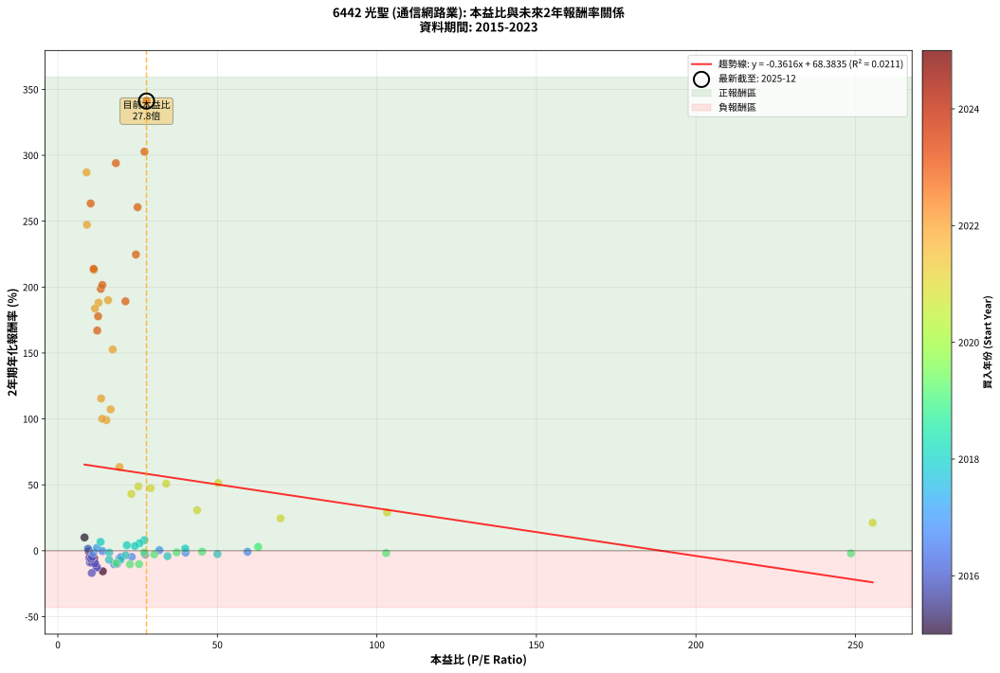
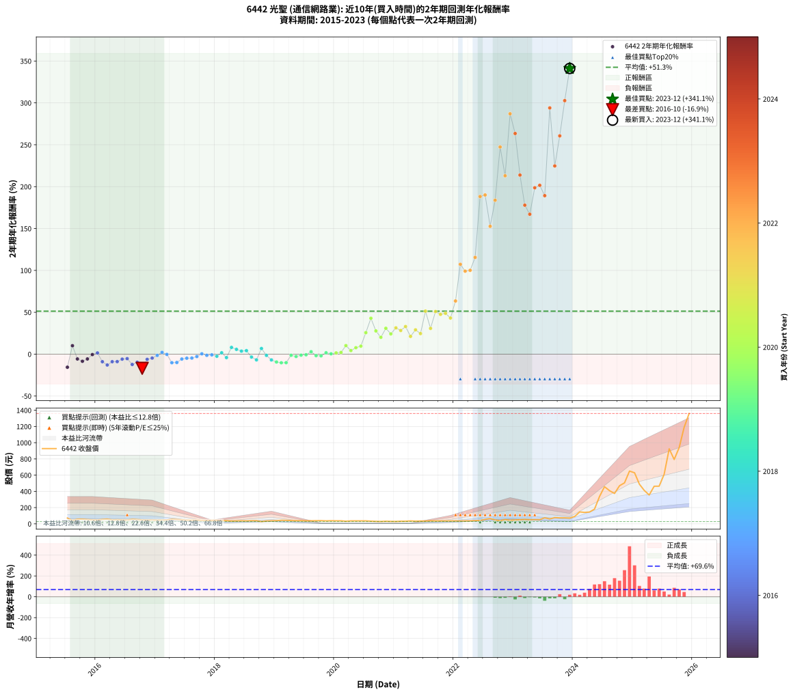

# 6442 光聖 - 本益比與未來報酬率分析

!!! info "報告資訊"
    - **股票代號**: 6442
    - **公司名稱**: 光聖
    - **產業別**: 通信網路業
    - **分析期間**: 2015-2023 (102 個數據點)
    - **資料來源**: Type 12 (ShowMonthlyK_ChartFlow) 月收盤價與本益比
    - **報酬率口徑**: 含現金股利 (簡化: 年度合計，假設每年7/1入帳)
    - **報告生成時間**: 2026-01-07 21:18:21 CST

## 📈 視覺化圖表

### 圖表1: 本益比 vs 未來報酬率關係

*圖表1：6442 光聖 本益比與2年期未來報酬率關係 (2015-2023)*

### 圖表2: 歷年買入時點的2年期實際報酬率

*圖表2：6442 光聖 歷年買入時點的2年期實際報酬率 (2015-2023)*

## 📍 買點訊號說明

本報告提供兩種買點提示訊號（顯示於圖表2的股價子圖中）：

### ▲ 小綠色三角形（回測驗證）
- **計算方式**: 使用全部歷史資料計算本益比第25百分位數
- **用途**: 事後驗證，顯示歷史上哪些時點確實為低估區
- **限制**: 當下無法判斷，僅供回測參考
- **特性**: 後見之明（Look-Ahead Bias）

### ▲ 小橘色三角形（即時訊號）
- **計算方式**: 使用截至當月的過去5年資料計算本益比第25百分位數
- **用途**: 實際投資決策，當時即可判斷
- **優勢**: 可操作性強，符合實務需求
- **特性**: 無後見之明，滾動窗口計算

!!! tip "如何使用兩種訊號"
    - **綠色▲** 幫助理解歷史估值機會，驗證策略有效性
    - **橘色▲** 可作為實際買進參考，但仍需搭配基本面分析
    - 兩種訊號重疊時，表示即時判斷與事後驗證一致，信心度較高
    - 僅有綠色▲時，表示當時無法判斷（需要未來資料才能確認）
    - 僅有橘色▲時，表示即時判斷為買點，但事後可能不是最佳時機

## 📊 估值分析摘要

| 指標 | 數值 |
|:---:|:---:|
| **目前本益比** (2023-12) | **27.79 倍** |
| **歷史平均本益比** | 28.65 倍 |
| **估值水準** | 🟡 合理範圍 |
| **預期2年年化報酬率** | **+58.33%** |
| **歷史平均報酬率** | +51.31% |
| **相關係數 (R²)** | 0.0211 |
| **趨勢線斜率** | -0.3616 |

!!! abstract "核心洞察"
    目前本益比接近歷史平均，預期報酬率符合長期趨勢

    根據歷史數據回測，6442 光聖 在目前本益比 **27.8倍** 的估值水準下，
    預期未來2年年化報酬率約為 **+58.3%**。

    **重要提醒**: 本分析基於歷史數據統計，實際報酬率會受到公司基本面變化、產業趨勢、
    總體經濟環境等多重因素影響。R² = 0.02 表示本益比可解釋約 2.1% 的報酬率變異。

## 📈 歷史估值統計

### 最佳買點 (最高報酬率)

| 項目 | 數值 |
|:---:|:---:|
| 起始時間 | 2023-12 |
| 當時本益比 | 27.79 倍 |
| 起始價格 | 70.3 元 |
| 2年後價格 | 1360.0 元 |
| **2年年化報酬率** | **+341.12%** |

### 最差買點 (最低報酬率)

| 項目 | 數值 |
|:---:|:---:|
| 起始時間 | 2016-10 |
| 當時本益比 | 10.61 倍 |
| 起始價格 | 47.8 元 |
| 2年後價格 | 27.7 元 |
| **2年年化報酬率** | **-16.88%** |

## 🎯 投資啟示

### 本益比與報酬率關係

趨勢線方程式: **y = -0.3616x + 68.3835**

!!! note "負相關"
    本益比與未來報酬率呈現負相關。較低的本益比通常帶來較高的未來報酬率，
    但相關性不算非常強。**估值仍是重要參考指標之一**。

### 估值區間建議

基於歷史數據分析:

- **🟢 低估區** (P/E < 22.9): 預期報酬率較高，可考慮增加持股
- **🟡 合理區** (P/E 22.9-34.4): 預期報酬率符合長期趨勢，正常持有
- **🔴 高估區** (P/E > 34.4): 預期報酬率較低，可考慮減碼或觀望

!!! danger "風險提示"
    - 過去表現不代表未來結果
    - 本分析假設公司基本面無重大結構性變化
    - 產業環境劇變可能使歷史規律失效
    - 應結合公司財報、產業趨勢、總體經濟等多重因素綜合判斷

!!! success "長期投資觀點"
    歷史數據顯示，在合理或低估的估值水準買入並長期持有，
    往往能獲得較佳的投資報酬。**耐心等待好價格**是價值投資的核心原則。

## 📊 數據品質

- **資料來源**: GoodInfo.tw Type 12 (ShowMonthlyK_ChartFlow)
- **資料頻率**: 月度收盤價與本益比
- **回測期間**: 2015-2023
- **數據點數量**: 102 個 (每個點代表一次2年期回測)

### 計算方法說明

1. **2年期年化報酬率**:
   - 對每個歷史時點，計算其後2年的實際投資報酬率
   - 期末價值(不含股利): 期末價格
   - 期末價值(含現金股利): 期末價格 + 持有期間內的現金股利合計 (簡化: 年度合計，假設每年7/1入帳)
   - 公式: 年化報酬率 = [(期末價值/期初價格)^(1/年數) - 1] × 100%

2. **本益比 (P/E Ratio)**:
   - 使用當時的月收盤價與EPS計算
   - 資料來源: Type 12 月度河流圖本益比數據

3. **趨勢線 (Linear Regression)**:
   - 使用最小平方法擬合線性趨勢線
   - R²值衡量本益比對報酬率的解釋能力

---

*本報告由 Stock Analysis System v1.9.0 自動生成*
*數據更新時間: 2026-01-07 21:18:21 CST*

## 📋 月度回測明細表

（每一列對應時間線圖中的一個買入點；可用來對照 SVG 圖上的每個點。）

| 買入月份 | 賣出月份 | 回測期限_年 | 實際持有年數 | 買入本益比_倍 | 買入收盤價_元 | 賣出收盤價_元 | 現金股利合計_元 | 總報酬率_pct | 年化報酬率_pct |
| --- | --- | --- | --- | --- | --- | --- | --- | --- | --- |
| 2015-07 | 2017-07 | 2 | 2.001 | 14.10 | 71.20 | 44.40 | 6.30 | -28.79 | -15.61 |
| 2015-08 | 2017-08 | 2 | 2.001 | 8.36 | 42.20 | 44.85 | 6.30 | +21.21 | +10.09 |
| 2015-09 | 2017-09 | 2 | 2.001 | 11.35 | 57.30 | 44.60 | 6.30 | -11.17 | -5.75 |
| 2015-10 | 2017-10 | 2 | 2.001 | 11.45 | 57.80 | 42.10 | 6.30 | -16.26 | -8.49 |
| 2015-11 | 2017-11 | 2 | 2.001 | 10.48 | 52.90 | 40.70 | 6.30 | -11.15 | -5.74 |
| 2015-12 | 2017-12 | 2 | 2.001 | 9.70 | 49.00 | 42.20 | 6.30 | -1.02 | -0.51 |
| 2016-01 | 2018-01 | 2 | 2.001 | 9.45 | 47.20 | 42.30 | 6.30 | +2.97 | +1.47 |
| 2016-02 | 2018-03 | 2 | 2.081 | 11.01 | 54.40 | 38.40 | 6.30 | -17.83 | -9.01 |
| 2016-03 | 2018-03 | 2 | 1.999 | 12.08 | 59.00 | 38.40 | 6.30 | -24.24 | -12.97 |
| 2016-04 | 2018-04 | 2 | 1.999 | 10.07 | 48.65 | 34.00 | 6.30 | -17.16 | -8.99 |
| 2016-05 | 2018-05 | 2 | 1.999 | 10.58 | 50.50 | 35.60 | 6.30 | -17.03 | -8.92 |
| 2016-06 | 2018-06 | 2 | 1.999 | 10.32 | 48.70 | 36.80 | 6.30 | -11.50 | -5.93 |
| 2016-07 | 2018-07 | 2 | 1.999 | 9.86 | 46.00 | 35.90 | 5.30 | -10.43 | -5.36 |
| 2016-08 | 2018-08 | 2 | 1.999 | 12.26 | 56.50 | 38.15 | 5.30 | -23.10 | -12.31 |
| 2016-09 | 2018-09 | 2 | 1.999 | 11.64 | 53.00 | 37.95 | 5.30 | -18.40 | -9.67 |
| 2016-10 | 2018-10 | 2 | 1.999 | 10.61 | 47.75 | 27.70 | 5.30 | -30.89 | -16.88 |
| 2016-11 | 2018-11 | 2 | 1.999 | 10.43 | 46.35 | 35.50 | 5.30 | -11.97 | -6.18 |
| 2016-12 | 2018-12 | 2 | 1.999 | 10.75 | 47.20 | 37.55 | 5.30 | -9.22 | -4.72 |
| 2017-01 | 2019-01 | 2 | 1.999 | 11.13 | 45.45 | 38.80 | 5.30 | -2.97 | -1.50 |
| 2017-02 | 2019-02 | 2 | 1.999 | 12.26 | 46.30 | 43.00 | 5.30 | +4.32 | +2.14 |
| 2017-03 | 2019-03 | 2 | 1.999 | 13.98 | 48.50 | 42.90 | 5.30 | -0.62 | -0.31 |
| 2017-04 | 2019-04 | 2 | 1.999 | 17.64 | 55.80 | 39.70 | 5.30 | -19.35 | -10.20 |
| 2017-05 | 2019-05 | 2 | 1.999 | 18.55 | 53.00 | 37.70 | 5.30 | -18.87 | -9.93 |
| 2017-06 | 2019-06 | 2 | 1.999 | 19.29 | 49.20 | 38.35 | 5.30 | -11.28 | -5.81 |
| 2017-07 | 2019-07 | 2 | 1.999 | 19.79 | 44.40 | 36.70 | 3.50 | -9.46 | -4.85 |
| 2017-08 | 2019-08 | 2 | 1.999 | 23.16 | 44.85 | 37.25 | 3.50 | -9.14 | -4.68 |
| 2017-09 | 2019-09 | 2 | 1.999 | 27.36 | 44.60 | 38.60 | 3.50 | -5.61 | -2.85 |
| 2017-10 | 2019-10 | 2 | 1.999 | 31.81 | 42.10 | 38.95 | 3.50 | +0.83 | +0.42 |
| 2017-11 | 2019-11 | 2 | 1.999 | 40.03 | 40.70 | 36.05 | 3.50 | -2.83 | -1.42 |
| 2017-12 | 2019-12 | 2 | 1.999 | 59.44 | 42.20 | 38.00 | 3.50 | -1.66 | -0.83 |
| 2018-01 | 2020-01 | 2 | 1.999 | 50.01 | 42.30 | 36.70 | 3.50 | -4.96 | -2.52 |
| 2018-02 | 2020-02 | 2 | 1.999 | 39.93 | 39.20 | 37.00 | 3.50 | +3.32 | +1.65 |
| 2018-03 | 2020-03 | 2 | 2.001 | 34.36 | 38.40 | 31.80 | 3.50 | -8.07 | -4.12 |
| 2018-04 | 2020-04 | 2 | 2.001 | 27.13 | 34.00 | 36.20 | 3.50 | +16.76 | +8.05 |
| 2018-05 | 2020-05 | 2 | 2.001 | 25.63 | 35.60 | 36.30 | 3.50 | +11.80 | +5.73 |
| 2018-06 | 2020-06 | 2 | 2.001 | 24.13 | 36.80 | 36.00 | 3.50 | +7.34 | +3.60 |
| 2018-07 | 2020-07 | 2 | 2.001 | 21.62 | 35.90 | 36.10 | 2.86 | +8.52 | +4.17 |
| 2018-08 | 2020-08 | 2 | 2.001 | 21.23 | 38.15 | 32.70 | 2.86 | -6.79 | -3.45 |
| 2018-09 | 2020-09 | 2 | 2.001 | 19.64 | 37.95 | 30.10 | 2.86 | -13.15 | -6.80 |
| 2018-10 | 2020-10 | 2 | 2.001 | 13.39 | 27.70 | 28.70 | 2.86 | +13.94 | +6.74 |
| 2018-11 | 2020-11 | 2 | 2.001 | 16.11 | 35.50 | 31.60 | 2.86 | -2.93 | -1.47 |
| 2018-12 | 2020-12 | 2 | 2.001 | 16.05 | 37.55 | 29.70 | 2.86 | -13.29 | -6.88 |
| 2019-01 | 2021-01 | 2 | 2.001 | 18.29 | 38.80 | 29.00 | 2.86 | -17.89 | -9.38 |
| 2019-02 | 2021-02 | 2 | 2.001 | 22.59 | 43.00 | 31.75 | 2.86 | -19.51 | -10.28 |
| 2019-03 | 2021-03 | 2 | 2.001 | 25.46 | 42.90 | 31.75 | 2.86 | -19.32 | -10.17 |
| 2019-04 | 2021-04 | 2 | 2.001 | 27.07 | 39.70 | 35.75 | 2.86 | -2.75 | -1.38 |
| 2019-05 | 2021-05 | 2 | 2.001 | 30.20 | 37.70 | 32.75 | 2.86 | -5.54 | -2.81 |
| 2019-06 | 2021-06 | 2 | 2.001 | 37.23 | 38.35 | 34.55 | 2.86 | -2.45 | -1.23 |
| 2019-07 | 2021-07 | 2 | 2.001 | 45.22 | 36.70 | 33.80 | 2.36 | -1.47 | -0.74 |
| 2019-08 | 2021-08 | 2 | 2.001 | 62.78 | 37.25 | 37.10 | 2.36 | +5.93 | +2.92 |
| 2019-09 | 2021-09 | 2 | 2.001 | 102.90 | 38.60 | 34.90 | 2.36 | -3.47 | -1.75 |
| 2019-10 | 2021-10 | 2 | 2.001 | 248.60 | 38.95 | 35.05 | 2.36 | -3.95 | -2.00 |
| 2019-11 | 2021-11 | 2 | 2.001 |  | 36.05 | 34.90 | 2.36 | +3.36 | +1.66 |
| 2019-12 | 2021-12 | 2 | 2.001 |  | 38.00 | 35.95 | 2.36 | +0.82 | +0.41 |
| 2020-01 | 2022-01 | 2 | 2.001 |  | 36.70 | 35.45 | 2.36 | +3.02 | +1.50 |
| 2020-02 | 2022-03 | 2 | 2.081 |  | 37.00 | 36.25 | 2.36 | +4.35 | +2.07 |
| 2020-03 | 2022-03 | 2 | 1.999 |  | 31.80 | 36.25 | 2.36 | +21.42 | +10.20 |
| 2020-04 | 2022-04 | 2 | 1.999 |  | 36.20 | 37.00 | 2.36 | +8.73 | +4.28 |
| 2020-05 | 2022-05 | 2 | 1.999 |  | 36.30 | 39.75 | 2.36 | +16.01 | +7.71 |
| 2020-06 | 2022-06 | 2 | 1.999 |  | 36.00 | 40.85 | 2.36 | +20.03 | +9.56 |
| 2020-07 | 2022-07 | 2 | 1.999 |  | 36.10 | 54.80 | 2.20 | +57.89 | +25.68 |
| 2020-08 | 2022-08 | 2 | 1.999 |  | 32.70 | 64.50 | 2.20 | +103.98 | +42.85 |
| 2020-09 | 2022-09 | 2 | 1.999 |  | 30.10 | 46.90 | 2.20 | +63.12 | +27.74 |
| 2020-10 | 2022-10 | 2 | 1.999 |  | 28.70 | 39.20 | 2.20 | +44.25 | +20.12 |
| 2020-11 | 2022-11 | 2 | 1.999 |  | 31.60 | 51.90 | 2.20 | +71.20 | +30.87 |
| 2020-12 | 2022-12 | 2 | 1.999 |  | 29.70 | 43.60 | 2.20 | +54.21 | +24.20 |
| 2021-01 | 2023-01 | 2 | 1.999 |  | 29.00 | 47.85 | 2.20 | +72.59 | +31.40 |
| 2021-02 | 2023-02 | 2 | 1.999 |  | 31.75 | 50.00 | 2.20 | +64.41 | +28.24 |
| 2021-03 | 2023-03 | 2 | 1.999 |  | 31.75 | 53.90 | 2.20 | +76.69 | +32.95 |
| 2021-04 | 2023-04 | 2 | 1.999 | 255.40 | 35.75 | 50.30 | 2.20 | +46.85 | +21.20 |
| 2021-05 | 2023-05 | 2 | 1.999 | 103.20 | 32.75 | 52.30 | 2.20 | +66.41 | +29.02 |
| 2021-06 | 2023-06 | 2 | 1.999 | 69.80 | 34.55 | 51.40 | 2.20 | +55.14 | +24.57 |
| 2021-07 | 2023-07 | 2 | 1.999 | 50.26 | 33.80 | 74.10 | 3.30 | +128.99 | +51.37 |
| 2021-08 | 2023-08 | 2 | 1.999 | 43.65 | 37.10 | 60.10 | 3.30 | +70.89 | +30.75 |
| 2021-09 | 2023-09 | 2 | 1.999 | 33.97 | 34.90 | 76.10 | 3.30 | +127.51 | +50.88 |
| 2021-10 | 2023-10 | 2 | 1.999 | 29.09 | 35.05 | 72.90 | 3.30 | +117.40 | +47.49 |
| 2021-11 | 2023-11 | 2 | 1.999 | 25.24 | 34.90 | 73.90 | 3.30 | +121.20 | +48.77 |
| 2021-12 | 2023-12 | 2 | 1.999 | 23.04 | 35.95 | 70.30 | 3.30 | +104.73 | +43.12 |
| 2022-01 | 2024-01 | 2 | 1.999 | 19.33 | 35.45 | 91.40 | 3.30 | +167.14 | +63.50 |
| 2022-02 | 2024-02 | 2 | 1.999 | 16.55 | 34.90 | 146.50 | 3.30 | +329.23 | +107.28 |
| 2022-03 | 2024-03 | 2 | 2.001 | 15.22 | 36.25 | 140.50 | 3.30 | +296.69 | +99.08 |
| 2022-04 | 2024-04 | 2 | 2.001 | 13.93 | 37.00 | 145.00 | 3.30 | +300.81 | +100.11 |
| 2022-05 | 2024-05 | 2 | 2.001 | 13.56 | 39.75 | 181.50 | 3.30 | +364.91 | +115.50 |
| 2022-06 | 2024-06 | 2 | 2.001 | 12.75 | 40.85 | 336.50 | 3.30 | +731.82 | +188.20 |
| 2022-07 | 2024-07 | 2 | 2.001 | 15.75 | 54.80 | 457.50 | 4.20 | +742.52 | +190.05 |
| 2022-08 | 2024-08 | 2 | 2.001 | 17.18 | 64.50 | 408.00 | 4.20 | +539.07 | +152.64 |
| 2022-09 | 2024-09 | 2 | 2.001 | 11.64 | 46.90 | 374.00 | 4.20 | +706.40 | +183.77 |
| 2022-10 | 2024-10 | 2 | 2.001 | 9.11 | 39.20 | 469.50 | 4.20 | +1108.42 | +247.33 |
| 2022-11 | 2024-11 | 2 | 2.001 | 11.34 | 51.90 | 505.00 | 4.20 | +881.12 | +212.98 |
| 2022-12 | 2024-12 | 2 | 2.001 | 8.99 | 43.60 | 650.00 | 4.20 | +1400.46 | +287.00 |
| 2023-01 | 2025-01 | 2 | 2.001 | 10.28 | 47.85 | 629.00 | 4.20 | +1223.30 | +263.45 |
| 2023-02 | 2025-02 | 2 | 2.001 | 11.20 | 50.00 | 489.00 | 4.20 | +886.40 | +213.82 |
| 2023-03 | 2025-03 | 2 | 2.001 | 12.62 | 53.90 | 412.50 | 4.20 | +673.10 | +177.85 |
| 2023-04 | 2025-04 | 2 | 2.001 | 12.34 | 50.30 | 355.00 | 4.20 | +614.12 | +167.05 |
| 2023-05 | 2025-05 | 2 | 2.001 | 13.47 | 52.30 | 463.00 | 4.20 | +793.31 | +198.66 |
| 2023-06 | 2025-06 | 2 | 2.001 | 13.93 | 51.40 | 464.00 | 4.20 | +810.89 | +201.58 |
| 2023-07 | 2025-07 | 2 | 2.001 | 21.19 | 74.10 | 610.00 | 10.72 | +737.68 | +189.22 |
| 2023-08 | 2025-08 | 2 | 2.001 | 18.19 | 60.10 | 924.00 | 10.72 | +1455.28 | +294.00 |
| 2023-09 | 2025-09 | 2 | 2.001 | 24.47 | 76.10 | 793.00 | 10.72 | +956.14 | +224.72 |
| 2023-10 | 2025-10 | 2 | 2.001 | 24.99 | 72.90 | 939.00 | 10.72 | +1202.78 | +260.62 |
| 2023-11 | 2025-11 | 2 | 2.001 | 27.14 | 73.90 | 1190.00 | 10.72 | +1524.79 | +302.70 |
| 2023-12 | 2025-12 | 2 | 2.001 | 27.79 | 70.30 | 1360.00 | 10.72 | +1849.82 | +341.12 |
