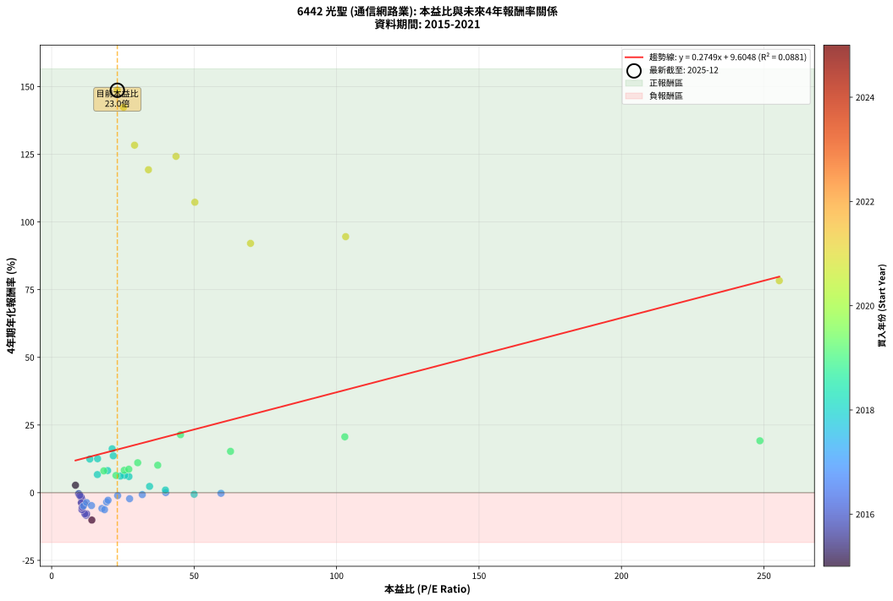
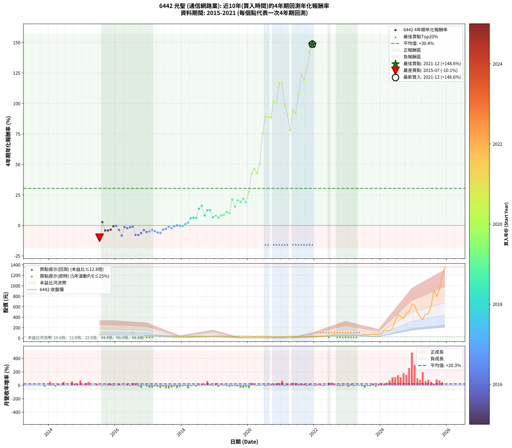

# 6442 光聖 - 本益比與未來報酬率分析

!!! info "報告資訊"
    - **股票代號**: 6442
    - **公司名稱**: 光聖
    - **產業別**: 通信網路業
    - **分析期間**: 2015-2021 (78 個數據點)
    - **資料來源**: Type 12 (ShowMonthlyK_ChartFlow) 月收盤價與本益比
    - **報酬率口徑**: 含現金股利 (簡化: 年度合計，假設每年7/1入帳)
    - **報告生成時間**: 2026-01-10 19:08:30 CST

## 📈 視覺化圖表

### 圖表1: 本益比 vs 未來報酬率關係

*圖表1：6442 光聖 本益比與4年期未來報酬率關係 (2015-2021)*

### 圖表2: 歷年買入時點的4年期實際報酬率

*圖表2：6442 光聖 歷年買入時點的4年期實際報酬率 (2015-2021)*

## 📍 買點訊號說明

本報告提供兩種買點提示訊號（顯示於圖表2的股價子圖中）：

### ▲ 小綠色三角形（回測驗證）
- **計算方式**: 使用全部歷史資料計算本益比第25百分位數
- **用途**: 事後驗證，顯示歷史上哪些時點確實為低估區
- **限制**: 當下無法判斷，僅供回測參考
- **特性**: 後見之明（Look-Ahead Bias）

### ▲ 小橘色三角形（即時訊號）
- **計算方式**: 使用截至當月的過去5年資料計算本益比第25百分位數
- **用途**: 實際投資決策，當時即可判斷
- **優勢**: 可操作性強，符合實務需求
- **特性**: 無後見之明，滾動窗口計算

!!! tip "如何使用兩種訊號"
    - **綠色▲** 幫助理解歷史估值機會，驗證策略有效性
    - **橘色▲** 可作為實際買進參考，但仍需搭配基本面分析
    - 兩種訊號重疊時，表示即時判斷與事後驗證一致，信心度較高
    - 僅有綠色▲時，表示當時無法判斷（需要未來資料才能確認）
    - 僅有橘色▲時，表示即時判斷為買點，但事後可能不是最佳時機

## 📊 估值分析摘要

| 指標 | 數值 |
|:---:|:---:|
| **目前本益比** (2021-12) | **23.04 倍** |
| **歷史平均本益比** | 33.64 倍 |
| **估值水準** | 🟢 相對低估 |
| **預期4年年化報酬率** | **+15.94%** |
| **歷史平均報酬率** | +30.35% |
| **相關係數 (R²)** | 0.0881 |
| **趨勢線斜率** | 0.2749 |

!!! abstract "核心洞察"
    目前本益比顯著低於歷史平均，預期未來報酬率可能較高

    根據歷史數據回測，6442 光聖 在目前本益比 **23.0倍** 的估值水準下，
    預期未來4年年化報酬率約為 **+15.9%**。

    **重要提醒**: 本分析基於歷史數據統計，實際報酬率會受到公司基本面變化、產業趨勢、
    總體經濟環境等多重因素影響。R² = 0.09 表示本益比可解釋約 8.8% 的報酬率變異。

## 📈 歷史估值統計

### 最佳買點 (最高報酬率)

| 項目 | 數值 |
|:---:|:---:|
| 起始時間 | 2021-12 |
| 當時本益比 | 23.04 倍 |
| 起始價格 | 36.0 元 |
| 4年後價格 | 1360.0 元 |
| **4年年化報酬率** | **+148.64%** |

### 最差買點 (最低報酬率)

| 項目 | 數值 |
|:---:|:---:|
| 起始時間 | 2015-07 |
| 當時本益比 | 14.10 倍 |
| 起始價格 | 71.2 元 |
| 4年後價格 | 36.7 元 |
| **4年年化報酬率** | **-10.10%** |

## 🎯 投資啟示

### 本益比與報酬率關係

趨勢線方程式: **y = 0.2749x + 9.6048**

!!! info "弱相關或正相關"
    本益比與未來報酬率相關性較弱。這可能表示該股票的報酬率更多受到
    公司成長性、產業趨勢等因素影響，而非估值水準。**需綜合考量多項指標**。

### 估值區間建議

基於歷史數據分析:

- **🟢 低估區** (P/E < 26.9): 預期報酬率較高，可考慮增加持股
- **🟡 合理區** (P/E 26.9-40.4): 預期報酬率符合長期趨勢，正常持有
- **🔴 高估區** (P/E > 40.4): 預期報酬率較低，可考慮減碼或觀望

!!! danger "風險提示"
    - 過去表現不代表未來結果
    - 本分析假設公司基本面無重大結構性變化
    - 產業環境劇變可能使歷史規律失效
    - 應結合公司財報、產業趨勢、總體經濟等多重因素綜合判斷

!!! success "長期投資觀點"
    歷史數據顯示，在合理或低估的估值水準買入並長期持有，
    往往能獲得較佳的投資報酬。**耐心等待好價格**是價值投資的核心原則。

## 📊 數據品質

- **資料來源**: GoodInfo.tw Type 12 (ShowMonthlyK_ChartFlow)
- **資料頻率**: 月度收盤價與本益比
- **回測期間**: 2015-2021
- **數據點數量**: 78 個 (每個點代表一次4年期回測)

### 計算方法說明

1. **4年期年化報酬率**:
   - 對每個歷史時點，計算其後4年的實際投資報酬率
   - 期末價值(不含股利): 期末價格
   - 期末價值(含現金股利): 期末價格 + 持有期間內的現金股利合計 (簡化: 年度合計，假設每年7/1入帳)
   - 公式: 年化報酬率 = [(期末價值/期初價格)^(1/年數) - 1] × 100%

2. **本益比 (P/E Ratio)**:
   - 使用當時的月收盤價與EPS計算
   - 資料來源: Type 12 月度河流圖本益比數據

3. **趨勢線 (Linear Regression)**:
   - 使用最小平方法擬合線性趨勢線
   - R²值衡量本益比對報酬率的解釋能力

---

*本報告由 Stock Analysis System v1.9.0 自動生成*
*數據更新時間: 2026-01-10 19:08:30 CST*

## 📋 月度回測明細表

（每一列對應時間線圖中的一個買入點；可用來對照 SVG 圖上的每個點。）

| 買入月份 | 賣出月份 | 回測期限_年 | 實際持有年數 | 買入本益比_倍 | 買入收盤價_元 | 賣出收盤價_元 | 現金股利合計_元 | 總報酬率_pct | 年化報酬率_pct |
| --- | --- | --- | --- | --- | --- | --- | --- | --- | --- |
| 2015-07 | 2019-07 | 4 | 4.000 | 14.10 | 71.20 | 36.70 | 9.80 | -34.69 | -10.10 |
| 2015-08 | 2019-08 | 4 | 4.000 | 8.36 | 42.20 | 37.25 | 9.80 | +11.49 | +2.76 |
| 2015-09 | 2019-09 | 4 | 4.000 | 11.35 | 57.30 | 38.60 | 9.80 | -15.53 | -4.13 |
| 2015-10 | 2019-10 | 4 | 4.000 | 11.45 | 57.80 | 38.95 | 9.80 | -15.66 | -4.17 |
| 2015-11 | 2019-11 | 4 | 4.000 | 10.48 | 52.90 | 36.05 | 9.80 | -13.33 | -3.51 |
| 2015-12 | 2019-12 | 4 | 4.000 | 9.70 | 49.00 | 38.00 | 9.80 | -2.45 | -0.62 |
| 2016-01 | 2020-01 | 4 | 4.000 | 9.45 | 47.20 | 36.70 | 9.80 | -1.48 | -0.37 |
| 2016-02 | 2020-02 | 4 | 4.000 | 11.01 | 54.40 | 37.00 | 9.80 | -13.97 | -3.69 |
| 2016-03 | 2020-03 | 4 | 4.000 | 12.08 | 59.00 | 31.80 | 9.80 | -29.49 | -8.37 |
| 2016-04 | 2020-04 | 4 | 4.000 | 10.07 | 48.65 | 36.20 | 9.80 | -5.45 | -1.39 |
| 2016-05 | 2020-05 | 4 | 4.000 | 10.58 | 50.50 | 36.30 | 9.80 | -8.71 | -2.25 |
| 2016-06 | 2020-06 | 4 | 4.000 | 10.32 | 48.70 | 36.00 | 9.80 | -5.95 | -1.52 |
| 2016-07 | 2020-07 | 4 | 4.000 | 9.86 | 46.00 | 36.10 | 8.16 | -3.78 | -0.96 |
| 2016-08 | 2020-08 | 4 | 4.000 | 12.26 | 56.50 | 32.70 | 8.16 | -27.68 | -7.78 |
| 2016-09 | 2020-09 | 4 | 4.000 | 11.64 | 53.00 | 30.10 | 8.16 | -27.81 | -7.82 |
| 2016-10 | 2020-10 | 4 | 4.000 | 10.61 | 47.75 | 28.70 | 8.16 | -22.81 | -6.27 |
| 2016-11 | 2020-11 | 4 | 4.000 | 10.43 | 46.35 | 31.60 | 8.16 | -14.22 | -3.76 |
| 2016-12 | 2020-12 | 4 | 4.000 | 10.75 | 47.20 | 29.70 | 8.16 | -19.79 | -5.36 |
| 2017-01 | 2021-01 | 4 | 4.000 | 11.13 | 45.45 | 29.00 | 8.16 | -18.24 | -4.91 |
| 2017-02 | 2021-02 | 4 | 4.000 | 12.26 | 46.30 | 31.75 | 8.16 | -13.80 | -3.64 |
| 2017-03 | 2021-03 | 4 | 4.000 | 13.98 | 48.50 | 31.75 | 8.16 | -17.71 | -4.76 |
| 2017-04 | 2021-04 | 4 | 4.000 | 17.64 | 55.80 | 35.75 | 8.16 | -21.31 | -5.81 |
| 2017-05 | 2021-05 | 4 | 4.000 | 18.55 | 53.00 | 32.75 | 8.16 | -22.81 | -6.27 |
| 2017-06 | 2021-06 | 4 | 4.000 | 19.29 | 49.20 | 34.55 | 8.16 | -13.19 | -3.47 |
| 2017-07 | 2021-07 | 4 | 4.000 | 19.79 | 44.40 | 33.80 | 5.86 | -10.68 | -2.78 |
| 2017-08 | 2021-08 | 4 | 4.000 | 23.16 | 44.85 | 37.10 | 5.86 | -4.21 | -1.07 |
| 2017-09 | 2021-09 | 4 | 4.000 | 27.36 | 44.60 | 34.90 | 5.86 | -8.61 | -2.23 |
| 2017-10 | 2021-10 | 4 | 4.000 | 31.81 | 42.10 | 35.05 | 5.86 | -2.83 | -0.71 |
| 2017-11 | 2021-11 | 4 | 4.000 | 40.03 | 40.70 | 34.90 | 5.86 | +0.15 | +0.04 |
| 2017-12 | 2021-12 | 4 | 4.000 | 59.44 | 42.20 | 35.95 | 5.86 | -0.92 | -0.23 |
| 2018-01 | 2022-01 | 4 | 4.000 | 50.01 | 42.30 | 35.45 | 5.86 | -2.34 | -0.59 |
| 2018-02 | 2022-02 | 4 | 4.000 | 39.93 | 39.20 | 34.90 | 5.86 | +3.98 | +0.98 |
| 2018-03 | 2022-03 | 4 | 4.000 | 34.36 | 38.40 | 36.25 | 5.86 | +9.66 | +2.33 |
| 2018-04 | 2022-04 | 4 | 4.000 | 27.13 | 34.00 | 37.00 | 5.86 | +26.06 | +5.96 |
| 2018-05 | 2022-05 | 4 | 4.000 | 25.63 | 35.60 | 39.75 | 5.86 | +28.12 | +6.39 |
| 2018-06 | 2022-06 | 4 | 4.000 | 24.13 | 36.80 | 40.85 | 5.86 | +26.93 | +6.14 |
| 2018-07 | 2022-07 | 4 | 4.000 | 21.62 | 35.90 | 54.80 | 5.06 | +66.74 | +13.63 |
| 2018-08 | 2022-08 | 4 | 4.000 | 21.23 | 38.15 | 64.50 | 5.06 | +82.33 | +16.20 |
| 2018-09 | 2022-09 | 4 | 4.000 | 19.64 | 37.95 | 46.90 | 5.06 | +36.92 | +8.17 |
| 2018-10 | 2022-10 | 4 | 4.000 | 13.39 | 27.70 | 39.20 | 5.06 | +59.78 | +12.43 |
| 2018-11 | 2022-11 | 4 | 4.000 | 16.11 | 35.50 | 51.90 | 5.06 | +60.45 | +12.55 |
| 2018-12 | 2022-12 | 4 | 4.000 | 16.05 | 37.55 | 43.60 | 5.06 | +29.59 | +6.69 |
| 2019-01 | 2023-01 | 4 | 4.000 | 18.29 | 38.80 | 47.85 | 5.06 | +36.37 | +8.06 |
| 2019-02 | 2023-02 | 4 | 4.000 | 22.59 | 43.00 | 50.00 | 5.06 | +28.05 | +6.38 |
| 2019-03 | 2023-03 | 4 | 4.000 | 25.46 | 42.90 | 53.90 | 5.06 | +37.44 | +8.27 |
| 2019-04 | 2023-04 | 4 | 4.000 | 27.07 | 39.70 | 50.30 | 5.06 | +39.45 | +8.67 |
| 2019-05 | 2023-05 | 4 | 4.000 | 30.20 | 37.70 | 52.30 | 5.06 | +52.15 | +11.06 |
| 2019-06 | 2023-06 | 4 | 4.000 | 37.23 | 38.35 | 51.40 | 5.06 | +47.22 | +10.15 |
| 2019-07 | 2023-07 | 4 | 4.000 | 45.22 | 36.70 | 74.10 | 5.66 | +117.33 | +21.42 |
| 2019-08 | 2023-08 | 4 | 4.000 | 62.78 | 37.25 | 60.10 | 5.66 | +76.54 | +15.27 |
| 2019-09 | 2023-09 | 4 | 4.000 | 102.90 | 38.60 | 76.10 | 5.66 | +111.81 | +20.64 |
| 2019-10 | 2023-10 | 4 | 4.000 | 248.60 | 38.95 | 72.90 | 5.66 | +101.69 | +19.17 |
| 2019-11 | 2023-11 | 4 | 4.000 |  | 36.05 | 73.90 | 5.66 | +120.69 | +21.88 |
| 2019-12 | 2023-12 | 4 | 4.000 |  | 38.00 | 70.30 | 5.66 | +99.89 | +18.91 |
| 2020-01 | 2024-01 | 4 | 4.000 |  | 36.70 | 91.40 | 5.66 | +164.47 | +27.52 |
| 2020-02 | 2024-02 | 4 | 4.000 |  | 37.00 | 146.50 | 5.66 | +311.24 | +42.40 |
| 2020-03 | 2024-03 | 4 | 4.000 |  | 31.80 | 140.50 | 5.66 | +359.62 | +46.42 |
| 2020-04 | 2024-04 | 4 | 4.000 |  | 36.20 | 145.00 | 5.66 | +316.19 | +42.83 |
| 2020-05 | 2024-05 | 4 | 4.000 |  | 36.30 | 181.50 | 5.66 | +415.59 | +50.69 |
| 2020-06 | 2024-06 | 4 | 4.000 |  | 36.00 | 336.50 | 5.66 | +850.44 | +75.58 |
| 2020-07 | 2024-07 | 4 | 4.000 |  | 36.10 | 457.50 | 6.40 | +1185.04 | +89.33 |
| 2020-08 | 2024-08 | 4 | 4.000 |  | 32.70 | 408.00 | 6.40 | +1167.28 | +88.68 |
| 2020-09 | 2024-09 | 4 | 4.000 |  | 30.10 | 374.00 | 6.40 | +1163.79 | +88.55 |
| 2020-10 | 2024-10 | 4 | 4.000 |  | 28.70 | 469.50 | 6.40 | +1558.19 | +101.79 |
| 2020-11 | 2024-11 | 4 | 4.000 |  | 31.60 | 505.00 | 6.40 | +1518.35 | +100.57 |
| 2020-12 | 2024-12 | 4 | 4.000 |  | 29.70 | 650.00 | 6.40 | +2110.10 | +116.82 |
| 2021-01 | 2025-01 | 4 | 4.000 |  | 29.00 | 629.00 | 6.40 | +2091.03 | +116.35 |
| 2021-02 | 2025-02 | 4 | 4.000 |  | 31.75 | 489.00 | 6.40 | +1460.31 | +98.75 |
| 2021-03 | 2025-03 | 4 | 4.000 |  | 31.75 | 412.50 | 6.40 | +1219.37 | +90.59 |
| 2021-04 | 2025-04 | 4 | 4.000 | 255.40 | 35.75 | 355.00 | 6.40 | +910.91 | +78.31 |
| 2021-05 | 2025-05 | 4 | 4.000 | 103.20 | 32.75 | 463.00 | 6.40 | +1333.28 | +94.57 |
| 2021-06 | 2025-06 | 4 | 4.000 | 69.80 | 34.55 | 464.00 | 6.40 | +1261.51 | +92.09 |
| 2021-07 | 2025-07 | 4 | 4.000 | 50.26 | 33.80 | 610.00 | 14.02 | +1746.22 | +107.29 |
| 2021-08 | 2025-08 | 4 | 4.000 | 43.65 | 37.10 | 924.00 | 14.02 | +2428.36 | +124.24 |
| 2021-09 | 2025-09 | 4 | 4.000 | 33.97 | 34.90 | 793.00 | 14.02 | +2212.39 | +119.29 |
| 2021-10 | 2025-10 | 4 | 4.000 | 29.09 | 35.05 | 939.00 | 14.02 | +2619.04 | +128.35 |
| 2021-11 | 2025-11 | 4 | 4.000 | 25.24 | 34.90 | 1190.00 | 14.02 | +3349.92 | +142.36 |
| 2021-12 | 2025-12 | 4 | 4.000 | 23.04 | 35.95 | 1360.00 | 14.02 | +3722.04 | +148.64 |
