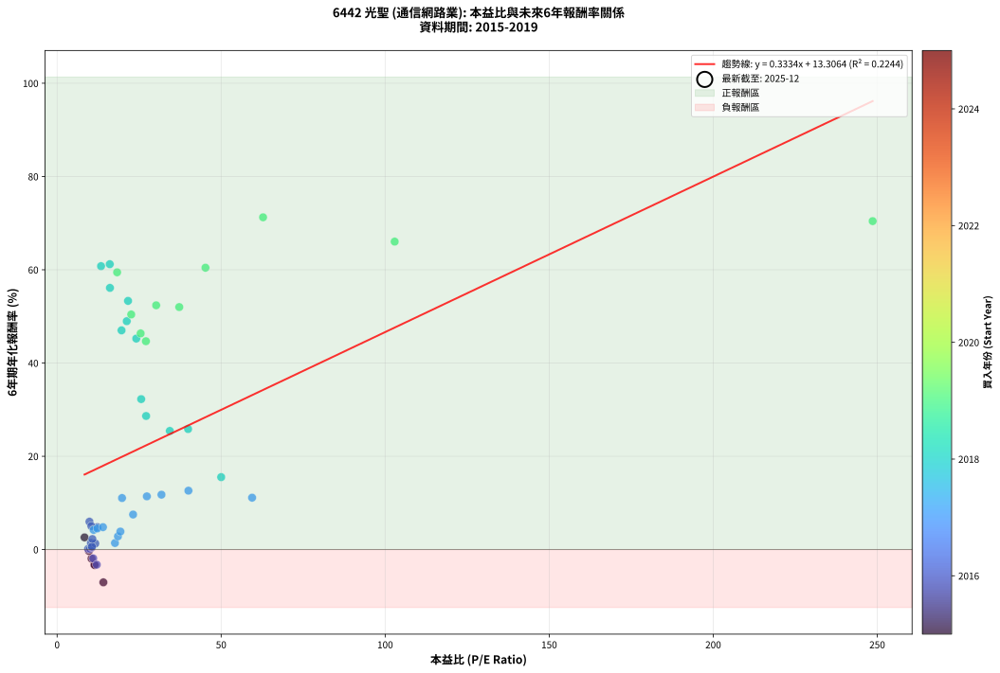
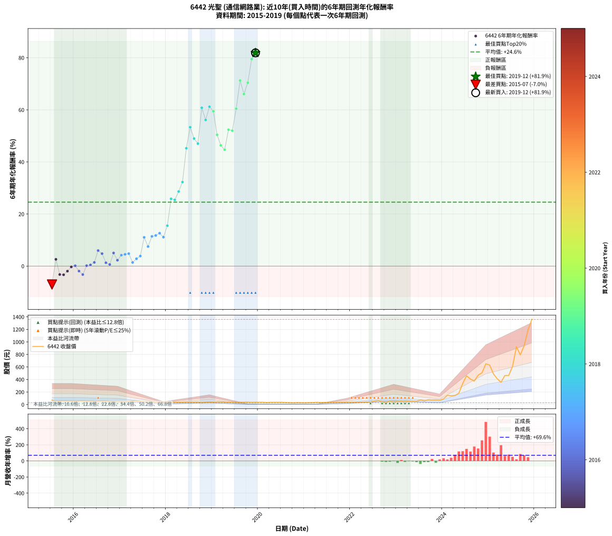

# 6442 光聖 - 本益比與未來報酬率分析

!!! info "報告資訊"
    - **股票代號**: 6442
    - **公司名稱**: 光聖
    - **產業別**: 通信網路業
    - **分析期間**: 2015-2019 (54 個數據點)
    - **資料來源**: Type 12 (ShowMonthlyK_ChartFlow) 月收盤價與本益比
    - **報酬率口徑**: 含現金股利 (簡化: 年度合計，假設每年7/1入帳)
    - **報告生成時間**: 2026-01-13 13:57:40 CST

## 📈 視覺化圖表

### 圖表1: 本益比 vs 未來報酬率關係

*圖表1：6442 光聖 本益比與6年期未來報酬率關係 (2015-2019)*

### 圖表2: 歷年買入時點的6年期實際報酬率

*圖表2：6442 光聖 歷年買入時點的6年期實際報酬率 (2015-2019)*

## 📍 買點訊號說明

本報告提供兩種買點提示訊號（顯示於圖表2的股價子圖中）：

### ▲ 小綠色三角形（回測驗證）
- **計算方式**: 使用全部歷史資料計算本益比第25百分位數
- **用途**: 事後驗證，顯示歷史上哪些時點確實為低估區
- **限制**: 當下無法判斷，僅供回測參考
- **特性**: 後見之明（Look-Ahead Bias）

### ▲ 小橘色三角形（即時訊號）
- **計算方式**: 使用截至當月的過去5年資料計算本益比第25百分位數
- **用途**: 實際投資決策，當時即可判斷
- **優勢**: 可操作性強，符合實務需求
- **特性**: 無後見之明，滾動窗口計算

!!! tip "如何使用兩種訊號"
    - **綠色▲** 幫助理解歷史估值機會，驗證策略有效性
    - **橘色▲** 可作為實際買進參考，但仍需搭配基本面分析
    - 兩種訊號重疊時，表示即時判斷與事後驗證一致，信心度較高
    - 僅有綠色▲時，表示當時無法判斷（需要未來資料才能確認）
    - 僅有橘色▲時，表示即時判斷為買點，但事後可能不是最佳時機

## 📊 估值分析摘要

| 指標 | 數值 |
|:---:|:---:|
| **目前本益比** (2019-12) | **nan 倍** |
| **歷史平均本益比** | 27.28 倍 |
| **估值水準** | 🟡 合理範圍 |
| **預期6年年化報酬率** | **+nan%** |
| **歷史平均報酬率** | +24.56% |
| **相關係數 (R²)** | 0.2244 |
| **趨勢線斜率** | 0.3334 |

!!! abstract "核心洞察"
    目前本益比接近歷史平均，預期報酬率符合長期趨勢

    根據歷史數據回測，6442 光聖 在目前本益比 **nan倍** 的估值水準下，
    預期未來6年年化報酬率約為 **+nan%**。

    **重要提醒**: 本分析基於歷史數據統計，實際報酬率會受到公司基本面變化、產業趨勢、
    總體經濟環境等多重因素影響。R² = 0.22 表示本益比可解釋約 22.4% 的報酬率變異。

## 📈 歷史估值統計

### 最佳買點 (最高報酬率)

| 項目 | 數值 |
|:---:|:---:|
| 起始時間 | 2019-12 |
| 當時本益比 | nan 倍 |
| 起始價格 | 38.0 元 |
| 6年後價格 | 1360.0 元 |
| **6年年化報酬率** | **+81.87%** |

### 最差買點 (最低報酬率)

| 項目 | 數值 |
|:---:|:---:|
| 起始時間 | 2015-07 |
| 當時本益比 | 14.10 倍 |
| 起始價格 | 71.2 元 |
| 6年後價格 | 33.8 元 |
| **6年年化報酬率** | **-7.03%** |

## 🎯 投資啟示

### 本益比與報酬率關係

趨勢線方程式: **y = 0.3334x + 13.3064**

!!! info "弱相關或正相關"
    本益比與未來報酬率相關性較弱。這可能表示該股票的報酬率更多受到
    公司成長性、產業趨勢等因素影響，而非估值水準。**需綜合考量多項指標**。

### 估值區間建議

基於歷史數據分析:

- **🟢 低估區** (P/E < 21.8): 預期報酬率較高，可考慮增加持股
- **🟡 合理區** (P/E 21.8-32.7): 預期報酬率符合長期趨勢，正常持有
- **🔴 高估區** (P/E > 32.7): 預期報酬率較低，可考慮減碼或觀望

!!! danger "風險提示"
    - 過去表現不代表未來結果
    - 本分析假設公司基本面無重大結構性變化
    - 產業環境劇變可能使歷史規律失效
    - 應結合公司財報、產業趨勢、總體經濟等多重因素綜合判斷

!!! success "長期投資觀點"
    歷史數據顯示，在合理或低估的估值水準買入並長期持有，
    往往能獲得較佳的投資報酬。**耐心等待好價格**是價值投資的核心原則。

## 📊 數據品質

- **資料來源**: GoodInfo.tw Type 12 (ShowMonthlyK_ChartFlow)
- **資料頻率**: 月度收盤價與本益比
- **回測期間**: 2015-2019
- **數據點數量**: 54 個 (每個點代表一次6年期回測)

### 計算方法說明

1. **6年期年化報酬率**:
   - 對每個歷史時點，計算其後6年的實際投資報酬率
   - 期末價值(不含股利): 期末價格
   - 期末價值(含現金股利): 期末價格 + 持有期間內的現金股利合計 (簡化: 年度合計，假設每年7/1入帳)
   - 公式: 年化報酬率 = [(期末價值/期初價格)^(1/年數) - 1] × 100%

2. **本益比 (P/E Ratio)**:
   - 使用當時的月收盤價與EPS計算
   - 資料來源: Type 12 月度河流圖本益比數據

3. **趨勢線 (Linear Regression)**:
   - 使用最小平方法擬合線性趨勢線
   - R²值衡量本益比對報酬率的解釋能力

---

*本報告由 Stock Analysis System v1.9.0 自動生成*
*數據更新時間: 2026-01-13 13:57:40 CST*

## 📋 月度回測明細表

（每一列對應時間線圖中的一個買入點；可用來對照 SVG 圖上的每個點。）

| 買入月份 | 賣出月份 | 回測期限_年 | 實際持有年數 | 買入本益比_倍 | 買入收盤價_元 | 賣出收盤價_元 | 現金股利合計_元 | 總報酬率_pct | 年化報酬率_pct |
| --- | --- | --- | --- | --- | --- | --- | --- | --- | --- |
| 2015-07 | 2021-07 | 6 | 6.001 | 14.10 | 71.20 | 33.80 | 12.16 | -35.45 | -7.03 |
| 2015-08 | 2021-08 | 6 | 6.001 | 8.36 | 42.20 | 37.10 | 12.16 | +16.73 | +2.61 |
| 2015-09 | 2021-09 | 6 | 6.001 | 11.35 | 57.30 | 34.90 | 12.16 | -17.87 | -3.23 |
| 2015-10 | 2021-10 | 6 | 6.001 | 11.45 | 57.80 | 35.05 | 12.16 | -18.32 | -3.32 |
| 2015-11 | 2021-11 | 6 | 6.001 | 10.48 | 52.90 | 34.90 | 12.16 | -11.04 | -1.93 |
| 2015-12 | 2021-12 | 6 | 6.001 | 9.70 | 49.00 | 35.95 | 12.16 | -1.82 | -0.30 |
| 2016-01 | 2022-01 | 6 | 6.001 | 9.45 | 47.20 | 35.45 | 12.16 | +0.87 | +0.14 |
| 2016-02 | 2022-03 | 6 | 6.081 | 11.01 | 54.40 | 36.25 | 12.16 | -11.01 | -1.90 |
| 2016-03 | 2022-03 | 6 | 5.999 | 12.08 | 59.00 | 36.25 | 12.16 | -17.95 | -3.24 |
| 2016-04 | 2022-04 | 6 | 5.999 | 10.07 | 48.65 | 37.00 | 12.16 | +1.05 | +0.17 |
| 2016-05 | 2022-05 | 6 | 5.999 | 10.58 | 50.50 | 39.75 | 12.16 | +2.79 | +0.46 |
| 2016-06 | 2022-06 | 6 | 5.999 | 10.32 | 48.70 | 40.85 | 12.16 | +8.85 | +1.42 |
| 2016-07 | 2022-07 | 6 | 5.999 | 9.86 | 46.00 | 54.80 | 10.36 | +41.65 | +5.98 |
| 2016-08 | 2022-08 | 6 | 5.999 | 12.26 | 56.50 | 64.50 | 10.36 | +32.50 | +4.80 |
| 2016-09 | 2022-09 | 6 | 5.999 | 11.64 | 53.00 | 46.90 | 10.36 | +8.04 | +1.30 |
| 2016-10 | 2022-10 | 6 | 5.999 | 10.61 | 47.75 | 39.20 | 10.36 | +3.79 | +0.62 |
| 2016-11 | 2022-11 | 6 | 5.999 | 10.43 | 46.35 | 51.90 | 10.36 | +34.33 | +5.04 |
| 2016-12 | 2022-12 | 6 | 5.999 | 10.75 | 47.20 | 43.60 | 10.36 | +14.32 | +2.26 |
| 2017-01 | 2023-01 | 6 | 5.999 | 11.13 | 45.45 | 47.85 | 10.36 | +28.07 | +4.21 |
| 2017-02 | 2023-02 | 6 | 5.999 | 12.26 | 46.30 | 50.00 | 10.36 | +30.37 | +4.52 |
| 2017-03 | 2023-03 | 6 | 5.999 | 13.98 | 48.50 | 53.90 | 10.36 | +32.49 | +4.80 |
| 2017-04 | 2023-04 | 6 | 5.999 | 17.64 | 55.80 | 50.30 | 10.36 | +8.71 | +1.40 |
| 2017-05 | 2023-05 | 6 | 5.999 | 18.55 | 53.00 | 52.30 | 10.36 | +18.23 | +2.83 |
| 2017-06 | 2023-06 | 6 | 5.999 | 19.29 | 49.20 | 51.40 | 10.36 | +25.53 | +3.86 |
| 2017-07 | 2023-07 | 6 | 5.999 | 19.79 | 44.40 | 74.10 | 9.16 | +87.52 | +11.05 |
| 2017-08 | 2023-08 | 6 | 5.999 | 23.16 | 44.85 | 60.10 | 9.16 | +54.43 | +7.51 |
| 2017-09 | 2023-09 | 6 | 5.999 | 27.36 | 44.60 | 76.10 | 9.16 | +91.17 | +11.41 |
| 2017-10 | 2023-10 | 6 | 5.999 | 31.81 | 42.10 | 72.90 | 9.16 | +94.92 | +11.77 |
| 2017-11 | 2023-11 | 6 | 5.999 | 40.03 | 40.70 | 73.90 | 9.16 | +104.08 | +12.63 |
| 2017-12 | 2023-12 | 6 | 5.999 | 59.44 | 42.20 | 70.30 | 9.16 | +88.29 | +11.13 |
| 2018-01 | 2024-01 | 6 | 5.999 | 50.01 | 42.30 | 91.40 | 9.16 | +137.73 | +15.53 |
| 2018-02 | 2024-02 | 6 | 5.999 | 39.93 | 39.20 | 146.50 | 9.16 | +297.09 | +25.85 |
| 2018-03 | 2024-03 | 6 | 6.001 | 34.36 | 38.40 | 140.50 | 9.16 | +289.74 | +25.44 |
| 2018-04 | 2024-04 | 6 | 6.001 | 27.13 | 34.00 | 145.00 | 9.16 | +353.41 | +28.64 |
| 2018-05 | 2024-05 | 6 | 6.001 | 25.63 | 35.60 | 181.50 | 9.16 | +435.56 | +32.26 |
| 2018-06 | 2024-06 | 6 | 6.001 | 24.13 | 36.80 | 336.50 | 9.16 | +839.29 | +45.24 |
| 2018-07 | 2024-07 | 6 | 6.001 | 21.62 | 35.90 | 457.50 | 9.26 | +1200.17 | +53.33 |
| 2018-08 | 2024-08 | 6 | 6.001 | 21.23 | 38.15 | 408.00 | 9.26 | +993.74 | +48.97 |
| 2018-09 | 2024-09 | 6 | 6.001 | 19.64 | 37.95 | 374.00 | 9.26 | +909.91 | +47.01 |
| 2018-10 | 2024-10 | 6 | 6.001 | 13.39 | 27.70 | 469.50 | 9.26 | +1628.38 | +60.78 |
| 2018-11 | 2024-11 | 6 | 6.001 | 16.11 | 35.50 | 505.00 | 9.26 | +1348.62 | +56.12 |
| 2018-12 | 2024-12 | 6 | 6.001 | 16.05 | 37.55 | 650.00 | 9.26 | +1655.69 | +61.20 |
| 2019-01 | 2025-01 | 6 | 6.001 | 18.29 | 38.80 | 629.00 | 9.26 | +1545.00 | +59.46 |
| 2019-02 | 2025-02 | 6 | 6.001 | 22.59 | 43.00 | 489.00 | 9.26 | +1058.74 | +50.41 |
| 2019-03 | 2025-03 | 6 | 6.001 | 25.46 | 42.90 | 412.50 | 9.26 | +883.12 | +46.35 |
| 2019-04 | 2025-04 | 6 | 6.001 | 27.07 | 39.70 | 355.00 | 9.26 | +817.53 | +44.68 |
| 2019-05 | 2025-05 | 6 | 6.001 | 30.20 | 37.70 | 463.00 | 9.26 | +1152.68 | +52.38 |
| 2019-06 | 2025-06 | 6 | 6.001 | 37.23 | 38.35 | 464.00 | 9.26 | +1134.05 | +52.00 |
| 2019-07 | 2025-07 | 6 | 6.001 | 45.22 | 36.70 | 610.00 | 16.38 | +1606.77 | +60.44 |
| 2019-08 | 2025-08 | 6 | 6.001 | 62.78 | 37.25 | 924.00 | 16.38 | +2424.52 | +71.25 |
| 2019-09 | 2025-09 | 6 | 6.001 | 102.90 | 38.60 | 793.00 | 16.38 | +1996.85 | +66.04 |
| 2019-10 | 2025-10 | 6 | 6.001 | 248.60 | 38.95 | 939.00 | 16.38 | +2352.84 | +70.44 |
| 2019-11 | 2025-11 | 6 | 6.001 |  | 36.05 | 1190.00 | 16.38 | +3246.42 | +79.49 |
| 2019-12 | 2025-12 | 6 | 6.001 |  | 38.00 | 1360.00 | 16.38 | +3522.06 | +81.87 |
