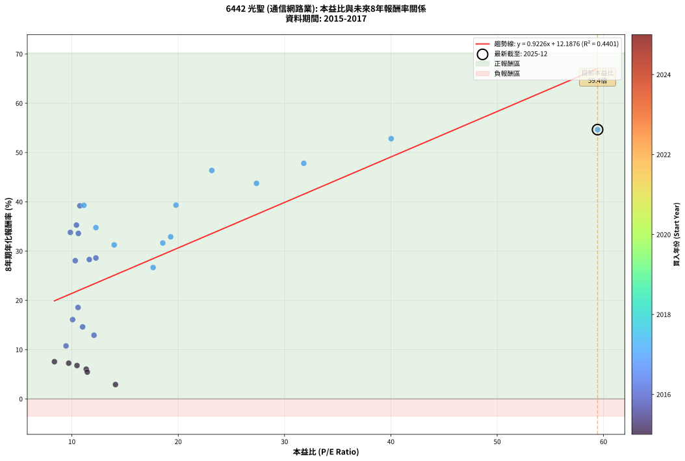
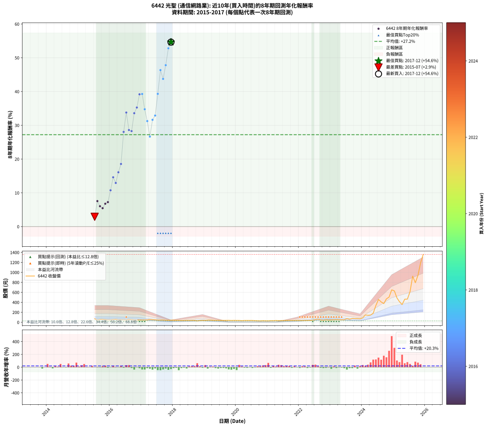

# 6442 光聖 - 本益比與未來報酬率分析

!!! info "報告資訊"
    - **股票代號**: 6442
    - **公司名稱**: 光聖
    - **產業別**: 通信網路業
    - **分析期間**: 2015-2017 (30 個數據點)
    - **資料來源**: Type 12 (ShowMonthlyK_ChartFlow) 月收盤價與本益比
    - **報酬率口徑**: 含現金股利 (簡化: 年度合計，假設每年7/1入帳)
    - **報告生成時間**: 2026-01-06 01:12:00 CST

## 📈 視覺化圖表

### 圖表1: 本益比 vs 未來報酬率關係

*圖表1：6442 光聖 本益比與8年期未來報酬率關係 (2015-2017)*

### 圖表2: 歷年買入時點的8年期實際報酬率

*圖表2：6442 光聖 歷年買入時點的8年期實際報酬率 (2015-2017)*

## 📍 買點訊號說明

本報告提供兩種買點提示訊號（顯示於圖表2的股價子圖中）：

### ▲ 小綠色三角形（回測驗證）
- **計算方式**: 使用全部歷史資料計算本益比第25百分位數
- **用途**: 事後驗證，顯示歷史上哪些時點確實為低估區
- **限制**: 當下無法判斷，僅供回測參考
- **特性**: 後見之明（Look-Ahead Bias）

### ▲ 小橘色三角形（即時訊號）
- **計算方式**: 使用截至當月的過去5年資料計算本益比第25百分位數
- **用途**: 實際投資決策，當時即可判斷
- **優勢**: 可操作性強，符合實務需求
- **特性**: 無後見之明，滾動窗口計算

!!! tip "如何使用兩種訊號"
    - **綠色▲** 幫助理解歷史估值機會，驗證策略有效性
    - **橘色▲** 可作為實際買進參考，但仍需搭配基本面分析
    - 兩種訊號重疊時，表示即時判斷與事後驗證一致，信心度較高
    - 僅有綠色▲時，表示當時無法判斷（需要未來資料才能確認）
    - 僅有橘色▲時，表示即時判斷為買點，但事後可能不是最佳時機

## 📊 估值分析摘要

| 指標 | 數值 |
|:---:|:---:|
| **目前本益比** (2017-12) | **59.44 倍** |
| **歷史平均本益比** | 16.30 倍 |
| **估值水準** | 🔴 相對高估 |
| **預期8年年化報酬率** | **+67.03%** |
| **歷史平均報酬率** | +27.22% |
| **相關係數 (R²)** | 0.4401 |
| **趨勢線斜率** | 0.9226 |

!!! abstract "核心洞察"
    目前本益比顯著高於歷史平均，預期未來報酬率可能較低

    根據歷史數據回測，6442 光聖 在目前本益比 **59.4倍** 的估值水準下，
    預期未來8年年化報酬率約為 **+67.0%**。

    **重要提醒**: 本分析基於歷史數據統計，實際報酬率會受到公司基本面變化、產業趨勢、
    總體經濟環境等多重因素影響。R² = 0.44 表示本益比可解釋約 44.0% 的報酬率變異。

## 📈 歷史估值統計

### 最佳買點 (最高報酬率)

| 項目 | 數值 |
|:---:|:---:|
| 起始時間 | 2017-12 |
| 當時本益比 | 59.44 倍 |
| 起始價格 | 42.2 元 |
| 8年後價格 | 1360.0 元 |
| **8年年化報酬率** | **+54.64%** |

### 最差買點 (最低報酬率)

| 項目 | 數值 |
|:---:|:---:|
| 起始時間 | 2015-07 |
| 當時本益比 | 14.10 倍 |
| 起始價格 | 71.2 元 |
| 8年後價格 | 74.1 元 |
| **8年年化報酬率** | **+2.91%** |

## 🎯 投資啟示

### 本益比與報酬率關係

趨勢線方程式: **y = 0.9226x + 12.1876**

!!! info "弱相關或正相關"
    本益比與未來報酬率相關性較弱。這可能表示該股票的報酬率更多受到
    公司成長性、產業趨勢等因素影響，而非估值水準。**需綜合考量多項指標**。

### 估值區間建議

基於歷史數據分析:

- **🟢 低估區** (P/E < 13.0): 預期報酬率較高，可考慮增加持股
- **🟡 合理區** (P/E 13.0-19.6): 預期報酬率符合長期趨勢，正常持有
- **🔴 高估區** (P/E > 19.6): 預期報酬率較低，可考慮減碼或觀望

!!! danger "風險提示"
    - 過去表現不代表未來結果
    - 本分析假設公司基本面無重大結構性變化
    - 產業環境劇變可能使歷史規律失效
    - 應結合公司財報、產業趨勢、總體經濟等多重因素綜合判斷

!!! success "長期投資觀點"
    歷史數據顯示，在合理或低估的估值水準買入並長期持有，
    往往能獲得較佳的投資報酬。**耐心等待好價格**是價值投資的核心原則。

## 📊 數據品質

- **資料來源**: GoodInfo.tw Type 12 (ShowMonthlyK_ChartFlow)
- **資料頻率**: 月度收盤價與本益比
- **回測期間**: 2015-2017
- **數據點數量**: 30 個 (每個點代表一次8年期回測)

### 計算方法說明

1. **8年期年化報酬率**:
   - 對每個歷史時點，計算其後8年的實際投資報酬率
   - 期末價值(不含股利): 期末價格
   - 期末價值(含現金股利): 期末價格 + 持有期間內的現金股利合計 (簡化: 年度合計，假設每年7/1入帳)
   - 公式: 年化報酬率 = [(期末價值/期初價格)^(1/年數) - 1] × 100%

2. **本益比 (P/E Ratio)**:
   - 使用當時的月收盤價與EPS計算
   - 資料來源: Type 12 月度河流圖本益比數據

3. **趨勢線 (Linear Regression)**:
   - 使用最小平方法擬合線性趨勢線
   - R²值衡量本益比對報酬率的解釋能力

---

*本報告由 Stock Analysis System v1.9.0 自動生成*
*數據更新時間: 2026-01-06 01:12:00 CST*

## 📋 月度回測明細表

（每一列對應時間線圖中的一個買入點；可用來對照 SVG 圖上的每個點。）

| 買入月份 | 賣出月份 | 回測期限_年 | 實際持有年數 | 買入本益比_倍 | 買入收盤價_元 | 賣出收盤價_元 | 現金股利合計_元 | 總報酬率_pct | 年化報酬率_pct |
| --- | --- | --- | --- | --- | --- | --- | --- | --- | --- |
| 2015-07 | 2023-07 | 8 | 8.000 | 14.10 | 71.20 | 74.10 | 15.46 | +25.79 | +2.91 |
| 2015-08 | 2023-08 | 8 | 8.000 | 8.36 | 42.20 | 60.10 | 15.46 | +79.05 | +7.55 |
| 2015-09 | 2023-09 | 8 | 8.000 | 11.35 | 57.30 | 76.10 | 15.46 | +59.79 | +6.03 |
| 2015-10 | 2023-10 | 8 | 8.000 | 11.45 | 57.80 | 72.90 | 15.46 | +52.87 | +5.45 |
| 2015-11 | 2023-11 | 8 | 8.000 | 10.48 | 52.90 | 73.90 | 15.46 | +68.92 | +6.77 |
| 2015-12 | 2023-12 | 8 | 8.000 | 9.70 | 49.00 | 70.30 | 15.46 | +75.02 | +7.25 |
| 2016-01 | 2024-01 | 8 | 8.000 | 9.45 | 47.20 | 91.40 | 15.46 | +126.40 | +10.75 |
| 2016-02 | 2024-02 | 8 | 8.000 | 11.01 | 54.40 | 146.50 | 15.46 | +197.72 | +14.61 |
| 2016-03 | 2024-03 | 8 | 8.000 | 12.08 | 59.00 | 140.50 | 15.46 | +164.34 | +12.92 |
| 2016-04 | 2024-04 | 8 | 8.000 | 10.07 | 48.65 | 145.00 | 15.46 | +229.83 | +16.09 |
| 2016-05 | 2024-05 | 8 | 8.000 | 10.58 | 50.50 | 181.50 | 15.46 | +290.02 | +18.55 |
| 2016-06 | 2024-06 | 8 | 8.000 | 10.32 | 48.70 | 336.50 | 15.46 | +622.71 | +28.05 |
| 2016-07 | 2024-07 | 8 | 8.000 | 9.86 | 46.00 | 457.50 | 14.56 | +926.22 | +33.78 |
| 2016-08 | 2024-08 | 8 | 8.000 | 12.26 | 56.50 | 408.00 | 14.56 | +647.89 | +28.60 |
| 2016-09 | 2024-09 | 8 | 8.000 | 11.64 | 53.00 | 374.00 | 14.56 | +633.13 | +28.28 |
| 2016-10 | 2024-10 | 8 | 8.000 | 10.61 | 47.75 | 469.50 | 14.56 | +913.74 | +33.58 |
| 2016-11 | 2024-11 | 8 | 8.000 | 10.43 | 46.35 | 505.00 | 14.56 | +1020.95 | +35.27 |
| 2016-12 | 2024-12 | 8 | 8.000 | 10.75 | 47.20 | 650.00 | 14.56 | +1307.97 | +39.18 |
| 2017-01 | 2025-01 | 8 | 8.000 | 11.13 | 45.45 | 629.00 | 14.56 | +1315.97 | +39.28 |
| 2017-02 | 2025-02 | 8 | 8.000 | 12.26 | 46.30 | 489.00 | 14.56 | +987.60 | +34.76 |
| 2017-03 | 2025-03 | 8 | 8.000 | 13.98 | 48.50 | 412.50 | 14.56 | +780.54 | +31.25 |
| 2017-04 | 2025-04 | 8 | 8.000 | 17.64 | 55.80 | 355.00 | 14.56 | +562.29 | +26.66 |
| 2017-05 | 2025-05 | 8 | 8.000 | 18.55 | 53.00 | 463.00 | 14.56 | +801.06 | +31.63 |
| 2017-06 | 2025-06 | 8 | 8.000 | 19.29 | 49.20 | 464.00 | 14.56 | +872.68 | +32.89 |
| 2017-07 | 2025-07 | 8 | 8.000 | 19.79 | 44.40 | 610.00 | 19.88 | +1318.66 | +39.31 |
| 2017-08 | 2025-08 | 8 | 8.000 | 23.16 | 44.85 | 924.00 | 19.88 | +2004.53 | +46.35 |
| 2017-09 | 2025-09 | 8 | 8.000 | 27.36 | 44.60 | 793.00 | 19.88 | +1722.61 | +43.74 |
| 2017-10 | 2025-10 | 8 | 8.000 | 31.81 | 42.10 | 939.00 | 19.88 | +2177.63 | +47.80 |
| 2017-11 | 2025-11 | 8 | 8.000 | 40.03 | 40.70 | 1190.00 | 19.88 | +2872.69 | +52.81 |
| 2017-12 | 2025-12 | 8 | 8.000 | 59.44 | 42.20 | 1360.00 | 19.88 | +3169.86 | +54.64 |
