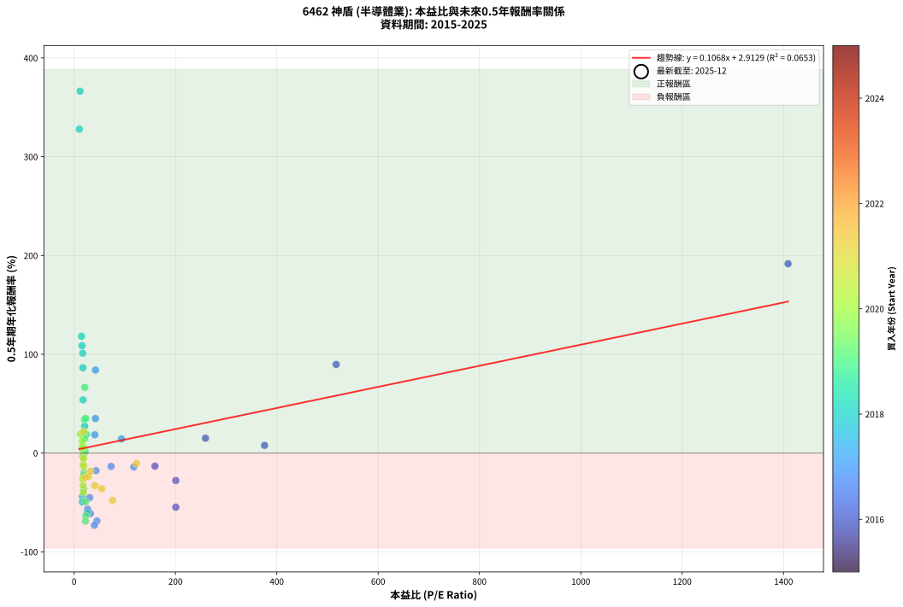
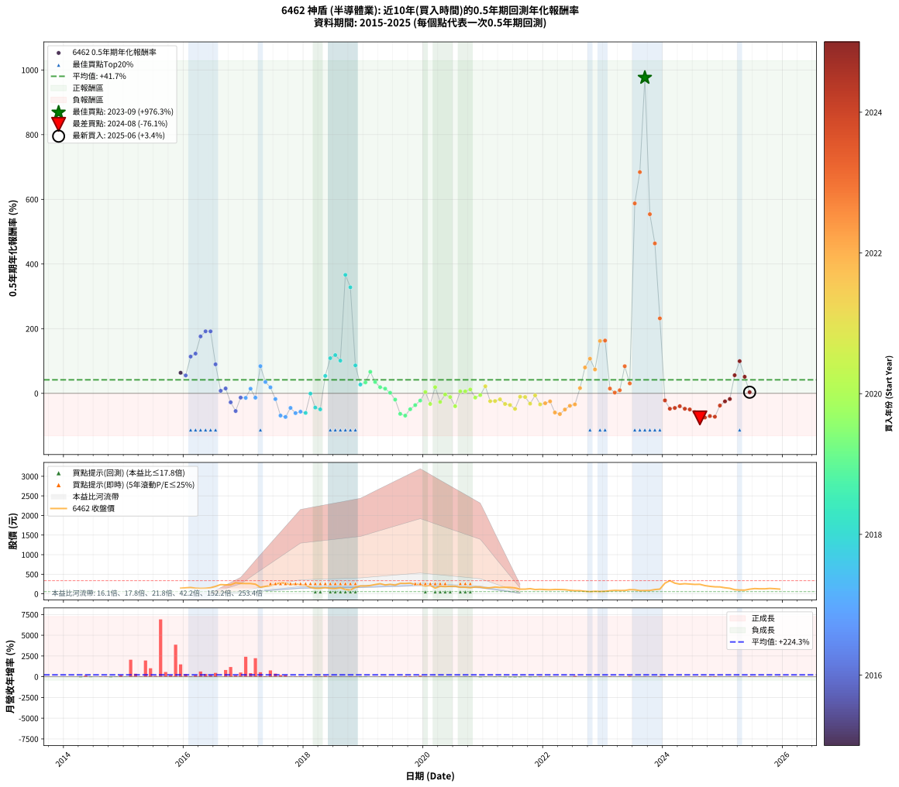

# 6462 神盾 - 本益比與未來報酬率分析

!!! info "報告資訊"
    - **股票代號**: 6462
    - **公司名稱**: 神盾
    - **產業別**: 半導體業
    - **分析期間**: 2015-2025 (115 個數據點)
    - **資料來源**: Type 12 (ShowMonthlyK_ChartFlow) 月收盤價與本益比
    - **報酬率口徑**: 含現金股利 (簡化: 年度合計，假設每年7/1入帳)
    - **報告生成時間**: 2026-01-07 19:11:26 CST

## 📈 視覺化圖表

### 圖表1: 本益比 vs 未來報酬率關係

*圖表1：6462 神盾 本益比與0.5年期未來報酬率關係 (2015-2025)*

### 圖表2: 歷年買入時點的0.5年期實際報酬率

*圖表2：6462 神盾 歷年買入時點的0.5年期實際報酬率 (2015-2025)*

## 📍 買點訊號說明

本報告提供兩種買點提示訊號（顯示於圖表2的股價子圖中）：

### ▲ 小綠色三角形（回測驗證）
- **計算方式**: 使用全部歷史資料計算本益比第25百分位數
- **用途**: 事後驗證，顯示歷史上哪些時點確實為低估區
- **限制**: 當下無法判斷，僅供回測參考
- **特性**: 後見之明（Look-Ahead Bias）

### ▲ 小橘色三角形（即時訊號）
- **計算方式**: 使用截至當月的過去5年資料計算本益比第25百分位數
- **用途**: 實際投資決策，當時即可判斷
- **優勢**: 可操作性強，符合實務需求
- **特性**: 無後見之明，滾動窗口計算

!!! tip "如何使用兩種訊號"
    - **綠色▲** 幫助理解歷史估值機會，驗證策略有效性
    - **橘色▲** 可作為實際買進參考，但仍需搭配基本面分析
    - 兩種訊號重疊時，表示即時判斷與事後驗證一致，信心度較高
    - 僅有綠色▲時，表示當時無法判斷（需要未來資料才能確認）
    - 僅有橘色▲時，表示即時判斷為買點，但事後可能不是最佳時機

## 📊 估值分析摘要

| 指標 | 數值 |
|:---:|:---:|
| **目前本益比** (2025-06) | **nan 倍** |
| **歷史平均本益比** | 76.31 倍 |
| **估值水準** | 🟡 合理範圍 |
| **預期0.5年年化報酬率** | **+nan%** |
| **歷史平均報酬率** | +41.73% |
| **相關係數 (R²)** | 0.0653 |
| **趨勢線斜率** | 0.1068 |

!!! abstract "核心洞察"
    目前本益比接近歷史平均，預期報酬率符合長期趨勢

    根據歷史數據回測，6462 神盾 在目前本益比 **nan倍** 的估值水準下，
    預期未來0.5年年化報酬率約為 **+nan%**。

    **重要提醒**: 本分析基於歷史數據統計，實際報酬率會受到公司基本面變化、產業趨勢、
    總體經濟環境等多重因素影響。R² = 0.07 表示本益比可解釋約 6.5% 的報酬率變異。

## 📈 歷史估值統計

### 最佳買點 (最高報酬率)

| 項目 | 數值 |
|:---:|:---:|
| 起始時間 | 2023-09 |
| 當時本益比 | nan 倍 |
| 起始價格 | 83.4 元 |
| 0.5年後價格 | 272.5 元 |
| **0.5年年化報酬率** | **+976.30%** |

### 最差買點 (最低報酬率)

| 項目 | 數值 |
|:---:|:---:|
| 起始時間 | 2024-08 |
| 當時本益比 | nan 倍 |
| 起始價格 | 243.0 元 |
| 0.5年後價格 | 106.0 元 |
| **0.5年年化報酬率** | **-76.05%** |

## 🎯 投資啟示

### 本益比與報酬率關係

趨勢線方程式: **y = 0.1068x + 2.9129**

!!! info "弱相關或正相關"
    本益比與未來報酬率相關性較弱。這可能表示該股票的報酬率更多受到
    公司成長性、產業趨勢等因素影響，而非估值水準。**需綜合考量多項指標**。

### 估值區間建議

基於歷史數據分析:

- **🟢 低估區** (P/E < 61.0): 預期報酬率較高，可考慮增加持股
- **🟡 合理區** (P/E 61.0-91.6): 預期報酬率符合長期趨勢，正常持有
- **🔴 高估區** (P/E > 91.6): 預期報酬率較低，可考慮減碼或觀望

!!! danger "風險提示"
    - 過去表現不代表未來結果
    - 本分析假設公司基本面無重大結構性變化
    - 產業環境劇變可能使歷史規律失效
    - 應結合公司財報、產業趨勢、總體經濟等多重因素綜合判斷

!!! success "長期投資觀點"
    歷史數據顯示，在合理或低估的估值水準買入並長期持有，
    往往能獲得較佳的投資報酬。**耐心等待好價格**是價值投資的核心原則。

## 📊 數據品質

- **資料來源**: GoodInfo.tw Type 12 (ShowMonthlyK_ChartFlow)
- **資料頻率**: 月度收盤價與本益比
- **回測期間**: 2015-2025
- **數據點數量**: 115 個 (每個點代表一次0.5年期回測)

### 計算方法說明

1. **0.5年期年化報酬率**:
   - 對每個歷史時點，計算其後0.5年的實際投資報酬率
   - 期末價值(不含股利): 期末價格
   - 期末價值(含現金股利): 期末價格 + 持有期間內的現金股利合計 (簡化: 年度合計，假設每年7/1入帳)
   - 公式: 年化報酬率 = [(期末價值/期初價格)^(1/年數) - 1] × 100%

2. **本益比 (P/E Ratio)**:
   - 使用當時的月收盤價與EPS計算
   - 資料來源: Type 12 月度河流圖本益比數據

3. **趨勢線 (Linear Regression)**:
   - 使用最小平方法擬合線性趨勢線
   - R²值衡量本益比對報酬率的解釋能力

---

*本報告由 Stock Analysis System v1.9.0 自動生成*
*數據更新時間: 2026-01-07 19:11:26 CST*

## 📋 月度回測明細表

（每一列對應時間線圖中的一個買入點；可用來對照 SVG 圖上的每個點。）

| 買入月份 | 賣出月份 | 回測期限_年 | 實際持有年數 | 買入本益比_倍 | 買入收盤價_元 | 賣出收盤價_元 | 現金股利合計_元 | 總報酬率_pct | 年化報酬率_pct |
| --- | --- | --- | --- | --- | --- | --- | --- | --- | --- |
| 2015-12 | 2016-07 | 0.5 | 0.583 |  | 143.00 | 190.50 | 0.00 | +33.22 | +63.53 |
| 2016-01 | 2016-07 | 0.5 | 0.498 |  | 153.00 | 190.50 | 0.00 | +24.51 | +55.26 |
| 2016-02 | 2016-08 | 0.5 | 0.501 |  | 161.00 | 235.50 | 0.00 | +46.27 | +113.63 |
| 2016-03 | 2016-10 | 0.5 | 0.586 |  | 143.50 | 229.50 | 0.00 | +59.93 | +122.88 |
| 2016-04 | 2016-10 | 0.5 | 0.501 |  | 138.00 | 229.50 | 0.00 | +66.30 | +176.00 |
| 2016-05 | 2016-12 | 0.5 | 0.586 |  | 141.50 | 265.00 | 0.00 | +87.28 | +191.80 |
| 2016-06 | 2016-12 | 0.5 | 0.501 | 1409.00 | 155.00 | 265.00 | 0.00 | +70.97 | +191.66 |
| 2016-07 | 2017-01 | 0.5 | 0.504 | 517.20 | 190.50 | 263.00 | 0.00 | +38.06 | +89.68 |
| 2016-08 | 2017-03 | 0.5 | 0.580 | 375.80 | 235.50 | 246.00 | 0.00 | +4.46 | +7.80 |
| 2016-09 | 2017-03 | 0.5 | 0.496 | 259.30 | 229.50 | 246.00 | 0.00 | +7.19 | +15.04 |
| 2016-10 | 2017-05 | 0.5 | 0.580 | 200.70 | 229.50 | 190.00 | 0.00 | -17.21 | -27.78 |
| 2016-11 | 2017-05 | 0.5 | 0.496 | 200.80 | 281.50 | 190.00 | 0.00 | -32.50 | -54.76 |
| 2016-12 | 2017-07 | 0.5 | 0.580 | 159.60 | 265.00 | 244.00 | 0.00 | -7.92 | -13.26 |
| 2017-01 | 2017-07 | 0.5 | 0.496 | 117.90 | 263.00 | 244.00 | 0.00 | -7.22 | -14.04 |
| 2017-02 | 2017-08 | 0.5 | 0.498 | 93.57 | 262.00 | 280.00 | 0.00 | +6.87 | +14.26 |
| 2017-03 | 2017-10 | 0.5 | 0.586 | 73.00 | 246.00 | 226.00 | 0.00 | -8.13 | -13.47 |
| 2017-04 | 2017-10 | 0.5 | 0.501 | 42.26 | 166.50 | 226.00 | 0.00 | +35.74 | +84.01 |
| 2017-05 | 2017-12 | 0.5 | 0.586 | 42.13 | 190.00 | 226.50 | 0.00 | +19.21 | +34.97 |
| 2017-06 | 2017-12 | 0.5 | 0.501 | 40.94 | 208.00 | 226.50 | 0.00 | +8.89 | +18.54 |
| 2017-07 | 2018-01 | 0.5 | 0.504 | 43.19 | 244.00 | 221.00 | 0.00 | -9.43 | -17.84 |
| 2017-08 | 2018-03 | 0.5 | 0.580 | 45.02 | 280.00 | 142.50 | 0.00 | -49.11 | -68.77 |
| 2017-09 | 2018-03 | 0.5 | 0.496 | 40.21 | 273.00 | 142.50 | 0.00 | -47.80 | -73.07 |
| 2017-10 | 2018-05 | 0.5 | 0.580 | 30.71 | 226.00 | 159.50 | 0.00 | -29.42 | -45.14 |
| 2017-11 | 2018-05 | 0.5 | 0.496 | 32.16 | 255.00 | 159.50 | 0.00 | -37.45 | -61.20 |
| 2017-12 | 2018-07 | 0.5 | 0.580 | 26.65 | 226.50 | 135.00 | 4.28 | -38.51 | -56.73 |
| 2018-01 | 2018-07 | 0.5 | 0.496 | 25.72 | 221.00 | 135.00 | 4.28 | -36.98 | -60.61 |
| 2018-02 | 2018-08 | 0.5 | 0.498 | 18.76 | 163.00 | 158.00 | 4.28 | -0.44 | -0.88 |
| 2018-03 | 2018-10 | 0.5 | 0.586 | 16.23 | 142.50 | 97.20 | 4.28 | -28.78 | -43.97 |
| 2018-04 | 2018-10 | 0.5 | 0.501 | 16.12 | 143.00 | 97.20 | 4.28 | -29.03 | -49.57 |
| 2018-05 | 2018-12 | 0.5 | 0.586 | 17.79 | 159.50 | 201.00 | 4.28 | +28.70 | +53.83 |
| 2018-06 | 2018-12 | 0.5 | 0.501 | 15.67 | 142.00 | 201.00 | 4.28 | +44.57 | +108.68 |
| 2018-07 | 2019-01 | 0.5 | 0.504 | 14.75 | 135.00 | 200.00 | 0.00 | +48.15 | +118.19 |
| 2018-08 | 2019-03 | 0.5 | 0.580 | 17.09 | 158.00 | 237.00 | 0.00 | +50.00 | +101.09 |
| 2018-09 | 2019-03 | 0.5 | 0.496 | 11.83 | 110.50 | 237.00 | 0.00 | +114.48 | +366.36 |
| 2018-10 | 2019-05 | 0.5 | 0.580 | 10.30 | 97.20 | 226.00 | 0.00 | +132.51 | +327.89 |
| 2018-11 | 2019-05 | 0.5 | 0.496 | 17.42 | 166.00 | 226.00 | 0.00 | +36.14 | +86.38 |
| 2018-12 | 2019-07 | 0.5 | 0.580 | 20.89 | 201.00 | 223.00 | 8.09 | +14.97 | +27.17 |
| 2019-01 | 2019-07 | 0.5 | 0.496 | 20.27 | 200.00 | 223.00 | 8.09 | +15.55 | +33.86 |
| 2019-02 | 2019-08 | 0.5 | 0.498 | 21.05 | 213.00 | 266.50 | 8.09 | +28.92 | +66.49 |
| 2019-03 | 2019-10 | 0.5 | 0.586 | 22.87 | 237.00 | 274.50 | 8.09 | +19.24 | +35.03 |
| 2019-04 | 2019-10 | 0.5 | 0.501 | 24.40 | 259.00 | 274.50 | 8.09 | +9.11 | +19.01 |
| 2019-05 | 2019-12 | 0.5 | 0.586 | 20.81 | 226.00 | 236.50 | 8.09 | +8.23 | +14.45 |
| 2019-06 | 2019-12 | 0.5 | 0.501 | 21.83 | 242.50 | 236.50 | 8.09 | +0.86 | +1.73 |
| 2019-07 | 2020-01 | 0.5 | 0.504 | 19.63 | 223.00 | 200.00 | 0.00 | -10.31 | -19.43 |
| 2019-08 | 2020-03 | 0.5 | 0.583 | 22.96 | 266.50 | 148.00 | 0.00 | -44.47 | -63.53 |
| 2019-09 | 2020-03 | 0.5 | 0.498 | 22.35 | 265.00 | 148.00 | 0.00 | -44.15 | -68.93 |
| 2019-10 | 2020-05 | 0.5 | 0.583 | 22.68 | 274.50 | 185.00 | 0.00 | -32.60 | -49.17 |
| 2019-11 | 2020-05 | 0.5 | 0.498 | 18.78 | 232.00 | 185.00 | 0.00 | -20.26 | -36.51 |
| 2019-12 | 2020-07 | 0.5 | 0.583 | 18.77 | 236.50 | 195.00 | 9.00 | -13.74 | -22.39 |
| 2020-01 | 2020-07 | 0.5 | 0.498 | 16.24 | 200.00 | 195.00 | 9.00 | +2.00 | +4.06 |
| 2020-02 | 2020-08 | 0.5 | 0.501 | 17.88 | 215.00 | 167.00 | 9.00 | -18.14 | -32.93 |
| 2020-03 | 2020-10 | 0.5 | 0.586 | 12.61 | 148.00 | 155.00 | 9.00 | +10.81 | +19.15 |
| 2020-04 | 2020-10 | 0.5 | 0.501 | 16.73 | 191.50 | 155.00 | 9.00 | -14.36 | -26.61 |
| 2020-05 | 2020-12 | 0.5 | 0.586 | 16.58 | 185.00 | 172.00 | 9.00 | -2.16 | -3.66 |
| 2020-06 | 2020-12 | 0.5 | 0.501 | 17.71 | 192.50 | 172.00 | 9.00 | -5.97 | -11.57 |
| 2020-07 | 2021-01 | 0.5 | 0.504 | 18.43 | 195.00 | 151.00 | 0.00 | -22.56 | -39.81 |
| 2020-08 | 2021-03 | 0.5 | 0.580 | 16.22 | 167.00 | 173.00 | 0.00 | +3.59 | +6.27 |
| 2020-09 | 2021-03 | 0.5 | 0.496 | 16.79 | 168.00 | 173.00 | 0.00 | +2.98 | +6.10 |
| 2020-10 | 2021-05 | 0.5 | 0.580 | 15.95 | 155.00 | 165.50 | 0.00 | +6.77 | +11.96 |
| 2020-11 | 2021-05 | 0.5 | 0.496 | 18.83 | 177.50 | 165.50 | 0.00 | -6.76 | -13.17 |
| 2020-12 | 2021-07 | 0.5 | 0.580 | 18.82 | 172.00 | 151.50 | 15.00 | -3.20 | -5.45 |
| 2021-01 | 2021-07 | 0.5 | 0.496 | 18.60 | 151.00 | 151.50 | 15.00 | +10.26 | +21.80 |
| 2021-02 | 2021-08 | 0.5 | 0.498 | 21.77 | 154.50 | 119.50 | 15.00 | -12.94 | -24.29 |
| 2021-03 | 2021-10 | 0.5 | 0.586 | 28.47 | 173.00 | 132.50 | 15.00 | -14.74 | -23.83 |
| 2021-04 | 2021-10 | 0.5 | 0.501 | 32.33 | 163.50 | 132.50 | 15.00 | -9.79 | -18.58 |
| 2021-05 | 2021-12 | 0.5 | 0.586 | 41.01 | 165.50 | 116.00 | 15.00 | -20.85 | -32.90 |
| 2021-06 | 2021-12 | 0.5 | 0.501 | 54.39 | 164.00 | 116.00 | 15.00 | -20.12 | -36.14 |
| 2021-07 | 2022-01 | 0.5 | 0.504 | 75.97 | 151.50 | 109.00 | 0.00 | -28.05 | -47.98 |
| 2021-08 | 2022-03 | 0.5 | 0.580 | 122.80 | 119.50 | 112.00 | 0.00 | -6.28 | -10.57 |
| 2021-09 | 2022-03 | 0.5 | 0.496 |  | 119.00 | 112.00 | 0.00 | -5.88 | -11.52 |
| 2021-10 | 2022-05 | 0.5 | 0.580 |  | 132.50 | 106.00 | 0.00 | -20.00 | -31.92 |
| 2021-11 | 2022-05 | 0.5 | 0.496 |  | 109.50 | 106.00 | 0.00 | -3.20 | -6.35 |
| 2021-12 | 2022-07 | 0.5 | 0.580 |  | 116.00 | 80.90 | 10.00 | -21.64 | -34.30 |
| 2022-01 | 2022-07 | 0.5 | 0.496 |  | 109.00 | 80.90 | 10.00 | -16.61 | -30.68 |
| 2022-02 | 2022-08 | 0.5 | 0.498 |  | 104.50 | 80.60 | 10.00 | -13.30 | -24.91 |
| 2022-03 | 2022-10 | 0.5 | 0.586 |  | 112.00 | 56.10 | 10.00 | -40.98 | -59.34 |
| 2022-04 | 2022-10 | 0.5 | 0.501 |  | 110.50 | 56.10 | 10.00 | -40.18 | -64.14 |
| 2022-05 | 2022-12 | 0.5 | 0.586 |  | 106.00 | 60.50 | 10.00 | -33.49 | -50.15 |
| 2022-06 | 2022-12 | 0.5 | 0.501 |  | 90.00 | 60.50 | 10.00 | -21.67 | -38.58 |
| 2022-07 | 2023-01 | 0.5 | 0.504 |  | 80.90 | 65.50 | 0.00 | -19.04 | -34.24 |
| 2022-08 | 2023-03 | 0.5 | 0.580 |  | 80.60 | 87.90 | 0.00 | +9.06 | +16.11 |
| 2022-09 | 2023-03 | 0.5 | 0.496 |  | 65.70 | 87.90 | 0.00 | +33.79 | +79.94 |
| 2022-10 | 2023-05 | 0.5 | 0.580 |  | 56.10 | 85.60 | 0.00 | +52.58 | +107.09 |
| 2022-11 | 2023-05 | 0.5 | 0.496 |  | 65.10 | 85.60 | 0.00 | +31.49 | +73.75 |
| 2022-12 | 2023-07 | 0.5 | 0.580 |  | 60.50 | 103.00 | 2.80 | +74.87 | +161.93 |
| 2023-01 | 2023-07 | 0.5 | 0.496 |  | 65.50 | 103.00 | 2.80 | +61.52 | +163.15 |
| 2023-02 | 2023-08 | 0.5 | 0.498 |  | 79.20 | 82.00 | 2.80 | +7.07 | +14.69 |
| 2023-03 | 2023-10 | 0.5 | 0.586 |  | 87.90 | 86.30 | 2.80 | +1.36 | +2.34 |
| 2023-04 | 2023-10 | 0.5 | 0.501 |  | 85.10 | 86.30 | 2.80 | +4.70 | +9.60 |
| 2023-05 | 2023-12 | 0.5 | 0.586 |  | 85.60 | 119.50 | 2.80 | +42.87 | +83.85 |
| 2023-06 | 2023-12 | 0.5 | 0.501 |  | 107.00 | 119.50 | 2.80 | +14.30 | +30.57 |
| 2023-07 | 2024-01 | 0.5 | 0.504 |  | 103.00 | 272.00 | 0.00 | +164.08 | +587.32 |
| 2023-08 | 2024-03 | 0.5 | 0.583 |  | 82.00 | 272.50 | 0.00 | +232.32 | +684.07 |
| 2023-09 | 2024-03 | 0.5 | 0.498 |  | 83.40 | 272.50 | 0.00 | +226.74 | +976.30 |
| 2023-10 | 2024-05 | 0.5 | 0.583 |  | 86.30 | 258.00 | 0.00 | +198.96 | +553.99 |
| 2023-11 | 2024-05 | 0.5 | 0.498 |  | 109.00 | 258.00 | 0.00 | +136.70 | +463.58 |
| 2023-12 | 2024-07 | 0.5 | 0.583 |  | 119.50 | 240.50 | 0.00 | +101.26 | +231.79 |
| 2024-01 | 2024-07 | 0.5 | 0.498 |  | 272.00 | 240.50 | 0.00 | -11.58 | -21.89 |
| 2024-02 | 2024-08 | 0.5 | 0.501 |  | 336.00 | 243.00 | 0.00 | -27.68 | -47.63 |
| 2024-03 | 2024-10 | 0.5 | 0.586 |  | 272.50 | 191.50 | 0.00 | -29.72 | -45.23 |
| 2024-04 | 2024-10 | 0.5 | 0.501 |  | 247.00 | 191.50 | 0.00 | -22.47 | -39.83 |
| 2024-05 | 2024-12 | 0.5 | 0.586 |  | 258.00 | 176.50 | 0.00 | -31.59 | -47.69 |
| 2024-06 | 2024-12 | 0.5 | 0.501 |  | 249.50 | 176.50 | 0.00 | -29.26 | -49.89 |
| 2024-07 | 2025-01 | 0.5 | 0.504 |  | 240.50 | 154.50 | 0.00 | -35.76 | -58.46 |
| 2024-08 | 2025-03 | 0.5 | 0.580 |  | 243.00 | 106.00 | 0.00 | -56.38 | -76.05 |
| 2024-09 | 2025-03 | 0.5 | 0.496 |  | 210.00 | 106.00 | 0.00 | -49.52 | -74.83 |
| 2024-10 | 2025-05 | 0.5 | 0.580 |  | 191.50 | 94.60 | 0.00 | -50.60 | -70.33 |
| 2024-11 | 2025-05 | 0.5 | 0.496 |  | 179.00 | 94.60 | 0.00 | -47.15 | -72.39 |
| 2024-12 | 2025-07 | 0.5 | 0.580 |  | 176.50 | 134.00 | 0.00 | -24.08 | -37.79 |
| 2025-01 | 2025-07 | 0.5 | 0.496 |  | 154.50 | 134.00 | 0.00 | -13.27 | -24.97 |
| 2025-02 | 2025-08 | 0.5 | 0.498 |  | 141.00 | 128.00 | 0.00 | -9.22 | -17.64 |
| 2025-03 | 2025-10 | 0.5 | 0.586 |  | 106.00 | 137.50 | 0.00 | +29.72 | +55.91 |
| 2025-04 | 2025-10 | 0.5 | 0.501 |  | 97.30 | 137.50 | 0.00 | +41.32 | +99.42 |
| 2025-05 | 2025-12 | 0.5 | 0.586 |  | 94.60 | 120.50 | 0.00 | +27.38 | +51.14 |
| 2025-06 | 2025-12 | 0.5 | 0.501 |  | 118.50 | 120.50 | 0.00 | +1.69 | +3.40 |
