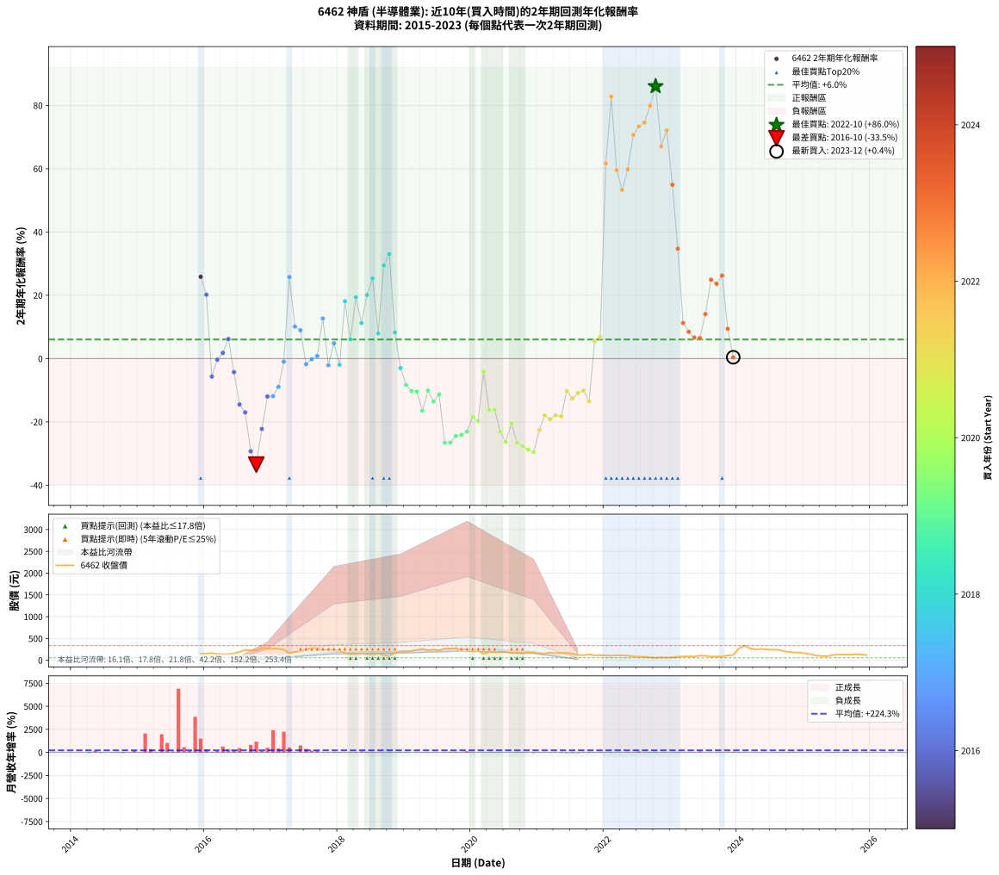

# 6462 神盾 - 本益比與未來報酬率分析

!!! info "報告資訊"
    - **股票代號**: 6462
    - **公司名稱**: 神盾
    - **產業別**: 半導體業
    - **分析期間**: 2015-2023 (97 個數據點)
    - **資料來源**: Type 12 (ShowMonthlyK_ChartFlow) 月收盤價與本益比
    - **報酬率口徑**: 含現金股利 (簡化: 年度合計，假設每年7/1入帳)
    - **報告生成時間**: 2026-01-09 21:18:11 CST

## 📈 視覺化圖表

### 圖表1: 本益比 vs 未來報酬率關係

*圖表1：6462 神盾 本益比與2年期未來報酬率關係 (2015-2023)*

### 圖表2: 歷年買入時點的2年期實際報酬率

*圖表2：6462 神盾 歷年買入時點的2年期實際報酬率 (2015-2023)*

## 📍 買點訊號說明

本報告提供兩種買點提示訊號（顯示於圖表2的股價子圖中）：

### ▲ 小綠色三角形（回測驗證）
- **計算方式**: 使用全部歷史資料計算本益比第25百分位數
- **用途**: 事後驗證，顯示歷史上哪些時點確實為低估區
- **限制**: 當下無法判斷，僅供回測參考
- **特性**: 後見之明（Look-Ahead Bias）

### ▲ 小橘色三角形（即時訊號）
- **計算方式**: 使用截至當月的過去5年資料計算本益比第25百分位數
- **用途**: 實際投資決策，當時即可判斷
- **優勢**: 可操作性強，符合實務需求
- **特性**: 無後見之明，滾動窗口計算

!!! tip "如何使用兩種訊號"
    - **綠色▲** 幫助理解歷史估值機會，驗證策略有效性
    - **橘色▲** 可作為實際買進參考，但仍需搭配基本面分析
    - 兩種訊號重疊時，表示即時判斷與事後驗證一致，信心度較高
    - 僅有綠色▲時，表示當時無法判斷（需要未來資料才能確認）
    - 僅有橘色▲時，表示即時判斷為買點，但事後可能不是最佳時機

## 📊 估值分析摘要

| 指標 | 數值 |
|:---:|:---:|
| **目前本益比** (2023-12) | **nan 倍** |
| **歷史平均本益比** | 76.31 倍 |
| **估值水準** | 🟡 合理範圍 |
| **預期2年年化報酬率** | **+nan%** |
| **歷史平均報酬率** | +6.03% |
| **相關係數 (R²)** | 0.0047 |
| **趨勢線斜率** | -0.0059 |

!!! abstract "核心洞察"
    目前本益比接近歷史平均，預期報酬率符合長期趨勢

    根據歷史數據回測，6462 神盾 在目前本益比 **nan倍** 的估值水準下，
    預期未來2年年化報酬率約為 **+nan%**。

    **重要提醒**: 本分析基於歷史數據統計，實際報酬率會受到公司基本面變化、產業趨勢、
    總體經濟環境等多重因素影響。R² = 0.00 表示本益比可解釋約 0.5% 的報酬率變異。

## 📈 歷史估值統計

### 最佳買點 (最高報酬率)

| 項目 | 數值 |
|:---:|:---:|
| 起始時間 | 2022-10 |
| 當時本益比 | nan 倍 |
| 起始價格 | 56.1 元 |
| 2年後價格 | 191.5 元 |
| **2年年化報酬率** | **+86.02%** |

### 最差買點 (最低報酬率)

| 項目 | 數值 |
|:---:|:---:|
| 起始時間 | 2016-10 |
| 當時本益比 | 200.70 倍 |
| 起始價格 | 229.5 元 |
| 2年後價格 | 97.2 元 |
| **2年年化報酬率** | **-33.52%** |

## 🎯 投資啟示

### 本益比與報酬率關係

趨勢線方程式: **y = -0.0059x + -7.7081**

!!! note "負相關"
    本益比與未來報酬率呈現負相關。較低的本益比通常帶來較高的未來報酬率，
    但相關性不算非常強。**估值仍是重要參考指標之一**。

### 估值區間建議

基於歷史數據分析:

- **🟢 低估區** (P/E < 61.0): 預期報酬率較高，可考慮增加持股
- **🟡 合理區** (P/E 61.0-91.6): 預期報酬率符合長期趨勢，正常持有
- **🔴 高估區** (P/E > 91.6): 預期報酬率較低，可考慮減碼或觀望

!!! danger "風險提示"
    - 過去表現不代表未來結果
    - 本分析假設公司基本面無重大結構性變化
    - 產業環境劇變可能使歷史規律失效
    - 應結合公司財報、產業趨勢、總體經濟等多重因素綜合判斷

!!! success "長期投資觀點"
    歷史數據顯示，在合理或低估的估值水準買入並長期持有，
    往往能獲得較佳的投資報酬。**耐心等待好價格**是價值投資的核心原則。

## 📊 數據品質

- **資料來源**: GoodInfo.tw Type 12 (ShowMonthlyK_ChartFlow)
- **資料頻率**: 月度收盤價與本益比
- **回測期間**: 2015-2023
- **數據點數量**: 97 個 (每個點代表一次2年期回測)

### 計算方法說明

1. **2年期年化報酬率**:
   - 對每個歷史時點，計算其後2年的實際投資報酬率
   - 期末價值(不含股利): 期末價格
   - 期末價值(含現金股利): 期末價格 + 持有期間內的現金股利合計 (簡化: 年度合計，假設每年7/1入帳)
   - 公式: 年化報酬率 = [(期末價值/期初價格)^(1/年數) - 1] × 100%

2. **本益比 (P/E Ratio)**:
   - 使用當時的月收盤價與EPS計算
   - 資料來源: Type 12 月度河流圖本益比數據

3. **趨勢線 (Linear Regression)**:
   - 使用最小平方法擬合線性趨勢線
   - R²值衡量本益比對報酬率的解釋能力

---

*本報告由 Stock Analysis System v1.9.0 自動生成*
*數據更新時間: 2026-01-09 21:18:11 CST*

## 📋 月度回測明細表

（每一列對應時間線圖中的一個買入點；可用來對照 SVG 圖上的每個點。）

| 買入月份 | 賣出月份 | 回測期限_年 | 實際持有年數 | 買入本益比_倍 | 買入收盤價_元 | 賣出收盤價_元 | 現金股利合計_元 | 總報酬率_pct | 年化報酬率_pct |
| --- | --- | --- | --- | --- | --- | --- | --- | --- | --- |
| 2015-12 | 2017-12 | 2 | 2.001 |  | 143.00 | 226.50 | 0.00 | +58.39 | +25.83 |
| 2016-01 | 2018-01 | 2 | 2.001 |  | 153.00 | 221.00 | 0.00 | +44.44 | +20.17 |
| 2016-02 | 2018-03 | 2 | 2.081 |  | 161.00 | 142.50 | 0.00 | -11.49 | -5.70 |
| 2016-03 | 2018-03 | 2 | 1.999 |  | 143.50 | 142.50 | 0.00 | -0.70 | -0.35 |
| 2016-04 | 2018-04 | 2 | 1.999 |  | 138.00 | 143.00 | 0.00 | +3.62 | +1.80 |
| 2016-05 | 2018-05 | 2 | 1.999 |  | 141.50 | 159.50 | 0.00 | +12.72 | +6.17 |
| 2016-06 | 2018-06 | 2 | 1.999 | 1409.00 | 155.00 | 142.00 | 0.00 | -8.39 | -4.29 |
| 2016-07 | 2018-07 | 2 | 1.999 | 517.20 | 190.50 | 135.00 | 4.28 | -26.89 | -14.50 |
| 2016-08 | 2018-08 | 2 | 1.999 | 375.80 | 235.50 | 158.00 | 4.28 | -31.09 | -17.00 |
| 2016-09 | 2018-09 | 2 | 1.999 | 259.30 | 229.50 | 110.50 | 4.28 | -49.99 | -29.30 |
| 2016-10 | 2018-10 | 2 | 1.999 | 200.70 | 229.50 | 97.20 | 4.28 | -55.78 | -33.52 |
| 2016-11 | 2018-11 | 2 | 1.999 | 200.80 | 281.50 | 166.00 | 4.28 | -39.51 | -22.24 |
| 2016-12 | 2018-12 | 2 | 1.999 | 159.60 | 265.00 | 201.00 | 4.28 | -22.53 | -11.99 |
| 2017-01 | 2019-01 | 2 | 1.999 | 117.90 | 263.00 | 200.00 | 4.28 | -22.33 | -11.87 |
| 2017-02 | 2019-02 | 2 | 1.999 | 93.57 | 262.00 | 213.00 | 4.28 | -17.07 | -8.94 |
| 2017-03 | 2019-03 | 2 | 1.999 | 73.00 | 246.00 | 237.00 | 4.28 | -1.92 | -0.96 |
| 2017-04 | 2019-04 | 2 | 1.999 | 42.26 | 166.50 | 259.00 | 4.28 | +58.13 | +25.77 |
| 2017-05 | 2019-05 | 2 | 1.999 | 42.13 | 190.00 | 226.00 | 4.28 | +21.20 | +10.10 |
| 2017-06 | 2019-06 | 2 | 1.999 | 40.94 | 208.00 | 242.50 | 4.28 | +18.65 | +8.93 |
| 2017-07 | 2019-07 | 2 | 1.999 | 43.19 | 244.00 | 223.00 | 12.38 | -3.53 | -1.78 |
| 2017-08 | 2019-08 | 2 | 1.999 | 45.02 | 280.00 | 266.50 | 12.38 | -0.40 | -0.20 |
| 2017-09 | 2019-09 | 2 | 1.999 | 40.21 | 273.00 | 265.00 | 12.38 | +1.60 | +0.80 |
| 2017-10 | 2019-10 | 2 | 1.999 | 30.71 | 226.00 | 274.50 | 12.38 | +26.94 | +12.68 |
| 2017-11 | 2019-11 | 2 | 1.999 | 32.16 | 255.00 | 232.00 | 12.38 | -4.17 | -2.11 |
| 2017-12 | 2019-12 | 2 | 1.999 | 26.65 | 226.50 | 236.50 | 12.38 | +9.88 | +4.83 |
| 2018-01 | 2020-01 | 2 | 1.999 | 25.72 | 221.00 | 200.00 | 12.38 | -3.90 | -1.97 |
| 2018-02 | 2020-02 | 2 | 1.999 | 18.76 | 163.00 | 215.00 | 12.38 | +39.49 | +18.12 |
| 2018-03 | 2020-03 | 2 | 2.001 | 16.23 | 142.50 | 148.00 | 12.38 | +12.54 | +6.08 |
| 2018-04 | 2020-04 | 2 | 2.001 | 16.12 | 143.00 | 191.50 | 12.38 | +42.57 | +19.39 |
| 2018-05 | 2020-05 | 2 | 2.001 | 17.79 | 159.50 | 185.00 | 12.38 | +23.75 | +11.23 |
| 2018-06 | 2020-06 | 2 | 2.001 | 15.67 | 142.00 | 192.50 | 12.38 | +44.28 | +20.10 |
| 2018-07 | 2020-07 | 2 | 2.001 | 14.75 | 135.00 | 195.00 | 17.09 | +57.11 | +25.32 |
| 2018-08 | 2020-08 | 2 | 2.001 | 17.09 | 158.00 | 167.00 | 17.09 | +16.52 | +7.94 |
| 2018-09 | 2020-09 | 2 | 2.001 | 11.83 | 110.50 | 168.00 | 17.09 | +67.51 | +29.40 |
| 2018-10 | 2020-10 | 2 | 2.001 | 10.30 | 97.20 | 155.00 | 17.09 | +77.05 | +33.03 |
| 2018-11 | 2020-11 | 2 | 2.001 | 17.42 | 166.00 | 177.50 | 17.09 | +17.23 | +8.26 |
| 2018-12 | 2020-12 | 2 | 2.001 | 20.89 | 201.00 | 172.00 | 17.09 | -5.92 | -3.00 |
| 2019-01 | 2021-01 | 2 | 2.001 | 20.27 | 200.00 | 151.00 | 17.09 | -15.95 | -8.32 |
| 2019-02 | 2021-02 | 2 | 2.001 | 21.05 | 213.00 | 154.50 | 17.09 | -19.44 | -10.24 |
| 2019-03 | 2021-03 | 2 | 2.001 | 22.87 | 237.00 | 173.00 | 17.09 | -19.79 | -10.43 |
| 2019-04 | 2021-04 | 2 | 2.001 | 24.40 | 259.00 | 163.50 | 17.09 | -30.27 | -16.49 |
| 2019-05 | 2021-05 | 2 | 2.001 | 20.81 | 226.00 | 165.50 | 17.09 | -19.21 | -10.11 |
| 2019-06 | 2021-06 | 2 | 2.001 | 21.83 | 242.50 | 164.00 | 17.09 | -25.32 | -13.57 |
| 2019-07 | 2021-07 | 2 | 2.001 | 19.63 | 223.00 | 151.50 | 24.00 | -21.30 | -11.28 |
| 2019-08 | 2021-08 | 2 | 2.001 | 22.96 | 266.50 | 119.50 | 24.00 | -46.15 | -26.60 |
| 2019-09 | 2021-09 | 2 | 2.001 | 22.35 | 265.00 | 119.00 | 24.00 | -46.04 | -26.53 |
| 2019-10 | 2021-10 | 2 | 2.001 | 22.68 | 274.50 | 132.50 | 24.00 | -42.99 | -24.48 |
| 2019-11 | 2021-11 | 2 | 2.001 | 18.78 | 232.00 | 109.50 | 24.00 | -42.46 | -24.13 |
| 2019-12 | 2021-12 | 2 | 2.001 | 18.77 | 236.50 | 116.00 | 24.00 | -40.80 | -23.05 |
| 2020-01 | 2022-01 | 2 | 2.001 | 16.24 | 200.00 | 109.00 | 24.00 | -33.50 | -18.44 |
| 2020-02 | 2022-03 | 2 | 2.081 | 17.88 | 215.00 | 112.00 | 24.00 | -36.74 | -19.76 |
| 2020-03 | 2022-03 | 2 | 1.999 | 12.61 | 148.00 | 112.00 | 24.00 | -8.11 | -4.14 |
| 2020-04 | 2022-04 | 2 | 1.999 | 16.73 | 191.50 | 110.50 | 24.00 | -29.76 | -16.20 |
| 2020-05 | 2022-05 | 2 | 1.999 | 16.58 | 185.00 | 106.00 | 24.00 | -29.73 | -16.18 |
| 2020-06 | 2022-06 | 2 | 1.999 | 17.71 | 192.50 | 90.00 | 24.00 | -40.78 | -23.06 |
| 2020-07 | 2022-07 | 2 | 1.999 | 18.43 | 195.00 | 80.90 | 25.00 | -45.69 | -26.32 |
| 2020-08 | 2022-08 | 2 | 1.999 | 16.22 | 167.00 | 80.60 | 25.00 | -36.77 | -20.49 |
| 2020-09 | 2022-09 | 2 | 1.999 | 16.79 | 168.00 | 65.70 | 25.00 | -46.01 | -26.54 |
| 2020-10 | 2022-10 | 2 | 1.999 | 15.95 | 155.00 | 56.10 | 25.00 | -47.68 | -27.68 |
| 2020-11 | 2022-11 | 2 | 1.999 | 18.83 | 177.50 | 65.10 | 25.00 | -49.24 | -28.77 |
| 2020-12 | 2022-12 | 2 | 1.999 | 18.82 | 172.00 | 60.50 | 25.00 | -50.29 | -29.51 |
| 2021-01 | 2023-01 | 2 | 1.999 | 18.60 | 151.00 | 65.50 | 25.00 | -40.07 | -22.60 |
| 2021-02 | 2023-02 | 2 | 1.999 | 21.77 | 154.50 | 79.20 | 25.00 | -32.56 | -17.89 |
| 2021-03 | 2023-03 | 2 | 1.999 | 28.47 | 173.00 | 87.90 | 25.00 | -34.74 | -19.23 |
| 2021-04 | 2023-04 | 2 | 1.999 | 32.33 | 163.50 | 85.10 | 25.00 | -32.66 | -17.95 |
| 2021-05 | 2023-05 | 2 | 1.999 | 41.01 | 165.50 | 85.60 | 25.00 | -33.17 | -18.26 |
| 2021-06 | 2023-06 | 2 | 1.999 | 54.39 | 164.00 | 107.00 | 25.00 | -19.51 | -10.29 |
| 2021-07 | 2023-07 | 2 | 1.999 | 75.97 | 151.50 | 103.00 | 12.80 | -23.57 | -12.58 |
| 2021-08 | 2023-08 | 2 | 1.999 | 122.80 | 119.50 | 82.00 | 12.80 | -20.67 | -10.94 |
| 2021-09 | 2023-09 | 2 | 1.999 |  | 119.00 | 83.40 | 12.80 | -19.16 | -10.10 |
| 2021-10 | 2023-10 | 2 | 1.999 |  | 132.50 | 86.30 | 12.80 | -25.21 | -13.53 |
| 2021-11 | 2023-11 | 2 | 1.999 |  | 109.50 | 109.00 | 12.80 | +11.23 | +5.47 |
| 2021-12 | 2023-12 | 2 | 1.999 |  | 116.00 | 119.50 | 12.80 | +14.05 | +6.80 |
| 2022-01 | 2024-01 | 2 | 1.999 |  | 109.00 | 272.00 | 12.80 | +161.28 | +61.70 |
| 2022-02 | 2024-02 | 2 | 1.999 |  | 104.50 | 336.00 | 12.80 | +233.78 | +82.77 |
| 2022-03 | 2024-03 | 2 | 2.001 |  | 112.00 | 272.50 | 12.80 | +154.73 | +59.55 |
| 2022-04 | 2024-04 | 2 | 2.001 |  | 110.50 | 247.00 | 12.80 | +135.11 | +53.29 |
| 2022-05 | 2024-05 | 2 | 2.001 |  | 106.00 | 258.00 | 12.80 | +155.47 | +59.78 |
| 2022-06 | 2024-06 | 2 | 2.001 |  | 90.00 | 249.50 | 12.80 | +191.44 | +70.65 |
| 2022-07 | 2024-07 | 2 | 2.001 |  | 80.90 | 240.50 | 2.80 | +200.74 | +73.35 |
| 2022-08 | 2024-08 | 2 | 2.001 |  | 80.60 | 243.00 | 2.80 | +204.96 | +74.56 |
| 2022-09 | 2024-09 | 2 | 2.001 |  | 65.70 | 210.00 | 2.80 | +223.89 | +79.90 |
| 2022-10 | 2024-10 | 2 | 2.001 |  | 56.10 | 191.50 | 2.80 | +246.34 | +86.02 |
| 2022-11 | 2024-11 | 2 | 2.001 |  | 65.10 | 179.00 | 2.80 | +179.26 | +67.05 |
| 2022-12 | 2024-12 | 2 | 2.001 |  | 60.50 | 176.50 | 2.80 | +196.36 | +72.09 |
| 2023-01 | 2025-01 | 2 | 2.001 |  | 65.50 | 154.50 | 2.80 | +140.15 | +54.92 |
| 2023-02 | 2025-02 | 2 | 2.001 |  | 79.20 | 141.00 | 2.80 | +81.56 | +34.72 |
| 2023-03 | 2025-03 | 2 | 2.001 |  | 87.90 | 106.00 | 2.80 | +23.77 | +11.25 |
| 2023-04 | 2025-04 | 2 | 2.001 |  | 85.10 | 97.30 | 2.80 | +17.62 | +8.45 |
| 2023-05 | 2025-05 | 2 | 2.001 |  | 85.60 | 94.60 | 2.80 | +13.78 | +6.66 |
| 2023-06 | 2025-06 | 2 | 2.001 |  | 107.00 | 118.50 | 2.80 | +13.36 | +6.47 |
| 2023-07 | 2025-07 | 2 | 2.001 |  | 103.00 | 134.00 | 0.00 | +30.10 | +14.05 |
| 2023-08 | 2025-08 | 2 | 2.001 |  | 82.00 | 128.00 | 0.00 | +56.10 | +24.92 |
| 2023-09 | 2025-09 | 2 | 2.001 |  | 83.40 | 127.50 | 0.00 | +52.88 | +23.63 |
| 2023-10 | 2025-10 | 2 | 2.001 |  | 86.30 | 137.50 | 0.00 | +59.33 | +26.21 |
| 2023-11 | 2025-11 | 2 | 2.001 |  | 109.00 | 130.50 | 0.00 | +19.72 | +9.41 |
| 2023-12 | 2025-12 | 2 | 2.001 |  | 119.50 | 120.50 | 0.00 | +0.84 | +0.42 |
