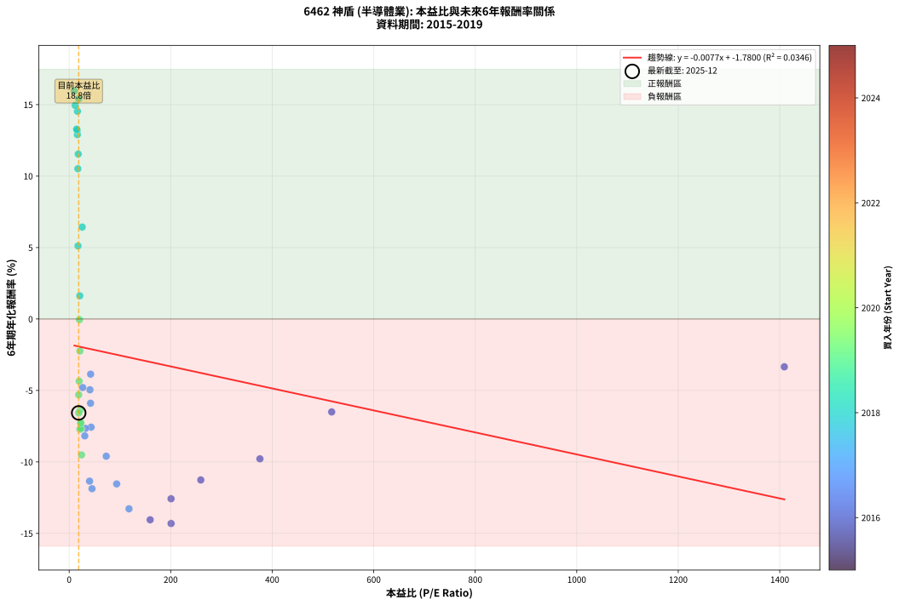
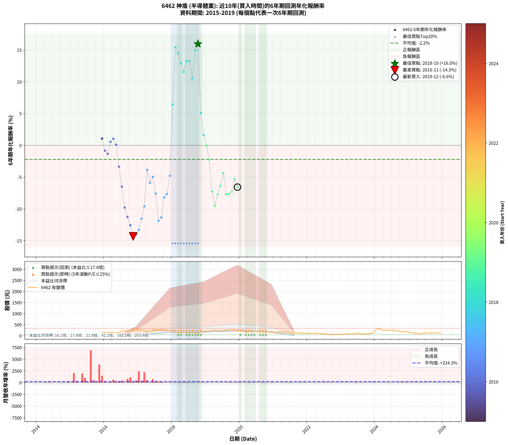

# 6462 神盾 - 本益比與未來報酬率分析

!!! info "報告資訊"
    - **股票代號**: 6462
    - **公司名稱**: 神盾
    - **產業別**: 半導體業
    - **分析期間**: 2015-2019 (49 個數據點)
    - **資料來源**: Type 12 (ShowMonthlyK_ChartFlow) 月收盤價與本益比
    - **報酬率口徑**: 含現金股利 (簡化: 年度合計，假設每年7/1入帳)
    - **報告生成時間**: 2026-01-11 21:18:59 CST

## 📈 視覺化圖表

### 圖表1: 本益比 vs 未來報酬率關係

*圖表1：6462 神盾 本益比與6年期未來報酬率關係 (2015-2019)*

### 圖表2: 歷年買入時點的6年期實際報酬率

*圖表2：6462 神盾 歷年買入時點的6年期實際報酬率 (2015-2019)*

## 📍 買點訊號說明

本報告提供兩種買點提示訊號（顯示於圖表2的股價子圖中）：

### ▲ 小綠色三角形（回測驗證）
- **計算方式**: 使用全部歷史資料計算本益比第25百分位數
- **用途**: 事後驗證，顯示歷史上哪些時點確實為低估區
- **限制**: 當下無法判斷，僅供回測參考
- **特性**: 後見之明（Look-Ahead Bias）

### ▲ 小橘色三角形（即時訊號）
- **計算方式**: 使用截至當月的過去5年資料計算本益比第25百分位數
- **用途**: 實際投資決策，當時即可判斷
- **優勢**: 可操作性強，符合實務需求
- **特性**: 無後見之明，滾動窗口計算

!!! tip "如何使用兩種訊號"
    - **綠色▲** 幫助理解歷史估值機會，驗證策略有效性
    - **橘色▲** 可作為實際買進參考，但仍需搭配基本面分析
    - 兩種訊號重疊時，表示即時判斷與事後驗證一致，信心度較高
    - 僅有綠色▲時，表示當時無法判斷（需要未來資料才能確認）
    - 僅有橘色▲時，表示即時判斷為買點，但事後可能不是最佳時機

## 📊 估值分析摘要

| 指標 | 數值 |
|:---:|:---:|
| **目前本益比** (2019-12) | **18.77 倍** |
| **歷史平均本益比** | 97.89 倍 |
| **估值水準** | 🟢 相對低估 |
| **預期6年年化報酬率** | **-1.92%** |
| **歷史平均報酬率** | -2.21% |
| **相關係數 (R²)** | 0.0346 |
| **趨勢線斜率** | -0.0077 |

!!! abstract "核心洞察"
    目前本益比顯著低於歷史平均，預期未來報酬率可能較高

    根據歷史數據回測，6462 神盾 在目前本益比 **18.8倍** 的估值水準下，
    預期未來6年年化報酬率約為 **-1.9%**。

    **重要提醒**: 本分析基於歷史數據統計，實際報酬率會受到公司基本面變化、產業趨勢、
    總體經濟環境等多重因素影響。R² = 0.03 表示本益比可解釋約 3.5% 的報酬率變異。

## 📈 歷史估值統計

### 最佳買點 (最高報酬率)

| 項目 | 數值 |
|:---:|:---:|
| 起始時間 | 2018-10 |
| 當時本益比 | 10.30 倍 |
| 起始價格 | 97.2 元 |
| 6年後價格 | 191.5 元 |
| **6年年化報酬率** | **+15.96%** |

### 最差買點 (最低報酬率)

| 項目 | 數值 |
|:---:|:---:|
| 起始時間 | 2016-11 |
| 當時本益比 | 200.80 倍 |
| 起始價格 | 281.5 元 |
| 6年後價格 | 65.1 元 |
| **6年年化報酬率** | **-14.31%** |

## 🎯 投資啟示

### 本益比與報酬率關係

趨勢線方程式: **y = -0.0077x + -1.7800**

!!! note "負相關"
    本益比與未來報酬率呈現負相關。較低的本益比通常帶來較高的未來報酬率，
    但相關性不算非常強。**估值仍是重要參考指標之一**。

### 估值區間建議

基於歷史數據分析:

- **🟢 低估區** (P/E < 78.3): 預期報酬率較高，可考慮增加持股
- **🟡 合理區** (P/E 78.3-117.5): 預期報酬率符合長期趨勢，正常持有
- **🔴 高估區** (P/E > 117.5): 預期報酬率較低，可考慮減碼或觀望

!!! danger "風險提示"
    - 過去表現不代表未來結果
    - 本分析假設公司基本面無重大結構性變化
    - 產業環境劇變可能使歷史規律失效
    - 應結合公司財報、產業趨勢、總體經濟等多重因素綜合判斷

!!! success "長期投資觀點"
    歷史數據顯示，在合理或低估的估值水準買入並長期持有，
    往往能獲得較佳的投資報酬。**耐心等待好價格**是價值投資的核心原則。

## 📊 數據品質

- **資料來源**: GoodInfo.tw Type 12 (ShowMonthlyK_ChartFlow)
- **資料頻率**: 月度收盤價與本益比
- **回測期間**: 2015-2019
- **數據點數量**: 49 個 (每個點代表一次6年期回測)

### 計算方法說明

1. **6年期年化報酬率**:
   - 對每個歷史時點，計算其後6年的實際投資報酬率
   - 期末價值(不含股利): 期末價格
   - 期末價值(含現金股利): 期末價格 + 持有期間內的現金股利合計 (簡化: 年度合計，假設每年7/1入帳)
   - 公式: 年化報酬率 = [(期末價值/期初價格)^(1/年數) - 1] × 100%

2. **本益比 (P/E Ratio)**:
   - 使用當時的月收盤價與EPS計算
   - 資料來源: Type 12 月度河流圖本益比數據

3. **趨勢線 (Linear Regression)**:
   - 使用最小平方法擬合線性趨勢線
   - R²值衡量本益比對報酬率的解釋能力

---

*本報告由 Stock Analysis System v1.9.0 自動生成*
*數據更新時間: 2026-01-11 21:18:59 CST*

## 📋 月度回測明細表

（每一列對應時間線圖中的一個買入點；可用來對照 SVG 圖上的每個點。）

| 買入月份 | 賣出月份 | 回測期限_年 | 實際持有年數 | 買入本益比_倍 | 買入收盤價_元 | 賣出收盤價_元 | 現金股利合計_元 | 總報酬率_pct | 年化報酬率_pct |
| --- | --- | --- | --- | --- | --- | --- | --- | --- | --- |
| 2015-12 | 2021-12 | 6 | 6.001 |  | 143.00 | 116.00 | 36.38 | +6.56 | +1.06 |
| 2016-01 | 2022-01 | 6 | 6.001 |  | 153.00 | 109.00 | 36.38 | -4.98 | -0.85 |
| 2016-02 | 2022-03 | 6 | 6.081 |  | 161.00 | 112.00 | 36.38 | -7.84 | -1.33 |
| 2016-03 | 2022-03 | 6 | 5.999 |  | 143.50 | 112.00 | 36.38 | +3.40 | +0.56 |
| 2016-04 | 2022-04 | 6 | 5.999 |  | 138.00 | 110.50 | 36.38 | +6.43 | +1.04 |
| 2016-05 | 2022-05 | 6 | 5.999 |  | 141.50 | 106.00 | 36.38 | +0.62 | +0.10 |
| 2016-06 | 2022-06 | 6 | 5.999 | 1409.00 | 155.00 | 90.00 | 36.38 | -18.47 | -3.35 |
| 2016-07 | 2022-07 | 6 | 5.999 | 517.20 | 190.50 | 80.90 | 46.38 | -33.19 | -6.50 |
| 2016-08 | 2022-08 | 6 | 5.999 | 375.80 | 235.50 | 80.60 | 46.38 | -46.08 | -9.78 |
| 2016-09 | 2022-09 | 6 | 5.999 | 259.30 | 229.50 | 65.70 | 46.38 | -51.16 | -11.26 |
| 2016-10 | 2022-10 | 6 | 5.999 | 200.70 | 229.50 | 56.10 | 46.38 | -55.35 | -12.58 |
| 2016-11 | 2022-11 | 6 | 5.999 | 200.80 | 281.50 | 65.10 | 46.38 | -60.40 | -14.31 |
| 2016-12 | 2022-12 | 6 | 5.999 | 159.60 | 265.00 | 60.50 | 46.38 | -59.67 | -14.05 |
| 2017-01 | 2023-01 | 6 | 5.999 | 117.90 | 263.00 | 65.50 | 46.38 | -57.46 | -13.28 |
| 2017-02 | 2023-02 | 6 | 5.999 | 93.57 | 262.00 | 79.20 | 46.38 | -52.07 | -11.54 |
| 2017-03 | 2023-03 | 6 | 5.999 | 73.00 | 246.00 | 87.90 | 46.38 | -45.42 | -9.60 |
| 2017-04 | 2023-04 | 6 | 5.999 | 42.26 | 166.50 | 85.10 | 46.38 | -21.03 | -3.86 |
| 2017-05 | 2023-05 | 6 | 5.999 | 42.13 | 190.00 | 85.60 | 46.38 | -30.54 | -5.89 |
| 2017-06 | 2023-06 | 6 | 5.999 | 40.94 | 208.00 | 107.00 | 46.38 | -26.26 | -4.95 |
| 2017-07 | 2023-07 | 6 | 5.999 | 43.19 | 244.00 | 103.00 | 49.18 | -37.63 | -7.57 |
| 2017-08 | 2023-08 | 6 | 5.999 | 45.02 | 280.00 | 82.00 | 49.18 | -53.15 | -11.87 |
| 2017-09 | 2023-09 | 6 | 5.999 | 40.21 | 273.00 | 83.40 | 49.18 | -51.44 | -11.34 |
| 2017-10 | 2023-10 | 6 | 5.999 | 30.71 | 226.00 | 86.30 | 49.18 | -40.06 | -8.18 |
| 2017-11 | 2023-11 | 6 | 5.999 | 32.16 | 255.00 | 109.00 | 49.18 | -37.97 | -7.65 |
| 2017-12 | 2023-12 | 6 | 5.999 | 26.65 | 226.50 | 119.50 | 49.18 | -25.53 | -4.80 |
| 2018-01 | 2024-01 | 6 | 5.999 | 25.72 | 221.00 | 272.00 | 49.18 | +45.33 | +6.43 |
| 2018-02 | 2024-02 | 6 | 5.999 | 18.76 | 163.00 | 336.00 | 49.18 | +136.30 | +15.41 |
| 2018-03 | 2024-03 | 6 | 6.001 | 16.23 | 142.50 | 272.50 | 49.18 | +125.74 | +14.53 |
| 2018-04 | 2024-04 | 6 | 6.001 | 16.12 | 143.00 | 247.00 | 49.18 | +107.12 | +12.90 |
| 2018-05 | 2024-05 | 6 | 6.001 | 17.79 | 159.50 | 258.00 | 49.18 | +92.59 | +11.54 |
| 2018-06 | 2024-06 | 6 | 6.001 | 15.67 | 142.00 | 249.50 | 49.18 | +110.33 | +13.19 |
| 2018-07 | 2024-07 | 6 | 6.001 | 14.75 | 135.00 | 240.50 | 44.89 | +111.40 | +13.28 |
| 2018-08 | 2024-08 | 6 | 6.001 | 17.09 | 158.00 | 243.00 | 44.89 | +82.21 | +10.51 |
| 2018-09 | 2024-09 | 6 | 6.001 | 11.83 | 110.50 | 210.00 | 44.89 | +130.67 | +14.94 |
| 2018-10 | 2024-10 | 6 | 6.001 | 10.30 | 97.20 | 191.50 | 44.89 | +143.20 | +15.96 |
| 2018-11 | 2024-11 | 6 | 6.001 | 17.42 | 166.00 | 179.00 | 44.89 | +34.87 | +5.11 |
| 2018-12 | 2024-12 | 6 | 6.001 | 20.89 | 201.00 | 176.50 | 44.89 | +10.15 | +1.62 |
| 2019-01 | 2025-01 | 6 | 6.001 | 20.27 | 200.00 | 154.50 | 44.89 | -0.30 | -0.05 |
| 2019-02 | 2025-02 | 6 | 6.001 | 21.05 | 213.00 | 141.00 | 44.89 | -12.73 | -2.24 |
| 2019-03 | 2025-03 | 6 | 6.001 | 22.87 | 237.00 | 106.00 | 44.89 | -36.33 | -7.25 |
| 2019-04 | 2025-04 | 6 | 6.001 | 24.40 | 259.00 | 97.30 | 44.89 | -45.10 | -9.51 |
| 2019-05 | 2025-05 | 6 | 6.001 | 20.81 | 226.00 | 94.60 | 44.89 | -38.28 | -7.73 |
| 2019-06 | 2025-06 | 6 | 6.001 | 21.83 | 242.50 | 118.50 | 44.89 | -32.62 | -6.37 |
| 2019-07 | 2025-07 | 6 | 6.001 | 19.63 | 223.00 | 134.00 | 36.80 | -23.41 | -4.35 |
| 2019-08 | 2025-08 | 6 | 6.001 | 22.96 | 266.50 | 128.00 | 36.80 | -38.16 | -7.70 |
| 2019-09 | 2025-09 | 6 | 6.001 | 22.35 | 265.00 | 127.50 | 36.80 | -38.00 | -7.66 |
| 2019-10 | 2025-10 | 6 | 6.001 | 22.68 | 274.50 | 137.50 | 36.80 | -36.50 | -7.29 |
| 2019-11 | 2025-11 | 6 | 6.001 | 18.78 | 232.00 | 130.50 | 36.80 | -27.89 | -5.30 |
| 2019-12 | 2025-12 | 6 | 6.001 | 18.77 | 236.50 | 120.50 | 36.80 | -33.49 | -6.57 |
