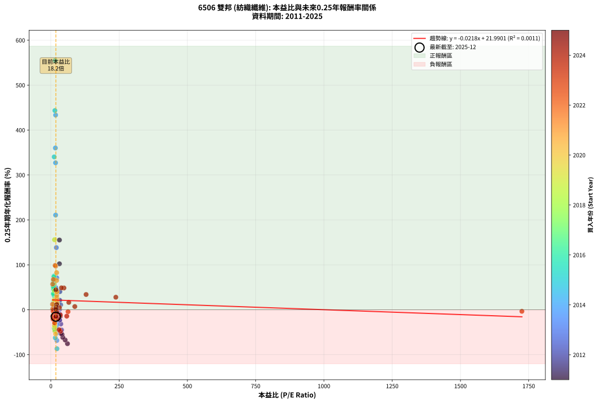
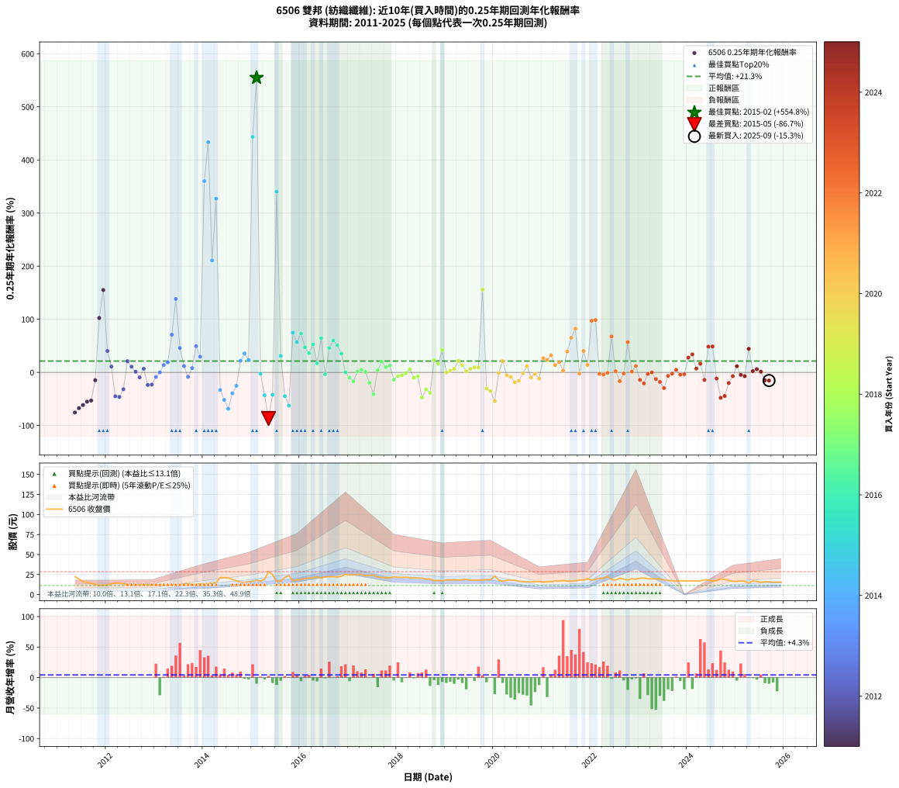

# 6506 雙邦 - 本益比與未來報酬率分析

!!! info "報告資訊"
    - **股票代號**: 6506
    - **公司名稱**: 雙邦
    - **產業別**: 紡織纖維
    - **分析期間**: 2011-2025 (173 個數據點)
    - **資料來源**: Type 12 (ShowMonthlyK_ChartFlow) 月收盤價與本益比
    - **報酬率口徑**: 含現金股利 (簡化: 年度合計，假設每年7/1入帳)
    - **報告生成時間**: 2026-01-10 23:08:52 CST

## 📈 視覺化圖表

### 圖表1: 本益比 vs 未來報酬率關係

*圖表1：6506 雙邦 本益比與0.25年期未來報酬率關係 (2011-2025)*

### 圖表2: 歷年買入時點的0.25年期實際報酬率

*圖表2：6506 雙邦 歷年買入時點的0.25年期實際報酬率 (2011-2025)*

## 📍 買點訊號說明

本報告提供兩種買點提示訊號（顯示於圖表2的股價子圖中）：

### ▲ 小綠色三角形（回測驗證）
- **計算方式**: 使用全部歷史資料計算本益比第25百分位數
- **用途**: 事後驗證，顯示歷史上哪些時點確實為低估區
- **限制**: 當下無法判斷，僅供回測參考
- **特性**: 後見之明（Look-Ahead Bias）

### ▲ 小橘色三角形（即時訊號）
- **計算方式**: 使用截至當月的過去5年資料計算本益比第25百分位數
- **用途**: 實際投資決策，當時即可判斷
- **優勢**: 可操作性強，符合實務需求
- **特性**: 無後見之明，滾動窗口計算

!!! tip "如何使用兩種訊號"
    - **綠色▲** 幫助理解歷史估值機會，驗證策略有效性
    - **橘色▲** 可作為實際買進參考，但仍需搭配基本面分析
    - 兩種訊號重疊時，表示即時判斷與事後驗證一致，信心度較高
    - 僅有綠色▲時，表示當時無法判斷（需要未來資料才能確認）
    - 僅有橘色▲時，表示即時判斷為買點，但事後可能不是最佳時機

## 📊 估值分析摘要

| 指標 | 數值 |
|:---:|:---:|
| **目前本益比** (2025-09) | **18.23 倍** |
| **歷史平均本益比** | 31.79 倍 |
| **估值水準** | 🟢 相對低估 |
| **預期0.25年年化報酬率** | **+21.59%** |
| **歷史平均報酬率** | +21.30% |
| **相關係數 (R²)** | 0.0011 |
| **趨勢線斜率** | -0.0218 |

!!! abstract "核心洞察"
    目前本益比顯著低於歷史平均，預期未來報酬率可能較高

    根據歷史數據回測，6506 雙邦 在目前本益比 **18.2倍** 的估值水準下，
    預期未來0.25年年化報酬率約為 **+21.6%**。

    **重要提醒**: 本分析基於歷史數據統計，實際報酬率會受到公司基本面變化、產業趨勢、
    總體經濟環境等多重因素影響。R² = 0.00 表示本益比可解釋約 0.1% 的報酬率變異。

## 📈 歷史估值統計

### 最佳買點 (最高報酬率)

| 項目 | 數值 |
|:---:|:---:|
| 起始時間 | 2015-02 |
| 當時本益比 | 15.52 倍 |
| 起始價格 | 18.0 元 |
| 0.25年後價格 | 28.6 元 |
| **0.25年年化報酬率** | **+554.79%** |

### 最差買點 (最低報酬率)

| 項目 | 數值 |
|:---:|:---:|
| 起始時間 | 2015-05 |
| 當時本益比 | 22.34 倍 |
| 起始價格 | 28.6 元 |
| 0.25年後價格 | 16.9 元 |
| **0.25年年化報酬率** | **-86.72%** |

## 🎯 投資啟示

### 本益比與報酬率關係

趨勢線方程式: **y = -0.0218x + 21.9901**

!!! note "負相關"
    本益比與未來報酬率呈現負相關。較低的本益比通常帶來較高的未來報酬率，
    但相關性不算非常強。**估值仍是重要參考指標之一**。

### 估值區間建議

基於歷史數據分析:

- **🟢 低估區** (P/E < 25.4): 預期報酬率較高，可考慮增加持股
- **🟡 合理區** (P/E 25.4-38.1): 預期報酬率符合長期趨勢，正常持有
- **🔴 高估區** (P/E > 38.1): 預期報酬率較低，可考慮減碼或觀望

!!! danger "風險提示"
    - 過去表現不代表未來結果
    - 本分析假設公司基本面無重大結構性變化
    - 產業環境劇變可能使歷史規律失效
    - 應結合公司財報、產業趨勢、總體經濟等多重因素綜合判斷

!!! success "長期投資觀點"
    歷史數據顯示，在合理或低估的估值水準買入並長期持有，
    往往能獲得較佳的投資報酬。**耐心等待好價格**是價值投資的核心原則。

## 📊 數據品質

- **資料來源**: GoodInfo.tw Type 12 (ShowMonthlyK_ChartFlow)
- **資料頻率**: 月度收盤價與本益比
- **回測期間**: 2011-2025
- **數據點數量**: 173 個 (每個點代表一次0.25年期回測)

### 計算方法說明

1. **0.25年期年化報酬率**:
   - 對每個歷史時點，計算其後0.25年的實際投資報酬率
   - 期末價值(不含股利): 期末價格
   - 期末價值(含現金股利): 期末價格 + 持有期間內的現金股利合計 (簡化: 年度合計，假設每年7/1入帳)
   - 公式: 年化報酬率 = [(期末價值/期初價格)^(1/年數) - 1] × 100%

2. **本益比 (P/E Ratio)**:
   - 使用當時的月收盤價與EPS計算
   - 資料來源: Type 12 月度河流圖本益比數據

3. **趨勢線 (Linear Regression)**:
   - 使用最小平方法擬合線性趨勢線
   - R²值衡量本益比對報酬率的解釋能力

---

*本報告由 Stock Analysis System v1.9.0 自動生成*
*數據更新時間: 2026-01-10 23:08:52 CST*

## 📋 月度回測明細表

（每一列對應時間線圖中的一個買入點；可用來對照 SVG 圖上的每個點。）

| 買入月份 | 賣出月份 | 回測期限_年 | 實際持有年數 | 買入本益比_倍 | 買入收盤價_元 | 賣出收盤價_元 | 現金股利合計_元 | 總報酬率_pct | 年化報酬率_pct |
| --- | --- | --- | --- | --- | --- | --- | --- | --- | --- |
| 2011-05 | 2011-08 | 0.25 | 0.252 | 60.68 | 22.45 | 15.15 | 0.60 | -29.84 | -75.52 |
| 2011-06 | 2011-09 | 0.25 | 0.252 | 52.30 | 19.35 | 14.00 | 0.60 | -24.55 | -67.32 |
| 2011-07 | 2011-10 | 0.25 | 0.252 | 43.65 | 16.15 | 12.70 | 0.00 | -21.36 | -61.48 |
| 2011-08 | 2011-12 | 0.25 | 0.334 | 40.95 | 15.15 | 11.60 | 0.00 | -23.43 | -55.04 |
| 2011-09 | 2011-12 | 0.25 | 0.249 | 37.84 | 14.00 | 11.60 | 0.00 | -17.14 | -52.99 |
| 2011-10 | 2012-01 | 0.25 | 0.252 | 34.32 | 12.70 | 12.20 | 0.00 | -3.94 | -14.74 |
| 2011-11 | 2012-03 | 0.25 | 0.331 | 31.35 | 11.60 | 14.65 | 0.00 | +26.29 | +102.31 |
| 2011-12 | 2012-03 | 0.25 | 0.249 | 31.35 | 11.60 | 14.65 | 0.00 | +26.29 | +155.22 |
| 2012-01 | 2012-05 | 0.25 | 0.331 | 32.90 | 12.20 | 13.65 | 0.00 | +11.89 | +40.35 |
| 2012-02 | 2012-05 | 0.25 | 0.249 | 35.78 | 13.30 | 13.65 | 0.00 | +2.63 | +10.99 |
| 2012-03 | 2012-07 | 0.25 | 0.334 | 39.33 | 14.65 | 11.60 | 0.40 | -18.09 | -44.97 |
| 2012-04 | 2012-07 | 0.25 | 0.249 | 37.50 | 14.00 | 11.60 | 0.40 | -14.29 | -46.14 |
| 2012-05 | 2012-08 | 0.25 | 0.252 | 36.48 | 13.65 | 12.00 | 0.40 | -9.16 | -31.70 |
| 2012-06 | 2012-09 | 0.25 | 0.252 | 32.40 | 12.15 | 12.35 | 0.40 | +4.94 | +21.09 |
| 2012-07 | 2012-10 | 0.25 | 0.252 | 30.86 | 11.60 | 11.90 | 0.00 | +2.59 | +10.67 |
| 2012-08 | 2012-12 | 0.25 | 0.334 | 31.86 | 12.00 | 12.05 | 0.00 | +0.42 | +1.25 |
| 2012-09 | 2012-12 | 0.25 | 0.249 | 32.72 | 12.35 | 12.05 | 0.00 | -2.43 | -9.40 |
| 2012-10 | 2013-01 | 0.25 | 0.252 | 31.45 | 11.90 | 12.10 | 0.00 | +1.68 | +6.84 |
| 2012-11 | 2013-03 | 0.25 | 0.329 | 32.57 | 12.35 | 11.30 | 0.00 | -8.50 | -23.70 |
| 2012-12 | 2013-03 | 0.25 | 0.246 | 31.71 | 12.05 | 11.30 | 0.00 | -6.22 | -22.96 |
| 2013-01 | 2013-05 | 0.25 | 0.329 | 29.39 | 12.10 | 11.75 | 0.00 | -2.89 | -8.55 |
| 2013-02 | 2013-05 | 0.25 | 0.246 | 26.50 | 11.75 | 11.75 | 0.00 | +0.00 | +0.00 |
| 2013-03 | 2013-07 | 0.25 | 0.334 | 23.79 | 11.30 | 11.50 | 0.30 | +4.42 | +13.84 |
| 2013-04 | 2013-07 | 0.25 | 0.249 | 22.30 | 11.30 | 11.50 | 0.30 | +4.42 | +18.98 |
| 2013-05 | 2013-08 | 0.25 | 0.252 | 21.83 | 11.75 | 13.15 | 0.30 | +14.47 | +71.00 |
| 2013-06 | 2013-09 | 0.25 | 0.252 | 20.09 | 11.45 | 13.95 | 0.30 | +24.45 | +138.34 |
| 2013-07 | 2013-10 | 0.25 | 0.252 | 19.11 | 11.50 | 12.65 | 0.00 | +10.00 | +45.99 |
| 2013-08 | 2013-12 | 0.25 | 0.334 | 20.76 | 13.15 | 13.65 | 0.00 | +3.80 | +11.82 |
| 2013-09 | 2013-12 | 0.25 | 0.249 | 20.98 | 13.95 | 13.65 | 0.00 | -2.15 | -8.36 |
| 2013-10 | 2014-01 | 0.25 | 0.252 | 18.16 | 12.65 | 12.90 | 0.00 | +1.98 | +8.08 |
| 2013-11 | 2014-03 | 0.25 | 0.329 | 17.51 | 12.75 | 14.55 | 0.00 | +14.12 | +49.47 |
| 2013-12 | 2014-03 | 0.25 | 0.246 | 17.96 | 13.65 | 14.55 | 0.00 | +6.59 | +29.58 |
| 2014-01 | 2014-05 | 0.25 | 0.329 | 16.40 | 12.90 | 21.30 | 0.00 | +65.12 | +360.15 |
| 2014-02 | 2014-05 | 0.25 | 0.246 | 17.34 | 14.10 | 21.30 | 0.00 | +51.06 | +433.45 |
| 2014-03 | 2014-07 | 0.25 | 0.334 | 17.32 | 14.55 | 20.85 | 0.40 | +46.05 | +210.80 |
| 2014-04 | 2014-07 | 0.25 | 0.249 | 17.08 | 14.80 | 20.85 | 0.40 | +43.58 | +327.12 |
| 2014-05 | 2014-08 | 0.25 | 0.252 | 23.84 | 21.30 | 18.85 | 0.40 | -9.62 | -33.09 |
| 2014-06 | 2014-09 | 0.25 | 0.252 | 22.93 | 21.10 | 17.15 | 0.40 | -16.82 | -51.88 |
| 2014-07 | 2014-10 | 0.25 | 0.252 | 22.02 | 20.85 | 15.60 | 0.00 | -25.18 | -68.39 |
| 2014-08 | 2014-12 | 0.25 | 0.334 | 19.37 | 18.85 | 15.95 | 0.00 | -15.38 | -39.36 |
| 2014-09 | 2014-12 | 0.25 | 0.249 | 17.15 | 17.15 | 15.95 | 0.00 | -7.00 | -25.26 |
| 2014-10 | 2015-01 | 0.25 | 0.252 | 15.19 | 15.60 | 16.40 | 0.00 | +5.13 | +21.96 |
| 2014-11 | 2015-03 | 0.25 | 0.329 | 14.43 | 15.20 | 16.80 | 0.00 | +10.53 | +35.61 |
| 2014-12 | 2015-03 | 0.25 | 0.246 | 14.77 | 15.95 | 16.80 | 0.00 | +5.33 | +23.46 |
| 2015-01 | 2015-05 | 0.25 | 0.329 | 14.64 | 16.40 | 28.60 | 0.00 | +74.39 | +443.42 |
| 2015-02 | 2015-05 | 0.25 | 0.246 | 15.52 | 18.00 | 28.60 | 0.00 | +58.89 | +554.79 |
| 2015-03 | 2015-07 | 0.25 | 0.334 | 14.00 | 16.80 | 16.35 | 0.30 | -0.89 | -2.65 |
| 2015-04 | 2015-07 | 0.25 | 0.249 | 15.44 | 19.15 | 16.35 | 0.30 | -13.05 | -42.96 |
| 2015-05 | 2015-08 | 0.25 | 0.252 | 22.34 | 28.60 | 16.90 | 0.30 | -39.86 | -86.72 |
| 2015-06 | 2015-09 | 0.25 | 0.252 | 18.90 | 24.95 | 21.45 | 0.30 | -12.83 | -42.01 |
| 2015-07 | 2015-10 | 0.25 | 0.252 | 12.02 | 16.35 | 23.75 | 0.00 | +45.26 | +340.29 |
| 2015-08 | 2015-12 | 0.25 | 0.334 | 12.07 | 16.90 | 18.50 | 0.00 | +9.47 | +31.10 |
| 2015-09 | 2015-12 | 0.25 | 0.249 | 14.90 | 21.45 | 18.50 | 0.00 | -13.75 | -44.78 |
| 2015-10 | 2016-01 | 0.25 | 0.252 | 16.05 | 23.75 | 18.55 | 0.00 | -21.89 | -62.51 |
| 2015-11 | 2016-03 | 0.25 | 0.331 | 11.32 | 17.20 | 20.70 | 0.00 | +20.35 | +74.91 |
| 2015-12 | 2016-03 | 0.25 | 0.249 | 11.86 | 18.50 | 20.70 | 0.00 | +11.89 | +56.99 |
| 2016-01 | 2016-05 | 0.25 | 0.331 | 11.25 | 18.55 | 22.25 | 0.00 | +19.95 | +73.15 |
| 2016-02 | 2016-05 | 0.25 | 0.249 | 11.63 | 20.20 | 22.25 | 0.00 | +10.15 | +47.40 |
| 2016-03 | 2016-07 | 0.25 | 0.334 | 11.34 | 20.70 | 22.15 | 0.80 | +10.87 | +36.20 |
| 2016-04 | 2016-07 | 0.25 | 0.249 | 10.79 | 20.65 | 22.15 | 0.80 | +11.14 | +52.78 |
| 2016-05 | 2016-08 | 0.25 | 0.252 | 11.12 | 22.25 | 22.35 | 0.80 | +4.04 | +17.05 |
| 2016-06 | 2016-09 | 0.25 | 0.252 | 9.86 | 20.60 | 22.55 | 0.80 | +13.35 | +64.46 |
| 2016-07 | 2016-10 | 0.25 | 0.252 | 10.17 | 22.15 | 21.95 | 0.00 | -0.90 | -3.54 |
| 2016-08 | 2016-12 | 0.25 | 0.334 | 9.86 | 22.35 | 25.35 | 0.00 | +13.42 | +45.80 |
| 2016-09 | 2016-12 | 0.25 | 0.249 | 9.58 | 22.55 | 25.35 | 0.00 | +12.42 | +59.96 |
| 2016-10 | 2017-01 | 0.25 | 0.252 | 8.98 | 21.95 | 24.35 | 0.00 | +10.93 | +50.98 |
| 2016-11 | 2017-03 | 0.25 | 0.329 | 9.07 | 22.95 | 25.35 | 0.00 | +10.46 | +35.36 |
| 2016-12 | 2017-03 | 0.25 | 0.246 | 9.68 | 25.35 | 25.35 | 0.00 | +0.00 | +0.00 |
| 2017-01 | 2017-05 | 0.25 | 0.329 | 9.62 | 24.35 | 23.50 | 0.00 | -3.49 | -10.25 |
| 2017-02 | 2017-05 | 0.25 | 0.246 | 10.08 | 24.60 | 23.50 | 0.00 | -4.47 | -16.94 |
| 2017-03 | 2017-07 | 0.25 | 0.334 | 10.79 | 25.35 | 24.00 | 1.50 | +0.59 | +1.78 |
| 2017-04 | 2017-07 | 0.25 | 0.249 | 11.15 | 25.20 | 24.00 | 1.50 | +1.19 | +4.86 |
| 2017-05 | 2017-08 | 0.25 | 0.252 | 10.83 | 23.50 | 22.05 | 1.50 | +0.21 | +0.85 |
| 2017-06 | 2017-09 | 0.25 | 0.252 | 11.61 | 24.15 | 21.35 | 1.50 | -5.38 | -19.72 |
| 2017-07 | 2017-10 | 0.25 | 0.252 | 12.06 | 24.00 | 21.00 | 0.00 | -12.50 | -41.15 |
| 2017-08 | 2017-12 | 0.25 | 0.334 | 11.61 | 22.05 | 22.35 | 0.00 | +1.36 | +4.13 |
| 2017-09 | 2017-12 | 0.25 | 0.249 | 11.80 | 21.35 | 22.35 | 0.00 | +4.68 | +20.17 |
| 2017-10 | 2018-01 | 0.25 | 0.252 | 12.21 | 21.00 | 21.50 | 0.00 | +2.38 | +9.79 |
| 2017-11 | 2018-03 | 0.25 | 0.329 | 12.70 | 20.70 | 21.55 | 0.00 | +4.11 | +13.03 |
| 2017-12 | 2018-03 | 0.25 | 0.246 | 14.51 | 22.35 | 21.55 | 0.00 | -3.58 | -13.75 |
| 2018-01 | 2018-05 | 0.25 | 0.329 | 14.13 | 21.50 | 21.00 | 0.00 | -2.33 | -6.91 |
| 2018-02 | 2018-05 | 0.25 | 0.246 | 14.17 | 21.30 | 21.00 | 0.00 | -1.41 | -5.59 |
| 2018-03 | 2018-07 | 0.25 | 0.334 | 14.51 | 21.55 | 20.45 | 1.00 | -0.46 | -1.38 |
| 2018-04 | 2018-07 | 0.25 | 0.249 | 14.42 | 21.15 | 20.45 | 1.00 | +1.42 | +5.82 |
| 2018-05 | 2018-08 | 0.25 | 0.252 | 14.50 | 21.00 | 19.45 | 1.00 | -2.62 | -10.00 |
| 2018-06 | 2018-09 | 0.25 | 0.252 | 14.48 | 20.70 | 19.30 | 1.00 | -1.93 | -7.45 |
| 2018-07 | 2018-10 | 0.25 | 0.252 | 14.49 | 20.45 | 17.40 | 0.00 | -14.91 | -47.34 |
| 2018-08 | 2018-12 | 0.25 | 0.334 | 13.96 | 19.45 | 17.10 | 0.00 | -12.08 | -31.99 |
| 2018-09 | 2018-12 | 0.25 | 0.249 | 14.04 | 19.30 | 17.10 | 0.00 | -11.40 | -38.48 |
| 2018-10 | 2019-01 | 0.25 | 0.252 | 12.83 | 17.40 | 18.35 | 0.00 | +5.46 | +23.50 |
| 2018-11 | 2019-03 | 0.25 | 0.329 | 13.26 | 17.75 | 18.65 | 0.00 | +5.07 | +16.25 |
| 2018-12 | 2019-03 | 0.25 | 0.246 | 12.95 | 17.10 | 18.65 | 0.00 | +9.06 | +42.21 |
| 2019-01 | 2019-05 | 0.25 | 0.329 | 13.84 | 18.35 | 18.35 | 0.00 | +0.00 | +0.00 |
| 2019-02 | 2019-05 | 0.25 | 0.246 | 13.67 | 18.20 | 18.35 | 0.00 | +0.82 | +3.39 |
| 2019-03 | 2019-07 | 0.25 | 0.334 | 13.94 | 18.65 | 18.05 | 1.00 | +2.14 | +6.56 |
| 2019-04 | 2019-07 | 0.25 | 0.249 | 13.51 | 18.15 | 18.05 | 1.00 | +4.96 | +21.44 |
| 2019-05 | 2019-08 | 0.25 | 0.252 | 13.60 | 18.35 | 17.95 | 1.00 | +3.27 | +13.63 |
| 2019-06 | 2019-09 | 0.25 | 0.252 | 14.02 | 19.00 | 18.10 | 1.00 | +0.53 | +2.11 |
| 2019-07 | 2019-10 | 0.25 | 0.252 | 13.26 | 18.05 | 18.35 | 0.00 | +1.66 | +6.76 |
| 2019-08 | 2019-12 | 0.25 | 0.334 | 13.13 | 17.95 | 18.50 | 0.00 | +3.06 | +9.46 |
| 2019-09 | 2019-12 | 0.25 | 0.249 | 13.19 | 18.10 | 18.50 | 0.00 | +2.21 | +9.17 |
| 2019-10 | 2020-01 | 0.25 | 0.252 | 13.31 | 18.35 | 23.25 | 0.00 | +26.70 | +155.90 |
| 2019-11 | 2020-03 | 0.25 | 0.331 | 13.51 | 18.70 | 16.60 | 0.00 | -11.23 | -30.20 |
| 2019-12 | 2020-03 | 0.25 | 0.249 | 13.31 | 18.50 | 16.60 | 0.00 | -10.27 | -35.27 |
| 2020-01 | 2020-05 | 0.25 | 0.331 | 17.44 | 23.25 | 18.00 | 0.00 | -22.58 | -53.82 |
| 2020-02 | 2020-05 | 0.25 | 0.249 | 14.14 | 18.05 | 18.00 | 0.00 | -0.28 | -1.11 |
| 2020-03 | 2020-07 | 0.25 | 0.334 | 13.61 | 16.60 | 16.60 | 1.10 | +6.63 | +21.18 |
| 2020-04 | 2020-07 | 0.25 | 0.249 | 15.43 | 17.95 | 16.60 | 1.10 | -1.39 | -5.47 |
| 2020-05 | 2020-08 | 0.25 | 0.252 | 16.27 | 18.00 | 16.50 | 1.10 | -2.22 | -8.54 |
| 2020-06 | 2020-09 | 0.25 | 0.252 | 17.10 | 17.95 | 15.95 | 1.10 | -5.01 | -18.47 |
| 2020-07 | 2020-10 | 0.25 | 0.252 | 16.71 | 16.60 | 15.90 | 0.00 | -4.22 | -15.72 |
| 2020-08 | 2020-12 | 0.25 | 0.334 | 17.62 | 16.50 | 16.40 | 0.00 | -0.61 | -1.80 |
| 2020-09 | 2020-12 | 0.25 | 0.249 | 18.12 | 15.95 | 16.40 | 0.00 | +2.82 | +11.81 |
| 2020-10 | 2021-01 | 0.25 | 0.252 | 19.31 | 15.90 | 15.50 | 0.00 | -2.52 | -9.62 |
| 2020-11 | 2021-03 | 0.25 | 0.329 | 20.93 | 16.05 | 15.90 | 0.00 | -0.93 | -2.82 |
| 2020-12 | 2021-03 | 0.25 | 0.246 | 23.10 | 16.40 | 15.90 | 0.00 | -3.05 | -11.81 |
| 2021-01 | 2021-05 | 0.25 | 0.329 | 21.53 | 15.50 | 16.75 | 0.00 | +8.06 | +26.63 |
| 2021-02 | 2021-05 | 0.25 | 0.246 | 21.78 | 15.90 | 16.75 | 0.00 | +5.35 | +23.54 |
| 2021-03 | 2021-07 | 0.25 | 0.334 | 21.49 | 15.90 | 16.65 | 0.80 | +9.75 | +32.11 |
| 2021-04 | 2021-07 | 0.25 | 0.249 | 22.53 | 16.90 | 16.65 | 0.80 | +3.25 | +13.72 |
| 2021-05 | 2021-08 | 0.25 | 0.252 | 22.04 | 16.75 | 16.70 | 0.80 | +4.48 | +18.99 |
| 2021-06 | 2021-09 | 0.25 | 0.252 | 22.92 | 17.65 | 17.00 | 0.80 | +0.85 | +3.42 |
| 2021-07 | 2021-10 | 0.25 | 0.252 | 21.35 | 16.65 | 18.10 | 0.00 | +8.71 | +39.31 |
| 2021-08 | 2021-12 | 0.25 | 0.334 | 21.14 | 16.70 | 19.75 | 0.00 | +18.26 | +65.24 |
| 2021-09 | 2021-12 | 0.25 | 0.249 | 21.25 | 17.00 | 19.75 | 0.00 | +16.18 | +82.54 |
| 2021-10 | 2022-01 | 0.25 | 0.252 | 22.35 | 18.10 | 18.00 | 0.00 | -0.55 | -2.18 |
| 2021-11 | 2022-03 | 0.25 | 0.329 | 22.26 | 18.25 | 20.40 | 0.00 | +11.78 | +40.35 |
| 2021-12 | 2022-03 | 0.25 | 0.246 | 23.80 | 19.75 | 20.40 | 0.00 | +3.29 | +14.04 |
| 2022-01 | 2022-05 | 0.25 | 0.329 | 17.52 | 18.00 | 22.50 | 0.00 | +25.00 | +97.23 |
| 2022-02 | 2022-05 | 0.25 | 0.246 | 15.51 | 19.00 | 22.50 | 0.00 | +18.42 | +98.61 |
| 2022-03 | 2022-07 | 0.25 | 0.334 | 14.34 | 20.40 | 18.20 | 2.00 | -0.98 | -2.91 |
| 2022-04 | 2022-07 | 0.25 | 0.249 | 12.59 | 20.40 | 18.20 | 2.00 | -0.98 | -3.88 |
| 2022-05 | 2022-08 | 0.25 | 0.252 | 12.38 | 22.50 | 20.45 | 2.00 | -0.22 | -0.88 |
| 2022-06 | 2022-09 | 0.25 | 0.252 | 9.31 | 18.75 | 19.35 | 2.00 | +13.87 | +67.46 |
| 2022-07 | 2022-10 | 0.25 | 0.252 | 8.23 | 18.20 | 18.30 | 0.00 | +0.55 | +2.20 |
| 2022-08 | 2022-12 | 0.25 | 0.334 | 8.49 | 20.45 | 19.25 | 0.00 | -5.87 | -16.56 |
| 2022-09 | 2022-12 | 0.25 | 0.249 | 7.42 | 19.35 | 19.25 | 0.00 | -0.52 | -2.06 |
| 2022-10 | 2023-01 | 0.25 | 0.252 | 6.52 | 18.30 | 20.50 | 0.00 | +12.02 | +56.94 |
| 2022-11 | 2023-03 | 0.25 | 0.329 | 6.56 | 19.70 | 19.80 | 0.00 | +0.51 | +1.55 |
| 2022-12 | 2023-03 | 0.25 | 0.246 | 6.02 | 19.25 | 19.80 | 0.00 | +2.86 | +12.11 |
| 2023-01 | 2023-05 | 0.25 | 0.329 | 6.99 | 20.50 | 19.50 | 0.00 | -4.88 | -14.12 |
| 2023-02 | 2023-05 | 0.25 | 0.246 | 7.74 | 20.65 | 19.50 | 0.00 | -5.57 | -20.75 |
| 2023-03 | 2023-07 | 0.25 | 0.334 | 8.24 | 19.80 | 18.40 | 1.20 | -1.01 | -2.99 |
| 2023-04 | 2023-07 | 0.25 | 0.249 | 9.17 | 19.60 | 18.40 | 1.20 | -0.00 | -0.00 |
| 2023-05 | 2023-08 | 0.25 | 0.252 | 10.42 | 19.50 | 17.65 | 1.20 | -3.33 | -12.59 |
| 2023-06 | 2023-09 | 0.25 | 0.252 | 12.15 | 19.50 | 17.35 | 1.20 | -4.87 | -17.99 |
| 2023-07 | 2023-10 | 0.25 | 0.252 | 13.74 | 18.40 | 16.85 | 0.00 | -8.42 | -29.49 |
| 2023-08 | 2023-12 | 0.25 | 0.334 | 16.44 | 17.65 | 17.25 | 0.00 | -2.27 | -6.63 |
| 2023-09 | 2023-12 | 0.25 | 0.249 | 21.49 | 17.35 | 17.25 | 0.00 | -0.58 | -2.29 |
| 2023-10 | 2024-01 | 0.25 | 0.252 | 31.11 | 16.85 | 17.05 | 0.00 | +1.19 | +4.80 |
| 2023-11 | 2024-03 | 0.25 | 0.331 | 62.90 | 17.35 | 17.10 | 0.00 | -1.44 | -4.29 |
| 2023-12 | 2024-03 | 0.25 | 0.249 | 1725.00 | 17.25 | 17.10 | 0.00 | -0.87 | -3.44 |
| 2024-01 | 2024-05 | 0.25 | 0.331 | 237.90 | 17.05 | 18.50 | 0.00 | +8.50 | +27.94 |
| 2024-02 | 2024-05 | 0.25 | 0.249 | 129.00 | 17.20 | 18.50 | 0.00 | +7.56 | +33.97 |
| 2024-03 | 2024-07 | 0.25 | 0.334 | 87.69 | 17.10 | 17.10 | 0.40 | +2.34 | +7.17 |
| 2024-04 | 2024-07 | 0.25 | 0.249 | 65.65 | 16.85 | 17.10 | 0.40 | +3.86 | +16.41 |
| 2024-05 | 2024-08 | 0.25 | 0.252 | 58.12 | 18.50 | 17.40 | 0.40 | -3.78 | -14.20 |
| 2024-06 | 2024-09 | 0.25 | 0.252 | 47.76 | 18.15 | 19.65 | 0.40 | +10.47 | +48.48 |
| 2024-07 | 2024-10 | 0.25 | 0.252 | 38.72 | 17.10 | 18.90 | 0.00 | +10.53 | +48.79 |
| 2024-08 | 2024-12 | 0.25 | 0.334 | 34.57 | 17.40 | 16.70 | 0.00 | -4.02 | -11.57 |
| 2024-09 | 2024-12 | 0.25 | 0.249 | 34.78 | 19.65 | 16.70 | 0.00 | -15.01 | -47.95 |
| 2024-10 | 2025-01 | 0.25 | 0.252 | 30.16 | 18.90 | 16.30 | 0.00 | -13.76 | -44.43 |
| 2024-11 | 2025-03 | 0.25 | 0.329 | 25.64 | 17.65 | 16.40 | 0.00 | -7.08 | -20.03 |
| 2024-12 | 2025-03 | 0.25 | 0.246 | 22.27 | 16.70 | 16.40 | 0.00 | -1.80 | -7.09 |
| 2025-01 | 2025-05 | 0.25 | 0.329 | 21.33 | 16.30 | 16.90 | 0.00 | +3.68 | +11.63 |
| 2025-02 | 2025-05 | 0.25 | 0.246 | 21.97 | 17.10 | 16.90 | 0.00 | -1.17 | -4.66 |
| 2025-03 | 2025-07 | 0.25 | 0.334 | 20.69 | 16.40 | 15.20 | 0.80 | -2.44 | -7.13 |
| 2025-04 | 2025-07 | 0.25 | 0.249 | 18.10 | 14.60 | 15.20 | 0.80 | +9.59 | +44.42 |
| 2025-05 | 2025-08 | 0.25 | 0.252 | 20.59 | 16.90 | 16.20 | 0.80 | +0.59 | +2.37 |
| 2025-06 | 2025-09 | 0.25 | 0.252 | 19.82 | 16.55 | 16.00 | 0.80 | +1.51 | +6.13 |
| 2025-07 | 2025-10 | 0.25 | 0.252 | 17.90 | 15.20 | 15.25 | 0.00 | +0.33 | +1.31 |
| 2025-08 | 2025-12 | 0.25 | 0.334 | 18.76 | 16.20 | 15.35 | 0.00 | -5.25 | -14.90 |
| 2025-09 | 2025-12 | 0.25 | 0.249 | 18.23 | 16.00 | 15.35 | 0.00 | -4.06 | -15.33 |
