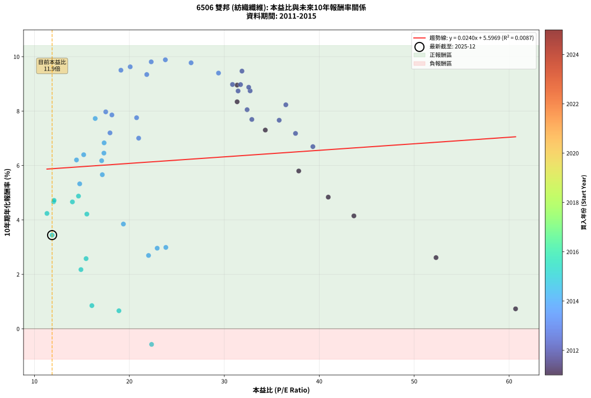
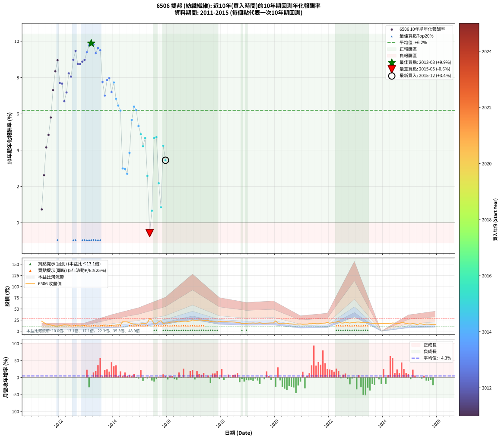

# 6506 雙邦 - 本益比與未來報酬率分析

!!! info "報告資訊"
    - **股票代號**: 6506
    - **公司名稱**: 雙邦
    - **產業別**: 紡織纖維
    - **分析期間**: 2011-2015 (56 個數據點)
    - **資料來源**: Type 12 (ShowMonthlyK_ChartFlow) 月收盤價與本益比
    - **報酬率口徑**: 含現金股利 (簡化: 年度合計，假設每年7/1入帳)
    - **報告生成時間**: 2026-01-05 01:11:21 CST

## 📈 視覺化圖表

### 圖表1: 本益比 vs 未來報酬率關係

*圖表1：6506 雙邦 本益比與10年期未來報酬率關係 (2011-2015)*

### 圖表2: 歷年買入時點的10年期實際報酬率

*圖表2：6506 雙邦 歷年買入時點的10年期實際報酬率 (2011-2015)*

## 📍 買點訊號說明

本報告提供兩種買點提示訊號（顯示於圖表2的股價子圖中）：

### ▲ 小綠色三角形（回測驗證）
- **計算方式**: 使用全部歷史資料計算本益比第25百分位數
- **用途**: 事後驗證，顯示歷史上哪些時點確實為低估區
- **限制**: 當下無法判斷，僅供回測參考
- **特性**: 後見之明（Look-Ahead Bias）

### ▲ 小橘色三角形（即時訊號）
- **計算方式**: 使用截至當月的過去5年資料計算本益比第25百分位數
- **用途**: 實際投資決策，當時即可判斷
- **優勢**: 可操作性強，符合實務需求
- **特性**: 無後見之明，滾動窗口計算

!!! tip "如何使用兩種訊號"
    - **綠色▲** 幫助理解歷史估值機會，驗證策略有效性
    - **橘色▲** 可作為實際買進參考，但仍需搭配基本面分析
    - 兩種訊號重疊時，表示即時判斷與事後驗證一致，信心度較高
    - 僅有綠色▲時，表示當時無法判斷（需要未來資料才能確認）
    - 僅有橘色▲時，表示即時判斷為買點，但事後可能不是最佳時機

## 📊 估值分析摘要

| 指標 | 數值 |
|:---:|:---:|
| **目前本益比** (2015-12) | **11.86 倍** |
| **歷史平均本益比** | 24.88 倍 |
| **估值水準** | 🟢 相對低估 |
| **預期10年年化報酬率** | **+5.88%** |
| **歷史平均報酬率** | +6.19% |
| **相關係數 (R²)** | 0.0087 |
| **趨勢線斜率** | 0.0240 |

!!! abstract "核心洞察"
    目前本益比顯著低於歷史平均，預期未來報酬率可能較高

    根據歷史數據回測，6506 雙邦 在目前本益比 **11.9倍** 的估值水準下，
    預期未來10年年化報酬率約為 **+5.9%**。

    **重要提醒**: 本分析基於歷史數據統計，實際報酬率會受到公司基本面變化、產業趨勢、
    總體經濟環境等多重因素影響。R² = 0.01 表示本益比可解釋約 0.9% 的報酬率變異。

## 📈 歷史估值統計

### 最佳買點 (最高報酬率)

| 項目 | 數值 |
|:---:|:---:|
| 起始時間 | 2013-03 |
| 當時本益比 | 23.79 倍 |
| 起始價格 | 11.3 元 |
| 10年後價格 | 19.8 元 |
| **10年年化報酬率** | **+9.88%** |

### 最差買點 (最低報酬率)

| 項目 | 數值 |
|:---:|:---:|
| 起始時間 | 2015-05 |
| 當時本益比 | 22.34 倍 |
| 起始價格 | 28.6 元 |
| 10年後價格 | 16.9 元 |
| **10年年化報酬率** | **-0.57%** |

## 🎯 投資啟示

### 本益比與報酬率關係

趨勢線方程式: **y = 0.0240x + 5.5969**

!!! info "弱相關或正相關"
    本益比與未來報酬率相關性較弱。這可能表示該股票的報酬率更多受到
    公司成長性、產業趨勢等因素影響，而非估值水準。**需綜合考量多項指標**。

### 估值區間建議

基於歷史數據分析:

- **🟢 低估區** (P/E < 19.9): 預期報酬率較高，可考慮增加持股
- **🟡 合理區** (P/E 19.9-29.9): 預期報酬率符合長期趨勢，正常持有
- **🔴 高估區** (P/E > 29.9): 預期報酬率較低，可考慮減碼或觀望

!!! danger "風險提示"
    - 過去表現不代表未來結果
    - 本分析假設公司基本面無重大結構性變化
    - 產業環境劇變可能使歷史規律失效
    - 應結合公司財報、產業趨勢、總體經濟等多重因素綜合判斷

!!! success "長期投資觀點"
    歷史數據顯示，在合理或低估的估值水準買入並長期持有，
    往往能獲得較佳的投資報酬。**耐心等待好價格**是價值投資的核心原則。

## 📊 數據品質

- **資料來源**: GoodInfo.tw Type 12 (ShowMonthlyK_ChartFlow)
- **資料頻率**: 月度收盤價與本益比
- **回測期間**: 2011-2015
- **數據點數量**: 56 個 (每個點代表一次10年期回測)

### 計算方法說明

1. **10年期年化報酬率**:
   - 對每個歷史時點，計算其後10年的實際投資報酬率
   - 期末價值(不含股利): 期末價格
   - 期末價值(含現金股利): 期末價格 + 持有期間內的現金股利合計 (簡化: 年度合計，假設每年7/1入帳)
   - 公式: 年化報酬率 = [(期末價值/期初價格)^(1/年數) - 1] × 100%

2. **本益比 (P/E Ratio)**:
   - 使用當時的月收盤價與EPS計算
   - 資料來源: Type 12 月度河流圖本益比數據

3. **趨勢線 (Linear Regression)**:
   - 使用最小平方法擬合線性趨勢線
   - R²值衡量本益比對報酬率的解釋能力

---

*本報告由 Stock Analysis System v1.9.0 自動生成*
*數據更新時間: 2026-01-05 01:11:21 CST*

## 📋 月度回測明細表

（每一列對應時間線圖中的一個買入點；可用來對照 SVG 圖上的每個點。）

| 買入月份 | 賣出月份 | 回測期限_年 | 實際持有年數 | 買入本益比_倍 | 買入收盤價_元 | 賣出收盤價_元 | 現金股利合計_元 | 總報酬率_pct | 年化報酬率_pct |
| --- | --- | --- | --- | --- | --- | --- | --- | --- | --- |
| 2011-05 | 2021-05 | 10 | 10.001 | 60.68 | 22.45 | 16.75 | 7.40 | +7.57 | +0.73 |
| 2011-06 | 2021-06 | 10 | 10.001 | 52.30 | 19.35 | 17.65 | 7.40 | +29.46 | +2.62 |
| 2011-07 | 2021-07 | 10 | 10.001 | 43.65 | 16.15 | 16.65 | 7.60 | +50.15 | +4.15 |
| 2011-08 | 2021-08 | 10 | 10.001 | 40.95 | 15.15 | 16.70 | 7.60 | +60.40 | +4.84 |
| 2011-09 | 2021-09 | 10 | 10.001 | 37.84 | 14.00 | 17.00 | 7.60 | +75.71 | +5.80 |
| 2011-10 | 2021-10 | 10 | 10.001 | 34.32 | 12.70 | 18.10 | 7.60 | +102.36 | +7.30 |
| 2011-11 | 2021-11 | 10 | 10.001 | 31.35 | 11.60 | 18.25 | 7.60 | +122.84 | +8.34 |
| 2011-12 | 2021-12 | 10 | 10.001 | 31.35 | 11.60 | 19.75 | 7.60 | +135.78 | +8.95 |
| 2012-01 | 2022-01 | 10 | 10.001 | 32.90 | 12.20 | 18.00 | 7.60 | +109.84 | +7.69 |
| 2012-02 | 2022-03 | 10 | 10.081 | 35.78 | 13.30 | 20.40 | 7.60 | +110.53 | +7.66 |
| 2012-03 | 2022-03 | 10 | 9.999 | 39.33 | 14.65 | 20.40 | 7.60 | +91.13 | +6.69 |
| 2012-04 | 2022-04 | 10 | 9.999 | 37.50 | 14.00 | 20.40 | 7.60 | +100.00 | +7.18 |
| 2012-05 | 2022-05 | 10 | 9.999 | 36.48 | 13.65 | 22.50 | 7.60 | +120.51 | +8.23 |
| 2012-06 | 2022-06 | 10 | 9.999 | 32.40 | 12.15 | 18.75 | 7.60 | +116.87 | +8.05 |
| 2012-07 | 2022-07 | 10 | 9.999 | 30.86 | 11.60 | 18.20 | 9.20 | +136.21 | +8.98 |
| 2012-08 | 2022-08 | 10 | 9.999 | 31.86 | 12.00 | 20.45 | 9.20 | +147.08 | +9.47 |
| 2012-09 | 2022-09 | 10 | 9.999 | 32.72 | 12.35 | 19.35 | 9.20 | +131.17 | +8.74 |
| 2012-10 | 2022-10 | 10 | 9.999 | 31.45 | 11.90 | 18.30 | 9.20 | +131.09 | +8.74 |
| 2012-11 | 2022-11 | 10 | 9.999 | 32.57 | 12.35 | 19.70 | 9.20 | +134.01 | +8.87 |
| 2012-12 | 2022-12 | 10 | 9.999 | 31.71 | 12.05 | 19.25 | 9.20 | +136.10 | +8.97 |
| 2013-01 | 2023-01 | 10 | 9.999 | 29.39 | 12.10 | 20.50 | 9.20 | +145.45 | +9.40 |
| 2013-02 | 2023-02 | 10 | 9.999 | 26.50 | 11.75 | 20.65 | 9.20 | +154.04 | +9.77 |
| 2013-03 | 2023-03 | 10 | 9.999 | 23.79 | 11.30 | 19.80 | 9.20 | +156.64 | +9.88 |
| 2013-04 | 2023-04 | 10 | 9.999 | 22.30 | 11.30 | 19.60 | 9.20 | +154.87 | +9.81 |
| 2013-05 | 2023-05 | 10 | 9.999 | 21.83 | 11.75 | 19.50 | 9.20 | +144.26 | +9.34 |
| 2013-06 | 2023-06 | 10 | 9.999 | 20.09 | 11.45 | 19.50 | 9.20 | +150.66 | +9.63 |
| 2013-07 | 2023-07 | 10 | 9.999 | 19.11 | 11.50 | 18.40 | 10.10 | +147.83 | +9.50 |
| 2013-08 | 2023-08 | 10 | 9.999 | 20.76 | 13.15 | 17.65 | 10.10 | +111.03 | +7.76 |
| 2013-09 | 2023-09 | 10 | 9.999 | 20.98 | 13.95 | 17.35 | 10.10 | +96.77 | +7.00 |
| 2013-10 | 2023-10 | 10 | 9.999 | 18.16 | 12.65 | 16.85 | 10.10 | +113.04 | +7.86 |
| 2013-11 | 2023-11 | 10 | 9.999 | 17.51 | 12.75 | 17.35 | 10.10 | +115.29 | +7.97 |
| 2013-12 | 2023-12 | 10 | 9.999 | 17.96 | 13.65 | 17.25 | 10.10 | +100.37 | +7.20 |
| 2014-01 | 2024-01 | 10 | 9.999 | 16.40 | 12.90 | 17.05 | 10.10 | +110.47 | +7.73 |
| 2014-02 | 2024-02 | 10 | 9.999 | 17.34 | 14.10 | 17.20 | 10.10 | +93.62 | +6.83 |
| 2014-03 | 2024-03 | 10 | 10.001 | 17.32 | 14.55 | 17.10 | 10.10 | +86.94 | +6.46 |
| 2014-04 | 2024-04 | 10 | 10.001 | 17.08 | 14.80 | 16.85 | 10.10 | +82.09 | +6.18 |
| 2014-05 | 2024-05 | 10 | 10.001 | 23.84 | 21.30 | 18.50 | 10.10 | +34.27 | +2.99 |
| 2014-06 | 2024-06 | 10 | 10.001 | 22.93 | 21.10 | 18.15 | 10.10 | +33.89 | +2.96 |
| 2014-07 | 2024-07 | 10 | 10.001 | 22.02 | 20.85 | 17.10 | 10.10 | +30.46 | +2.69 |
| 2014-08 | 2024-08 | 10 | 10.001 | 19.37 | 18.85 | 17.40 | 10.10 | +45.89 | +3.85 |
| 2014-09 | 2024-09 | 10 | 10.001 | 17.15 | 17.15 | 19.65 | 10.10 | +73.47 | +5.66 |
| 2014-10 | 2024-10 | 10 | 10.001 | 15.19 | 15.60 | 18.90 | 10.10 | +85.90 | +6.40 |
| 2014-11 | 2024-11 | 10 | 10.001 | 14.43 | 15.20 | 17.65 | 10.10 | +82.57 | +6.20 |
| 2014-12 | 2024-12 | 10 | 10.001 | 14.77 | 15.95 | 16.70 | 10.10 | +68.03 | +5.33 |
| 2015-01 | 2025-01 | 10 | 10.001 | 14.64 | 16.40 | 16.30 | 10.10 | +60.98 | +4.88 |
| 2015-02 | 2025-02 | 10 | 10.001 | 15.52 | 18.00 | 17.10 | 10.10 | +51.11 | +4.21 |
| 2015-03 | 2025-03 | 10 | 10.001 | 14.00 | 16.80 | 16.40 | 10.10 | +57.74 | +4.66 |
| 2015-04 | 2025-04 | 10 | 10.001 | 15.44 | 19.15 | 14.60 | 10.10 | +28.98 | +2.58 |
| 2015-05 | 2025-05 | 10 | 10.001 | 22.34 | 28.60 | 16.90 | 10.10 | -5.59 | -0.57 |
| 2015-06 | 2025-06 | 10 | 10.001 | 18.90 | 24.95 | 16.55 | 10.10 | +6.81 | +0.66 |
| 2015-07 | 2025-07 | 10 | 10.001 | 12.02 | 16.35 | 15.20 | 10.60 | +57.80 | +4.67 |
| 2015-08 | 2025-08 | 10 | 10.001 | 12.07 | 16.90 | 16.20 | 10.60 | +58.58 | +4.72 |
| 2015-09 | 2025-09 | 10 | 10.001 | 14.90 | 21.45 | 16.00 | 10.60 | +24.01 | +2.17 |
| 2015-10 | 2025-10 | 10 | 10.001 | 16.05 | 23.75 | 15.25 | 10.60 | +8.84 | +0.85 |
| 2015-11 | 2025-11 | 10 | 10.001 | 11.32 | 17.20 | 15.45 | 10.60 | +51.45 | +4.24 |
| 2015-12 | 2025-12 | 10 | 10.001 | 11.86 | 18.50 | 15.35 | 10.60 | +40.27 | +3.44 |
