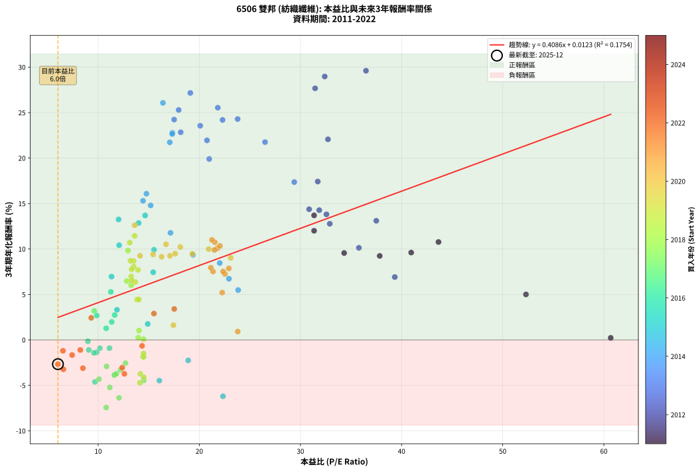
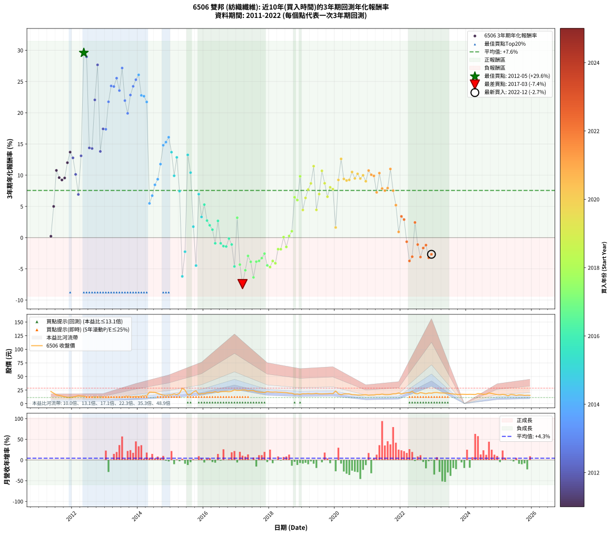

# 6506 雙邦 - 本益比與未來報酬率分析

!!! info "報告資訊"
    - **股票代號**: 6506
    - **公司名稱**: 雙邦
    - **產業別**: 紡織纖維
    - **分析期間**: 2011-2022 (140 個數據點)
    - **資料來源**: Type 12 (ShowMonthlyK_ChartFlow) 月收盤價與本益比
    - **報酬率口徑**: 含現金股利 (簡化: 年度合計，假設每年7/1入帳)
    - **報告生成時間**: 2026-01-04 08:20:36 CST

## 📈 視覺化圖表

### 圖表1: 本益比 vs 未來報酬率關係

*圖表1：6506 雙邦 本益比與3年期未來報酬率關係 (2011-2022)*

### 圖表2: 歷年買入時點的3年期實際報酬率

*圖表2：6506 雙邦 歷年買入時點的3年期實際報酬率 (2011-2022)*

## 📍 買點訊號說明

本報告提供兩種買點提示訊號（顯示於圖表2的股價子圖中）：

### ▲ 小綠色三角形（回測驗證）
- **計算方式**: 使用全部歷史資料計算本益比第25百分位數
- **用途**: 事後驗證，顯示歷史上哪些時點確實為低估區
- **限制**: 當下無法判斷，僅供回測參考
- **特性**: 後見之明（Look-Ahead Bias）

### ▲ 小橘色三角形（即時訊號）
- **計算方式**: 使用截至當月的過去5年資料計算本益比第25百分位數
- **用途**: 實際投資決策，當時即可判斷
- **優勢**: 可操作性強，符合實務需求
- **特性**: 無後見之明，滾動窗口計算

!!! tip "如何使用兩種訊號"
    - **綠色▲** 幫助理解歷史估值機會，驗證策略有效性
    - **橘色▲** 可作為實際買進參考，但仍需搭配基本面分析
    - 兩種訊號重疊時，表示即時判斷與事後驗證一致，信心度較高
    - 僅有綠色▲時，表示當時無法判斷（需要未來資料才能確認）
    - 僅有橘色▲時，表示即時判斷為買點，但事後可能不是最佳時機

## 📊 估值分析摘要

| 指標 | 數值 |
|:---:|:---:|
| **目前本益比** (2022-12) | **6.02 倍** |
| **歷史平均本益比** | 18.46 倍 |
| **估值水準** | 🟢 相對低估 |
| **預期3年年化報酬率** | **+2.47%** |
| **歷史平均報酬率** | +7.56% |
| **相關係數 (R²)** | 0.1754 |
| **趨勢線斜率** | 0.4086 |

!!! abstract "核心洞察"
    目前本益比顯著低於歷史平均，預期未來報酬率可能較高

    根據歷史數據回測，6506 雙邦 在目前本益比 **6.0倍** 的估值水準下，
    預期未來3年年化報酬率約為 **+2.5%**。

    **重要提醒**: 本分析基於歷史數據統計，實際報酬率會受到公司基本面變化、產業趨勢、
    總體經濟環境等多重因素影響。R² = 0.18 表示本益比可解釋約 17.5% 的報酬率變異。

## 📈 歷史估值統計

### 最佳買點 (最高報酬率)

| 項目 | 數值 |
|:---:|:---:|
| 起始時間 | 2012-05 |
| 當時本益比 | 36.48 倍 |
| 起始價格 | 13.7 元 |
| 3年後價格 | 28.6 元 |
| **3年年化報酬率** | **+29.60%** |

### 最差買點 (最低報酬率)

| 項目 | 數值 |
|:---:|:---:|
| 起始時間 | 2017-03 |
| 當時本益比 | 10.79 倍 |
| 起始價格 | 25.4 元 |
| 3年後價格 | 16.6 元 |
| **3年年化報酬率** | **-7.44%** |

## 🎯 投資啟示

### 本益比與報酬率關係

趨勢線方程式: **y = 0.4086x + 0.0123**

!!! info "弱相關或正相關"
    本益比與未來報酬率相關性較弱。這可能表示該股票的報酬率更多受到
    公司成長性、產業趨勢等因素影響，而非估值水準。**需綜合考量多項指標**。

### 估值區間建議

基於歷史數據分析:

- **🟢 低估區** (P/E < 14.8): 預期報酬率較高，可考慮增加持股
- **🟡 合理區** (P/E 14.8-22.2): 預期報酬率符合長期趨勢，正常持有
- **🔴 高估區** (P/E > 22.2): 預期報酬率較低，可考慮減碼或觀望

!!! danger "風險提示"
    - 過去表現不代表未來結果
    - 本分析假設公司基本面無重大結構性變化
    - 產業環境劇變可能使歷史規律失效
    - 應結合公司財報、產業趨勢、總體經濟等多重因素綜合判斷

!!! success "長期投資觀點"
    歷史數據顯示，在合理或低估的估值水準買入並長期持有，
    往往能獲得較佳的投資報酬。**耐心等待好價格**是價值投資的核心原則。

## 📊 數據品質

- **資料來源**: GoodInfo.tw Type 12 (ShowMonthlyK_ChartFlow)
- **資料頻率**: 月度收盤價與本益比
- **回測期間**: 2011-2022
- **數據點數量**: 140 個 (每個點代表一次3年期回測)

### 計算方法說明

1. **3年期年化報酬率**:
   - 對每個歷史時點，計算其後3年的實際投資報酬率
   - 期末價值(不含股利): 期末價格
   - 期末價值(含現金股利): 期末價格 + 持有期間內的現金股利合計 (簡化: 年度合計，假設每年7/1入帳)
   - 公式: 年化報酬率 = [(期末價值/期初價格)^(1/年數) - 1] × 100%

2. **本益比 (P/E Ratio)**:
   - 使用當時的月收盤價與EPS計算
   - 資料來源: Type 12 月度河流圖本益比數據

3. **趨勢線 (Linear Regression)**:
   - 使用最小平方法擬合線性趨勢線
   - R²值衡量本益比對報酬率的解釋能力

---

*本報告由 Stock Analysis System v1.9.0 自動生成*
*數據更新時間: 2026-01-04 08:20:36 CST*

## 📋 月度回測明細表

（每一列對應時間線圖中的一個買入點；可用來對照 SVG 圖上的每個點。）

| 買入月份 | 賣出月份 | 回測期限_年 | 實際持有年數 | 買入本益比_倍 | 買入收盤價_元 | 賣出收盤價_元 | 現金股利合計_元 | 總報酬率_pct | 年化報酬率_pct |
| --- | --- | --- | --- | --- | --- | --- | --- | --- | --- |
| 2011-05 | 2014-05 | 3 | 3.001 | 60.68 | 22.45 | 21.30 | 1.30 | +0.67 | +0.22 |
| 2011-06 | 2014-06 | 3 | 3.001 | 52.30 | 19.35 | 21.10 | 1.30 | +15.76 | +5.00 |
| 2011-07 | 2014-07 | 3 | 3.001 | 43.65 | 16.15 | 20.85 | 1.10 | +35.91 | +10.77 |
| 2011-08 | 2014-08 | 3 | 3.001 | 40.95 | 15.15 | 18.85 | 1.10 | +31.68 | +9.61 |
| 2011-09 | 2014-09 | 3 | 3.001 | 37.84 | 14.00 | 17.15 | 1.10 | +30.36 | +9.24 |
| 2011-10 | 2014-10 | 3 | 3.001 | 34.32 | 12.70 | 15.60 | 1.10 | +31.50 | +9.55 |
| 2011-11 | 2014-11 | 3 | 3.001 | 31.35 | 11.60 | 15.20 | 1.10 | +40.52 | +12.00 |
| 2011-12 | 2014-12 | 3 | 3.001 | 31.35 | 11.60 | 15.95 | 1.10 | +46.98 | +13.70 |
| 2012-01 | 2015-01 | 3 | 3.001 | 32.90 | 12.20 | 16.40 | 1.10 | +43.44 | +12.78 |
| 2012-02 | 2015-03 | 3 | 3.080 | 35.78 | 13.30 | 16.80 | 1.10 | +34.59 | +10.12 |
| 2012-03 | 2015-03 | 3 | 2.998 | 39.33 | 14.65 | 16.80 | 1.10 | +22.18 | +6.91 |
| 2012-04 | 2015-04 | 3 | 2.998 | 37.50 | 14.00 | 19.15 | 1.10 | +44.64 | +13.10 |
| 2012-05 | 2015-05 | 3 | 2.998 | 36.48 | 13.65 | 28.60 | 1.10 | +117.58 | +29.60 |
| 2012-06 | 2015-06 | 3 | 2.998 | 32.40 | 12.15 | 24.95 | 1.10 | +114.40 | +28.97 |
| 2012-07 | 2015-07 | 3 | 2.998 | 30.86 | 11.60 | 16.35 | 1.00 | +49.57 | +14.37 |
| 2012-08 | 2015-08 | 3 | 2.998 | 31.86 | 12.00 | 16.90 | 1.00 | +49.17 | +14.27 |
| 2012-09 | 2015-09 | 3 | 2.998 | 32.72 | 12.35 | 21.45 | 1.00 | +81.78 | +22.06 |
| 2012-10 | 2015-10 | 3 | 2.998 | 31.45 | 11.90 | 23.75 | 1.00 | +107.98 | +27.67 |
| 2012-11 | 2015-11 | 3 | 2.998 | 32.57 | 12.35 | 17.20 | 1.00 | +47.37 | +13.81 |
| 2012-12 | 2015-12 | 3 | 2.998 | 31.71 | 12.05 | 18.50 | 1.00 | +61.83 | +17.42 |
| 2013-01 | 2016-01 | 3 | 2.998 | 29.39 | 12.10 | 18.55 | 1.00 | +61.57 | +17.35 |
| 2013-02 | 2016-02 | 3 | 2.998 | 26.50 | 11.75 | 20.20 | 1.00 | +80.43 | +21.76 |
| 2013-03 | 2016-03 | 3 | 3.001 | 23.79 | 11.30 | 20.70 | 1.00 | +92.04 | +24.29 |
| 2013-04 | 2016-04 | 3 | 3.001 | 22.30 | 11.30 | 20.65 | 1.00 | +91.59 | +24.20 |
| 2013-05 | 2016-05 | 3 | 3.001 | 21.83 | 11.75 | 22.25 | 1.00 | +97.87 | +25.54 |
| 2013-06 | 2016-06 | 3 | 3.001 | 20.09 | 11.45 | 20.60 | 1.00 | +88.65 | +23.56 |
| 2013-07 | 2016-07 | 3 | 3.001 | 19.11 | 11.50 | 22.15 | 1.50 | +105.65 | +27.16 |
| 2013-08 | 2016-08 | 3 | 3.001 | 20.76 | 13.15 | 22.35 | 1.50 | +81.37 | +21.95 |
| 2013-09 | 2016-09 | 3 | 3.001 | 20.98 | 13.95 | 22.55 | 1.50 | +72.40 | +19.90 |
| 2013-10 | 2016-10 | 3 | 3.001 | 18.16 | 12.65 | 21.95 | 1.50 | +85.38 | +22.84 |
| 2013-11 | 2016-11 | 3 | 3.001 | 17.51 | 12.75 | 22.95 | 1.50 | +91.76 | +24.23 |
| 2013-12 | 2016-12 | 3 | 3.001 | 17.96 | 13.65 | 25.35 | 1.50 | +96.70 | +25.29 |
| 2014-01 | 2017-01 | 3 | 3.001 | 16.40 | 12.90 | 24.35 | 1.50 | +100.39 | +26.07 |
| 2014-02 | 2017-02 | 3 | 3.001 | 17.34 | 14.10 | 24.60 | 1.50 | +85.11 | +22.78 |
| 2014-03 | 2017-03 | 3 | 3.001 | 17.32 | 14.55 | 25.35 | 1.50 | +84.54 | +22.65 |
| 2014-04 | 2017-04 | 3 | 3.001 | 17.08 | 14.80 | 25.20 | 1.50 | +80.41 | +21.73 |
| 2014-05 | 2017-05 | 3 | 3.001 | 23.84 | 21.30 | 23.50 | 1.50 | +17.37 | +5.48 |
| 2014-06 | 2017-06 | 3 | 3.001 | 22.93 | 21.10 | 24.15 | 1.50 | +21.56 | +6.72 |
| 2014-07 | 2017-07 | 3 | 3.001 | 22.02 | 20.85 | 24.00 | 2.60 | +27.58 | +8.46 |
| 2014-08 | 2017-08 | 3 | 3.001 | 19.37 | 18.85 | 22.05 | 2.60 | +30.77 | +9.35 |
| 2014-09 | 2017-09 | 3 | 3.001 | 17.15 | 17.15 | 21.35 | 2.60 | +39.65 | +11.77 |
| 2014-10 | 2017-10 | 3 | 3.001 | 15.19 | 15.60 | 21.00 | 2.60 | +51.28 | +14.79 |
| 2014-11 | 2017-11 | 3 | 3.001 | 14.43 | 15.20 | 20.70 | 2.60 | +53.29 | +15.30 |
| 2014-12 | 2017-12 | 3 | 3.001 | 14.77 | 15.95 | 22.35 | 2.60 | +56.43 | +16.08 |
| 2015-01 | 2018-01 | 3 | 3.001 | 14.64 | 16.40 | 21.50 | 2.60 | +46.95 | +13.69 |
| 2015-02 | 2018-02 | 3 | 3.001 | 15.52 | 18.00 | 21.30 | 2.60 | +32.78 | +9.91 |
| 2015-03 | 2018-03 | 3 | 3.001 | 14.00 | 16.80 | 21.55 | 2.60 | +43.75 | +12.86 |
| 2015-04 | 2018-04 | 3 | 3.001 | 15.44 | 19.15 | 21.15 | 2.60 | +24.02 | +7.44 |
| 2015-05 | 2018-05 | 3 | 3.001 | 22.34 | 28.60 | 21.00 | 2.60 | -17.48 | -6.20 |
| 2015-06 | 2018-06 | 3 | 3.001 | 18.90 | 24.95 | 20.70 | 2.60 | -6.61 | -2.25 |
| 2015-07 | 2018-07 | 3 | 3.001 | 12.02 | 16.35 | 20.45 | 3.30 | +45.26 | +13.25 |
| 2015-08 | 2018-08 | 3 | 3.001 | 12.07 | 16.90 | 19.45 | 3.30 | +34.62 | +10.41 |
| 2015-09 | 2018-09 | 3 | 3.001 | 14.90 | 21.45 | 19.30 | 3.30 | +5.36 | +1.76 |
| 2015-10 | 2018-10 | 3 | 3.001 | 16.05 | 23.75 | 17.40 | 3.30 | -12.84 | -4.48 |
| 2015-11 | 2018-11 | 3 | 3.001 | 11.32 | 17.20 | 17.75 | 3.30 | +22.38 | +6.96 |
| 2015-12 | 2018-12 | 3 | 3.001 | 11.86 | 18.50 | 17.10 | 3.30 | +10.27 | +3.31 |
| 2016-01 | 2019-01 | 3 | 3.001 | 11.25 | 18.55 | 18.35 | 3.30 | +16.71 | +5.28 |
| 2016-02 | 2019-03 | 3 | 3.080 | 11.63 | 20.20 | 18.65 | 3.30 | +8.66 | +2.73 |
| 2016-03 | 2019-03 | 3 | 2.998 | 11.34 | 20.70 | 18.65 | 3.30 | +6.04 | +1.98 |
| 2016-04 | 2019-04 | 3 | 2.998 | 10.79 | 20.65 | 18.15 | 3.30 | +3.87 | +1.28 |
| 2016-05 | 2019-05 | 3 | 2.998 | 11.12 | 22.25 | 18.35 | 3.30 | -2.70 | -0.91 |
| 2016-06 | 2019-06 | 3 | 2.998 | 9.86 | 20.60 | 19.00 | 3.30 | +8.25 | +2.68 |
| 2016-07 | 2019-07 | 3 | 2.998 | 10.17 | 22.15 | 18.05 | 3.50 | -2.71 | -0.91 |
| 2016-08 | 2019-08 | 3 | 2.998 | 9.86 | 22.35 | 17.95 | 3.50 | -4.03 | -1.36 |
| 2016-09 | 2019-09 | 3 | 2.998 | 9.58 | 22.55 | 18.10 | 3.50 | -4.21 | -1.43 |
| 2016-10 | 2019-10 | 3 | 2.998 | 8.98 | 21.95 | 18.35 | 3.50 | -0.46 | -0.15 |
| 2016-11 | 2019-11 | 3 | 2.998 | 9.07 | 22.95 | 18.70 | 3.50 | -3.27 | -1.10 |
| 2016-12 | 2019-12 | 3 | 2.998 | 9.68 | 25.35 | 18.50 | 3.50 | -13.21 | -4.62 |
| 2017-01 | 2020-01 | 3 | 2.998 | 9.62 | 24.35 | 23.25 | 3.50 | +9.86 | +3.19 |
| 2017-02 | 2020-02 | 3 | 2.998 | 10.08 | 24.60 | 18.05 | 3.50 | -12.40 | -4.32 |
| 2017-03 | 2020-03 | 3 | 3.001 | 10.79 | 25.35 | 16.60 | 3.50 | -20.71 | -7.44 |
| 2017-04 | 2020-04 | 3 | 3.001 | 11.15 | 25.20 | 17.95 | 3.50 | -14.88 | -5.23 |
| 2017-05 | 2020-05 | 3 | 3.001 | 10.83 | 23.50 | 18.00 | 3.50 | -8.51 | -2.92 |
| 2017-06 | 2020-06 | 3 | 3.001 | 11.61 | 24.15 | 17.95 | 3.50 | -11.18 | -3.87 |
| 2017-07 | 2020-07 | 3 | 3.001 | 12.06 | 24.00 | 16.60 | 3.10 | -17.92 | -6.37 |
| 2017-08 | 2020-08 | 3 | 3.001 | 11.61 | 22.05 | 16.50 | 3.10 | -11.11 | -3.85 |
| 2017-09 | 2020-09 | 3 | 3.001 | 11.80 | 21.35 | 15.95 | 3.10 | -10.77 | -3.73 |
| 2017-10 | 2020-10 | 3 | 3.001 | 12.21 | 21.00 | 15.90 | 3.10 | -9.52 | -3.28 |
| 2017-11 | 2020-11 | 3 | 3.001 | 12.70 | 20.70 | 16.05 | 3.10 | -7.49 | -2.56 |
| 2017-12 | 2020-12 | 3 | 3.001 | 14.51 | 22.35 | 16.40 | 3.10 | -12.75 | -4.44 |
| 2018-01 | 2021-01 | 3 | 3.001 | 14.13 | 21.50 | 15.50 | 3.10 | -13.49 | -4.71 |
| 2018-02 | 2021-02 | 3 | 3.001 | 14.17 | 21.30 | 15.90 | 3.10 | -10.80 | -3.74 |
| 2018-03 | 2021-03 | 3 | 3.001 | 14.51 | 21.55 | 15.90 | 3.10 | -11.83 | -4.11 |
| 2018-04 | 2021-04 | 3 | 3.001 | 14.42 | 21.15 | 16.90 | 3.10 | -5.44 | -1.85 |
| 2018-05 | 2021-05 | 3 | 3.001 | 14.50 | 21.00 | 16.75 | 3.10 | -5.48 | -1.86 |
| 2018-06 | 2021-06 | 3 | 3.001 | 14.48 | 20.70 | 17.65 | 3.10 | +0.24 | +0.08 |
| 2018-07 | 2021-07 | 3 | 3.001 | 14.49 | 20.45 | 16.65 | 2.90 | -4.40 | -1.49 |
| 2018-08 | 2021-08 | 3 | 3.001 | 13.96 | 19.45 | 16.70 | 2.90 | +0.77 | +0.26 |
| 2018-09 | 2021-09 | 3 | 3.001 | 14.04 | 19.30 | 17.00 | 2.90 | +3.11 | +1.03 |
| 2018-10 | 2021-10 | 3 | 3.001 | 12.83 | 17.40 | 18.10 | 2.90 | +20.69 | +6.47 |
| 2018-11 | 2021-11 | 3 | 3.001 | 13.26 | 17.75 | 18.25 | 2.90 | +19.15 | +6.01 |
| 2018-12 | 2021-12 | 3 | 3.001 | 12.95 | 17.10 | 19.75 | 2.90 | +32.46 | +9.82 |
| 2019-01 | 2022-01 | 3 | 3.001 | 13.84 | 18.35 | 18.00 | 2.90 | +13.90 | +4.43 |
| 2019-02 | 2022-02 | 3 | 3.001 | 13.67 | 18.20 | 19.00 | 2.90 | +20.33 | +6.36 |
| 2019-03 | 2022-03 | 3 | 3.001 | 13.94 | 18.65 | 20.40 | 2.90 | +24.93 | +7.70 |
| 2019-04 | 2022-04 | 3 | 3.001 | 13.51 | 18.15 | 20.40 | 2.90 | +28.37 | +8.68 |
| 2019-05 | 2022-05 | 3 | 3.001 | 13.60 | 18.35 | 22.50 | 2.90 | +38.42 | +11.44 |
| 2019-06 | 2022-06 | 3 | 3.001 | 14.02 | 19.00 | 18.75 | 2.90 | +13.95 | +4.45 |
| 2019-07 | 2022-07 | 3 | 3.001 | 13.26 | 18.05 | 18.20 | 3.90 | +22.44 | +6.98 |
| 2019-08 | 2022-08 | 3 | 3.001 | 13.13 | 17.95 | 20.45 | 3.90 | +35.65 | +10.70 |
| 2019-09 | 2022-09 | 3 | 3.001 | 13.19 | 18.10 | 19.35 | 3.90 | +28.45 | +8.70 |
| 2019-10 | 2022-10 | 3 | 3.001 | 13.31 | 18.35 | 18.30 | 3.90 | +20.98 | +6.55 |
| 2019-11 | 2022-11 | 3 | 3.001 | 13.51 | 18.70 | 19.70 | 3.90 | +26.20 | +8.06 |
| 2019-12 | 2022-12 | 3 | 3.001 | 13.31 | 18.50 | 19.25 | 3.90 | +25.14 | +7.76 |
| 2020-01 | 2023-01 | 3 | 3.001 | 17.44 | 23.25 | 20.50 | 3.90 | +4.95 | +1.62 |
| 2020-02 | 2023-03 | 3 | 3.080 | 14.14 | 18.05 | 19.80 | 3.90 | +31.30 | +9.24 |
| 2020-03 | 2023-03 | 3 | 2.998 | 13.61 | 16.60 | 19.80 | 3.90 | +42.77 | +12.61 |
| 2020-04 | 2023-04 | 3 | 2.998 | 15.43 | 17.95 | 19.60 | 3.90 | +30.92 | +9.40 |
| 2020-05 | 2023-05 | 3 | 2.998 | 16.27 | 18.00 | 19.50 | 3.90 | +30.00 | +9.15 |
| 2020-06 | 2023-06 | 3 | 2.998 | 17.10 | 17.95 | 19.50 | 3.90 | +30.36 | +9.25 |
| 2020-07 | 2023-07 | 3 | 2.998 | 16.71 | 16.60 | 18.40 | 4.00 | +34.94 | +10.51 |
| 2020-08 | 2023-08 | 3 | 2.998 | 17.62 | 16.50 | 17.65 | 4.00 | +31.21 | +9.48 |
| 2020-09 | 2023-09 | 3 | 2.998 | 18.12 | 15.95 | 17.35 | 4.00 | +33.86 | +10.22 |
| 2020-10 | 2023-10 | 3 | 2.998 | 19.31 | 15.90 | 16.85 | 4.00 | +31.13 | +9.46 |
| 2020-11 | 2023-11 | 3 | 2.998 | 20.93 | 16.05 | 17.35 | 4.00 | +33.02 | +9.99 |
| 2020-12 | 2023-12 | 3 | 2.998 | 23.10 | 16.40 | 17.25 | 4.00 | +29.57 | +9.03 |
| 2021-01 | 2024-01 | 3 | 2.998 | 21.53 | 15.50 | 17.05 | 4.00 | +35.81 | +10.75 |
| 2021-02 | 2024-02 | 3 | 2.998 | 21.78 | 15.90 | 17.20 | 4.00 | +33.33 | +10.07 |
| 2021-03 | 2024-03 | 3 | 3.001 | 21.49 | 15.90 | 17.10 | 4.00 | +32.70 | +9.89 |
| 2021-04 | 2024-04 | 3 | 3.001 | 22.53 | 16.90 | 16.85 | 4.00 | +23.37 | +7.25 |
| 2021-05 | 2024-05 | 3 | 3.001 | 22.04 | 16.75 | 18.50 | 4.00 | +34.33 | +10.33 |
| 2021-06 | 2024-06 | 3 | 3.001 | 22.92 | 17.65 | 18.15 | 4.00 | +25.50 | +7.86 |
| 2021-07 | 2024-07 | 3 | 3.001 | 21.35 | 16.65 | 17.10 | 3.60 | +24.32 | +7.53 |
| 2021-08 | 2024-08 | 3 | 3.001 | 21.14 | 16.70 | 17.40 | 3.60 | +25.75 | +7.93 |
| 2021-09 | 2024-09 | 3 | 3.001 | 21.25 | 17.00 | 19.65 | 3.60 | +36.76 | +11.00 |
| 2021-10 | 2024-10 | 3 | 3.001 | 22.35 | 18.10 | 18.90 | 3.60 | +24.31 | +7.52 |
| 2021-11 | 2024-11 | 3 | 3.001 | 22.26 | 18.25 | 17.65 | 3.60 | +16.44 | +5.20 |
| 2021-12 | 2024-12 | 3 | 3.001 | 23.80 | 19.75 | 16.70 | 3.60 | +2.78 | +0.92 |
| 2022-01 | 2025-01 | 3 | 3.001 | 17.52 | 18.00 | 16.30 | 3.60 | +10.56 | +3.40 |
| 2022-02 | 2025-02 | 3 | 3.001 | 15.51 | 19.00 | 17.10 | 3.60 | +8.95 | +2.90 |
| 2022-03 | 2025-03 | 3 | 3.001 | 14.34 | 20.40 | 16.40 | 3.60 | -1.96 | -0.66 |
| 2022-04 | 2025-04 | 3 | 3.001 | 12.59 | 20.40 | 14.60 | 3.60 | -10.78 | -3.73 |
| 2022-05 | 2025-05 | 3 | 3.001 | 12.38 | 22.50 | 16.90 | 3.60 | -8.89 | -3.05 |
| 2022-06 | 2025-06 | 3 | 3.001 | 9.31 | 18.75 | 16.55 | 3.60 | +7.47 | +2.43 |
| 2022-07 | 2025-07 | 3 | 3.001 | 8.23 | 18.20 | 15.20 | 2.40 | -3.30 | -1.11 |
| 2022-08 | 2025-08 | 3 | 3.001 | 8.49 | 20.45 | 16.20 | 2.40 | -9.05 | -3.11 |
| 2022-09 | 2025-09 | 3 | 3.001 | 7.42 | 19.35 | 16.00 | 2.40 | -4.91 | -1.66 |
| 2022-10 | 2025-10 | 3 | 3.001 | 6.52 | 18.30 | 15.25 | 2.40 | -3.55 | -1.20 |
| 2022-11 | 2025-11 | 3 | 3.001 | 6.56 | 19.70 | 15.45 | 2.40 | -9.39 | -3.23 |
| 2022-12 | 2025-12 | 3 | 3.001 | 6.02 | 19.25 | 15.35 | 2.40 | -7.79 | -2.67 |
