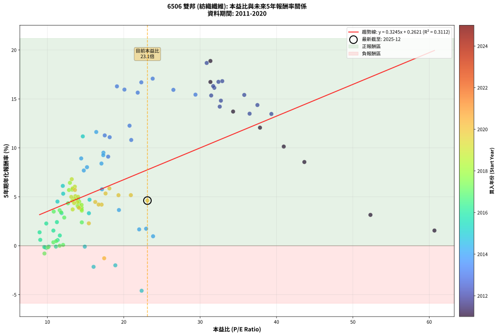
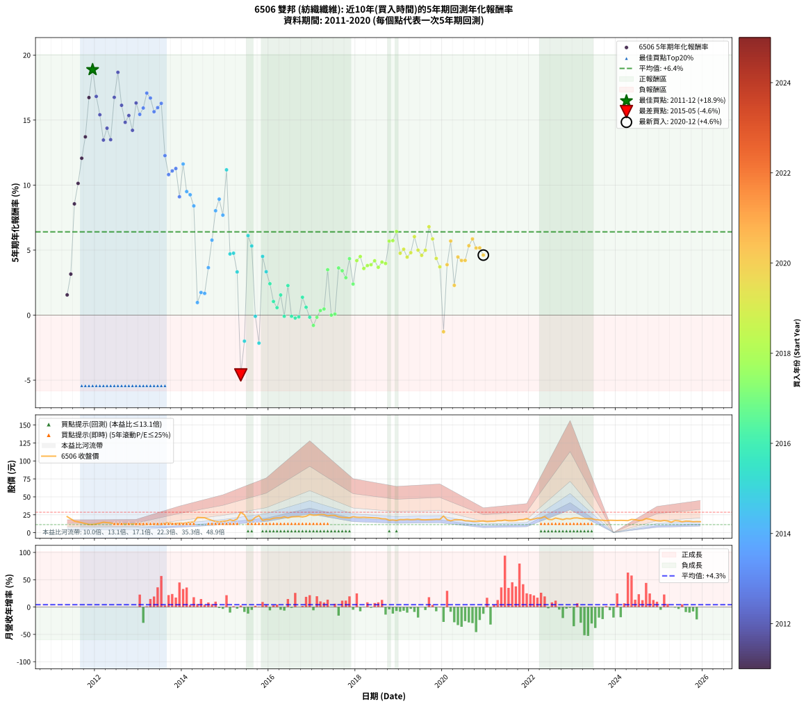

# 6506 雙邦 - 本益比與未來報酬率分析

!!! info "報告資訊"
    - **股票代號**: 6506
    - **公司名稱**: 雙邦
    - **產業別**: 紡織纖維
    - **分析期間**: 2011-2020 (116 個數據點)
    - **資料來源**: Type 12 (ShowMonthlyK_ChartFlow) 月收盤價與本益比
    - **報酬率口徑**: 含現金股利 (簡化: 年度合計，假設每年7/1入帳)
    - **報告生成時間**: 2026-01-22 23:58:55 CST

## 📈 視覺化圖表

### 圖表1: 本益比 vs 未來報酬率關係

*圖表1：6506 雙邦 本益比與5年期未來報酬率關係 (2011-2020)*

### 圖表2: 歷年買入時點的5年期實際報酬率

*圖表2：6506 雙邦 歷年買入時點的5年期實際報酬率 (2011-2020)*

## 📍 買點訊號說明

本報告提供兩種買點提示訊號（顯示於圖表2的股價子圖中）：

### ▲ 小綠色三角形（回測驗證）
- **計算方式**: 使用全部歷史資料計算本益比第25百分位數
- **用途**: 事後驗證，顯示歷史上哪些時點確實為低估區
- **限制**: 當下無法判斷，僅供回測參考
- **特性**: 後見之明（Look-Ahead Bias）

### ▲ 小橘色三角形（即時訊號）
- **計算方式**: 使用截至當月的過去5年資料計算本益比第25百分位數
- **用途**: 實際投資決策，當時即可判斷
- **優勢**: 可操作性強，符合實務需求
- **特性**: 無後見之明，滾動窗口計算

!!! tip "如何使用兩種訊號"
    - **綠色▲** 幫助理解歷史估值機會，驗證策略有效性
    - **橘色▲** 可作為實際買進參考，但仍需搭配基本面分析
    - 兩種訊號重疊時，表示即時判斷與事後驗證一致，信心度較高
    - 僅有綠色▲時，表示當時無法判斷（需要未來資料才能確認）
    - 僅有橘色▲時，表示即時判斷為買點，但事後可能不是最佳時機

## 📊 估值分析摘要

| 指標 | 數值 |
|:---:|:---:|
| **目前本益比** (2020-12) | **23.10 倍** |
| **歷史平均本益比** | 18.93 倍 |
| **估值水準** | 🔴 相對高估 |
| **預期5年年化報酬率** | **+7.76%** |
| **歷史平均報酬率** | +6.40% |
| **相關係數 (R²)** | 0.3112 |
| **趨勢線斜率** | 0.3245 |

!!! abstract "核心洞察"
    目前本益比顯著高於歷史平均，預期未來報酬率可能較低

    根據歷史數據回測，6506 雙邦 在目前本益比 **23.1倍** 的估值水準下，
    預期未來5年年化報酬率約為 **+7.8%**。

    **重要提醒**: 本分析基於歷史數據統計，實際報酬率會受到公司基本面變化、產業趨勢、
    總體經濟環境等多重因素影響。R² = 0.31 表示本益比可解釋約 31.1% 的報酬率變異。

## 📈 歷史估值統計

### 最佳買點 (最高報酬率)

| 項目 | 數值 |
|:---:|:---:|
| 起始時間 | 2011-12 |
| 當時本益比 | 31.35 倍 |
| 起始價格 | 11.6 元 |
| 5年後價格 | 25.4 元 |
| **5年年化報酬率** | **+18.88%** |

### 最差買點 (最低報酬率)

| 項目 | 數值 |
|:---:|:---:|
| 起始時間 | 2015-05 |
| 當時本益比 | 22.34 倍 |
| 起始價格 | 28.6 元 |
| 5年後價格 | 18.0 元 |
| **5年年化報酬率** | **-4.60%** |

## 🎯 投資啟示

### 本益比與報酬率關係

趨勢線方程式: **y = 0.3245x + 0.2621**

!!! info "弱相關或正相關"
    本益比與未來報酬率相關性較弱。這可能表示該股票的報酬率更多受到
    公司成長性、產業趨勢等因素影響，而非估值水準。**需綜合考量多項指標**。

### 估值區間建議

基於歷史數據分析:

- **🟢 低估區** (P/E < 15.1): 預期報酬率較高，可考慮增加持股
- **🟡 合理區** (P/E 15.1-22.7): 預期報酬率符合長期趨勢，正常持有
- **🔴 高估區** (P/E > 22.7): 預期報酬率較低，可考慮減碼或觀望

!!! danger "風險提示"
    - 過去表現不代表未來結果
    - 本分析假設公司基本面無重大結構性變化
    - 產業環境劇變可能使歷史規律失效
    - 應結合公司財報、產業趨勢、總體經濟等多重因素綜合判斷

!!! success "長期投資觀點"
    歷史數據顯示，在合理或低估的估值水準買入並長期持有，
    往往能獲得較佳的投資報酬。**耐心等待好價格**是價值投資的核心原則。

## 📊 數據品質

- **資料來源**: GoodInfo.tw Type 12 (ShowMonthlyK_ChartFlow)
- **資料頻率**: 月度收盤價與本益比
- **回測期間**: 2011-2020
- **數據點數量**: 116 個 (每個點代表一次5年期回測)

### 計算方法說明

1. **5年期年化報酬率**:
   - 對每個歷史時點，計算其後5年的實際投資報酬率
   - 期末價值(不含股利): 期末價格
   - 期末價值(含現金股利): 期末價格 + 持有期間內的現金股利合計 (簡化: 年度合計，假設每年7/1入帳)
   - 公式: 年化報酬率 = [(期末價值/期初價格)^(1/年數) - 1] × 100%

2. **本益比 (P/E Ratio)**:
   - 使用當時的月收盤價與EPS計算
   - 資料來源: Type 12 月度河流圖本益比數據

3. **趨勢線 (Linear Regression)**:
   - 使用最小平方法擬合線性趨勢線
   - R²值衡量本益比對報酬率的解釋能力

---

*本報告由 Stock Analysis System v1.9.0 自動生成*
*數據更新時間: 2026-01-22 23:58:55 CST*

## 📋 月度回測明細表

（每一列對應時間線圖中的一個買入點；可用來對照 SVG 圖上的每個點。）

| 買入月份 | 賣出月份 | 回測期限_年 | 實際持有年數 | 買入本益比_倍 | 買入收盤價_元 | 賣出收盤價_元 | 現金股利合計_元 | 總報酬率_pct | 年化報酬率_pct |
| --- | --- | --- | --- | --- | --- | --- | --- | --- | --- |
| 2011-05 | 2016-05 | 5 | 5.002 | 60.68 | 22.45 | 22.25 | 2.00 | +8.02 | +1.55 |
| 2011-06 | 2016-06 | 5 | 5.002 | 52.30 | 19.35 | 20.60 | 2.00 | +16.80 | +3.15 |
| 2011-07 | 2016-07 | 5 | 5.002 | 43.65 | 16.15 | 22.15 | 2.20 | +50.77 | +8.56 |
| 2011-08 | 2016-08 | 5 | 5.002 | 40.95 | 15.15 | 22.35 | 2.20 | +62.05 | +10.13 |
| 2011-09 | 2016-09 | 5 | 5.002 | 37.84 | 14.00 | 22.55 | 2.20 | +76.79 | +12.06 |
| 2011-10 | 2016-10 | 5 | 5.002 | 34.32 | 12.70 | 21.95 | 2.20 | +90.16 | +13.71 |
| 2011-11 | 2016-11 | 5 | 5.002 | 31.35 | 11.60 | 22.95 | 2.20 | +116.81 | +16.73 |
| 2011-12 | 2016-12 | 5 | 5.002 | 31.35 | 11.60 | 25.35 | 2.20 | +137.50 | +18.88 |
| 2012-01 | 2017-01 | 5 | 5.002 | 32.90 | 12.20 | 24.35 | 2.20 | +117.62 | +16.82 |
| 2012-02 | 2017-03 | 5 | 5.081 | 35.78 | 13.30 | 25.35 | 2.20 | +107.14 | +15.41 |
| 2012-03 | 2017-03 | 5 | 4.999 | 39.33 | 14.65 | 25.35 | 2.20 | +88.05 | +13.47 |
| 2012-04 | 2017-04 | 5 | 4.999 | 37.50 | 14.00 | 25.20 | 2.20 | +95.71 | +14.38 |
| 2012-05 | 2017-05 | 5 | 4.999 | 36.48 | 13.65 | 23.50 | 2.20 | +88.28 | +13.49 |
| 2012-06 | 2017-06 | 5 | 4.999 | 32.40 | 12.15 | 24.15 | 2.20 | +116.87 | +16.75 |
| 2012-07 | 2017-07 | 5 | 4.999 | 30.86 | 11.60 | 24.00 | 3.30 | +135.34 | +18.67 |
| 2012-08 | 2017-08 | 5 | 4.999 | 31.86 | 12.00 | 22.05 | 3.30 | +111.25 | +16.14 |
| 2012-09 | 2017-09 | 5 | 4.999 | 32.72 | 12.35 | 21.35 | 3.30 | +99.60 | +14.83 |
| 2012-10 | 2017-10 | 5 | 4.999 | 31.45 | 11.90 | 21.00 | 3.30 | +104.20 | +15.35 |
| 2012-11 | 2017-11 | 5 | 4.999 | 32.57 | 12.35 | 20.70 | 3.30 | +94.33 | +14.21 |
| 2012-12 | 2017-12 | 5 | 4.999 | 31.71 | 12.05 | 22.35 | 3.30 | +112.86 | +16.31 |
| 2013-01 | 2018-01 | 5 | 4.999 | 29.39 | 12.10 | 21.50 | 3.30 | +104.96 | +15.44 |
| 2013-02 | 2018-02 | 5 | 4.999 | 26.50 | 11.75 | 21.30 | 3.30 | +109.36 | +15.93 |
| 2013-03 | 2018-03 | 5 | 4.999 | 23.79 | 11.30 | 21.55 | 3.30 | +119.91 | +17.07 |
| 2013-04 | 2018-04 | 5 | 4.999 | 22.30 | 11.30 | 21.15 | 3.30 | +116.37 | +16.69 |
| 2013-05 | 2018-05 | 5 | 4.999 | 21.83 | 11.75 | 21.00 | 3.30 | +106.81 | +15.64 |
| 2013-06 | 2018-06 | 5 | 4.999 | 20.09 | 11.45 | 20.70 | 3.30 | +109.61 | +15.96 |
| 2013-07 | 2018-07 | 5 | 4.999 | 19.11 | 11.50 | 20.45 | 4.00 | +112.61 | +16.29 |
| 2013-08 | 2018-08 | 5 | 4.999 | 20.76 | 13.15 | 19.45 | 4.00 | +78.33 | +12.27 |
| 2013-09 | 2018-09 | 5 | 4.999 | 20.98 | 13.95 | 19.30 | 4.00 | +67.03 | +10.81 |
| 2013-10 | 2018-10 | 5 | 4.999 | 18.16 | 12.65 | 17.40 | 4.00 | +69.17 | +11.09 |
| 2013-11 | 2018-11 | 5 | 4.999 | 17.51 | 12.75 | 17.75 | 4.00 | +70.59 | +11.27 |
| 2013-12 | 2018-12 | 5 | 4.999 | 17.96 | 13.65 | 17.10 | 4.00 | +54.58 | +9.10 |
| 2014-01 | 2019-01 | 5 | 4.999 | 16.40 | 12.90 | 18.35 | 4.00 | +73.26 | +11.62 |
| 2014-02 | 2019-02 | 5 | 4.999 | 17.34 | 14.10 | 18.20 | 4.00 | +57.45 | +9.50 |
| 2014-03 | 2019-03 | 5 | 4.999 | 17.32 | 14.55 | 18.65 | 4.00 | +55.67 | +9.26 |
| 2014-04 | 2019-04 | 5 | 4.999 | 17.08 | 14.80 | 18.15 | 4.00 | +49.66 | +8.40 |
| 2014-05 | 2019-05 | 5 | 4.999 | 23.84 | 21.30 | 18.35 | 4.00 | +4.93 | +0.97 |
| 2014-06 | 2019-06 | 5 | 4.999 | 22.93 | 21.10 | 19.00 | 4.00 | +9.00 | +1.74 |
| 2014-07 | 2019-07 | 5 | 4.999 | 22.02 | 20.85 | 18.05 | 4.60 | +8.63 | +1.67 |
| 2014-08 | 2019-08 | 5 | 4.999 | 19.37 | 18.85 | 17.95 | 4.60 | +19.63 | +3.65 |
| 2014-09 | 2019-09 | 5 | 4.999 | 17.15 | 17.15 | 18.10 | 4.60 | +32.36 | +5.77 |
| 2014-10 | 2019-10 | 5 | 4.999 | 15.19 | 15.60 | 18.35 | 4.60 | +47.12 | +8.03 |
| 2014-11 | 2019-11 | 5 | 4.999 | 14.43 | 15.20 | 18.70 | 4.60 | +53.29 | +8.92 |
| 2014-12 | 2019-12 | 5 | 4.999 | 14.77 | 15.95 | 18.50 | 4.60 | +44.83 | +7.69 |
| 2015-01 | 2020-01 | 5 | 4.999 | 14.64 | 16.40 | 23.25 | 4.60 | +69.82 | +11.17 |
| 2015-02 | 2020-02 | 5 | 4.999 | 15.52 | 18.00 | 18.05 | 4.60 | +25.83 | +4.70 |
| 2015-03 | 2020-03 | 5 | 5.002 | 14.00 | 16.80 | 16.60 | 4.60 | +26.19 | +4.76 |
| 2015-04 | 2020-04 | 5 | 5.002 | 15.44 | 19.15 | 17.95 | 4.60 | +17.75 | +3.32 |
| 2015-05 | 2020-05 | 5 | 5.002 | 22.34 | 28.60 | 18.00 | 4.60 | -20.98 | -4.60 |
| 2015-06 | 2020-06 | 5 | 5.002 | 18.90 | 24.95 | 17.95 | 4.60 | -9.62 | -2.00 |
| 2015-07 | 2020-07 | 5 | 5.002 | 12.02 | 16.35 | 16.60 | 5.40 | +34.56 | +6.11 |
| 2015-08 | 2020-08 | 5 | 5.002 | 12.07 | 16.90 | 16.50 | 5.40 | +29.59 | +5.32 |
| 2015-09 | 2020-09 | 5 | 5.002 | 14.90 | 21.45 | 15.95 | 5.40 | -0.47 | -0.09 |
| 2015-10 | 2020-10 | 5 | 5.002 | 16.05 | 23.75 | 15.90 | 5.40 | -10.32 | -2.15 |
| 2015-11 | 2020-11 | 5 | 5.002 | 11.32 | 17.20 | 16.05 | 5.40 | +24.71 | +4.51 |
| 2015-12 | 2020-12 | 5 | 5.002 | 11.86 | 18.50 | 16.40 | 5.40 | +17.84 | +3.34 |
| 2016-01 | 2021-01 | 5 | 5.002 | 11.25 | 18.55 | 15.50 | 5.40 | +12.67 | +2.41 |
| 2016-02 | 2021-03 | 5 | 5.081 | 11.63 | 20.20 | 15.90 | 5.40 | +5.45 | +1.05 |
| 2016-03 | 2021-03 | 5 | 4.999 | 11.34 | 20.70 | 15.90 | 5.40 | +2.90 | +0.57 |
| 2016-04 | 2021-04 | 5 | 4.999 | 10.79 | 20.65 | 16.90 | 5.40 | +7.99 | +1.55 |
| 2016-05 | 2021-05 | 5 | 4.999 | 11.12 | 22.25 | 16.75 | 5.40 | -0.45 | -0.09 |
| 2016-06 | 2021-06 | 5 | 4.999 | 9.86 | 20.60 | 17.65 | 5.40 | +11.89 | +2.27 |
| 2016-07 | 2021-07 | 5 | 4.999 | 10.17 | 22.15 | 16.65 | 5.40 | -0.45 | -0.09 |
| 2016-08 | 2021-08 | 5 | 4.999 | 9.86 | 22.35 | 16.70 | 5.40 | -1.12 | -0.22 |
| 2016-09 | 2021-09 | 5 | 4.999 | 9.58 | 22.55 | 17.00 | 5.40 | -0.67 | -0.13 |
| 2016-10 | 2021-10 | 5 | 4.999 | 8.98 | 21.95 | 18.10 | 5.40 | +7.06 | +1.37 |
| 2016-11 | 2021-11 | 5 | 4.999 | 9.07 | 22.95 | 18.25 | 5.40 | +3.05 | +0.60 |
| 2016-12 | 2021-12 | 5 | 4.999 | 9.68 | 25.35 | 19.75 | 5.40 | -0.79 | -0.16 |
| 2017-01 | 2022-01 | 5 | 4.999 | 9.62 | 24.35 | 18.00 | 5.40 | -3.90 | -0.79 |
| 2017-02 | 2022-02 | 5 | 4.999 | 10.08 | 24.60 | 19.00 | 5.40 | -0.81 | -0.16 |
| 2017-03 | 2022-03 | 5 | 4.999 | 10.79 | 25.35 | 20.40 | 5.40 | +1.78 | +0.35 |
| 2017-04 | 2022-04 | 5 | 4.999 | 11.15 | 25.20 | 20.40 | 5.40 | +2.38 | +0.47 |
| 2017-05 | 2022-05 | 5 | 4.999 | 10.83 | 23.50 | 22.50 | 5.40 | +18.72 | +3.49 |
| 2017-06 | 2022-06 | 5 | 4.999 | 11.61 | 24.15 | 18.75 | 5.40 | +0.00 | +0.00 |
| 2017-07 | 2022-07 | 5 | 4.999 | 12.06 | 24.00 | 18.20 | 5.90 | +0.42 | +0.08 |
| 2017-08 | 2022-08 | 5 | 4.999 | 11.61 | 22.05 | 20.45 | 5.90 | +19.50 | +3.63 |
| 2017-09 | 2022-09 | 5 | 4.999 | 11.80 | 21.35 | 19.35 | 5.90 | +18.27 | +3.41 |
| 2017-10 | 2022-10 | 5 | 4.999 | 12.21 | 21.00 | 18.30 | 5.90 | +15.24 | +2.88 |
| 2017-11 | 2022-11 | 5 | 4.999 | 12.70 | 20.70 | 19.70 | 5.90 | +23.67 | +4.34 |
| 2017-12 | 2022-12 | 5 | 4.999 | 14.51 | 22.35 | 19.25 | 5.90 | +12.53 | +2.39 |
| 2018-01 | 2023-01 | 5 | 4.999 | 14.13 | 21.50 | 20.50 | 5.90 | +22.79 | +4.19 |
| 2018-02 | 2023-02 | 5 | 4.999 | 14.17 | 21.30 | 20.65 | 5.90 | +24.65 | +4.51 |
| 2018-03 | 2023-03 | 5 | 4.999 | 14.51 | 21.55 | 19.80 | 5.90 | +19.26 | +3.59 |
| 2018-04 | 2023-04 | 5 | 4.999 | 14.42 | 21.15 | 19.60 | 5.90 | +20.57 | +3.81 |
| 2018-05 | 2023-05 | 5 | 4.999 | 14.50 | 21.00 | 19.50 | 5.90 | +20.95 | +3.88 |
| 2018-06 | 2023-06 | 5 | 4.999 | 14.48 | 20.70 | 19.50 | 5.90 | +22.71 | +4.18 |
| 2018-07 | 2023-07 | 5 | 4.999 | 14.49 | 20.45 | 18.40 | 6.10 | +19.80 | +3.68 |
| 2018-08 | 2023-08 | 5 | 4.999 | 13.96 | 19.45 | 17.65 | 6.10 | +22.11 | +4.08 |
| 2018-09 | 2023-09 | 5 | 4.999 | 14.04 | 19.30 | 17.35 | 6.10 | +21.50 | +3.97 |
| 2018-10 | 2023-10 | 5 | 4.999 | 12.83 | 17.40 | 16.85 | 6.10 | +31.90 | +5.69 |
| 2018-11 | 2023-11 | 5 | 4.999 | 13.26 | 17.75 | 17.35 | 6.10 | +32.11 | +5.73 |
| 2018-12 | 2023-12 | 5 | 4.999 | 12.95 | 17.10 | 17.25 | 6.10 | +36.55 | +6.43 |
| 2019-01 | 2024-01 | 5 | 4.999 | 13.84 | 18.35 | 17.05 | 6.10 | +26.16 | +4.76 |
| 2019-02 | 2024-02 | 5 | 4.999 | 13.67 | 18.20 | 17.20 | 6.10 | +28.02 | +5.07 |
| 2019-03 | 2024-03 | 5 | 5.002 | 13.94 | 18.65 | 17.10 | 6.10 | +24.40 | +4.46 |
| 2019-04 | 2024-04 | 5 | 5.002 | 13.51 | 18.15 | 16.85 | 6.10 | +26.45 | +4.80 |
| 2019-05 | 2024-05 | 5 | 5.002 | 13.60 | 18.35 | 18.50 | 6.10 | +34.06 | +6.04 |
| 2019-06 | 2024-06 | 5 | 5.002 | 14.02 | 19.00 | 18.15 | 6.10 | +27.63 | +5.00 |
| 2019-07 | 2024-07 | 5 | 5.002 | 13.26 | 18.05 | 17.10 | 5.50 | +25.21 | +4.60 |
| 2019-08 | 2024-08 | 5 | 5.002 | 13.13 | 17.95 | 17.40 | 5.50 | +27.58 | +4.99 |
| 2019-09 | 2024-09 | 5 | 5.002 | 13.19 | 18.10 | 19.65 | 5.50 | +38.95 | +6.80 |
| 2019-10 | 2024-10 | 5 | 5.002 | 13.31 | 18.35 | 18.90 | 5.50 | +32.97 | +5.86 |
| 2019-11 | 2024-11 | 5 | 5.002 | 13.51 | 18.70 | 17.65 | 5.50 | +23.80 | +4.36 |
| 2019-12 | 2024-12 | 5 | 5.002 | 13.31 | 18.50 | 16.70 | 5.50 | +20.00 | +3.71 |
| 2020-01 | 2025-01 | 5 | 5.002 | 17.44 | 23.25 | 16.30 | 5.50 | -6.24 | -1.28 |
| 2020-02 | 2025-03 | 5 | 5.081 | 14.14 | 18.05 | 16.40 | 5.50 | +21.33 | +3.88 |
| 2020-03 | 2025-03 | 5 | 4.999 | 13.61 | 16.60 | 16.40 | 5.50 | +31.93 | +5.70 |
| 2020-04 | 2025-04 | 5 | 4.999 | 15.43 | 17.95 | 14.60 | 5.50 | +11.98 | +2.29 |
| 2020-05 | 2025-05 | 5 | 4.999 | 16.27 | 18.00 | 16.90 | 5.50 | +24.44 | +4.47 |
| 2020-06 | 2025-06 | 5 | 4.999 | 17.10 | 17.95 | 16.55 | 5.50 | +22.84 | +4.20 |
| 2020-07 | 2025-07 | 5 | 4.999 | 16.71 | 16.60 | 15.20 | 5.20 | +22.89 | +4.21 |
| 2020-08 | 2025-08 | 5 | 4.999 | 17.62 | 16.50 | 16.20 | 5.20 | +29.70 | +5.34 |
| 2020-09 | 2025-09 | 5 | 4.999 | 18.12 | 15.95 | 16.00 | 5.20 | +32.92 | +5.86 |
| 2020-10 | 2025-10 | 5 | 4.999 | 19.31 | 15.90 | 15.25 | 5.20 | +28.62 | +5.16 |
| 2020-11 | 2025-11 | 5 | 4.999 | 20.93 | 16.05 | 15.45 | 5.20 | +28.66 | +5.17 |
| 2020-12 | 2025-12 | 5 | 4.999 | 23.10 | 16.40 | 15.35 | 5.20 | +25.30 | +4.62 |
