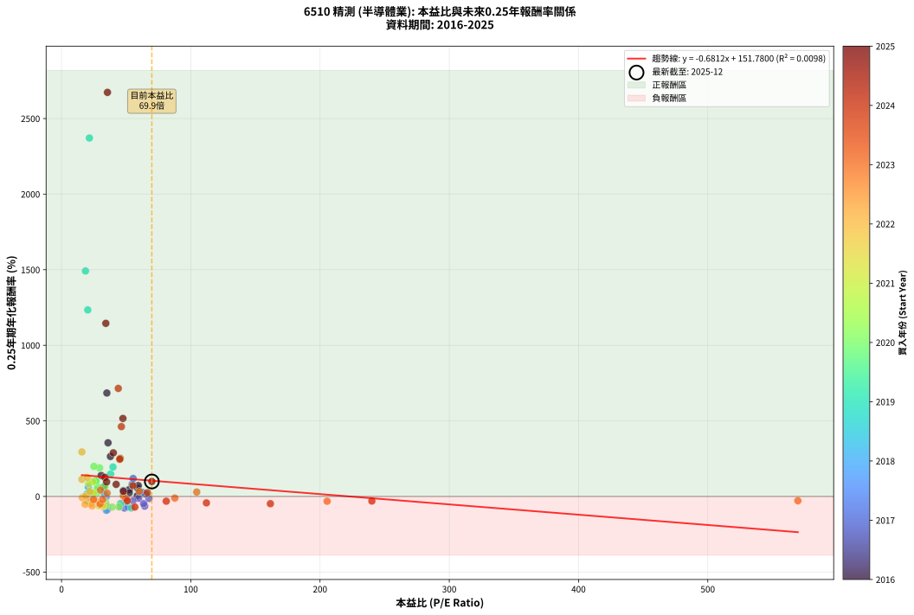
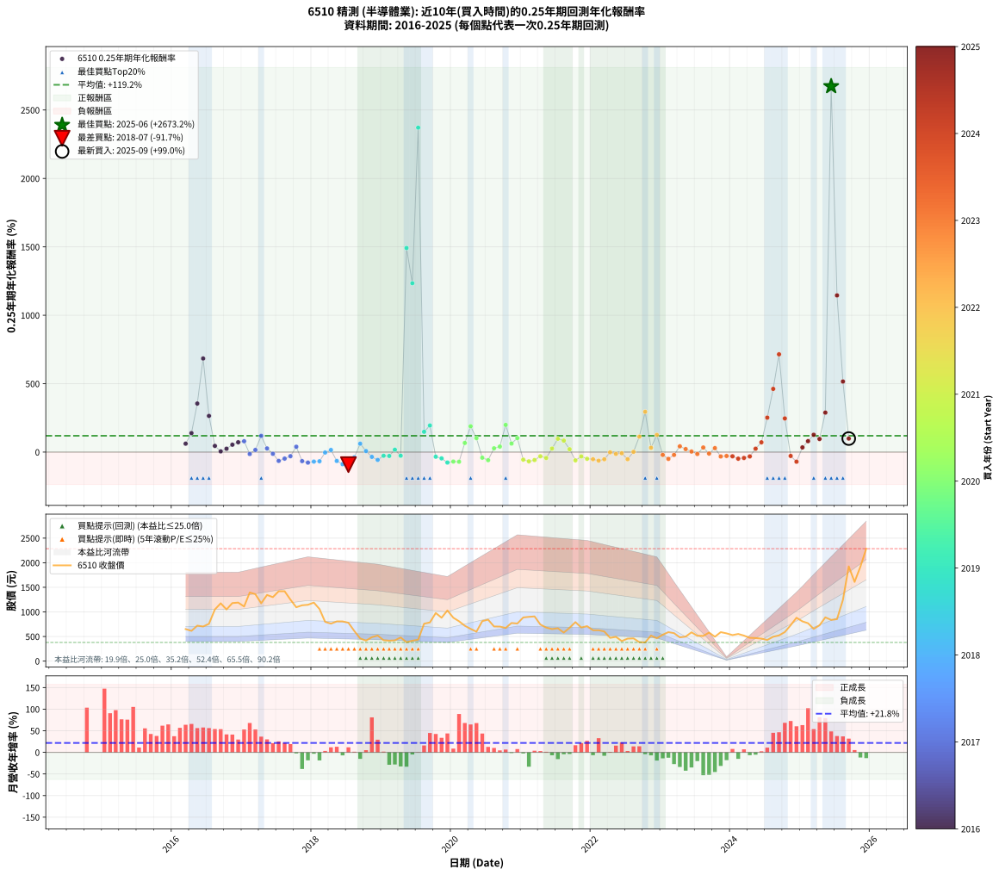

# 6510 精測 - 本益比與未來報酬率分析

!!! info "報告資訊"
    - **股票代號**: 6510
    - **公司名稱**: 精測
    - **產業別**: 半導體業
    - **分析期間**: 2016-2025 (115 個數據點)
    - **資料來源**: Type 12 (ShowMonthlyK_ChartFlow) 月收盤價與本益比
    - **報酬率口徑**: 含現金股利 (簡化: 年度合計，假設每年7/1入帳)
    - **報告生成時間**: 2025-12-23 12:34:44 CST

## 📈 視覺化圖表

### 圖表1: 本益比 vs 未來報酬率關係

*圖表1：6510 精測 本益比與0.25年期未來報酬率關係 (2016-2025)*

### 圖表2: 歷年買入時點的0.25年期實際報酬率

*圖表2：6510 精測 歷年買入時點的0.25年期實際報酬率 (2016-2025)*

## 📍 買點訊號說明

本報告提供兩種買點提示訊號（顯示於圖表2的股價子圖中）：

### ▲ 小綠色三角形（回測驗證）
- **計算方式**: 使用全部歷史資料計算本益比第25百分位數
- **用途**: 事後驗證，顯示歷史上哪些時點確實為低估區
- **限制**: 當下無法判斷，僅供回測參考
- **特性**: 後見之明（Look-Ahead Bias）

### ▲ 小橘色三角形（即時訊號）
- **計算方式**: 使用截至當月的過去5年資料計算本益比第25百分位數
- **用途**: 實際投資決策，當時即可判斷
- **優勢**: 可操作性強，符合實務需求
- **特性**: 無後見之明，滾動窗口計算

!!! tip "如何使用兩種訊號"
    - **綠色▲** 幫助理解歷史估值機會，驗證策略有效性
    - **橘色▲** 可作為實際買進參考，但仍需搭配基本面分析
    - 兩種訊號重疊時，表示即時判斷與事後驗證一致，信心度較高
    - 僅有綠色▲時，表示當時無法判斷（需要未來資料才能確認）
    - 僅有橘色▲時，表示即時判斷為買點，但事後可能不是最佳時機

## 📊 估值分析摘要

| 指標 | 數值 |
|:---:|:---:|
| **目前本益比** (2025-09) | **69.87 倍** |
| **歷史平均本益比** | 47.80 倍 |
| **估值水準** | 🔴 相對高估 |
| **預期0.25年年化報酬率** | **+100.52%** |
| **歷史平均報酬率** | +115.69% |
| **相關係數 (R²)** | 0.0100 |
| **趨勢線斜率** | -0.6874 |

!!! abstract "核心洞察"
    目前本益比顯著高於歷史平均，預期未來報酬率可能較低

    根據歷史數據回測，6510 精測 在目前本益比 **69.9倍** 的估值水準下，
    預期未來0.25年年化報酬率約為 **+100.5%**。

    **重要提醒**: 本分析基於歷史數據統計，實際報酬率會受到公司基本面變化、產業趨勢、
    總體經濟環境等多重因素影響。R² = 0.01 表示本益比可解釋約 1.0% 的報酬率變異。

## 📈 歷史估值統計

### 最佳買點 (最高報酬率)

| 項目 | 數值 |
|:---:|:---:|
| 起始時間 | 2025-06 |
| 當時本益比 | 35.54 倍 |
| 起始價格 | 837.0 元 |
| 0.25年後價格 | 1925.0 元 |
| **0.25年年化報酬率** | **+2673.20%** |

### 最差買點 (最低報酬率)

| 項目 | 數值 |
|:---:|:---:|
| 起始時間 | 2018-07 |
| 當時本益比 | 34.61 倍 |
| 起始價格 | 780.0 元 |
| 0.25年後價格 | 417.0 元 |
| **0.25年年化報酬率** | **-91.68%** |

## 🎯 投資啟示

### 本益比與報酬率關係

趨勢線方程式: **y = -0.6874x + 148.5477**

!!! warning "強負相關"
    本益比與未來報酬率呈現強負相關。在高本益比時期買入，未來報酬率顯著較低；
    在低本益比時期買入，未來報酬率顯著較高。**估值紀律至關重要**。

### 估值區間建議

基於歷史數據分析:

- **🟢 低估區** (P/E < 38.2): 預期報酬率較高，可考慮增加持股
- **🟡 合理區** (P/E 38.2-57.4): 預期報酬率符合長期趨勢，正常持有
- **🔴 高估區** (P/E > 57.4): 預期報酬率較低，可考慮減碼或觀望

!!! danger "風險提示"
    - 過去表現不代表未來結果
    - 本分析假設公司基本面無重大結構性變化
    - 產業環境劇變可能使歷史規律失效
    - 應結合公司財報、產業趨勢、總體經濟等多重因素綜合判斷

!!! success "長期投資觀點"
    歷史數據顯示，在合理或低估的估值水準買入並長期持有，
    往往能獲得較佳的投資報酬。**耐心等待好價格**是價值投資的核心原則。

## 📊 數據品質

- **資料來源**: GoodInfo.tw Type 12 (ShowMonthlyK_ChartFlow)
- **資料頻率**: 月度收盤價與本益比
- **回測期間**: 2016-2025
- **數據點數量**: 115 個 (每個點代表一次0.25年期回測)

### 計算方法說明

1. **0.25年期年化報酬率**:
   - 對每個歷史時點，計算其後0.25年的實際投資報酬率
   - 期末價值(不含股利): 期末價格
   - 期末價值(含現金股利): 期末價格 + 持有期間內的現金股利合計 (簡化: 年度合計，假設每年7/1入帳)
   - 公式: 年化報酬率 = [(期末價值/期初價格)^(1/年數) - 1] × 100%

2. **本益比 (P/E Ratio)**:
   - 使用當時的月收盤價與EPS計算
   - 資料來源: Type 12 月度河流圖本益比數據

3. **趨勢線 (Linear Regression)**:
   - 使用最小平方法擬合線性趨勢線
   - R²值衡量本益比對報酬率的解釋能力

---

*本報告由 Stock Analysis System v1.9.0 自動生成*
*數據更新時間: 2025-12-23 12:34:44 CST*

## 📋 月度回測明細表

（每一列對應時間線圖中的一個買入點；可用來對照 SVG 圖上的每個點。）

| 買入月份 | 賣出月份 | 回測期限_年 | 實際持有年數 | 買入本益比_倍 | 買入收盤價_元 | 賣出收盤價_元 | 現金股利合計_元 | 總報酬率_pct | 年化報酬率_pct |
| --- | --- | --- | --- | --- | --- | --- | --- | --- | --- |
| 2016-03 | 2016-07 | 0.25 | 0.334 | 32.49 | 651.00 | 758.00 | 6.00 | +17.36 | +61.48 |
| 2016-04 | 2016-07 | 0.25 | 0.249 | 30.69 | 615.00 | 758.00 | 6.00 | +24.23 | +138.87 |
| 2016-05 | 2016-08 | 0.25 | 0.252 | 35.98 | 721.00 | 1050.00 | 6.00 | +46.46 | +354.95 |
| 2016-06 | 2016-09 | 0.25 | 0.252 | 35.08 | 703.00 | 1175.00 | 6.00 | +67.99 | +684.23 |
| 2016-07 | 2016-10 | 0.25 | 0.252 | 37.82 | 758.00 | 1050.00 | 0.00 | +38.52 | +264.63 |
| 2016-08 | 2016-12 | 0.25 | 0.334 | 52.40 | 1050.00 | 1190.00 | 0.00 | +13.33 | +45.46 |
| 2016-09 | 2016-12 | 0.25 | 0.249 | 58.63 | 1175.00 | 1190.00 | 0.00 | +1.28 | +5.22 |
| 2016-10 | 2017-01 | 0.25 | 0.252 | 52.40 | 1050.00 | 1110.00 | 0.00 | +5.71 | +24.68 |
| 2016-11 | 2017-03 | 0.25 | 0.329 | 58.88 | 1180.00 | 1360.00 | 0.00 | +15.25 | +54.05 |
| 2016-12 | 2017-03 | 0.25 | 0.246 | 59.38 | 1190.00 | 1360.00 | 0.00 | +14.29 | +71.93 |
| 2017-01 | 2017-05 | 0.25 | 0.329 | 54.60 | 1110.00 | 1345.00 | 0.00 | +21.17 | +79.41 |
| 2017-02 | 2017-05 | 0.25 | 0.246 | 67.66 | 1395.00 | 1345.00 | 0.00 | -3.58 | -13.77 |
| 2017-03 | 2017-07 | 0.25 | 0.334 | 65.05 | 1360.00 | 1420.00 | 8.00 | +5.00 | +15.73 |
| 2017-04 | 2017-07 | 0.25 | 0.249 | 55.43 | 1175.00 | 1420.00 | 8.00 | +21.53 | +118.74 |
| 2017-05 | 2017-08 | 0.25 | 0.252 | 62.60 | 1345.00 | 1420.00 | 8.00 | +6.17 | +26.84 |
| 2017-06 | 2017-09 | 0.25 | 0.252 | 59.70 | 1300.00 | 1250.00 | 8.00 | -3.23 | -12.22 |
| 2017-07 | 2017-10 | 0.25 | 0.252 | 64.36 | 1420.00 | 1095.00 | 0.00 | -22.89 | -64.36 |
| 2017-08 | 2017-12 | 0.25 | 0.334 | 63.53 | 1420.00 | 1145.00 | 0.00 | -19.37 | -47.50 |
| 2017-09 | 2017-12 | 0.25 | 0.249 | 55.21 | 1250.00 | 1145.00 | 0.00 | -8.40 | -29.68 |
| 2017-10 | 2018-01 | 0.25 | 0.252 | 47.75 | 1095.00 | 1190.00 | 0.00 | +8.68 | +39.14 |
| 2017-11 | 2018-03 | 0.25 | 0.329 | 48.88 | 1135.00 | 798.00 | 0.00 | -29.69 | -65.78 |
| 2017-12 | 2018-03 | 0.25 | 0.246 | 48.70 | 1145.00 | 798.00 | 0.00 | -30.31 | -76.90 |
| 2018-01 | 2018-05 | 0.25 | 0.329 | 50.92 | 1190.00 | 807.00 | 0.00 | -32.18 | -69.34 |
| 2018-02 | 2018-05 | 0.25 | 0.246 | 45.63 | 1060.00 | 807.00 | 0.00 | -23.87 | -66.94 |
| 2018-03 | 2018-07 | 0.25 | 0.334 | 34.56 | 798.00 | 780.00 | 10.00 | -1.00 | -2.97 |
| 2018-04 | 2018-07 | 0.25 | 0.249 | 33.20 | 762.00 | 780.00 | 10.00 | +3.67 | +15.59 |
| 2018-05 | 2018-08 | 0.25 | 0.252 | 35.37 | 807.00 | 611.00 | 10.00 | -23.05 | -64.66 |
| 2018-06 | 2018-09 | 0.25 | 0.252 | 35.59 | 807.00 | 461.50 | 10.00 | -41.57 | -88.16 |
| 2018-07 | 2018-10 | 0.25 | 0.252 | 34.61 | 780.00 | 417.00 | 0.00 | -46.54 | -91.68 |
| 2018-08 | 2018-12 | 0.25 | 0.334 | 27.28 | 611.00 | 520.00 | 0.00 | -14.89 | -38.30 |
| 2018-09 | 2018-12 | 0.25 | 0.249 | 20.73 | 461.50 | 520.00 | 0.00 | +12.68 | +61.45 |
| 2018-10 | 2019-01 | 0.25 | 0.252 | 18.85 | 417.00 | 425.00 | 0.00 | +1.92 | +7.84 |
| 2018-11 | 2019-03 | 0.25 | 0.329 | 22.11 | 486.00 | 422.50 | 0.00 | -13.07 | -34.70 |
| 2018-12 | 2019-03 | 0.25 | 0.246 | 23.81 | 520.00 | 422.50 | 0.00 | -18.75 | -56.94 |
| 2019-01 | 2019-05 | 0.25 | 0.329 | 19.67 | 425.00 | 383.50 | 0.00 | -9.76 | -26.86 |
| 2019-02 | 2019-05 | 0.25 | 0.246 | 19.46 | 416.00 | 383.50 | 0.00 | -7.81 | -28.12 |
| 2019-03 | 2019-07 | 0.25 | 0.334 | 19.98 | 422.50 | 436.00 | 10.00 | +5.56 | +17.59 |
| 2019-04 | 2019-07 | 0.25 | 0.249 | 23.02 | 481.50 | 436.00 | 10.00 | -7.37 | -26.46 |
| 2019-05 | 2019-08 | 0.25 | 0.252 | 18.54 | 383.50 | 760.00 | 10.00 | +100.78 | +1491.67 |
| 2019-06 | 2019-09 | 0.25 | 0.252 | 20.29 | 415.00 | 787.00 | 10.00 | +92.05 | +1234.04 |
| 2019-07 | 2019-10 | 0.25 | 0.252 | 21.56 | 436.00 | 978.00 | 0.00 | +124.31 | +2371.28 |
| 2019-08 | 2019-12 | 0.25 | 0.334 | 38.01 | 760.00 | 1030.00 | 0.00 | +35.53 | +148.46 |
| 2019-09 | 2019-12 | 0.25 | 0.249 | 39.82 | 787.00 | 1030.00 | 0.00 | +30.88 | +194.48 |
| 2019-10 | 2020-01 | 0.25 | 0.252 | 50.07 | 978.00 | 882.00 | 0.00 | -9.82 | -33.65 |
| 2019-11 | 2020-03 | 0.25 | 0.331 | 45.70 | 882.00 | 719.00 | 0.00 | -18.48 | -46.03 |
| 2019-12 | 2020-03 | 0.25 | 0.249 | 54.01 | 1030.00 | 719.00 | 0.00 | -30.19 | -76.37 |
| 2020-01 | 2020-05 | 0.25 | 0.331 | 44.42 | 882.00 | 598.00 | 0.00 | -32.20 | -69.06 |
| 2020-02 | 2020-05 | 0.25 | 0.249 | 39.25 | 810.00 | 598.00 | 0.00 | -26.17 | -70.42 |
| 2020-03 | 2020-07 | 0.25 | 0.334 | 33.56 | 719.00 | 843.00 | 10.00 | +18.64 | +66.80 |
| 2020-04 | 2020-07 | 0.25 | 0.249 | 29.50 | 655.00 | 843.00 | 10.00 | +30.23 | +188.67 |
| 2020-05 | 2020-08 | 0.25 | 0.252 | 26.01 | 598.00 | 704.00 | 10.00 | +19.40 | +102.16 |
| 2020-06 | 2020-09 | 0.25 | 0.252 | 34.20 | 813.00 | 702.00 | 10.00 | -12.42 | -40.94 |
| 2020-07 | 2020-10 | 0.25 | 0.252 | 34.33 | 843.00 | 674.00 | 0.00 | -20.05 | -58.86 |
| 2020-08 | 2020-12 | 0.25 | 0.334 | 27.78 | 704.00 | 764.00 | 0.00 | +8.52 | +27.74 |
| 2020-09 | 2020-12 | 0.25 | 0.249 | 26.87 | 702.00 | 764.00 | 0.00 | +8.83 | +40.45 |
| 2020-10 | 2021-01 | 0.25 | 0.252 | 25.04 | 674.00 | 888.00 | 0.00 | +31.75 | +198.84 |
| 2020-11 | 2021-03 | 0.25 | 0.329 | 27.98 | 775.00 | 909.00 | 0.00 | +17.29 | +62.49 |
| 2020-12 | 2021-03 | 0.25 | 0.246 | 26.83 | 764.00 | 909.00 | 0.00 | +18.98 | +102.43 |
| 2021-01 | 2021-05 | 0.25 | 0.329 | 31.30 | 888.00 | 682.00 | 0.00 | -23.20 | -55.22 |
| 2021-02 | 2021-05 | 0.25 | 0.246 | 31.84 | 900.00 | 682.00 | 0.00 | -24.22 | -67.56 |
| 2021-03 | 2021-07 | 0.25 | 0.334 | 32.28 | 909.00 | 668.00 | 12.00 | -25.19 | -58.06 |
| 2021-04 | 2021-07 | 0.25 | 0.249 | 26.52 | 744.00 | 668.00 | 12.00 | -8.60 | -30.30 |
| 2021-05 | 2021-08 | 0.25 | 0.252 | 24.40 | 682.00 | 580.00 | 12.00 | -13.20 | -42.99 |
| 2021-06 | 2021-09 | 0.25 | 0.252 | 23.38 | 651.00 | 678.00 | 12.00 | +5.99 | +25.98 |
| 2021-07 | 2021-10 | 0.25 | 0.252 | 24.09 | 668.00 | 793.00 | 0.00 | +18.71 | +97.59 |
| 2021-08 | 2021-12 | 0.25 | 0.334 | 20.99 | 580.00 | 711.00 | 0.00 | +22.59 | +83.98 |
| 2021-09 | 2021-12 | 0.25 | 0.249 | 24.64 | 678.00 | 711.00 | 0.00 | +4.87 | +21.02 |
| 2021-10 | 2022-01 | 0.25 | 0.252 | 28.93 | 793.00 | 628.00 | 0.00 | -20.81 | -60.39 |
| 2021-11 | 2022-03 | 0.25 | 0.329 | 25.01 | 683.00 | 603.00 | 0.00 | -11.71 | -31.56 |
| 2021-12 | 2022-03 | 0.25 | 0.246 | 26.14 | 711.00 | 603.00 | 0.00 | -15.19 | -48.76 |
| 2022-01 | 2022-05 | 0.25 | 0.329 | 23.35 | 628.00 | 493.50 | 0.00 | -21.42 | -51.98 |
| 2022-02 | 2022-05 | 0.25 | 0.246 | 23.62 | 628.00 | 493.50 | 0.00 | -21.42 | -62.40 |
| 2022-03 | 2022-07 | 0.25 | 0.334 | 22.95 | 603.00 | 457.00 | 13.60 | -21.96 | -52.39 |
| 2022-04 | 2022-07 | 0.25 | 0.249 | 18.20 | 472.50 | 457.00 | 13.60 | -0.40 | -1.60 |
| 2022-05 | 2022-08 | 0.25 | 0.252 | 19.23 | 493.50 | 462.50 | 13.60 | -3.53 | -13.28 |
| 2022-06 | 2022-09 | 0.25 | 0.252 | 16.09 | 408.00 | 385.50 | 13.60 | -2.18 | -8.38 |
| 2022-07 | 2022-10 | 0.25 | 0.252 | 18.25 | 457.00 | 380.00 | 0.00 | -16.85 | -51.93 |
| 2022-08 | 2022-12 | 0.25 | 0.334 | 18.70 | 462.50 | 465.50 | 0.00 | +0.65 | +1.95 |
| 2022-09 | 2022-12 | 0.25 | 0.249 | 15.78 | 385.50 | 465.50 | 0.00 | +20.75 | +113.16 |
| 2022-10 | 2023-01 | 0.25 | 0.252 | 15.76 | 380.00 | 537.00 | 0.00 | +41.32 | +294.71 |
| 2022-11 | 2023-03 | 0.25 | 0.329 | 21.84 | 520.00 | 569.00 | 0.00 | +9.42 | +31.53 |
| 2022-12 | 2023-03 | 0.25 | 0.246 | 19.81 | 465.50 | 569.00 | 0.00 | +22.23 | +125.87 |
| 2023-01 | 2023-05 | 0.25 | 0.329 | 24.83 | 537.00 | 498.00 | 0.00 | -7.26 | -20.51 |
| 2023-02 | 2023-05 | 0.25 | 0.246 | 29.83 | 589.00 | 498.00 | 0.00 | -15.45 | -49.39 |
| 2023-03 | 2023-07 | 0.25 | 0.334 | 31.84 | 569.00 | 515.00 | 11.75 | -7.43 | -20.63 |
| 2023-04 | 2023-07 | 0.25 | 0.249 | 30.16 | 482.50 | 515.00 | 11.75 | +9.17 | +42.22 |
| 2023-05 | 2023-08 | 0.25 | 0.252 | 35.27 | 498.00 | 512.00 | 11.75 | +5.17 | +22.16 |
| 2023-06 | 2023-09 | 0.25 | 0.252 | 47.86 | 586.00 | 580.00 | 11.75 | +0.98 | +3.95 |
| 2023-07 | 2023-10 | 0.25 | 0.252 | 49.67 | 515.00 | 496.00 | 0.00 | -3.69 | -13.86 |
| 2023-08 | 2023-12 | 0.25 | 0.334 | 60.28 | 512.00 | 564.00 | 0.00 | +10.16 | +33.59 |
| 2023-09 | 2023-12 | 0.25 | 0.249 | 87.65 | 580.00 | 564.00 | 0.00 | -2.76 | -10.62 |
| 2023-10 | 2024-01 | 0.25 | 0.252 | 104.60 | 496.00 | 529.00 | 0.00 | +6.65 | +29.14 |
| 2023-11 | 2024-03 | 0.25 | 0.331 | 205.50 | 589.00 | 519.00 | 0.00 | -11.88 | -31.75 |
| 2023-12 | 2024-03 | 0.25 | 0.249 | 569.70 | 564.00 | 519.00 | 0.00 | -7.98 | -28.38 |
| 2024-01 | 2024-05 | 0.25 | 0.331 | 240.10 | 529.00 | 469.00 | 0.00 | -11.34 | -30.47 |
| 2024-02 | 2024-05 | 0.25 | 0.249 | 161.60 | 552.00 | 469.00 | 0.00 | -15.04 | -48.00 |
| 2024-03 | 2024-07 | 0.25 | 0.334 | 112.10 | 519.00 | 430.50 | 0.50 | -16.96 | -42.66 |
| 2024-04 | 2024-07 | 0.25 | 0.249 | 81.03 | 473.50 | 430.50 | 0.50 | -8.98 | -31.44 |
| 2024-05 | 2024-08 | 0.25 | 0.252 | 66.46 | 469.00 | 495.50 | 0.50 | +5.76 | +24.88 |
| 2024-06 | 2024-09 | 0.25 | 0.252 | 55.26 | 457.00 | 523.00 | 0.50 | +14.55 | +71.49 |
| 2024-07 | 2024-10 | 0.25 | 0.252 | 45.40 | 430.50 | 591.00 | 0.00 | +37.28 | +251.84 |
| 2024-08 | 2024-12 | 0.25 | 0.334 | 46.32 | 495.50 | 882.00 | 0.00 | +78.00 | +462.00 |
| 2024-09 | 2024-12 | 0.25 | 0.249 | 43.91 | 523.00 | 882.00 | 0.00 | +68.64 | +714.68 |
| 2024-10 | 2025-01 | 0.25 | 0.252 | 45.03 | 591.00 | 808.00 | 0.00 | +36.72 | +246.13 |
| 2024-11 | 2025-03 | 0.25 | 0.329 | 50.92 | 730.00 | 655.00 | 0.00 | -10.27 | -28.11 |
| 2024-12 | 2025-03 | 0.25 | 0.246 | 56.72 | 882.00 | 655.00 | 0.00 | -25.74 | -70.11 |
| 2025-01 | 2025-05 | 0.25 | 0.329 | 47.86 | 808.00 | 890.00 | 0.00 | +10.15 | +34.21 |
| 2025-02 | 2025-05 | 0.25 | 0.246 | 42.27 | 770.00 | 890.00 | 0.00 | +15.58 | +80.00 |
| 2025-03 | 2025-07 | 0.25 | 0.334 | 33.50 | 655.00 | 853.00 | 7.80 | +31.42 | +126.60 |
| 2025-04 | 2025-07 | 0.25 | 0.249 | 34.86 | 728.00 | 853.00 | 7.80 | +18.24 | +95.92 |
| 2025-05 | 2025-08 | 0.25 | 0.252 | 40.06 | 890.00 | 1245.00 | 7.80 | +40.76 | +288.62 |
| 2025-06 | 2025-09 | 0.25 | 0.252 | 35.54 | 837.00 | 1925.00 | 7.80 | +130.92 | +2673.20 |
| 2025-07 | 2025-10 | 0.25 | 0.252 | 34.28 | 853.00 | 1610.00 | 0.00 | +88.75 | +1145.26 |
| 2025-08 | 2025-12 | 0.25 | 0.334 | 47.49 | 1245.00 | 1845.00 | 0.00 | +48.19 | +224.66 |
| 2025-09 | 2025-12 | 0.25 | 0.249 | 69.87 | 1925.00 | 1845.00 | 0.00 | -4.16 | -15.66 |
