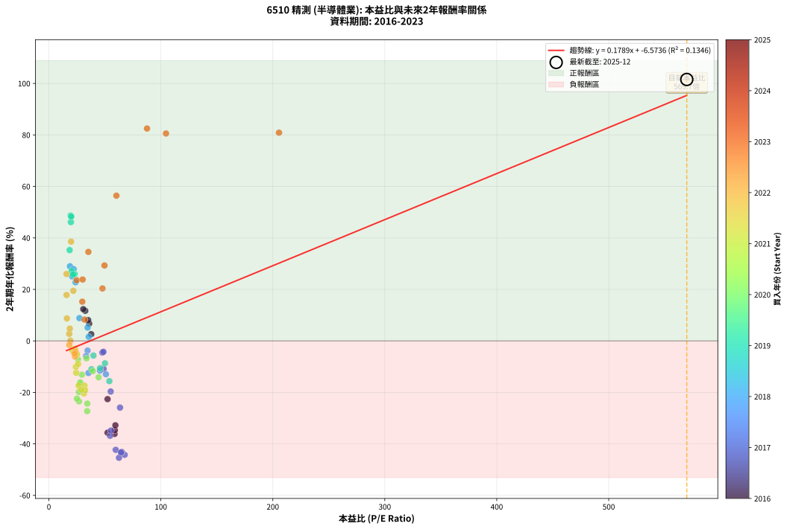
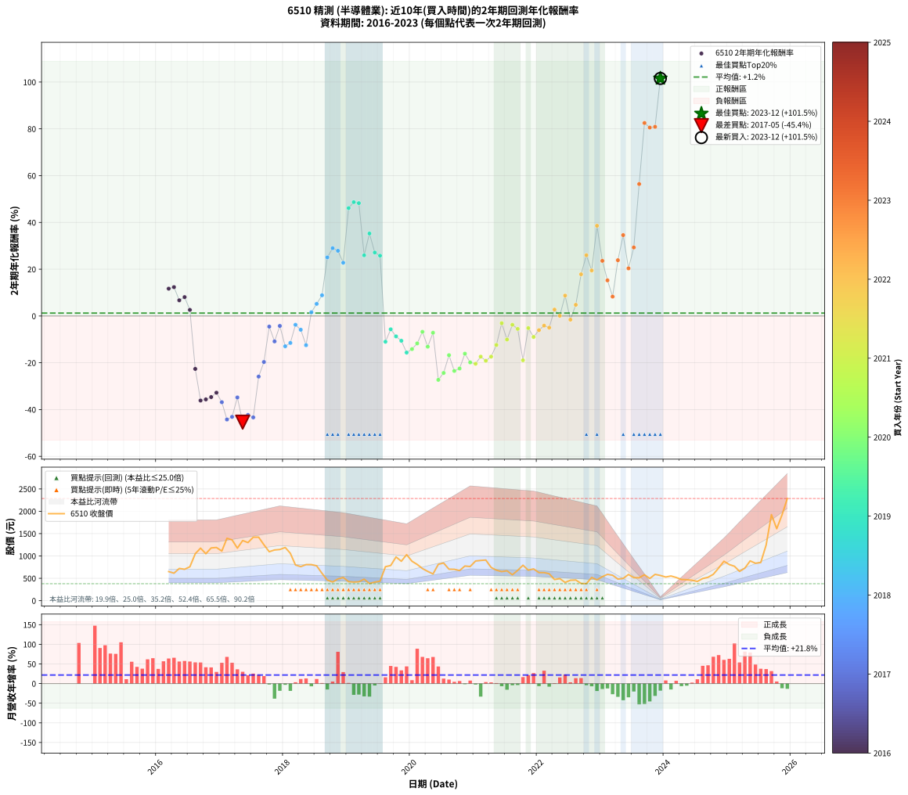

# 6510 精測 - 本益比與未來報酬率分析

!!! info "報告資訊"
    - **股票代號**: 6510
    - **公司名稱**: 精測
    - **產業別**: 半導體業
    - **分析期間**: 2016-2023 (94 個數據點)
    - **資料來源**: Type 12 (ShowMonthlyK_ChartFlow) 月收盤價與本益比
    - **報酬率口徑**: 含現金股利 (簡化: 年度合計，假設每年7/1入帳)
    - **報告生成時間**: 2026-01-06 19:10:51 CST

## 📈 視覺化圖表

### 圖表1: 本益比 vs 未來報酬率關係

*圖表1：6510 精測 本益比與2年期未來報酬率關係 (2016-2023)*

### 圖表2: 歷年買入時點的2年期實際報酬率

*圖表2：6510 精測 歷年買入時點的2年期實際報酬率 (2016-2023)*

## 📍 買點訊號說明

本報告提供兩種買點提示訊號（顯示於圖表2的股價子圖中）：

### ▲ 小綠色三角形（回測驗證）
- **計算方式**: 使用全部歷史資料計算本益比第25百分位數
- **用途**: 事後驗證，顯示歷史上哪些時點確實為低估區
- **限制**: 當下無法判斷，僅供回測參考
- **特性**: 後見之明（Look-Ahead Bias）

### ▲ 小橘色三角形（即時訊號）
- **計算方式**: 使用截至當月的過去5年資料計算本益比第25百分位數
- **用途**: 實際投資決策，當時即可判斷
- **優勢**: 可操作性強，符合實務需求
- **特性**: 無後見之明，滾動窗口計算

!!! tip "如何使用兩種訊號"
    - **綠色▲** 幫助理解歷史估值機會，驗證策略有效性
    - **橘色▲** 可作為實際買進參考，但仍需搭配基本面分析
    - 兩種訊號重疊時，表示即時判斷與事後驗證一致，信心度較高
    - 僅有綠色▲時，表示當時無法判斷（需要未來資料才能確認）
    - 僅有橘色▲時，表示即時判斷為買點，但事後可能不是最佳時機

## 📊 估值分析摘要

| 指標 | 數值 |
|:---:|:---:|
| **目前本益比** (2023-12) | **569.70 倍** |
| **歷史平均本益比** | 43.68 倍 |
| **估值水準** | 🔴 相對高估 |
| **預期2年年化報酬率** | **+95.36%** |
| **歷史平均報酬率** | +1.24% |
| **相關係數 (R²)** | 0.1346 |
| **趨勢線斜率** | 0.1789 |

!!! abstract "核心洞察"
    目前本益比顯著高於歷史平均，預期未來報酬率可能較低

    根據歷史數據回測，6510 精測 在目前本益比 **569.7倍** 的估值水準下，
    預期未來2年年化報酬率約為 **+95.4%**。

    **重要提醒**: 本分析基於歷史數據統計，實際報酬率會受到公司基本面變化、產業趨勢、
    總體經濟環境等多重因素影響。R² = 0.13 表示本益比可解釋約 13.5% 的報酬率變異。

## 📈 歷史估值統計

### 最佳買點 (最高報酬率)

| 項目 | 數值 |
|:---:|:---:|
| 起始時間 | 2023-12 |
| 當時本益比 | 569.70 倍 |
| 起始價格 | 564.0 元 |
| 2年後價格 | 2285.0 元 |
| **2年年化報酬率** | **+101.55%** |

### 最差買點 (最低報酬率)

| 項目 | 數值 |
|:---:|:---:|
| 起始時間 | 2017-05 |
| 當時本益比 | 62.60 倍 |
| 起始價格 | 1345.0 元 |
| 2年後價格 | 383.5 元 |
| **2年年化報酬率** | **-45.39%** |

## 🎯 投資啟示

### 本益比與報酬率關係

趨勢線方程式: **y = 0.1789x + -6.5736**

!!! info "弱相關或正相關"
    本益比與未來報酬率相關性較弱。這可能表示該股票的報酬率更多受到
    公司成長性、產業趨勢等因素影響，而非估值水準。**需綜合考量多項指標**。

### 估值區間建議

基於歷史數據分析:

- **🟢 低估區** (P/E < 34.9): 預期報酬率較高，可考慮增加持股
- **🟡 合理區** (P/E 34.9-52.4): 預期報酬率符合長期趨勢，正常持有
- **🔴 高估區** (P/E > 52.4): 預期報酬率較低，可考慮減碼或觀望

!!! danger "風險提示"
    - 過去表現不代表未來結果
    - 本分析假設公司基本面無重大結構性變化
    - 產業環境劇變可能使歷史規律失效
    - 應結合公司財報、產業趨勢、總體經濟等多重因素綜合判斷

!!! success "長期投資觀點"
    歷史數據顯示，在合理或低估的估值水準買入並長期持有，
    往往能獲得較佳的投資報酬。**耐心等待好價格**是價值投資的核心原則。

## 📊 數據品質

- **資料來源**: GoodInfo.tw Type 12 (ShowMonthlyK_ChartFlow)
- **資料頻率**: 月度收盤價與本益比
- **回測期間**: 2016-2023
- **數據點數量**: 94 個 (每個點代表一次2年期回測)

### 計算方法說明

1. **2年期年化報酬率**:
   - 對每個歷史時點，計算其後2年的實際投資報酬率
   - 期末價值(不含股利): 期末價格
   - 期末價值(含現金股利): 期末價格 + 持有期間內的現金股利合計 (簡化: 年度合計，假設每年7/1入帳)
   - 公式: 年化報酬率 = [(期末價值/期初價格)^(1/年數) - 1] × 100%

2. **本益比 (P/E Ratio)**:
   - 使用當時的月收盤價與EPS計算
   - 資料來源: Type 12 月度河流圖本益比數據

3. **趨勢線 (Linear Regression)**:
   - 使用最小平方法擬合線性趨勢線
   - R²值衡量本益比對報酬率的解釋能力

---

*本報告由 Stock Analysis System v1.9.0 自動生成*
*數據更新時間: 2026-01-06 19:10:51 CST*

## 📋 月度回測明細表

（每一列對應時間線圖中的一個買入點；可用來對照 SVG 圖上的每個點。）

| 買入月份 | 賣出月份 | 回測期限_年 | 實際持有年數 | 買入本益比_倍 | 買入收盤價_元 | 賣出收盤價_元 | 現金股利合計_元 | 總報酬率_pct | 年化報酬率_pct |
| --- | --- | --- | --- | --- | --- | --- | --- | --- | --- |
| 2016-03 | 2018-03 | 2 | 1.999 | 32.49 | 651.00 | 798.00 | 14.00 | +24.73 | +11.69 |
| 2016-04 | 2018-04 | 2 | 1.999 | 30.69 | 615.00 | 762.00 | 14.00 | +26.18 | +12.34 |
| 2016-05 | 2018-05 | 2 | 1.999 | 35.98 | 721.00 | 807.00 | 14.00 | +13.87 | +6.71 |
| 2016-06 | 2018-06 | 2 | 1.999 | 35.08 | 703.00 | 807.00 | 14.00 | +16.79 | +8.07 |
| 2016-07 | 2018-07 | 2 | 1.999 | 37.82 | 758.00 | 780.00 | 18.00 | +5.28 | +2.61 |
| 2016-08 | 2018-08 | 2 | 1.999 | 52.40 | 1050.00 | 611.00 | 18.00 | -40.10 | -22.62 |
| 2016-09 | 2018-09 | 2 | 1.999 | 58.63 | 1175.00 | 461.50 | 18.00 | -59.19 | -36.14 |
| 2016-10 | 2018-10 | 2 | 1.999 | 52.40 | 1050.00 | 417.00 | 18.00 | -58.57 | -35.65 |
| 2016-11 | 2018-11 | 2 | 1.999 | 58.88 | 1180.00 | 486.00 | 18.00 | -57.29 | -34.66 |
| 2016-12 | 2018-12 | 2 | 1.999 | 59.38 | 1190.00 | 520.00 | 18.00 | -54.79 | -32.78 |
| 2017-01 | 2019-01 | 2 | 1.999 | 54.60 | 1110.00 | 425.00 | 18.00 | -60.09 | -36.85 |
| 2017-02 | 2019-02 | 2 | 1.999 | 67.66 | 1395.00 | 416.00 | 18.00 | -68.89 | -44.24 |
| 2017-03 | 2019-03 | 2 | 1.999 | 65.05 | 1360.00 | 422.50 | 18.00 | -67.61 | -43.11 |
| 2017-04 | 2019-04 | 2 | 1.999 | 55.43 | 1175.00 | 481.50 | 18.00 | -57.49 | -34.82 |
| 2017-05 | 2019-05 | 2 | 1.999 | 62.60 | 1345.00 | 383.50 | 18.00 | -70.15 | -45.39 |
| 2017-06 | 2019-06 | 2 | 1.999 | 59.70 | 1300.00 | 415.00 | 18.00 | -66.69 | -42.31 |
| 2017-07 | 2019-07 | 2 | 1.999 | 64.36 | 1420.00 | 436.00 | 20.00 | -67.89 | -43.35 |
| 2017-08 | 2019-08 | 2 | 1.999 | 63.53 | 1420.00 | 760.00 | 20.00 | -45.07 | -25.90 |
| 2017-09 | 2019-09 | 2 | 1.999 | 55.21 | 1250.00 | 787.00 | 20.00 | -35.44 | -19.66 |
| 2017-10 | 2019-10 | 2 | 1.999 | 47.75 | 1095.00 | 978.00 | 20.00 | -8.86 | -4.53 |
| 2017-11 | 2019-11 | 2 | 1.999 | 48.88 | 1135.00 | 882.00 | 20.00 | -20.53 | -10.86 |
| 2017-12 | 2019-12 | 2 | 1.999 | 48.70 | 1145.00 | 1030.00 | 20.00 | -8.30 | -4.24 |
| 2018-01 | 2020-01 | 2 | 1.999 | 50.92 | 1190.00 | 882.00 | 20.00 | -24.20 | -12.95 |
| 2018-02 | 2020-02 | 2 | 1.999 | 45.63 | 1060.00 | 810.00 | 20.00 | -21.70 | -11.52 |
| 2018-03 | 2020-03 | 2 | 2.001 | 34.56 | 798.00 | 719.00 | 20.00 | -7.39 | -3.77 |
| 2018-04 | 2020-04 | 2 | 2.001 | 33.20 | 762.00 | 655.00 | 20.00 | -11.42 | -5.88 |
| 2018-05 | 2020-05 | 2 | 2.001 | 35.37 | 807.00 | 598.00 | 20.00 | -23.42 | -12.48 |
| 2018-06 | 2020-06 | 2 | 2.001 | 35.59 | 807.00 | 813.00 | 20.00 | +3.22 | +1.60 |
| 2018-07 | 2020-07 | 2 | 2.001 | 34.61 | 780.00 | 843.00 | 20.00 | +10.64 | +5.18 |
| 2018-08 | 2020-08 | 2 | 2.001 | 27.28 | 611.00 | 704.00 | 20.00 | +18.49 | +8.85 |
| 2018-09 | 2020-09 | 2 | 2.001 | 20.73 | 461.50 | 702.00 | 20.00 | +56.45 | +25.06 |
| 2018-10 | 2020-10 | 2 | 2.001 | 18.85 | 417.00 | 674.00 | 20.00 | +66.43 | +28.98 |
| 2018-11 | 2020-11 | 2 | 2.001 | 22.11 | 486.00 | 775.00 | 20.00 | +63.58 | +27.88 |
| 2018-12 | 2020-12 | 2 | 2.001 | 23.81 | 520.00 | 764.00 | 20.00 | +50.77 | +22.77 |
| 2019-01 | 2021-01 | 2 | 2.001 | 19.67 | 425.00 | 888.00 | 20.00 | +113.65 | +46.13 |
| 2019-02 | 2021-02 | 2 | 2.001 | 19.46 | 416.00 | 900.00 | 20.00 | +121.15 | +48.67 |
| 2019-03 | 2021-03 | 2 | 2.001 | 19.98 | 422.50 | 909.00 | 20.00 | +119.88 | +48.24 |
| 2019-04 | 2021-04 | 2 | 2.001 | 23.02 | 481.50 | 744.00 | 20.00 | +58.67 | +25.94 |
| 2019-05 | 2021-05 | 2 | 2.001 | 18.54 | 383.50 | 682.00 | 20.00 | +83.05 | +35.27 |
| 2019-06 | 2021-06 | 2 | 2.001 | 20.29 | 415.00 | 651.00 | 20.00 | +61.69 | +27.14 |
| 2019-07 | 2021-07 | 2 | 2.001 | 21.56 | 436.00 | 668.00 | 22.00 | +58.26 | +25.78 |
| 2019-08 | 2021-08 | 2 | 2.001 | 38.01 | 760.00 | 580.00 | 22.00 | -20.79 | -10.99 |
| 2019-09 | 2021-09 | 2 | 2.001 | 39.82 | 787.00 | 678.00 | 22.00 | -11.05 | -5.69 |
| 2019-10 | 2021-10 | 2 | 2.001 | 50.07 | 978.00 | 793.00 | 22.00 | -16.67 | -8.71 |
| 2019-11 | 2021-11 | 2 | 2.001 | 45.70 | 882.00 | 683.00 | 22.00 | -20.07 | -10.59 |
| 2019-12 | 2021-12 | 2 | 2.001 | 54.01 | 1030.00 | 711.00 | 22.00 | -28.83 | -15.63 |
| 2020-01 | 2022-01 | 2 | 2.001 | 44.42 | 882.00 | 628.00 | 22.00 | -26.30 | -14.14 |
| 2020-02 | 2022-03 | 2 | 2.081 | 39.25 | 810.00 | 603.00 | 22.00 | -22.84 | -11.72 |
| 2020-03 | 2022-03 | 2 | 1.999 | 33.56 | 719.00 | 603.00 | 22.00 | -13.07 | -6.77 |
| 2020-04 | 2022-04 | 2 | 1.999 | 29.50 | 655.00 | 472.50 | 22.00 | -24.50 | -13.12 |
| 2020-05 | 2022-05 | 2 | 1.999 | 26.01 | 598.00 | 493.50 | 22.00 | -13.80 | -7.16 |
| 2020-06 | 2022-06 | 2 | 1.999 | 34.20 | 813.00 | 408.00 | 22.00 | -47.11 | -27.29 |
| 2020-07 | 2022-07 | 2 | 1.999 | 34.33 | 843.00 | 457.00 | 25.60 | -42.75 | -24.35 |
| 2020-08 | 2022-08 | 2 | 1.999 | 27.78 | 704.00 | 462.50 | 25.60 | -30.67 | -16.74 |
| 2020-09 | 2022-09 | 2 | 1.999 | 26.87 | 702.00 | 385.50 | 25.60 | -41.44 | -23.49 |
| 2020-10 | 2022-10 | 2 | 1.999 | 25.04 | 674.00 | 380.00 | 25.60 | -39.82 | -22.44 |
| 2020-11 | 2022-11 | 2 | 1.999 | 27.98 | 775.00 | 520.00 | 25.60 | -29.60 | -16.11 |
| 2020-12 | 2022-12 | 2 | 1.999 | 26.83 | 764.00 | 465.50 | 25.60 | -35.72 | -19.84 |
| 2021-01 | 2023-01 | 2 | 1.999 | 31.30 | 888.00 | 537.00 | 25.60 | -36.64 | -20.42 |
| 2021-02 | 2023-02 | 2 | 1.999 | 31.84 | 900.00 | 589.00 | 25.60 | -31.71 | -17.37 |
| 2021-03 | 2023-03 | 2 | 1.999 | 32.28 | 909.00 | 569.00 | 25.60 | -34.59 | -19.13 |
| 2021-04 | 2023-04 | 2 | 1.999 | 26.52 | 744.00 | 482.50 | 25.60 | -31.71 | -17.37 |
| 2021-05 | 2023-05 | 2 | 1.999 | 24.40 | 682.00 | 498.00 | 25.60 | -23.23 | -12.39 |
| 2021-06 | 2023-06 | 2 | 1.999 | 23.38 | 651.00 | 586.00 | 25.60 | -6.05 | -3.08 |
| 2021-07 | 2023-07 | 2 | 1.999 | 24.09 | 668.00 | 515.00 | 25.35 | -19.11 | -10.07 |
| 2021-08 | 2023-08 | 2 | 1.999 | 20.99 | 580.00 | 512.00 | 25.35 | -7.35 | -3.75 |
| 2021-09 | 2023-09 | 2 | 1.999 | 24.64 | 678.00 | 580.00 | 25.35 | -10.72 | -5.51 |
| 2021-10 | 2023-10 | 2 | 1.999 | 28.93 | 793.00 | 496.00 | 25.35 | -34.26 | -18.93 |
| 2021-11 | 2023-11 | 2 | 1.999 | 25.01 | 683.00 | 589.00 | 25.35 | -10.05 | -5.16 |
| 2021-12 | 2023-12 | 2 | 1.999 | 26.14 | 711.00 | 564.00 | 25.35 | -17.11 | -8.96 |
| 2022-01 | 2024-01 | 2 | 1.999 | 23.35 | 628.00 | 529.00 | 25.35 | -11.73 | -6.05 |
| 2022-02 | 2024-02 | 2 | 1.999 | 23.62 | 628.00 | 552.00 | 25.35 | -8.07 | -4.12 |
| 2022-03 | 2024-03 | 2 | 2.001 | 22.95 | 603.00 | 519.00 | 25.35 | -9.73 | -4.98 |
| 2022-04 | 2024-04 | 2 | 2.001 | 18.20 | 472.50 | 473.50 | 25.35 | +5.58 | +2.75 |
| 2022-05 | 2024-05 | 2 | 2.001 | 19.23 | 493.50 | 469.00 | 25.35 | +0.17 | +0.09 |
| 2022-06 | 2024-06 | 2 | 2.001 | 16.09 | 408.00 | 457.00 | 25.35 | +18.22 | +8.72 |
| 2022-07 | 2024-07 | 2 | 2.001 | 18.25 | 457.00 | 430.50 | 12.25 | -3.12 | -1.57 |
| 2022-08 | 2024-08 | 2 | 2.001 | 18.70 | 462.50 | 495.50 | 12.25 | +9.78 | +4.77 |
| 2022-09 | 2024-09 | 2 | 2.001 | 15.78 | 385.50 | 523.00 | 12.25 | +38.85 | +17.82 |
| 2022-10 | 2024-10 | 2 | 2.001 | 15.76 | 380.00 | 591.00 | 12.25 | +58.75 | +25.98 |
| 2022-11 | 2024-11 | 2 | 2.001 | 21.84 | 520.00 | 730.00 | 12.25 | +42.74 | +19.46 |
| 2022-12 | 2024-12 | 2 | 2.001 | 19.81 | 465.50 | 882.00 | 12.25 | +92.11 | +38.57 |
| 2023-01 | 2025-01 | 2 | 2.001 | 24.83 | 537.00 | 808.00 | 12.25 | +52.75 | +23.57 |
| 2023-02 | 2025-02 | 2 | 2.001 | 29.83 | 589.00 | 770.00 | 12.25 | +32.81 | +15.23 |
| 2023-03 | 2025-03 | 2 | 2.001 | 31.84 | 569.00 | 655.00 | 12.25 | +17.27 | +8.28 |
| 2023-04 | 2025-04 | 2 | 2.001 | 30.16 | 482.50 | 728.00 | 12.25 | +53.42 | +23.84 |
| 2023-05 | 2025-05 | 2 | 2.001 | 35.27 | 498.00 | 890.00 | 12.25 | +81.17 | +34.57 |
| 2023-06 | 2025-06 | 2 | 2.001 | 47.86 | 586.00 | 837.00 | 12.25 | +44.92 | +20.37 |
| 2023-07 | 2025-07 | 2 | 2.001 | 49.67 | 515.00 | 853.00 | 8.30 | +67.24 | +29.30 |
| 2023-08 | 2025-08 | 2 | 2.001 | 60.28 | 512.00 | 1245.00 | 8.30 | +144.79 | +56.41 |
| 2023-09 | 2025-09 | 2 | 2.001 | 87.65 | 580.00 | 1925.00 | 8.30 | +233.33 | +82.50 |
| 2023-10 | 2025-10 | 2 | 2.001 | 104.60 | 496.00 | 1610.00 | 8.30 | +226.27 | +80.56 |
| 2023-11 | 2025-11 | 2 | 2.001 | 205.50 | 589.00 | 1920.00 | 8.30 | +227.39 | +80.86 |
| 2023-12 | 2025-12 | 2 | 2.001 | 569.70 | 564.00 | 2285.00 | 8.30 | +306.61 | +101.55 |
