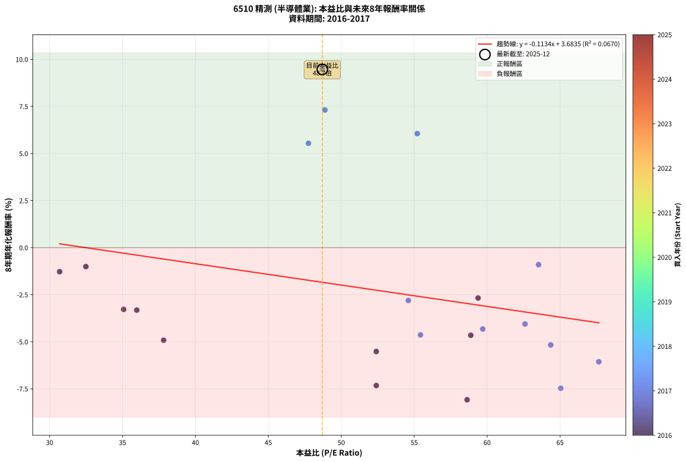
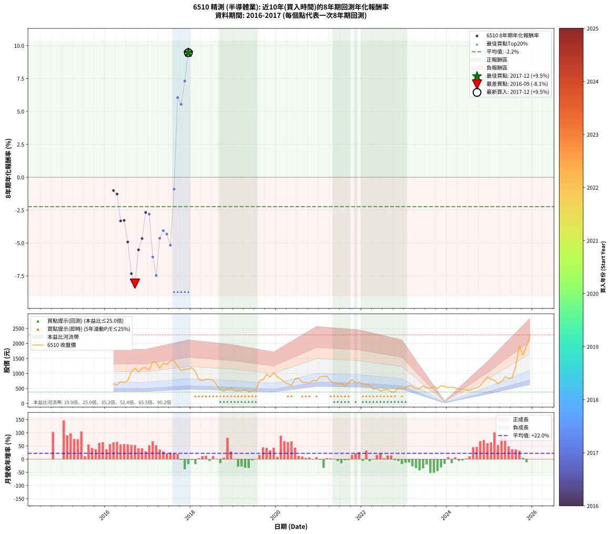

# 6510 精測 - 本益比與未來報酬率分析

!!! info "報告資訊"
    - **股票代號**: 6510
    - **公司名稱**: 精測
    - **產業別**: 半導體業
    - **分析期間**: 2016-2017 (22 個數據點)
    - **資料來源**: Type 12 (ShowMonthlyK_ChartFlow) 月收盤價與本益比
    - **報酬率口徑**: 含現金股利 (簡化: 年度合計，假設每年7/1入帳)
    - **報告生成時間**: 2026-01-10 19:10:05 CST

## 📈 視覺化圖表

### 圖表1: 本益比 vs 未來報酬率關係

*圖表1：6510 精測 本益比與8年期未來報酬率關係 (2016-2017)*

### 圖表2: 歷年買入時點的8年期實際報酬率

*圖表2：6510 精測 歷年買入時點的8年期實際報酬率 (2016-2017)*

## 📍 買點訊號說明

本報告提供兩種買點提示訊號（顯示於圖表2的股價子圖中）：

### ▲ 小綠色三角形（回測驗證）
- **計算方式**: 使用全部歷史資料計算本益比第25百分位數
- **用途**: 事後驗證，顯示歷史上哪些時點確實為低估區
- **限制**: 當下無法判斷，僅供回測參考
- **特性**: 後見之明（Look-Ahead Bias）

### ▲ 小橘色三角形（即時訊號）
- **計算方式**: 使用截至當月的過去5年資料計算本益比第25百分位數
- **用途**: 實際投資決策，當時即可判斷
- **優勢**: 可操作性強，符合實務需求
- **特性**: 無後見之明，滾動窗口計算

!!! tip "如何使用兩種訊號"
    - **綠色▲** 幫助理解歷史估值機會，驗證策略有效性
    - **橘色▲** 可作為實際買進參考，但仍需搭配基本面分析
    - 兩種訊號重疊時，表示即時判斷與事後驗證一致，信心度較高
    - 僅有綠色▲時，表示當時無法判斷（需要未來資料才能確認）
    - 僅有橘色▲時，表示即時判斷為買點，但事後可能不是最佳時機

## 📊 估值分析摘要

| 指標 | 數值 |
|:---:|:---:|
| **目前本益比** (2017-12) | **48.70 倍** |
| **歷史平均本益比** | 52.15 倍 |
| **估值水準** | 🟡 合理範圍 |
| **預期8年年化報酬率** | **-1.84%** |
| **歷史平均報酬率** | -2.23% |
| **相關係數 (R²)** | 0.0670 |
| **趨勢線斜率** | -0.1134 |

!!! abstract "核心洞察"
    目前本益比接近歷史平均，預期報酬率符合長期趨勢

    根據歷史數據回測，6510 精測 在目前本益比 **48.7倍** 的估值水準下，
    預期未來8年年化報酬率約為 **-1.8%**。

    **重要提醒**: 本分析基於歷史數據統計，實際報酬率會受到公司基本面變化、產業趨勢、
    總體經濟環境等多重因素影響。R² = 0.07 表示本益比可解釋約 6.7% 的報酬率變異。

## 📈 歷史估值統計

### 最佳買點 (最高報酬率)

| 項目 | 數值 |
|:---:|:---:|
| 起始時間 | 2017-12 |
| 當時本益比 | 48.70 倍 |
| 起始價格 | 1145.0 元 |
| 8年後價格 | 2285.0 元 |
| **8年年化報酬率** | **+9.47%** |

### 最差買點 (最低報酬率)

| 項目 | 數值 |
|:---:|:---:|
| 起始時間 | 2016-09 |
| 當時本益比 | 58.63 倍 |
| 起始價格 | 1175.0 元 |
| 8年後價格 | 523.0 元 |
| **8年年化報酬率** | **-8.08%** |

## 🎯 投資啟示

### 本益比與報酬率關係

趨勢線方程式: **y = -0.1134x + 3.6835**

!!! note "負相關"
    本益比與未來報酬率呈現負相關。較低的本益比通常帶來較高的未來報酬率，
    但相關性不算非常強。**估值仍是重要參考指標之一**。

### 估值區間建議

基於歷史數據分析:

- **🟢 低估區** (P/E < 41.7): 預期報酬率較高，可考慮增加持股
- **🟡 合理區** (P/E 41.7-62.6): 預期報酬率符合長期趨勢，正常持有
- **🔴 高估區** (P/E > 62.6): 預期報酬率較低，可考慮減碼或觀望

!!! danger "風險提示"
    - 過去表現不代表未來結果
    - 本分析假設公司基本面無重大結構性變化
    - 產業環境劇變可能使歷史規律失效
    - 應結合公司財報、產業趨勢、總體經濟等多重因素綜合判斷

!!! success "長期投資觀點"
    歷史數據顯示，在合理或低估的估值水準買入並長期持有，
    往往能獲得較佳的投資報酬。**耐心等待好價格**是價值投資的核心原則。

## 📊 數據品質

- **資料來源**: GoodInfo.tw Type 12 (ShowMonthlyK_ChartFlow)
- **資料頻率**: 月度收盤價與本益比
- **回測期間**: 2016-2017
- **數據點數量**: 22 個 (每個點代表一次8年期回測)

### 計算方法說明

1. **8年期年化報酬率**:
   - 對每個歷史時點，計算其後8年的實際投資報酬率
   - 期末價值(不含股利): 期末價格
   - 期末價值(含現金股利): 期末價格 + 持有期間內的現金股利合計 (簡化: 年度合計，假設每年7/1入帳)
   - 公式: 年化報酬率 = [(期末價值/期初價格)^(1/年數) - 1] × 100%

2. **本益比 (P/E Ratio)**:
   - 使用當時的月收盤價與EPS計算
   - 資料來源: Type 12 月度河流圖本益比數據

3. **趨勢線 (Linear Regression)**:
   - 使用最小平方法擬合線性趨勢線
   - R²值衡量本益比對報酬率的解釋能力

---

*本報告由 Stock Analysis System v1.9.0 自動生成*
*數據更新時間: 2026-01-10 19:10:05 CST*

## 📋 月度回測明細表

（每一列對應時間線圖中的一個買入點；可用來對照 SVG 圖上的每個點。）

| 買入月份 | 賣出月份 | 回測期限_年 | 實際持有年數 | 買入本益比_倍 | 買入收盤價_元 | 賣出收盤價_元 | 現金股利合計_元 | 總報酬率_pct | 年化報酬率_pct |
| --- | --- | --- | --- | --- | --- | --- | --- | --- | --- |
| 2016-03 | 2024-03 | 8 | 8.000 | 32.49 | 651.00 | 519.00 | 81.35 | -7.78 | -1.01 |
| 2016-04 | 2024-04 | 8 | 8.000 | 30.69 | 615.00 | 473.50 | 81.35 | -9.78 | -1.28 |
| 2016-05 | 2024-05 | 8 | 8.000 | 35.98 | 721.00 | 469.00 | 81.35 | -23.67 | -3.32 |
| 2016-06 | 2024-06 | 8 | 8.000 | 35.08 | 703.00 | 457.00 | 81.35 | -23.42 | -3.28 |
| 2016-07 | 2024-07 | 8 | 8.000 | 37.82 | 758.00 | 430.50 | 75.85 | -33.20 | -4.92 |
| 2016-08 | 2024-08 | 8 | 8.000 | 52.40 | 1050.00 | 495.50 | 75.85 | -45.59 | -7.32 |
| 2016-09 | 2024-09 | 8 | 8.000 | 58.63 | 1175.00 | 523.00 | 75.85 | -49.03 | -8.08 |
| 2016-10 | 2024-10 | 8 | 8.000 | 52.40 | 1050.00 | 591.00 | 75.85 | -36.49 | -5.52 |
| 2016-11 | 2024-11 | 8 | 8.000 | 58.88 | 1180.00 | 730.00 | 75.85 | -31.71 | -4.66 |
| 2016-12 | 2024-12 | 8 | 8.000 | 59.38 | 1190.00 | 882.00 | 75.85 | -19.51 | -2.68 |
| 2017-01 | 2025-01 | 8 | 8.000 | 54.60 | 1110.00 | 808.00 | 75.85 | -20.37 | -2.81 |
| 2017-02 | 2025-02 | 8 | 8.000 | 67.66 | 1395.00 | 770.00 | 75.85 | -39.37 | -6.06 |
| 2017-03 | 2025-03 | 8 | 8.000 | 65.05 | 1360.00 | 655.00 | 75.85 | -46.26 | -7.47 |
| 2017-04 | 2025-04 | 8 | 8.000 | 55.43 | 1175.00 | 728.00 | 75.85 | -31.59 | -4.63 |
| 2017-05 | 2025-05 | 8 | 8.000 | 62.60 | 1345.00 | 890.00 | 75.85 | -28.19 | -4.05 |
| 2017-06 | 2025-06 | 8 | 8.000 | 59.70 | 1300.00 | 837.00 | 75.85 | -29.78 | -4.32 |
| 2017-07 | 2025-07 | 8 | 8.000 | 64.36 | 1420.00 | 853.00 | 75.65 | -34.60 | -5.17 |
| 2017-08 | 2025-08 | 8 | 8.000 | 63.53 | 1420.00 | 1245.00 | 75.65 | -7.00 | -0.90 |
| 2017-09 | 2025-09 | 8 | 8.000 | 55.21 | 1250.00 | 1925.00 | 75.65 | +60.05 | +6.06 |
| 2017-10 | 2025-10 | 8 | 8.000 | 47.75 | 1095.00 | 1610.00 | 75.65 | +53.94 | +5.54 |
| 2017-11 | 2025-11 | 8 | 8.000 | 48.88 | 1135.00 | 1920.00 | 75.65 | +75.83 | +7.31 |
| 2017-12 | 2025-12 | 8 | 8.000 | 48.70 | 1145.00 | 2285.00 | 75.65 | +106.17 | +9.47 |
