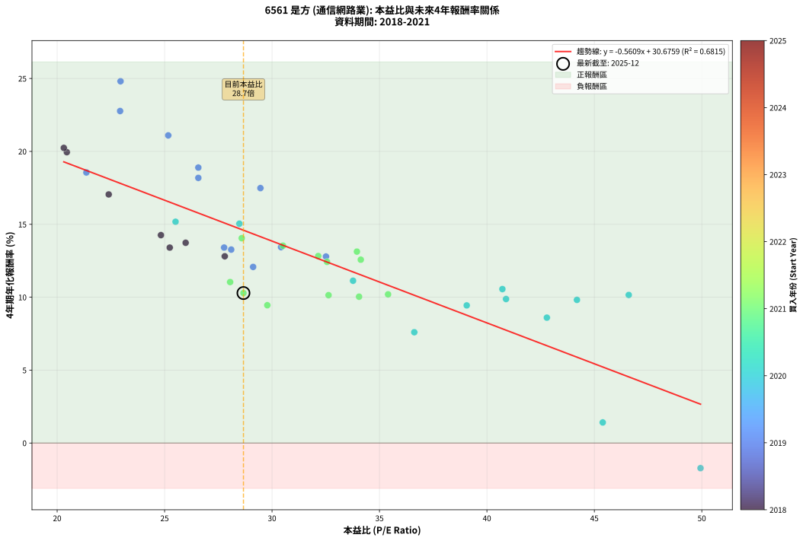
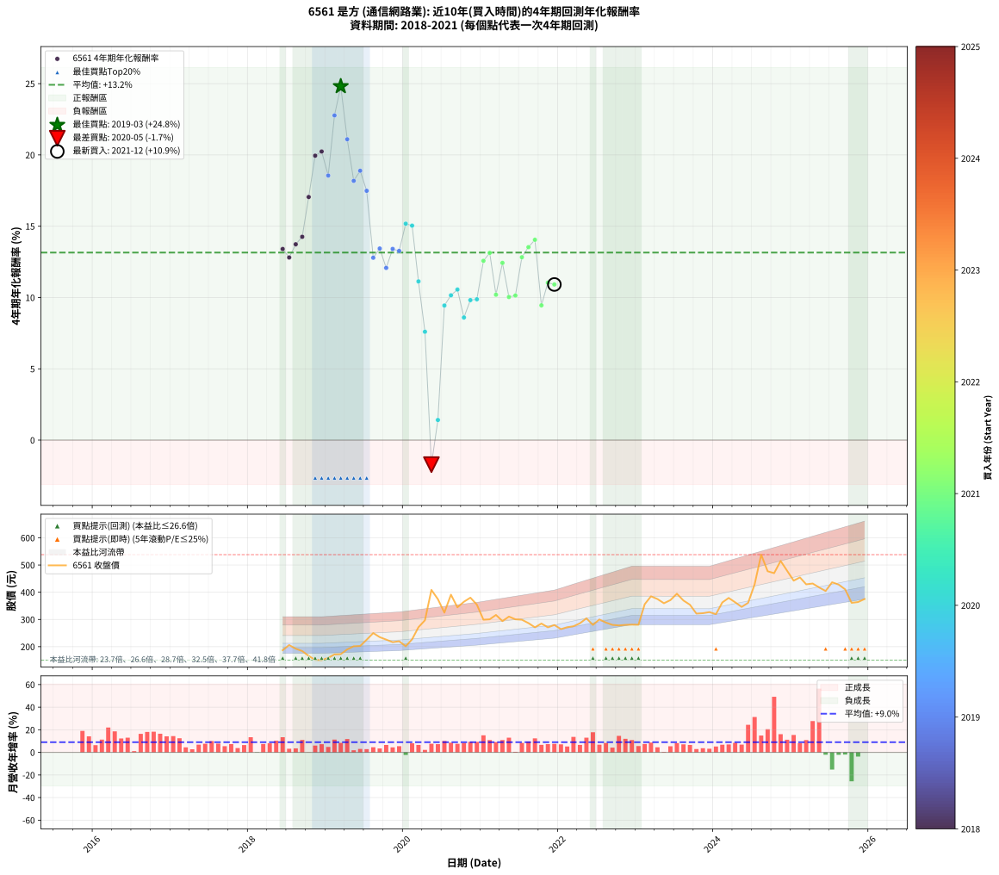

# 6561 是方 - 本益比與未來報酬率分析

!!! info "報告資訊"
    - **股票代號**: 6561
    - **公司名稱**: 是方
    - **產業別**: 通信網路業
    - **分析期間**: 2018-2021 (43 個數據點)
    - **資料來源**: Type 12 (ShowMonthlyK_ChartFlow) 月收盤價與本益比
    - **報酬率口徑**: 含現金股利 (簡化: 年度合計，假設每年7/1入帳)
    - **報告生成時間**: 2026-01-04 08:51:32 CST

## 📈 視覺化圖表

### 圖表1: 本益比 vs 未來報酬率關係

*圖表1：6561 是方 本益比與4年期未來報酬率關係 (2018-2021)*

### 圖表2: 歷年買入時點的4年期實際報酬率

*圖表2：6561 是方 歷年買入時點的4年期實際報酬率 (2018-2021)*

## 📍 買點訊號說明

本報告提供兩種買點提示訊號（顯示於圖表2的股價子圖中）：

### ▲ 小綠色三角形（回測驗證）
- **計算方式**: 使用全部歷史資料計算本益比第25百分位數
- **用途**: 事後驗證，顯示歷史上哪些時點確實為低估區
- **限制**: 當下無法判斷，僅供回測參考
- **特性**: 後見之明（Look-Ahead Bias）

### ▲ 小橘色三角形（即時訊號）
- **計算方式**: 使用截至當月的過去5年資料計算本益比第25百分位數
- **用途**: 實際投資決策，當時即可判斷
- **優勢**: 可操作性強，符合實務需求
- **特性**: 無後見之明，滾動窗口計算

!!! tip "如何使用兩種訊號"
    - **綠色▲** 幫助理解歷史估值機會，驗證策略有效性
    - **橘色▲** 可作為實際買進參考，但仍需搭配基本面分析
    - 兩種訊號重疊時，表示即時判斷與事後驗證一致，信心度較高
    - 僅有綠色▲時，表示當時無法判斷（需要未來資料才能確認）
    - 僅有橘色▲時，表示即時判斷為買點，但事後可能不是最佳時機

## 📊 估值分析摘要

| 指標 | 數值 |
|:---:|:---:|
| **目前本益比** (2021-12) | **28.67 倍** |
| **歷史平均本益比** | 31.26 倍 |
| **估值水準** | 🟡 合理範圍 |
| **預期4年年化報酬率** | **+14.61%** |
| **歷史平均報酬率** | +13.15% |
| **相關係數 (R²)** | 0.6853 |
| **趨勢線斜率** | -0.5616 |

!!! abstract "核心洞察"
    目前本益比接近歷史平均，預期報酬率符合長期趨勢

    根據歷史數據回測，6561 是方 在目前本益比 **28.7倍** 的估值水準下，
    預期未來4年年化報酬率約為 **+14.6%**。

    **重要提醒**: 本分析基於歷史數據統計，實際報酬率會受到公司基本面變化、產業趨勢、
    總體經濟環境等多重因素影響。R² = 0.69 表示本益比可解釋約 68.5% 的報酬率變異。

## 📈 歷史估值統計

### 最佳買點 (最高報酬率)

| 項目 | 數值 |
|:---:|:---:|
| 起始時間 | 2019-03 |
| 當時本益比 | 22.95 倍 |
| 起始價格 | 172.5 元 |
| 4年後價格 | 385.0 元 |
| **4年年化報酬率** | **+24.81%** |

### 最差買點 (最低報酬率)

| 項目 | 數值 |
|:---:|:---:|
| 起始時間 | 2020-05 |
| 當時本益比 | 49.94 倍 |
| 起始價格 | 408.5 元 |
| 4年後價格 | 346.0 元 |
| **4年年化報酬率** | **-1.72%** |

## 🎯 投資啟示

### 本益比與報酬率關係

趨勢線方程式: **y = -0.5616x + 30.7130**

!!! warning "強負相關"
    本益比與未來報酬率呈現強負相關。在高本益比時期買入，未來報酬率顯著較低；
    在低本益比時期買入，未來報酬率顯著較高。**估值紀律至關重要**。

### 估值區間建議

基於歷史數據分析:

- **🟢 低估區** (P/E < 25.0): 預期報酬率較高，可考慮增加持股
- **🟡 合理區** (P/E 25.0-37.5): 預期報酬率符合長期趨勢，正常持有
- **🔴 高估區** (P/E > 37.5): 預期報酬率較低，可考慮減碼或觀望

!!! danger "風險提示"
    - 過去表現不代表未來結果
    - 本分析假設公司基本面無重大結構性變化
    - 產業環境劇變可能使歷史規律失效
    - 應結合公司財報、產業趨勢、總體經濟等多重因素綜合判斷

!!! success "長期投資觀點"
    歷史數據顯示，在合理或低估的估值水準買入並長期持有，
    往往能獲得較佳的投資報酬。**耐心等待好價格**是價值投資的核心原則。

## 📊 數據品質

- **資料來源**: GoodInfo.tw Type 12 (ShowMonthlyK_ChartFlow)
- **資料頻率**: 月度收盤價與本益比
- **回測期間**: 2018-2021
- **數據點數量**: 43 個 (每個點代表一次4年期回測)

### 計算方法說明

1. **4年期年化報酬率**:
   - 對每個歷史時點，計算其後4年的實際投資報酬率
   - 期末價值(不含股利): 期末價格
   - 期末價值(含現金股利): 期末價格 + 持有期間內的現金股利合計 (簡化: 年度合計，假設每年7/1入帳)
   - 公式: 年化報酬率 = [(期末價值/期初價格)^(1/年數) - 1] × 100%

2. **本益比 (P/E Ratio)**:
   - 使用當時的月收盤價與EPS計算
   - 資料來源: Type 12 月度河流圖本益比數據

3. **趨勢線 (Linear Regression)**:
   - 使用最小平方法擬合線性趨勢線
   - R²值衡量本益比對報酬率的解釋能力

---

*本報告由 Stock Analysis System v1.9.0 自動生成*
*數據更新時間: 2026-01-04 08:51:32 CST*

## 📋 月度回測明細表

（每一列對應時間線圖中的一個買入點；可用來對照 SVG 圖上的每個點。）

| 買入月份 | 賣出月份 | 回測期限_年 | 實際持有年數 | 買入本益比_倍 | 買入收盤價_元 | 賣出收盤價_元 | 現金股利合計_元 | 總報酬率_pct | 年化報酬率_pct |
| --- | --- | --- | --- | --- | --- | --- | --- | --- | --- |
| 2018-06 | 2022-06 | 4 | 4.000 | 25.24 | 187.00 | 280.00 | 29.27 | +65.39 | +13.40 |
| 2018-07 | 2022-07 | 4 | 4.000 | 27.80 | 206.00 | 300.00 | 33.60 | +61.94 | +12.81 |
| 2018-08 | 2022-08 | 4 | 4.000 | 25.98 | 192.50 | 288.50 | 33.60 | +67.32 | +13.73 |
| 2018-09 | 2022-09 | 4 | 4.000 | 24.83 | 184.00 | 280.00 | 33.60 | +70.43 | +14.26 |
| 2018-10 | 2022-10 | 4 | 4.000 | 22.40 | 166.00 | 278.00 | 33.60 | +87.71 | +17.05 |
| 2018-11 | 2022-11 | 4 | 4.000 | 20.45 | 151.50 | 280.00 | 33.60 | +107.00 | +19.95 |
| 2018-12 | 2022-12 | 4 | 4.000 | 20.31 | 150.50 | 281.00 | 33.60 | +109.04 | +20.24 |
| 2019-01 | 2023-01 | 4 | 4.000 | 21.36 | 159.00 | 280.50 | 33.60 | +97.55 | +18.55 |
| 2019-02 | 2023-02 | 4 | 4.000 | 22.93 | 171.50 | 356.00 | 33.60 | +127.17 | +22.77 |
| 2019-03 | 2023-03 | 4 | 4.000 | 22.95 | 172.50 | 385.00 | 33.60 | +142.67 | +24.81 |
| 2019-04 | 2023-04 | 4 | 4.000 | 25.17 | 190.00 | 375.00 | 33.60 | +115.05 | +21.10 |
| 2019-05 | 2023-05 | 4 | 4.000 | 26.57 | 201.50 | 359.50 | 33.60 | +95.09 | +18.18 |
| 2019-06 | 2023-06 | 4 | 4.000 | 26.57 | 202.50 | 371.00 | 33.60 | +99.80 | +18.89 |
| 2019-07 | 2023-07 | 4 | 4.000 | 29.46 | 225.50 | 394.50 | 35.10 | +90.51 | +17.48 |
| 2019-08 | 2023-08 | 4 | 4.000 | 32.51 | 250.00 | 369.50 | 35.10 | +61.84 | +12.79 |
| 2019-09 | 2023-09 | 4 | 4.000 | 30.42 | 235.00 | 354.00 | 35.10 | +65.57 | +13.44 |
| 2019-10 | 2023-10 | 4 | 4.000 | 29.12 | 226.00 | 321.50 | 35.10 | +57.79 | +12.08 |
| 2019-11 | 2023-11 | 4 | 4.000 | 27.77 | 216.50 | 323.00 | 35.10 | +65.40 | +13.41 |
| 2019-12 | 2023-12 | 4 | 4.000 | 28.10 | 220.00 | 327.00 | 35.10 | +64.59 | +13.27 |
| 2020-01 | 2024-01 | 4 | 4.000 | 25.51 | 201.50 | 319.50 | 35.10 | +75.98 | +15.18 |
| 2020-02 | 2024-02 | 4 | 4.000 | 28.48 | 227.00 | 362.50 | 35.10 | +75.15 | +15.04 |
| 2020-03 | 2024-03 | 4 | 4.000 | 33.77 | 271.50 | 379.00 | 35.10 | +52.52 | +11.13 |
| 2020-04 | 2024-04 | 4 | 4.000 | 36.62 | 297.00 | 363.00 | 35.10 | +34.04 | +7.60 |
| 2020-05 | 2024-05 | 4 | 4.000 | 49.94 | 408.50 | 346.00 | 35.10 | -6.71 | -1.72 |
| 2020-06 | 2024-06 | 4 | 4.000 | 45.39 | 374.50 | 361.00 | 35.10 | +5.77 | +1.41 |
| 2020-07 | 2024-07 | 4 | 4.000 | 39.06 | 325.00 | 428.50 | 37.70 | +43.45 | +9.44 |
| 2020-08 | 2024-08 | 4 | 4.000 | 46.60 | 391.00 | 538.00 | 37.70 | +47.24 | +10.16 |
| 2020-09 | 2024-09 | 4 | 4.000 | 40.72 | 344.50 | 477.00 | 37.70 | +49.40 | +10.56 |
| 2020-10 | 2024-10 | 4 | 4.000 | 42.79 | 365.00 | 470.00 | 37.70 | +39.10 | +8.60 |
| 2020-11 | 2024-11 | 4 | 4.000 | 44.19 | 380.00 | 515.00 | 37.70 | +45.45 | +9.82 |
| 2020-12 | 2024-12 | 4 | 4.000 | 40.89 | 354.50 | 479.00 | 37.70 | +45.75 | +9.88 |
| 2021-01 | 2025-01 | 4 | 4.000 | 34.13 | 299.00 | 442.50 | 37.70 | +60.60 | +12.57 |
| 2021-02 | 2025-02 | 4 | 4.000 | 33.95 | 300.50 | 454.50 | 37.70 | +63.79 | +13.13 |
| 2021-03 | 2025-03 | 4 | 4.000 | 35.40 | 316.50 | 429.00 | 37.70 | +47.46 | +10.20 |
| 2021-04 | 2025-04 | 4 | 4.000 | 32.56 | 294.00 | 432.00 | 37.70 | +59.76 | +12.43 |
| 2021-05 | 2025-05 | 4 | 4.000 | 34.05 | 310.50 | 417.50 | 37.70 | +46.60 | +10.04 |
| 2021-06 | 2025-06 | 4 | 4.000 | 32.63 | 300.50 | 404.50 | 37.70 | +47.15 | +10.14 |
| 2021-07 | 2025-07 | 4 | 4.000 | 32.15 | 299.00 | 436.50 | 48.00 | +62.04 | +12.83 |
| 2021-08 | 2025-08 | 4 | 4.000 | 30.51 | 286.50 | 428.00 | 48.00 | +66.14 | +13.53 |
| 2021-09 | 2025-09 | 4 | 4.000 | 28.59 | 271.00 | 410.50 | 48.00 | +69.19 | +14.05 |
| 2021-10 | 2025-10 | 4 | 4.000 | 29.78 | 285.00 | 361.00 | 48.00 | +43.51 | +9.45 |
| 2021-11 | 2025-11 | 4 | 4.000 | 28.05 | 271.00 | 364.00 | 48.00 | +52.03 | +11.04 |
| 2021-12 | 2025-12 | 4 | 4.000 | 28.67 | 279.50 | 375.00 | 48.00 | +51.34 | +10.91 |
