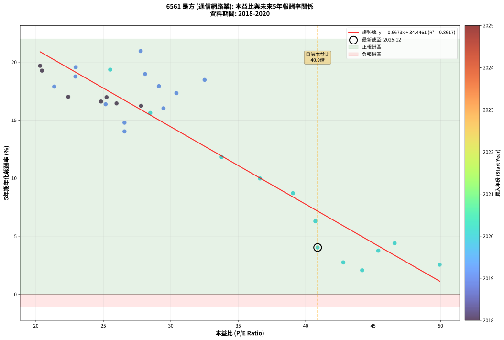
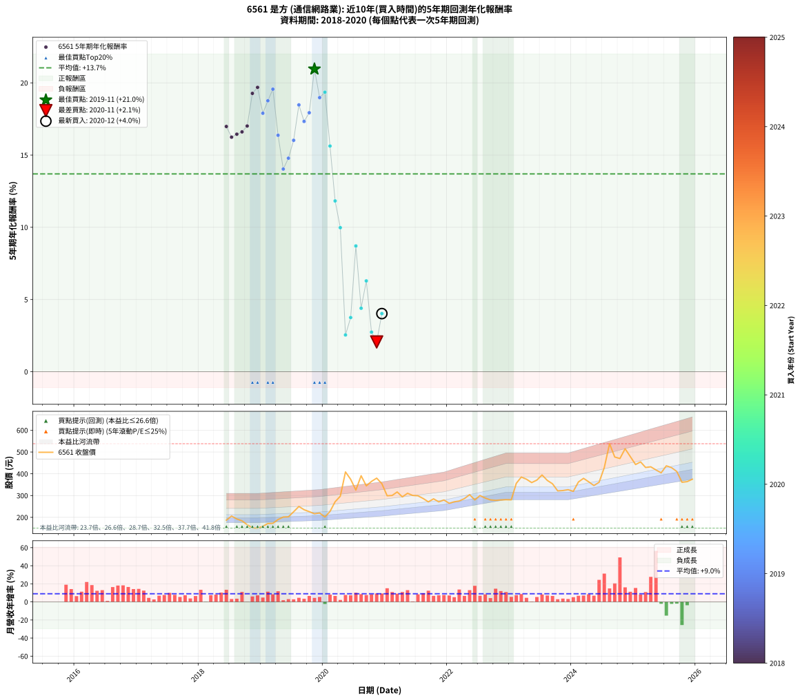

# 6561 是方 - 本益比與未來報酬率分析

!!! info "報告資訊"
    - **股票代號**: 6561
    - **公司名稱**: 是方
    - **產業別**: 通信網路業
    - **分析期間**: 2018-2020 (31 個數據點)
    - **資料來源**: Type 12 (ShowMonthlyK_ChartFlow) 月收盤價與本益比
    - **報酬率口徑**: 含現金股利 (簡化: 年度合計，假設每年7/1入帳)
    - **報告生成時間**: 2026-01-12 21:24:28 CST

## 📈 視覺化圖表

### 圖表1: 本益比 vs 未來報酬率關係

*圖表1：6561 是方 本益比與5年期未來報酬率關係 (2018-2020)*

### 圖表2: 歷年買入時點的5年期實際報酬率

*圖表2：6561 是方 歷年買入時點的5年期實際報酬率 (2018-2020)*

## 📍 買點訊號說明

本報告提供兩種買點提示訊號（顯示於圖表2的股價子圖中）：

### ▲ 小綠色三角形（回測驗證）
- **計算方式**: 使用全部歷史資料計算本益比第25百分位數
- **用途**: 事後驗證，顯示歷史上哪些時點確實為低估區
- **限制**: 當下無法判斷，僅供回測參考
- **特性**: 後見之明（Look-Ahead Bias）

### ▲ 小橘色三角形（即時訊號）
- **計算方式**: 使用截至當月的過去5年資料計算本益比第25百分位數
- **用途**: 實際投資決策，當時即可判斷
- **優勢**: 可操作性強，符合實務需求
- **特性**: 無後見之明，滾動窗口計算

!!! tip "如何使用兩種訊號"
    - **綠色▲** 幫助理解歷史估值機會，驗證策略有效性
    - **橘色▲** 可作為實際買進參考，但仍需搭配基本面分析
    - 兩種訊號重疊時，表示即時判斷與事後驗證一致，信心度較高
    - 僅有綠色▲時，表示當時無法判斷（需要未來資料才能確認）
    - 僅有橘色▲時，表示即時判斷為買點，但事後可能不是最佳時機

## 📊 估值分析摘要

| 指標 | 數值 |
|:---:|:---:|
| **目前本益比** (2020-12) | **40.89 倍** |
| **歷史平均本益比** | 31.09 倍 |
| **估值水準** | 🔴 相對高估 |
| **預期5年年化報酬率** | **+7.16%** |
| **歷史平均報酬率** | +13.70% |
| **相關係數 (R²)** | 0.8617 |
| **趨勢線斜率** | -0.6673 |

!!! abstract "核心洞察"
    目前本益比顯著高於歷史平均，預期未來報酬率可能較低

    根據歷史數據回測，6561 是方 在目前本益比 **40.9倍** 的估值水準下，
    預期未來5年年化報酬率約為 **+7.2%**。

    **重要提醒**: 本分析基於歷史數據統計，實際報酬率會受到公司基本面變化、產業趨勢、
    總體經濟環境等多重因素影響。R² = 0.86 表示本益比可解釋約 86.2% 的報酬率變異。

## 📈 歷史估值統計

### 最佳買點 (最高報酬率)

| 項目 | 數值 |
|:---:|:---:|
| 起始時間 | 2019-11 |
| 當時本益比 | 27.77 倍 |
| 起始價格 | 216.5 元 |
| 5年後價格 | 515.0 元 |
| **5年年化報酬率** | **+20.95%** |

### 最差買點 (最低報酬率)

| 項目 | 數值 |
|:---:|:---:|
| 起始時間 | 2020-11 |
| 當時本益比 | 44.19 倍 |
| 起始價格 | 380.0 元 |
| 5年後價格 | 364.0 元 |
| **5年年化報酬率** | **+2.06%** |

## 🎯 投資啟示

### 本益比與報酬率關係

趨勢線方程式: **y = -0.6673x + 34.4461**

!!! warning "強負相關"
    本益比與未來報酬率呈現強負相關。在高本益比時期買入，未來報酬率顯著較低；
    在低本益比時期買入，未來報酬率顯著較高。**估值紀律至關重要**。

### 估值區間建議

基於歷史數據分析:

- **🟢 低估區** (P/E < 24.9): 預期報酬率較高，可考慮增加持股
- **🟡 合理區** (P/E 24.9-37.3): 預期報酬率符合長期趨勢，正常持有
- **🔴 高估區** (P/E > 37.3): 預期報酬率較低，可考慮減碼或觀望

!!! danger "風險提示"
    - 過去表現不代表未來結果
    - 本分析假設公司基本面無重大結構性變化
    - 產業環境劇變可能使歷史規律失效
    - 應結合公司財報、產業趨勢、總體經濟等多重因素綜合判斷

!!! success "長期投資觀點"
    歷史數據顯示，在合理或低估的估值水準買入並長期持有，
    往往能獲得較佳的投資報酬。**耐心等待好價格**是價值投資的核心原則。

## 📊 數據品質

- **資料來源**: GoodInfo.tw Type 12 (ShowMonthlyK_ChartFlow)
- **資料頻率**: 月度收盤價與本益比
- **回測期間**: 2018-2020
- **數據點數量**: 31 個 (每個點代表一次5年期回測)

### 計算方法說明

1. **5年期年化報酬率**:
   - 對每個歷史時點，計算其後5年的實際投資報酬率
   - 期末價值(不含股利): 期末價格
   - 期末價值(含現金股利): 期末價格 + 持有期間內的現金股利合計 (簡化: 年度合計，假設每年7/1入帳)
   - 公式: 年化報酬率 = [(期末價值/期初價格)^(1/年數) - 1] × 100%

2. **本益比 (P/E Ratio)**:
   - 使用當時的月收盤價與EPS計算
   - 資料來源: Type 12 月度河流圖本益比數據

3. **趨勢線 (Linear Regression)**:
   - 使用最小平方法擬合線性趨勢線
   - R²值衡量本益比對報酬率的解釋能力

---

*本報告由 Stock Analysis System v1.9.0 自動生成*
*數據更新時間: 2026-01-12 21:24:28 CST*

## 📋 月度回測明細表

（每一列對應時間線圖中的一個買入點；可用來對照 SVG 圖上的每個點。）

| 買入月份 | 賣出月份 | 回測期限_年 | 實際持有年數 | 買入本益比_倍 | 買入收盤價_元 | 賣出收盤價_元 | 現金股利合計_元 | 總報酬率_pct | 年化報酬率_pct |
| --- | --- | --- | --- | --- | --- | --- | --- | --- | --- |
| 2018-06 | 2023-06 | 5 | 4.999 | 25.24 | 187.00 | 371.00 | 38.57 | +119.02 | +16.98 |
| 2018-07 | 2023-07 | 5 | 4.999 | 27.80 | 206.00 | 394.50 | 42.60 | +112.18 | +16.24 |
| 2018-08 | 2023-08 | 5 | 4.999 | 25.98 | 192.50 | 369.50 | 42.60 | +114.08 | +16.45 |
| 2018-09 | 2023-09 | 5 | 4.999 | 24.83 | 184.00 | 354.00 | 42.60 | +115.54 | +16.60 |
| 2018-10 | 2023-10 | 5 | 4.999 | 22.40 | 166.00 | 321.50 | 42.60 | +119.34 | +17.01 |
| 2018-11 | 2023-11 | 5 | 4.999 | 20.45 | 151.50 | 323.00 | 42.60 | +141.32 | +19.27 |
| 2018-12 | 2023-12 | 5 | 4.999 | 20.31 | 150.50 | 327.00 | 42.60 | +145.58 | +19.69 |
| 2019-01 | 2024-01 | 5 | 4.999 | 21.36 | 159.00 | 319.50 | 42.60 | +127.74 | +17.90 |
| 2019-02 | 2024-02 | 5 | 4.999 | 22.93 | 171.50 | 362.50 | 42.60 | +136.21 | +18.76 |
| 2019-03 | 2024-03 | 5 | 5.002 | 22.95 | 172.50 | 379.00 | 42.60 | +144.41 | +19.56 |
| 2019-04 | 2024-04 | 5 | 5.002 | 25.17 | 190.00 | 363.00 | 42.60 | +113.47 | +16.37 |
| 2019-05 | 2024-05 | 5 | 5.002 | 26.57 | 201.50 | 346.00 | 42.60 | +92.85 | +14.03 |
| 2019-06 | 2024-06 | 5 | 5.002 | 26.57 | 202.50 | 361.00 | 42.60 | +99.31 | +14.78 |
| 2019-07 | 2024-07 | 5 | 5.002 | 29.46 | 225.50 | 428.50 | 45.70 | +110.29 | +16.02 |
| 2019-08 | 2024-08 | 5 | 5.002 | 32.51 | 250.00 | 538.00 | 45.70 | +133.48 | +18.47 |
| 2019-09 | 2024-09 | 5 | 5.002 | 30.42 | 235.00 | 477.00 | 45.70 | +122.43 | +17.33 |
| 2019-10 | 2024-10 | 5 | 5.002 | 29.12 | 226.00 | 470.00 | 45.70 | +128.19 | +17.93 |
| 2019-11 | 2024-11 | 5 | 5.002 | 27.77 | 216.50 | 515.00 | 45.70 | +158.98 | +20.95 |
| 2019-12 | 2024-12 | 5 | 5.002 | 28.10 | 220.00 | 479.00 | 45.70 | +138.50 | +18.98 |
| 2020-01 | 2025-01 | 5 | 5.002 | 25.51 | 201.50 | 442.50 | 45.70 | +142.28 | +19.35 |
| 2020-02 | 2025-03 | 5 | 5.081 | 28.48 | 227.00 | 429.00 | 45.70 | +109.12 | +15.62 |
| 2020-03 | 2025-03 | 5 | 4.999 | 33.77 | 271.50 | 429.00 | 45.70 | +74.84 | +11.82 |
| 2020-04 | 2025-04 | 5 | 4.999 | 36.62 | 297.00 | 432.00 | 45.70 | +60.84 | +9.97 |
| 2020-05 | 2025-05 | 5 | 4.999 | 49.94 | 408.50 | 417.50 | 45.70 | +13.39 | +2.55 |
| 2020-06 | 2025-06 | 5 | 4.999 | 45.39 | 374.50 | 404.50 | 45.70 | +20.21 | +3.75 |
| 2020-07 | 2025-07 | 5 | 4.999 | 39.06 | 325.00 | 436.50 | 56.80 | +51.78 | +8.71 |
| 2020-08 | 2025-08 | 5 | 4.999 | 46.60 | 391.00 | 428.00 | 56.80 | +23.99 | +4.40 |
| 2020-09 | 2025-09 | 5 | 4.999 | 40.72 | 344.50 | 410.50 | 56.80 | +35.65 | +6.29 |
| 2020-10 | 2025-10 | 5 | 4.999 | 42.79 | 365.00 | 361.00 | 56.80 | +14.47 | +2.74 |
| 2020-11 | 2025-11 | 5 | 4.999 | 44.19 | 380.00 | 364.00 | 56.80 | +10.74 | +2.06 |
| 2020-12 | 2025-12 | 5 | 4.999 | 40.89 | 354.50 | 375.00 | 56.80 | +21.81 | +4.02 |
