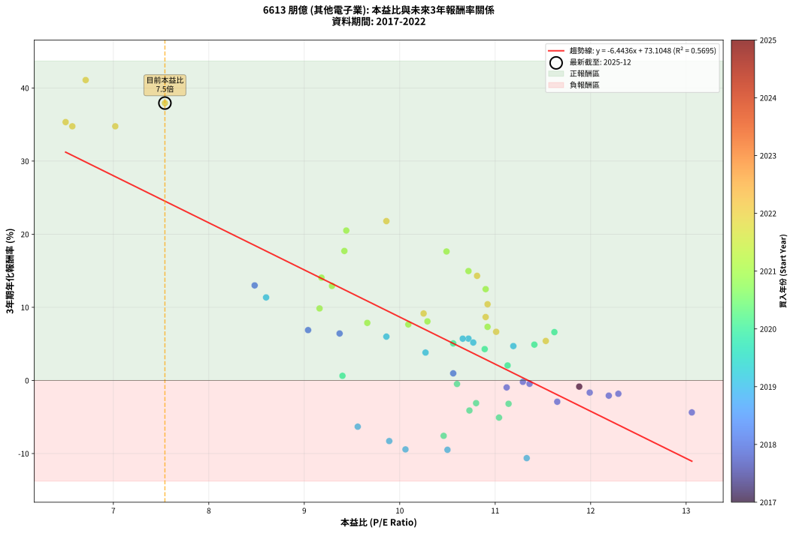
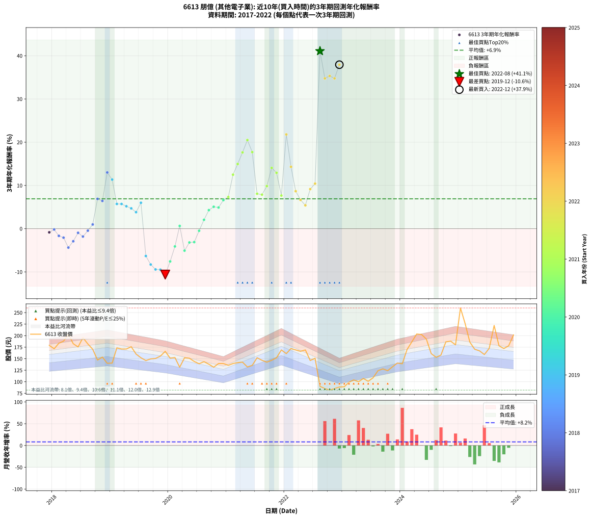

# 6613 朋億 - 本益比與未來報酬率分析

!!! info "報告資訊"
    - **股票代號**: 6613
    - **公司名稱**: 朋億
    - **產業別**: 其他電子業
    - **分析期間**: 2017-2022 (61 個數據點)
    - **資料來源**: Type 12 (ShowMonthlyK_ChartFlow) 月收盤價與本益比
    - **報酬率口徑**: 含現金股利 (簡化: 年度合計，假設每年7/1入帳)
    - **報告生成時間**: 2026-01-10 19:10:56 CST

## 📈 視覺化圖表

### 圖表1: 本益比 vs 未來報酬率關係

*圖表1：6613 朋億 本益比與3年期未來報酬率關係 (2017-2022)*

### 圖表2: 歷年買入時點的3年期實際報酬率

*圖表2：6613 朋億 歷年買入時點的3年期實際報酬率 (2017-2022)*

## 📍 買點訊號說明

本報告提供兩種買點提示訊號（顯示於圖表2的股價子圖中）：

### ▲ 小綠色三角形（回測驗證）
- **計算方式**: 使用全部歷史資料計算本益比第25百分位數
- **用途**: 事後驗證，顯示歷史上哪些時點確實為低估區
- **限制**: 當下無法判斷，僅供回測參考
- **特性**: 後見之明（Look-Ahead Bias）

### ▲ 小橘色三角形（即時訊號）
- **計算方式**: 使用截至當月的過去5年資料計算本益比第25百分位數
- **用途**: 實際投資決策，當時即可判斷
- **優勢**: 可操作性強，符合實務需求
- **特性**: 無後見之明，滾動窗口計算

!!! tip "如何使用兩種訊號"
    - **綠色▲** 幫助理解歷史估值機會，驗證策略有效性
    - **橘色▲** 可作為實際買進參考，但仍需搭配基本面分析
    - 兩種訊號重疊時，表示即時判斷與事後驗證一致，信心度較高
    - 僅有綠色▲時，表示當時無法判斷（需要未來資料才能確認）
    - 僅有橘色▲時，表示即時判斷為買點，但事後可能不是最佳時機

## 📊 估值分析摘要

| 指標 | 數值 |
|:---:|:---:|
| **目前本益比** (2022-12) | **7.54 倍** |
| **歷史平均本益比** | 10.27 倍 |
| **估值水準** | 🟢 相對低估 |
| **預期3年年化報酬率** | **+24.52%** |
| **歷史平均報酬率** | +6.91% |
| **相關係數 (R²)** | 0.5695 |
| **趨勢線斜率** | -6.4436 |

!!! abstract "核心洞察"
    目前本益比顯著低於歷史平均，預期未來報酬率可能較高

    根據歷史數據回測，6613 朋億 在目前本益比 **7.5倍** 的估值水準下，
    預期未來3年年化報酬率約為 **+24.5%**。

    **重要提醒**: 本分析基於歷史數據統計，實際報酬率會受到公司基本面變化、產業趨勢、
    總體經濟環境等多重因素影響。R² = 0.57 表示本益比可解釋約 56.9% 的報酬率變異。

## 📈 歷史估值統計

### 最佳買點 (最高報酬率)

| 項目 | 數值 |
|:---:|:---:|
| 起始時間 | 2022-08 |
| 當時本益比 | 6.71 倍 |
| 起始價格 | 90.0 元 |
| 3年後價格 | 222.0 元 |
| **3年年化報酬率** | **+41.08%** |

### 最差買點 (最低報酬率)

| 項目 | 數值 |
|:---:|:---:|
| 起始時間 | 2019-12 |
| 當時本益比 | 11.33 倍 |
| 起始價格 | 166.0 元 |
| 3年後價格 | 88.5 元 |
| **3年年化報酬率** | **-10.63%** |

## 🎯 投資啟示

### 本益比與報酬率關係

趨勢線方程式: **y = -6.4436x + 73.1048**

!!! warning "強負相關"
    本益比與未來報酬率呈現強負相關。在高本益比時期買入，未來報酬率顯著較低；
    在低本益比時期買入，未來報酬率顯著較高。**估值紀律至關重要**。

### 估值區間建議

基於歷史數據分析:

- **🟢 低估區** (P/E < 8.2): 預期報酬率較高，可考慮增加持股
- **🟡 合理區** (P/E 8.2-12.3): 預期報酬率符合長期趨勢，正常持有
- **🔴 高估區** (P/E > 12.3): 預期報酬率較低，可考慮減碼或觀望

!!! danger "風險提示"
    - 過去表現不代表未來結果
    - 本分析假設公司基本面無重大結構性變化
    - 產業環境劇變可能使歷史規律失效
    - 應結合公司財報、產業趨勢、總體經濟等多重因素綜合判斷

!!! success "長期投資觀點"
    歷史數據顯示，在合理或低估的估值水準買入並長期持有，
    往往能獲得較佳的投資報酬。**耐心等待好價格**是價值投資的核心原則。

## 📊 數據品質

- **資料來源**: GoodInfo.tw Type 12 (ShowMonthlyK_ChartFlow)
- **資料頻率**: 月度收盤價與本益比
- **回測期間**: 2017-2022
- **數據點數量**: 61 個 (每個點代表一次3年期回測)

### 計算方法說明

1. **3年期年化報酬率**:
   - 對每個歷史時點，計算其後3年的實際投資報酬率
   - 期末價值(不含股利): 期末價格
   - 期末價值(含現金股利): 期末價格 + 持有期間內的現金股利合計 (簡化: 年度合計，假設每年7/1入帳)
   - 公式: 年化報酬率 = [(期末價值/期初價格)^(1/年數) - 1] × 100%

2. **本益比 (P/E Ratio)**:
   - 使用當時的月收盤價與EPS計算
   - 資料來源: Type 12 月度河流圖本益比數據

3. **趨勢線 (Linear Regression)**:
   - 使用最小平方法擬合線性趨勢線
   - R²值衡量本益比對報酬率的解釋能力

---

*本報告由 Stock Analysis System v1.9.0 自動生成*
*數據更新時間: 2026-01-10 19:10:56 CST*

## 📋 月度回測明細表

（每一列對應時間線圖中的一個買入點；可用來對照 SVG 圖上的每個點。）

| 買入月份 | 賣出月份 | 回測期限_年 | 實際持有年數 | 買入本益比_倍 | 買入收盤價_元 | 賣出收盤價_元 | 現金股利合計_元 | 總報酬率_pct | 年化報酬率_pct |
| --- | --- | --- | --- | --- | --- | --- | --- | --- | --- |
| 2017-12 | 2020-12 | 3 | 3.001 | 11.88 | 179.00 | 139.50 | 35.00 | -2.51 | -0.84 |
| 2018-01 | 2021-01 | 3 | 3.001 | 11.29 | 171.50 | 135.50 | 35.00 | -0.58 | -0.19 |
| 2018-02 | 2021-02 | 3 | 3.001 | 11.99 | 183.50 | 139.50 | 35.00 | -4.90 | -1.66 |
| 2018-03 | 2021-03 | 3 | 3.001 | 12.19 | 188.00 | 141.50 | 35.00 | -6.12 | -2.08 |
| 2018-04 | 2021-04 | 3 | 3.001 | 13.06 | 203.00 | 142.50 | 35.00 | -12.56 | -4.37 |
| 2018-05 | 2021-05 | 3 | 3.001 | 11.65 | 182.50 | 132.00 | 35.00 | -8.49 | -2.91 |
| 2018-06 | 2021-06 | 3 | 3.001 | 11.12 | 175.50 | 135.50 | 35.00 | -2.85 | -0.96 |
| 2018-07 | 2021-07 | 3 | 3.001 | 12.29 | 195.50 | 152.00 | 33.00 | -5.37 | -1.82 |
| 2018-08 | 2021-08 | 3 | 3.001 | 11.36 | 182.00 | 146.50 | 33.00 | -1.37 | -0.46 |
| 2018-09 | 2021-09 | 3 | 3.001 | 10.56 | 170.50 | 142.50 | 33.00 | +2.93 | +0.97 |
| 2018-10 | 2021-10 | 3 | 3.001 | 9.04 | 147.00 | 146.50 | 33.00 | +22.11 | +6.88 |
| 2018-11 | 2021-11 | 3 | 3.001 | 9.37 | 153.50 | 152.00 | 33.00 | +20.52 | +6.42 |
| 2018-12 | 2021-12 | 3 | 3.001 | 8.48 | 140.00 | 169.00 | 33.00 | +44.29 | +13.00 |
| 2019-01 | 2022-01 | 3 | 3.001 | 8.60 | 140.50 | 161.00 | 33.00 | +38.08 | +11.35 |
| 2019-02 | 2022-02 | 3 | 3.001 | 10.72 | 173.50 | 172.00 | 33.00 | +18.16 | +5.72 |
| 2019-03 | 2022-03 | 3 | 3.001 | 10.66 | 171.00 | 169.00 | 33.00 | +18.13 | +5.71 |
| 2019-04 | 2022-04 | 3 | 3.001 | 10.77 | 171.00 | 166.00 | 33.00 | +16.37 | +5.18 |
| 2019-05 | 2022-05 | 3 | 3.001 | 11.19 | 176.00 | 169.00 | 33.00 | +14.77 | +4.70 |
| 2019-06 | 2022-06 | 3 | 3.001 | 10.27 | 160.00 | 146.00 | 33.00 | +11.88 | +3.81 |
| 2019-07 | 2022-07 | 3 | 3.001 | 9.86 | 152.00 | 151.00 | 30.00 | +19.08 | +5.99 |
| 2019-08 | 2022-08 | 3 | 3.001 | 9.56 | 146.00 | 90.00 | 30.00 | -17.81 | -6.33 |
| 2019-09 | 2022-09 | 3 | 3.001 | 9.89 | 149.50 | 85.30 | 30.00 | -22.88 | -8.29 |
| 2019-10 | 2022-10 | 3 | 3.001 | 10.06 | 150.50 | 81.80 | 30.00 | -25.71 | -9.43 |
| 2019-11 | 2022-11 | 3 | 3.001 | 10.50 | 155.50 | 85.30 | 30.00 | -25.85 | -9.49 |
| 2019-12 | 2022-12 | 3 | 3.001 | 11.33 | 166.00 | 88.50 | 30.00 | -28.61 | -10.63 |
| 2020-01 | 2023-01 | 3 | 3.001 | 10.46 | 151.00 | 89.20 | 30.00 | -21.06 | -7.58 |
| 2020-02 | 2023-03 | 3 | 3.080 | 10.73 | 152.50 | 104.00 | 30.00 | -12.13 | -4.11 |
| 2020-03 | 2023-03 | 3 | 2.998 | 9.40 | 131.50 | 104.00 | 30.00 | +1.90 | +0.63 |
| 2020-04 | 2023-04 | 3 | 2.998 | 11.04 | 152.00 | 100.00 | 30.00 | -14.47 | -5.08 |
| 2020-05 | 2023-05 | 3 | 2.998 | 11.14 | 151.00 | 107.00 | 30.00 | -9.27 | -3.19 |
| 2020-06 | 2023-06 | 3 | 2.998 | 10.80 | 144.00 | 101.00 | 30.00 | -9.03 | -3.11 |
| 2020-07 | 2023-07 | 3 | 2.998 | 10.60 | 139.00 | 108.50 | 28.49 | -1.44 | -0.48 |
| 2020-08 | 2023-08 | 3 | 2.998 | 11.13 | 143.50 | 124.00 | 28.49 | +6.27 | +2.05 |
| 2020-09 | 2023-09 | 3 | 2.998 | 10.89 | 138.00 | 128.00 | 28.49 | +13.40 | +4.28 |
| 2020-10 | 2023-10 | 3 | 2.998 | 10.56 | 131.50 | 124.00 | 28.49 | +15.96 | +5.06 |
| 2020-11 | 2023-11 | 3 | 2.998 | 11.41 | 139.50 | 132.50 | 28.49 | +15.41 | +4.90 |
| 2020-12 | 2023-12 | 3 | 2.998 | 11.62 | 139.50 | 140.50 | 28.49 | +21.14 | +6.61 |
| 2021-01 | 2024-01 | 3 | 2.998 | 10.92 | 135.50 | 139.00 | 28.49 | +23.61 | +7.33 |
| 2021-02 | 2024-02 | 3 | 2.998 | 10.90 | 139.50 | 170.00 | 28.49 | +42.29 | +12.48 |
| 2021-03 | 2024-03 | 3 | 3.001 | 10.72 | 141.50 | 186.50 | 28.49 | +51.94 | +14.96 |
| 2021-04 | 2024-04 | 3 | 3.001 | 10.49 | 142.50 | 203.50 | 28.49 | +62.80 | +17.64 |
| 2021-05 | 2024-05 | 3 | 3.001 | 9.44 | 132.00 | 202.50 | 28.49 | +74.99 | +20.50 |
| 2021-06 | 2024-06 | 3 | 3.001 | 9.42 | 135.50 | 192.50 | 28.49 | +63.09 | +17.71 |
| 2021-07 | 2024-07 | 3 | 3.001 | 10.29 | 152.00 | 161.00 | 30.88 | +26.24 | +8.07 |
| 2021-08 | 2024-08 | 3 | 3.001 | 9.66 | 146.50 | 153.00 | 30.88 | +25.52 | +7.87 |
| 2021-09 | 2024-09 | 3 | 3.001 | 9.16 | 142.50 | 158.00 | 30.88 | +32.55 | +9.85 |
| 2021-10 | 2024-10 | 3 | 3.001 | 9.18 | 146.50 | 186.50 | 30.88 | +48.38 | +14.06 |
| 2021-11 | 2024-11 | 3 | 3.001 | 9.29 | 152.00 | 188.00 | 30.88 | +44.00 | +12.92 |
| 2021-12 | 2024-12 | 3 | 3.001 | 10.09 | 169.00 | 180.00 | 30.88 | +24.78 | +7.66 |
| 2022-01 | 2025-01 | 3 | 3.001 | 9.86 | 161.00 | 260.00 | 30.88 | +80.67 | +21.79 |
| 2022-02 | 2025-02 | 3 | 3.001 | 10.81 | 172.00 | 226.00 | 30.88 | +49.35 | +14.30 |
| 2022-03 | 2025-03 | 3 | 3.001 | 10.90 | 169.00 | 186.00 | 30.88 | +28.33 | +8.67 |
| 2022-04 | 2025-04 | 3 | 3.001 | 11.01 | 166.00 | 170.50 | 30.88 | +21.32 | +6.65 |
| 2022-05 | 2025-05 | 3 | 3.001 | 11.53 | 169.00 | 167.00 | 30.88 | +17.09 | +5.40 |
| 2022-06 | 2025-06 | 3 | 3.001 | 10.25 | 146.00 | 159.00 | 30.88 | +30.06 | +9.15 |
| 2022-07 | 2025-07 | 3 | 3.001 | 10.92 | 151.00 | 172.50 | 30.78 | +34.62 | +10.42 |
| 2022-08 | 2025-08 | 3 | 3.001 | 6.71 | 90.00 | 222.00 | 30.78 | +180.87 | +41.08 |
| 2022-09 | 2025-09 | 3 | 3.001 | 6.57 | 85.30 | 178.00 | 30.78 | +144.76 | +34.76 |
| 2022-10 | 2025-10 | 3 | 3.001 | 6.50 | 81.80 | 172.00 | 30.78 | +147.90 | +35.33 |
| 2022-11 | 2025-11 | 3 | 3.001 | 7.02 | 85.30 | 178.00 | 30.78 | +144.76 | +34.76 |
| 2022-12 | 2025-12 | 3 | 3.001 | 7.54 | 88.50 | 201.50 | 30.78 | +162.47 | +37.93 |
