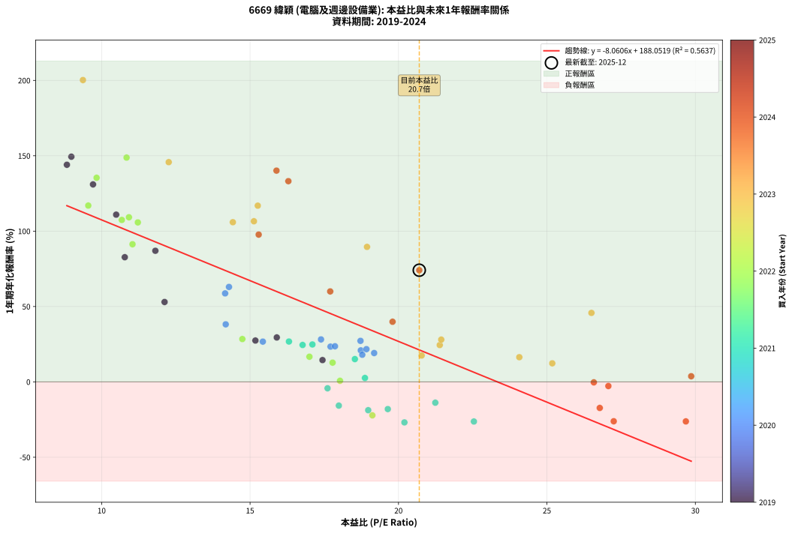
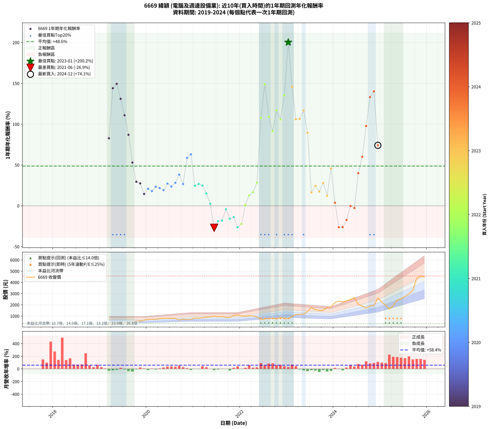

# 6669 緯穎 - 本益比與未來報酬率分析

!!! info "報告資訊"
    - **股票代號**: 6669
    - **公司名稱**: 緯穎
    - **產業別**: 電腦及週邊設備業
    - **分析期間**: 2019-2024 (70 個數據點)
    - **資料來源**: Type 12 (ShowMonthlyK_ChartFlow) 月收盤價與本益比
    - **報酬率口徑**: 含現金股利 (簡化: 年度合計，假設每年7/1入帳)
    - **報告生成時間**: 2026-01-10 19:11:10 CST

## 📈 視覺化圖表

### 圖表1: 本益比 vs 未來報酬率關係

*圖表1：6669 緯穎 本益比與1年期未來報酬率關係 (2019-2024)*

### 圖表2: 歷年買入時點的1年期實際報酬率

*圖表2：6669 緯穎 歷年買入時點的1年期實際報酬率 (2019-2024)*

## 📍 買點訊號說明

本報告提供兩種買點提示訊號（顯示於圖表2的股價子圖中）：

### ▲ 小綠色三角形（回測驗證）
- **計算方式**: 使用全部歷史資料計算本益比第25百分位數
- **用途**: 事後驗證，顯示歷史上哪些時點確實為低估區
- **限制**: 當下無法判斷，僅供回測參考
- **特性**: 後見之明（Look-Ahead Bias）

### ▲ 小橘色三角形（即時訊號）
- **計算方式**: 使用截至當月的過去5年資料計算本益比第25百分位數
- **用途**: 實際投資決策，當時即可判斷
- **優勢**: 可操作性強，符合實務需求
- **特性**: 無後見之明，滾動窗口計算

!!! tip "如何使用兩種訊號"
    - **綠色▲** 幫助理解歷史估值機會，驗證策略有效性
    - **橘色▲** 可作為實際買進參考，但仍需搭配基本面分析
    - 兩種訊號重疊時，表示即時判斷與事後驗證一致，信心度較高
    - 僅有綠色▲時，表示當時無法判斷（需要未來資料才能確認）
    - 僅有橘色▲時，表示即時判斷為買點，但事後可能不是最佳時機

## 📊 估值分析摘要

| 指標 | 數值 |
|:---:|:---:|
| **目前本益比** (2024-12) | **20.70 倍** |
| **歷史平均本益比** | 17.30 倍 |
| **估值水準** | 🟡 合理範圍 |
| **預期1年年化報酬率** | **+21.20%** |
| **歷史平均報酬率** | +48.63% |
| **相關係數 (R²)** | 0.5637 |
| **趨勢線斜率** | -8.0606 |

!!! abstract "核心洞察"
    目前本益比接近歷史平均，預期報酬率符合長期趨勢

    根據歷史數據回測，6669 緯穎 在目前本益比 **20.7倍** 的估值水準下，
    預期未來1年年化報酬率約為 **+21.2%**。

    **重要提醒**: 本分析基於歷史數據統計，實際報酬率會受到公司基本面變化、產業趨勢、
    總體經濟環境等多重因素影響。R² = 0.56 表示本益比可解釋約 56.4% 的報酬率變異。

## 📈 歷史估值統計

### 最佳買點 (最高報酬率)

| 項目 | 數值 |
|:---:|:---:|
| 起始時間 | 2023-01 |
| 當時本益比 | 9.37 倍 |
| 起始價格 | 750.0 元 |
| 1年後價格 | 2200.0 元 |
| **1年年化報酬率** | **+200.23%** |

### 最差買點 (最低報酬率)

| 項目 | 數值 |
|:---:|:---:|
| 起始時間 | 2021-06 |
| 當時本益比 | 20.20 倍 |
| 起始價格 | 997.0 元 |
| 1年後價格 | 697.0 元 |
| **1年年化報酬率** | **-26.90%** |

## 🎯 投資啟示

### 本益比與報酬率關係

趨勢線方程式: **y = -8.0606x + 188.0519**

!!! warning "強負相關"
    本益比與未來報酬率呈現強負相關。在高本益比時期買入，未來報酬率顯著較低；
    在低本益比時期買入，未來報酬率顯著較高。**估值紀律至關重要**。

### 估值區間建議

基於歷史數據分析:

- **🟢 低估區** (P/E < 13.8): 預期報酬率較高，可考慮增加持股
- **🟡 合理區** (P/E 13.8-20.8): 預期報酬率符合長期趨勢，正常持有
- **🔴 高估區** (P/E > 20.8): 預期報酬率較低，可考慮減碼或觀望

!!! danger "風險提示"
    - 過去表現不代表未來結果
    - 本分析假設公司基本面無重大結構性變化
    - 產業環境劇變可能使歷史規律失效
    - 應結合公司財報、產業趨勢、總體經濟等多重因素綜合判斷

!!! success "長期投資觀點"
    歷史數據顯示，在合理或低估的估值水準買入並長期持有，
    往往能獲得較佳的投資報酬。**耐心等待好價格**是價值投資的核心原則。

## 📊 數據品質

- **資料來源**: GoodInfo.tw Type 12 (ShowMonthlyK_ChartFlow)
- **資料頻率**: 月度收盤價與本益比
- **回測期間**: 2019-2024
- **數據點數量**: 70 個 (每個點代表一次1年期回測)

### 計算方法說明

1. **1年期年化報酬率**:
   - 對每個歷史時點，計算其後1年的實際投資報酬率
   - 期末價值(不含股利): 期末價格
   - 期末價值(含現金股利): 期末價格 + 持有期間內的現金股利合計 (簡化: 年度合計，假設每年7/1入帳)
   - 公式: 年化報酬率 = [(期末價值/期初價格)^(1/年數) - 1] × 100%

2. **本益比 (P/E Ratio)**:
   - 使用當時的月收盤價與EPS計算
   - 資料來源: Type 12 月度河流圖本益比數據

3. **趨勢線 (Linear Regression)**:
   - 使用最小平方法擬合線性趨勢線
   - R²值衡量本益比對報酬率的解釋能力

---

*本報告由 Stock Analysis System v1.9.0 自動生成*
*數據更新時間: 2026-01-10 19:11:10 CST*

## 📋 月度回測明細表

（每一列對應時間線圖中的一個買入點；可用來對照 SVG 圖上的每個點。）

| 買入月份 | 賣出月份 | 回測期限_年 | 實際持有年數 | 買入本益比_倍 | 買入收盤價_元 | 賣出收盤價_元 | 現金股利合計_元 | 總報酬率_pct | 年化報酬率_pct |
| --- | --- | --- | --- | --- | --- | --- | --- | --- | --- |
| 2019-03 | 2020-03 | 1 | 1.002 | 10.78 | 392.50 | 702.00 | 16.00 | +82.93 | +82.70 |
| 2019-04 | 2020-04 | 1 | 1.002 | 8.83 | 321.50 | 770.00 | 16.00 | +144.48 | +144.03 |
| 2019-05 | 2020-05 | 1 | 1.002 | 8.98 | 327.00 | 801.00 | 16.00 | +149.85 | +149.38 |
| 2019-06 | 2020-06 | 1 | 1.002 | 9.71 | 353.50 | 802.00 | 16.00 | +131.40 | +131.00 |
| 2019-07 | 2020-07 | 1 | 1.002 | 10.49 | 382.00 | 784.00 | 23.00 | +111.26 | +110.93 |
| 2019-08 | 2020-08 | 1 | 1.002 | 11.81 | 430.00 | 782.00 | 23.00 | +87.21 | +86.97 |
| 2019-09 | 2020-09 | 1 | 1.002 | 12.12 | 441.50 | 653.00 | 23.00 | +53.11 | +52.98 |
| 2019-10 | 2020-10 | 1 | 1.002 | 15.90 | 579.00 | 727.00 | 23.00 | +29.53 | +29.47 |
| 2019-11 | 2020-11 | 1 | 1.002 | 15.18 | 553.00 | 682.00 | 23.00 | +27.49 | +27.42 |
| 2019-12 | 2020-12 | 1 | 1.002 | 17.44 | 635.00 | 704.00 | 23.00 | +14.49 | +14.46 |
| 2020-01 | 2021-01 | 1 | 1.002 | 18.73 | 702.00 | 826.00 | 23.00 | +20.94 | +20.89 |
| 2020-02 | 2021-03 | 1 | 1.081 | 18.78 | 724.00 | 843.00 | 23.00 | +19.61 | +18.01 |
| 2020-03 | 2021-03 | 1 | 0.999 | 17.71 | 702.00 | 843.00 | 23.00 | +23.36 | +23.38 |
| 2020-04 | 2021-04 | 1 | 0.999 | 18.92 | 770.00 | 914.00 | 23.00 | +21.69 | +21.70 |
| 2020-05 | 2021-05 | 1 | 0.999 | 19.18 | 801.00 | 931.00 | 23.00 | +19.10 | +19.12 |
| 2020-06 | 2021-06 | 1 | 0.999 | 18.72 | 802.00 | 997.00 | 23.00 | +27.18 | +27.20 |
| 2020-07 | 2021-07 | 1 | 0.999 | 17.86 | 784.00 | 937.00 | 32.00 | +23.60 | +23.61 |
| 2020-08 | 2021-08 | 1 | 0.999 | 17.39 | 782.00 | 970.00 | 32.00 | +28.13 | +28.15 |
| 2020-09 | 2021-09 | 1 | 0.999 | 14.18 | 653.00 | 870.00 | 32.00 | +38.13 | +38.16 |
| 2020-10 | 2021-10 | 1 | 0.999 | 15.43 | 727.00 | 889.00 | 32.00 | +26.69 | +26.71 |
| 2020-11 | 2021-11 | 1 | 0.999 | 14.16 | 682.00 | 1050.00 | 32.00 | +58.65 | +58.70 |
| 2020-12 | 2021-12 | 1 | 0.999 | 14.29 | 704.00 | 1115.00 | 32.00 | +62.93 | +62.98 |
| 2021-01 | 2022-01 | 1 | 0.999 | 16.77 | 826.00 | 996.00 | 32.00 | +24.46 | +24.47 |
| 2021-02 | 2022-02 | 1 | 0.999 | 16.31 | 804.00 | 987.00 | 32.00 | +26.74 | +26.76 |
| 2021-03 | 2022-03 | 1 | 0.999 | 17.10 | 843.00 | 1020.00 | 32.00 | +24.79 | +24.81 |
| 2021-04 | 2022-04 | 1 | 0.999 | 18.53 | 914.00 | 1020.00 | 32.00 | +15.10 | +15.11 |
| 2021-05 | 2022-05 | 1 | 0.999 | 18.87 | 931.00 | 923.00 | 32.00 | +2.58 | +2.58 |
| 2021-06 | 2022-06 | 1 | 0.999 | 20.20 | 997.00 | 697.00 | 32.00 | -26.88 | -26.90 |
| 2021-07 | 2022-07 | 1 | 0.999 | 18.98 | 937.00 | 736.00 | 25.00 | -18.78 | -18.79 |
| 2021-08 | 2022-08 | 1 | 0.999 | 19.64 | 970.00 | 770.00 | 25.00 | -18.04 | -18.05 |
| 2021-09 | 2022-09 | 1 | 0.999 | 17.61 | 870.00 | 808.00 | 25.00 | -4.25 | -4.26 |
| 2021-10 | 2022-10 | 1 | 0.999 | 17.99 | 889.00 | 724.00 | 25.00 | -15.75 | -15.76 |
| 2021-11 | 2022-11 | 1 | 0.999 | 21.24 | 1050.00 | 880.00 | 25.00 | -13.81 | -13.82 |
| 2021-12 | 2022-12 | 1 | 0.999 | 22.54 | 1115.00 | 797.00 | 25.00 | -26.28 | -26.29 |
| 2022-01 | 2023-01 | 1 | 0.999 | 19.12 | 996.00 | 750.00 | 25.00 | -22.19 | -22.20 |
| 2022-02 | 2023-02 | 1 | 0.999 | 18.03 | 987.00 | 969.00 | 25.00 | +0.71 | +0.71 |
| 2022-03 | 2023-03 | 1 | 0.999 | 17.78 | 1020.00 | 1125.00 | 25.00 | +12.75 | +12.75 |
| 2022-04 | 2023-04 | 1 | 0.999 | 17.00 | 1020.00 | 1165.00 | 25.00 | +16.67 | +16.68 |
| 2022-05 | 2023-05 | 1 | 0.999 | 14.74 | 923.00 | 1160.00 | 25.00 | +28.39 | +28.41 |
| 2022-06 | 2023-06 | 1 | 0.999 | 10.68 | 697.00 | 1420.00 | 25.00 | +107.32 | +107.42 |
| 2022-07 | 2023-07 | 1 | 0.999 | 10.84 | 736.00 | 1780.00 | 50.00 | +148.64 | +148.80 |
| 2022-08 | 2023-08 | 1 | 0.999 | 10.92 | 770.00 | 1560.00 | 50.00 | +109.09 | +109.20 |
| 2022-09 | 2023-09 | 1 | 0.999 | 11.04 | 808.00 | 1495.00 | 50.00 | +91.21 | +91.30 |
| 2022-10 | 2023-10 | 1 | 0.999 | 9.55 | 724.00 | 1520.00 | 50.00 | +116.85 | +116.97 |
| 2022-11 | 2023-11 | 1 | 0.999 | 11.22 | 880.00 | 1760.00 | 50.00 | +105.68 | +105.78 |
| 2022-12 | 2023-12 | 1 | 0.999 | 9.83 | 797.00 | 1825.00 | 50.00 | +135.26 | +135.40 |
| 2023-01 | 2024-01 | 1 | 0.999 | 9.37 | 750.00 | 2200.00 | 50.00 | +200.00 | +200.23 |
| 2023-02 | 2024-02 | 1 | 0.999 | 12.26 | 969.00 | 2330.00 | 50.00 | +145.61 | +145.77 |
| 2023-03 | 2024-03 | 1 | 1.002 | 14.42 | 1125.00 | 2270.00 | 50.00 | +106.22 | +105.92 |
| 2023-04 | 2024-04 | 1 | 1.002 | 15.13 | 1165.00 | 2360.00 | 50.00 | +106.87 | +106.56 |
| 2023-05 | 2024-05 | 1 | 1.002 | 15.26 | 1160.00 | 2470.00 | 50.00 | +117.24 | +116.90 |
| 2023-06 | 2024-06 | 1 | 1.002 | 18.94 | 1420.00 | 2645.00 | 50.00 | +89.79 | +89.54 |
| 2023-07 | 2024-07 | 1 | 1.002 | 24.07 | 1780.00 | 2030.00 | 42.00 | +16.40 | +16.37 |
| 2023-08 | 2024-08 | 1 | 1.002 | 21.39 | 1560.00 | 1900.00 | 42.00 | +24.49 | +24.43 |
| 2023-09 | 2024-09 | 1 | 1.002 | 20.78 | 1495.00 | 1715.00 | 42.00 | +17.53 | +17.49 |
| 2023-10 | 2024-10 | 1 | 1.002 | 21.44 | 1520.00 | 1905.00 | 42.00 | +28.09 | +28.03 |
| 2023-11 | 2024-11 | 1 | 1.002 | 25.18 | 1760.00 | 1935.00 | 42.00 | +12.33 | +12.30 |
| 2023-12 | 2024-12 | 1 | 1.002 | 26.50 | 1825.00 | 2620.00 | 42.00 | +45.86 | +45.75 |
| 2024-01 | 2025-01 | 1 | 1.002 | 29.86 | 2200.00 | 2240.00 | 42.00 | +3.73 | +3.72 |
| 2024-02 | 2025-03 | 1 | 1.081 | 29.68 | 2330.00 | 1635.00 | 42.00 | -28.03 | -26.22 |
| 2024-03 | 2025-03 | 1 | 0.999 | 27.25 | 2270.00 | 1635.00 | 42.00 | -26.12 | -26.14 |
| 2024-04 | 2025-04 | 1 | 0.999 | 26.78 | 2360.00 | 1910.00 | 42.00 | -17.29 | -17.30 |
| 2024-05 | 2025-05 | 1 | 0.999 | 26.58 | 2470.00 | 2420.00 | 42.00 | -0.32 | -0.32 |
| 2024-06 | 2025-06 | 1 | 0.999 | 27.07 | 2645.00 | 2530.00 | 42.00 | -2.76 | -2.76 |
| 2024-07 | 2025-07 | 1 | 0.999 | 19.80 | 2030.00 | 2765.00 | 74.00 | +39.85 | +39.88 |
| 2024-08 | 2025-08 | 1 | 0.999 | 17.70 | 1900.00 | 2965.00 | 74.00 | +59.95 | +60.00 |
| 2024-09 | 2025-09 | 1 | 0.999 | 15.29 | 1715.00 | 3315.00 | 74.00 | +97.61 | +97.70 |
| 2024-10 | 2025-10 | 1 | 0.999 | 16.29 | 1905.00 | 4365.00 | 74.00 | +133.02 | +133.15 |
| 2024-11 | 2025-11 | 1 | 0.999 | 15.89 | 1935.00 | 4570.00 | 74.00 | +140.00 | +140.14 |
| 2024-12 | 2025-12 | 1 | 0.999 | 20.70 | 2620.00 | 4485.00 | 74.00 | +74.01 | +74.07 |
