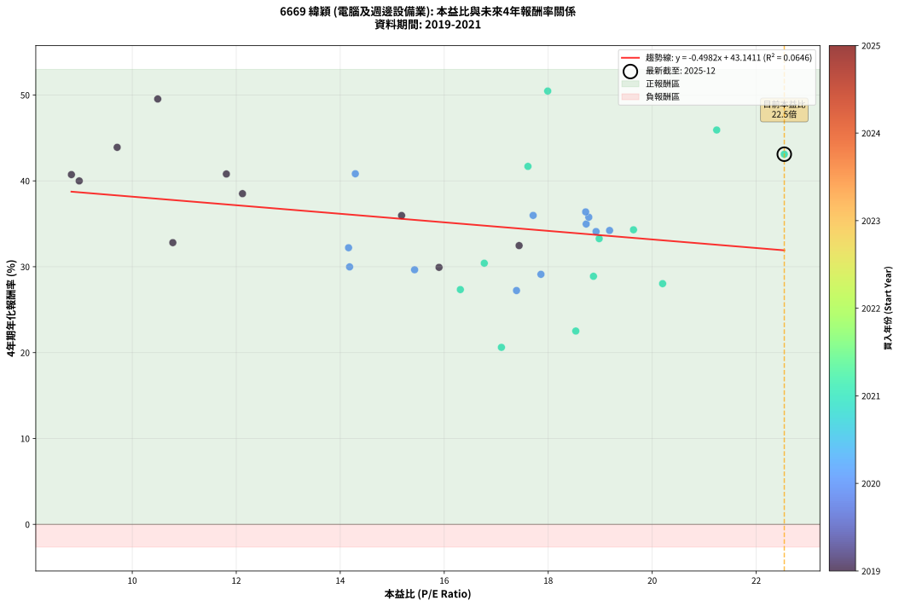
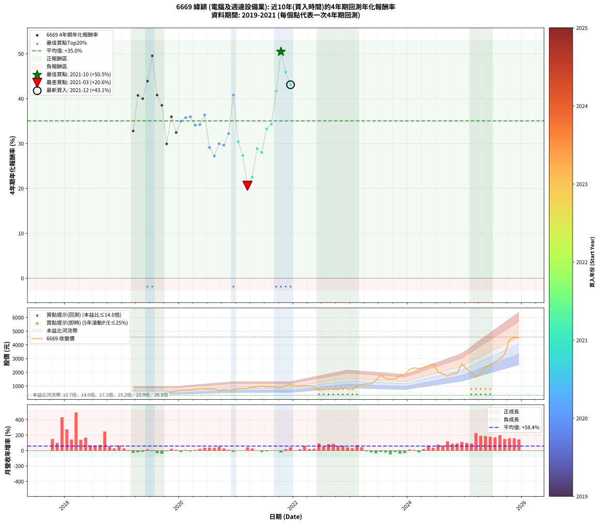

# 6669 緯穎 - 本益比與未來報酬率分析

!!! info "報告資訊"
    - **股票代號**: 6669
    - **公司名稱**: 緯穎
    - **產業別**: 電腦及週邊設備業
    - **分析期間**: 2019-2021 (34 個數據點)
    - **資料來源**: Type 12 (ShowMonthlyK_ChartFlow) 月收盤價與本益比
    - **報酬率口徑**: 含現金股利 (簡化: 年度合計，假設每年7/1入帳)
    - **報告生成時間**: 2026-01-13 14:00:24 CST

## 📈 視覺化圖表

### 圖表1: 本益比 vs 未來報酬率關係

*圖表1：6669 緯穎 本益比與4年期未來報酬率關係 (2019-2021)*

### 圖表2: 歷年買入時點的4年期實際報酬率

*圖表2：6669 緯穎 歷年買入時點的4年期實際報酬率 (2019-2021)*

## 📍 買點訊號說明

本報告提供兩種買點提示訊號（顯示於圖表2的股價子圖中）：

### ▲ 小綠色三角形（回測驗證）
- **計算方式**: 使用全部歷史資料計算本益比第25百分位數
- **用途**: 事後驗證，顯示歷史上哪些時點確實為低估區
- **限制**: 當下無法判斷，僅供回測參考
- **特性**: 後見之明（Look-Ahead Bias）

### ▲ 小橘色三角形（即時訊號）
- **計算方式**: 使用截至當月的過去5年資料計算本益比第25百分位數
- **用途**: 實際投資決策，當時即可判斷
- **優勢**: 可操作性強，符合實務需求
- **特性**: 無後見之明，滾動窗口計算

!!! tip "如何使用兩種訊號"
    - **綠色▲** 幫助理解歷史估值機會，驗證策略有效性
    - **橘色▲** 可作為實際買進參考，但仍需搭配基本面分析
    - 兩種訊號重疊時，表示即時判斷與事後驗證一致，信心度較高
    - 僅有綠色▲時，表示當時無法判斷（需要未來資料才能確認）
    - 僅有橘色▲時，表示即時判斷為買點，但事後可能不是最佳時機

## 📊 估值分析摘要

| 指標 | 數值 |
|:---:|:---:|
| **目前本益比** (2021-12) | **22.54 倍** |
| **歷史平均本益比** | 16.25 倍 |
| **估值水準** | 🔴 相對高估 |
| **預期4年年化報酬率** | **+31.91%** |
| **歷史平均報酬率** | +35.05% |
| **相關係數 (R²)** | 0.0646 |
| **趨勢線斜率** | -0.4982 |

!!! abstract "核心洞察"
    目前本益比顯著高於歷史平均，預期未來報酬率可能較低

    根據歷史數據回測，6669 緯穎 在目前本益比 **22.5倍** 的估值水準下，
    預期未來4年年化報酬率約為 **+31.9%**。

    **重要提醒**: 本分析基於歷史數據統計，實際報酬率會受到公司基本面變化、產業趨勢、
    總體經濟環境等多重因素影響。R² = 0.06 表示本益比可解釋約 6.5% 的報酬率變異。

## 📈 歷史估值統計

### 最佳買點 (最高報酬率)

| 項目 | 數值 |
|:---:|:---:|
| 起始時間 | 2021-10 |
| 當時本益比 | 17.99 倍 |
| 起始價格 | 889.0 元 |
| 4年後價格 | 4365.0 元 |
| **4年年化報酬率** | **+50.46%** |

### 最差買點 (最低報酬率)

| 項目 | 數值 |
|:---:|:---:|
| 起始時間 | 2021-03 |
| 當時本益比 | 17.10 倍 |
| 起始價格 | 843.0 元 |
| 4年後價格 | 1635.0 元 |
| **4年年化報酬率** | **+20.61%** |

## 🎯 投資啟示

### 本益比與報酬率關係

趨勢線方程式: **y = -0.4982x + 43.1411**

!!! note "負相關"
    本益比與未來報酬率呈現負相關。較低的本益比通常帶來較高的未來報酬率，
    但相關性不算非常強。**估值仍是重要參考指標之一**。

### 估值區間建議

基於歷史數據分析:

- **🟢 低估區** (P/E < 13.0): 預期報酬率較高，可考慮增加持股
- **🟡 合理區** (P/E 13.0-19.5): 預期報酬率符合長期趨勢，正常持有
- **🔴 高估區** (P/E > 19.5): 預期報酬率較低，可考慮減碼或觀望

!!! danger "風險提示"
    - 過去表現不代表未來結果
    - 本分析假設公司基本面無重大結構性變化
    - 產業環境劇變可能使歷史規律失效
    - 應結合公司財報、產業趨勢、總體經濟等多重因素綜合判斷

!!! success "長期投資觀點"
    歷史數據顯示，在合理或低估的估值水準買入並長期持有，
    往往能獲得較佳的投資報酬。**耐心等待好價格**是價值投資的核心原則。

## 📊 數據品質

- **資料來源**: GoodInfo.tw Type 12 (ShowMonthlyK_ChartFlow)
- **資料頻率**: 月度收盤價與本益比
- **回測期間**: 2019-2021
- **數據點數量**: 34 個 (每個點代表一次4年期回測)

### 計算方法說明

1. **4年期年化報酬率**:
   - 對每個歷史時點，計算其後4年的實際投資報酬率
   - 期末價值(不含股利): 期末價格
   - 期末價值(含現金股利): 期末價格 + 持有期間內的現金股利合計 (簡化: 年度合計，假設每年7/1入帳)
   - 公式: 年化報酬率 = [(期末價值/期初價格)^(1/年數) - 1] × 100%

2. **本益比 (P/E Ratio)**:
   - 使用當時的月收盤價與EPS計算
   - 資料來源: Type 12 月度河流圖本益比數據

3. **趨勢線 (Linear Regression)**:
   - 使用最小平方法擬合線性趨勢線
   - R²值衡量本益比對報酬率的解釋能力

---

*本報告由 Stock Analysis System v1.9.0 自動生成*
*數據更新時間: 2026-01-13 14:00:24 CST*

## 📋 月度回測明細表

（每一列對應時間線圖中的一個買入點；可用來對照 SVG 圖上的每個點。）

| 買入月份 | 賣出月份 | 回測期限_年 | 實際持有年數 | 買入本益比_倍 | 買入收盤價_元 | 賣出收盤價_元 | 現金股利合計_元 | 總報酬率_pct | 年化報酬率_pct |
| --- | --- | --- | --- | --- | --- | --- | --- | --- | --- |
| 2019-03 | 2023-03 | 4 | 4.000 | 10.78 | 392.50 | 1125.00 | 96.00 | +211.08 | +32.81 |
| 2019-04 | 2023-04 | 4 | 4.000 | 8.83 | 321.50 | 1165.00 | 96.00 | +292.22 | +40.73 |
| 2019-05 | 2023-05 | 4 | 4.000 | 8.98 | 327.00 | 1160.00 | 96.00 | +284.10 | +39.99 |
| 2019-06 | 2023-06 | 4 | 4.000 | 9.71 | 353.50 | 1420.00 | 96.00 | +328.85 | +43.91 |
| 2019-07 | 2023-07 | 4 | 4.000 | 10.49 | 382.00 | 1780.00 | 130.00 | +400.00 | +49.53 |
| 2019-08 | 2023-08 | 4 | 4.000 | 11.81 | 430.00 | 1560.00 | 130.00 | +293.02 | +40.80 |
| 2019-09 | 2023-09 | 4 | 4.000 | 12.12 | 441.50 | 1495.00 | 130.00 | +268.06 | +38.51 |
| 2019-10 | 2023-10 | 4 | 4.000 | 15.90 | 579.00 | 1520.00 | 130.00 | +184.97 | +29.93 |
| 2019-11 | 2023-11 | 4 | 4.000 | 15.18 | 553.00 | 1760.00 | 130.00 | +241.77 | +35.97 |
| 2019-12 | 2023-12 | 4 | 4.000 | 17.44 | 635.00 | 1825.00 | 130.00 | +207.87 | +32.46 |
| 2020-01 | 2024-01 | 4 | 4.000 | 18.73 | 702.00 | 2200.00 | 130.00 | +231.91 | +34.98 |
| 2020-02 | 2024-02 | 4 | 4.000 | 18.78 | 724.00 | 2330.00 | 130.00 | +239.78 | +35.77 |
| 2020-03 | 2024-03 | 4 | 4.000 | 17.71 | 702.00 | 2270.00 | 130.00 | +241.88 | +35.98 |
| 2020-04 | 2024-04 | 4 | 4.000 | 18.92 | 770.00 | 2360.00 | 130.00 | +223.38 | +34.10 |
| 2020-05 | 2024-05 | 4 | 4.000 | 19.18 | 801.00 | 2470.00 | 130.00 | +224.59 | +34.23 |
| 2020-06 | 2024-06 | 4 | 4.000 | 18.72 | 802.00 | 2645.00 | 130.00 | +246.01 | +36.39 |
| 2020-07 | 2024-07 | 4 | 4.000 | 17.86 | 784.00 | 2030.00 | 149.00 | +177.93 | +29.12 |
| 2020-08 | 2024-08 | 4 | 4.000 | 17.39 | 782.00 | 1900.00 | 149.00 | +162.02 | +27.23 |
| 2020-09 | 2024-09 | 4 | 4.000 | 14.18 | 653.00 | 1715.00 | 149.00 | +185.45 | +29.98 |
| 2020-10 | 2024-10 | 4 | 4.000 | 15.43 | 727.00 | 1905.00 | 149.00 | +182.53 | +29.65 |
| 2020-11 | 2024-11 | 4 | 4.000 | 14.16 | 682.00 | 1935.00 | 149.00 | +205.57 | +32.21 |
| 2020-12 | 2024-12 | 4 | 4.000 | 14.29 | 704.00 | 2620.00 | 149.00 | +293.32 | +40.83 |
| 2021-01 | 2025-01 | 4 | 4.000 | 16.77 | 826.00 | 2240.00 | 149.00 | +189.23 | +30.41 |
| 2021-02 | 2025-02 | 4 | 4.000 | 16.31 | 804.00 | 1965.00 | 149.00 | +162.94 | +27.34 |
| 2021-03 | 2025-03 | 4 | 4.000 | 17.10 | 843.00 | 1635.00 | 149.00 | +111.63 | +20.61 |
| 2021-04 | 2025-04 | 4 | 4.000 | 18.53 | 914.00 | 1910.00 | 149.00 | +125.27 | +22.51 |
| 2021-05 | 2025-05 | 4 | 4.000 | 18.87 | 931.00 | 2420.00 | 149.00 | +175.94 | +28.89 |
| 2021-06 | 2025-06 | 4 | 4.000 | 20.20 | 997.00 | 2530.00 | 149.00 | +168.71 | +28.03 |
| 2021-07 | 2025-07 | 4 | 4.000 | 18.98 | 937.00 | 2765.00 | 191.00 | +215.47 | +33.27 |
| 2021-08 | 2025-08 | 4 | 4.000 | 19.64 | 970.00 | 2965.00 | 191.00 | +225.36 | +34.30 |
| 2021-09 | 2025-09 | 4 | 4.000 | 17.61 | 870.00 | 3315.00 | 191.00 | +302.99 | +41.68 |
| 2021-10 | 2025-10 | 4 | 4.000 | 17.99 | 889.00 | 4365.00 | 191.00 | +412.49 | +50.46 |
| 2021-11 | 2025-11 | 4 | 4.000 | 21.24 | 1050.00 | 4570.00 | 191.00 | +353.43 | +45.92 |
| 2021-12 | 2025-12 | 4 | 4.000 | 22.54 | 1115.00 | 4485.00 | 191.00 | +319.37 | +43.10 |
