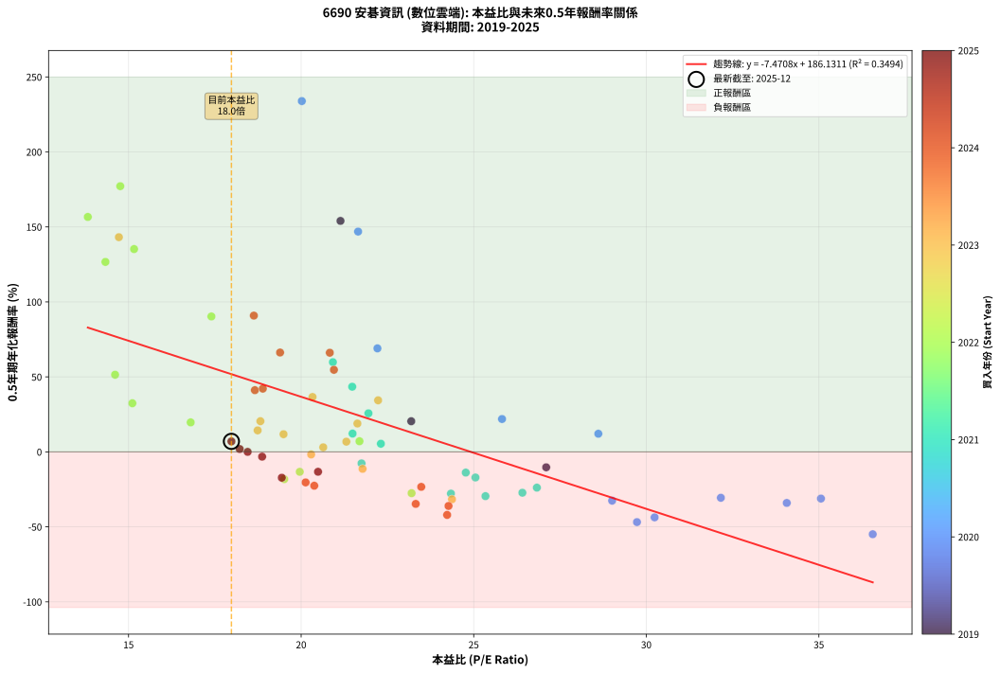
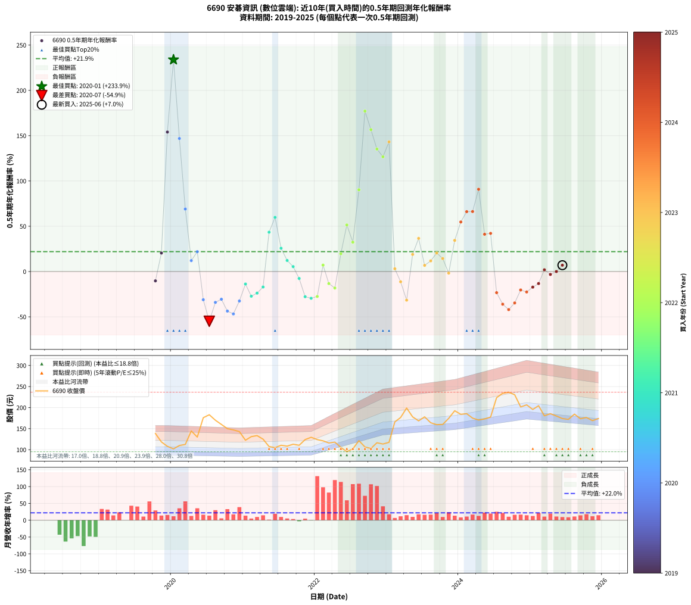

# 6690 安碁資訊 - 本益比與未來報酬率分析

!!! info "報告資訊"
    - **股票代號**: 6690
    - **公司名稱**: 安碁資訊
    - **產業別**: 數位雲端
    - **分析期間**: 2019-2025 (69 個數據點)
    - **資料來源**: Type 12 (ShowMonthlyK_ChartFlow) 月收盤價與本益比
    - **報酬率口徑**: 含現金股利 (簡化: 年度合計，假設每年7/1入帳)
    - **報告生成時間**: 2026-01-04 08:20:41 CST

## 📈 視覺化圖表

### 圖表1: 本益比 vs 未來報酬率關係

*圖表1：6690 安碁資訊 本益比與0.5年期未來報酬率關係 (2019-2025)*

### 圖表2: 歷年買入時點的0.5年期實際報酬率

*圖表2：6690 安碁資訊 歷年買入時點的0.5年期實際報酬率 (2019-2025)*

## 📍 買點訊號說明

本報告提供兩種買點提示訊號（顯示於圖表2的股價子圖中）：

### ▲ 小綠色三角形（回測驗證）
- **計算方式**: 使用全部歷史資料計算本益比第25百分位數
- **用途**: 事後驗證，顯示歷史上哪些時點確實為低估區
- **限制**: 當下無法判斷，僅供回測參考
- **特性**: 後見之明（Look-Ahead Bias）

### ▲ 小橘色三角形（即時訊號）
- **計算方式**: 使用截至當月的過去5年資料計算本益比第25百分位數
- **用途**: 實際投資決策，當時即可判斷
- **優勢**: 可操作性強，符合實務需求
- **特性**: 無後見之明，滾動窗口計算

!!! tip "如何使用兩種訊號"
    - **綠色▲** 幫助理解歷史估值機會，驗證策略有效性
    - **橘色▲** 可作為實際買進參考，但仍需搭配基本面分析
    - 兩種訊號重疊時，表示即時判斷與事後驗證一致，信心度較高
    - 僅有綠色▲時，表示當時無法判斷（需要未來資料才能確認）
    - 僅有橘色▲時，表示即時判斷為買點，但事後可能不是最佳時機

## 📊 估值分析摘要

| 指標 | 數值 |
|:---:|:---:|
| **目前本益比** (2025-06) | **17.98 倍** |
| **歷史平均本益比** | 21.98 倍 |
| **估值水準** | 🟡 合理範圍 |
| **預期0.5年年化報酬率** | **+51.81%** |
| **歷史平均報酬率** | +21.93% |
| **相關係數 (R²)** | 0.3494 |
| **趨勢線斜率** | -7.4708 |

!!! abstract "核心洞察"
    目前本益比接近歷史平均，預期報酬率符合長期趨勢

    根據歷史數據回測，6690 安碁資訊 在目前本益比 **18.0倍** 的估值水準下，
    預期未來0.5年年化報酬率約為 **+51.8%**。

    **重要提醒**: 本分析基於歷史數據統計，實際報酬率會受到公司基本面變化、產業趨勢、
    總體經濟環境等多重因素影響。R² = 0.35 表示本益比可解釋約 34.9% 的報酬率變異。

## 📈 歷史估值統計

### 最佳買點 (最高報酬率)

| 項目 | 數值 |
|:---:|:---:|
| 起始時間 | 2020-01 |
| 當時本益比 | 20.02 倍 |
| 起始價格 | 102.0 元 |
| 0.5年後價格 | 183.0 元 |
| **0.5年年化報酬率** | **+233.90%** |

### 最差買點 (最低報酬率)

| 項目 | 數值 |
|:---:|:---:|
| 起始時間 | 2020-07 |
| 當時本益比 | 36.56 倍 |
| 起始價格 | 183.0 元 |
| 0.5年後價格 | 122.5 元 |
| **0.5年年化報酬率** | **-54.92%** |

## 🎯 投資啟示

### 本益比與報酬率關係

趨勢線方程式: **y = -7.4708x + 186.1311**

!!! warning "強負相關"
    本益比與未來報酬率呈現強負相關。在高本益比時期買入，未來報酬率顯著較低；
    在低本益比時期買入，未來報酬率顯著較高。**估值紀律至關重要**。

### 估值區間建議

基於歷史數據分析:

- **🟢 低估區** (P/E < 17.6): 預期報酬率較高，可考慮增加持股
- **🟡 合理區** (P/E 17.6-26.4): 預期報酬率符合長期趨勢，正常持有
- **🔴 高估區** (P/E > 26.4): 預期報酬率較低，可考慮減碼或觀望

!!! danger "風險提示"
    - 過去表現不代表未來結果
    - 本分析假設公司基本面無重大結構性變化
    - 產業環境劇變可能使歷史規律失效
    - 應結合公司財報、產業趨勢、總體經濟等多重因素綜合判斷

!!! success "長期投資觀點"
    歷史數據顯示，在合理或低估的估值水準買入並長期持有，
    往往能獲得較佳的投資報酬。**耐心等待好價格**是價值投資的核心原則。

## 📊 數據品質

- **資料來源**: GoodInfo.tw Type 12 (ShowMonthlyK_ChartFlow)
- **資料頻率**: 月度收盤價與本益比
- **回測期間**: 2019-2025
- **數據點數量**: 69 個 (每個點代表一次0.5年期回測)

### 計算方法說明

1. **0.5年期年化報酬率**:
   - 對每個歷史時點，計算其後0.5年的實際投資報酬率
   - 期末價值(不含股利): 期末價格
   - 期末價值(含現金股利): 期末價格 + 持有期間內的現金股利合計 (簡化: 年度合計，假設每年7/1入帳)
   - 公式: 年化報酬率 = [(期末價值/期初價格)^(1/年數) - 1] × 100%

2. **本益比 (P/E Ratio)**:
   - 使用當時的月收盤價與EPS計算
   - 資料來源: Type 12 月度河流圖本益比數據

3. **趨勢線 (Linear Regression)**:
   - 使用最小平方法擬合線性趨勢線
   - R²值衡量本益比對報酬率的解釋能力

---

*本報告由 Stock Analysis System v1.9.0 自動生成*
*數據更新時間: 2026-01-04 08:20:41 CST*

## 📋 月度回測明細表

（每一列對應時間線圖中的一個買入點；可用來對照 SVG 圖上的每個點。）

| 買入月份 | 賣出月份 | 回測期限_年 | 實際持有年數 | 買入本益比_倍 | 買入收盤價_元 | 賣出收盤價_元 | 現金股利合計_元 | 總報酬率_pct | 年化報酬率_pct |
| --- | --- | --- | --- | --- | --- | --- | --- | --- | --- |
| 2019-10 | 2020-05 | 0.5 | 0.583 | 27.10 | 138.50 | 130.00 | 0.00 | -6.14 | -10.29 |
| 2019-11 | 2020-05 | 0.5 | 0.498 | 23.19 | 118.50 | 130.00 | 0.00 | +9.70 | +20.43 |
| 2019-12 | 2020-07 | 0.5 | 0.583 | 21.14 | 108.00 | 183.00 | 3.00 | +72.22 | +154.01 |
| 2020-01 | 2020-07 | 0.5 | 0.498 | 20.02 | 102.00 | 183.00 | 3.00 | +82.35 | +233.90 |
| 2020-02 | 2020-08 | 0.5 | 0.501 | 21.65 | 110.00 | 170.00 | 3.00 | +57.27 | +146.89 |
| 2020-03 | 2020-10 | 0.5 | 0.586 | 22.21 | 112.50 | 150.00 | 3.00 | +36.00 | +69.01 |
| 2020-04 | 2020-10 | 0.5 | 0.501 | 28.61 | 144.50 | 150.00 | 3.00 | +5.88 | +12.08 |
| 2020-05 | 2020-12 | 0.5 | 0.586 | 25.82 | 130.00 | 143.00 | 3.00 | +12.31 | +21.91 |
| 2020-06 | 2020-12 | 0.5 | 0.501 | 35.06 | 176.00 | 143.00 | 3.00 | -17.05 | -31.13 |
| 2020-07 | 2021-01 | 0.5 | 0.504 | 36.56 | 183.00 | 122.50 | 0.00 | -33.06 | -54.92 |
| 2020-08 | 2021-03 | 0.5 | 0.580 | 34.07 | 170.00 | 133.50 | 0.00 | -21.47 | -34.06 |
| 2020-09 | 2021-03 | 0.5 | 0.496 | 32.16 | 160.00 | 133.50 | 0.00 | -16.56 | -30.61 |
| 2020-10 | 2021-05 | 0.5 | 0.580 | 30.24 | 150.00 | 107.50 | 0.00 | -28.33 | -43.67 |
| 2020-11 | 2021-05 | 0.5 | 0.496 | 29.73 | 147.00 | 107.50 | 0.00 | -26.87 | -46.82 |
| 2020-12 | 2021-07 | 0.5 | 0.580 | 29.01 | 143.00 | 110.50 | 3.30 | -20.42 | -32.53 |
| 2021-01 | 2021-07 | 0.5 | 0.496 | 24.77 | 122.50 | 110.50 | 3.30 | -7.10 | -13.81 |
| 2021-02 | 2021-08 | 0.5 | 0.498 | 26.41 | 131.00 | 108.50 | 3.30 | -14.66 | -27.24 |
| 2021-03 | 2021-10 | 0.5 | 0.586 | 26.83 | 133.50 | 110.50 | 3.30 | -14.76 | -23.85 |
| 2021-04 | 2021-10 | 0.5 | 0.501 | 25.05 | 125.00 | 110.50 | 3.30 | -8.96 | -17.09 |
| 2021-05 | 2021-12 | 0.5 | 0.586 | 21.48 | 107.50 | 129.50 | 3.30 | +23.53 | +43.44 |
| 2021-06 | 2021-12 | 0.5 | 0.501 | 20.92 | 105.00 | 129.50 | 3.30 | +26.48 | +59.81 |
| 2021-07 | 2022-01 | 0.5 | 0.504 | 21.95 | 110.50 | 124.00 | 0.00 | +12.22 | +25.71 |
| 2021-08 | 2022-03 | 0.5 | 0.580 | 21.49 | 108.50 | 116.00 | 0.00 | +6.91 | +12.20 |
| 2021-09 | 2022-03 | 0.5 | 0.496 | 22.31 | 113.00 | 116.00 | 0.00 | +2.65 | +5.43 |
| 2021-10 | 2022-05 | 0.5 | 0.580 | 21.75 | 110.50 | 105.50 | 0.00 | -4.52 | -7.67 |
| 2021-11 | 2022-05 | 0.5 | 0.496 | 24.34 | 124.00 | 105.50 | 0.00 | -14.92 | -27.82 |
| 2021-12 | 2022-07 | 0.5 | 0.580 | 25.34 | 129.50 | 102.00 | 3.70 | -18.38 | -29.52 |
| 2022-01 | 2022-07 | 0.5 | 0.496 | 23.20 | 124.00 | 102.00 | 3.70 | -14.76 | -27.55 |
| 2022-02 | 2022-08 | 0.5 | 0.498 | 21.69 | 121.00 | 121.50 | 3.70 | +3.47 | +7.09 |
| 2022-03 | 2022-10 | 0.5 | 0.586 | 19.96 | 116.00 | 103.00 | 3.70 | -8.02 | -13.29 |
| 2022-04 | 2022-10 | 0.5 | 0.501 | 19.51 | 118.00 | 103.00 | 3.70 | -9.58 | -18.20 |
| 2022-05 | 2022-12 | 0.5 | 0.586 | 16.80 | 105.50 | 113.50 | 3.70 | +11.09 | +19.66 |
| 2022-06 | 2022-12 | 0.5 | 0.501 | 14.61 | 95.20 | 113.50 | 3.70 | +23.11 | +51.43 |
| 2022-07 | 2023-01 | 0.5 | 0.504 | 15.11 | 102.00 | 117.50 | 0.00 | +15.20 | +32.42 |
| 2022-08 | 2023-03 | 0.5 | 0.580 | 17.40 | 121.50 | 176.50 | 0.00 | +45.27 | +90.28 |
| 2022-09 | 2023-03 | 0.5 | 0.496 | 14.76 | 106.50 | 176.50 | 0.00 | +65.73 | +177.16 |
| 2022-10 | 2023-05 | 0.5 | 0.580 | 13.82 | 103.00 | 178.00 | 0.00 | +72.82 | +156.64 |
| 2022-11 | 2023-05 | 0.5 | 0.496 | 15.16 | 116.50 | 178.00 | 0.00 | +52.79 | +135.23 |
| 2022-12 | 2023-07 | 0.5 | 0.580 | 14.33 | 113.50 | 178.00 | 4.50 | +60.79 | +126.66 |
| 2023-01 | 2023-07 | 0.5 | 0.496 | 14.72 | 117.50 | 178.00 | 4.50 | +55.32 | +143.16 |
| 2023-02 | 2023-08 | 0.5 | 0.498 | 20.64 | 166.00 | 164.00 | 4.50 | +1.51 | +3.05 |
| 2023-03 | 2023-10 | 0.5 | 0.586 | 21.78 | 176.50 | 160.00 | 4.50 | -6.80 | -11.32 |
| 2023-04 | 2023-10 | 0.5 | 0.501 | 24.37 | 199.00 | 160.00 | 4.50 | -17.34 | -31.61 |
| 2023-05 | 2023-12 | 0.5 | 0.586 | 21.63 | 178.00 | 192.50 | 4.50 | +10.67 | +18.90 |
| 2023-06 | 2023-12 | 0.5 | 0.501 | 20.33 | 168.50 | 192.50 | 4.50 | +16.91 | +36.60 |
| 2023-07 | 2024-01 | 0.5 | 0.504 | 21.31 | 178.00 | 184.00 | 0.00 | +3.37 | +6.80 |
| 2023-08 | 2024-03 | 0.5 | 0.583 | 19.49 | 164.00 | 175.00 | 0.00 | +6.71 | +11.78 |
| 2023-09 | 2024-03 | 0.5 | 0.498 | 18.82 | 159.50 | 175.00 | 0.00 | +9.72 | +20.46 |
| 2023-10 | 2024-05 | 0.5 | 0.583 | 18.74 | 160.00 | 173.00 | 0.00 | +8.12 | +14.33 |
| 2023-11 | 2024-05 | 0.5 | 0.498 | 20.29 | 174.50 | 173.00 | 0.00 | -0.86 | -1.72 |
| 2023-12 | 2024-07 | 0.5 | 0.583 | 22.23 | 192.50 | 223.50 | 5.20 | +18.81 | +34.38 |
| 2024-01 | 2024-07 | 0.5 | 0.498 | 20.95 | 184.00 | 223.50 | 5.20 | +24.29 | +54.72 |
| 2024-02 | 2024-08 | 0.5 | 0.501 | 20.83 | 185.50 | 234.00 | 5.20 | +28.95 | +66.11 |
| 2024-03 | 2024-10 | 0.5 | 0.586 | 19.39 | 175.00 | 230.50 | 5.20 | +34.69 | +66.24 |
| 2024-04 | 2024-10 | 0.5 | 0.501 | 18.63 | 170.50 | 230.50 | 5.20 | +38.24 | +90.85 |
| 2024-05 | 2024-12 | 0.5 | 0.586 | 18.66 | 173.00 | 206.50 | 5.20 | +22.37 | +41.14 |
| 2024-06 | 2024-12 | 0.5 | 0.501 | 18.89 | 177.50 | 206.50 | 5.20 | +19.27 | +42.15 |
| 2024-07 | 2025-01 | 0.5 | 0.504 | 23.48 | 223.50 | 195.50 | 0.00 | -12.53 | -23.33 |
| 2024-08 | 2025-03 | 0.5 | 0.580 | 24.27 | 234.00 | 180.50 | 0.00 | -22.86 | -36.06 |
| 2024-09 | 2025-03 | 0.5 | 0.496 | 24.23 | 236.50 | 180.50 | 0.00 | -23.68 | -42.03 |
| 2024-10 | 2025-05 | 0.5 | 0.580 | 23.32 | 230.50 | 180.00 | 0.00 | -21.91 | -34.69 |
| 2024-11 | 2025-05 | 0.5 | 0.496 | 20.13 | 201.50 | 180.00 | 0.00 | -10.67 | -20.36 |
| 2024-12 | 2025-07 | 0.5 | 0.580 | 20.38 | 206.50 | 172.00 | 6.00 | -13.80 | -22.58 |
| 2025-01 | 2025-07 | 0.5 | 0.496 | 19.44 | 195.50 | 172.00 | 6.00 | -8.95 | -17.24 |
| 2025-02 | 2025-08 | 0.5 | 0.498 | 20.49 | 204.50 | 184.50 | 6.00 | -6.85 | -13.27 |
| 2025-03 | 2025-10 | 0.5 | 0.586 | 18.22 | 180.50 | 176.50 | 6.00 | +1.11 | +1.90 |
| 2025-04 | 2025-10 | 0.5 | 0.501 | 18.87 | 185.50 | 176.50 | 6.00 | -1.62 | -3.20 |
| 2025-05 | 2025-12 | 0.5 | 0.586 | 18.45 | 180.00 | 174.00 | 6.00 | +0.00 | +0.00 |
| 2025-06 | 2025-12 | 0.5 | 0.501 | 17.98 | 174.00 | 174.00 | 6.00 | +3.45 | +7.00 |
