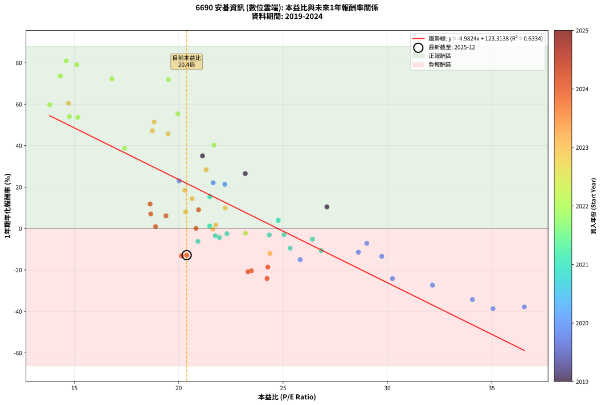
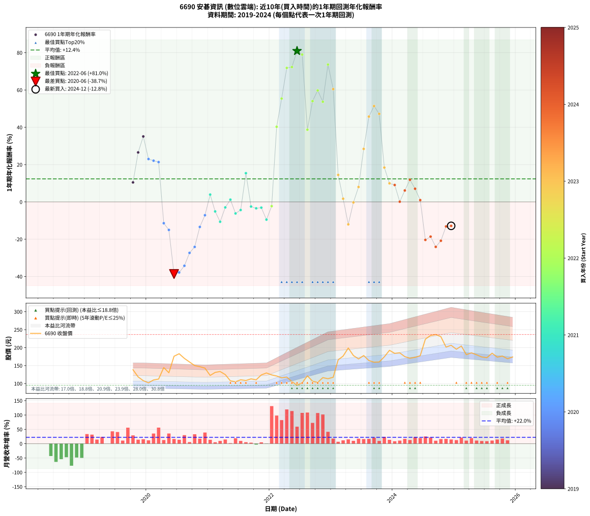

# 6690 安碁資訊 - 本益比與未來報酬率分析

!!! info "報告資訊"
    - **股票代號**: 6690
    - **公司名稱**: 安碁資訊
    - **產業別**: 數位雲端
    - **分析期間**: 2019-2024 (63 個數據點)
    - **資料來源**: Type 12 (ShowMonthlyK_ChartFlow) 月收盤價與本益比
    - **報酬率口徑**: 含現金股利 (簡化: 年度合計，假設每年7/1入帳)
    - **報告生成時間**: 2026-01-10 19:11:29 CST

## 📈 視覺化圖表

### 圖表1: 本益比 vs 未來報酬率關係

*圖表1：6690 安碁資訊 本益比與1年期未來報酬率關係 (2019-2024)*

### 圖表2: 歷年買入時點的1年期實際報酬率

*圖表2：6690 安碁資訊 歷年買入時點的1年期實際報酬率 (2019-2024)*

## 📍 買點訊號說明

本報告提供兩種買點提示訊號（顯示於圖表2的股價子圖中）：

### ▲ 小綠色三角形（回測驗證）
- **計算方式**: 使用全部歷史資料計算本益比第25百分位數
- **用途**: 事後驗證，顯示歷史上哪些時點確實為低估區
- **限制**: 當下無法判斷，僅供回測參考
- **特性**: 後見之明（Look-Ahead Bias）

### ▲ 小橘色三角形（即時訊號）
- **計算方式**: 使用截至當月的過去5年資料計算本益比第25百分位數
- **用途**: 實際投資決策，當時即可判斷
- **優勢**: 可操作性強，符合實務需求
- **特性**: 無後見之明，滾動窗口計算

!!! tip "如何使用兩種訊號"
    - **綠色▲** 幫助理解歷史估值機會，驗證策略有效性
    - **橘色▲** 可作為實際買進參考，但仍需搭配基本面分析
    - 兩種訊號重疊時，表示即時判斷與事後驗證一致，信心度較高
    - 僅有綠色▲時，表示當時無法判斷（需要未來資料才能確認）
    - 僅有橘色▲時，表示即時判斷為買點，但事後可能不是最佳時機

## 📊 估值分析摘要

| 指標 | 數值 |
|:---:|:---:|
| **目前本益比** (2024-12) | **20.38 倍** |
| **歷史平均本益比** | 22.27 倍 |
| **估值水準** | 🟡 合理範圍 |
| **預期1年年化報酬率** | **+21.77%** |
| **歷史平均報酬率** | +12.35% |
| **相關係數 (R²)** | 0.6334 |
| **趨勢線斜率** | -4.9824 |

!!! abstract "核心洞察"
    目前本益比接近歷史平均，預期報酬率符合長期趨勢

    根據歷史數據回測，6690 安碁資訊 在目前本益比 **20.4倍** 的估值水準下，
    預期未來1年年化報酬率約為 **+21.8%**。

    **重要提醒**: 本分析基於歷史數據統計，實際報酬率會受到公司基本面變化、產業趨勢、
    總體經濟環境等多重因素影響。R² = 0.63 表示本益比可解釋約 63.3% 的報酬率變異。

## 📈 歷史估值統計

### 最佳買點 (最高報酬率)

| 項目 | 數值 |
|:---:|:---:|
| 起始時間 | 2022-06 |
| 當時本益比 | 14.61 倍 |
| 起始價格 | 95.2 元 |
| 1年後價格 | 168.5 元 |
| **1年年化報酬率** | **+80.96%** |

### 最差買點 (最低報酬率)

| 項目 | 數值 |
|:---:|:---:|
| 起始時間 | 2020-06 |
| 當時本益比 | 35.06 倍 |
| 起始價格 | 176.0 元 |
| 1年後價格 | 105.0 元 |
| **1年年化報酬率** | **-38.66%** |

## 🎯 投資啟示

### 本益比與報酬率關係

趨勢線方程式: **y = -4.9824x + 123.3138**

!!! warning "強負相關"
    本益比與未來報酬率呈現強負相關。在高本益比時期買入，未來報酬率顯著較低；
    在低本益比時期買入，未來報酬率顯著較高。**估值紀律至關重要**。

### 估值區間建議

基於歷史數據分析:

- **🟢 低估區** (P/E < 17.8): 預期報酬率較高，可考慮增加持股
- **🟡 合理區** (P/E 17.8-26.7): 預期報酬率符合長期趨勢，正常持有
- **🔴 高估區** (P/E > 26.7): 預期報酬率較低，可考慮減碼或觀望

!!! danger "風險提示"
    - 過去表現不代表未來結果
    - 本分析假設公司基本面無重大結構性變化
    - 產業環境劇變可能使歷史規律失效
    - 應結合公司財報、產業趨勢、總體經濟等多重因素綜合判斷

!!! success "長期投資觀點"
    歷史數據顯示，在合理或低估的估值水準買入並長期持有，
    往往能獲得較佳的投資報酬。**耐心等待好價格**是價值投資的核心原則。

## 📊 數據品質

- **資料來源**: GoodInfo.tw Type 12 (ShowMonthlyK_ChartFlow)
- **資料頻率**: 月度收盤價與本益比
- **回測期間**: 2019-2024
- **數據點數量**: 63 個 (每個點代表一次1年期回測)

### 計算方法說明

1. **1年期年化報酬率**:
   - 對每個歷史時點，計算其後1年的實際投資報酬率
   - 期末價值(不含股利): 期末價格
   - 期末價值(含現金股利): 期末價格 + 持有期間內的現金股利合計 (簡化: 年度合計，假設每年7/1入帳)
   - 公式: 年化報酬率 = [(期末價值/期初價格)^(1/年數) - 1] × 100%

2. **本益比 (P/E Ratio)**:
   - 使用當時的月收盤價與EPS計算
   - 資料來源: Type 12 月度河流圖本益比數據

3. **趨勢線 (Linear Regression)**:
   - 使用最小平方法擬合線性趨勢線
   - R²值衡量本益比對報酬率的解釋能力

---

*本報告由 Stock Analysis System v1.9.0 自動生成*
*數據更新時間: 2026-01-10 19:11:29 CST*

## 📋 月度回測明細表

（每一列對應時間線圖中的一個買入點；可用來對照 SVG 圖上的每個點。）

| 買入月份 | 賣出月份 | 回測期限_年 | 實際持有年數 | 買入本益比_倍 | 買入收盤價_元 | 賣出收盤價_元 | 現金股利合計_元 | 總報酬率_pct | 年化報酬率_pct |
| --- | --- | --- | --- | --- | --- | --- | --- | --- | --- |
| 2019-10 | 2020-10 | 1 | 1.002 | 27.10 | 138.50 | 150.00 | 3.00 | +10.47 | +10.45 |
| 2019-11 | 2020-11 | 1 | 1.002 | 23.19 | 118.50 | 147.00 | 3.00 | +26.58 | +26.52 |
| 2019-12 | 2020-12 | 1 | 1.002 | 21.14 | 108.00 | 143.00 | 3.00 | +35.19 | +35.10 |
| 2020-01 | 2021-01 | 1 | 1.002 | 20.02 | 102.00 | 122.50 | 3.00 | +23.04 | +22.99 |
| 2020-02 | 2021-03 | 1 | 1.081 | 21.65 | 110.00 | 133.50 | 3.00 | +24.09 | +22.09 |
| 2020-03 | 2021-03 | 1 | 0.999 | 22.21 | 112.50 | 133.50 | 3.00 | +21.33 | +21.35 |
| 2020-04 | 2021-04 | 1 | 0.999 | 28.61 | 144.50 | 125.00 | 3.00 | -11.42 | -11.43 |
| 2020-05 | 2021-05 | 1 | 0.999 | 25.82 | 130.00 | 107.50 | 3.00 | -15.00 | -15.01 |
| 2020-06 | 2021-06 | 1 | 0.999 | 35.06 | 176.00 | 105.00 | 3.00 | -38.64 | -38.66 |
| 2020-07 | 2021-07 | 1 | 0.999 | 36.56 | 183.00 | 110.50 | 3.30 | -37.81 | -37.83 |
| 2020-08 | 2021-08 | 1 | 0.999 | 34.07 | 170.00 | 108.50 | 3.30 | -34.24 | -34.25 |
| 2020-09 | 2021-09 | 1 | 0.999 | 32.16 | 160.00 | 113.00 | 3.30 | -27.31 | -27.33 |
| 2020-10 | 2021-10 | 1 | 0.999 | 30.24 | 150.00 | 110.50 | 3.30 | -24.13 | -24.15 |
| 2020-11 | 2021-11 | 1 | 0.999 | 29.73 | 147.00 | 124.00 | 3.30 | -13.40 | -13.41 |
| 2020-12 | 2021-12 | 1 | 0.999 | 29.01 | 143.00 | 129.50 | 3.30 | -7.13 | -7.14 |
| 2021-01 | 2022-01 | 1 | 0.999 | 24.77 | 122.50 | 124.00 | 3.30 | +3.92 | +3.92 |
| 2021-02 | 2022-02 | 1 | 0.999 | 26.41 | 131.00 | 121.00 | 3.30 | -5.11 | -5.12 |
| 2021-03 | 2022-03 | 1 | 0.999 | 26.83 | 133.50 | 116.00 | 3.30 | -10.64 | -10.64 |
| 2021-04 | 2022-04 | 1 | 0.999 | 25.05 | 125.00 | 118.00 | 3.30 | -2.96 | -2.96 |
| 2021-05 | 2022-05 | 1 | 0.999 | 21.48 | 107.50 | 105.50 | 3.30 | +1.21 | +1.21 |
| 2021-06 | 2022-06 | 1 | 0.999 | 20.92 | 105.00 | 95.20 | 3.30 | -6.19 | -6.19 |
| 2021-07 | 2022-07 | 1 | 0.999 | 21.95 | 110.50 | 102.00 | 3.70 | -4.34 | -4.35 |
| 2021-08 | 2022-08 | 1 | 0.999 | 21.49 | 108.50 | 121.50 | 3.70 | +15.39 | +15.40 |
| 2021-09 | 2022-09 | 1 | 0.999 | 22.31 | 113.00 | 106.50 | 3.70 | -2.48 | -2.48 |
| 2021-10 | 2022-10 | 1 | 0.999 | 21.75 | 110.50 | 103.00 | 3.70 | -3.44 | -3.44 |
| 2021-11 | 2022-11 | 1 | 0.999 | 24.34 | 124.00 | 116.50 | 3.70 | -3.06 | -3.07 |
| 2021-12 | 2022-12 | 1 | 0.999 | 25.34 | 129.50 | 113.50 | 3.70 | -9.50 | -9.50 |
| 2022-01 | 2023-01 | 1 | 0.999 | 23.20 | 124.00 | 117.50 | 3.70 | -2.26 | -2.26 |
| 2022-02 | 2023-02 | 1 | 0.999 | 21.69 | 121.00 | 166.00 | 3.70 | +40.25 | +40.28 |
| 2022-03 | 2023-03 | 1 | 0.999 | 19.96 | 116.00 | 176.50 | 3.70 | +55.34 | +55.39 |
| 2022-04 | 2023-04 | 1 | 0.999 | 19.51 | 118.00 | 199.00 | 3.70 | +71.78 | +71.84 |
| 2022-05 | 2023-05 | 1 | 0.999 | 16.80 | 105.50 | 178.00 | 3.70 | +72.23 | +72.29 |
| 2022-06 | 2023-06 | 1 | 0.999 | 14.61 | 95.20 | 168.50 | 3.70 | +80.88 | +80.96 |
| 2022-07 | 2023-07 | 1 | 0.999 | 15.11 | 102.00 | 178.00 | 4.50 | +78.92 | +78.99 |
| 2022-08 | 2023-08 | 1 | 0.999 | 17.40 | 121.50 | 164.00 | 4.50 | +38.68 | +38.71 |
| 2022-09 | 2023-09 | 1 | 0.999 | 14.76 | 106.50 | 159.50 | 4.50 | +53.99 | +54.04 |
| 2022-10 | 2023-10 | 1 | 0.999 | 13.82 | 103.00 | 160.00 | 4.50 | +59.71 | +59.76 |
| 2022-11 | 2023-11 | 1 | 0.999 | 15.16 | 116.50 | 174.50 | 4.50 | +53.65 | +53.69 |
| 2022-12 | 2023-12 | 1 | 0.999 | 14.33 | 113.50 | 192.50 | 4.50 | +73.57 | +73.63 |
| 2023-01 | 2024-01 | 1 | 0.999 | 14.72 | 117.50 | 184.00 | 4.50 | +60.43 | +60.48 |
| 2023-02 | 2024-02 | 1 | 0.999 | 20.64 | 166.00 | 185.50 | 4.50 | +14.46 | +14.47 |
| 2023-03 | 2024-03 | 1 | 1.002 | 21.78 | 176.50 | 175.00 | 4.50 | +1.70 | +1.70 |
| 2023-04 | 2024-04 | 1 | 1.002 | 24.37 | 199.00 | 170.50 | 4.50 | -12.06 | -12.04 |
| 2023-05 | 2024-05 | 1 | 1.002 | 21.63 | 178.00 | 173.00 | 4.50 | -0.28 | -0.28 |
| 2023-06 | 2024-06 | 1 | 1.002 | 20.33 | 168.50 | 177.50 | 4.50 | +8.01 | +7.99 |
| 2023-07 | 2024-07 | 1 | 1.002 | 21.31 | 178.00 | 223.50 | 5.20 | +28.48 | +28.42 |
| 2023-08 | 2024-08 | 1 | 1.002 | 19.49 | 164.00 | 234.00 | 5.20 | +45.85 | +45.74 |
| 2023-09 | 2024-09 | 1 | 1.002 | 18.82 | 159.50 | 236.50 | 5.20 | +51.54 | +51.41 |
| 2023-10 | 2024-10 | 1 | 1.002 | 18.74 | 160.00 | 230.50 | 5.20 | +47.31 | +47.20 |
| 2023-11 | 2024-11 | 1 | 1.002 | 20.29 | 174.50 | 201.50 | 5.20 | +18.45 | +18.41 |
| 2023-12 | 2024-12 | 1 | 1.002 | 22.23 | 192.50 | 206.50 | 5.20 | +9.97 | +9.95 |
| 2024-01 | 2025-01 | 1 | 1.002 | 20.95 | 184.00 | 195.50 | 5.20 | +9.08 | +9.06 |
| 2024-02 | 2025-03 | 1 | 1.081 | 20.83 | 185.50 | 180.50 | 5.20 | +0.11 | +0.10 |
| 2024-03 | 2025-03 | 1 | 0.999 | 19.39 | 175.00 | 180.50 | 5.20 | +6.11 | +6.12 |
| 2024-04 | 2025-04 | 1 | 0.999 | 18.63 | 170.50 | 185.50 | 5.20 | +11.85 | +11.86 |
| 2024-05 | 2025-05 | 1 | 0.999 | 18.66 | 173.00 | 180.00 | 5.20 | +7.05 | +7.06 |
| 2024-06 | 2025-06 | 1 | 0.999 | 18.89 | 177.50 | 174.00 | 5.20 | +0.96 | +0.96 |
| 2024-07 | 2025-07 | 1 | 0.999 | 23.48 | 223.50 | 172.00 | 6.00 | -20.36 | -20.37 |
| 2024-08 | 2025-08 | 1 | 0.999 | 24.27 | 234.00 | 184.50 | 6.00 | -18.59 | -18.60 |
| 2024-09 | 2025-09 | 1 | 0.999 | 24.23 | 236.50 | 173.50 | 6.00 | -24.10 | -24.12 |
| 2024-10 | 2025-10 | 1 | 0.999 | 23.32 | 230.50 | 176.50 | 6.00 | -20.82 | -20.84 |
| 2024-11 | 2025-11 | 1 | 0.999 | 20.13 | 201.50 | 169.00 | 6.00 | -13.15 | -13.16 |
| 2024-12 | 2025-12 | 1 | 0.999 | 20.38 | 206.50 | 174.00 | 6.00 | -12.83 | -12.84 |
