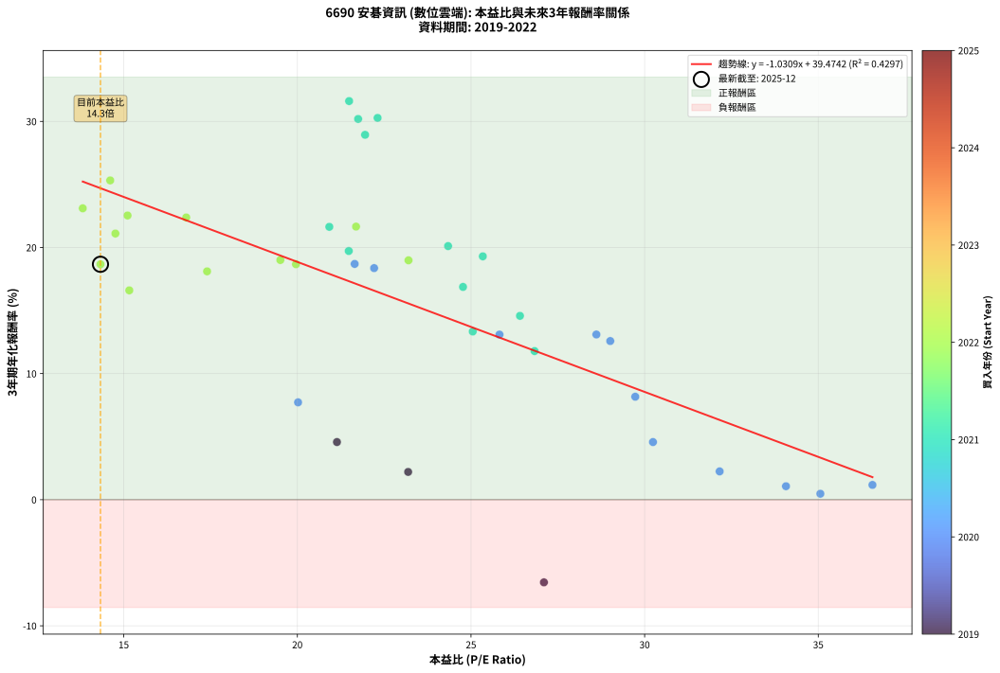
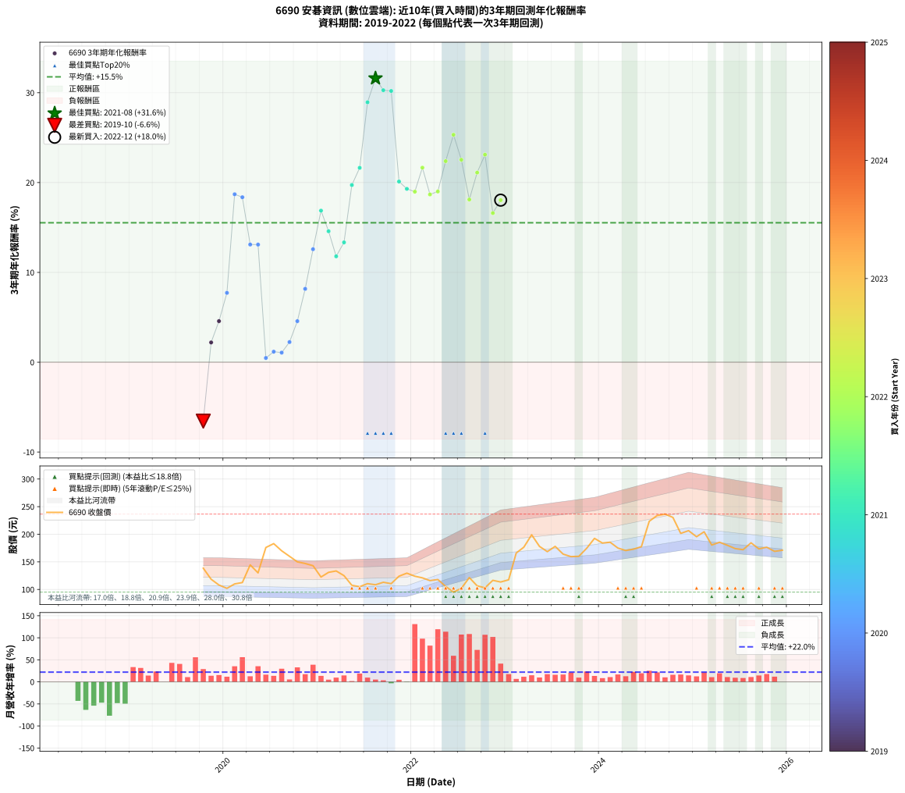

# 6690 安碁資訊 - 本益比與未來報酬率分析

!!! info "報告資訊"
    - **股票代號**: 6690
    - **公司名稱**: 安碁資訊
    - **產業別**: 數位雲端
    - **分析期間**: 2019-2022 (39 個數據點)
    - **資料來源**: Type 12 (ShowMonthlyK_ChartFlow) 月收盤價與本益比
    - **報酬率口徑**: 含現金股利 (簡化: 年度合計，假設每年7/1入帳)
    - **報告生成時間**: 2026-01-05 01:13:21 CST

## 📈 視覺化圖表

### 圖表1: 本益比 vs 未來報酬率關係

*圖表1：6690 安碁資訊 本益比與3年期未來報酬率關係 (2019-2022)*

### 圖表2: 歷年買入時點的3年期實際報酬率

*圖表2：6690 安碁資訊 歷年買入時點的3年期實際報酬率 (2019-2022)*

## 📍 買點訊號說明

本報告提供兩種買點提示訊號（顯示於圖表2的股價子圖中）：

### ▲ 小綠色三角形（回測驗證）
- **計算方式**: 使用全部歷史資料計算本益比第25百分位數
- **用途**: 事後驗證，顯示歷史上哪些時點確實為低估區
- **限制**: 當下無法判斷，僅供回測參考
- **特性**: 後見之明（Look-Ahead Bias）

### ▲ 小橘色三角形（即時訊號）
- **計算方式**: 使用截至當月的過去5年資料計算本益比第25百分位數
- **用途**: 實際投資決策，當時即可判斷
- **優勢**: 可操作性強，符合實務需求
- **特性**: 無後見之明，滾動窗口計算

!!! tip "如何使用兩種訊號"
    - **綠色▲** 幫助理解歷史估值機會，驗證策略有效性
    - **橘色▲** 可作為實際買進參考，但仍需搭配基本面分析
    - 兩種訊號重疊時，表示即時判斷與事後驗證一致，信心度較高
    - 僅有綠色▲時，表示當時無法判斷（需要未來資料才能確認）
    - 僅有橘色▲時，表示即時判斷為買點，但事後可能不是最佳時機

## 📊 估值分析摘要

| 指標 | 數值 |
|:---:|:---:|
| **目前本益比** (2022-12) | **14.33 倍** |
| **歷史平均本益比** | 23.22 倍 |
| **估值水準** | 🟢 相對低估 |
| **預期3年年化報酬率** | **+24.70%** |
| **歷史平均報酬率** | +15.54% |
| **相關係數 (R²)** | 0.4297 |
| **趨勢線斜率** | -1.0309 |

!!! abstract "核心洞察"
    目前本益比顯著低於歷史平均，預期未來報酬率可能較高

    根據歷史數據回測，6690 安碁資訊 在目前本益比 **14.3倍** 的估值水準下，
    預期未來3年年化報酬率約為 **+24.7%**。

    **重要提醒**: 本分析基於歷史數據統計，實際報酬率會受到公司基本面變化、產業趨勢、
    總體經濟環境等多重因素影響。R² = 0.43 表示本益比可解釋約 43.0% 的報酬率變異。

## 📈 歷史估值統計

### 最佳買點 (最高報酬率)

| 項目 | 數值 |
|:---:|:---:|
| 起始時間 | 2021-08 |
| 當時本益比 | 21.49 倍 |
| 起始價格 | 108.5 元 |
| 3年後價格 | 234.0 元 |
| **3年年化報酬率** | **+31.61%** |

### 最差買點 (最低報酬率)

| 項目 | 數值 |
|:---:|:---:|
| 起始時間 | 2019-10 |
| 當時本益比 | 27.10 倍 |
| 起始價格 | 138.5 元 |
| 3年後價格 | 103.0 元 |
| **3年年化報酬率** | **-6.56%** |

## 🎯 投資啟示

### 本益比與報酬率關係

趨勢線方程式: **y = -1.0309x + 39.4742**

!!! warning "強負相關"
    本益比與未來報酬率呈現強負相關。在高本益比時期買入，未來報酬率顯著較低；
    在低本益比時期買入，未來報酬率顯著較高。**估值紀律至關重要**。

### 估值區間建議

基於歷史數據分析:

- **🟢 低估區** (P/E < 18.6): 預期報酬率較高，可考慮增加持股
- **🟡 合理區** (P/E 18.6-27.9): 預期報酬率符合長期趨勢，正常持有
- **🔴 高估區** (P/E > 27.9): 預期報酬率較低，可考慮減碼或觀望

!!! danger "風險提示"
    - 過去表現不代表未來結果
    - 本分析假設公司基本面無重大結構性變化
    - 產業環境劇變可能使歷史規律失效
    - 應結合公司財報、產業趨勢、總體經濟等多重因素綜合判斷

!!! success "長期投資觀點"
    歷史數據顯示，在合理或低估的估值水準買入並長期持有，
    往往能獲得較佳的投資報酬。**耐心等待好價格**是價值投資的核心原則。

## 📊 數據品質

- **資料來源**: GoodInfo.tw Type 12 (ShowMonthlyK_ChartFlow)
- **資料頻率**: 月度收盤價與本益比
- **回測期間**: 2019-2022
- **數據點數量**: 39 個 (每個點代表一次3年期回測)

### 計算方法說明

1. **3年期年化報酬率**:
   - 對每個歷史時點，計算其後3年的實際投資報酬率
   - 期末價值(不含股利): 期末價格
   - 期末價值(含現金股利): 期末價格 + 持有期間內的現金股利合計 (簡化: 年度合計，假設每年7/1入帳)
   - 公式: 年化報酬率 = [(期末價值/期初價格)^(1/年數) - 1] × 100%

2. **本益比 (P/E Ratio)**:
   - 使用當時的月收盤價與EPS計算
   - 資料來源: Type 12 月度河流圖本益比數據

3. **趨勢線 (Linear Regression)**:
   - 使用最小平方法擬合線性趨勢線
   - R²值衡量本益比對報酬率的解釋能力

---

*本報告由 Stock Analysis System v1.9.0 自動生成*
*數據更新時間: 2026-01-05 01:13:21 CST*

## 📋 月度回測明細表

（每一列對應時間線圖中的一個買入點；可用來對照 SVG 圖上的每個點。）

| 買入月份 | 賣出月份 | 回測期限_年 | 實際持有年數 | 買入本益比_倍 | 買入收盤價_元 | 賣出收盤價_元 | 現金股利合計_元 | 總報酬率_pct | 年化報酬率_pct |
| --- | --- | --- | --- | --- | --- | --- | --- | --- | --- |
| 2019-10 | 2022-10 | 3 | 3.001 | 27.10 | 138.50 | 103.00 | 10.00 | -18.41 | -6.56 |
| 2019-11 | 2022-11 | 3 | 3.001 | 23.19 | 118.50 | 116.50 | 10.00 | +6.75 | +2.20 |
| 2019-12 | 2022-12 | 3 | 3.001 | 21.14 | 108.00 | 113.50 | 10.00 | +14.35 | +4.57 |
| 2020-01 | 2023-01 | 3 | 3.001 | 20.02 | 102.00 | 117.50 | 10.00 | +25.00 | +7.72 |
| 2020-02 | 2023-03 | 3 | 3.080 | 21.65 | 110.00 | 176.50 | 10.00 | +69.55 | +18.70 |
| 2020-03 | 2023-03 | 3 | 2.998 | 22.21 | 112.50 | 176.50 | 10.00 | +65.78 | +18.37 |
| 2020-04 | 2023-04 | 3 | 2.998 | 28.61 | 144.50 | 199.00 | 10.00 | +44.64 | +13.10 |
| 2020-05 | 2023-05 | 3 | 2.998 | 25.82 | 130.00 | 178.00 | 10.00 | +44.62 | +13.09 |
| 2020-06 | 2023-06 | 3 | 2.998 | 35.06 | 176.00 | 168.50 | 10.00 | +1.42 | +0.47 |
| 2020-07 | 2023-07 | 3 | 2.998 | 36.56 | 183.00 | 178.00 | 11.50 | +3.55 | +1.17 |
| 2020-08 | 2023-08 | 3 | 2.998 | 34.07 | 170.00 | 164.00 | 11.50 | +3.24 | +1.07 |
| 2020-09 | 2023-09 | 3 | 2.998 | 32.16 | 160.00 | 159.50 | 11.50 | +6.88 | +2.24 |
| 2020-10 | 2023-10 | 3 | 2.998 | 30.24 | 150.00 | 160.00 | 11.50 | +14.33 | +4.57 |
| 2020-11 | 2023-11 | 3 | 2.998 | 29.73 | 147.00 | 174.50 | 11.50 | +26.53 | +8.17 |
| 2020-12 | 2023-12 | 3 | 2.998 | 29.01 | 143.00 | 192.50 | 11.50 | +42.66 | +12.58 |
| 2021-01 | 2024-01 | 3 | 2.998 | 24.77 | 122.50 | 184.00 | 11.50 | +59.59 | +16.87 |
| 2021-02 | 2024-02 | 3 | 2.998 | 26.41 | 131.00 | 185.50 | 11.50 | +50.38 | +14.58 |
| 2021-03 | 2024-03 | 3 | 3.001 | 26.83 | 133.50 | 175.00 | 11.50 | +39.70 | +11.79 |
| 2021-04 | 2024-04 | 3 | 3.001 | 25.05 | 125.00 | 170.50 | 11.50 | +45.60 | +13.34 |
| 2021-05 | 2024-05 | 3 | 3.001 | 21.48 | 107.50 | 173.00 | 11.50 | +71.63 | +19.72 |
| 2021-06 | 2024-06 | 3 | 3.001 | 20.92 | 105.00 | 177.50 | 11.50 | +80.00 | +21.64 |
| 2021-07 | 2024-07 | 3 | 3.001 | 21.95 | 110.50 | 223.50 | 13.40 | +114.39 | +28.94 |
| 2021-08 | 2024-08 | 3 | 3.001 | 21.49 | 108.50 | 234.00 | 13.40 | +128.02 | +31.61 |
| 2021-09 | 2024-09 | 3 | 3.001 | 22.31 | 113.00 | 236.50 | 13.40 | +121.15 | +30.28 |
| 2021-10 | 2024-10 | 3 | 3.001 | 21.75 | 110.50 | 230.50 | 13.40 | +120.72 | +30.19 |
| 2021-11 | 2024-11 | 3 | 3.001 | 24.34 | 124.00 | 201.50 | 13.40 | +73.31 | +20.11 |
| 2021-12 | 2024-12 | 3 | 3.001 | 25.34 | 129.50 | 206.50 | 13.40 | +69.81 | +19.30 |
| 2022-01 | 2025-01 | 3 | 3.001 | 23.20 | 124.00 | 195.50 | 13.40 | +68.47 | +18.98 |
| 2022-02 | 2025-02 | 3 | 3.001 | 21.69 | 121.00 | 204.50 | 13.40 | +80.08 | +21.66 |
| 2022-03 | 2025-03 | 3 | 3.001 | 19.96 | 116.00 | 180.50 | 13.40 | +67.16 | +18.67 |
| 2022-04 | 2025-04 | 3 | 3.001 | 19.51 | 118.00 | 185.50 | 13.40 | +68.56 | +19.01 |
| 2022-05 | 2025-05 | 3 | 3.001 | 16.80 | 105.50 | 180.00 | 13.40 | +83.32 | +22.38 |
| 2022-06 | 2025-06 | 3 | 3.001 | 14.61 | 95.20 | 174.00 | 13.40 | +96.85 | +25.32 |
| 2022-07 | 2025-07 | 3 | 3.001 | 15.11 | 102.00 | 172.00 | 15.70 | +84.02 | +22.54 |
| 2022-08 | 2025-08 | 3 | 3.001 | 17.40 | 121.50 | 184.50 | 15.70 | +64.77 | +18.11 |
| 2022-09 | 2025-09 | 3 | 3.001 | 14.76 | 106.50 | 173.50 | 15.70 | +77.65 | +21.11 |
| 2022-10 | 2025-10 | 3 | 3.001 | 13.82 | 103.00 | 176.50 | 15.70 | +86.60 | +23.11 |
| 2022-11 | 2025-11 | 3 | 3.001 | 15.16 | 116.50 | 169.00 | 15.70 | +58.54 | +16.60 |
| 2022-12 | 2025-12 | 3 | 3.001 | 14.33 | 113.50 | 174.00 | 15.70 | +67.14 | +18.67 |
