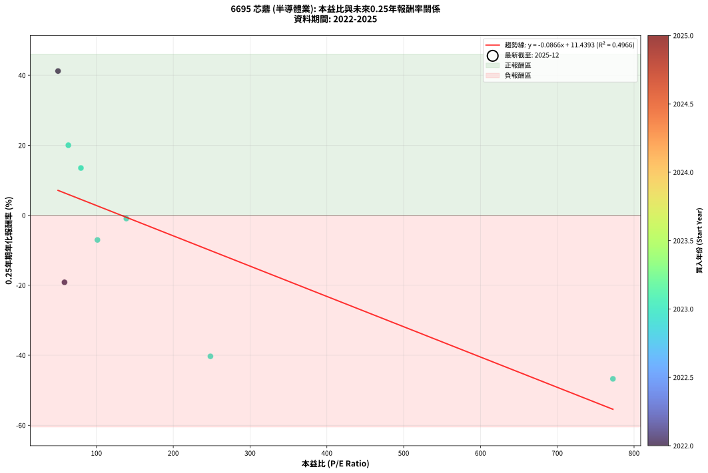
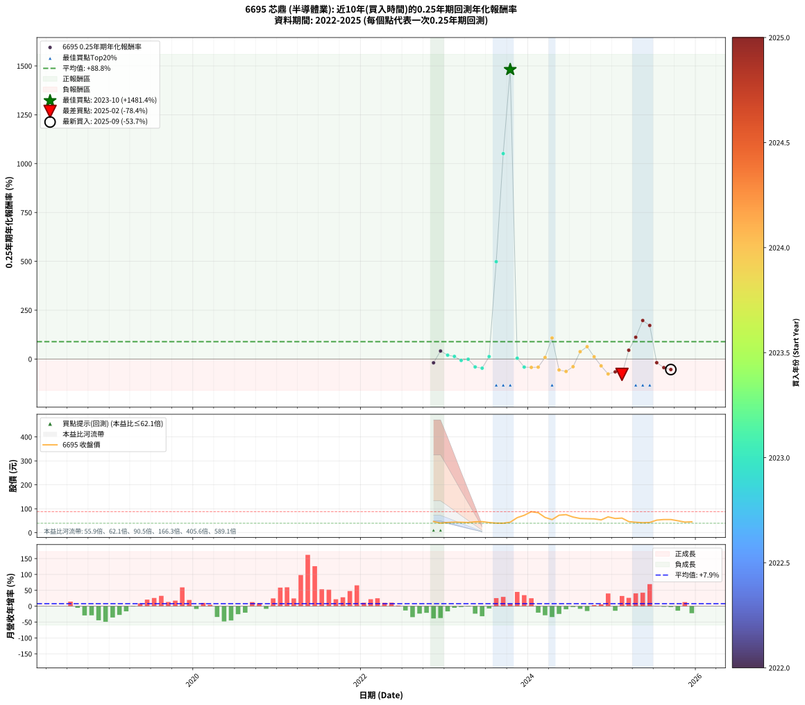

# 6695 芯鼎 - 本益比與未來報酬率分析

!!! info "報告資訊"
    - **股票代號**: 6695
    - **公司名稱**: 芯鼎
    - **產業別**: 半導體業
    - **分析期間**: 2022-2025 (35 個數據點)
    - **資料來源**: Type 12 (ShowMonthlyK_ChartFlow) 月收盤價與本益比
    - **報酬率口徑**: 含現金股利 (簡化: 年度合計，假設每年7/1入帳)
    - **報告生成時間**: 2026-01-06 19:12:45 CST

## 📈 視覺化圖表

### 圖表1: 本益比 vs 未來報酬率關係

*圖表1：6695 芯鼎 本益比與0.25年期未來報酬率關係 (2022-2025)*

### 圖表2: 歷年買入時點的0.25年期實際報酬率

*圖表2：6695 芯鼎 歷年買入時點的0.25年期實際報酬率 (2022-2025)*

## 📍 買點訊號說明

本報告提供兩種買點提示訊號（顯示於圖表2的股價子圖中）：

### ▲ 小綠色三角形（回測驗證）
- **計算方式**: 使用全部歷史資料計算本益比第25百分位數
- **用途**: 事後驗證，顯示歷史上哪些時點確實為低估區
- **限制**: 當下無法判斷，僅供回測參考
- **特性**: 後見之明（Look-Ahead Bias）

### ▲ 小橘色三角形（即時訊號）
- **計算方式**: 使用截至當月的過去5年資料計算本益比第25百分位數
- **用途**: 實際投資決策，當時即可判斷
- **優勢**: 可操作性強，符合實務需求
- **特性**: 無後見之明，滾動窗口計算

!!! tip "如何使用兩種訊號"
    - **綠色▲** 幫助理解歷史估值機會，驗證策略有效性
    - **橘色▲** 可作為實際買進參考，但仍需搭配基本面分析
    - 兩種訊號重疊時，表示即時判斷與事後驗證一致，信心度較高
    - 僅有綠色▲時，表示當時無法判斷（需要未來資料才能確認）
    - 僅有橘色▲時，表示即時判斷為買點，但事後可能不是最佳時機

## 📊 估值分析摘要

| 指標 | 數值 |
|:---:|:---:|
| **目前本益比** (2025-09) | **nan 倍** |
| **歷史平均本益比** | 189.08 倍 |
| **估值水準** | 🟡 合理範圍 |
| **預期0.25年年化報酬率** | **+nan%** |
| **歷史平均報酬率** | +88.80% |
| **相關係數 (R²)** | 0.4966 |
| **趨勢線斜率** | -0.0866 |

!!! abstract "核心洞察"
    目前本益比接近歷史平均，預期報酬率符合長期趨勢

    根據歷史數據回測，6695 芯鼎 在目前本益比 **nan倍** 的估值水準下，
    預期未來0.25年年化報酬率約為 **+nan%**。

    **重要提醒**: 本分析基於歷史數據統計，實際報酬率會受到公司基本面變化、產業趨勢、
    總體經濟環境等多重因素影響。R² = 0.50 表示本益比可解釋約 49.7% 的報酬率變異。

## 📈 歷史估值統計

### 最佳買點 (最高報酬率)

| 項目 | 數值 |
|:---:|:---:|
| 起始時間 | 2023-10 |
| 當時本益比 | nan 倍 |
| 起始價格 | 43.8 元 |
| 0.25年後價格 | 87.8 元 |
| **0.25年年化報酬率** | **+1481.44%** |

### 最差買點 (最低報酬率)

| 項目 | 數值 |
|:---:|:---:|
| 起始時間 | 2025-02 |
| 當時本益比 | nan 倍 |
| 起始價格 | 61.0 元 |
| 0.25年後價格 | 41.8 元 |
| **0.25年年化報酬率** | **-78.43%** |

## 🎯 投資啟示

### 本益比與報酬率關係

趨勢線方程式: **y = -0.0866x + 11.4393**

!!! note "負相關"
    本益比與未來報酬率呈現負相關。較低的本益比通常帶來較高的未來報酬率，
    但相關性不算非常強。**估值仍是重要參考指標之一**。

### 估值區間建議

基於歷史數據分析:

- **🟢 低估區** (P/E < 151.3): 預期報酬率較高，可考慮增加持股
- **🟡 合理區** (P/E 151.3-226.9): 預期報酬率符合長期趨勢，正常持有
- **🔴 高估區** (P/E > 226.9): 預期報酬率較低，可考慮減碼或觀望

!!! danger "風險提示"
    - 過去表現不代表未來結果
    - 本分析假設公司基本面無重大結構性變化
    - 產業環境劇變可能使歷史規律失效
    - 應結合公司財報、產業趨勢、總體經濟等多重因素綜合判斷

!!! success "長期投資觀點"
    歷史數據顯示，在合理或低估的估值水準買入並長期持有，
    往往能獲得較佳的投資報酬。**耐心等待好價格**是價值投資的核心原則。

## 📊 數據品質

- **資料來源**: GoodInfo.tw Type 12 (ShowMonthlyK_ChartFlow)
- **資料頻率**: 月度收盤價與本益比
- **回測期間**: 2022-2025
- **數據點數量**: 35 個 (每個點代表一次0.25年期回測)

### 計算方法說明

1. **0.25年期年化報酬率**:
   - 對每個歷史時點，計算其後0.25年的實際投資報酬率
   - 期末價值(不含股利): 期末價格
   - 期末價值(含現金股利): 期末價格 + 持有期間內的現金股利合計 (簡化: 年度合計，假設每年7/1入帳)
   - 公式: 年化報酬率 = [(期末價值/期初價格)^(1/年數) - 1] × 100%

2. **本益比 (P/E Ratio)**:
   - 使用當時的月收盤價與EPS計算
   - 資料來源: Type 12 月度河流圖本益比數據

3. **趨勢線 (Linear Regression)**:
   - 使用最小平方法擬合線性趨勢線
   - R²值衡量本益比對報酬率的解釋能力

---

*本報告由 Stock Analysis System v1.9.0 自動生成*
*數據更新時間: 2026-01-06 19:12:45 CST*

## 📋 月度回測明細表

（每一列對應時間線圖中的一個買入點；可用來對照 SVG 圖上的每個點。）

| 買入月份 | 賣出月份 | 回測期限_年 | 實際持有年數 | 買入本益比_倍 | 買入收盤價_元 | 賣出收盤價_元 | 現金股利合計_元 | 總報酬率_pct | 年化報酬率_pct |
| --- | --- | --- | --- | --- | --- | --- | --- | --- | --- |
| 2022-11 | 2023-03 | 0.25 | 0.329 | 58.38 | 46.70 | 43.55 | 0.00 | -6.75 | -19.15 |
| 2022-12 | 2023-03 | 0.25 | 0.246 | 50.00 | 40.00 | 43.55 | 0.00 | +8.87 | +41.21 |
| 2023-01 | 2023-05 | 0.25 | 0.329 | 63.40 | 42.90 | 45.55 | 0.00 | +6.18 | +20.01 |
| 2023-02 | 2023-05 | 0.25 | 0.246 | 79.79 | 44.15 | 45.55 | 0.00 | +3.17 | +13.51 |
| 2023-03 | 2023-07 | 0.25 | 0.334 | 101.30 | 43.55 | 42.50 | 0.00 | -2.41 | -7.05 |
| 2023-04 | 2023-07 | 0.25 | 0.249 | 138.90 | 42.60 | 42.50 | 0.00 | -0.23 | -0.94 |
| 2023-05 | 2023-08 | 0.25 | 0.252 | 248.40 | 45.55 | 40.00 | 0.00 | -12.18 | -40.30 |
| 2023-06 | 2023-09 | 0.25 | 0.252 | 772.50 | 46.35 | 39.55 | 0.00 | -14.67 | -46.73 |
| 2023-07 | 2023-10 | 0.25 | 0.252 |  | 42.50 | 43.80 | 0.00 | +3.06 | +12.71 |
| 2023-08 | 2023-12 | 0.25 | 0.334 |  | 40.00 | 72.70 | 0.00 | +81.75 | +498.17 |
| 2023-09 | 2023-12 | 0.25 | 0.249 |  | 39.55 | 72.70 | 0.00 | +83.82 | +1051.29 |
| 2023-10 | 2024-01 | 0.25 | 0.252 |  | 43.80 | 87.80 | 0.00 | +100.46 | +1481.44 |
| 2023-11 | 2024-03 | 0.25 | 0.331 |  | 62.80 | 63.70 | 0.00 | +1.43 | +4.39 |
| 2023-12 | 2024-03 | 0.25 | 0.249 |  | 72.70 | 63.70 | 0.00 | -12.38 | -41.17 |
| 2024-01 | 2024-05 | 0.25 | 0.331 |  | 87.80 | 73.00 | 0.00 | -16.86 | -42.72 |
| 2024-02 | 2024-05 | 0.25 | 0.249 |  | 83.50 | 73.00 | 0.00 | -12.57 | -41.69 |
| 2024-03 | 2024-07 | 0.25 | 0.334 |  | 63.70 | 65.40 | 0.00 | +2.67 | +8.20 |
| 2024-04 | 2024-07 | 0.25 | 0.249 |  | 54.50 | 65.40 | 0.00 | +20.00 | +107.88 |
| 2024-05 | 2024-08 | 0.25 | 0.252 |  | 73.00 | 59.40 | 0.00 | -18.63 | -55.89 |
| 2024-06 | 2024-09 | 0.25 | 0.252 |  | 75.40 | 58.50 | 0.00 | -22.41 | -63.49 |
| 2024-07 | 2024-10 | 0.25 | 0.252 |  | 65.40 | 57.70 | 0.00 | -11.77 | -39.18 |
| 2024-08 | 2024-12 | 0.25 | 0.334 |  | 59.40 | 66.10 | 0.00 | +11.28 | +37.71 |
| 2024-09 | 2024-12 | 0.25 | 0.249 |  | 58.50 | 66.10 | 0.00 | +12.99 | +63.27 |
| 2024-10 | 2025-01 | 0.25 | 0.252 |  | 57.70 | 59.30 | 0.00 | +2.77 | +11.47 |
| 2024-11 | 2025-03 | 0.25 | 0.329 |  | 53.40 | 46.35 | 0.00 | -13.20 | -35.01 |
| 2024-12 | 2025-03 | 0.25 | 0.246 |  | 66.10 | 46.35 | 0.00 | -29.88 | -76.32 |
| 2025-01 | 2025-05 | 0.25 | 0.329 |  | 59.30 | 41.80 | 0.00 | -29.51 | -65.51 |
| 2025-02 | 2025-05 | 0.25 | 0.246 |  | 61.00 | 41.80 | 0.00 | -31.48 | -78.43 |
| 2025-03 | 2025-07 | 0.25 | 0.334 |  | 46.35 | 52.50 | 0.00 | +13.27 | +45.21 |
| 2025-04 | 2025-07 | 0.25 | 0.249 |  | 43.55 | 52.50 | 0.00 | +20.55 | +111.74 |
| 2025-05 | 2025-08 | 0.25 | 0.252 |  | 41.80 | 55.00 | 0.00 | +31.58 | +197.29 |
| 2025-06 | 2025-09 | 0.25 | 0.252 |  | 42.75 | 55.00 | 0.00 | +28.65 | +171.92 |
| 2025-07 | 2025-10 | 0.25 | 0.252 |  | 52.50 | 49.85 | 0.00 | -5.05 | -18.59 |
| 2025-08 | 2025-12 | 0.25 | 0.334 |  | 55.00 | 45.40 | 0.00 | -17.45 | -43.69 |
| 2025-09 | 2025-12 | 0.25 | 0.249 |  | 55.00 | 45.40 | 0.00 | -17.45 | -53.69 |
