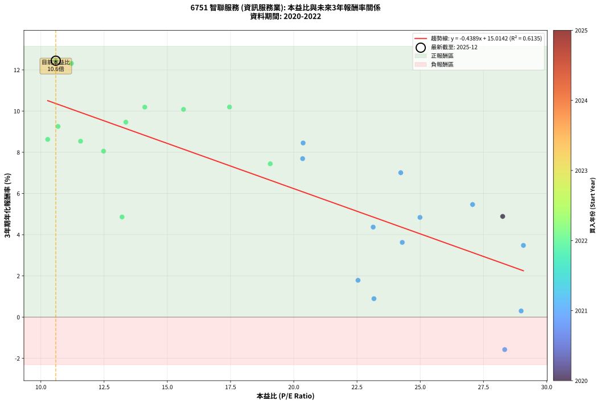
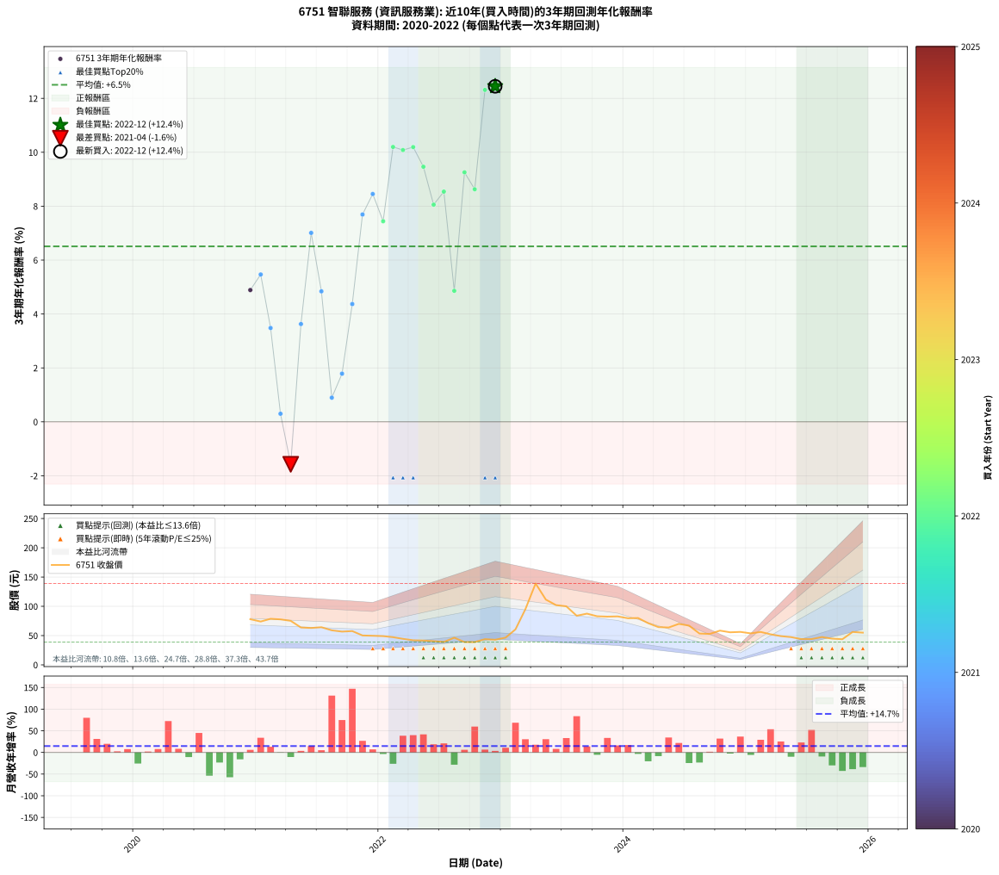

# 6751 智聯服務 - 本益比與未來報酬率分析

!!! info "報告資訊"
    - **股票代號**: 6751
    - **公司名稱**: 智聯服務
    - **產業別**: 資訊服務業
    - **分析期間**: 2020-2022 (25 個數據點)
    - **資料來源**: Type 12 (ShowMonthlyK_ChartFlow) 月收盤價與本益比
    - **報酬率口徑**: 含現金股利 (簡化: 年度合計，假設每年7/1入帳)
    - **報告生成時間**: 2026-01-06 23:14:41 CST

## 📈 視覺化圖表

### 圖表1: 本益比 vs 未來報酬率關係

*圖表1：6751 智聯服務 本益比與3年期未來報酬率關係 (2020-2022)*

### 圖表2: 歷年買入時點的3年期實際報酬率

*圖表2：6751 智聯服務 歷年買入時點的3年期實際報酬率 (2020-2022)*

## 📍 買點訊號說明

本報告提供兩種買點提示訊號（顯示於圖表2的股價子圖中）：

### ▲ 小綠色三角形（回測驗證）
- **計算方式**: 使用全部歷史資料計算本益比第25百分位數
- **用途**: 事後驗證，顯示歷史上哪些時點確實為低估區
- **限制**: 當下無法判斷，僅供回測參考
- **特性**: 後見之明（Look-Ahead Bias）

### ▲ 小橘色三角形（即時訊號）
- **計算方式**: 使用截至當月的過去5年資料計算本益比第25百分位數
- **用途**: 實際投資決策，當時即可判斷
- **優勢**: 可操作性強，符合實務需求
- **特性**: 無後見之明，滾動窗口計算

!!! tip "如何使用兩種訊號"
    - **綠色▲** 幫助理解歷史估值機會，驗證策略有效性
    - **橘色▲** 可作為實際買進參考，但仍需搭配基本面分析
    - 兩種訊號重疊時，表示即時判斷與事後驗證一致，信心度較高
    - 僅有綠色▲時，表示當時無法判斷（需要未來資料才能確認）
    - 僅有橘色▲時，表示即時判斷為買點，但事後可能不是最佳時機

## 📊 估值分析摘要

| 指標 | 數值 |
|:---:|:---:|
| **目前本益比** (2022-12) | **10.59 倍** |
| **歷史平均本益比** | 19.38 倍 |
| **估值水準** | 🟢 相對低估 |
| **預期3年年化報酬率** | **+10.37%** |
| **歷史平均報酬率** | +6.51% |
| **相關係數 (R²)** | 0.6135 |
| **趨勢線斜率** | -0.4389 |

!!! abstract "核心洞察"
    目前本益比顯著低於歷史平均，預期未來報酬率可能較高

    根據歷史數據回測，6751 智聯服務 在目前本益比 **10.6倍** 的估值水準下，
    預期未來3年年化報酬率約為 **+10.4%**。

    **重要提醒**: 本分析基於歷史數據統計，實際報酬率會受到公司基本面變化、產業趨勢、
    總體經濟環境等多重因素影響。R² = 0.61 表示本益比可解釋約 61.3% 的報酬率變異。

## 📈 歷史估值統計

### 最佳買點 (最高報酬率)

| 項目 | 數值 |
|:---:|:---:|
| 起始時間 | 2022-12 |
| 當時本益比 | 10.59 倍 |
| 起始價格 | 42.9 元 |
| 3年後價格 | 55.0 元 |
| **3年年化報酬率** | **+12.45%** |

### 最差買點 (最低報酬率)

| 項目 | 數值 |
|:---:|:---:|
| 起始時間 | 2021-04 |
| 當時本益比 | 28.34 倍 |
| 起始價格 | 75.2 元 |
| 3年後價格 | 64.5 元 |
| **3年年化報酬率** | **-1.58%** |

## 🎯 投資啟示

### 本益比與報酬率關係

趨勢線方程式: **y = -0.4389x + 15.0142**

!!! note "負相關"
    本益比與未來報酬率呈現負相關。較低的本益比通常帶來較高的未來報酬率，
    但相關性不算非常強。**估值仍是重要參考指標之一**。

### 估值區間建議

基於歷史數據分析:

- **🟢 低估區** (P/E < 15.5): 預期報酬率較高，可考慮增加持股
- **🟡 合理區** (P/E 15.5-23.3): 預期報酬率符合長期趨勢，正常持有
- **🔴 高估區** (P/E > 23.3): 預期報酬率較低，可考慮減碼或觀望

!!! danger "風險提示"
    - 過去表現不代表未來結果
    - 本分析假設公司基本面無重大結構性變化
    - 產業環境劇變可能使歷史規律失效
    - 應結合公司財報、產業趨勢、總體經濟等多重因素綜合判斷

!!! success "長期投資觀點"
    歷史數據顯示，在合理或低估的估值水準買入並長期持有，
    往往能獲得較佳的投資報酬。**耐心等待好價格**是價值投資的核心原則。

## 📊 數據品質

- **資料來源**: GoodInfo.tw Type 12 (ShowMonthlyK_ChartFlow)
- **資料頻率**: 月度收盤價與本益比
- **回測期間**: 2020-2022
- **數據點數量**: 25 個 (每個點代表一次3年期回測)

### 計算方法說明

1. **3年期年化報酬率**:
   - 對每個歷史時點，計算其後3年的實際投資報酬率
   - 期末價值(不含股利): 期末價格
   - 期末價值(含現金股利): 期末價格 + 持有期間內的現金股利合計 (簡化: 年度合計，假設每年7/1入帳)
   - 公式: 年化報酬率 = [(期末價值/期初價格)^(1/年數) - 1] × 100%

2. **本益比 (P/E Ratio)**:
   - 使用當時的月收盤價與EPS計算
   - 資料來源: Type 12 月度河流圖本益比數據

3. **趨勢線 (Linear Regression)**:
   - 使用最小平方法擬合線性趨勢線
   - R²值衡量本益比對報酬率的解釋能力

---

*本報告由 Stock Analysis System v1.9.0 自動生成*
*數據更新時間: 2026-01-06 23:14:41 CST*

## 📋 月度回測明細表

（每一列對應時間線圖中的一個買入點；可用來對照 SVG 圖上的每個點。）

| 買入月份 | 賣出月份 | 回測期限_年 | 實際持有年數 | 買入本益比_倍 | 買入收盤價_元 | 賣出收盤價_元 | 現金股利合計_元 | 總報酬率_pct | 年化報酬率_pct |
| --- | --- | --- | --- | --- | --- | --- | --- | --- | --- |
| 2020-12 | 2023-12 | 3 | 2.998 | 28.26 | 78.00 | 82.80 | 7.20 | +15.38 | +4.89 |
| 2021-01 | 2024-01 | 3 | 2.998 | 27.07 | 74.00 | 79.60 | 7.20 | +17.30 | +5.47 |
| 2021-02 | 2024-02 | 3 | 2.998 | 29.08 | 78.70 | 80.00 | 7.20 | +10.80 | +3.48 |
| 2021-03 | 2024-03 | 3 | 3.001 | 28.99 | 77.70 | 71.20 | 7.20 | +0.90 | +0.30 |
| 2021-04 | 2024-04 | 3 | 3.001 | 28.34 | 75.20 | 64.50 | 7.20 | -4.65 | -1.58 |
| 2021-05 | 2024-05 | 3 | 3.001 | 24.29 | 63.80 | 63.80 | 7.20 | +11.29 | +3.63 |
| 2021-06 | 2024-06 | 3 | 3.001 | 24.23 | 63.00 | 70.00 | 7.20 | +22.54 | +7.01 |
| 2021-07 | 2024-07 | 3 | 3.001 | 24.99 | 64.30 | 67.00 | 7.10 | +15.24 | +4.84 |
| 2021-08 | 2024-08 | 3 | 3.001 | 23.17 | 59.00 | 53.50 | 7.10 | +2.71 | +0.90 |
| 2021-09 | 2024-09 | 3 | 3.001 | 22.54 | 56.80 | 52.80 | 7.10 | +5.46 | +1.79 |
| 2021-10 | 2024-10 | 3 | 3.001 | 23.14 | 57.70 | 58.50 | 7.10 | +13.69 | +4.37 |
| 2021-11 | 2024-11 | 3 | 3.001 | 20.35 | 50.20 | 55.60 | 7.10 | +24.90 | +7.69 |
| 2021-12 | 2024-12 | 3 | 3.001 | 20.37 | 49.70 | 56.30 | 7.10 | +27.57 | +8.45 |
| 2022-01 | 2025-01 | 3 | 3.001 | 19.07 | 49.10 | 53.80 | 7.10 | +24.03 | +7.44 |
| 2022-02 | 2025-02 | 3 | 3.001 | 17.46 | 47.30 | 56.20 | 7.10 | +33.83 | +10.20 |
| 2022-03 | 2025-03 | 3 | 3.001 | 15.64 | 44.45 | 52.20 | 7.10 | +33.41 | +10.08 |
| 2022-04 | 2025-04 | 3 | 3.001 | 14.11 | 42.00 | 49.10 | 7.10 | +33.81 | +10.19 |
| 2022-05 | 2025-05 | 3 | 3.001 | 13.36 | 41.55 | 47.40 | 7.10 | +31.17 | +9.46 |
| 2022-06 | 2025-06 | 3 | 3.001 | 12.48 | 40.50 | 44.00 | 7.10 | +26.17 | +8.06 |
| 2022-07 | 2025-07 | 3 | 3.001 | 11.57 | 39.10 | 44.00 | 6.00 | +27.88 | +8.54 |
| 2022-08 | 2025-08 | 3 | 3.001 | 13.21 | 46.40 | 47.50 | 6.00 | +15.30 | +4.86 |
| 2022-09 | 2025-09 | 3 | 3.001 | 10.68 | 38.95 | 44.80 | 6.00 | +30.42 | +9.26 |
| 2022-10 | 2025-10 | 3 | 3.001 | 10.27 | 38.85 | 43.80 | 6.00 | +28.19 | +8.63 |
| 2022-11 | 2025-11 | 3 | 3.001 | 11.21 | 43.90 | 56.20 | 6.00 | +41.69 | +12.31 |
| 2022-12 | 2025-12 | 3 | 3.001 | 10.59 | 42.90 | 55.00 | 6.00 | +42.19 | +12.45 |
