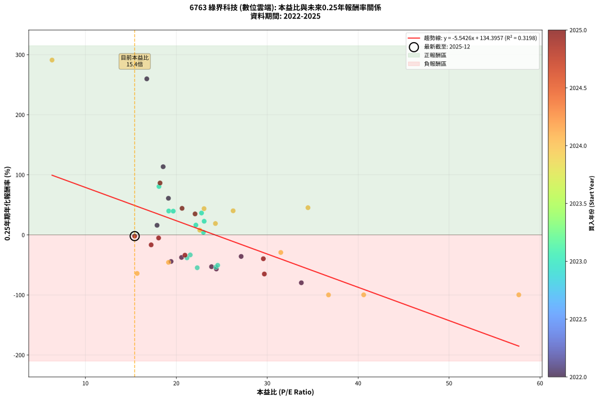
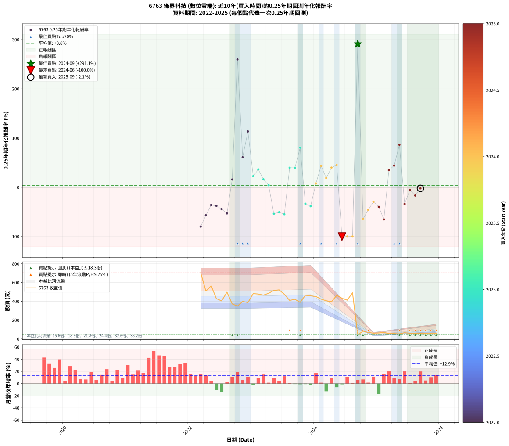

# 6763 綠界科技 - 本益比與未來報酬率分析

!!! info "報告資訊"
    - **股票代號**: 6763
    - **公司名稱**: 綠界科技
    - **產業別**: 數位雲端
    - **分析期間**: 2022-2025 (43 個數據點)
    - **資料來源**: Type 12 (ShowMonthlyK_ChartFlow) 月收盤價與本益比
    - **報酬率口徑**: 含現金股利 (簡化: 年度合計，假設每年7/1入帳)
    - **報告生成時間**: 2026-01-11 21:22:16 CST

## 📈 視覺化圖表

### 圖表1: 本益比 vs 未來報酬率關係

*圖表1：6763 綠界科技 本益比與0.25年期未來報酬率關係 (2022-2025)*

### 圖表2: 歷年買入時點的0.25年期實際報酬率

*圖表2：6763 綠界科技 歷年買入時點的0.25年期實際報酬率 (2022-2025)*

## 📍 買點訊號說明

本報告提供兩種買點提示訊號（顯示於圖表2的股價子圖中）：

### ▲ 小綠色三角形（回測驗證）
- **計算方式**: 使用全部歷史資料計算本益比第25百分位數
- **用途**: 事後驗證，顯示歷史上哪些時點確實為低估區
- **限制**: 當下無法判斷，僅供回測參考
- **特性**: 後見之明（Look-Ahead Bias）

### ▲ 小橘色三角形（即時訊號）
- **計算方式**: 使用截至當月的過去5年資料計算本益比第25百分位數
- **用途**: 實際投資決策，當時即可判斷
- **優勢**: 可操作性強，符合實務需求
- **特性**: 無後見之明，滾動窗口計算

!!! tip "如何使用兩種訊號"
    - **綠色▲** 幫助理解歷史估值機會，驗證策略有效性
    - **橘色▲** 可作為實際買進參考，但仍需搭配基本面分析
    - 兩種訊號重疊時，表示即時判斷與事後驗證一致，信心度較高
    - 僅有綠色▲時，表示當時無法判斷（需要未來資料才能確認）
    - 僅有橘色▲時，表示即時判斷為買點，但事後可能不是最佳時機

## 📊 估值分析摘要

| 指標 | 數值 |
|:---:|:---:|
| **目前本益比** (2025-09) | **15.42 倍** |
| **歷史平均本益比** | 23.57 倍 |
| **估值水準** | 🟢 相對低估 |
| **預期0.25年年化報酬率** | **+48.93%** |
| **歷史平均報酬率** | +3.78% |
| **相關係數 (R²)** | 0.3198 |
| **趨勢線斜率** | -5.5426 |

!!! abstract "核心洞察"
    目前本益比顯著低於歷史平均，預期未來報酬率可能較高

    根據歷史數據回測，6763 綠界科技 在目前本益比 **15.4倍** 的估值水準下，
    預期未來0.25年年化報酬率約為 **+48.9%**。

    **重要提醒**: 本分析基於歷史數據統計，實際報酬率會受到公司基本面變化、產業趨勢、
    總體經濟環境等多重因素影響。R² = 0.32 表示本益比可解釋約 32.0% 的報酬率變異。

## 📈 歷史估值統計

### 最佳買點 (最高報酬率)

| 項目 | 數值 |
|:---:|:---:|
| 起始時間 | 2024-09 |
| 當時本益比 | 6.33 倍 |
| 起始價格 | 43.5 元 |
| 0.25年後價格 | 61.1 元 |
| **0.25年年化報酬率** | **+291.05%** |

### 最差買點 (最低報酬率)

| 項目 | 數值 |
|:---:|:---:|
| 起始時間 | 2024-06 |
| 當時本益比 | 36.74 倍 |
| 起始價格 | 433.5 元 |
| 0.25年後價格 | 43.5 元 |
| **0.25年年化報酬率** | **-99.96%** |

## 🎯 投資啟示

### 本益比與報酬率關係

趨勢線方程式: **y = -5.5426x + 134.3957**

!!! warning "強負相關"
    本益比與未來報酬率呈現強負相關。在高本益比時期買入，未來報酬率顯著較低；
    在低本益比時期買入，未來報酬率顯著較高。**估值紀律至關重要**。

### 估值區間建議

基於歷史數據分析:

- **🟢 低估區** (P/E < 18.9): 預期報酬率較高，可考慮增加持股
- **🟡 合理區** (P/E 18.9-28.3): 預期報酬率符合長期趨勢，正常持有
- **🔴 高估區** (P/E > 28.3): 預期報酬率較低，可考慮減碼或觀望

!!! danger "風險提示"
    - 過去表現不代表未來結果
    - 本分析假設公司基本面無重大結構性變化
    - 產業環境劇變可能使歷史規律失效
    - 應結合公司財報、產業趨勢、總體經濟等多重因素綜合判斷

!!! success "長期投資觀點"
    歷史數據顯示，在合理或低估的估值水準買入並長期持有，
    往往能獲得較佳的投資報酬。**耐心等待好價格**是價值投資的核心原則。

## 📊 數據品質

- **資料來源**: GoodInfo.tw Type 12 (ShowMonthlyK_ChartFlow)
- **資料頻率**: 月度收盤價與本益比
- **回測期間**: 2022-2025
- **數據點數量**: 43 個 (每個點代表一次0.25年期回測)

### 計算方法說明

1. **0.25年期年化報酬率**:
   - 對每個歷史時點，計算其後0.25年的實際投資報酬率
   - 期末價值(不含股利): 期末價格
   - 期末價值(含現金股利): 期末價格 + 持有期間內的現金股利合計 (簡化: 年度合計，假設每年7/1入帳)
   - 公式: 年化報酬率 = [(期末價值/期初價格)^(1/年數) - 1] × 100%

2. **本益比 (P/E Ratio)**:
   - 使用當時的月收盤價與EPS計算
   - 資料來源: Type 12 月度河流圖本益比數據

3. **趨勢線 (Linear Regression)**:
   - 使用最小平方法擬合線性趨勢線
   - R²值衡量本益比對報酬率的解釋能力

---

*本報告由 Stock Analysis System v1.9.0 自動生成*
*數據更新時間: 2026-01-11 21:22:16 CST*

## 📋 月度回測明細表

（每一列對應時間線圖中的一個買入點；可用來對照 SVG 圖上的每個點。）

| 買入月份 | 賣出月份 | 回測期限_年 | 實際持有年數 | 買入本益比_倍 | 買入收盤價_元 | 賣出收盤價_元 | 現金股利合計_元 | 總報酬率_pct | 年化報酬率_pct |
| --- | --- | --- | --- | --- | --- | --- | --- | --- | --- |
| 2022-03 | 2022-07 | 0.25 | 0.334 | 33.75 | 704.00 | 405.00 | 8.00 | -41.34 | -79.74 |
| 2022-04 | 2022-07 | 0.25 | 0.249 | 24.40 | 509.00 | 405.00 | 8.00 | -18.86 | -56.78 |
| 2022-05 | 2022-08 | 0.25 | 0.252 | 27.13 | 566.00 | 498.00 | 8.00 | -10.60 | -35.91 |
| 2022-06 | 2022-09 | 0.25 | 0.252 | 20.57 | 429.00 | 373.00 | 8.00 | -11.19 | -37.57 |
| 2022-07 | 2022-10 | 0.25 | 0.252 | 19.42 | 405.00 | 349.50 | 0.00 | -13.70 | -44.30 |
| 2022-08 | 2022-12 | 0.25 | 0.334 | 23.87 | 498.00 | 387.00 | 0.00 | -22.29 | -53.00 |
| 2022-09 | 2022-12 | 0.25 | 0.249 | 17.88 | 373.00 | 387.00 | 0.00 | +3.75 | +15.94 |
| 2022-10 | 2023-01 | 0.25 | 0.252 | 16.75 | 349.50 | 482.50 | 0.00 | +38.05 | +259.76 |
| 2022-11 | 2023-03 | 0.25 | 0.329 | 19.13 | 399.00 | 466.50 | 0.00 | +16.92 | +60.92 |
| 2022-12 | 2023-03 | 0.25 | 0.246 | 18.55 | 387.00 | 466.50 | 0.00 | +20.54 | +113.45 |
| 2023-01 | 2023-05 | 0.25 | 0.329 | 23.06 | 482.50 | 516.00 | 0.00 | +6.94 | +22.67 |
| 2023-02 | 2023-05 | 0.25 | 0.246 | 22.77 | 478.00 | 516.00 | 0.00 | +7.95 | +36.40 |
| 2023-03 | 2023-07 | 0.25 | 0.334 | 22.15 | 466.50 | 475.50 | 15.10 | +5.17 | +16.28 |
| 2023-04 | 2023-07 | 0.25 | 0.249 | 22.98 | 485.50 | 475.50 | 15.10 | +1.05 | +4.28 |
| 2023-05 | 2023-08 | 0.25 | 0.252 | 24.35 | 516.00 | 410.00 | 15.10 | -17.62 | -53.67 |
| 2023-06 | 2023-09 | 0.25 | 0.252 | 24.55 | 522.00 | 422.00 | 15.10 | -16.26 | -50.58 |
| 2023-07 | 2023-10 | 0.25 | 0.252 | 22.30 | 475.50 | 389.50 | 0.00 | -18.09 | -54.71 |
| 2023-08 | 2023-12 | 0.25 | 0.334 | 19.16 | 410.00 | 458.50 | 0.00 | +11.83 | +39.76 |
| 2023-09 | 2023-12 | 0.25 | 0.249 | 19.66 | 422.00 | 458.50 | 0.00 | +8.65 | +39.51 |
| 2023-10 | 2024-01 | 0.25 | 0.252 | 18.09 | 389.50 | 452.00 | 0.00 | +16.05 | +80.55 |
| 2023-11 | 2024-03 | 0.25 | 0.331 | 21.53 | 465.00 | 406.50 | 0.00 | -12.58 | -33.36 |
| 2023-12 | 2024-03 | 0.25 | 0.249 | 21.17 | 458.50 | 406.50 | 0.00 | -11.34 | -38.32 |
| 2024-01 | 2024-05 | 0.25 | 0.331 | 22.58 | 452.00 | 463.50 | 0.00 | +2.54 | +7.88 |
| 2024-02 | 2024-05 | 0.25 | 0.249 | 23.05 | 423.50 | 463.50 | 0.00 | +9.45 | +43.66 |
| 2024-03 | 2024-07 | 0.25 | 0.334 | 24.30 | 406.50 | 412.50 | 18.20 | +5.95 | +18.90 |
| 2024-04 | 2024-07 | 0.25 | 0.249 | 26.25 | 396.00 | 412.50 | 18.20 | +8.76 | +40.09 |
| 2024-05 | 2024-08 | 0.25 | 0.252 | 34.48 | 463.50 | 491.00 | 18.20 | +9.86 | +45.26 |
| 2024-06 | 2024-09 | 0.25 | 0.252 | 36.74 | 433.50 | 43.50 | 18.20 | -85.77 | -99.96 |
| 2024-07 | 2024-10 | 0.25 | 0.252 | 40.61 | 412.50 | 82.00 | 0.00 | -80.12 | -99.84 |
| 2024-08 | 2024-12 | 0.25 | 0.334 | 57.67 | 491.00 | 61.10 | 0.00 | -87.56 | -99.80 |
| 2024-09 | 2024-12 | 0.25 | 0.249 | 6.33 | 43.50 | 61.10 | 0.00 | +40.46 | +291.05 |
| 2024-10 | 2025-01 | 0.25 | 0.252 | 15.69 | 82.00 | 63.30 | 0.00 | -22.80 | -64.21 |
| 2024-11 | 2025-03 | 0.25 | 0.329 | 19.14 | 68.60 | 56.10 | 0.00 | -18.22 | -45.79 |
| 2024-12 | 2025-03 | 0.25 | 0.246 | 31.49 | 61.10 | 56.10 | 0.00 | -8.18 | -29.28 |
| 2025-01 | 2025-05 | 0.25 | 0.329 | 29.57 | 63.30 | 53.60 | 0.00 | -15.32 | -39.73 |
| 2025-02 | 2025-05 | 0.25 | 0.246 | 29.68 | 69.50 | 53.60 | 0.00 | -22.88 | -65.16 |
| 2025-03 | 2025-07 | 0.25 | 0.334 | 22.06 | 56.10 | 60.40 | 1.60 | +10.52 | +34.90 |
| 2025-04 | 2025-07 | 0.25 | 0.249 | 20.63 | 56.60 | 60.40 | 1.60 | +9.54 | +44.16 |
| 2025-05 | 2025-08 | 0.25 | 0.252 | 18.21 | 53.60 | 61.10 | 1.60 | +16.98 | +86.37 |
| 2025-06 | 2025-09 | 0.25 | 0.252 | 20.95 | 65.90 | 57.80 | 1.60 | -9.86 | -33.79 |
| 2025-07 | 2025-10 | 0.25 | 0.252 | 18.05 | 60.40 | 59.60 | 0.00 | -1.32 | -5.16 |
| 2025-08 | 2025-12 | 0.25 | 0.334 | 17.23 | 61.10 | 57.50 | 0.00 | -5.89 | -16.62 |
| 2025-09 | 2025-12 | 0.25 | 0.249 | 15.42 | 57.80 | 57.50 | 0.00 | -0.52 | -2.07 |
