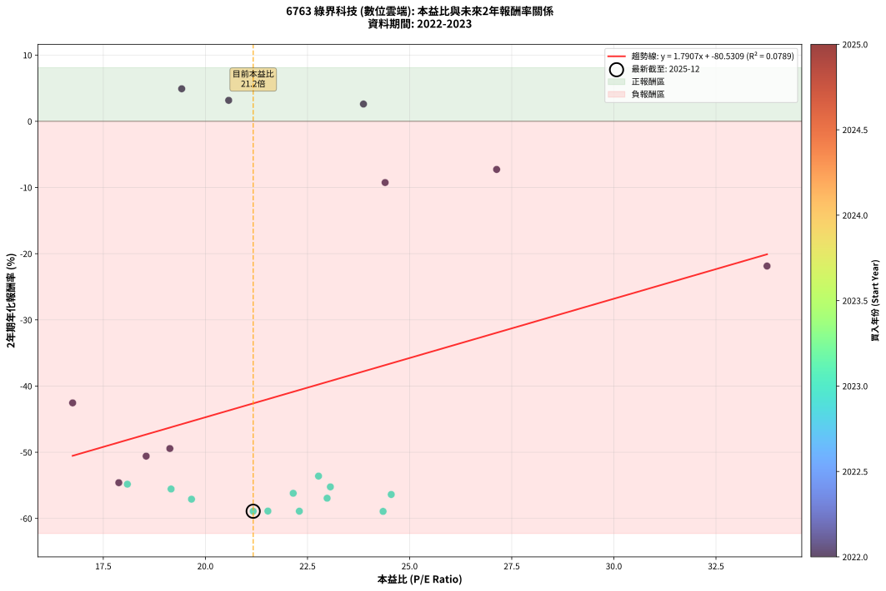
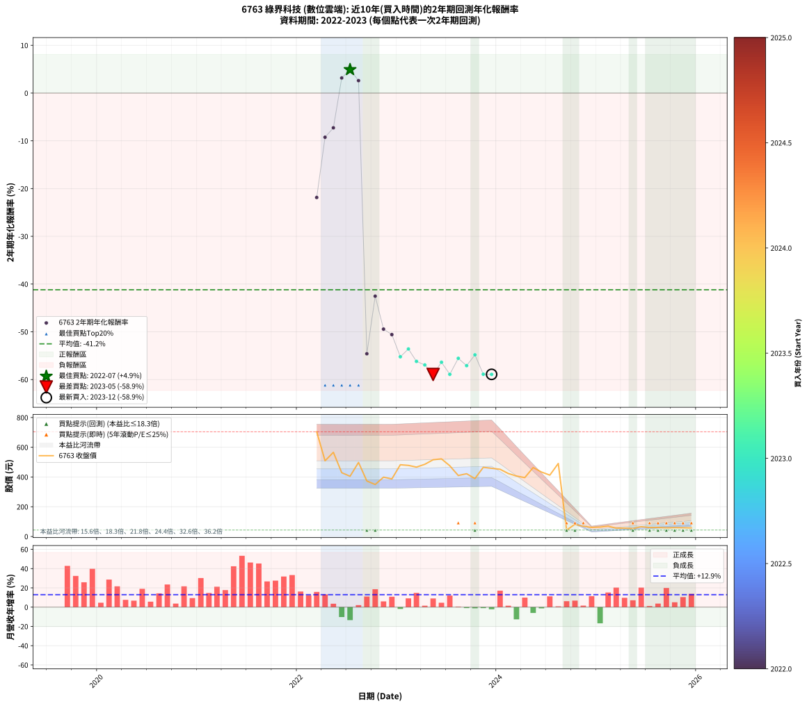

# 6763 綠界科技 - 本益比與未來報酬率分析

!!! info "報告資訊"
    - **股票代號**: 6763
    - **公司名稱**: 綠界科技
    - **產業別**: 數位雲端
    - **分析期間**: 2022-2023 (22 個數據點)
    - **資料來源**: Type 12 (ShowMonthlyK_ChartFlow) 月收盤價與本益比
    - **報酬率口徑**: 含現金股利 (簡化: 年度合計，假設每年7/1入帳)
    - **報告生成時間**: 2026-01-04 08:29:16 CST

## 📈 視覺化圖表

### 圖表1: 本益比 vs 未來報酬率關係

*圖表1：6763 綠界科技 本益比與2年期未來報酬率關係 (2022-2023)*

### 圖表2: 歷年買入時點的2年期實際報酬率

*圖表2：6763 綠界科技 歷年買入時點的2年期實際報酬率 (2022-2023)*

## 📍 買點訊號說明

本報告提供兩種買點提示訊號（顯示於圖表2的股價子圖中）：

### ▲ 小綠色三角形（回測驗證）
- **計算方式**: 使用全部歷史資料計算本益比第25百分位數
- **用途**: 事後驗證，顯示歷史上哪些時點確實為低估區
- **限制**: 當下無法判斷，僅供回測參考
- **特性**: 後見之明（Look-Ahead Bias）

### ▲ 小橘色三角形（即時訊號）
- **計算方式**: 使用截至當月的過去5年資料計算本益比第25百分位數
- **用途**: 實際投資決策，當時即可判斷
- **優勢**: 可操作性強，符合實務需求
- **特性**: 無後見之明，滾動窗口計算

!!! tip "如何使用兩種訊號"
    - **綠色▲** 幫助理解歷史估值機會，驗證策略有效性
    - **橘色▲** 可作為實際買進參考，但仍需搭配基本面分析
    - 兩種訊號重疊時，表示即時判斷與事後驗證一致，信心度較高
    - 僅有綠色▲時，表示當時無法判斷（需要未來資料才能確認）
    - 僅有橘色▲時，表示即時判斷為買點，但事後可能不是最佳時機

## 📊 估值分析摘要

| 指標 | 數值 |
|:---:|:---:|
| **目前本益比** (2023-12) | **21.17 倍** |
| **歷史平均本益比** | 21.96 倍 |
| **估值水準** | 🟡 合理範圍 |
| **預期2年年化報酬率** | **-42.62%** |
| **歷史平均報酬率** | -41.20% |
| **相關係數 (R²)** | 0.0789 |
| **趨勢線斜率** | 1.7907 |

!!! abstract "核心洞察"
    目前本益比接近歷史平均，預期報酬率符合長期趨勢

    根據歷史數據回測，6763 綠界科技 在目前本益比 **21.2倍** 的估值水準下，
    預期未來2年年化報酬率約為 **-42.6%**。

    **重要提醒**: 本分析基於歷史數據統計，實際報酬率會受到公司基本面變化、產業趨勢、
    總體經濟環境等多重因素影響。R² = 0.08 表示本益比可解釋約 7.9% 的報酬率變異。

## 📈 歷史估值統計

### 最佳買點 (最高報酬率)

| 項目 | 數值 |
|:---:|:---:|
| 起始時間 | 2022-07 |
| 當時本益比 | 19.42 倍 |
| 起始價格 | 405.0 元 |
| 2年後價格 | 412.5 元 |
| **2年年化報酬率** | **+4.91%** |

### 最差買點 (最低報酬率)

| 項目 | 數值 |
|:---:|:---:|
| 起始時間 | 2023-05 |
| 當時本益比 | 24.35 倍 |
| 起始價格 | 516.0 元 |
| 2年後價格 | 53.6 元 |
| **2年年化報酬率** | **-58.94%** |

## 🎯 投資啟示

### 本益比與報酬率關係

趨勢線方程式: **y = 1.7907x + -80.5309**

!!! info "弱相關或正相關"
    本益比與未來報酬率相關性較弱。這可能表示該股票的報酬率更多受到
    公司成長性、產業趨勢等因素影響，而非估值水準。**需綜合考量多項指標**。

### 估值區間建議

基於歷史數據分析:

- **🟢 低估區** (P/E < 17.6): 預期報酬率較高，可考慮增加持股
- **🟡 合理區** (P/E 17.6-26.4): 預期報酬率符合長期趨勢，正常持有
- **🔴 高估區** (P/E > 26.4): 預期報酬率較低，可考慮減碼或觀望

!!! danger "風險提示"
    - 過去表現不代表未來結果
    - 本分析假設公司基本面無重大結構性變化
    - 產業環境劇變可能使歷史規律失效
    - 應結合公司財報、產業趨勢、總體經濟等多重因素綜合判斷

!!! success "長期投資觀點"
    歷史數據顯示，在合理或低估的估值水準買入並長期持有，
    往往能獲得較佳的投資報酬。**耐心等待好價格**是價值投資的核心原則。

## 📊 數據品質

- **資料來源**: GoodInfo.tw Type 12 (ShowMonthlyK_ChartFlow)
- **資料頻率**: 月度收盤價與本益比
- **回測期間**: 2022-2023
- **數據點數量**: 22 個 (每個點代表一次2年期回測)

### 計算方法說明

1. **2年期年化報酬率**:
   - 對每個歷史時點，計算其後2年的實際投資報酬率
   - 期末價值(不含股利): 期末價格
   - 期末價值(含現金股利): 期末價格 + 持有期間內的現金股利合計 (簡化: 年度合計，假設每年7/1入帳)
   - 公式: 年化報酬率 = [(期末價值/期初價格)^(1/年數) - 1] × 100%

2. **本益比 (P/E Ratio)**:
   - 使用當時的月收盤價與EPS計算
   - 資料來源: Type 12 月度河流圖本益比數據

3. **趨勢線 (Linear Regression)**:
   - 使用最小平方法擬合線性趨勢線
   - R²值衡量本益比對報酬率的解釋能力

---

*本報告由 Stock Analysis System v1.9.0 自動生成*
*數據更新時間: 2026-01-04 08:29:16 CST*

## 📋 月度回測明細表

（每一列對應時間線圖中的一個買入點；可用來對照 SVG 圖上的每個點。）

| 買入月份 | 賣出月份 | 回測期限_年 | 實際持有年數 | 買入本益比_倍 | 買入收盤價_元 | 賣出收盤價_元 | 現金股利合計_元 | 總報酬率_pct | 年化報酬率_pct |
| --- | --- | --- | --- | --- | --- | --- | --- | --- | --- |
| 2022-03 | 2024-03 | 2 | 2.001 | 33.75 | 704.00 | 406.50 | 23.10 | -38.98 | -21.87 |
| 2022-04 | 2024-04 | 2 | 2.001 | 24.40 | 509.00 | 396.00 | 23.10 | -17.66 | -9.25 |
| 2022-05 | 2024-05 | 2 | 2.001 | 27.13 | 566.00 | 463.50 | 23.10 | -14.03 | -7.27 |
| 2022-06 | 2024-06 | 2 | 2.001 | 20.57 | 429.00 | 433.50 | 23.10 | +6.43 | +3.16 |
| 2022-07 | 2024-07 | 2 | 2.001 | 19.42 | 405.00 | 412.50 | 33.30 | +10.07 | +4.91 |
| 2022-08 | 2024-08 | 2 | 2.001 | 23.87 | 498.00 | 491.00 | 33.30 | +5.28 | +2.60 |
| 2022-09 | 2024-09 | 2 | 2.001 | 17.88 | 373.00 | 43.50 | 33.30 | -79.41 | -54.60 |
| 2022-10 | 2024-10 | 2 | 2.001 | 16.75 | 349.50 | 82.00 | 33.30 | -67.01 | -42.54 |
| 2022-11 | 2024-11 | 2 | 2.001 | 19.13 | 399.00 | 68.60 | 33.30 | -74.46 | -49.44 |
| 2022-12 | 2024-12 | 2 | 2.001 | 18.55 | 387.00 | 61.10 | 33.30 | -75.61 | -50.59 |
| 2023-01 | 2025-01 | 2 | 2.001 | 23.06 | 482.50 | 63.30 | 33.30 | -79.98 | -55.23 |
| 2023-02 | 2025-02 | 2 | 2.001 | 22.77 | 478.00 | 69.50 | 33.30 | -78.49 | -53.60 |
| 2023-03 | 2025-03 | 2 | 2.001 | 22.15 | 466.50 | 56.10 | 33.30 | -80.84 | -56.20 |
| 2023-04 | 2025-04 | 2 | 2.001 | 22.98 | 485.50 | 56.60 | 33.30 | -81.48 | -56.94 |
| 2023-05 | 2025-05 | 2 | 2.001 | 24.35 | 516.00 | 53.60 | 33.30 | -83.16 | -58.94 |
| 2023-06 | 2025-06 | 2 | 2.001 | 24.55 | 522.00 | 65.90 | 33.30 | -81.00 | -56.38 |
| 2023-07 | 2025-07 | 2 | 2.001 | 22.30 | 475.50 | 60.40 | 19.80 | -83.13 | -58.91 |
| 2023-08 | 2025-08 | 2 | 2.001 | 19.16 | 410.00 | 61.10 | 19.80 | -80.27 | -55.55 |
| 2023-09 | 2025-09 | 2 | 2.001 | 19.66 | 422.00 | 57.80 | 19.80 | -81.61 | -57.09 |
| 2023-10 | 2025-10 | 2 | 2.001 | 18.09 | 389.50 | 59.60 | 19.80 | -79.61 | -54.83 |
| 2023-11 | 2025-11 | 2 | 2.001 | 21.53 | 465.00 | 58.70 | 19.80 | -83.12 | -58.89 |
| 2023-12 | 2025-12 | 2 | 2.001 | 21.17 | 458.50 | 57.50 | 19.80 | -83.14 | -58.91 |
