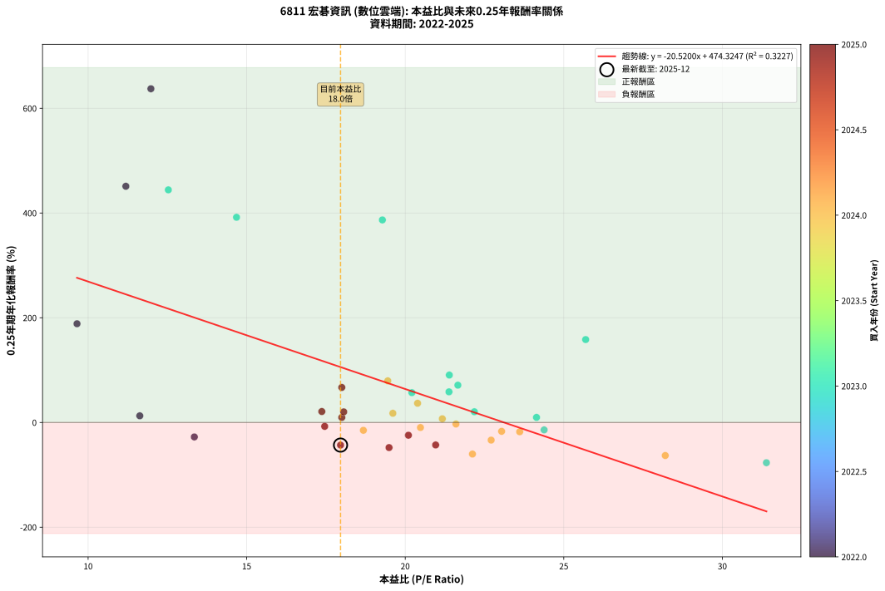
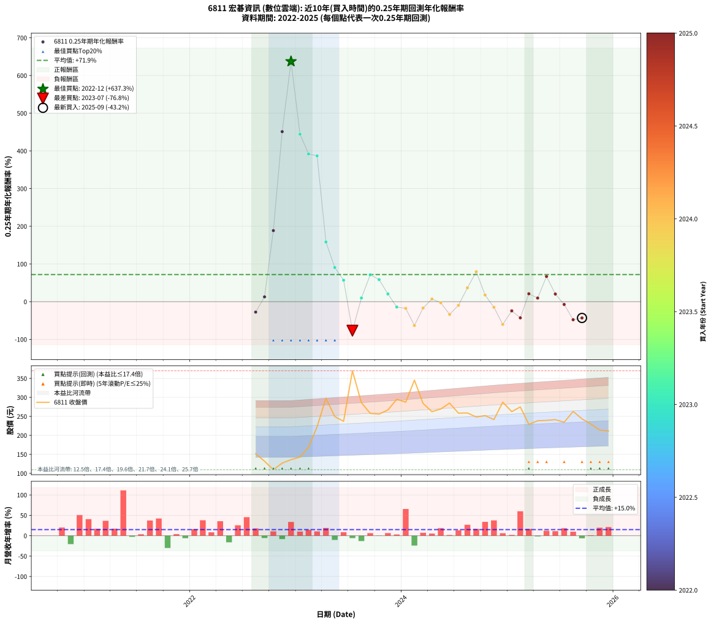

# 6811 宏碁資訊 - 本益比與未來報酬率分析

!!! info "報告資訊"
    - **股票代號**: 6811
    - **公司名稱**: 宏碁資訊
    - **產業別**: 數位雲端
    - **分析期間**: 2022-2025 (38 個數據點)
    - **資料來源**: Type 12 (ShowMonthlyK_ChartFlow) 月收盤價與本益比
    - **報酬率口徑**: 含現金股利 (簡化: 年度合計，假設每年7/1入帳)
    - **報告生成時間**: 2026-01-13 01:16:10 CST

## 📈 視覺化圖表

### 圖表1: 本益比 vs 未來報酬率關係

*圖表1：6811 宏碁資訊 本益比與0.25年期未來報酬率關係 (2022-2025)*

### 圖表2: 歷年買入時點的0.25年期實際報酬率

*圖表2：6811 宏碁資訊 歷年買入時點的0.25年期實際報酬率 (2022-2025)*

## 📍 買點訊號說明

本報告提供兩種買點提示訊號（顯示於圖表2的股價子圖中）：

### ▲ 小綠色三角形（回測驗證）
- **計算方式**: 使用全部歷史資料計算本益比第25百分位數
- **用途**: 事後驗證，顯示歷史上哪些時點確實為低估區
- **限制**: 當下無法判斷，僅供回測參考
- **特性**: 後見之明（Look-Ahead Bias）

### ▲ 小橘色三角形（即時訊號）
- **計算方式**: 使用截至當月的過去5年資料計算本益比第25百分位數
- **用途**: 實際投資決策，當時即可判斷
- **優勢**: 可操作性強，符合實務需求
- **特性**: 無後見之明，滾動窗口計算

!!! tip "如何使用兩種訊號"
    - **綠色▲** 幫助理解歷史估值機會，驗證策略有效性
    - **橘色▲** 可作為實際買進參考，但仍需搭配基本面分析
    - 兩種訊號重疊時，表示即時判斷與事後驗證一致，信心度較高
    - 僅有綠色▲時，表示當時無法判斷（需要未來資料才能確認）
    - 僅有橘色▲時，表示即時判斷為買點，但事後可能不是最佳時機

## 📊 估值分析摘要

| 指標 | 數值 |
|:---:|:---:|
| **目前本益比** (2025-09) | **17.96 倍** |
| **歷史平均本益比** | 19.61 倍 |
| **估值水準** | 🟡 合理範圍 |
| **預期0.25年年化報酬率** | **+105.79%** |
| **歷史平均報酬率** | +71.93% |
| **相關係數 (R²)** | 0.3227 |
| **趨勢線斜率** | -20.5200 |

!!! abstract "核心洞察"
    目前本益比接近歷史平均，預期報酬率符合長期趨勢

    根據歷史數據回測，6811 宏碁資訊 在目前本益比 **18.0倍** 的估值水準下，
    預期未來0.25年年化報酬率約為 **+105.8%**。

    **重要提醒**: 本分析基於歷史數據統計，實際報酬率會受到公司基本面變化、產業趨勢、
    總體經濟環境等多重因素影響。R² = 0.32 表示本益比可解釋約 32.3% 的報酬率變異。

## 📈 歷史估值統計

### 最佳買點 (最高報酬率)

| 項目 | 數值 |
|:---:|:---:|
| 起始時間 | 2022-12 |
| 當時本益比 | 11.98 倍 |
| 起始價格 | 136.0 元 |
| 0.25年後價格 | 222.5 元 |
| **0.25年年化報酬率** | **+637.29%** |

### 最差買點 (最低報酬率)

| 項目 | 數值 |
|:---:|:---:|
| 起始時間 | 2023-07 |
| 當時本益比 | 31.39 倍 |
| 起始價格 | 370.0 元 |
| 0.25年後價格 | 256.0 元 |
| **0.25年年化報酬率** | **-76.83%** |

## 🎯 投資啟示

### 本益比與報酬率關係

趨勢線方程式: **y = -20.5200x + 474.3247**

!!! warning "強負相關"
    本益比與未來報酬率呈現強負相關。在高本益比時期買入，未來報酬率顯著較低；
    在低本益比時期買入，未來報酬率顯著較高。**估值紀律至關重要**。

### 估值區間建議

基於歷史數據分析:

- **🟢 低估區** (P/E < 15.7): 預期報酬率較高，可考慮增加持股
- **🟡 合理區** (P/E 15.7-23.5): 預期報酬率符合長期趨勢，正常持有
- **🔴 高估區** (P/E > 23.5): 預期報酬率較低，可考慮減碼或觀望

!!! danger "風險提示"
    - 過去表現不代表未來結果
    - 本分析假設公司基本面無重大結構性變化
    - 產業環境劇變可能使歷史規律失效
    - 應結合公司財報、產業趨勢、總體經濟等多重因素綜合判斷

!!! success "長期投資觀點"
    歷史數據顯示，在合理或低估的估值水準買入並長期持有，
    往往能獲得較佳的投資報酬。**耐心等待好價格**是價值投資的核心原則。

## 📊 數據品質

- **資料來源**: GoodInfo.tw Type 12 (ShowMonthlyK_ChartFlow)
- **資料頻率**: 月度收盤價與本益比
- **回測期間**: 2022-2025
- **數據點數量**: 38 個 (每個點代表一次0.25年期回測)

### 計算方法說明

1. **0.25年期年化報酬率**:
   - 對每個歷史時點，計算其後0.25年的實際投資報酬率
   - 期末價值(不含股利): 期末價格
   - 期末價值(含現金股利): 期末價格 + 持有期間內的現金股利合計 (簡化: 年度合計，假設每年7/1入帳)
   - 公式: 年化報酬率 = [(期末價值/期初價格)^(1/年數) - 1] × 100%

2. **本益比 (P/E Ratio)**:
   - 使用當時的月收盤價與EPS計算
   - 資料來源: Type 12 月度河流圖本益比數據

3. **趨勢線 (Linear Regression)**:
   - 使用最小平方法擬合線性趨勢線
   - R²值衡量本益比對報酬率的解釋能力

---

*本報告由 Stock Analysis System v1.9.0 自動生成*
*數據更新時間: 2026-01-13 01:16:10 CST*

## 📋 月度回測明細表

（每一列對應時間線圖中的一個買入點；可用來對照 SVG 圖上的每個點。）

| 買入月份 | 賣出月份 | 回測期限_年 | 實際持有年數 | 買入本益比_倍 | 買入收盤價_元 | 賣出收盤價_元 | 現金股利合計_元 | 總報酬率_pct | 年化報酬率_pct |
| --- | --- | --- | --- | --- | --- | --- | --- | --- | --- |
| 2022-08 | 2022-12 | 0.25 | 0.334 | 13.35 | 151.50 | 136.00 | 0.00 | -10.23 | -27.61 |
| 2022-09 | 2022-12 | 0.25 | 0.249 | 11.63 | 132.00 | 136.00 | 0.00 | +3.03 | +12.73 |
| 2022-10 | 2023-01 | 0.25 | 0.252 | 9.65 | 109.50 | 143.00 | 0.00 | +30.59 | +188.55 |
| 2022-11 | 2023-03 | 0.25 | 0.329 | 11.19 | 127.00 | 222.50 | 0.00 | +75.20 | +451.10 |
| 2022-12 | 2023-03 | 0.25 | 0.246 | 11.98 | 136.00 | 222.50 | 0.00 | +63.60 | +637.29 |
| 2023-01 | 2023-05 | 0.25 | 0.329 | 12.53 | 143.00 | 249.50 | 0.00 | +74.48 | +444.23 |
| 2023-02 | 2023-05 | 0.25 | 0.246 | 14.68 | 168.50 | 249.50 | 0.00 | +48.07 | +391.84 |
| 2023-03 | 2023-07 | 0.25 | 0.334 | 19.28 | 222.50 | 370.00 | 7.50 | +69.66 | +386.80 |
| 2023-04 | 2023-07 | 0.25 | 0.249 | 25.69 | 298.00 | 370.00 | 7.50 | +26.68 | +158.35 |
| 2023-05 | 2023-08 | 0.25 | 0.252 | 21.39 | 249.50 | 286.00 | 7.50 | +17.64 | +90.56 |
| 2023-06 | 2023-09 | 0.25 | 0.252 | 20.21 | 237.00 | 258.00 | 7.50 | +12.03 | +56.96 |
| 2023-07 | 2023-10 | 0.25 | 0.252 | 31.39 | 370.00 | 256.00 | 0.00 | -30.81 | -76.83 |
| 2023-08 | 2023-12 | 0.25 | 0.334 | 24.14 | 286.00 | 295.00 | 0.00 | +3.15 | +9.72 |
| 2023-09 | 2023-12 | 0.25 | 0.249 | 21.66 | 258.00 | 295.00 | 0.00 | +14.34 | +71.24 |
| 2023-10 | 2024-01 | 0.25 | 0.252 | 21.38 | 256.00 | 287.50 | 0.00 | +12.30 | +58.52 |
| 2023-11 | 2024-03 | 0.25 | 0.331 | 22.18 | 267.00 | 284.00 | 0.00 | +6.37 | +20.48 |
| 2023-12 | 2024-03 | 0.25 | 0.249 | 24.38 | 295.00 | 284.00 | 0.00 | -3.73 | -14.15 |
| 2024-01 | 2024-05 | 0.25 | 0.331 | 23.61 | 287.50 | 269.50 | 0.00 | -6.26 | -17.73 |
| 2024-02 | 2024-05 | 0.25 | 0.249 | 28.20 | 345.50 | 269.50 | 0.00 | -22.00 | -63.11 |
| 2024-03 | 2024-07 | 0.25 | 0.334 | 23.04 | 284.00 | 258.50 | 8.50 | -5.99 | -16.87 |
| 2024-04 | 2024-07 | 0.25 | 0.249 | 21.17 | 262.50 | 258.50 | 8.50 | +1.71 | +7.06 |
| 2024-05 | 2024-08 | 0.25 | 0.252 | 21.60 | 269.50 | 259.00 | 8.50 | -0.74 | -2.91 |
| 2024-06 | 2024-09 | 0.25 | 0.252 | 22.71 | 285.00 | 248.50 | 8.50 | -9.82 | -33.67 |
| 2024-07 | 2024-10 | 0.25 | 0.252 | 20.48 | 258.50 | 252.00 | 0.00 | -2.51 | -9.62 |
| 2024-08 | 2024-12 | 0.25 | 0.334 | 20.39 | 259.00 | 287.50 | 0.00 | +11.00 | +36.69 |
| 2024-09 | 2024-12 | 0.25 | 0.249 | 19.45 | 248.50 | 287.50 | 0.00 | +15.69 | +79.52 |
| 2024-10 | 2025-01 | 0.25 | 0.252 | 19.61 | 252.00 | 262.50 | 0.00 | +4.17 | +17.59 |
| 2024-11 | 2025-03 | 0.25 | 0.329 | 18.68 | 241.50 | 229.00 | 0.00 | -5.18 | -14.94 |
| 2024-12 | 2025-03 | 0.25 | 0.246 | 22.12 | 287.50 | 229.00 | 0.00 | -20.35 | -60.28 |
| 2025-01 | 2025-05 | 0.25 | 0.329 | 20.10 | 262.50 | 239.50 | 0.00 | -8.76 | -24.35 |
| 2025-02 | 2025-05 | 0.25 | 0.246 | 20.96 | 275.00 | 239.50 | 0.00 | -12.91 | -42.93 |
| 2025-03 | 2025-07 | 0.25 | 0.334 | 17.37 | 229.00 | 234.50 | 9.50 | +6.55 | +20.92 |
| 2025-04 | 2025-07 | 0.25 | 0.249 | 18.00 | 238.50 | 234.50 | 9.50 | +2.31 | +9.58 |
| 2025-05 | 2025-08 | 0.25 | 0.252 | 18.00 | 239.50 | 263.00 | 9.50 | +13.78 | +66.94 |
| 2025-06 | 2025-09 | 0.25 | 0.252 | 18.06 | 241.50 | 243.50 | 9.50 | +4.76 | +20.28 |
| 2025-07 | 2025-10 | 0.25 | 0.252 | 17.46 | 234.50 | 230.00 | 0.00 | -1.92 | -7.40 |
| 2025-08 | 2025-12 | 0.25 | 0.334 | 19.49 | 263.00 | 211.50 | 0.00 | -19.58 | -47.92 |
| 2025-09 | 2025-12 | 0.25 | 0.249 | 17.96 | 243.50 | 211.50 | 0.00 | -13.14 | -43.19 |
