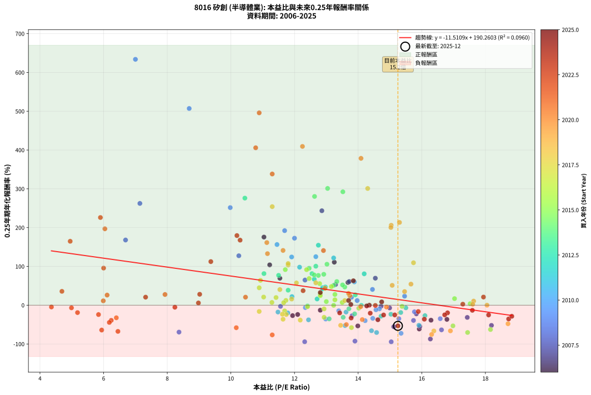
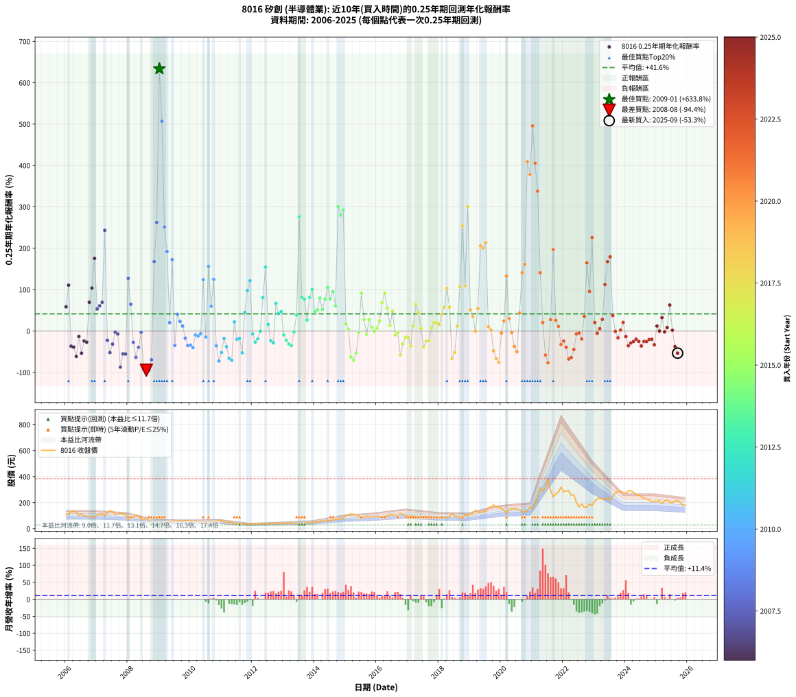

# 8016 矽創 - 本益比與未來報酬率分析

!!! info "報告資訊"
    - **股票代號**: 8016
    - **公司名稱**: 矽創
    - **產業別**: 半導體業
    - **分析期間**: 2006-2025 (237 個數據點)
    - **資料來源**: Type 12 (ShowMonthlyK_ChartFlow) 月收盤價與本益比
    - **報酬率口徑**: 含現金股利 (簡化: 年度合計，假設每年7/1入帳)
    - **報告生成時間**: 2026-01-07 21:24:23 CST

## 📈 視覺化圖表

### 圖表1: 本益比 vs 未來報酬率關係

*圖表1：8016 矽創 本益比與0.25年期未來報酬率關係 (2006-2025)*

### 圖表2: 歷年買入時點的0.25年期實際報酬率

*圖表2：8016 矽創 歷年買入時點的0.25年期實際報酬率 (2006-2025)*

## 📍 買點訊號說明

本報告提供兩種買點提示訊號（顯示於圖表2的股價子圖中）：

### ▲ 小綠色三角形（回測驗證）
- **計算方式**: 使用全部歷史資料計算本益比第25百分位數
- **用途**: 事後驗證，顯示歷史上哪些時點確實為低估區
- **限制**: 當下無法判斷，僅供回測參考
- **特性**: 後見之明（Look-Ahead Bias）

### ▲ 小橘色三角形（即時訊號）
- **計算方式**: 使用截至當月的過去5年資料計算本益比第25百分位數
- **用途**: 實際投資決策，當時即可判斷
- **優勢**: 可操作性強，符合實務需求
- **特性**: 無後見之明，滾動窗口計算

!!! tip "如何使用兩種訊號"
    - **綠色▲** 幫助理解歷史估值機會，驗證策略有效性
    - **橘色▲** 可作為實際買進參考，但仍需搭配基本面分析
    - 兩種訊號重疊時，表示即時判斷與事後驗證一致，信心度較高
    - 僅有綠色▲時，表示當時無法判斷（需要未來資料才能確認）
    - 僅有橘色▲時，表示即時判斷為買點，但事後可能不是最佳時機

## 📊 估值分析摘要

| 指標 | 數值 |
|:---:|:---:|
| **目前本益比** (2025-09) | **15.25 倍** |
| **歷史平均本益比** | 12.91 倍 |
| **估值水準** | 🟡 合理範圍 |
| **預期0.25年年化報酬率** | **+14.72%** |
| **歷史平均報酬率** | +41.62% |
| **相關係數 (R²)** | 0.0960 |
| **趨勢線斜率** | -11.5109 |

!!! abstract "核心洞察"
    目前本益比接近歷史平均，預期報酬率符合長期趨勢

    根據歷史數據回測，8016 矽創 在目前本益比 **15.2倍** 的估值水準下，
    預期未來0.25年年化報酬率約為 **+14.7%**。

    **重要提醒**: 本分析基於歷史數據統計，實際報酬率會受到公司基本面變化、產業趨勢、
    總體經濟環境等多重因素影響。R² = 0.10 表示本益比可解釋約 9.6% 的報酬率變異。

## 📈 歷史估值統計

### 最佳買點 (最高報酬率)

| 項目 | 數值 |
|:---:|:---:|
| 起始時間 | 2009-01 |
| 當時本益比 | 7.00 倍 |
| 起始價格 | 29.2 元 |
| 0.25年後價格 | 56.3 元 |
| **0.25年年化報酬率** | **+633.82%** |

### 最差買點 (最低報酬率)

| 項目 | 數值 |
|:---:|:---:|
| 起始時間 | 2008-08 |
| 當時本益比 | 15.04 倍 |
| 起始價格 | 78.4 元 |
| 0.25年後價格 | 30.0 元 |
| **0.25年年化報酬率** | **-94.36%** |

## 🎯 投資啟示

### 本益比與報酬率關係

趨勢線方程式: **y = -11.5109x + 190.2603**

!!! warning "強負相關"
    本益比與未來報酬率呈現強負相關。在高本益比時期買入，未來報酬率顯著較低；
    在低本益比時期買入，未來報酬率顯著較高。**估值紀律至關重要**。

### 估值區間建議

基於歷史數據分析:

- **🟢 低估區** (P/E < 10.3): 預期報酬率較高，可考慮增加持股
- **🟡 合理區** (P/E 10.3-15.5): 預期報酬率符合長期趨勢，正常持有
- **🔴 高估區** (P/E > 15.5): 預期報酬率較低，可考慮減碼或觀望

!!! danger "風險提示"
    - 過去表現不代表未來結果
    - 本分析假設公司基本面無重大結構性變化
    - 產業環境劇變可能使歷史規律失效
    - 應結合公司財報、產業趨勢、總體經濟等多重因素綜合判斷

!!! success "長期投資觀點"
    歷史數據顯示，在合理或低估的估值水準買入並長期持有，
    往往能獲得較佳的投資報酬。**耐心等待好價格**是價值投資的核心原則。

## 📊 數據品質

- **資料來源**: GoodInfo.tw Type 12 (ShowMonthlyK_ChartFlow)
- **資料頻率**: 月度收盤價與本益比
- **回測期間**: 2006-2025
- **數據點數量**: 237 個 (每個點代表一次0.25年期回測)

### 計算方法說明

1. **0.25年期年化報酬率**:
   - 對每個歷史時點，計算其後0.25年的實際投資報酬率
   - 期末價值(不含股利): 期末價格
   - 期末價值(含現金股利): 期末價格 + 持有期間內的現金股利合計 (簡化: 年度合計，假設每年7/1入帳)
   - 公式: 年化報酬率 = [(期末價值/期初價格)^(1/年數) - 1] × 100%

2. **本益比 (P/E Ratio)**:
   - 使用當時的月收盤價與EPS計算
   - 資料來源: Type 12 月度河流圖本益比數據

3. **趨勢線 (Linear Regression)**:
   - 使用最小平方法擬合線性趨勢線
   - R²值衡量本益比對報酬率的解釋能力

---

*本報告由 Stock Analysis System v1.9.0 自動生成*
*數據更新時間: 2026-01-07 21:24:23 CST*

## 📋 月度回測明細表

（每一列對應時間線圖中的一個買入點；可用來對照 SVG 圖上的每個點。）

| 買入月份 | 賣出月份 | 回測期限_年 | 實際持有年數 | 買入本益比_倍 | 買入收盤價_元 | 賣出收盤價_元 | 現金股利合計_元 | 總報酬率_pct | 年化報酬率_pct |
| --- | --- | --- | --- | --- | --- | --- | --- | --- | --- |
| 2006-01 | 2006-05 | 0.25 | 0.329 | 13.68 | 110.00 | 128.00 | 0.00 | +16.36 | +58.61 |
| 2006-02 | 2006-05 | 0.25 | 0.246 | 13.25 | 106.50 | 128.00 | 0.00 | +20.19 | +110.91 |
| 2006-03 | 2006-07 | 0.25 | 0.334 | 16.79 | 135.00 | 112.50 | 3.47 | -14.10 | -36.55 |
| 2006-04 | 2006-07 | 0.25 | 0.249 | 16.29 | 131.00 | 112.50 | 3.47 | -11.47 | -38.68 |
| 2006-05 | 2006-08 | 0.25 | 0.252 | 15.92 | 128.00 | 97.30 | 3.47 | -21.27 | -61.31 |
| 2006-06 | 2006-09 | 0.25 | 0.252 | 12.81 | 103.00 | 96.00 | 3.47 | -3.43 | -12.93 |
| 2006-07 | 2006-10 | 0.25 | 0.252 | 13.99 | 112.50 | 92.80 | 0.00 | -17.51 | -53.43 |
| 2006-08 | 2006-12 | 0.25 | 0.334 | 12.10 | 97.30 | 88.80 | 0.00 | -8.74 | -23.94 |
| 2006-09 | 2006-12 | 0.25 | 0.249 | 11.94 | 96.00 | 88.80 | 0.00 | -7.50 | -26.87 |
| 2006-10 | 2007-01 | 0.25 | 0.252 | 11.54 | 92.80 | 106.00 | 0.00 | +14.22 | +69.55 |
| 2006-11 | 2007-03 | 0.25 | 0.329 | 11.22 | 90.20 | 114.00 | 0.00 | +26.39 | +103.96 |
| 2006-12 | 2007-03 | 0.25 | 0.246 | 11.04 | 88.80 | 114.00 | 0.00 | +28.38 | +175.61 |
| 2007-01 | 2007-05 | 0.25 | 0.329 | 13.29 | 106.00 | 122.00 | 0.00 | +15.09 | +53.40 |
| 2007-02 | 2007-05 | 0.25 | 0.246 | 13.72 | 108.50 | 122.00 | 0.00 | +12.44 | +60.95 |
| 2007-03 | 2007-07 | 0.25 | 0.334 | 14.54 | 114.00 | 132.00 | 3.99 | +19.29 | +69.58 |
| 2007-04 | 2007-07 | 0.25 | 0.249 | 12.86 | 100.00 | 132.00 | 3.99 | +35.99 | +243.49 |
| 2007-05 | 2007-08 | 0.25 | 0.252 | 15.83 | 122.00 | 110.50 | 3.99 | -6.15 | -22.28 |
| 2007-06 | 2007-09 | 0.25 | 0.252 | 18.19 | 139.00 | 111.50 | 3.99 | -16.91 | -52.07 |
| 2007-07 | 2007-10 | 0.25 | 0.252 | 17.43 | 132.00 | 120.00 | 0.00 | -9.09 | -31.50 |
| 2007-08 | 2007-12 | 0.25 | 0.334 | 14.72 | 110.50 | 109.50 | 0.00 | -0.90 | -2.68 |
| 2007-09 | 2007-12 | 0.25 | 0.249 | 14.99 | 111.50 | 109.50 | 0.00 | -1.79 | -7.01 |
| 2007-10 | 2008-01 | 0.25 | 0.252 | 16.27 | 120.00 | 71.60 | 0.00 | -40.33 | -87.13 |
| 2007-11 | 2008-03 | 0.25 | 0.331 | 15.94 | 116.50 | 89.50 | 0.00 | -23.18 | -54.88 |
| 2007-12 | 2008-03 | 0.25 | 0.249 | 15.12 | 109.50 | 89.50 | 0.00 | -18.26 | -55.49 |
| 2008-01 | 2008-05 | 0.25 | 0.331 | 10.25 | 71.60 | 94.00 | 0.00 | +31.28 | +127.43 |
| 2008-02 | 2008-05 | 0.25 | 0.249 | 12.33 | 83.00 | 94.00 | 0.00 | +13.25 | +64.79 |
| 2008-03 | 2008-07 | 0.25 | 0.334 | 13.81 | 89.50 | 76.00 | 4.49 | -10.06 | -27.20 |
| 2008-04 | 2008-07 | 0.25 | 0.249 | 16.62 | 103.50 | 76.00 | 4.49 | -22.23 | -63.54 |
| 2008-05 | 2008-08 | 0.25 | 0.252 | 15.74 | 94.00 | 78.40 | 4.49 | -11.81 | -39.30 |
| 2008-06 | 2008-09 | 0.25 | 0.252 | 11.56 | 66.10 | 61.10 | 4.49 | -0.77 | -3.00 |
| 2008-07 | 2008-10 | 0.25 | 0.252 | 13.90 | 76.00 | 39.40 | 0.00 | -48.16 | -92.63 |
| 2008-08 | 2008-12 | 0.25 | 0.334 | 15.04 | 78.40 | 30.00 | 0.00 | -61.73 | -94.36 |
| 2008-09 | 2008-12 | 0.25 | 0.249 | 12.32 | 61.10 | 30.00 | 0.00 | -50.90 | -94.24 |
| 2008-10 | 2009-01 | 0.25 | 0.252 | 8.37 | 39.40 | 29.25 | 0.00 | -25.76 | -69.35 |
| 2008-11 | 2009-03 | 0.25 | 0.329 | 6.69 | 29.80 | 41.20 | 0.00 | +38.26 | +168.04 |
| 2008-12 | 2009-03 | 0.25 | 0.246 | 7.14 | 30.00 | 41.20 | 0.00 | +37.33 | +262.36 |
| 2009-01 | 2009-05 | 0.25 | 0.329 | 7.00 | 29.25 | 56.30 | 0.00 | +92.48 | +633.82 |
| 2009-02 | 2009-05 | 0.25 | 0.246 | 8.69 | 36.10 | 56.30 | 0.00 | +55.96 | +507.10 |
| 2009-03 | 2009-07 | 0.25 | 0.334 | 9.98 | 41.20 | 61.70 | 1.00 | +52.18 | +251.55 |
| 2009-04 | 2009-07 | 0.25 | 0.249 | 11.69 | 48.00 | 61.70 | 1.00 | +30.63 | +192.21 |
| 2009-05 | 2009-08 | 0.25 | 0.252 | 13.79 | 56.30 | 58.00 | 1.00 | +4.80 | +20.44 |
| 2009-06 | 2009-09 | 0.25 | 0.252 | 12.00 | 48.70 | 61.70 | 1.00 | +28.75 | +172.69 |
| 2009-07 | 2009-10 | 0.25 | 0.252 | 15.28 | 61.70 | 55.40 | 0.00 | -10.21 | -34.79 |
| 2009-08 | 2009-12 | 0.25 | 0.334 | 14.45 | 58.00 | 65.00 | 0.00 | +12.07 | +40.65 |
| 2009-09 | 2009-12 | 0.25 | 0.249 | 15.46 | 61.70 | 65.00 | 0.00 | +5.35 | +23.26 |
| 2009-10 | 2010-01 | 0.25 | 0.252 | 13.97 | 55.40 | 57.00 | 0.00 | +2.89 | +11.97 |
| 2009-11 | 2010-03 | 0.25 | 0.329 | 15.77 | 62.20 | 58.50 | 0.00 | -5.95 | -17.03 |
| 2009-12 | 2010-03 | 0.25 | 0.246 | 16.58 | 65.00 | 58.50 | 0.00 | -10.00 | -34.79 |
| 2010-01 | 2010-05 | 0.25 | 0.329 | 14.46 | 57.00 | 49.75 | 0.00 | -12.72 | -33.90 |
| 2010-02 | 2010-05 | 0.25 | 0.246 | 14.22 | 56.40 | 49.75 | 0.00 | -11.79 | -39.90 |
| 2010-03 | 2010-07 | 0.25 | 0.334 | 14.67 | 58.50 | 54.60 | 2.00 | -3.25 | -9.42 |
| 2010-04 | 2010-07 | 0.25 | 0.249 | 14.56 | 58.40 | 54.60 | 2.00 | -3.08 | -11.81 |
| 2010-05 | 2010-08 | 0.25 | 0.252 | 12.34 | 49.75 | 46.95 | 2.00 | -1.61 | -6.24 |
| 2010-06 | 2010-09 | 0.25 | 0.252 | 11.91 | 48.30 | 57.20 | 2.00 | +22.57 | +124.30 |
| 2010-07 | 2010-10 | 0.25 | 0.252 | 13.39 | 54.60 | 52.50 | 0.00 | -3.85 | -14.42 |
| 2010-08 | 2010-12 | 0.25 | 0.334 | 11.45 | 46.95 | 64.30 | 0.00 | +36.95 | +156.38 |
| 2010-09 | 2010-12 | 0.25 | 0.249 | 13.88 | 57.20 | 64.30 | 0.00 | +12.41 | +59.94 |
| 2010-10 | 2011-01 | 0.25 | 0.252 | 12.67 | 52.50 | 64.40 | 0.00 | +22.67 | +125.04 |
| 2010-11 | 2011-03 | 0.25 | 0.329 | 12.98 | 54.10 | 46.80 | 0.00 | -13.49 | -35.67 |
| 2010-12 | 2011-03 | 0.25 | 0.246 | 15.35 | 64.30 | 46.80 | 0.00 | -27.22 | -72.45 |
| 2011-01 | 2011-05 | 0.25 | 0.329 | 15.91 | 64.40 | 50.70 | 0.00 | -21.27 | -51.71 |
| 2011-02 | 2011-05 | 0.25 | 0.246 | 13.62 | 53.20 | 50.70 | 0.00 | -4.70 | -17.74 |
| 2011-03 | 2011-07 | 0.25 | 0.334 | 12.44 | 46.80 | 37.65 | 2.30 | -14.64 | -37.74 |
| 2011-04 | 2011-07 | 0.25 | 0.249 | 14.42 | 52.20 | 37.65 | 2.30 | -23.47 | -65.82 |
| 2011-05 | 2011-08 | 0.25 | 0.252 | 14.58 | 50.70 | 35.00 | 2.30 | -26.43 | -70.43 |
| 2011-06 | 2011-09 | 0.25 | 0.252 | 11.92 | 39.75 | 39.50 | 2.30 | +5.16 | +22.10 |
| 2011-07 | 2011-10 | 0.25 | 0.252 | 11.79 | 37.65 | 35.60 | 0.00 | -5.44 | -19.93 |
| 2011-08 | 2011-12 | 0.25 | 0.334 | 11.48 | 35.00 | 32.80 | 0.00 | -6.29 | -17.66 |
| 2011-09 | 2011-12 | 0.25 | 0.249 | 13.59 | 39.50 | 32.80 | 0.00 | -16.96 | -52.58 |
| 2011-10 | 2012-01 | 0.25 | 0.252 | 12.88 | 35.60 | 39.10 | 0.00 | +9.83 | +45.11 |
| 2011-11 | 2012-03 | 0.25 | 0.331 | 12.16 | 31.90 | 40.00 | 0.00 | +25.39 | +97.99 |
| 2011-12 | 2012-03 | 0.25 | 0.249 | 13.23 | 32.80 | 40.00 | 0.00 | +21.95 | +121.78 |
| 2012-01 | 2012-05 | 0.25 | 0.331 | 15.50 | 39.10 | 38.20 | 0.00 | -2.30 | -6.79 |
| 2012-02 | 2012-05 | 0.25 | 0.249 | 16.10 | 41.30 | 38.20 | 0.00 | -7.51 | -26.89 |
| 2012-03 | 2012-07 | 0.25 | 0.334 | 15.34 | 40.00 | 35.30 | 2.00 | -6.75 | -18.88 |
| 2012-04 | 2012-07 | 0.25 | 0.249 | 14.10 | 37.35 | 35.30 | 2.00 | -0.13 | -0.54 |
| 2012-05 | 2012-08 | 0.25 | 0.252 | 14.19 | 38.20 | 42.35 | 2.00 | +16.10 | +80.88 |
| 2012-06 | 2012-09 | 0.25 | 0.252 | 12.75 | 34.85 | 42.10 | 2.00 | +26.54 | +154.62 |
| 2012-07 | 2012-10 | 0.25 | 0.252 | 12.71 | 35.30 | 36.65 | 0.00 | +3.82 | +16.07 |
| 2012-08 | 2012-12 | 0.25 | 0.334 | 15.03 | 42.35 | 38.75 | 0.00 | -8.50 | -23.35 |
| 2012-09 | 2012-12 | 0.25 | 0.249 | 14.72 | 42.10 | 38.75 | 0.00 | -7.96 | -28.31 |
| 2012-10 | 2013-01 | 0.25 | 0.252 | 12.62 | 36.65 | 41.70 | 0.00 | +13.78 | +66.94 |
| 2012-11 | 2013-03 | 0.25 | 0.329 | 12.88 | 37.95 | 42.60 | 0.00 | +12.25 | +42.16 |
| 2012-12 | 2013-03 | 0.25 | 0.246 | 12.97 | 38.75 | 42.60 | 0.00 | +9.94 | +46.88 |
| 2013-01 | 2013-05 | 0.25 | 0.329 | 13.71 | 41.70 | 40.40 | 0.00 | -3.12 | -9.19 |
| 2013-02 | 2013-05 | 0.25 | 0.246 | 13.89 | 43.00 | 40.40 | 0.00 | -6.05 | -22.36 |
| 2013-03 | 2013-07 | 0.25 | 0.334 | 13.53 | 42.60 | 35.10 | 2.50 | -11.74 | -31.19 |
| 2013-04 | 2013-07 | 0.25 | 0.249 | 13.09 | 41.90 | 35.10 | 2.50 | -10.26 | -35.25 |
| 2013-05 | 2013-08 | 0.25 | 0.252 | 12.41 | 40.40 | 37.70 | 2.50 | -0.50 | -1.95 |
| 2013-06 | 2013-09 | 0.25 | 0.252 | 11.80 | 39.05 | 39.90 | 2.50 | +8.58 | +38.65 |
| 2013-07 | 2013-10 | 0.25 | 0.252 | 10.44 | 35.10 | 49.00 | 0.00 | +39.60 | +276.03 |
| 2013-08 | 2013-12 | 0.25 | 0.334 | 11.04 | 37.70 | 46.00 | 0.00 | +22.02 | +81.43 |
| 2013-09 | 2013-12 | 0.25 | 0.249 | 11.50 | 39.90 | 46.00 | 0.00 | +15.29 | +77.01 |
| 2013-10 | 2014-01 | 0.25 | 0.252 | 13.91 | 49.00 | 52.00 | 0.00 | +6.12 | +26.61 |
| 2013-11 | 2014-03 | 0.25 | 0.329 | 12.55 | 44.90 | 54.60 | 0.00 | +21.60 | +81.37 |
| 2013-12 | 2014-03 | 0.25 | 0.246 | 12.67 | 46.00 | 54.60 | 0.00 | +18.70 | +100.48 |
| 2014-01 | 2014-05 | 0.25 | 0.329 | 13.58 | 52.00 | 59.00 | 0.00 | +13.46 | +46.87 |
| 2014-02 | 2014-05 | 0.25 | 0.246 | 13.23 | 53.30 | 59.00 | 0.00 | +10.69 | +51.03 |
| 2014-03 | 2014-07 | 0.25 | 0.334 | 12.92 | 54.60 | 63.40 | 3.00 | +21.61 | +79.65 |
| 2014-04 | 2014-07 | 0.25 | 0.249 | 13.51 | 59.80 | 63.40 | 3.00 | +11.04 | +52.24 |
| 2014-05 | 2014-08 | 0.25 | 0.252 | 12.75 | 59.00 | 65.10 | 3.00 | +15.43 | +76.74 |
| 2014-06 | 2014-09 | 0.25 | 0.252 | 13.02 | 62.80 | 72.30 | 3.00 | +19.91 | +105.59 |
| 2014-07 | 2014-10 | 0.25 | 0.252 | 12.62 | 63.40 | 73.30 | 0.00 | +15.62 | +77.90 |
| 2014-08 | 2014-12 | 0.25 | 0.334 | 12.46 | 65.10 | 81.40 | 0.00 | +25.04 | +95.22 |
| 2014-09 | 2014-12 | 0.25 | 0.249 | 13.33 | 72.30 | 81.40 | 0.00 | +12.59 | +60.94 |
| 2014-10 | 2015-01 | 0.25 | 0.252 | 13.04 | 73.30 | 104.00 | 0.00 | +41.88 | +301.03 |
| 2014-11 | 2015-03 | 0.25 | 0.329 | 12.63 | 73.50 | 114.00 | 0.00 | +55.10 | +280.36 |
| 2014-12 | 2015-03 | 0.25 | 0.246 | 13.52 | 81.40 | 114.00 | 0.00 | +40.05 | +292.33 |
| 2015-01 | 2015-05 | 0.25 | 0.329 | 17.03 | 104.00 | 109.50 | 0.00 | +5.29 | +16.98 |
| 2015-02 | 2015-05 | 0.25 | 0.246 | 17.52 | 108.50 | 109.50 | 0.00 | +0.92 | +3.79 |
| 2015-03 | 2015-07 | 0.25 | 0.334 | 18.16 | 114.00 | 77.50 | 4.50 | -28.07 | -62.71 |
| 2015-04 | 2015-07 | 0.25 | 0.249 | 17.44 | 111.00 | 77.50 | 4.50 | -26.13 | -70.34 |
| 2015-05 | 2015-08 | 0.25 | 0.252 | 16.98 | 109.50 | 85.90 | 4.50 | -17.44 | -53.28 |
| 2015-06 | 2015-09 | 0.25 | 0.252 | 15.38 | 100.50 | 95.20 | 4.50 | -0.80 | -3.12 |
| 2015-07 | 2015-10 | 0.25 | 0.252 | 11.71 | 77.50 | 91.30 | 0.00 | +17.81 | +91.67 |
| 2015-08 | 2015-12 | 0.25 | 0.334 | 12.81 | 85.90 | 93.30 | 0.00 | +8.61 | +28.07 |
| 2015-09 | 2015-12 | 0.25 | 0.249 | 14.02 | 95.20 | 93.30 | 0.00 | -2.00 | -7.77 |
| 2015-10 | 2016-01 | 0.25 | 0.252 | 13.27 | 91.30 | 97.10 | 0.00 | +6.35 | +27.70 |
| 2015-11 | 2016-03 | 0.25 | 0.331 | 13.00 | 90.50 | 93.20 | 0.00 | +2.98 | +9.28 |
| 2015-12 | 2016-03 | 0.25 | 0.249 | 13.23 | 93.30 | 93.20 | 0.00 | -0.11 | -0.43 |
| 2016-01 | 2016-05 | 0.25 | 0.331 | 13.50 | 97.10 | 99.30 | 0.00 | +2.27 | +7.00 |
| 2016-02 | 2016-05 | 0.25 | 0.249 | 12.81 | 94.00 | 99.30 | 0.00 | +5.64 | +24.63 |
| 2016-03 | 2016-07 | 0.25 | 0.334 | 12.46 | 93.20 | 106.00 | 5.00 | +19.10 | +68.75 |
| 2016-04 | 2016-07 | 0.25 | 0.249 | 12.38 | 94.40 | 106.00 | 5.00 | +17.58 | +91.59 |
| 2016-05 | 2016-08 | 0.25 | 0.252 | 12.79 | 99.30 | 106.00 | 5.00 | +11.78 | +55.61 |
| 2016-06 | 2016-09 | 0.25 | 0.252 | 13.27 | 105.00 | 103.50 | 5.00 | +3.33 | +13.90 |
| 2016-07 | 2016-10 | 0.25 | 0.252 | 13.16 | 106.00 | 117.00 | 0.00 | +10.38 | +47.99 |
| 2016-08 | 2016-12 | 0.25 | 0.334 | 12.93 | 106.00 | 102.50 | 0.00 | -3.30 | -9.56 |
| 2016-09 | 2016-12 | 0.25 | 0.249 | 12.41 | 103.50 | 102.50 | 0.00 | -0.97 | -3.82 |
| 2016-10 | 2017-01 | 0.25 | 0.252 | 13.79 | 117.00 | 94.20 | 0.00 | -19.49 | -57.71 |
| 2016-11 | 2017-03 | 0.25 | 0.329 | 12.93 | 111.50 | 98.60 | 0.00 | -11.57 | -31.22 |
| 2016-12 | 2017-03 | 0.25 | 0.246 | 11.69 | 102.50 | 98.60 | 0.00 | -3.80 | -14.57 |
| 2017-01 | 2017-05 | 0.25 | 0.329 | 10.89 | 94.20 | 88.90 | 0.00 | -5.63 | -16.16 |
| 2017-02 | 2017-05 | 0.25 | 0.246 | 11.64 | 99.30 | 88.90 | 0.00 | -10.47 | -36.17 |
| 2017-03 | 2017-07 | 0.25 | 0.334 | 11.73 | 98.60 | 96.50 | 6.00 | +3.96 | +12.31 |
| 2017-04 | 2017-07 | 0.25 | 0.249 | 10.93 | 90.60 | 96.50 | 6.00 | +13.13 | +64.10 |
| 2017-05 | 2017-08 | 0.25 | 0.252 | 10.89 | 88.90 | 91.60 | 6.00 | +9.79 | +44.87 |
| 2017-06 | 2017-09 | 0.25 | 0.252 | 11.66 | 93.80 | 89.30 | 6.00 | +1.60 | +6.50 |
| 2017-07 | 2017-10 | 0.25 | 0.252 | 12.18 | 96.50 | 85.40 | 0.00 | -11.50 | -38.44 |
| 2017-08 | 2017-12 | 0.25 | 0.334 | 11.74 | 91.60 | 83.60 | 0.00 | -8.73 | -23.94 |
| 2017-09 | 2017-12 | 0.25 | 0.249 | 11.62 | 89.30 | 83.60 | 0.00 | -6.38 | -23.26 |
| 2017-10 | 2018-01 | 0.25 | 0.252 | 11.29 | 85.40 | 86.90 | 0.00 | +1.76 | +7.16 |
| 2017-11 | 2018-03 | 0.25 | 0.329 | 11.03 | 82.10 | 87.40 | 0.00 | +6.46 | +20.97 |
| 2017-12 | 2018-03 | 0.25 | 0.246 | 11.42 | 83.60 | 87.40 | 0.00 | +4.55 | +19.77 |
| 2018-01 | 2018-05 | 0.25 | 0.329 | 11.91 | 86.90 | 91.20 | 0.00 | +4.95 | +15.84 |
| 2018-02 | 2018-05 | 0.25 | 0.246 | 11.54 | 83.90 | 91.20 | 0.00 | +8.70 | +40.30 |
| 2018-03 | 2018-07 | 0.25 | 0.334 | 12.06 | 87.40 | 96.20 | 5.50 | +16.36 | +57.41 |
| 2018-04 | 2018-07 | 0.25 | 0.249 | 11.80 | 85.20 | 96.20 | 5.50 | +19.37 | +103.52 |
| 2018-05 | 2018-08 | 0.25 | 0.252 | 12.67 | 91.20 | 96.80 | 5.50 | +12.17 | +57.78 |
| 2018-06 | 2018-09 | 0.25 | 0.252 | 16.38 | 117.50 | 83.80 | 5.50 | -24.00 | -66.36 |
| 2018-07 | 2018-10 | 0.25 | 0.252 | 13.45 | 96.20 | 80.00 | 0.00 | -16.84 | -51.91 |
| 2018-08 | 2018-12 | 0.25 | 0.334 | 13.58 | 96.80 | 100.50 | 0.00 | +3.82 | +11.89 |
| 2018-09 | 2018-12 | 0.25 | 0.249 | 11.80 | 83.80 | 100.50 | 0.00 | +19.93 | +107.38 |
| 2018-10 | 2019-01 | 0.25 | 0.252 | 11.30 | 80.00 | 110.00 | 0.00 | +37.50 | +254.06 |
| 2018-11 | 2019-03 | 0.25 | 0.329 | 15.74 | 111.00 | 141.50 | 0.00 | +27.48 | +109.37 |
| 2018-12 | 2019-03 | 0.25 | 0.246 | 14.30 | 100.50 | 141.50 | 0.00 | +40.80 | +300.89 |
| 2019-01 | 2019-05 | 0.25 | 0.329 | 15.07 | 110.00 | 126.00 | 0.00 | +14.55 | +51.19 |
| 2019-02 | 2019-05 | 0.25 | 0.246 | 15.46 | 117.00 | 126.00 | 0.00 | +7.69 | +35.09 |
| 2019-03 | 2019-07 | 0.25 | 0.334 | 18.05 | 141.50 | 136.50 | 5.00 | +0.00 | +0.00 |
| 2019-04 | 2019-07 | 0.25 | 0.249 | 15.66 | 127.00 | 136.50 | 5.00 | +11.42 | +54.33 |
| 2019-05 | 2019-08 | 0.25 | 0.252 | 15.04 | 126.00 | 162.00 | 5.00 | +32.54 | +206.00 |
| 2019-06 | 2019-09 | 0.25 | 0.252 | 15.03 | 130.00 | 166.50 | 5.00 | +31.92 | +200.39 |
| 2019-07 | 2019-10 | 0.25 | 0.252 | 15.30 | 136.50 | 182.00 | 0.00 | +33.33 | +213.34 |
| 2019-08 | 2019-12 | 0.25 | 0.334 | 17.63 | 162.00 | 167.50 | 0.00 | +3.40 | +10.51 |
| 2019-09 | 2019-12 | 0.25 | 0.249 | 17.60 | 166.50 | 167.50 | 0.00 | +0.60 | +2.43 |
| 2019-10 | 2020-01 | 0.25 | 0.252 | 18.71 | 182.00 | 154.50 | 0.00 | -15.11 | -47.81 |
| 2019-11 | 2020-03 | 0.25 | 0.331 | 16.90 | 169.00 | 118.00 | 0.00 | -30.18 | -66.19 |
| 2019-12 | 2020-03 | 0.25 | 0.249 | 16.31 | 167.50 | 118.00 | 0.00 | -29.55 | -75.49 |
| 2020-01 | 2020-05 | 0.25 | 0.331 | 14.89 | 154.50 | 152.00 | 0.00 | -1.62 | -4.81 |
| 2020-02 | 2020-05 | 0.25 | 0.249 | 13.74 | 144.00 | 152.00 | 0.00 | +5.56 | +24.24 |
| 2020-03 | 2020-07 | 0.25 | 0.334 | 11.15 | 118.00 | 150.00 | 6.50 | +32.63 | +132.89 |
| 2020-04 | 2020-07 | 0.25 | 0.249 | 13.70 | 146.50 | 150.00 | 6.50 | +6.83 | +30.35 |
| 2020-05 | 2020-08 | 0.25 | 0.252 | 14.08 | 152.00 | 144.00 | 6.50 | -0.99 | -3.86 |
| 2020-06 | 2020-09 | 0.25 | 0.252 | 14.13 | 154.00 | 130.50 | 6.50 | -11.04 | -37.15 |
| 2020-07 | 2020-10 | 0.25 | 0.252 | 13.63 | 150.00 | 126.00 | 0.00 | -16.00 | -49.95 |
| 2020-08 | 2020-12 | 0.25 | 0.334 | 12.96 | 144.00 | 162.50 | 0.00 | +12.85 | +43.60 |
| 2020-09 | 2020-12 | 0.25 | 0.249 | 11.64 | 130.50 | 162.50 | 0.00 | +24.52 | +141.15 |
| 2020-10 | 2021-01 | 0.25 | 0.252 | 11.13 | 126.00 | 160.50 | 0.00 | +27.38 | +161.38 |
| 2020-11 | 2021-03 | 0.25 | 0.329 | 12.25 | 140.00 | 239.00 | 0.00 | +70.71 | +409.30 |
| 2020-12 | 2021-03 | 0.25 | 0.246 | 14.09 | 162.50 | 239.00 | 0.00 | +47.08 | +378.58 |
| 2021-01 | 2021-05 | 0.25 | 0.329 | 10.89 | 160.50 | 288.50 | 0.00 | +79.75 | +495.87 |
| 2021-02 | 2021-05 | 0.25 | 0.246 | 10.78 | 193.50 | 288.50 | 0.00 | +49.10 | +405.80 |
| 2021-03 | 2021-07 | 0.25 | 0.334 | 11.30 | 239.00 | 384.00 | 7.50 | +63.81 | +338.21 |
| 2021-04 | 2021-07 | 0.25 | 0.249 | 12.91 | 314.50 | 384.00 | 7.50 | +24.48 | +140.85 |
| 2021-05 | 2021-08 | 0.25 | 0.252 | 10.46 | 288.50 | 295.00 | 7.50 | +4.85 | +20.70 |
| 2021-06 | 2021-09 | 0.25 | 0.252 | 10.17 | 313.00 | 244.00 | 7.50 | -19.65 | -58.04 |
| 2021-07 | 2021-10 | 0.25 | 0.252 | 11.30 | 384.00 | 266.50 | 0.00 | -30.60 | -76.55 |
| 2021-08 | 2021-12 | 0.25 | 0.334 | 7.93 | 295.00 | 320.00 | 0.00 | +8.47 | +27.58 |
| 2021-09 | 2021-12 | 0.25 | 0.249 | 6.04 | 244.00 | 320.00 | 0.00 | +31.15 | +196.93 |
| 2021-10 | 2022-01 | 0.25 | 0.252 | 6.11 | 266.50 | 282.50 | 0.00 | +6.00 | +26.05 |
| 2021-11 | 2022-03 | 0.25 | 0.329 | 5.99 | 280.50 | 290.50 | 0.00 | +3.57 | +11.25 |
| 2021-12 | 2022-03 | 0.25 | 0.246 | 6.40 | 320.00 | 290.50 | 0.00 | -9.22 | -32.46 |
| 2022-01 | 2022-05 | 0.25 | 0.329 | 5.84 | 282.50 | 258.00 | 0.00 | -8.67 | -24.13 |
| 2022-02 | 2022-05 | 0.25 | 0.246 | 6.24 | 291.50 | 258.00 | 0.00 | -11.49 | -39.07 |
| 2022-03 | 2022-07 | 0.25 | 0.334 | 6.45 | 290.50 | 167.50 | 32.00 | -31.33 | -67.54 |
| 2022-04 | 2022-07 | 0.25 | 0.249 | 5.94 | 257.50 | 167.50 | 32.00 | -22.52 | -64.10 |
| 2022-05 | 2022-08 | 0.25 | 0.252 | 6.18 | 258.00 | 190.50 | 32.00 | -13.76 | -44.44 |
| 2022-06 | 2022-09 | 0.25 | 0.252 | 4.99 | 200.00 | 164.50 | 32.00 | -1.75 | -6.77 |
| 2022-07 | 2022-10 | 0.25 | 0.252 | 4.36 | 167.50 | 165.50 | 0.00 | -1.19 | -4.66 |
| 2022-08 | 2022-12 | 0.25 | 0.334 | 5.18 | 190.50 | 177.50 | 0.00 | -6.82 | -19.07 |
| 2022-09 | 2022-12 | 0.25 | 0.249 | 4.69 | 164.50 | 177.50 | 0.00 | +7.90 | +35.70 |
| 2022-10 | 2023-01 | 0.25 | 0.252 | 4.95 | 165.50 | 211.50 | 0.00 | +27.79 | +164.77 |
| 2022-11 | 2023-03 | 0.25 | 0.329 | 6.00 | 190.50 | 237.50 | 0.00 | +24.67 | +95.66 |
| 2022-12 | 2023-03 | 0.25 | 0.246 | 5.90 | 177.50 | 237.50 | 0.00 | +33.80 | +226.02 |
| 2023-01 | 2023-05 | 0.25 | 0.329 | 7.32 | 211.50 | 225.00 | 0.00 | +6.38 | +20.72 |
| 2023-02 | 2023-05 | 0.25 | 0.246 | 8.24 | 228.00 | 225.00 | 0.00 | -1.32 | -5.23 |
| 2023-03 | 2023-07 | 0.25 | 0.334 | 8.98 | 237.50 | 220.00 | 22.00 | +1.89 | +5.78 |
| 2023-04 | 2023-07 | 0.25 | 0.249 | 9.02 | 227.50 | 220.00 | 22.00 | +6.37 | +28.15 |
| 2023-05 | 2023-08 | 0.25 | 0.252 | 9.37 | 225.00 | 250.00 | 22.00 | +20.89 | +112.36 |
| 2023-06 | 2023-09 | 0.25 | 0.252 | 10.29 | 234.50 | 278.50 | 22.00 | +28.14 | +167.66 |
| 2023-07 | 2023-10 | 0.25 | 0.252 | 10.19 | 220.00 | 285.00 | 0.00 | +29.55 | +179.47 |
| 2023-08 | 2023-12 | 0.25 | 0.334 | 12.27 | 250.00 | 278.00 | 0.00 | +11.20 | +37.41 |
| 2023-09 | 2023-12 | 0.25 | 0.249 | 14.54 | 278.50 | 278.00 | 0.00 | -0.18 | -0.72 |
| 2023-10 | 2024-01 | 0.25 | 0.252 | 15.89 | 285.00 | 272.50 | 0.00 | -4.39 | -16.31 |
| 2023-11 | 2024-03 | 0.25 | 0.331 | 17.29 | 289.00 | 291.50 | 0.00 | +0.87 | +2.63 |
| 2023-12 | 2024-03 | 0.25 | 0.249 | 17.94 | 278.00 | 291.50 | 0.00 | +4.86 | +20.96 |
| 2024-01 | 2024-05 | 0.25 | 0.331 | 17.59 | 272.50 | 260.00 | 0.00 | -4.59 | -13.22 |
| 2024-02 | 2024-05 | 0.25 | 0.249 | 18.73 | 290.00 | 260.00 | 0.00 | -10.34 | -35.49 |
| 2024-03 | 2024-07 | 0.25 | 0.334 | 18.83 | 291.50 | 248.50 | 12.00 | -10.63 | -28.58 |
| 2024-04 | 2024-07 | 0.25 | 0.249 | 18.10 | 280.00 | 248.50 | 12.00 | -6.96 | -25.15 |
| 2024-05 | 2024-08 | 0.25 | 0.252 | 16.81 | 260.00 | 234.00 | 12.00 | -5.38 | -19.73 |
| 2024-06 | 2024-09 | 0.25 | 0.252 | 16.72 | 258.50 | 228.50 | 12.00 | -6.96 | -24.91 |
| 2024-07 | 2024-10 | 0.25 | 0.252 | 16.08 | 248.50 | 222.00 | 0.00 | -10.66 | -36.09 |
| 2024-08 | 2024-12 | 0.25 | 0.334 | 15.15 | 234.00 | 212.50 | 0.00 | -9.19 | -25.06 |
| 2024-09 | 2024-12 | 0.25 | 0.249 | 14.80 | 228.50 | 212.50 | 0.00 | -7.00 | -25.28 |
| 2024-10 | 2025-01 | 0.25 | 0.252 | 14.38 | 222.00 | 209.50 | 0.00 | -5.63 | -20.55 |
| 2024-11 | 2025-03 | 0.25 | 0.329 | 13.42 | 207.00 | 192.50 | 0.00 | -7.00 | -19.83 |
| 2024-12 | 2025-03 | 0.25 | 0.246 | 13.78 | 212.50 | 192.50 | 0.00 | -9.41 | -33.04 |
| 2025-01 | 2025-05 | 0.25 | 0.329 | 13.70 | 209.50 | 217.50 | 0.00 | +3.82 | +12.08 |
| 2025-02 | 2025-05 | 0.25 | 0.246 | 14.35 | 217.50 | 217.50 | 0.00 | +0.00 | +0.00 |
| 2025-03 | 2025-07 | 0.25 | 0.334 | 12.81 | 192.50 | 199.50 | 12.00 | +9.87 | +32.55 |
| 2025-04 | 2025-07 | 0.25 | 0.249 | 14.27 | 212.50 | 199.50 | 12.00 | -0.47 | -1.88 |
| 2025-05 | 2025-08 | 0.25 | 0.252 | 14.74 | 217.50 | 210.00 | 12.00 | +2.07 | +8.47 |
| 2025-06 | 2025-09 | 0.25 | 0.252 | 13.85 | 202.50 | 217.00 | 12.00 | +13.09 | +62.95 |
| 2025-07 | 2025-10 | 0.25 | 0.252 | 13.77 | 199.50 | 200.50 | 0.00 | +0.50 | +2.00 |
| 2025-08 | 2025-12 | 0.25 | 0.334 | 14.62 | 210.00 | 179.50 | 0.00 | -14.52 | -37.49 |
| 2025-09 | 2025-12 | 0.25 | 0.249 | 15.25 | 217.00 | 179.50 | 0.00 | -17.28 | -53.30 |
