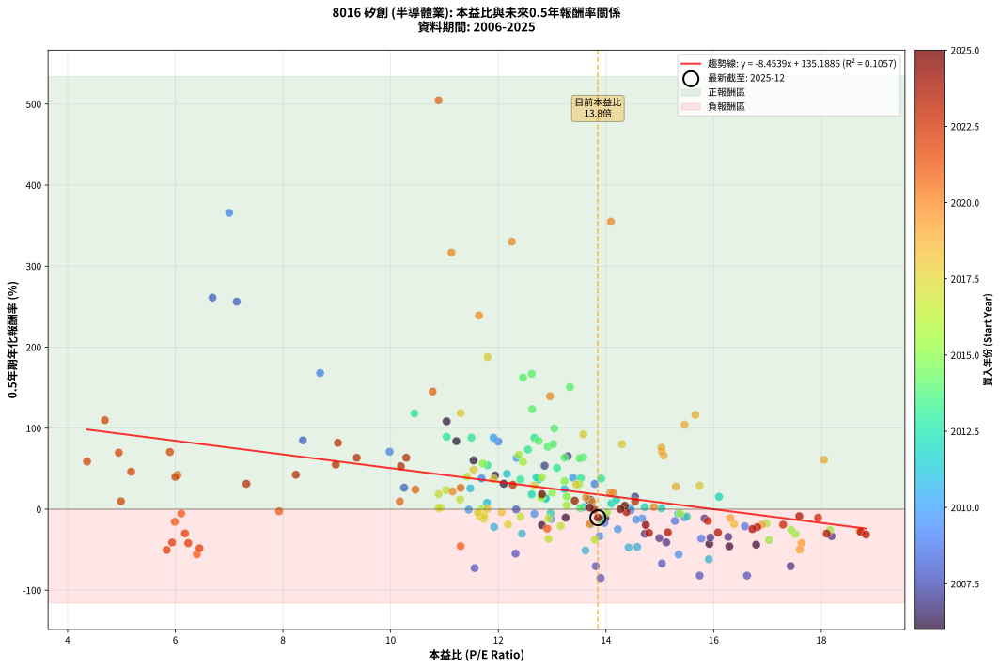
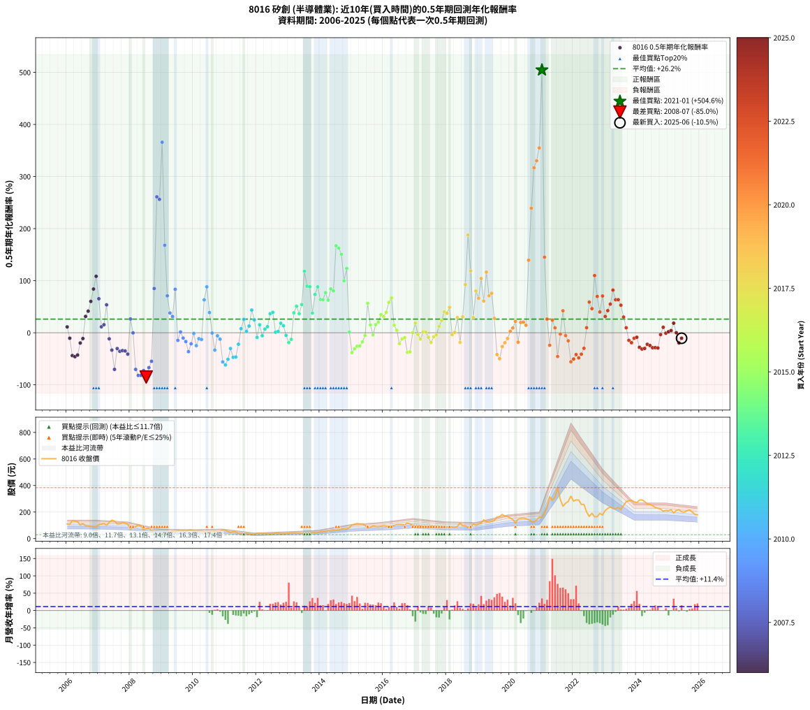

# 8016 矽創 - 本益比與未來報酬率分析

!!! info "報告資訊"
    - **股票代號**: 8016
    - **公司名稱**: 矽創
    - **產業別**: 半導體業
    - **分析期間**: 2006-2025 (234 個數據點)
    - **資料來源**: Type 12 (ShowMonthlyK_ChartFlow) 月收盤價與本益比
    - **報酬率口徑**: 含現金股利 (簡化: 年度合計，假設每年7/1入帳)
    - **報告生成時間**: 2026-01-07 21:24:27 CST

## 📈 視覺化圖表

### 圖表1: 本益比 vs 未來報酬率關係

*圖表1：8016 矽創 本益比與0.5年期未來報酬率關係 (2006-2025)*

### 圖表2: 歷年買入時點的0.5年期實際報酬率

*圖表2：8016 矽創 歷年買入時點的0.5年期實際報酬率 (2006-2025)*

## 📍 買點訊號說明

本報告提供兩種買點提示訊號（顯示於圖表2的股價子圖中）：

### ▲ 小綠色三角形（回測驗證）
- **計算方式**: 使用全部歷史資料計算本益比第25百分位數
- **用途**: 事後驗證，顯示歷史上哪些時點確實為低估區
- **限制**: 當下無法判斷，僅供回測參考
- **特性**: 後見之明（Look-Ahead Bias）

### ▲ 小橘色三角形（即時訊號）
- **計算方式**: 使用截至當月的過去5年資料計算本益比第25百分位數
- **用途**: 實際投資決策，當時即可判斷
- **優勢**: 可操作性強，符合實務需求
- **特性**: 無後見之明，滾動窗口計算

!!! tip "如何使用兩種訊號"
    - **綠色▲** 幫助理解歷史估值機會，驗證策略有效性
    - **橘色▲** 可作為實際買進參考，但仍需搭配基本面分析
    - 兩種訊號重疊時，表示即時判斷與事後驗證一致，信心度較高
    - 僅有綠色▲時，表示當時無法判斷（需要未來資料才能確認）
    - 僅有橘色▲時，表示即時判斷為買點，但事後可能不是最佳時機

## 📊 估值分析摘要

| 指標 | 數值 |
|:---:|:---:|
| **目前本益比** (2025-06) | **13.85 倍** |
| **歷史平均本益比** | 12.89 倍 |
| **估值水準** | 🟡 合理範圍 |
| **預期0.5年年化報酬率** | **+18.10%** |
| **歷史平均報酬率** | +26.20% |
| **相關係數 (R²)** | 0.1057 |
| **趨勢線斜率** | -8.4539 |

!!! abstract "核心洞察"
    目前本益比接近歷史平均，預期報酬率符合長期趨勢

    根據歷史數據回測，8016 矽創 在目前本益比 **13.8倍** 的估值水準下，
    預期未來0.5年年化報酬率約為 **+18.1%**。

    **重要提醒**: 本分析基於歷史數據統計，實際報酬率會受到公司基本面變化、產業趨勢、
    總體經濟環境等多重因素影響。R² = 0.11 表示本益比可解釋約 10.6% 的報酬率變異。

## 📈 歷史估值統計

### 最佳買點 (最高報酬率)

| 項目 | 數值 |
|:---:|:---:|
| 起始時間 | 2021-01 |
| 當時本益比 | 10.89 倍 |
| 起始價格 | 160.5 元 |
| 0.5年後價格 | 384.0 元 |
| **0.5年年化報酬率** | **+504.60%** |

### 最差買點 (最低報酬率)

| 項目 | 數值 |
|:---:|:---:|
| 起始時間 | 2008-07 |
| 當時本益比 | 13.90 倍 |
| 起始價格 | 76.0 元 |
| 0.5年後價格 | 29.2 元 |
| **0.5年年化報酬率** | **-84.97%** |

## 🎯 投資啟示

### 本益比與報酬率關係

趨勢線方程式: **y = -8.4539x + 135.1886**

!!! warning "強負相關"
    本益比與未來報酬率呈現強負相關。在高本益比時期買入，未來報酬率顯著較低；
    在低本益比時期買入，未來報酬率顯著較高。**估值紀律至關重要**。

### 估值區間建議

基於歷史數據分析:

- **🟢 低估區** (P/E < 10.3): 預期報酬率較高，可考慮增加持股
- **🟡 合理區** (P/E 10.3-15.5): 預期報酬率符合長期趨勢，正常持有
- **🔴 高估區** (P/E > 15.5): 預期報酬率較低，可考慮減碼或觀望

!!! danger "風險提示"
    - 過去表現不代表未來結果
    - 本分析假設公司基本面無重大結構性變化
    - 產業環境劇變可能使歷史規律失效
    - 應結合公司財報、產業趨勢、總體經濟等多重因素綜合判斷

!!! success "長期投資觀點"
    歷史數據顯示，在合理或低估的估值水準買入並長期持有，
    往往能獲得較佳的投資報酬。**耐心等待好價格**是價值投資的核心原則。

## 📊 數據品質

- **資料來源**: GoodInfo.tw Type 12 (ShowMonthlyK_ChartFlow)
- **資料頻率**: 月度收盤價與本益比
- **回測期間**: 2006-2025
- **數據點數量**: 234 個 (每個點代表一次0.5年期回測)

### 計算方法說明

1. **0.5年期年化報酬率**:
   - 對每個歷史時點，計算其後0.5年的實際投資報酬率
   - 期末價值(不含股利): 期末價格
   - 期末價值(含現金股利): 期末價格 + 持有期間內的現金股利合計 (簡化: 年度合計，假設每年7/1入帳)
   - 公式: 年化報酬率 = [(期末價值/期初價格)^(1/年數) - 1] × 100%

2. **本益比 (P/E Ratio)**:
   - 使用當時的月收盤價與EPS計算
   - 資料來源: Type 12 月度河流圖本益比數據

3. **趨勢線 (Linear Regression)**:
   - 使用最小平方法擬合線性趨勢線
   - R²值衡量本益比對報酬率的解釋能力

---

*本報告由 Stock Analysis System v1.9.0 自動生成*
*數據更新時間: 2026-01-07 21:24:27 CST*

## 📋 月度回測明細表

（每一列對應時間線圖中的一個買入點；可用來對照 SVG 圖上的每個點。）

| 買入月份 | 賣出月份 | 回測期限_年 | 實際持有年數 | 買入本益比_倍 | 買入收盤價_元 | 賣出收盤價_元 | 現金股利合計_元 | 總報酬率_pct | 年化報酬率_pct |
| --- | --- | --- | --- | --- | --- | --- | --- | --- | --- |
| 2006-01 | 2006-07 | 0.5 | 0.496 | 13.68 | 110.00 | 112.50 | 3.47 | +5.43 | +11.26 |
| 2006-02 | 2006-08 | 0.5 | 0.498 | 13.25 | 106.50 | 97.30 | 3.47 | -5.38 | -10.50 |
| 2006-03 | 2006-10 | 0.5 | 0.586 | 16.79 | 135.00 | 92.80 | 3.47 | -28.69 | -43.85 |
| 2006-04 | 2006-10 | 0.5 | 0.501 | 16.29 | 131.00 | 92.80 | 3.47 | -26.51 | -45.92 |
| 2006-05 | 2006-12 | 0.5 | 0.586 | 15.92 | 128.00 | 88.80 | 3.47 | -27.91 | -42.80 |
| 2006-06 | 2006-12 | 0.5 | 0.501 | 12.81 | 103.00 | 88.80 | 3.47 | -10.42 | -19.71 |
| 2006-07 | 2007-01 | 0.5 | 0.504 | 13.99 | 112.50 | 106.00 | 0.00 | -5.78 | -11.14 |
| 2006-08 | 2007-03 | 0.5 | 0.580 | 12.10 | 97.30 | 114.00 | 0.00 | +17.16 | +31.38 |
| 2006-09 | 2007-03 | 0.5 | 0.496 | 11.94 | 96.00 | 114.00 | 0.00 | +18.75 | +41.45 |
| 2006-10 | 2007-05 | 0.5 | 0.580 | 11.54 | 92.80 | 122.00 | 0.00 | +31.47 | +60.21 |
| 2006-11 | 2007-05 | 0.5 | 0.496 | 11.22 | 90.20 | 122.00 | 0.00 | +35.25 | +83.93 |
| 2006-12 | 2007-07 | 0.5 | 0.580 | 11.04 | 88.80 | 132.00 | 3.99 | +53.15 | +108.41 |
| 2007-01 | 2007-07 | 0.5 | 0.496 | 13.29 | 106.00 | 132.00 | 3.99 | +28.30 | +65.34 |
| 2007-02 | 2007-08 | 0.5 | 0.498 | 13.72 | 108.50 | 110.50 | 3.99 | +5.52 | +11.40 |
| 2007-03 | 2007-10 | 0.5 | 0.586 | 14.54 | 114.00 | 120.00 | 3.99 | +8.77 | +15.42 |
| 2007-04 | 2007-10 | 0.5 | 0.501 | 12.86 | 100.00 | 120.00 | 3.99 | +23.99 | +53.61 |
| 2007-05 | 2007-12 | 0.5 | 0.586 | 15.83 | 122.00 | 109.50 | 3.99 | -6.97 | -11.60 |
| 2007-06 | 2007-12 | 0.5 | 0.501 | 18.19 | 139.00 | 109.50 | 3.99 | -18.35 | -33.28 |
| 2007-07 | 2008-01 | 0.5 | 0.504 | 17.43 | 132.00 | 71.60 | 0.00 | -45.76 | -70.31 |
| 2007-08 | 2008-03 | 0.5 | 0.583 | 14.72 | 110.50 | 89.50 | 0.00 | -19.00 | -30.33 |
| 2007-09 | 2008-03 | 0.5 | 0.498 | 14.99 | 111.50 | 89.50 | 0.00 | -19.73 | -35.67 |
| 2007-10 | 2008-05 | 0.5 | 0.583 | 16.27 | 120.00 | 94.00 | 0.00 | -21.67 | -34.21 |
| 2007-11 | 2008-05 | 0.5 | 0.498 | 15.94 | 116.50 | 94.00 | 0.00 | -19.31 | -34.99 |
| 2007-12 | 2008-07 | 0.5 | 0.583 | 15.12 | 109.50 | 76.00 | 4.49 | -26.49 | -41.00 |
| 2008-01 | 2008-07 | 0.5 | 0.498 | 10.25 | 71.60 | 76.00 | 4.49 | +12.42 | +26.49 |
| 2008-02 | 2008-08 | 0.5 | 0.501 | 12.33 | 83.00 | 78.40 | 4.49 | -0.13 | -0.25 |
| 2008-03 | 2008-10 | 0.5 | 0.586 | 13.81 | 89.50 | 39.40 | 4.49 | -50.96 | -70.36 |
| 2008-04 | 2008-10 | 0.5 | 0.501 | 16.62 | 103.50 | 39.40 | 4.49 | -57.59 | -81.95 |
| 2008-05 | 2008-12 | 0.5 | 0.586 | 15.74 | 94.00 | 30.00 | 4.49 | -63.30 | -81.93 |
| 2008-06 | 2008-12 | 0.5 | 0.501 | 11.56 | 66.10 | 30.00 | 4.49 | -47.82 | -72.70 |
| 2008-07 | 2009-01 | 0.5 | 0.504 | 13.90 | 76.00 | 29.25 | 0.00 | -61.51 | -84.97 |
| 2008-08 | 2009-03 | 0.5 | 0.580 | 15.04 | 78.40 | 41.20 | 0.00 | -47.45 | -66.99 |
| 2008-09 | 2009-03 | 0.5 | 0.496 | 12.32 | 61.10 | 41.20 | 0.00 | -32.57 | -54.85 |
| 2008-10 | 2009-05 | 0.5 | 0.580 | 8.37 | 39.40 | 56.30 | 0.00 | +42.89 | +84.96 |
| 2008-11 | 2009-05 | 0.5 | 0.496 | 6.69 | 29.80 | 56.30 | 0.00 | +88.93 | +261.03 |
| 2008-12 | 2009-07 | 0.5 | 0.580 | 7.14 | 30.00 | 61.70 | 1.00 | +109.00 | +256.10 |
| 2009-01 | 2009-07 | 0.5 | 0.496 | 7.00 | 29.25 | 61.70 | 1.00 | +114.36 | +365.83 |
| 2009-02 | 2009-08 | 0.5 | 0.498 | 8.69 | 36.10 | 58.00 | 1.00 | +63.43 | +168.01 |
| 2009-03 | 2009-10 | 0.5 | 0.586 | 9.98 | 41.20 | 55.40 | 1.00 | +36.89 | +70.91 |
| 2009-04 | 2009-10 | 0.5 | 0.501 | 11.69 | 48.00 | 55.40 | 1.00 | +17.50 | +37.97 |
| 2009-05 | 2009-12 | 0.5 | 0.586 | 13.79 | 56.30 | 65.00 | 1.00 | +17.23 | +31.17 |
| 2009-06 | 2009-12 | 0.5 | 0.501 | 12.00 | 48.70 | 65.00 | 1.00 | +35.52 | +83.44 |
| 2009-07 | 2010-01 | 0.5 | 0.504 | 15.28 | 61.70 | 57.00 | 0.00 | -7.62 | -14.55 |
| 2009-08 | 2010-03 | 0.5 | 0.580 | 14.45 | 58.00 | 58.50 | 0.00 | +0.86 | +1.49 |
| 2009-09 | 2010-03 | 0.5 | 0.496 | 15.46 | 61.70 | 58.50 | 0.00 | -5.19 | -10.19 |
| 2009-10 | 2010-05 | 0.5 | 0.580 | 13.97 | 55.40 | 49.75 | 0.00 | -10.20 | -16.92 |
| 2009-11 | 2010-05 | 0.5 | 0.496 | 15.77 | 62.20 | 49.75 | 0.00 | -20.02 | -36.28 |
| 2009-12 | 2010-07 | 0.5 | 0.580 | 16.58 | 65.00 | 54.60 | 2.00 | -12.92 | -21.21 |
| 2010-01 | 2010-07 | 0.5 | 0.496 | 14.46 | 57.00 | 54.60 | 2.00 | -0.70 | -1.41 |
| 2010-02 | 2010-08 | 0.5 | 0.498 | 14.22 | 56.40 | 46.95 | 2.00 | -13.21 | -24.75 |
| 2010-03 | 2010-10 | 0.5 | 0.586 | 14.67 | 58.50 | 52.50 | 2.00 | -6.84 | -11.39 |
| 2010-04 | 2010-10 | 0.5 | 0.501 | 14.56 | 58.40 | 52.50 | 2.00 | -6.68 | -12.89 |
| 2010-05 | 2010-12 | 0.5 | 0.586 | 12.34 | 49.75 | 64.30 | 2.00 | +33.26 | +63.25 |
| 2010-06 | 2010-12 | 0.5 | 0.501 | 11.91 | 48.30 | 64.30 | 2.00 | +37.27 | +88.17 |
| 2010-07 | 2011-01 | 0.5 | 0.504 | 13.39 | 54.60 | 64.40 | 0.00 | +17.95 | +38.78 |
| 2010-08 | 2011-03 | 0.5 | 0.580 | 11.45 | 46.95 | 46.80 | 0.00 | -0.32 | -0.55 |
| 2010-09 | 2011-03 | 0.5 | 0.496 | 13.88 | 57.20 | 46.80 | 0.00 | -18.18 | -33.30 |
| 2010-10 | 2011-05 | 0.5 | 0.580 | 12.67 | 52.50 | 50.70 | 0.00 | -3.43 | -5.83 |
| 2010-11 | 2011-05 | 0.5 | 0.496 | 12.98 | 54.10 | 50.70 | 0.00 | -6.28 | -12.28 |
| 2010-12 | 2011-07 | 0.5 | 0.580 | 15.35 | 64.30 | 37.65 | 2.30 | -37.87 | -55.96 |
| 2011-01 | 2011-07 | 0.5 | 0.496 | 15.91 | 64.40 | 37.65 | 2.30 | -37.97 | -61.85 |
| 2011-02 | 2011-08 | 0.5 | 0.498 | 13.62 | 53.20 | 35.00 | 2.30 | -29.89 | -50.96 |
| 2011-03 | 2011-10 | 0.5 | 0.586 | 12.44 | 46.80 | 35.60 | 2.30 | -19.02 | -30.23 |
| 2011-04 | 2011-10 | 0.5 | 0.501 | 14.42 | 52.20 | 35.60 | 2.30 | -27.39 | -47.22 |
| 2011-05 | 2011-12 | 0.5 | 0.586 | 14.58 | 50.70 | 32.80 | 2.30 | -30.77 | -46.61 |
| 2011-06 | 2011-12 | 0.5 | 0.501 | 11.92 | 39.75 | 32.80 | 2.30 | -11.70 | -21.99 |
| 2011-07 | 2012-01 | 0.5 | 0.504 | 11.79 | 37.65 | 39.10 | 0.00 | +3.85 | +7.79 |
| 2011-08 | 2012-03 | 0.5 | 0.583 | 11.48 | 35.00 | 40.00 | 0.00 | +14.29 | +25.73 |
| 2011-09 | 2012-03 | 0.5 | 0.498 | 13.59 | 39.50 | 40.00 | 0.00 | +1.27 | +2.56 |
| 2011-10 | 2012-05 | 0.5 | 0.583 | 12.88 | 35.60 | 38.20 | 0.00 | +7.30 | +12.85 |
| 2011-11 | 2012-05 | 0.5 | 0.498 | 12.16 | 31.90 | 38.20 | 0.00 | +19.75 | +43.58 |
| 2011-12 | 2012-07 | 0.5 | 0.583 | 13.23 | 32.80 | 35.30 | 2.00 | +13.72 | +24.67 |
| 2012-01 | 2012-07 | 0.5 | 0.498 | 15.50 | 39.10 | 35.30 | 2.00 | -4.60 | -9.02 |
| 2012-02 | 2012-08 | 0.5 | 0.501 | 16.10 | 41.30 | 42.35 | 2.00 | +7.38 | +15.28 |
| 2012-03 | 2012-10 | 0.5 | 0.586 | 15.34 | 40.00 | 36.65 | 2.00 | -3.38 | -5.69 |
| 2012-04 | 2012-10 | 0.5 | 0.501 | 14.10 | 37.35 | 36.65 | 2.00 | +3.48 | +7.07 |
| 2012-05 | 2012-12 | 0.5 | 0.586 | 14.19 | 38.20 | 38.75 | 2.00 | +6.68 | +11.66 |
| 2012-06 | 2012-12 | 0.5 | 0.501 | 12.75 | 34.85 | 38.75 | 2.00 | +16.93 | +36.64 |
| 2012-07 | 2013-01 | 0.5 | 0.504 | 12.71 | 35.30 | 41.70 | 0.00 | +18.13 | +39.20 |
| 2012-08 | 2013-03 | 0.5 | 0.580 | 15.03 | 42.35 | 42.60 | 0.00 | +0.59 | +1.02 |
| 2012-09 | 2013-03 | 0.5 | 0.496 | 14.72 | 42.10 | 42.60 | 0.00 | +1.19 | +2.41 |
| 2012-10 | 2013-05 | 0.5 | 0.580 | 12.62 | 36.65 | 40.40 | 0.00 | +10.23 | +18.27 |
| 2012-11 | 2013-05 | 0.5 | 0.496 | 12.88 | 37.95 | 40.40 | 0.00 | +6.46 | +13.46 |
| 2012-12 | 2013-07 | 0.5 | 0.580 | 12.97 | 38.75 | 35.10 | 2.50 | -2.97 | -5.06 |
| 2013-01 | 2013-07 | 0.5 | 0.496 | 13.71 | 41.70 | 35.10 | 2.50 | -9.83 | -18.85 |
| 2013-02 | 2013-08 | 0.5 | 0.498 | 13.89 | 43.00 | 37.70 | 2.50 | -6.51 | -12.64 |
| 2013-03 | 2013-10 | 0.5 | 0.586 | 13.53 | 42.60 | 49.00 | 2.50 | +20.89 | +38.24 |
| 2013-04 | 2013-10 | 0.5 | 0.501 | 13.09 | 41.90 | 49.00 | 2.50 | +22.91 | +50.95 |
| 2013-05 | 2013-12 | 0.5 | 0.586 | 12.41 | 40.40 | 46.00 | 2.50 | +20.05 | +36.60 |
| 2013-06 | 2013-12 | 0.5 | 0.501 | 11.80 | 39.05 | 46.00 | 2.50 | +24.20 | +54.12 |
| 2013-07 | 2014-01 | 0.5 | 0.504 | 10.44 | 35.10 | 52.00 | 0.00 | +48.15 | +118.19 |
| 2013-08 | 2014-03 | 0.5 | 0.580 | 11.04 | 37.70 | 54.60 | 0.00 | +44.83 | +89.29 |
| 2013-09 | 2014-03 | 0.5 | 0.496 | 11.50 | 39.90 | 54.60 | 0.00 | +36.84 | +88.32 |
| 2013-10 | 2014-05 | 0.5 | 0.580 | 13.91 | 49.00 | 59.00 | 0.00 | +20.41 | +37.71 |
| 2013-11 | 2014-05 | 0.5 | 0.496 | 12.55 | 44.90 | 59.00 | 0.00 | +31.40 | +73.52 |
| 2013-12 | 2014-07 | 0.5 | 0.580 | 12.67 | 46.00 | 63.40 | 3.00 | +44.35 | +88.22 |
| 2014-01 | 2014-07 | 0.5 | 0.496 | 13.58 | 52.00 | 63.40 | 3.00 | +27.69 | +63.78 |
| 2014-02 | 2014-08 | 0.5 | 0.498 | 13.23 | 53.30 | 65.10 | 3.00 | +27.77 | +63.52 |
| 2014-03 | 2014-10 | 0.5 | 0.586 | 12.92 | 54.60 | 73.30 | 3.00 | +39.75 | +77.03 |
| 2014-04 | 2014-10 | 0.5 | 0.501 | 13.51 | 59.80 | 73.30 | 3.00 | +27.59 | +62.64 |
| 2014-05 | 2014-12 | 0.5 | 0.586 | 12.75 | 59.00 | 81.40 | 3.00 | +43.05 | +84.25 |
| 2014-06 | 2014-12 | 0.5 | 0.501 | 13.02 | 62.80 | 81.40 | 3.00 | +34.40 | +80.41 |
| 2014-07 | 2015-01 | 0.5 | 0.504 | 12.62 | 63.40 | 104.00 | 0.00 | +64.04 | +167.10 |
| 2014-08 | 2015-03 | 0.5 | 0.580 | 12.46 | 65.10 | 114.00 | 0.00 | +75.12 | +162.55 |
| 2014-09 | 2015-03 | 0.5 | 0.496 | 13.33 | 72.30 | 114.00 | 0.00 | +57.68 | +150.66 |
| 2014-10 | 2015-05 | 0.5 | 0.580 | 13.04 | 73.30 | 109.50 | 0.00 | +49.39 | +99.67 |
| 2014-11 | 2015-05 | 0.5 | 0.496 | 12.63 | 73.50 | 109.50 | 0.00 | +48.98 | +123.54 |
| 2014-12 | 2015-07 | 0.5 | 0.580 | 13.52 | 81.40 | 77.50 | 4.50 | +0.74 | +1.27 |
| 2015-01 | 2015-07 | 0.5 | 0.496 | 17.03 | 104.00 | 77.50 | 4.50 | -21.15 | -38.10 |
| 2015-02 | 2015-08 | 0.5 | 0.498 | 17.52 | 108.50 | 85.90 | 4.50 | -16.68 | -30.67 |
| 2015-03 | 2015-10 | 0.5 | 0.586 | 18.16 | 114.00 | 91.30 | 4.50 | -15.96 | -25.69 |
| 2015-04 | 2015-10 | 0.5 | 0.501 | 17.44 | 111.00 | 91.30 | 4.50 | -13.69 | -25.47 |
| 2015-05 | 2015-12 | 0.5 | 0.586 | 16.98 | 109.50 | 93.30 | 4.50 | -10.68 | -17.54 |
| 2015-06 | 2015-12 | 0.5 | 0.501 | 15.38 | 100.50 | 93.30 | 4.50 | -2.69 | -5.29 |
| 2015-07 | 2016-01 | 0.5 | 0.504 | 11.71 | 77.50 | 97.10 | 0.00 | +25.29 | +56.45 |
| 2015-08 | 2016-03 | 0.5 | 0.583 | 12.81 | 85.90 | 93.20 | 0.00 | +8.50 | +15.01 |
| 2015-09 | 2016-03 | 0.5 | 0.498 | 14.02 | 95.20 | 93.20 | 0.00 | -2.10 | -4.17 |
| 2015-10 | 2016-05 | 0.5 | 0.583 | 13.27 | 91.30 | 99.30 | 0.00 | +8.76 | +15.49 |
| 2015-11 | 2016-05 | 0.5 | 0.498 | 13.00 | 90.50 | 99.30 | 0.00 | +9.72 | +20.47 |
| 2015-12 | 2016-07 | 0.5 | 0.583 | 13.23 | 93.30 | 106.00 | 5.00 | +18.97 | +34.70 |
| 2016-01 | 2016-07 | 0.5 | 0.498 | 13.50 | 97.10 | 106.00 | 5.00 | +14.32 | +30.80 |
| 2016-02 | 2016-08 | 0.5 | 0.501 | 12.81 | 94.00 | 106.00 | 5.00 | +18.09 | +39.35 |
| 2016-03 | 2016-10 | 0.5 | 0.586 | 12.46 | 93.20 | 117.00 | 5.00 | +30.90 | +58.34 |
| 2016-04 | 2016-10 | 0.5 | 0.501 | 12.38 | 94.40 | 117.00 | 5.00 | +29.24 | +66.85 |
| 2016-05 | 2016-12 | 0.5 | 0.586 | 12.79 | 99.30 | 102.50 | 5.00 | +8.26 | +14.50 |
| 2016-06 | 2016-12 | 0.5 | 0.501 | 13.27 | 105.00 | 102.50 | 5.00 | +2.38 | +4.81 |
| 2016-07 | 2017-01 | 0.5 | 0.504 | 13.16 | 106.00 | 94.20 | 0.00 | -11.13 | -20.89 |
| 2016-08 | 2017-03 | 0.5 | 0.580 | 12.93 | 106.00 | 98.60 | 0.00 | -6.98 | -11.72 |
| 2016-09 | 2017-03 | 0.5 | 0.496 | 12.41 | 103.50 | 98.60 | 0.00 | -4.73 | -9.32 |
| 2016-10 | 2017-05 | 0.5 | 0.580 | 13.79 | 117.00 | 88.90 | 0.00 | -24.02 | -37.70 |
| 2016-11 | 2017-05 | 0.5 | 0.496 | 12.93 | 111.50 | 88.90 | 0.00 | -20.27 | -36.69 |
| 2016-12 | 2017-07 | 0.5 | 0.580 | 11.69 | 102.50 | 96.50 | 6.00 | +0.00 | +0.00 |
| 2017-01 | 2017-07 | 0.5 | 0.496 | 10.89 | 94.20 | 96.50 | 6.00 | +8.81 | +18.58 |
| 2017-02 | 2017-08 | 0.5 | 0.498 | 11.64 | 99.30 | 91.60 | 6.00 | -1.71 | -3.41 |
| 2017-03 | 2017-10 | 0.5 | 0.586 | 11.73 | 98.60 | 85.40 | 6.00 | -7.30 | -12.14 |
| 2017-04 | 2017-10 | 0.5 | 0.501 | 10.93 | 90.60 | 85.40 | 6.00 | +0.88 | +1.77 |
| 2017-05 | 2017-12 | 0.5 | 0.586 | 10.89 | 88.90 | 83.60 | 6.00 | +0.79 | +1.35 |
| 2017-06 | 2017-12 | 0.5 | 0.501 | 11.66 | 93.80 | 83.60 | 6.00 | -4.48 | -8.74 |
| 2017-07 | 2018-01 | 0.5 | 0.504 | 12.18 | 96.50 | 86.90 | 0.00 | -9.95 | -18.78 |
| 2017-08 | 2018-03 | 0.5 | 0.580 | 11.74 | 91.60 | 87.40 | 0.00 | -4.59 | -7.77 |
| 2017-09 | 2018-03 | 0.5 | 0.496 | 11.62 | 89.30 | 87.40 | 0.00 | -2.13 | -4.25 |
| 2017-10 | 2018-05 | 0.5 | 0.580 | 11.29 | 85.40 | 91.20 | 0.00 | +6.79 | +11.99 |
| 2017-11 | 2018-05 | 0.5 | 0.496 | 11.03 | 82.10 | 91.20 | 0.00 | +11.08 | +23.63 |
| 2017-12 | 2018-07 | 0.5 | 0.580 | 11.42 | 83.60 | 96.20 | 5.50 | +21.65 | +40.17 |
| 2018-01 | 2018-07 | 0.5 | 0.496 | 11.91 | 86.90 | 96.20 | 5.50 | +17.03 | +37.35 |
| 2018-02 | 2018-08 | 0.5 | 0.498 | 11.54 | 83.90 | 96.80 | 5.50 | +21.93 | +48.88 |
| 2018-03 | 2018-10 | 0.5 | 0.586 | 12.06 | 87.40 | 80.00 | 5.50 | -2.17 | -3.68 |
| 2018-04 | 2018-10 | 0.5 | 0.501 | 11.80 | 85.20 | 80.00 | 5.50 | +0.35 | +0.71 |
| 2018-05 | 2018-12 | 0.5 | 0.586 | 12.67 | 91.20 | 100.50 | 5.50 | +16.23 | +29.26 |
| 2018-06 | 2018-12 | 0.5 | 0.501 | 16.38 | 117.50 | 100.50 | 5.50 | -9.79 | -18.58 |
| 2018-07 | 2019-01 | 0.5 | 0.504 | 13.45 | 96.20 | 110.00 | 0.00 | +14.35 | +30.49 |
| 2018-08 | 2019-03 | 0.5 | 0.580 | 13.58 | 96.80 | 141.50 | 0.00 | +46.18 | +92.34 |
| 2018-09 | 2019-03 | 0.5 | 0.496 | 11.80 | 83.80 | 141.50 | 0.00 | +68.85 | +187.81 |
| 2018-10 | 2019-05 | 0.5 | 0.580 | 11.30 | 80.00 | 126.00 | 0.00 | +57.50 | +118.72 |
| 2018-11 | 2019-05 | 0.5 | 0.496 | 15.74 | 111.00 | 126.00 | 0.00 | +13.51 | +29.15 |
| 2018-12 | 2019-07 | 0.5 | 0.580 | 14.30 | 100.50 | 136.50 | 5.00 | +40.80 | +80.30 |
| 2019-01 | 2019-07 | 0.5 | 0.496 | 15.07 | 110.00 | 136.50 | 5.00 | +28.64 | +66.22 |
| 2019-02 | 2019-08 | 0.5 | 0.498 | 15.46 | 117.00 | 162.00 | 5.00 | +42.74 | +104.23 |
| 2019-03 | 2019-10 | 0.5 | 0.586 | 18.05 | 141.50 | 182.00 | 5.00 | +32.16 | +60.94 |
| 2019-04 | 2019-10 | 0.5 | 0.501 | 15.66 | 127.00 | 182.00 | 5.00 | +47.24 | +116.46 |
| 2019-05 | 2019-12 | 0.5 | 0.586 | 15.04 | 126.00 | 167.50 | 5.00 | +36.90 | +70.94 |
| 2019-06 | 2019-12 | 0.5 | 0.501 | 15.03 | 130.00 | 167.50 | 5.00 | +32.69 | +75.87 |
| 2019-07 | 2020-01 | 0.5 | 0.504 | 15.30 | 136.50 | 154.50 | 0.00 | +13.19 | +27.88 |
| 2019-08 | 2020-03 | 0.5 | 0.583 | 17.63 | 162.00 | 118.00 | 0.00 | -27.16 | -41.93 |
| 2019-09 | 2020-03 | 0.5 | 0.498 | 17.60 | 166.50 | 118.00 | 0.00 | -29.13 | -49.89 |
| 2019-10 | 2020-05 | 0.5 | 0.583 | 18.71 | 182.00 | 152.00 | 0.00 | -16.48 | -26.57 |
| 2019-11 | 2020-05 | 0.5 | 0.498 | 16.90 | 169.00 | 152.00 | 0.00 | -10.06 | -19.17 |
| 2019-12 | 2020-07 | 0.5 | 0.583 | 16.31 | 167.50 | 150.00 | 6.50 | -6.57 | -11.00 |
| 2020-01 | 2020-07 | 0.5 | 0.498 | 14.89 | 154.50 | 150.00 | 6.50 | +1.29 | +2.61 |
| 2020-02 | 2020-08 | 0.5 | 0.501 | 13.74 | 144.00 | 144.00 | 6.50 | +4.51 | +9.21 |
| 2020-03 | 2020-10 | 0.5 | 0.586 | 11.15 | 118.00 | 126.00 | 6.50 | +12.29 | +21.87 |
| 2020-04 | 2020-10 | 0.5 | 0.501 | 13.70 | 146.50 | 126.00 | 6.50 | -9.56 | -18.17 |
| 2020-05 | 2020-12 | 0.5 | 0.586 | 14.08 | 152.00 | 162.50 | 6.50 | +11.18 | +19.84 |
| 2020-06 | 2020-12 | 0.5 | 0.501 | 14.13 | 154.00 | 162.50 | 6.50 | +9.74 | +20.38 |
| 2020-07 | 2021-01 | 0.5 | 0.504 | 13.63 | 150.00 | 160.50 | 0.00 | +7.00 | +14.37 |
| 2020-08 | 2021-03 | 0.5 | 0.580 | 12.96 | 144.00 | 239.00 | 0.00 | +65.97 | +139.38 |
| 2020-09 | 2021-03 | 0.5 | 0.496 | 11.64 | 130.50 | 239.00 | 0.00 | +83.14 | +239.07 |
| 2020-10 | 2021-05 | 0.5 | 0.580 | 11.13 | 126.00 | 288.50 | 0.00 | +128.97 | +316.72 |
| 2020-11 | 2021-05 | 0.5 | 0.496 | 12.25 | 140.00 | 288.50 | 0.00 | +106.07 | +330.20 |
| 2020-12 | 2021-07 | 0.5 | 0.580 | 14.09 | 162.50 | 384.00 | 7.50 | +140.92 | +354.91 |
| 2021-01 | 2021-07 | 0.5 | 0.496 | 10.89 | 160.50 | 384.00 | 7.50 | +143.93 | +504.60 |
| 2021-02 | 2021-08 | 0.5 | 0.498 | 10.78 | 193.50 | 295.00 | 7.50 | +56.33 | +145.14 |
| 2021-03 | 2021-10 | 0.5 | 0.586 | 11.30 | 239.00 | 266.50 | 7.50 | +14.64 | +26.27 |
| 2021-04 | 2021-10 | 0.5 | 0.501 | 12.91 | 314.50 | 266.50 | 7.50 | -12.88 | -24.05 |
| 2021-05 | 2021-12 | 0.5 | 0.586 | 10.46 | 288.50 | 320.00 | 7.50 | +13.52 | +24.16 |
| 2021-06 | 2021-12 | 0.5 | 0.501 | 10.17 | 313.00 | 320.00 | 7.50 | +4.63 | +9.46 |
| 2021-07 | 2022-01 | 0.5 | 0.504 | 11.30 | 384.00 | 282.50 | 0.00 | -26.43 | -45.63 |
| 2021-08 | 2022-03 | 0.5 | 0.580 | 7.93 | 295.00 | 290.50 | 0.00 | -1.53 | -2.61 |
| 2021-09 | 2022-03 | 0.5 | 0.496 | 6.04 | 244.00 | 290.50 | 0.00 | +19.06 | +42.19 |
| 2021-10 | 2022-05 | 0.5 | 0.580 | 6.11 | 266.50 | 258.00 | 0.00 | -3.19 | -5.43 |
| 2021-11 | 2022-05 | 0.5 | 0.496 | 5.99 | 280.50 | 258.00 | 0.00 | -8.02 | -15.53 |
| 2021-12 | 2022-07 | 0.5 | 0.580 | 6.40 | 320.00 | 167.50 | 32.00 | -37.66 | -55.69 |
| 2022-01 | 2022-07 | 0.5 | 0.496 | 5.84 | 282.50 | 167.50 | 32.00 | -29.38 | -50.44 |
| 2022-02 | 2022-08 | 0.5 | 0.498 | 6.24 | 291.50 | 190.50 | 32.00 | -23.67 | -41.85 |
| 2022-03 | 2022-10 | 0.5 | 0.586 | 6.45 | 290.50 | 165.50 | 32.00 | -32.01 | -48.24 |
| 2022-04 | 2022-10 | 0.5 | 0.501 | 5.94 | 257.50 | 165.50 | 32.00 | -23.30 | -41.11 |
| 2022-05 | 2022-12 | 0.5 | 0.586 | 6.18 | 258.00 | 177.50 | 32.00 | -18.80 | -29.91 |
| 2022-06 | 2022-12 | 0.5 | 0.501 | 4.99 | 200.00 | 177.50 | 32.00 | +4.75 | +9.70 |
| 2022-07 | 2023-01 | 0.5 | 0.504 | 4.36 | 167.50 | 211.50 | 0.00 | +26.27 | +58.88 |
| 2022-08 | 2023-03 | 0.5 | 0.580 | 5.18 | 190.50 | 237.50 | 0.00 | +24.67 | +46.22 |
| 2022-09 | 2023-03 | 0.5 | 0.496 | 4.69 | 164.50 | 237.50 | 0.00 | +44.38 | +109.83 |
| 2022-10 | 2023-05 | 0.5 | 0.580 | 4.95 | 165.50 | 225.00 | 0.00 | +35.95 | +69.75 |
| 2022-11 | 2023-05 | 0.5 | 0.496 | 6.00 | 190.50 | 225.00 | 0.00 | +18.11 | +39.92 |
| 2022-12 | 2023-07 | 0.5 | 0.580 | 5.90 | 177.50 | 220.00 | 22.00 | +36.34 | +70.58 |
| 2023-01 | 2023-07 | 0.5 | 0.496 | 7.32 | 211.50 | 220.00 | 22.00 | +14.42 | +31.24 |
| 2023-02 | 2023-08 | 0.5 | 0.498 | 8.24 | 228.00 | 250.00 | 22.00 | +19.30 | +42.49 |
| 2023-03 | 2023-10 | 0.5 | 0.586 | 8.98 | 237.50 | 285.00 | 22.00 | +29.26 | +54.98 |
| 2023-04 | 2023-10 | 0.5 | 0.501 | 9.02 | 227.50 | 285.00 | 22.00 | +34.95 | +81.88 |
| 2023-05 | 2023-12 | 0.5 | 0.586 | 9.37 | 225.00 | 278.00 | 22.00 | +33.33 | +63.40 |
| 2023-06 | 2023-12 | 0.5 | 0.501 | 10.29 | 234.50 | 278.00 | 22.00 | +27.93 | +63.50 |
| 2023-07 | 2024-01 | 0.5 | 0.504 | 10.19 | 220.00 | 272.50 | 0.00 | +23.86 | +52.93 |
| 2023-08 | 2024-03 | 0.5 | 0.583 | 12.27 | 250.00 | 291.50 | 0.00 | +16.60 | +30.13 |
| 2023-09 | 2024-03 | 0.5 | 0.498 | 14.54 | 278.50 | 291.50 | 0.00 | +4.67 | +9.59 |
| 2023-10 | 2024-05 | 0.5 | 0.583 | 15.89 | 285.00 | 260.00 | 0.00 | -8.77 | -14.57 |
| 2023-11 | 2024-05 | 0.5 | 0.498 | 17.29 | 289.00 | 260.00 | 0.00 | -10.03 | -19.12 |
| 2023-12 | 2024-07 | 0.5 | 0.583 | 17.94 | 278.00 | 248.50 | 12.00 | -6.29 | -10.55 |
| 2024-01 | 2024-07 | 0.5 | 0.498 | 17.59 | 272.50 | 248.50 | 12.00 | -4.40 | -8.64 |
| 2024-02 | 2024-08 | 0.5 | 0.501 | 18.73 | 290.00 | 234.00 | 12.00 | -15.17 | -27.99 |
| 2024-03 | 2024-10 | 0.5 | 0.586 | 18.83 | 291.50 | 222.00 | 12.00 | -19.73 | -31.27 |
| 2024-04 | 2024-10 | 0.5 | 0.501 | 18.10 | 280.00 | 222.00 | 12.00 | -16.43 | -30.11 |
| 2024-05 | 2024-12 | 0.5 | 0.586 | 16.81 | 260.00 | 212.50 | 12.00 | -13.65 | -22.16 |
| 2024-06 | 2024-12 | 0.5 | 0.501 | 16.72 | 258.50 | 212.50 | 12.00 | -13.15 | -24.53 |
| 2024-07 | 2025-01 | 0.5 | 0.504 | 16.08 | 248.50 | 209.50 | 0.00 | -15.69 | -28.74 |
| 2024-08 | 2025-03 | 0.5 | 0.580 | 15.15 | 234.00 | 192.50 | 0.00 | -17.74 | -28.56 |
| 2024-09 | 2025-03 | 0.5 | 0.496 | 14.80 | 228.50 | 192.50 | 0.00 | -15.75 | -29.25 |
| 2024-10 | 2025-05 | 0.5 | 0.580 | 14.38 | 222.00 | 217.50 | 0.00 | -2.03 | -3.47 |
| 2024-11 | 2025-05 | 0.5 | 0.496 | 13.42 | 207.00 | 217.50 | 0.00 | +5.07 | +10.50 |
| 2024-12 | 2025-07 | 0.5 | 0.580 | 13.78 | 212.50 | 199.50 | 12.00 | -0.47 | -0.81 |
| 2025-01 | 2025-07 | 0.5 | 0.496 | 13.70 | 209.50 | 199.50 | 12.00 | +0.95 | +1.94 |
| 2025-02 | 2025-08 | 0.5 | 0.498 | 14.35 | 217.50 | 210.00 | 12.00 | +2.07 | +4.20 |
| 2025-03 | 2025-10 | 0.5 | 0.586 | 12.81 | 192.50 | 200.50 | 12.00 | +10.39 | +18.38 |
| 2025-04 | 2025-10 | 0.5 | 0.501 | 14.27 | 212.50 | 200.50 | 12.00 | +0.00 | +0.00 |
| 2025-05 | 2025-12 | 0.5 | 0.586 | 14.74 | 217.50 | 179.50 | 12.00 | -11.95 | -19.53 |
| 2025-06 | 2025-12 | 0.5 | 0.501 | 13.85 | 202.50 | 179.50 | 12.00 | -5.43 | -10.55 |
