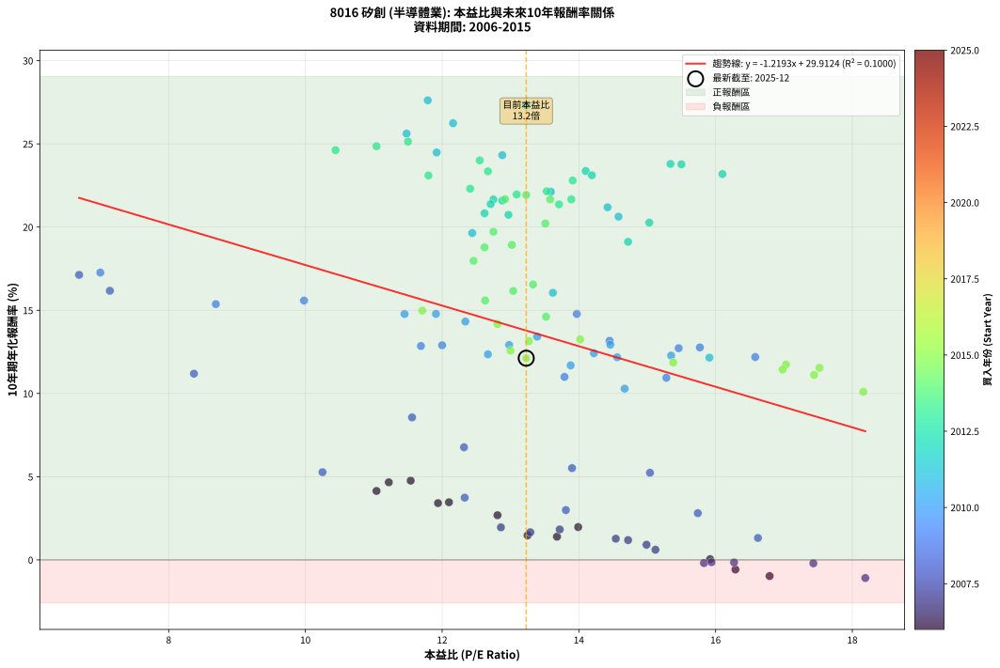
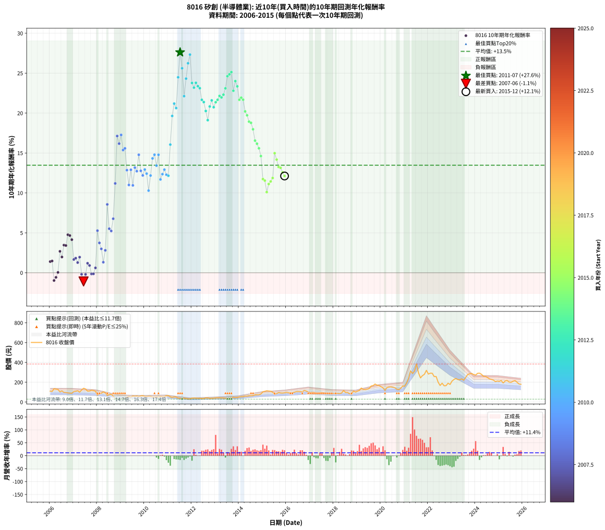

# 8016 矽創 - 本益比與未來報酬率分析

!!! info "報告資訊"
    - **股票代號**: 8016
    - **公司名稱**: 矽創
    - **產業別**: 半導體業
    - **分析期間**: 2006-2015 (120 個數據點)
    - **資料來源**: Type 12 (ShowMonthlyK_ChartFlow) 月收盤價與本益比
    - **報酬率口徑**: 含現金股利 (簡化: 年度合計，假設每年7/1入帳)
    - **報告生成時間**: 2026-01-06 19:16:01 CST

## 📈 視覺化圖表

### 圖表1: 本益比 vs 未來報酬率關係

*圖表1：8016 矽創 本益比與10年期未來報酬率關係 (2006-2015)*

### 圖表2: 歷年買入時點的10年期實際報酬率

*圖表2：8016 矽創 歷年買入時點的10年期實際報酬率 (2006-2015)*

## 📍 買點訊號說明

本報告提供兩種買點提示訊號（顯示於圖表2的股價子圖中）：

### ▲ 小綠色三角形（回測驗證）
- **計算方式**: 使用全部歷史資料計算本益比第25百分位數
- **用途**: 事後驗證，顯示歷史上哪些時點確實為低估區
- **限制**: 當下無法判斷，僅供回測參考
- **特性**: 後見之明（Look-Ahead Bias）

### ▲ 小橘色三角形（即時訊號）
- **計算方式**: 使用截至當月的過去5年資料計算本益比第25百分位數
- **用途**: 實際投資決策，當時即可判斷
- **優勢**: 可操作性強，符合實務需求
- **特性**: 無後見之明，滾動窗口計算

!!! tip "如何使用兩種訊號"
    - **綠色▲** 幫助理解歷史估值機會，驗證策略有效性
    - **橘色▲** 可作為實際買進參考，但仍需搭配基本面分析
    - 兩種訊號重疊時，表示即時判斷與事後驗證一致，信心度較高
    - 僅有綠色▲時，表示當時無法判斷（需要未來資料才能確認）
    - 僅有橘色▲時，表示即時判斷為買點，但事後可能不是最佳時機

## 📊 估值分析摘要

| 指標 | 數值 |
|:---:|:---:|
| **目前本益比** (2015-12) | **13.23 倍** |
| **歷史平均本益比** | 13.49 倍 |
| **估值水準** | 🟡 合理範圍 |
| **預期10年年化報酬率** | **+13.78%** |
| **歷史平均報酬率** | +13.47% |
| **相關係數 (R²)** | 0.1000 |
| **趨勢線斜率** | -1.2193 |

!!! abstract "核心洞察"
    目前本益比接近歷史平均，預期報酬率符合長期趨勢

    根據歷史數據回測，8016 矽創 在目前本益比 **13.2倍** 的估值水準下，
    預期未來10年年化報酬率約為 **+13.8%**。

    **重要提醒**: 本分析基於歷史數據統計，實際報酬率會受到公司基本面變化、產業趨勢、
    總體經濟環境等多重因素影響。R² = 0.10 表示本益比可解釋約 10.0% 的報酬率變異。

## 📈 歷史估值統計

### 最佳買點 (最高報酬率)

| 項目 | 數值 |
|:---:|:---:|
| 起始時間 | 2011-07 |
| 當時本益比 | 11.79 倍 |
| 起始價格 | 37.6 元 |
| 10年後價格 | 384.0 元 |
| **10年年化報酬率** | **+27.62%** |

### 最差買點 (最低報酬率)

| 項目 | 數值 |
|:---:|:---:|
| 起始時間 | 2007-06 |
| 當時本益比 | 18.19 倍 |
| 起始價格 | 139.0 元 |
| 10年後價格 | 93.8 元 |
| **10年年化報酬率** | **-1.09%** |

## 🎯 投資啟示

### 本益比與報酬率關係

趨勢線方程式: **y = -1.2193x + 29.9124**

!!! warning "強負相關"
    本益比與未來報酬率呈現強負相關。在高本益比時期買入，未來報酬率顯著較低；
    在低本益比時期買入，未來報酬率顯著較高。**估值紀律至關重要**。

### 估值區間建議

基於歷史數據分析:

- **🟢 低估區** (P/E < 10.8): 預期報酬率較高，可考慮增加持股
- **🟡 合理區** (P/E 10.8-16.2): 預期報酬率符合長期趨勢，正常持有
- **🔴 高估區** (P/E > 16.2): 預期報酬率較低，可考慮減碼或觀望

!!! danger "風險提示"
    - 過去表現不代表未來結果
    - 本分析假設公司基本面無重大結構性變化
    - 產業環境劇變可能使歷史規律失效
    - 應結合公司財報、產業趨勢、總體經濟等多重因素綜合判斷

!!! success "長期投資觀點"
    歷史數據顯示，在合理或低估的估值水準買入並長期持有，
    往往能獲得較佳的投資報酬。**耐心等待好價格**是價值投資的核心原則。

## 📊 數據品質

- **資料來源**: GoodInfo.tw Type 12 (ShowMonthlyK_ChartFlow)
- **資料頻率**: 月度收盤價與本益比
- **回測期間**: 2006-2015
- **數據點數量**: 120 個 (每個點代表一次10年期回測)

### 計算方法說明

1. **10年期年化報酬率**:
   - 對每個歷史時點，計算其後10年的實際投資報酬率
   - 期末價值(不含股利): 期末價格
   - 期末價值(含現金股利): 期末價格 + 持有期間內的現金股利合計 (簡化: 年度合計，假設每年7/1入帳)
   - 公式: 年化報酬率 = [(期末價值/期初價格)^(1/年數) - 1] × 100%

2. **本益比 (P/E Ratio)**:
   - 使用當時的月收盤價與EPS計算
   - 資料來源: Type 12 月度河流圖本益比數據

3. **趨勢線 (Linear Regression)**:
   - 使用最小平方法擬合線性趨勢線
   - R²值衡量本益比對報酬率的解釋能力

---

*本報告由 Stock Analysis System v1.9.0 自動生成*
*數據更新時間: 2026-01-06 19:16:01 CST*

## 📋 月度回測明細表

（每一列對應時間線圖中的一個買入點；可用來對照 SVG 圖上的每個點。）

| 買入月份 | 賣出月份 | 回測期限_年 | 實際持有年數 | 買入本益比_倍 | 買入收盤價_元 | 賣出收盤價_元 | 現金股利合計_元 | 總報酬率_pct | 年化報酬率_pct |
| --- | --- | --- | --- | --- | --- | --- | --- | --- | --- |
| 2006-01 | 2016-01 | 10 | 9.999 | 13.68 | 110.00 | 97.10 | 29.26 | +14.87 | +1.40 |
| 2006-02 | 2016-02 | 10 | 9.999 | 13.25 | 106.50 | 94.00 | 29.26 | +15.74 | +1.47 |
| 2006-03 | 2016-03 | 10 | 10.001 | 16.79 | 135.00 | 93.20 | 29.26 | -9.29 | -0.97 |
| 2006-04 | 2016-04 | 10 | 10.001 | 16.29 | 131.00 | 94.40 | 29.26 | -5.60 | -0.57 |
| 2006-05 | 2016-05 | 10 | 10.001 | 15.92 | 128.00 | 99.30 | 29.26 | +0.44 | +0.04 |
| 2006-06 | 2016-06 | 10 | 10.001 | 12.81 | 103.00 | 105.00 | 29.26 | +30.35 | +2.69 |
| 2006-07 | 2016-07 | 10 | 10.001 | 13.99 | 112.50 | 106.00 | 30.79 | +21.59 | +1.97 |
| 2006-08 | 2016-08 | 10 | 10.001 | 12.10 | 97.30 | 106.00 | 30.79 | +40.58 | +3.46 |
| 2006-09 | 2016-09 | 10 | 10.001 | 11.94 | 96.00 | 103.50 | 30.79 | +39.88 | +3.41 |
| 2006-10 | 2016-10 | 10 | 10.001 | 11.54 | 92.80 | 117.00 | 30.79 | +59.25 | +4.76 |
| 2006-11 | 2016-11 | 10 | 10.001 | 11.22 | 90.20 | 111.50 | 30.79 | +57.75 | +4.66 |
| 2006-12 | 2016-12 | 10 | 10.001 | 11.04 | 88.80 | 102.50 | 30.79 | +50.10 | +4.14 |
| 2007-01 | 2017-01 | 10 | 10.001 | 13.29 | 106.00 | 94.20 | 30.79 | +17.91 | +1.66 |
| 2007-02 | 2017-02 | 10 | 10.001 | 13.72 | 108.50 | 99.30 | 30.79 | +19.90 | +1.83 |
| 2007-03 | 2017-03 | 10 | 10.001 | 14.54 | 114.00 | 98.60 | 30.79 | +13.50 | +1.27 |
| 2007-04 | 2017-04 | 10 | 10.001 | 12.86 | 100.00 | 90.60 | 30.79 | +21.39 | +1.96 |
| 2007-05 | 2017-05 | 10 | 10.001 | 15.83 | 122.00 | 88.90 | 30.79 | -1.90 | -0.19 |
| 2007-06 | 2017-06 | 10 | 10.001 | 18.19 | 139.00 | 93.80 | 30.79 | -10.37 | -1.09 |
| 2007-07 | 2017-07 | 10 | 10.001 | 17.43 | 132.00 | 96.50 | 32.79 | -2.05 | -0.21 |
| 2007-08 | 2017-08 | 10 | 10.001 | 14.72 | 110.50 | 91.60 | 32.79 | +12.57 | +1.19 |
| 2007-09 | 2017-09 | 10 | 10.001 | 14.99 | 111.50 | 89.30 | 32.79 | +9.50 | +0.91 |
| 2007-10 | 2017-10 | 10 | 10.001 | 16.27 | 120.00 | 85.40 | 32.79 | -1.50 | -0.15 |
| 2007-11 | 2017-11 | 10 | 10.001 | 15.94 | 116.50 | 82.10 | 32.79 | -1.38 | -0.14 |
| 2007-12 | 2017-12 | 10 | 10.001 | 15.12 | 109.50 | 83.60 | 32.79 | +6.30 | +0.61 |
| 2008-01 | 2018-01 | 10 | 10.001 | 10.25 | 71.60 | 86.90 | 32.79 | +67.17 | +5.27 |
| 2008-02 | 2018-03 | 10 | 10.081 | 12.33 | 83.00 | 87.40 | 32.79 | +44.81 | +3.74 |
| 2008-03 | 2018-03 | 10 | 9.999 | 13.81 | 89.50 | 87.40 | 32.79 | +34.29 | +2.99 |
| 2008-04 | 2018-04 | 10 | 9.999 | 16.62 | 103.50 | 85.20 | 32.79 | +14.00 | +1.32 |
| 2008-05 | 2018-05 | 10 | 9.999 | 15.74 | 94.00 | 91.20 | 32.79 | +31.91 | +2.81 |
| 2008-06 | 2018-06 | 10 | 9.999 | 11.56 | 66.10 | 117.50 | 32.79 | +127.37 | +8.56 |
| 2008-07 | 2018-07 | 10 | 9.999 | 13.90 | 76.00 | 96.20 | 33.80 | +71.05 | +5.52 |
| 2008-08 | 2018-08 | 10 | 9.999 | 15.04 | 78.40 | 96.80 | 33.80 | +66.58 | +5.24 |
| 2008-09 | 2018-09 | 10 | 9.999 | 12.32 | 61.10 | 83.80 | 33.80 | +92.47 | +6.77 |
| 2008-10 | 2018-10 | 10 | 9.999 | 8.37 | 39.40 | 80.00 | 33.80 | +188.84 | +11.19 |
| 2008-11 | 2018-11 | 10 | 9.999 | 6.69 | 29.80 | 111.00 | 33.80 | +385.91 | +17.13 |
| 2008-12 | 2018-12 | 10 | 9.999 | 7.14 | 30.00 | 100.50 | 33.80 | +347.67 | +16.17 |
| 2009-01 | 2019-01 | 10 | 9.999 | 7.00 | 29.25 | 110.00 | 33.80 | +391.63 | +17.27 |
| 2009-02 | 2019-02 | 10 | 9.999 | 8.69 | 36.10 | 117.00 | 33.80 | +317.73 | +15.37 |
| 2009-03 | 2019-03 | 10 | 9.999 | 9.98 | 41.20 | 141.50 | 33.80 | +325.49 | +15.58 |
| 2009-04 | 2019-04 | 10 | 9.999 | 11.69 | 48.00 | 127.00 | 33.80 | +235.00 | +12.85 |
| 2009-05 | 2019-05 | 10 | 9.999 | 13.79 | 56.30 | 126.00 | 33.80 | +183.84 | +11.00 |
| 2009-06 | 2019-06 | 10 | 9.999 | 12.00 | 48.70 | 130.00 | 33.80 | +236.35 | +12.90 |
| 2009-07 | 2019-07 | 10 | 9.999 | 15.28 | 61.70 | 136.50 | 37.80 | +182.50 | +10.94 |
| 2009-08 | 2019-08 | 10 | 9.999 | 14.45 | 58.00 | 162.00 | 37.80 | +244.48 | +13.17 |
| 2009-09 | 2019-09 | 10 | 9.999 | 15.46 | 61.70 | 166.50 | 37.80 | +231.12 | +12.72 |
| 2009-10 | 2019-10 | 10 | 9.999 | 13.97 | 55.40 | 182.00 | 37.80 | +296.75 | +14.78 |
| 2009-11 | 2019-11 | 10 | 9.999 | 15.77 | 62.20 | 169.00 | 37.80 | +232.48 | +12.77 |
| 2009-12 | 2019-12 | 10 | 9.999 | 16.58 | 65.00 | 167.50 | 37.80 | +215.85 | +12.19 |
| 2010-01 | 2020-01 | 10 | 9.999 | 14.46 | 57.00 | 154.50 | 37.80 | +237.37 | +12.93 |
| 2010-02 | 2020-02 | 10 | 9.999 | 14.22 | 56.40 | 144.00 | 37.80 | +222.34 | +12.42 |
| 2010-03 | 2020-03 | 10 | 10.001 | 14.67 | 58.50 | 118.00 | 37.80 | +166.33 | +10.29 |
| 2010-04 | 2020-04 | 10 | 10.001 | 14.56 | 58.40 | 146.50 | 37.80 | +215.58 | +12.18 |
| 2010-05 | 2020-05 | 10 | 10.001 | 12.34 | 49.75 | 152.00 | 37.80 | +281.51 | +14.33 |
| 2010-06 | 2020-06 | 10 | 10.001 | 11.91 | 48.30 | 154.00 | 37.80 | +297.10 | +14.78 |
| 2010-07 | 2020-07 | 10 | 10.001 | 13.39 | 54.60 | 150.00 | 42.30 | +252.20 | +13.42 |
| 2010-08 | 2020-08 | 10 | 10.001 | 11.45 | 46.95 | 144.00 | 42.30 | +296.81 | +14.78 |
| 2010-09 | 2020-09 | 10 | 10.001 | 13.88 | 57.20 | 130.50 | 42.30 | +202.10 | +11.69 |
| 2010-10 | 2020-10 | 10 | 10.001 | 12.67 | 52.50 | 126.00 | 42.30 | +220.58 | +12.35 |
| 2010-11 | 2020-11 | 10 | 10.001 | 12.98 | 54.10 | 140.00 | 42.30 | +236.97 | +12.92 |
| 2010-12 | 2020-12 | 10 | 10.001 | 15.35 | 64.30 | 162.50 | 42.30 | +218.51 | +12.28 |
| 2011-01 | 2021-01 | 10 | 10.001 | 15.91 | 64.40 | 160.50 | 42.30 | +214.91 | +12.15 |
| 2011-02 | 2021-02 | 10 | 10.001 | 13.62 | 53.20 | 193.50 | 42.30 | +343.24 | +16.05 |
| 2011-03 | 2021-03 | 10 | 10.001 | 12.44 | 46.80 | 239.00 | 42.30 | +501.07 | +19.64 |
| 2011-04 | 2021-04 | 10 | 10.001 | 14.42 | 52.20 | 314.50 | 42.30 | +583.53 | +21.19 |
| 2011-05 | 2021-05 | 10 | 10.001 | 14.58 | 50.70 | 288.50 | 42.30 | +552.47 | +20.63 |
| 2011-06 | 2021-06 | 10 | 10.001 | 11.92 | 39.75 | 313.00 | 42.30 | +793.84 | +24.48 |
| 2011-07 | 2021-07 | 10 | 10.001 | 11.79 | 37.65 | 384.00 | 47.50 | +1046.09 | +27.62 |
| 2011-08 | 2021-08 | 10 | 10.001 | 11.48 | 35.00 | 295.00 | 47.50 | +878.58 | +25.62 |
| 2011-09 | 2021-09 | 10 | 10.001 | 13.59 | 39.50 | 244.00 | 47.50 | +637.98 | +22.12 |
| 2011-10 | 2021-10 | 10 | 10.001 | 12.88 | 35.60 | 266.50 | 47.50 | +782.03 | +24.32 |
| 2011-11 | 2021-11 | 10 | 10.001 | 12.16 | 31.90 | 280.50 | 47.50 | +928.22 | +26.24 |
| 2011-12 | 2021-12 | 10 | 10.001 | 13.23 | 32.80 | 320.00 | 47.50 | +1020.43 | +27.33 |
| 2012-01 | 2022-01 | 10 | 10.001 | 15.50 | 39.10 | 282.50 | 47.50 | +743.99 | +23.77 |
| 2012-02 | 2022-03 | 10 | 10.081 | 16.10 | 41.30 | 290.50 | 47.50 | +718.41 | +23.19 |
| 2012-03 | 2022-03 | 10 | 9.999 | 15.34 | 40.00 | 290.50 | 47.50 | +745.00 | +23.79 |
| 2012-04 | 2022-04 | 10 | 9.999 | 14.10 | 37.35 | 257.50 | 47.50 | +716.61 | +23.37 |
| 2012-05 | 2022-05 | 10 | 9.999 | 14.19 | 38.20 | 258.00 | 47.50 | +699.74 | +23.11 |
| 2012-06 | 2022-06 | 10 | 9.999 | 12.75 | 34.85 | 200.00 | 47.50 | +610.19 | +21.66 |
| 2012-07 | 2022-07 | 10 | 9.999 | 12.71 | 35.30 | 167.50 | 77.50 | +594.06 | +21.38 |
| 2012-08 | 2022-08 | 10 | 9.999 | 15.03 | 42.35 | 190.50 | 77.50 | +532.83 | +20.27 |
| 2012-09 | 2022-09 | 10 | 9.999 | 14.72 | 42.10 | 164.50 | 77.50 | +474.83 | +19.11 |
| 2012-10 | 2022-10 | 10 | 9.999 | 12.62 | 36.65 | 165.50 | 77.50 | +563.03 | +20.83 |
| 2012-11 | 2022-11 | 10 | 9.999 | 12.88 | 37.95 | 190.50 | 77.50 | +606.20 | +21.59 |
| 2012-12 | 2022-12 | 10 | 9.999 | 12.97 | 38.75 | 177.50 | 77.50 | +558.07 | +20.74 |
| 2013-01 | 2023-01 | 10 | 9.999 | 13.71 | 41.70 | 211.50 | 77.50 | +593.05 | +21.36 |
| 2013-02 | 2023-02 | 10 | 9.999 | 13.89 | 43.00 | 228.00 | 77.50 | +610.47 | +21.67 |
| 2013-03 | 2023-03 | 10 | 9.999 | 13.53 | 42.60 | 237.50 | 77.50 | +639.44 | +22.15 |
| 2013-04 | 2023-04 | 10 | 9.999 | 13.09 | 41.90 | 227.50 | 77.50 | +627.93 | +21.96 |
| 2013-05 | 2023-05 | 10 | 9.999 | 12.41 | 40.40 | 225.00 | 77.50 | +648.77 | +22.31 |
| 2013-06 | 2023-06 | 10 | 9.999 | 11.80 | 39.05 | 234.50 | 77.50 | +698.98 | +23.10 |
| 2013-07 | 2023-07 | 10 | 9.999 | 10.44 | 35.10 | 220.00 | 97.00 | +803.14 | +24.62 |
| 2013-08 | 2023-08 | 10 | 9.999 | 11.04 | 37.70 | 250.00 | 97.00 | +820.43 | +24.86 |
| 2013-09 | 2023-09 | 10 | 9.999 | 11.50 | 39.90 | 278.50 | 97.00 | +841.11 | +25.13 |
| 2013-10 | 2023-10 | 10 | 9.999 | 13.91 | 49.00 | 285.00 | 97.00 | +679.60 | +22.80 |
| 2013-11 | 2023-11 | 10 | 9.999 | 12.55 | 44.90 | 289.00 | 97.00 | +759.69 | +24.01 |
| 2013-12 | 2023-12 | 10 | 9.999 | 12.67 | 46.00 | 278.00 | 97.00 | +715.22 | +23.35 |
| 2014-01 | 2024-01 | 10 | 9.999 | 13.58 | 52.00 | 272.50 | 97.00 | +610.58 | +21.67 |
| 2014-02 | 2024-02 | 10 | 9.999 | 13.23 | 53.30 | 290.00 | 97.00 | +626.08 | +21.93 |
| 2014-03 | 2024-03 | 10 | 10.001 | 12.92 | 54.60 | 291.50 | 97.00 | +611.54 | +21.68 |
| 2014-04 | 2024-04 | 10 | 10.001 | 13.51 | 59.80 | 280.00 | 97.00 | +530.44 | +20.21 |
| 2014-05 | 2024-05 | 10 | 10.001 | 12.75 | 59.00 | 260.00 | 97.00 | +505.09 | +19.72 |
| 2014-06 | 2024-06 | 10 | 10.001 | 13.02 | 62.80 | 258.50 | 97.00 | +466.09 | +18.93 |
| 2014-07 | 2024-07 | 10 | 10.001 | 12.62 | 63.40 | 248.50 | 106.00 | +459.15 | +18.78 |
| 2014-08 | 2024-08 | 10 | 10.001 | 12.46 | 65.10 | 234.00 | 106.00 | +422.27 | +17.97 |
| 2014-09 | 2024-09 | 10 | 10.001 | 13.33 | 72.30 | 228.50 | 106.00 | +362.66 | +16.55 |
| 2014-10 | 2024-10 | 10 | 10.001 | 13.04 | 73.30 | 222.00 | 106.00 | +347.48 | +16.16 |
| 2014-11 | 2024-11 | 10 | 10.001 | 12.63 | 73.50 | 207.00 | 106.00 | +325.85 | +15.59 |
| 2014-12 | 2024-12 | 10 | 10.001 | 13.52 | 81.40 | 212.50 | 106.00 | +291.28 | +14.61 |
| 2015-01 | 2025-01 | 10 | 10.001 | 17.03 | 104.00 | 209.50 | 106.00 | +203.37 | +11.74 |
| 2015-02 | 2025-02 | 10 | 10.001 | 17.52 | 108.50 | 217.50 | 106.00 | +198.16 | +11.54 |
| 2015-03 | 2025-03 | 10 | 10.001 | 18.16 | 114.00 | 192.50 | 106.00 | +161.84 | +10.10 |
| 2015-04 | 2025-04 | 10 | 10.001 | 17.44 | 111.00 | 212.50 | 106.00 | +186.94 | +11.11 |
| 2015-05 | 2025-05 | 10 | 10.001 | 16.98 | 109.50 | 217.50 | 106.00 | +195.43 | +11.44 |
| 2015-06 | 2025-06 | 10 | 10.001 | 15.38 | 100.50 | 202.50 | 106.00 | +206.97 | +11.87 |
| 2015-07 | 2025-07 | 10 | 10.001 | 11.71 | 77.50 | 199.50 | 113.50 | +303.87 | +14.98 |
| 2015-08 | 2025-08 | 10 | 10.001 | 12.81 | 85.90 | 210.00 | 113.50 | +276.60 | +14.18 |
| 2015-09 | 2025-09 | 10 | 10.001 | 14.02 | 95.20 | 217.00 | 113.50 | +247.16 | +13.25 |
| 2015-10 | 2025-10 | 10 | 10.001 | 13.27 | 91.30 | 200.50 | 113.50 | +243.92 | +13.15 |
| 2015-11 | 2025-11 | 10 | 10.001 | 13.00 | 90.50 | 182.50 | 113.50 | +227.07 | +12.58 |
| 2015-12 | 2025-12 | 10 | 10.001 | 13.23 | 93.30 | 179.50 | 113.50 | +214.04 | +12.12 |
