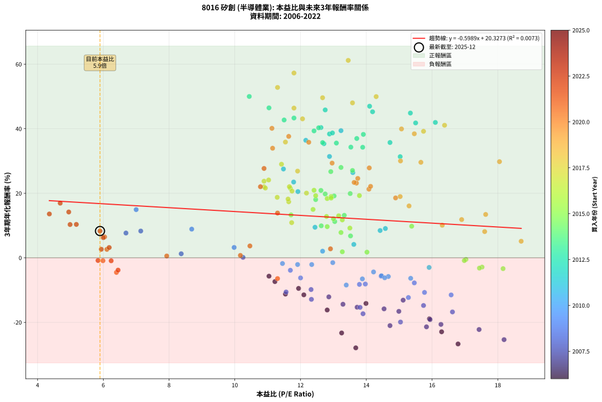
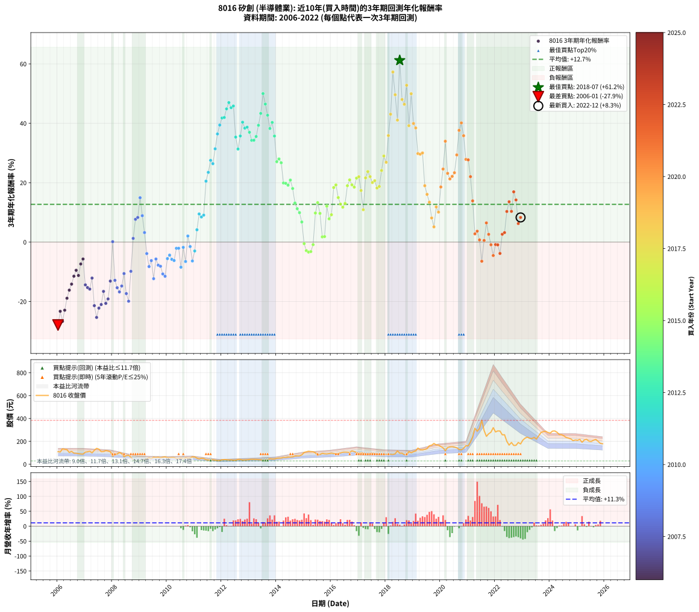

# 8016 矽創 - 本益比與未來報酬率分析

!!! info "報告資訊"
    - **股票代號**: 8016
    - **公司名稱**: 矽創
    - **產業別**: 半導體業
    - **分析期間**: 2006-2022 (204 個數據點)
    - **資料來源**: Type 12 (ShowMonthlyK_ChartFlow) 月收盤價與本益比
    - **報酬率口徑**: 含現金股利 (簡化: 年度合計，假設每年7/1入帳)
    - **報告生成時間**: 2026-01-10 23:14:24 CST

## 📈 視覺化圖表

### 圖表1: 本益比 vs 未來報酬率關係

*圖表1：8016 矽創 本益比與3年期未來報酬率關係 (2006-2022)*

### 圖表2: 歷年買入時點的3年期實際報酬率

*圖表2：8016 矽創 歷年買入時點的3年期實際報酬率 (2006-2022)*

## 📍 買點訊號說明

本報告提供兩種買點提示訊號（顯示於圖表2的股價子圖中）：

### ▲ 小綠色三角形（回測驗證）
- **計算方式**: 使用全部歷史資料計算本益比第25百分位數
- **用途**: 事後驗證，顯示歷史上哪些時點確實為低估區
- **限制**: 當下無法判斷，僅供回測參考
- **特性**: 後見之明（Look-Ahead Bias）

### ▲ 小橘色三角形（即時訊號）
- **計算方式**: 使用截至當月的過去5年資料計算本益比第25百分位數
- **用途**: 實際投資決策，當時即可判斷
- **優勢**: 可操作性強，符合實務需求
- **特性**: 無後見之明，滾動窗口計算

!!! tip "如何使用兩種訊號"
    - **綠色▲** 幫助理解歷史估值機會，驗證策略有效性
    - **橘色▲** 可作為實際買進參考，但仍需搭配基本面分析
    - 兩種訊號重疊時，表示即時判斷與事後驗證一致，信心度較高
    - 僅有綠色▲時，表示當時無法判斷（需要未來資料才能確認）
    - 僅有橘色▲時，表示即時判斷為買點，但事後可能不是最佳時機

## 📊 估值分析摘要

| 指標 | 數值 |
|:---:|:---:|
| **目前本益比** (2022-12) | **5.90 倍** |
| **歷史平均本益比** | 12.73 倍 |
| **估值水準** | 🟢 相對低估 |
| **預期3年年化報酬率** | **+16.79%** |
| **歷史平均報酬率** | +12.70% |
| **相關係數 (R²)** | 0.0073 |
| **趨勢線斜率** | -0.5989 |

!!! abstract "核心洞察"
    目前本益比顯著低於歷史平均，預期未來報酬率可能較高

    根據歷史數據回測，8016 矽創 在目前本益比 **5.9倍** 的估值水準下，
    預期未來3年年化報酬率約為 **+16.8%**。

    **重要提醒**: 本分析基於歷史數據統計，實際報酬率會受到公司基本面變化、產業趨勢、
    總體經濟環境等多重因素影響。R² = 0.01 表示本益比可解釋約 0.7% 的報酬率變異。

## 📈 歷史估值統計

### 最佳買點 (最高報酬率)

| 項目 | 數值 |
|:---:|:---:|
| 起始時間 | 2018-07 |
| 當時本益比 | 13.45 倍 |
| 起始價格 | 96.2 元 |
| 3年後價格 | 384.0 元 |
| **3年年化報酬率** | **+61.19%** |

### 最差買點 (最低報酬率)

| 項目 | 數值 |
|:---:|:---:|
| 起始時間 | 2006-01 |
| 當時本益比 | 13.68 倍 |
| 起始價格 | 110.0 元 |
| 3年後價格 | 29.2 元 |
| **3年年化報酬率** | **-27.91%** |

## 🎯 投資啟示

### 本益比與報酬率關係

趨勢線方程式: **y = -0.5989x + 20.3273**

!!! warning "強負相關"
    本益比與未來報酬率呈現強負相關。在高本益比時期買入，未來報酬率顯著較低；
    在低本益比時期買入，未來報酬率顯著較高。**估值紀律至關重要**。

### 估值區間建議

基於歷史數據分析:

- **🟢 低估區** (P/E < 10.2): 預期報酬率較高，可考慮增加持股
- **🟡 合理區** (P/E 10.2-15.3): 預期報酬率符合長期趨勢，正常持有
- **🔴 高估區** (P/E > 15.3): 預期報酬率較低，可考慮減碼或觀望

!!! danger "風險提示"
    - 過去表現不代表未來結果
    - 本分析假設公司基本面無重大結構性變化
    - 產業環境劇變可能使歷史規律失效
    - 應結合公司財報、產業趨勢、總體經濟等多重因素綜合判斷

!!! success "長期投資觀點"
    歷史數據顯示，在合理或低估的估值水準買入並長期持有，
    往往能獲得較佳的投資報酬。**耐心等待好價格**是價值投資的核心原則。

## 📊 數據品質

- **資料來源**: GoodInfo.tw Type 12 (ShowMonthlyK_ChartFlow)
- **資料頻率**: 月度收盤價與本益比
- **回測期間**: 2006-2022
- **數據點數量**: 204 個 (每個點代表一次3年期回測)

### 計算方法說明

1. **3年期年化報酬率**:
   - 對每個歷史時點，計算其後3年的實際投資報酬率
   - 期末價值(不含股利): 期末價格
   - 期末價值(含現金股利): 期末價格 + 持有期間內的現金股利合計 (簡化: 年度合計，假設每年7/1入帳)
   - 公式: 年化報酬率 = [(期末價值/期初價格)^(1/年數) - 1] × 100%

2. **本益比 (P/E Ratio)**:
   - 使用當時的月收盤價與EPS計算
   - 資料來源: Type 12 月度河流圖本益比數據

3. **趨勢線 (Linear Regression)**:
   - 使用最小平方法擬合線性趨勢線
   - R²值衡量本益比對報酬率的解釋能力

---

*本報告由 Stock Analysis System v1.9.0 自動生成*
*數據更新時間: 2026-01-10 23:14:24 CST*

## 📋 月度回測明細表

（每一列對應時間線圖中的一個買入點；可用來對照 SVG 圖上的每個點。）

| 買入月份 | 賣出月份 | 回測期限_年 | 實際持有年數 | 買入本益比_倍 | 買入收盤價_元 | 賣出收盤價_元 | 現金股利合計_元 | 總報酬率_pct | 年化報酬率_pct |
| --- | --- | --- | --- | --- | --- | --- | --- | --- | --- |
| 2006-01 | 2009-01 | 3 | 3.001 | 13.68 | 110.00 | 29.25 | 11.96 | -62.54 | -27.91 |
| 2006-02 | 2009-02 | 3 | 3.001 | 13.25 | 106.50 | 36.10 | 11.96 | -54.87 | -23.29 |
| 2006-03 | 2009-03 | 3 | 3.001 | 16.79 | 135.00 | 41.20 | 11.96 | -60.62 | -26.70 |
| 2006-04 | 2009-04 | 3 | 3.001 | 16.29 | 131.00 | 48.00 | 11.96 | -54.23 | -22.93 |
| 2006-05 | 2009-05 | 3 | 3.001 | 15.92 | 128.00 | 56.30 | 11.96 | -46.67 | -18.90 |
| 2006-06 | 2009-06 | 3 | 3.001 | 12.81 | 103.00 | 48.70 | 11.96 | -41.11 | -16.18 |
| 2006-07 | 2009-07 | 3 | 3.001 | 13.99 | 112.50 | 61.70 | 9.49 | -36.72 | -14.14 |
| 2006-08 | 2009-08 | 3 | 3.001 | 12.10 | 97.30 | 58.00 | 9.49 | -30.64 | -11.48 |
| 2006-09 | 2009-09 | 3 | 3.001 | 11.94 | 96.00 | 61.70 | 9.49 | -25.85 | -9.48 |
| 2006-10 | 2009-10 | 3 | 3.001 | 11.54 | 92.80 | 55.40 | 9.49 | -30.08 | -11.24 |
| 2006-11 | 2009-11 | 3 | 3.001 | 11.22 | 90.20 | 62.20 | 9.49 | -20.52 | -7.37 |
| 2006-12 | 2009-12 | 3 | 3.001 | 11.04 | 88.80 | 65.00 | 9.49 | -16.12 | -5.69 |
| 2007-01 | 2010-01 | 3 | 3.001 | 13.29 | 106.00 | 57.00 | 9.49 | -37.28 | -14.40 |
| 2007-02 | 2010-02 | 3 | 3.001 | 13.72 | 108.50 | 56.40 | 9.49 | -39.27 | -15.31 |
| 2007-03 | 2010-03 | 3 | 3.001 | 14.54 | 114.00 | 58.50 | 9.49 | -40.36 | -15.82 |
| 2007-04 | 2010-04 | 3 | 3.001 | 12.86 | 100.00 | 58.40 | 9.49 | -32.11 | -12.11 |
| 2007-05 | 2010-05 | 3 | 3.001 | 15.83 | 122.00 | 49.75 | 9.49 | -51.44 | -21.40 |
| 2007-06 | 2010-06 | 3 | 3.001 | 18.19 | 139.00 | 48.30 | 9.49 | -58.43 | -25.36 |
| 2007-07 | 2010-07 | 3 | 3.001 | 17.43 | 132.00 | 54.60 | 7.49 | -52.96 | -22.22 |
| 2007-08 | 2010-08 | 3 | 3.001 | 14.72 | 110.50 | 46.95 | 7.49 | -50.73 | -21.01 |
| 2007-09 | 2010-09 | 3 | 3.001 | 14.99 | 111.50 | 57.20 | 7.49 | -41.98 | -16.59 |
| 2007-10 | 2010-10 | 3 | 3.001 | 16.27 | 120.00 | 52.50 | 7.49 | -50.01 | -20.63 |
| 2007-11 | 2010-11 | 3 | 3.001 | 15.94 | 116.50 | 54.10 | 7.49 | -47.13 | -19.14 |
| 2007-12 | 2010-12 | 3 | 3.001 | 15.12 | 109.50 | 64.30 | 7.49 | -34.44 | -13.12 |
| 2008-01 | 2011-01 | 3 | 3.001 | 10.25 | 71.60 | 64.40 | 7.49 | +0.41 | +0.14 |
| 2008-02 | 2011-03 | 3 | 3.080 | 12.33 | 83.00 | 46.80 | 7.49 | -34.59 | -12.87 |
| 2008-03 | 2011-03 | 3 | 2.998 | 13.81 | 89.50 | 46.80 | 7.49 | -39.34 | -15.36 |
| 2008-04 | 2011-04 | 3 | 2.998 | 16.62 | 103.50 | 52.20 | 7.49 | -42.33 | -16.77 |
| 2008-05 | 2011-05 | 3 | 2.998 | 15.74 | 94.00 | 50.70 | 7.49 | -38.09 | -14.78 |
| 2008-06 | 2011-06 | 3 | 2.998 | 11.56 | 66.10 | 39.75 | 7.49 | -28.53 | -10.60 |
| 2008-07 | 2011-07 | 3 | 2.998 | 13.90 | 76.00 | 37.65 | 5.30 | -43.49 | -17.33 |
| 2008-08 | 2011-08 | 3 | 2.998 | 15.04 | 78.40 | 35.00 | 5.30 | -48.60 | -19.91 |
| 2008-09 | 2011-09 | 3 | 2.998 | 12.32 | 61.10 | 39.50 | 5.30 | -26.68 | -9.83 |
| 2008-10 | 2011-10 | 3 | 2.998 | 8.37 | 39.40 | 35.60 | 5.30 | +3.80 | +1.25 |
| 2008-11 | 2011-11 | 3 | 2.998 | 6.69 | 29.80 | 31.90 | 5.30 | +24.83 | +7.68 |
| 2008-12 | 2011-12 | 3 | 2.998 | 7.14 | 30.00 | 32.80 | 5.30 | +27.00 | +8.30 |
| 2009-01 | 2012-01 | 3 | 2.998 | 7.00 | 29.25 | 39.10 | 5.30 | +51.79 | +14.94 |
| 2009-02 | 2012-02 | 3 | 2.998 | 8.69 | 36.10 | 41.30 | 5.30 | +29.08 | +8.89 |
| 2009-03 | 2012-03 | 3 | 3.001 | 9.98 | 41.20 | 40.00 | 5.30 | +9.95 | +3.21 |
| 2009-04 | 2012-04 | 3 | 3.001 | 11.69 | 48.00 | 37.35 | 5.30 | -11.15 | -3.86 |
| 2009-05 | 2012-05 | 3 | 3.001 | 13.79 | 56.30 | 38.20 | 5.30 | -22.74 | -8.24 |
| 2009-06 | 2012-06 | 3 | 3.001 | 12.00 | 48.70 | 34.85 | 5.30 | -17.56 | -6.23 |
| 2009-07 | 2012-07 | 3 | 3.001 | 15.28 | 61.70 | 35.30 | 6.30 | -32.58 | -12.31 |
| 2009-08 | 2012-08 | 3 | 3.001 | 14.45 | 58.00 | 42.35 | 6.30 | -16.12 | -5.69 |
| 2009-09 | 2012-09 | 3 | 3.001 | 15.46 | 61.70 | 42.10 | 6.30 | -21.56 | -7.77 |
| 2009-10 | 2012-10 | 3 | 3.001 | 13.97 | 55.40 | 36.65 | 6.30 | -22.47 | -8.13 |
| 2009-11 | 2012-11 | 3 | 3.001 | 15.77 | 62.20 | 37.95 | 6.30 | -28.86 | -10.73 |
| 2009-12 | 2012-12 | 3 | 3.001 | 16.58 | 65.00 | 38.75 | 6.30 | -30.69 | -11.50 |
| 2010-01 | 2013-01 | 3 | 3.001 | 14.46 | 57.00 | 41.70 | 6.30 | -15.79 | -5.57 |
| 2010-02 | 2013-02 | 3 | 3.001 | 14.22 | 56.40 | 43.00 | 6.30 | -12.59 | -4.39 |
| 2010-03 | 2013-03 | 3 | 3.001 | 14.67 | 58.50 | 42.60 | 6.30 | -16.41 | -5.80 |
| 2010-04 | 2013-04 | 3 | 3.001 | 14.56 | 58.40 | 41.90 | 6.30 | -17.47 | -6.20 |
| 2010-05 | 2013-05 | 3 | 3.001 | 12.34 | 49.75 | 40.40 | 6.30 | -6.13 | -2.09 |
| 2010-06 | 2013-06 | 3 | 3.001 | 11.91 | 48.30 | 39.05 | 6.30 | -6.11 | -2.08 |
| 2010-07 | 2013-07 | 3 | 3.001 | 13.39 | 54.60 | 35.10 | 6.80 | -23.26 | -8.44 |
| 2010-08 | 2013-08 | 3 | 3.001 | 11.45 | 46.95 | 37.70 | 6.80 | -5.22 | -1.77 |
| 2010-09 | 2013-09 | 3 | 3.001 | 13.88 | 57.20 | 39.90 | 6.80 | -18.36 | -6.54 |
| 2010-10 | 2013-10 | 3 | 3.001 | 12.67 | 52.50 | 49.00 | 6.80 | +6.29 | +2.05 |
| 2010-11 | 2013-11 | 3 | 3.001 | 12.98 | 54.10 | 44.90 | 6.80 | -4.44 | -1.50 |
| 2010-12 | 2013-12 | 3 | 3.001 | 15.35 | 64.30 | 46.00 | 6.80 | -17.88 | -6.36 |
| 2011-01 | 2014-01 | 3 | 3.001 | 15.91 | 64.40 | 52.00 | 6.80 | -8.70 | -2.99 |
| 2011-02 | 2014-02 | 3 | 3.001 | 13.62 | 53.20 | 53.30 | 6.80 | +12.97 | +4.15 |
| 2011-03 | 2014-03 | 3 | 3.001 | 12.44 | 46.80 | 54.60 | 6.80 | +31.20 | +9.47 |
| 2011-04 | 2014-04 | 3 | 3.001 | 14.42 | 52.20 | 59.80 | 6.80 | +27.59 | +8.46 |
| 2011-05 | 2014-05 | 3 | 3.001 | 14.58 | 50.70 | 59.00 | 6.80 | +29.78 | +9.08 |
| 2011-06 | 2014-06 | 3 | 3.001 | 11.92 | 39.75 | 62.80 | 6.80 | +75.09 | +20.52 |
| 2011-07 | 2014-07 | 3 | 3.001 | 11.79 | 37.65 | 63.40 | 7.50 | +88.32 | +23.48 |
| 2011-08 | 2014-08 | 3 | 3.001 | 11.48 | 35.00 | 65.10 | 7.50 | +107.43 | +27.53 |
| 2011-09 | 2014-09 | 3 | 3.001 | 13.59 | 39.50 | 72.30 | 7.50 | +102.03 | +26.41 |
| 2011-10 | 2014-10 | 3 | 3.001 | 12.88 | 35.60 | 73.30 | 7.50 | +126.97 | +31.41 |
| 2011-11 | 2014-11 | 3 | 3.001 | 12.16 | 31.90 | 73.50 | 7.50 | +153.92 | +36.42 |
| 2011-12 | 2014-12 | 3 | 3.001 | 13.23 | 32.80 | 81.40 | 7.50 | +171.04 | +39.42 |
| 2012-01 | 2015-01 | 3 | 3.001 | 15.50 | 39.10 | 104.00 | 7.50 | +185.17 | +41.80 |
| 2012-02 | 2015-03 | 3 | 3.080 | 16.10 | 41.30 | 114.00 | 7.50 | +194.19 | +41.95 |
| 2012-03 | 2015-03 | 3 | 2.998 | 15.34 | 40.00 | 114.00 | 7.50 | +203.75 | +44.86 |
| 2012-04 | 2015-04 | 3 | 2.998 | 14.10 | 37.35 | 111.00 | 7.50 | +217.27 | +46.98 |
| 2012-05 | 2015-05 | 3 | 2.998 | 14.19 | 38.20 | 109.50 | 7.50 | +206.29 | +45.26 |
| 2012-06 | 2015-06 | 3 | 2.998 | 12.75 | 34.85 | 100.50 | 7.50 | +209.90 | +45.83 |
| 2012-07 | 2015-07 | 3 | 2.998 | 12.71 | 35.30 | 77.50 | 10.00 | +147.88 | +35.36 |
| 2012-08 | 2015-08 | 3 | 2.998 | 15.03 | 42.35 | 85.90 | 10.00 | +126.45 | +31.34 |
| 2012-09 | 2015-09 | 3 | 2.998 | 14.72 | 42.10 | 95.20 | 10.00 | +149.88 | +35.73 |
| 2012-10 | 2015-10 | 3 | 2.998 | 12.62 | 36.65 | 91.30 | 10.00 | +176.40 | +40.37 |
| 2012-11 | 2015-11 | 3 | 2.998 | 12.88 | 37.95 | 90.50 | 10.00 | +164.82 | +38.38 |
| 2012-12 | 2015-12 | 3 | 2.998 | 12.97 | 38.75 | 93.30 | 10.00 | +166.58 | +38.69 |
| 2013-01 | 2016-01 | 3 | 2.998 | 13.71 | 41.70 | 97.10 | 10.00 | +156.84 | +36.98 |
| 2013-02 | 2016-02 | 3 | 2.998 | 13.89 | 43.00 | 94.00 | 10.00 | +141.86 | +34.26 |
| 2013-03 | 2016-03 | 3 | 3.001 | 13.53 | 42.60 | 93.20 | 10.00 | +142.26 | +34.30 |
| 2013-04 | 2016-04 | 3 | 3.001 | 13.09 | 41.90 | 94.40 | 10.00 | +149.17 | +35.56 |
| 2013-05 | 2016-05 | 3 | 3.001 | 12.41 | 40.40 | 99.30 | 10.00 | +170.55 | +39.33 |
| 2013-06 | 2016-06 | 3 | 3.001 | 11.80 | 39.05 | 105.00 | 10.00 | +194.50 | +43.33 |
| 2013-07 | 2016-07 | 3 | 3.001 | 10.44 | 35.10 | 106.00 | 12.50 | +237.61 | +50.00 |
| 2013-08 | 2016-08 | 3 | 3.001 | 11.04 | 37.70 | 106.00 | 12.50 | +214.33 | +46.47 |
| 2013-09 | 2016-09 | 3 | 3.001 | 11.50 | 39.90 | 103.50 | 12.50 | +190.73 | +42.71 |
| 2013-10 | 2016-10 | 3 | 3.001 | 13.91 | 49.00 | 117.00 | 12.50 | +164.29 | +38.25 |
| 2013-11 | 2016-11 | 3 | 3.001 | 12.55 | 44.90 | 111.50 | 12.50 | +176.17 | +40.29 |
| 2013-12 | 2016-12 | 3 | 3.001 | 12.67 | 46.00 | 102.50 | 12.50 | +150.00 | +35.71 |
| 2014-01 | 2017-01 | 3 | 3.001 | 13.58 | 52.00 | 94.20 | 12.50 | +105.19 | +27.07 |
| 2014-02 | 2017-02 | 3 | 3.001 | 13.23 | 53.30 | 99.30 | 12.50 | +109.76 | +28.00 |
| 2014-03 | 2017-03 | 3 | 3.001 | 12.92 | 54.60 | 98.60 | 12.50 | +103.48 | +26.71 |
| 2014-04 | 2017-04 | 3 | 3.001 | 13.51 | 59.80 | 90.60 | 12.50 | +72.41 | +19.90 |
| 2014-05 | 2017-05 | 3 | 3.001 | 12.75 | 59.00 | 88.90 | 12.50 | +71.87 | +19.78 |
| 2014-06 | 2017-06 | 3 | 3.001 | 13.02 | 62.80 | 93.80 | 12.50 | +69.27 | +19.17 |
| 2014-07 | 2017-07 | 3 | 3.001 | 12.62 | 63.40 | 96.50 | 15.50 | +76.66 | +20.88 |
| 2014-08 | 2017-08 | 3 | 3.001 | 12.46 | 65.10 | 91.60 | 15.50 | +64.52 | +18.05 |
| 2014-09 | 2017-09 | 3 | 3.001 | 13.33 | 72.30 | 89.30 | 15.50 | +44.95 | +13.17 |
| 2014-10 | 2017-10 | 3 | 3.001 | 13.04 | 73.30 | 85.40 | 15.50 | +37.65 | +11.24 |
| 2014-11 | 2017-11 | 3 | 3.001 | 12.63 | 73.50 | 82.10 | 15.50 | +32.79 | +9.91 |
| 2014-12 | 2017-12 | 3 | 3.001 | 13.52 | 81.40 | 83.60 | 15.50 | +21.74 | +6.78 |
| 2015-01 | 2018-01 | 3 | 3.001 | 17.03 | 104.00 | 86.90 | 15.50 | -1.54 | -0.52 |
| 2015-02 | 2018-02 | 3 | 3.001 | 17.52 | 108.50 | 83.90 | 15.50 | -8.39 | -2.88 |
| 2015-03 | 2018-03 | 3 | 3.001 | 18.16 | 114.00 | 87.40 | 15.50 | -9.74 | -3.36 |
| 2015-04 | 2018-04 | 3 | 3.001 | 17.44 | 111.00 | 85.20 | 15.50 | -9.28 | -3.19 |
| 2015-05 | 2018-05 | 3 | 3.001 | 16.98 | 109.50 | 91.20 | 15.50 | -2.56 | -0.86 |
| 2015-06 | 2018-06 | 3 | 3.001 | 15.38 | 100.50 | 117.50 | 15.50 | +32.34 | +9.79 |
| 2015-07 | 2018-07 | 3 | 3.001 | 11.71 | 77.50 | 96.20 | 16.50 | +45.42 | +13.29 |
| 2015-08 | 2018-08 | 3 | 3.001 | 12.81 | 85.90 | 96.80 | 16.50 | +31.90 | +9.67 |
| 2015-09 | 2018-09 | 3 | 3.001 | 14.02 | 95.20 | 83.80 | 16.50 | +5.36 | +1.75 |
| 2015-10 | 2018-10 | 3 | 3.001 | 13.27 | 91.30 | 80.00 | 16.50 | +5.70 | +1.86 |
| 2015-11 | 2018-11 | 3 | 3.001 | 13.00 | 90.50 | 111.00 | 16.50 | +40.89 | +12.10 |
| 2015-12 | 2018-12 | 3 | 3.001 | 13.23 | 93.30 | 100.50 | 16.50 | +25.40 | +7.84 |
| 2016-01 | 2019-01 | 3 | 3.001 | 13.50 | 97.10 | 110.00 | 16.50 | +30.28 | +9.22 |
| 2016-02 | 2019-03 | 3 | 3.080 | 12.81 | 94.00 | 141.50 | 16.50 | +68.09 | +18.36 |
| 2016-03 | 2019-03 | 3 | 2.998 | 12.46 | 93.20 | 141.50 | 16.50 | +69.53 | +19.25 |
| 2016-04 | 2019-04 | 3 | 2.998 | 12.38 | 94.40 | 127.00 | 16.50 | +52.01 | +14.99 |
| 2016-05 | 2019-05 | 3 | 2.998 | 12.79 | 99.30 | 126.00 | 16.50 | +43.51 | +12.80 |
| 2016-06 | 2019-06 | 3 | 2.998 | 13.27 | 105.00 | 130.00 | 16.50 | +39.52 | +11.75 |
| 2016-07 | 2019-07 | 3 | 2.998 | 13.16 | 106.00 | 136.50 | 16.50 | +44.34 | +13.02 |
| 2016-08 | 2019-08 | 3 | 2.998 | 12.93 | 106.00 | 162.00 | 16.50 | +68.40 | +18.99 |
| 2016-09 | 2019-09 | 3 | 2.998 | 12.41 | 103.50 | 166.50 | 16.50 | +76.81 | +20.94 |
| 2016-10 | 2019-10 | 3 | 2.998 | 13.79 | 117.00 | 182.00 | 16.50 | +69.66 | +19.28 |
| 2016-11 | 2019-11 | 3 | 2.998 | 12.93 | 111.50 | 169.00 | 16.50 | +66.37 | +18.51 |
| 2016-12 | 2019-12 | 3 | 2.998 | 11.69 | 102.50 | 167.50 | 16.50 | +79.51 | +21.55 |
| 2017-01 | 2020-01 | 3 | 2.998 | 10.89 | 94.20 | 154.50 | 16.50 | +81.53 | +22.00 |
| 2017-02 | 2020-02 | 3 | 2.998 | 11.64 | 99.30 | 144.00 | 16.50 | +61.63 | +17.37 |
| 2017-03 | 2020-03 | 3 | 3.001 | 11.73 | 98.60 | 118.00 | 16.50 | +36.41 | +10.90 |
| 2017-04 | 2020-04 | 3 | 3.001 | 10.93 | 90.60 | 146.50 | 16.50 | +79.91 | +21.62 |
| 2017-05 | 2020-05 | 3 | 3.001 | 10.89 | 88.90 | 152.00 | 16.50 | +89.54 | +23.75 |
| 2017-06 | 2020-06 | 3 | 3.001 | 11.66 | 93.80 | 154.00 | 16.50 | +81.77 | +22.04 |
| 2017-07 | 2020-07 | 3 | 3.001 | 12.18 | 96.50 | 150.00 | 17.00 | +73.06 | +20.05 |
| 2017-08 | 2020-08 | 3 | 3.001 | 11.74 | 91.60 | 144.00 | 17.00 | +75.77 | +20.68 |
| 2017-09 | 2020-09 | 3 | 3.001 | 11.62 | 89.30 | 130.50 | 17.00 | +65.17 | +18.20 |
| 2017-10 | 2020-10 | 3 | 3.001 | 11.29 | 85.40 | 126.00 | 17.00 | +67.45 | +18.74 |
| 2017-11 | 2020-11 | 3 | 3.001 | 11.03 | 82.10 | 140.00 | 17.00 | +91.23 | +24.12 |
| 2017-12 | 2020-12 | 3 | 3.001 | 11.42 | 83.60 | 162.50 | 17.00 | +114.71 | +29.00 |
| 2018-01 | 2021-01 | 3 | 3.001 | 11.91 | 86.90 | 160.50 | 17.00 | +104.26 | +26.87 |
| 2018-02 | 2021-02 | 3 | 3.001 | 11.54 | 83.90 | 193.50 | 17.00 | +150.90 | +35.87 |
| 2018-03 | 2021-03 | 3 | 3.001 | 12.06 | 87.40 | 239.00 | 17.00 | +192.91 | +43.07 |
| 2018-04 | 2021-04 | 3 | 3.001 | 11.80 | 85.20 | 314.50 | 17.00 | +289.09 | +57.27 |
| 2018-05 | 2021-05 | 3 | 3.001 | 12.67 | 91.20 | 288.50 | 17.00 | +234.98 | +49.61 |
| 2018-06 | 2021-06 | 3 | 3.001 | 16.38 | 117.50 | 313.00 | 17.00 | +180.85 | +41.08 |
| 2018-07 | 2021-07 | 3 | 3.001 | 13.45 | 96.20 | 384.00 | 19.00 | +318.92 | +61.19 |
| 2018-08 | 2021-08 | 3 | 3.001 | 13.58 | 96.80 | 295.00 | 19.00 | +224.38 | +48.02 |
| 2018-09 | 2021-09 | 3 | 3.001 | 11.80 | 83.80 | 244.00 | 19.00 | +213.84 | +46.40 |
| 2018-10 | 2021-10 | 3 | 3.001 | 11.30 | 80.00 | 266.50 | 19.00 | +256.88 | +52.80 |
| 2018-11 | 2021-11 | 3 | 3.001 | 15.74 | 111.00 | 280.50 | 19.00 | +169.82 | +39.21 |
| 2018-12 | 2021-12 | 3 | 3.001 | 14.30 | 100.50 | 320.00 | 19.00 | +237.31 | +49.96 |
| 2019-01 | 2022-01 | 3 | 3.001 | 15.07 | 110.00 | 282.50 | 19.00 | +174.09 | +39.94 |
| 2019-02 | 2022-02 | 3 | 3.001 | 15.46 | 117.00 | 291.50 | 19.00 | +165.38 | +38.44 |
| 2019-03 | 2022-03 | 3 | 3.001 | 18.05 | 141.50 | 290.50 | 19.00 | +118.73 | +29.80 |
| 2019-04 | 2022-04 | 3 | 3.001 | 15.66 | 127.00 | 257.50 | 19.00 | +117.72 | +29.60 |
| 2019-05 | 2022-05 | 3 | 3.001 | 15.04 | 126.00 | 258.00 | 19.00 | +119.84 | +30.02 |
| 2019-06 | 2022-06 | 3 | 3.001 | 15.03 | 130.00 | 200.00 | 19.00 | +68.46 | +18.98 |
| 2019-07 | 2022-07 | 3 | 3.001 | 15.30 | 136.50 | 167.50 | 46.00 | +56.41 | +16.08 |
| 2019-08 | 2022-08 | 3 | 3.001 | 17.63 | 162.00 | 190.50 | 46.00 | +45.99 | +13.44 |
| 2019-09 | 2022-09 | 3 | 3.001 | 17.60 | 166.50 | 164.50 | 46.00 | +26.43 | +8.13 |
| 2019-10 | 2022-10 | 3 | 3.001 | 18.71 | 182.00 | 165.50 | 46.00 | +16.21 | +5.13 |
| 2019-11 | 2022-11 | 3 | 3.001 | 16.90 | 169.00 | 190.50 | 46.00 | +39.94 | +11.85 |
| 2019-12 | 2022-12 | 3 | 3.001 | 16.31 | 167.50 | 177.50 | 46.00 | +33.43 | +10.09 |
| 2020-01 | 2023-01 | 3 | 3.001 | 14.89 | 154.50 | 211.50 | 46.00 | +66.67 | +18.56 |
| 2020-02 | 2023-03 | 3 | 3.080 | 13.74 | 144.00 | 237.50 | 46.00 | +96.88 | +24.60 |
| 2020-03 | 2023-03 | 3 | 2.998 | 11.15 | 118.00 | 237.50 | 46.00 | +140.25 | +33.96 |
| 2020-04 | 2023-04 | 3 | 2.998 | 13.70 | 146.50 | 227.50 | 46.00 | +86.69 | +23.15 |
| 2020-05 | 2023-05 | 3 | 2.998 | 14.08 | 152.00 | 225.00 | 46.00 | +78.29 | +21.27 |
| 2020-06 | 2023-06 | 3 | 2.998 | 14.13 | 154.00 | 234.50 | 46.00 | +82.14 | +22.14 |
| 2020-07 | 2023-07 | 3 | 2.998 | 13.63 | 150.00 | 220.00 | 61.50 | +87.67 | +23.36 |
| 2020-08 | 2023-08 | 3 | 2.998 | 12.96 | 144.00 | 250.00 | 61.50 | +116.32 | +29.35 |
| 2020-09 | 2023-09 | 3 | 2.998 | 11.64 | 130.50 | 278.50 | 61.50 | +160.54 | +37.63 |
| 2020-10 | 2023-10 | 3 | 2.998 | 11.13 | 126.00 | 285.00 | 61.50 | +175.00 | +40.13 |
| 2020-11 | 2023-11 | 3 | 2.998 | 12.25 | 140.00 | 289.00 | 61.50 | +150.36 | +35.81 |
| 2020-12 | 2023-12 | 3 | 2.998 | 14.09 | 162.50 | 278.00 | 61.50 | +108.92 | +27.86 |
| 2021-01 | 2024-01 | 3 | 2.998 | 10.89 | 160.50 | 272.50 | 61.50 | +108.10 | +27.69 |
| 2021-02 | 2024-02 | 3 | 2.998 | 10.78 | 193.50 | 290.00 | 61.50 | +81.65 | +22.03 |
| 2021-03 | 2024-03 | 3 | 3.001 | 11.30 | 239.00 | 291.50 | 61.50 | +47.70 | +13.88 |
| 2021-04 | 2024-04 | 3 | 3.001 | 12.91 | 314.50 | 280.00 | 61.50 | +8.59 | +2.78 |
| 2021-05 | 2024-05 | 3 | 3.001 | 10.46 | 288.50 | 260.00 | 61.50 | +11.44 | +3.68 |
| 2021-06 | 2024-06 | 3 | 3.001 | 10.17 | 313.00 | 258.50 | 61.50 | +2.24 | +0.74 |
| 2021-07 | 2024-07 | 3 | 3.001 | 11.30 | 384.00 | 248.50 | 66.00 | -18.10 | -6.44 |
| 2021-08 | 2024-08 | 3 | 3.001 | 7.93 | 295.00 | 234.00 | 66.00 | +1.69 | +0.56 |
| 2021-09 | 2024-09 | 3 | 3.001 | 6.04 | 244.00 | 228.50 | 66.00 | +20.70 | +6.47 |
| 2021-10 | 2024-10 | 3 | 3.001 | 6.11 | 266.50 | 222.00 | 66.00 | +8.07 | +2.62 |
| 2021-11 | 2024-11 | 3 | 3.001 | 5.99 | 280.50 | 207.00 | 66.00 | -2.67 | -0.90 |
| 2021-12 | 2024-12 | 3 | 3.001 | 6.40 | 320.00 | 212.50 | 66.00 | -12.97 | -4.52 |
| 2022-01 | 2025-01 | 3 | 3.001 | 5.84 | 282.50 | 209.50 | 66.00 | -2.48 | -0.83 |
| 2022-02 | 2025-02 | 3 | 3.001 | 6.24 | 291.50 | 217.50 | 66.00 | -2.74 | -0.92 |
| 2022-03 | 2025-03 | 3 | 3.001 | 6.45 | 290.50 | 192.50 | 66.00 | -11.02 | -3.81 |
| 2022-04 | 2025-04 | 3 | 3.001 | 5.94 | 257.50 | 212.50 | 66.00 | +8.16 | +2.65 |
| 2022-05 | 2025-05 | 3 | 3.001 | 6.18 | 258.00 | 217.50 | 66.00 | +9.88 | +3.19 |
| 2022-06 | 2025-06 | 3 | 3.001 | 4.99 | 200.00 | 202.50 | 66.00 | +34.25 | +10.31 |
| 2022-07 | 2025-07 | 3 | 3.001 | 4.36 | 167.50 | 199.50 | 46.00 | +46.57 | +13.59 |
| 2022-08 | 2025-08 | 3 | 3.001 | 5.18 | 190.50 | 210.00 | 46.00 | +34.38 | +10.35 |
| 2022-09 | 2025-09 | 3 | 3.001 | 4.69 | 164.50 | 217.00 | 46.00 | +59.88 | +16.93 |
| 2022-10 | 2025-10 | 3 | 3.001 | 4.95 | 165.50 | 200.50 | 46.00 | +48.94 | +14.20 |
| 2022-11 | 2025-11 | 3 | 3.001 | 6.00 | 190.50 | 182.50 | 46.00 | +19.95 | +6.25 |
| 2022-12 | 2025-12 | 3 | 3.001 | 5.90 | 177.50 | 179.50 | 46.00 | +27.04 | +8.30 |
