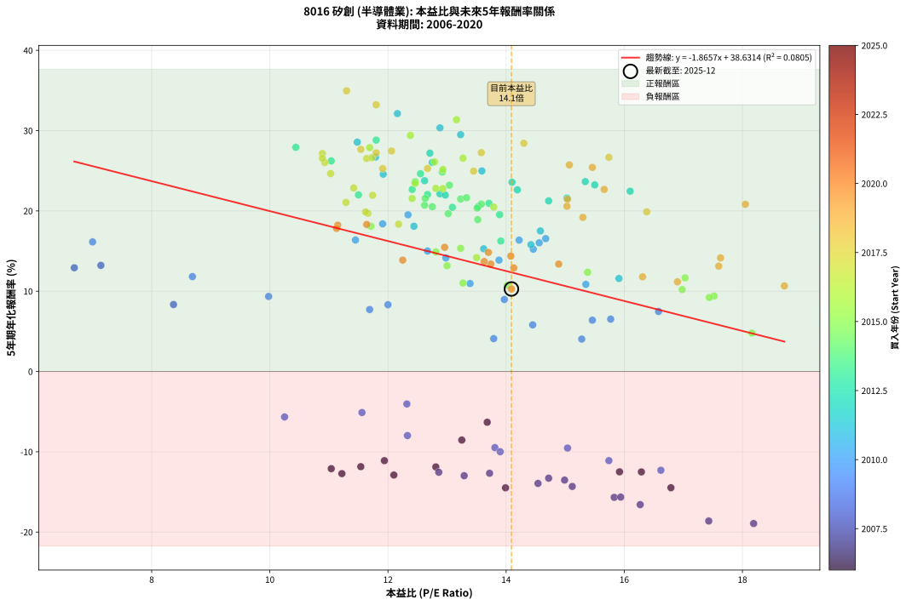
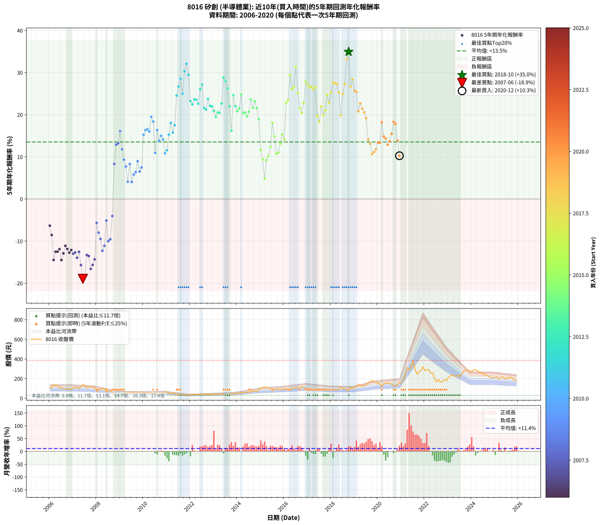

# 8016 矽創 - 本益比與未來報酬率分析

!!! info "報告資訊"
    - **股票代號**: 8016
    - **公司名稱**: 矽創
    - **產業別**: 半導體業
    - **分析期間**: 2006-2020 (180 個數據點)
    - **資料來源**: Type 12 (ShowMonthlyK_ChartFlow) 月收盤價與本益比
    - **報酬率口徑**: 含現金股利 (簡化: 年度合計，假設每年7/1入帳)
    - **報告生成時間**: 2026-01-04 08:51:58 CST

## 📈 視覺化圖表

### 圖表1: 本益比 vs 未來報酬率關係

*圖表1：8016 矽創 本益比與5年期未來報酬率關係 (2006-2020)*

### 圖表2: 歷年買入時點的5年期實際報酬率

*圖表2：8016 矽創 歷年買入時點的5年期實際報酬率 (2006-2020)*

## 📍 買點訊號說明

本報告提供兩種買點提示訊號（顯示於圖表2的股價子圖中）：

### ▲ 小綠色三角形（回測驗證）
- **計算方式**: 使用全部歷史資料計算本益比第25百分位數
- **用途**: 事後驗證，顯示歷史上哪些時點確實為低估區
- **限制**: 當下無法判斷，僅供回測參考
- **特性**: 後見之明（Look-Ahead Bias）

### ▲ 小橘色三角形（即時訊號）
- **計算方式**: 使用截至當月的過去5年資料計算本益比第25百分位數
- **用途**: 實際投資決策，當時即可判斷
- **優勢**: 可操作性強，符合實務需求
- **特性**: 無後見之明，滾動窗口計算

!!! tip "如何使用兩種訊號"
    - **綠色▲** 幫助理解歷史估值機會，驗證策略有效性
    - **橘色▲** 可作為實際買進參考，但仍需搭配基本面分析
    - 兩種訊號重疊時，表示即時判斷與事後驗證一致，信心度較高
    - 僅有綠色▲時，表示當時無法判斷（需要未來資料才能確認）
    - 僅有橘色▲時，表示即時判斷為買點，但事後可能不是最佳時機

## 📊 估值分析摘要

| 指標 | 數值 |
|:---:|:---:|
| **目前本益比** (2020-12) | **14.09 倍** |
| **歷史平均本益比** | 13.45 倍 |
| **估值水準** | 🟡 合理範圍 |
| **預期5年年化報酬率** | **+12.34%** |
| **歷史平均報酬率** | +13.55% |
| **相關係數 (R²)** | 0.0805 |
| **趨勢線斜率** | -1.8657 |

!!! abstract "核心洞察"
    目前本益比接近歷史平均，預期報酬率符合長期趨勢

    根據歷史數據回測，8016 矽創 在目前本益比 **14.1倍** 的估值水準下，
    預期未來5年年化報酬率約為 **+12.3%**。

    **重要提醒**: 本分析基於歷史數據統計，實際報酬率會受到公司基本面變化、產業趨勢、
    總體經濟環境等多重因素影響。R² = 0.08 表示本益比可解釋約 8.1% 的報酬率變異。

## 📈 歷史估值統計

### 最佳買點 (最高報酬率)

| 項目 | 數值 |
|:---:|:---:|
| 起始時間 | 2018-10 |
| 當時本益比 | 11.30 倍 |
| 起始價格 | 80.0 元 |
| 5年後價格 | 285.0 元 |
| **5年年化報酬率** | **+34.95%** |

### 最差買點 (最低報酬率)

| 項目 | 數值 |
|:---:|:---:|
| 起始時間 | 2007-06 |
| 當時本益比 | 18.19 倍 |
| 起始價格 | 139.0 元 |
| 5年後價格 | 34.9 元 |
| **5年年化報酬率** | **-18.94%** |

## 🎯 投資啟示

### 本益比與報酬率關係

趨勢線方程式: **y = -1.8657x + 38.6314**

!!! warning "強負相關"
    本益比與未來報酬率呈現強負相關。在高本益比時期買入，未來報酬率顯著較低；
    在低本益比時期買入，未來報酬率顯著較高。**估值紀律至關重要**。

### 估值區間建議

基於歷史數據分析:

- **🟢 低估區** (P/E < 10.8): 預期報酬率較高，可考慮增加持股
- **🟡 合理區** (P/E 10.8-16.1): 預期報酬率符合長期趨勢，正常持有
- **🔴 高估區** (P/E > 16.1): 預期報酬率較低，可考慮減碼或觀望

!!! danger "風險提示"
    - 過去表現不代表未來結果
    - 本分析假設公司基本面無重大結構性變化
    - 產業環境劇變可能使歷史規律失效
    - 應結合公司財報、產業趨勢、總體經濟等多重因素綜合判斷

!!! success "長期投資觀點"
    歷史數據顯示，在合理或低估的估值水準買入並長期持有，
    往往能獲得較佳的投資報酬。**耐心等待好價格**是價值投資的核心原則。

## 📊 數據品質

- **資料來源**: GoodInfo.tw Type 12 (ShowMonthlyK_ChartFlow)
- **資料頻率**: 月度收盤價與本益比
- **回測期間**: 2006-2020
- **數據點數量**: 180 個 (每個點代表一次5年期回測)

### 計算方法說明

1. **5年期年化報酬率**:
   - 對每個歷史時點，計算其後5年的實際投資報酬率
   - 期末價值(不含股利): 期末價格
   - 期末價值(含現金股利): 期末價格 + 持有期間內的現金股利合計 (簡化: 年度合計，假設每年7/1入帳)
   - 公式: 年化報酬率 = [(期末價值/期初價格)^(1/年數) - 1] × 100%

2. **本益比 (P/E Ratio)**:
   - 使用當時的月收盤價與EPS計算
   - 資料來源: Type 12 月度河流圖本益比數據

3. **趨勢線 (Linear Regression)**:
   - 使用最小平方法擬合線性趨勢線
   - R²值衡量本益比對報酬率的解釋能力

---

*本報告由 Stock Analysis System v1.9.0 自動生成*
*數據更新時間: 2026-01-04 08:51:58 CST*

## 📋 月度回測明細表

（每一列對應時間線圖中的一個買入點；可用來對照 SVG 圖上的每個點。）

| 買入月份 | 賣出月份 | 回測期限_年 | 實際持有年數 | 買入本益比_倍 | 買入收盤價_元 | 賣出收盤價_元 | 現金股利合計_元 | 總報酬率_pct | 年化報酬率_pct |
| --- | --- | --- | --- | --- | --- | --- | --- | --- | --- |
| 2006-01 | 2011-01 | 5 | 4.999 | 13.68 | 110.00 | 64.40 | 14.96 | -27.86 | -6.32 |
| 2006-02 | 2011-02 | 5 | 4.999 | 13.25 | 106.50 | 53.20 | 14.96 | -36.00 | -8.54 |
| 2006-03 | 2011-03 | 5 | 4.999 | 16.79 | 135.00 | 46.80 | 14.96 | -54.25 | -14.48 |
| 2006-04 | 2011-04 | 5 | 4.999 | 16.29 | 131.00 | 52.20 | 14.96 | -48.73 | -12.51 |
| 2006-05 | 2011-05 | 5 | 4.999 | 15.92 | 128.00 | 50.70 | 14.96 | -48.70 | -12.50 |
| 2006-06 | 2011-06 | 5 | 4.999 | 12.81 | 103.00 | 39.75 | 14.96 | -46.89 | -11.89 |
| 2006-07 | 2011-07 | 5 | 4.999 | 13.99 | 112.50 | 37.65 | 13.79 | -54.28 | -14.49 |
| 2006-08 | 2011-08 | 5 | 4.999 | 12.10 | 97.30 | 35.00 | 13.79 | -49.86 | -12.90 |
| 2006-09 | 2011-09 | 5 | 4.999 | 11.94 | 96.00 | 39.50 | 13.79 | -44.49 | -11.11 |
| 2006-10 | 2011-10 | 5 | 4.999 | 11.54 | 92.80 | 35.60 | 13.79 | -46.78 | -11.85 |
| 2006-11 | 2011-11 | 5 | 4.999 | 11.22 | 90.20 | 31.90 | 13.79 | -49.35 | -12.72 |
| 2006-12 | 2011-12 | 5 | 4.999 | 11.04 | 88.80 | 32.80 | 13.79 | -47.54 | -12.11 |
| 2007-01 | 2012-01 | 5 | 4.999 | 13.29 | 106.00 | 39.10 | 13.79 | -50.11 | -12.98 |
| 2007-02 | 2012-02 | 5 | 4.999 | 13.72 | 108.50 | 41.30 | 13.79 | -49.23 | -12.68 |
| 2007-03 | 2012-03 | 5 | 5.002 | 14.54 | 114.00 | 40.00 | 13.79 | -52.82 | -13.94 |
| 2007-04 | 2012-04 | 5 | 5.002 | 12.86 | 100.00 | 37.35 | 13.79 | -48.86 | -12.55 |
| 2007-05 | 2012-05 | 5 | 5.002 | 15.83 | 122.00 | 38.20 | 13.79 | -57.39 | -15.68 |
| 2007-06 | 2012-06 | 5 | 5.002 | 18.19 | 139.00 | 34.85 | 13.79 | -65.01 | -18.94 |
| 2007-07 | 2012-07 | 5 | 5.002 | 17.43 | 132.00 | 35.30 | 11.79 | -64.32 | -18.62 |
| 2007-08 | 2012-08 | 5 | 5.002 | 14.72 | 110.50 | 42.35 | 11.79 | -51.00 | -13.29 |
| 2007-09 | 2012-09 | 5 | 5.002 | 14.99 | 111.50 | 42.10 | 11.79 | -51.67 | -13.53 |
| 2007-10 | 2012-10 | 5 | 5.002 | 16.27 | 120.00 | 36.65 | 11.79 | -59.63 | -16.59 |
| 2007-11 | 2012-11 | 5 | 5.002 | 15.94 | 116.50 | 37.95 | 11.79 | -57.30 | -15.64 |
| 2007-12 | 2012-12 | 5 | 5.002 | 15.12 | 109.50 | 38.75 | 11.79 | -53.84 | -14.32 |
| 2008-01 | 2013-01 | 5 | 5.002 | 10.25 | 71.60 | 41.70 | 11.79 | -25.29 | -5.66 |
| 2008-02 | 2013-03 | 5 | 5.081 | 12.33 | 83.00 | 42.60 | 11.79 | -34.47 | -7.98 |
| 2008-03 | 2013-03 | 5 | 4.999 | 13.81 | 89.50 | 42.60 | 11.79 | -39.23 | -9.48 |
| 2008-04 | 2013-04 | 5 | 4.999 | 16.62 | 103.50 | 41.90 | 11.79 | -48.12 | -12.30 |
| 2008-05 | 2013-05 | 5 | 4.999 | 15.74 | 94.00 | 40.40 | 11.79 | -44.48 | -11.10 |
| 2008-06 | 2013-06 | 5 | 4.999 | 11.56 | 66.10 | 39.05 | 11.79 | -23.08 | -5.11 |
| 2008-07 | 2013-07 | 5 | 4.999 | 13.90 | 76.00 | 35.10 | 9.80 | -40.92 | -9.99 |
| 2008-08 | 2013-08 | 5 | 4.999 | 15.04 | 78.40 | 37.70 | 9.80 | -39.41 | -9.54 |
| 2008-09 | 2013-09 | 5 | 4.999 | 12.32 | 61.10 | 39.90 | 9.80 | -18.66 | -4.05 |
| 2008-10 | 2013-10 | 5 | 4.999 | 8.37 | 39.40 | 49.00 | 9.80 | +49.24 | +8.34 |
| 2008-11 | 2013-11 | 5 | 4.999 | 6.69 | 29.80 | 44.90 | 9.80 | +83.55 | +12.92 |
| 2008-12 | 2013-12 | 5 | 4.999 | 7.14 | 30.00 | 46.00 | 9.80 | +86.00 | +13.22 |
| 2009-01 | 2014-01 | 5 | 4.999 | 7.00 | 29.25 | 52.00 | 9.80 | +111.28 | +16.14 |
| 2009-02 | 2014-02 | 5 | 4.999 | 8.69 | 36.10 | 53.30 | 9.80 | +74.79 | +11.82 |
| 2009-03 | 2014-03 | 5 | 4.999 | 9.98 | 41.20 | 54.60 | 9.80 | +56.31 | +9.35 |
| 2009-04 | 2014-04 | 5 | 4.999 | 11.69 | 48.00 | 59.80 | 9.80 | +45.00 | +7.72 |
| 2009-05 | 2014-05 | 5 | 4.999 | 13.79 | 56.30 | 59.00 | 9.80 | +22.20 | +4.09 |
| 2009-06 | 2014-06 | 5 | 4.999 | 12.00 | 48.70 | 62.80 | 9.80 | +49.07 | +8.31 |
| 2009-07 | 2014-07 | 5 | 4.999 | 15.28 | 61.70 | 63.40 | 11.80 | +21.88 | +4.04 |
| 2009-08 | 2014-08 | 5 | 4.999 | 14.45 | 58.00 | 65.10 | 11.80 | +32.59 | +5.80 |
| 2009-09 | 2014-09 | 5 | 4.999 | 15.46 | 61.70 | 72.30 | 11.80 | +36.30 | +6.39 |
| 2009-10 | 2014-10 | 5 | 4.999 | 13.97 | 55.40 | 73.30 | 11.80 | +53.61 | +8.97 |
| 2009-11 | 2014-11 | 5 | 4.999 | 15.77 | 62.20 | 73.50 | 11.80 | +37.14 | +6.52 |
| 2009-12 | 2014-12 | 5 | 4.999 | 16.58 | 65.00 | 81.40 | 11.80 | +43.38 | +7.47 |
| 2010-01 | 2015-01 | 5 | 4.999 | 14.46 | 57.00 | 104.00 | 11.80 | +103.16 | +15.23 |
| 2010-02 | 2015-02 | 5 | 4.999 | 14.22 | 56.40 | 108.50 | 11.80 | +113.30 | +16.36 |
| 2010-03 | 2015-03 | 5 | 4.999 | 14.67 | 58.50 | 114.00 | 11.80 | +115.04 | +16.55 |
| 2010-04 | 2015-04 | 5 | 4.999 | 14.56 | 58.40 | 111.00 | 11.80 | +110.27 | +16.03 |
| 2010-05 | 2015-05 | 5 | 4.999 | 12.34 | 49.75 | 109.50 | 11.80 | +143.82 | +19.52 |
| 2010-06 | 2015-06 | 5 | 4.999 | 11.91 | 48.30 | 100.50 | 11.80 | +132.51 | +18.38 |
| 2010-07 | 2015-07 | 5 | 4.999 | 13.39 | 54.60 | 77.50 | 14.30 | +68.13 | +10.95 |
| 2010-08 | 2015-08 | 5 | 4.999 | 11.45 | 46.95 | 85.90 | 14.30 | +113.42 | +16.37 |
| 2010-09 | 2015-09 | 5 | 4.999 | 13.88 | 57.20 | 95.20 | 14.30 | +91.44 | +13.87 |
| 2010-10 | 2015-10 | 5 | 4.999 | 12.67 | 52.50 | 91.30 | 14.30 | +101.14 | +15.00 |
| 2010-11 | 2015-11 | 5 | 4.999 | 12.98 | 54.10 | 90.50 | 14.30 | +93.72 | +14.14 |
| 2010-12 | 2015-12 | 5 | 4.999 | 15.35 | 64.30 | 93.30 | 14.30 | +67.34 | +10.85 |
| 2011-01 | 2016-01 | 5 | 4.999 | 15.91 | 64.40 | 97.10 | 14.30 | +72.98 | +11.59 |
| 2011-02 | 2016-02 | 5 | 4.999 | 13.62 | 53.20 | 94.00 | 14.30 | +103.57 | +15.28 |
| 2011-03 | 2016-03 | 5 | 5.002 | 12.44 | 46.80 | 93.20 | 14.30 | +129.70 | +18.09 |
| 2011-04 | 2016-04 | 5 | 5.002 | 14.42 | 52.20 | 94.40 | 14.30 | +108.24 | +15.79 |
| 2011-05 | 2016-05 | 5 | 5.002 | 14.58 | 50.70 | 99.30 | 14.30 | +124.07 | +17.50 |
| 2011-06 | 2016-06 | 5 | 5.002 | 11.92 | 39.75 | 105.00 | 14.30 | +200.13 | +24.57 |
| 2011-07 | 2016-07 | 5 | 5.002 | 11.79 | 37.65 | 106.00 | 17.00 | +226.70 | +26.70 |
| 2011-08 | 2016-08 | 5 | 5.002 | 11.48 | 35.00 | 106.00 | 17.00 | +251.43 | +28.57 |
| 2011-09 | 2016-09 | 5 | 5.002 | 13.59 | 39.50 | 103.50 | 17.00 | +205.07 | +24.98 |
| 2011-10 | 2016-10 | 5 | 5.002 | 12.88 | 35.60 | 117.00 | 17.00 | +276.41 | +30.34 |
| 2011-11 | 2016-11 | 5 | 5.002 | 12.16 | 31.90 | 111.50 | 17.00 | +302.82 | +32.12 |
| 2011-12 | 2016-12 | 5 | 5.002 | 13.23 | 32.80 | 102.50 | 17.00 | +264.33 | +29.50 |
| 2012-01 | 2017-01 | 5 | 5.002 | 15.50 | 39.10 | 94.20 | 17.00 | +184.40 | +23.24 |
| 2012-02 | 2017-03 | 5 | 5.081 | 16.10 | 41.30 | 98.60 | 17.00 | +179.91 | +22.45 |
| 2012-03 | 2017-03 | 5 | 4.999 | 15.34 | 40.00 | 98.60 | 17.00 | +189.00 | +23.65 |
| 2012-04 | 2017-04 | 5 | 4.999 | 14.10 | 37.35 | 90.60 | 17.00 | +188.09 | +23.57 |
| 2012-05 | 2017-05 | 5 | 4.999 | 14.19 | 38.20 | 88.90 | 17.00 | +177.23 | +22.63 |
| 2012-06 | 2017-06 | 5 | 4.999 | 12.75 | 34.85 | 93.80 | 17.00 | +217.94 | +26.03 |
| 2012-07 | 2017-07 | 5 | 4.999 | 12.71 | 35.30 | 96.50 | 21.00 | +232.86 | +27.19 |
| 2012-08 | 2017-08 | 5 | 4.999 | 15.03 | 42.35 | 91.60 | 21.00 | +165.88 | +21.60 |
| 2012-09 | 2017-09 | 5 | 4.999 | 14.72 | 42.10 | 89.30 | 21.00 | +162.00 | +21.25 |
| 2012-10 | 2017-10 | 5 | 4.999 | 12.62 | 36.65 | 85.40 | 21.00 | +190.32 | +23.76 |
| 2012-11 | 2017-11 | 5 | 4.999 | 12.88 | 37.95 | 82.10 | 21.00 | +171.68 | +22.13 |
| 2012-12 | 2017-12 | 5 | 4.999 | 12.97 | 38.75 | 83.60 | 21.00 | +169.94 | +21.97 |
| 2013-01 | 2018-01 | 5 | 4.999 | 13.71 | 41.70 | 86.90 | 21.00 | +158.76 | +20.95 |
| 2013-02 | 2018-02 | 5 | 4.999 | 13.89 | 43.00 | 83.90 | 21.00 | +143.96 | +19.53 |
| 2013-03 | 2018-03 | 5 | 4.999 | 13.53 | 42.60 | 87.40 | 21.00 | +154.46 | +20.54 |
| 2013-04 | 2018-04 | 5 | 4.999 | 13.09 | 41.90 | 85.20 | 21.00 | +153.46 | +20.45 |
| 2013-05 | 2018-05 | 5 | 4.999 | 12.41 | 40.40 | 91.20 | 21.00 | +177.73 | +22.67 |
| 2013-06 | 2018-06 | 5 | 4.999 | 11.80 | 39.05 | 117.50 | 21.00 | +254.68 | +28.82 |
| 2013-07 | 2018-07 | 5 | 4.999 | 10.44 | 35.10 | 96.20 | 24.00 | +242.46 | +27.92 |
| 2013-08 | 2018-08 | 5 | 4.999 | 11.04 | 37.70 | 96.80 | 24.00 | +220.43 | +26.23 |
| 2013-09 | 2018-09 | 5 | 4.999 | 11.50 | 39.90 | 83.80 | 24.00 | +170.18 | +22.00 |
| 2013-10 | 2018-10 | 5 | 4.999 | 13.91 | 49.00 | 80.00 | 24.00 | +112.25 | +16.25 |
| 2013-11 | 2018-11 | 5 | 4.999 | 12.55 | 44.90 | 111.00 | 24.00 | +200.67 | +24.63 |
| 2013-12 | 2018-12 | 5 | 4.999 | 12.67 | 46.00 | 100.50 | 24.00 | +170.66 | +22.04 |
| 2014-01 | 2019-01 | 5 | 4.999 | 13.58 | 52.00 | 110.00 | 24.00 | +157.70 | +20.85 |
| 2014-02 | 2019-02 | 5 | 4.999 | 13.23 | 53.30 | 117.00 | 24.00 | +164.54 | +21.48 |
| 2014-03 | 2019-03 | 5 | 4.999 | 12.92 | 54.60 | 141.50 | 24.00 | +203.12 | +24.83 |
| 2014-04 | 2019-04 | 5 | 4.999 | 13.51 | 59.80 | 127.00 | 24.00 | +152.51 | +20.36 |
| 2014-05 | 2019-05 | 5 | 4.999 | 12.75 | 59.00 | 126.00 | 24.00 | +154.24 | +20.52 |
| 2014-06 | 2019-06 | 5 | 4.999 | 13.02 | 62.80 | 130.00 | 24.00 | +145.23 | +19.65 |
| 2014-07 | 2019-07 | 5 | 4.999 | 12.62 | 63.40 | 136.50 | 26.00 | +156.31 | +20.72 |
| 2014-08 | 2019-08 | 5 | 4.999 | 12.46 | 65.10 | 162.00 | 26.00 | +188.79 | +23.63 |
| 2014-09 | 2019-09 | 5 | 4.999 | 13.33 | 72.30 | 166.50 | 26.00 | +166.25 | +21.64 |
| 2014-10 | 2019-10 | 5 | 4.999 | 13.04 | 73.30 | 182.00 | 26.00 | +183.77 | +23.20 |
| 2014-11 | 2019-11 | 5 | 4.999 | 12.63 | 73.50 | 169.00 | 26.00 | +165.31 | +21.55 |
| 2014-12 | 2019-12 | 5 | 4.999 | 13.52 | 81.40 | 167.50 | 26.00 | +137.72 | +18.91 |
| 2015-01 | 2020-01 | 5 | 4.999 | 17.03 | 104.00 | 154.50 | 26.00 | +73.56 | +11.66 |
| 2015-02 | 2020-02 | 5 | 4.999 | 17.52 | 108.50 | 144.00 | 26.00 | +56.68 | +9.40 |
| 2015-03 | 2020-03 | 5 | 5.002 | 18.16 | 114.00 | 118.00 | 26.00 | +26.32 | +4.78 |
| 2015-04 | 2020-04 | 5 | 5.002 | 17.44 | 111.00 | 146.50 | 26.00 | +55.41 | +9.21 |
| 2015-05 | 2020-05 | 5 | 5.002 | 16.98 | 109.50 | 152.00 | 26.00 | +62.56 | +10.20 |
| 2015-06 | 2020-06 | 5 | 5.002 | 15.38 | 100.50 | 154.00 | 26.00 | +79.11 | +12.36 |
| 2015-07 | 2020-07 | 5 | 5.002 | 11.71 | 77.50 | 150.00 | 28.00 | +129.68 | +18.08 |
| 2015-08 | 2020-08 | 5 | 5.002 | 12.81 | 85.90 | 144.00 | 28.00 | +100.23 | +14.89 |
| 2015-09 | 2020-09 | 5 | 5.002 | 14.02 | 95.20 | 130.50 | 28.00 | +66.49 | +10.73 |
| 2015-10 | 2020-10 | 5 | 5.002 | 13.27 | 91.30 | 126.00 | 28.00 | +68.68 | +11.02 |
| 2015-11 | 2020-11 | 5 | 5.002 | 13.00 | 90.50 | 140.00 | 28.00 | +85.64 | +13.16 |
| 2015-12 | 2020-12 | 5 | 5.002 | 13.23 | 93.30 | 162.50 | 28.00 | +104.18 | +15.34 |
| 2016-01 | 2021-01 | 5 | 5.002 | 13.50 | 97.10 | 160.50 | 28.00 | +94.13 | +14.18 |
| 2016-02 | 2021-03 | 5 | 5.081 | 12.81 | 94.00 | 239.00 | 28.00 | +184.04 | +22.81 |
| 2016-03 | 2021-03 | 5 | 4.999 | 12.46 | 93.20 | 239.00 | 28.00 | +186.48 | +23.43 |
| 2016-04 | 2021-04 | 5 | 4.999 | 12.38 | 94.40 | 314.50 | 28.00 | +262.82 | +29.41 |
| 2016-05 | 2021-05 | 5 | 4.999 | 12.79 | 99.30 | 288.50 | 28.00 | +218.73 | +26.10 |
| 2016-06 | 2021-06 | 5 | 4.999 | 13.27 | 105.00 | 313.00 | 28.00 | +224.76 | +26.57 |
| 2016-07 | 2021-07 | 5 | 4.999 | 13.16 | 106.00 | 384.00 | 30.50 | +291.04 | +31.36 |
| 2016-08 | 2021-08 | 5 | 4.999 | 12.93 | 106.00 | 295.00 | 30.50 | +207.08 | +25.16 |
| 2016-09 | 2021-09 | 5 | 4.999 | 12.41 | 103.50 | 244.00 | 30.50 | +165.22 | +21.54 |
| 2016-10 | 2021-10 | 5 | 4.999 | 13.79 | 117.00 | 266.50 | 30.50 | +153.85 | +20.48 |
| 2016-11 | 2021-11 | 5 | 4.999 | 12.93 | 111.50 | 280.50 | 30.50 | +178.92 | +22.77 |
| 2016-12 | 2021-12 | 5 | 4.999 | 11.69 | 102.50 | 320.00 | 30.50 | +241.95 | +27.88 |
| 2017-01 | 2022-01 | 5 | 4.999 | 10.89 | 94.20 | 282.50 | 30.50 | +232.27 | +27.15 |
| 2017-02 | 2022-02 | 5 | 4.999 | 11.64 | 99.30 | 291.50 | 30.50 | +224.27 | +26.53 |
| 2017-03 | 2022-03 | 5 | 4.999 | 11.73 | 98.60 | 290.50 | 30.50 | +225.56 | +26.63 |
| 2017-04 | 2022-04 | 5 | 4.999 | 10.93 | 90.60 | 257.50 | 30.50 | +217.88 | +26.03 |
| 2017-05 | 2022-05 | 5 | 4.999 | 10.89 | 88.90 | 258.00 | 30.50 | +224.52 | +26.55 |
| 2017-06 | 2022-06 | 5 | 4.999 | 11.66 | 93.80 | 200.00 | 30.50 | +145.74 | +19.70 |
| 2017-07 | 2022-07 | 5 | 4.999 | 12.18 | 96.50 | 167.50 | 56.50 | +132.13 | +18.35 |
| 2017-08 | 2022-08 | 5 | 4.999 | 11.74 | 91.60 | 190.50 | 56.50 | +169.65 | +21.95 |
| 2017-09 | 2022-09 | 5 | 4.999 | 11.62 | 89.30 | 164.50 | 56.50 | +147.48 | +19.87 |
| 2017-10 | 2022-10 | 5 | 4.999 | 11.29 | 85.40 | 165.50 | 56.50 | +159.95 | +21.06 |
| 2017-11 | 2022-11 | 5 | 4.999 | 11.03 | 82.10 | 190.50 | 56.50 | +200.85 | +24.65 |
| 2017-12 | 2022-12 | 5 | 4.999 | 11.42 | 83.60 | 177.50 | 56.50 | +179.91 | +22.86 |
| 2018-01 | 2023-01 | 5 | 4.999 | 11.91 | 86.90 | 211.50 | 56.50 | +208.40 | +25.27 |
| 2018-02 | 2023-02 | 5 | 4.999 | 11.54 | 83.90 | 228.00 | 56.50 | +239.10 | +27.67 |
| 2018-03 | 2023-03 | 5 | 4.999 | 12.06 | 87.40 | 237.50 | 56.50 | +236.39 | +27.46 |
| 2018-04 | 2023-04 | 5 | 4.999 | 11.80 | 85.20 | 227.50 | 56.50 | +233.33 | +27.23 |
| 2018-05 | 2023-05 | 5 | 4.999 | 12.67 | 91.20 | 225.00 | 56.50 | +208.66 | +25.29 |
| 2018-06 | 2023-06 | 5 | 4.999 | 16.38 | 117.50 | 234.50 | 56.50 | +147.66 | +19.89 |
| 2018-07 | 2023-07 | 5 | 4.999 | 13.45 | 96.20 | 220.00 | 73.00 | +204.57 | +24.95 |
| 2018-08 | 2023-08 | 5 | 4.999 | 13.58 | 96.80 | 250.00 | 73.00 | +233.68 | +27.26 |
| 2018-09 | 2023-09 | 5 | 4.999 | 11.80 | 83.80 | 278.50 | 73.00 | +319.45 | +33.22 |
| 2018-10 | 2023-10 | 5 | 4.999 | 11.30 | 80.00 | 285.00 | 73.00 | +347.50 | +34.95 |
| 2018-11 | 2023-11 | 5 | 4.999 | 15.74 | 111.00 | 289.00 | 73.00 | +226.13 | +26.68 |
| 2018-12 | 2023-12 | 5 | 4.999 | 14.30 | 100.50 | 278.00 | 73.00 | +249.25 | +28.42 |
| 2019-01 | 2024-01 | 5 | 4.999 | 15.07 | 110.00 | 272.50 | 73.00 | +214.09 | +25.73 |
| 2019-02 | 2024-02 | 5 | 4.999 | 15.46 | 117.00 | 290.00 | 73.00 | +210.26 | +25.42 |
| 2019-03 | 2024-03 | 5 | 5.002 | 18.05 | 141.50 | 291.50 | 73.00 | +157.60 | +20.82 |
| 2019-04 | 2024-04 | 5 | 5.002 | 15.66 | 127.00 | 280.00 | 73.00 | +177.95 | +22.68 |
| 2019-05 | 2024-05 | 5 | 5.002 | 15.04 | 126.00 | 260.00 | 73.00 | +164.29 | +21.45 |
| 2019-06 | 2024-06 | 5 | 5.002 | 15.03 | 130.00 | 258.50 | 73.00 | +155.00 | +20.58 |
| 2019-07 | 2024-07 | 5 | 5.002 | 15.30 | 136.50 | 248.50 | 80.00 | +140.66 | +19.19 |
| 2019-08 | 2024-08 | 5 | 5.002 | 17.63 | 162.00 | 234.00 | 80.00 | +93.83 | +14.15 |
| 2019-09 | 2024-09 | 5 | 5.002 | 17.60 | 166.50 | 228.50 | 80.00 | +85.29 | +13.12 |
| 2019-10 | 2024-10 | 5 | 5.002 | 18.71 | 182.00 | 222.00 | 80.00 | +65.93 | +10.65 |
| 2019-11 | 2024-11 | 5 | 5.002 | 16.90 | 169.00 | 207.00 | 80.00 | +69.82 | +11.17 |
| 2019-12 | 2024-12 | 5 | 5.002 | 16.31 | 167.50 | 212.50 | 80.00 | +74.63 | +11.79 |
| 2020-01 | 2025-01 | 5 | 5.002 | 14.89 | 154.50 | 209.50 | 80.00 | +87.38 | +13.38 |
| 2020-02 | 2025-03 | 5 | 5.081 | 13.74 | 144.00 | 192.50 | 80.00 | +89.24 | +13.37 |
| 2020-03 | 2025-03 | 5 | 4.999 | 11.15 | 118.00 | 192.50 | 80.00 | +130.93 | +18.22 |
| 2020-04 | 2025-04 | 5 | 4.999 | 13.70 | 146.50 | 212.50 | 80.00 | +99.66 | +14.83 |
| 2020-05 | 2025-05 | 5 | 4.999 | 14.08 | 152.00 | 217.50 | 80.00 | +95.72 | +14.38 |
| 2020-06 | 2025-06 | 5 | 4.999 | 14.13 | 154.00 | 202.50 | 80.00 | +83.44 | +12.90 |
| 2020-07 | 2025-07 | 5 | 4.999 | 13.63 | 150.00 | 199.50 | 85.50 | +90.00 | +13.70 |
| 2020-08 | 2025-08 | 5 | 4.999 | 12.96 | 144.00 | 210.00 | 85.50 | +105.21 | +15.46 |
| 2020-09 | 2025-09 | 5 | 4.999 | 11.64 | 130.50 | 217.00 | 85.50 | +131.80 | +18.31 |
| 2020-10 | 2025-10 | 5 | 4.999 | 11.13 | 126.00 | 200.50 | 85.50 | +126.98 | +17.82 |
| 2020-11 | 2025-11 | 5 | 4.999 | 12.25 | 140.00 | 182.50 | 85.50 | +91.43 | +13.87 |
| 2020-12 | 2025-12 | 5 | 4.999 | 14.09 | 162.50 | 179.50 | 85.50 | +63.08 | +10.28 |
