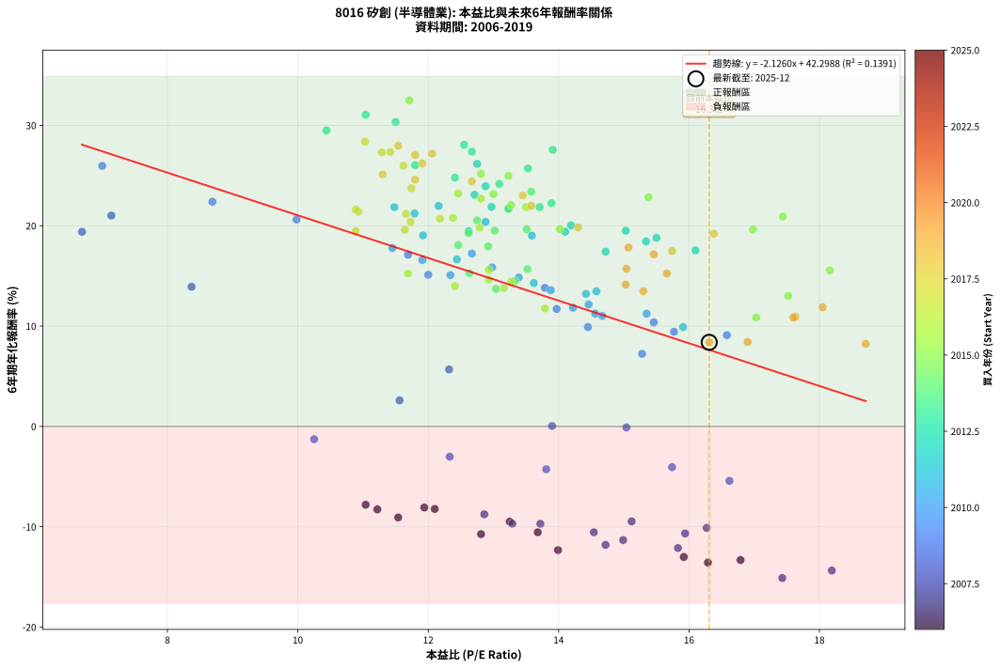
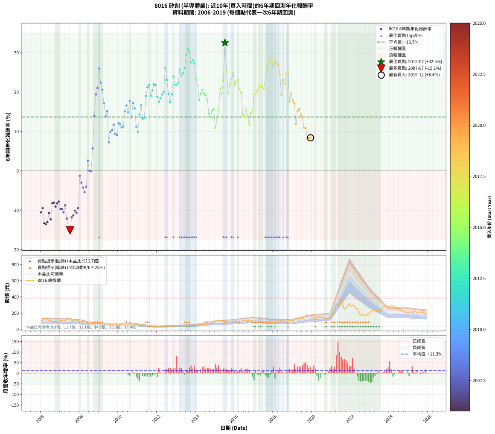

# 8016 矽創 - 本益比與未來報酬率分析

!!! info "報告資訊"
    - **股票代號**: 8016
    - **公司名稱**: 矽創
    - **產業別**: 半導體業
    - **分析期間**: 2006-2019 (168 個數據點)
    - **資料來源**: Type 12 (ShowMonthlyK_ChartFlow) 月收盤價與本益比
    - **報酬率口徑**: 含現金股利 (簡化: 年度合計，假設每年7/1入帳)
    - **報告生成時間**: 2026-01-11 21:24:46 CST

## 📈 視覺化圖表

### 圖表1: 本益比 vs 未來報酬率關係

*圖表1：8016 矽創 本益比與6年期未來報酬率關係 (2006-2019)*

### 圖表2: 歷年買入時點的6年期實際報酬率

*圖表2：8016 矽創 歷年買入時點的6年期實際報酬率 (2006-2019)*

## 📍 買點訊號說明

本報告提供兩種買點提示訊號（顯示於圖表2的股價子圖中）：

### ▲ 小綠色三角形（回測驗證）
- **計算方式**: 使用全部歷史資料計算本益比第25百分位數
- **用途**: 事後驗證，顯示歷史上哪些時點確實為低估區
- **限制**: 當下無法判斷，僅供回測參考
- **特性**: 後見之明（Look-Ahead Bias）

### ▲ 小橘色三角形（即時訊號）
- **計算方式**: 使用截至當月的過去5年資料計算本益比第25百分位數
- **用途**: 實際投資決策，當時即可判斷
- **優勢**: 可操作性強，符合實務需求
- **特性**: 無後見之明，滾動窗口計算

!!! tip "如何使用兩種訊號"
    - **綠色▲** 幫助理解歷史估值機會，驗證策略有效性
    - **橘色▲** 可作為實際買進參考，但仍需搭配基本面分析
    - 兩種訊號重疊時，表示即時判斷與事後驗證一致，信心度較高
    - 僅有綠色▲時，表示當時無法判斷（需要未來資料才能確認）
    - 僅有橘色▲時，表示即時判斷為買點，但事後可能不是最佳時機

## 📊 估值分析摘要

| 指標 | 數值 |
|:---:|:---:|
| **目前本益比** (2019-12) | **16.31 倍** |
| **歷史平均本益比** | 13.47 倍 |
| **估值水準** | 🔴 相對高估 |
| **預期6年年化報酬率** | **+7.62%** |
| **歷史平均報酬率** | +13.66% |
| **相關係數 (R²)** | 0.1391 |
| **趨勢線斜率** | -2.1260 |

!!! abstract "核心洞察"
    目前本益比顯著高於歷史平均，預期未來報酬率可能較低

    根據歷史數據回測，8016 矽創 在目前本益比 **16.3倍** 的估值水準下，
    預期未來6年年化報酬率約為 **+7.6%**。

    **重要提醒**: 本分析基於歷史數據統計，實際報酬率會受到公司基本面變化、產業趨勢、
    總體經濟環境等多重因素影響。R² = 0.14 表示本益比可解釋約 13.9% 的報酬率變異。

## 📈 歷史估值統計

### 最佳買點 (最高報酬率)

| 項目 | 數值 |
|:---:|:---:|
| 起始時間 | 2015-07 |
| 當時本益比 | 11.71 倍 |
| 起始價格 | 77.5 元 |
| 6年後價格 | 384.0 元 |
| **6年年化報酬率** | **+32.50%** |

### 最差買點 (最低報酬率)

| 項目 | 數值 |
|:---:|:---:|
| 起始時間 | 2007-07 |
| 當時本益比 | 17.43 倍 |
| 起始價格 | 132.0 元 |
| 6年後價格 | 35.1 元 |
| **6年年化報酬率** | **-15.11%** |

## 🎯 投資啟示

### 本益比與報酬率關係

趨勢線方程式: **y = -2.1260x + 42.2988**

!!! warning "強負相關"
    本益比與未來報酬率呈現強負相關。在高本益比時期買入，未來報酬率顯著較低；
    在低本益比時期買入，未來報酬率顯著較高。**估值紀律至關重要**。

### 估值區間建議

基於歷史數據分析:

- **🟢 低估區** (P/E < 10.8): 預期報酬率較高，可考慮增加持股
- **🟡 合理區** (P/E 10.8-16.2): 預期報酬率符合長期趨勢，正常持有
- **🔴 高估區** (P/E > 16.2): 預期報酬率較低，可考慮減碼或觀望

!!! danger "風險提示"
    - 過去表現不代表未來結果
    - 本分析假設公司基本面無重大結構性變化
    - 產業環境劇變可能使歷史規律失效
    - 應結合公司財報、產業趨勢、總體經濟等多重因素綜合判斷

!!! success "長期投資觀點"
    歷史數據顯示，在合理或低估的估值水準買入並長期持有，
    往往能獲得較佳的投資報酬。**耐心等待好價格**是價值投資的核心原則。

## 📊 數據品質

- **資料來源**: GoodInfo.tw Type 12 (ShowMonthlyK_ChartFlow)
- **資料頻率**: 月度收盤價與本益比
- **回測期間**: 2006-2019
- **數據點數量**: 168 個 (每個點代表一次6年期回測)

### 計算方法說明

1. **6年期年化報酬率**:
   - 對每個歷史時點，計算其後6年的實際投資報酬率
   - 期末價值(不含股利): 期末價格
   - 期末價值(含現金股利): 期末價格 + 持有期間內的現金股利合計 (簡化: 年度合計，假設每年7/1入帳)
   - 公式: 年化報酬率 = [(期末價值/期初價格)^(1/年數) - 1] × 100%

2. **本益比 (P/E Ratio)**:
   - 使用當時的月收盤價與EPS計算
   - 資料來源: Type 12 月度河流圖本益比數據

3. **趨勢線 (Linear Regression)**:
   - 使用最小平方法擬合線性趨勢線
   - R²值衡量本益比對報酬率的解釋能力

---

*本報告由 Stock Analysis System v1.9.0 自動生成*
*數據更新時間: 2026-01-11 21:24:46 CST*

## 📋 月度回測明細表

（每一列對應時間線圖中的一個買入點；可用來對照 SVG 圖上的每個點。）

| 買入月份 | 賣出月份 | 回測期限_年 | 實際持有年數 | 買入本益比_倍 | 買入收盤價_元 | 賣出收盤價_元 | 現金股利合計_元 | 總報酬率_pct | 年化報酬率_pct |
| --- | --- | --- | --- | --- | --- | --- | --- | --- | --- |
| 2006-01 | 2012-01 | 6 | 5.999 | 13.68 | 110.00 | 39.10 | 17.26 | -48.77 | -10.55 |
| 2006-02 | 2012-02 | 6 | 5.999 | 13.25 | 106.50 | 41.30 | 17.26 | -45.02 | -9.49 |
| 2006-03 | 2012-03 | 6 | 6.001 | 16.79 | 135.00 | 40.00 | 17.26 | -57.59 | -13.32 |
| 2006-04 | 2012-04 | 6 | 6.001 | 16.29 | 131.00 | 37.35 | 17.26 | -58.31 | -13.57 |
| 2006-05 | 2012-05 | 6 | 6.001 | 15.92 | 128.00 | 38.20 | 17.26 | -56.67 | -13.01 |
| 2006-06 | 2012-06 | 6 | 6.001 | 12.81 | 103.00 | 34.85 | 17.26 | -49.41 | -10.73 |
| 2006-07 | 2012-07 | 6 | 6.001 | 13.99 | 112.50 | 35.30 | 15.79 | -54.59 | -12.33 |
| 2006-08 | 2012-08 | 6 | 6.001 | 12.10 | 97.30 | 42.35 | 15.79 | -40.25 | -8.22 |
| 2006-09 | 2012-09 | 6 | 6.001 | 11.94 | 96.00 | 42.10 | 15.79 | -39.70 | -8.08 |
| 2006-10 | 2012-10 | 6 | 6.001 | 11.54 | 92.80 | 36.65 | 15.79 | -43.49 | -9.07 |
| 2006-11 | 2012-11 | 6 | 6.001 | 11.22 | 90.20 | 37.95 | 15.79 | -40.42 | -8.27 |
| 2006-12 | 2012-12 | 6 | 6.001 | 11.04 | 88.80 | 38.75 | 15.79 | -38.58 | -7.80 |
| 2007-01 | 2013-01 | 6 | 6.001 | 13.29 | 106.00 | 41.70 | 15.79 | -45.77 | -9.69 |
| 2007-02 | 2013-02 | 6 | 6.001 | 13.72 | 108.50 | 43.00 | 15.79 | -45.82 | -9.71 |
| 2007-03 | 2013-03 | 6 | 6.001 | 14.54 | 114.00 | 42.60 | 15.79 | -48.78 | -10.55 |
| 2007-04 | 2013-04 | 6 | 6.001 | 12.86 | 100.00 | 41.90 | 15.79 | -42.31 | -8.76 |
| 2007-05 | 2013-05 | 6 | 6.001 | 15.83 | 122.00 | 40.40 | 15.79 | -53.95 | -12.12 |
| 2007-06 | 2013-06 | 6 | 6.001 | 18.19 | 139.00 | 39.05 | 15.79 | -60.55 | -14.36 |
| 2007-07 | 2013-07 | 6 | 6.001 | 17.43 | 132.00 | 35.10 | 14.29 | -62.58 | -15.11 |
| 2007-08 | 2013-08 | 6 | 6.001 | 14.72 | 110.50 | 37.70 | 14.29 | -52.95 | -11.81 |
| 2007-09 | 2013-09 | 6 | 6.001 | 14.99 | 111.50 | 39.90 | 14.29 | -51.40 | -11.33 |
| 2007-10 | 2013-10 | 6 | 6.001 | 16.27 | 120.00 | 49.00 | 14.29 | -47.26 | -10.11 |
| 2007-11 | 2013-11 | 6 | 6.001 | 15.94 | 116.50 | 44.90 | 14.29 | -49.19 | -10.67 |
| 2007-12 | 2013-12 | 6 | 6.001 | 15.12 | 109.50 | 46.00 | 14.29 | -44.94 | -9.46 |
| 2008-01 | 2014-01 | 6 | 6.001 | 10.25 | 71.60 | 52.00 | 14.29 | -7.41 | -1.28 |
| 2008-02 | 2014-03 | 6 | 6.081 | 12.33 | 83.00 | 54.60 | 14.29 | -17.00 | -3.02 |
| 2008-03 | 2014-03 | 6 | 5.999 | 13.81 | 89.50 | 54.60 | 14.29 | -23.02 | -4.27 |
| 2008-04 | 2014-04 | 6 | 5.999 | 16.62 | 103.50 | 59.80 | 14.29 | -28.41 | -5.42 |
| 2008-05 | 2014-05 | 6 | 5.999 | 15.74 | 94.00 | 59.00 | 14.29 | -22.03 | -4.06 |
| 2008-06 | 2014-06 | 6 | 5.999 | 11.56 | 66.10 | 62.80 | 14.29 | +16.63 | +2.60 |
| 2008-07 | 2014-07 | 6 | 5.999 | 13.90 | 76.00 | 63.40 | 12.80 | +0.26 | +0.04 |
| 2008-08 | 2014-08 | 6 | 5.999 | 15.04 | 78.40 | 65.10 | 12.80 | -0.64 | -0.11 |
| 2008-09 | 2014-09 | 6 | 5.999 | 12.32 | 61.10 | 72.30 | 12.80 | +39.28 | +5.68 |
| 2008-10 | 2014-10 | 6 | 5.999 | 8.37 | 39.40 | 73.30 | 12.80 | +118.53 | +13.92 |
| 2008-11 | 2014-11 | 6 | 5.999 | 6.69 | 29.80 | 73.50 | 12.80 | +189.60 | +19.39 |
| 2008-12 | 2014-12 | 6 | 5.999 | 7.14 | 30.00 | 81.40 | 12.80 | +214.00 | +21.02 |
| 2009-01 | 2015-01 | 6 | 5.999 | 7.00 | 29.25 | 104.00 | 12.80 | +299.32 | +25.96 |
| 2009-02 | 2015-02 | 6 | 5.999 | 8.69 | 36.10 | 108.50 | 12.80 | +236.01 | +22.39 |
| 2009-03 | 2015-03 | 6 | 5.999 | 9.98 | 41.20 | 114.00 | 12.80 | +207.77 | +20.61 |
| 2009-04 | 2015-04 | 6 | 5.999 | 11.69 | 48.00 | 111.00 | 12.80 | +157.92 | +17.11 |
| 2009-05 | 2015-05 | 6 | 5.999 | 13.79 | 56.30 | 109.50 | 12.80 | +117.23 | +13.81 |
| 2009-06 | 2015-06 | 6 | 5.999 | 12.00 | 48.70 | 100.50 | 12.80 | +132.65 | +15.11 |
| 2009-07 | 2015-07 | 6 | 5.999 | 15.28 | 61.70 | 77.50 | 16.30 | +52.03 | +7.23 |
| 2009-08 | 2015-08 | 6 | 5.999 | 14.45 | 58.00 | 85.90 | 16.30 | +76.21 | +9.90 |
| 2009-09 | 2015-09 | 6 | 5.999 | 15.46 | 61.70 | 95.20 | 16.30 | +80.71 | +10.37 |
| 2009-10 | 2015-10 | 6 | 5.999 | 13.97 | 55.40 | 91.30 | 16.30 | +94.22 | +11.70 |
| 2009-11 | 2015-11 | 6 | 5.999 | 15.77 | 62.20 | 90.50 | 16.30 | +71.70 | +9.43 |
| 2009-12 | 2015-12 | 6 | 5.999 | 16.58 | 65.00 | 93.30 | 16.30 | +68.62 | +9.10 |
| 2010-01 | 2016-01 | 6 | 5.999 | 14.46 | 57.00 | 97.10 | 16.30 | +98.95 | +12.15 |
| 2010-02 | 2016-02 | 6 | 5.999 | 14.22 | 56.40 | 94.00 | 16.30 | +95.57 | +11.83 |
| 2010-03 | 2016-03 | 6 | 6.001 | 14.67 | 58.50 | 93.20 | 16.30 | +87.18 | +11.01 |
| 2010-04 | 2016-04 | 6 | 6.001 | 14.56 | 58.40 | 94.40 | 16.30 | +89.55 | +11.24 |
| 2010-05 | 2016-05 | 6 | 6.001 | 12.34 | 49.75 | 99.30 | 16.30 | +132.36 | +15.08 |
| 2010-06 | 2016-06 | 6 | 6.001 | 11.91 | 48.30 | 105.00 | 16.30 | +151.14 | +16.58 |
| 2010-07 | 2016-07 | 6 | 6.001 | 13.39 | 54.60 | 106.00 | 19.30 | +129.49 | +14.85 |
| 2010-08 | 2016-08 | 6 | 6.001 | 11.45 | 46.95 | 106.00 | 19.30 | +166.88 | +17.77 |
| 2010-09 | 2016-09 | 6 | 6.001 | 13.88 | 57.20 | 103.50 | 19.30 | +114.69 | +13.58 |
| 2010-10 | 2016-10 | 6 | 6.001 | 12.67 | 52.50 | 117.00 | 19.30 | +159.62 | +17.23 |
| 2010-11 | 2016-11 | 6 | 6.001 | 12.98 | 54.10 | 111.50 | 19.30 | +141.78 | +15.85 |
| 2010-12 | 2016-12 | 6 | 6.001 | 15.35 | 64.30 | 102.50 | 19.30 | +89.43 | +11.23 |
| 2011-01 | 2017-01 | 6 | 6.001 | 15.91 | 64.40 | 94.20 | 19.30 | +76.24 | +9.90 |
| 2011-02 | 2017-02 | 6 | 6.001 | 13.62 | 53.20 | 99.30 | 19.30 | +122.93 | +14.29 |
| 2011-03 | 2017-03 | 6 | 6.001 | 12.44 | 46.80 | 98.60 | 19.30 | +151.93 | +16.64 |
| 2011-04 | 2017-04 | 6 | 6.001 | 14.42 | 52.20 | 90.60 | 19.30 | +110.54 | +13.21 |
| 2011-05 | 2017-05 | 6 | 6.001 | 14.58 | 50.70 | 88.90 | 19.30 | +113.41 | +13.46 |
| 2011-06 | 2017-06 | 6 | 6.001 | 11.92 | 39.75 | 93.80 | 19.30 | +184.53 | +19.03 |
| 2011-07 | 2017-07 | 6 | 6.001 | 11.79 | 37.65 | 96.50 | 23.00 | +217.40 | +21.22 |
| 2011-08 | 2017-08 | 6 | 6.001 | 11.48 | 35.00 | 91.60 | 23.00 | +227.43 | +21.85 |
| 2011-09 | 2017-09 | 6 | 6.001 | 13.59 | 39.50 | 89.30 | 23.00 | +184.31 | +19.02 |
| 2011-10 | 2017-10 | 6 | 6.001 | 12.88 | 35.60 | 85.40 | 23.00 | +204.50 | +20.39 |
| 2011-11 | 2017-11 | 6 | 6.001 | 12.16 | 31.90 | 82.10 | 23.00 | +229.47 | +21.98 |
| 2011-12 | 2017-12 | 6 | 6.001 | 13.23 | 32.80 | 83.60 | 23.00 | +225.00 | +21.70 |
| 2012-01 | 2018-01 | 6 | 6.001 | 15.50 | 39.10 | 86.90 | 23.00 | +181.08 | +18.79 |
| 2012-02 | 2018-03 | 6 | 6.081 | 16.10 | 41.30 | 87.40 | 23.00 | +167.31 | +17.55 |
| 2012-03 | 2018-03 | 6 | 5.999 | 15.34 | 40.00 | 87.40 | 23.00 | +176.00 | +18.44 |
| 2012-04 | 2018-04 | 6 | 5.999 | 14.10 | 37.35 | 85.20 | 23.00 | +189.69 | +19.40 |
| 2012-05 | 2018-05 | 6 | 5.999 | 14.19 | 38.20 | 91.20 | 23.00 | +198.96 | +20.03 |
| 2012-06 | 2018-06 | 6 | 5.999 | 12.75 | 34.85 | 117.50 | 23.00 | +303.16 | +26.16 |
| 2012-07 | 2018-07 | 6 | 5.999 | 12.71 | 35.30 | 96.20 | 26.50 | +247.60 | +23.08 |
| 2012-08 | 2018-08 | 6 | 5.999 | 15.03 | 42.35 | 96.80 | 26.50 | +191.15 | +19.50 |
| 2012-09 | 2018-09 | 6 | 5.999 | 14.72 | 42.10 | 83.80 | 26.50 | +162.00 | +17.42 |
| 2012-10 | 2018-10 | 6 | 5.999 | 12.62 | 36.65 | 80.00 | 26.50 | +190.59 | +19.46 |
| 2012-11 | 2018-11 | 6 | 5.999 | 12.88 | 37.95 | 111.00 | 26.50 | +262.32 | +23.94 |
| 2012-12 | 2018-12 | 6 | 5.999 | 12.97 | 38.75 | 100.50 | 26.50 | +227.75 | +21.88 |
| 2013-01 | 2019-01 | 6 | 5.999 | 13.71 | 41.70 | 110.00 | 26.50 | +227.34 | +21.86 |
| 2013-02 | 2019-02 | 6 | 5.999 | 13.89 | 43.00 | 117.00 | 26.50 | +233.73 | +22.25 |
| 2013-03 | 2019-03 | 6 | 5.999 | 13.53 | 42.60 | 141.50 | 26.50 | +294.37 | +25.70 |
| 2013-04 | 2019-04 | 6 | 5.999 | 13.09 | 41.90 | 127.00 | 26.50 | +266.35 | +24.17 |
| 2013-05 | 2019-05 | 6 | 5.999 | 12.41 | 40.40 | 126.00 | 26.50 | +277.48 | +24.79 |
| 2013-06 | 2019-06 | 6 | 5.999 | 11.80 | 39.05 | 130.00 | 26.50 | +300.77 | +26.04 |
| 2013-07 | 2019-07 | 6 | 5.999 | 10.44 | 35.10 | 136.50 | 29.00 | +371.52 | +29.50 |
| 2013-08 | 2019-08 | 6 | 5.999 | 11.04 | 37.70 | 162.00 | 29.00 | +406.64 | +31.06 |
| 2013-09 | 2019-09 | 6 | 5.999 | 11.50 | 39.90 | 166.50 | 29.00 | +389.98 | +30.33 |
| 2013-10 | 2019-10 | 6 | 5.999 | 13.91 | 49.00 | 182.00 | 29.00 | +330.62 | +27.56 |
| 2013-11 | 2019-11 | 6 | 5.999 | 12.55 | 44.90 | 169.00 | 29.00 | +340.98 | +28.06 |
| 2013-12 | 2019-12 | 6 | 5.999 | 12.67 | 46.00 | 167.50 | 29.00 | +327.18 | +27.39 |
| 2014-01 | 2020-01 | 6 | 5.999 | 13.58 | 52.00 | 154.50 | 29.00 | +252.89 | +23.39 |
| 2014-02 | 2020-02 | 6 | 5.999 | 13.23 | 53.30 | 144.00 | 29.00 | +224.58 | +21.69 |
| 2014-03 | 2020-03 | 6 | 6.001 | 12.92 | 54.60 | 118.00 | 29.00 | +169.23 | +17.94 |
| 2014-04 | 2020-04 | 6 | 6.001 | 13.51 | 59.80 | 146.50 | 29.00 | +193.48 | +19.65 |
| 2014-05 | 2020-05 | 6 | 6.001 | 12.75 | 59.00 | 152.00 | 29.00 | +206.78 | +20.54 |
| 2014-06 | 2020-06 | 6 | 6.001 | 13.02 | 62.80 | 154.00 | 29.00 | +191.40 | +19.51 |
| 2014-07 | 2020-07 | 6 | 6.001 | 12.62 | 63.40 | 150.00 | 32.50 | +187.86 | +19.26 |
| 2014-08 | 2020-08 | 6 | 6.001 | 12.46 | 65.10 | 144.00 | 32.50 | +171.12 | +18.08 |
| 2014-09 | 2020-09 | 6 | 6.001 | 13.33 | 72.30 | 130.50 | 32.50 | +125.45 | +14.51 |
| 2014-10 | 2020-10 | 6 | 6.001 | 13.04 | 73.30 | 126.00 | 32.50 | +116.24 | +13.71 |
| 2014-11 | 2020-11 | 6 | 6.001 | 12.63 | 73.50 | 140.00 | 32.50 | +134.70 | +15.28 |
| 2014-12 | 2020-12 | 6 | 6.001 | 13.52 | 81.40 | 162.50 | 32.50 | +139.56 | +15.67 |
| 2015-01 | 2021-01 | 6 | 6.001 | 17.03 | 104.00 | 160.50 | 32.50 | +85.58 | +10.85 |
| 2015-02 | 2021-02 | 6 | 6.001 | 17.52 | 108.50 | 193.50 | 32.50 | +108.30 | +13.01 |
| 2015-03 | 2021-03 | 6 | 6.001 | 18.16 | 114.00 | 239.00 | 32.50 | +138.16 | +15.56 |
| 2015-04 | 2021-04 | 6 | 6.001 | 17.44 | 111.00 | 314.50 | 32.50 | +212.61 | +20.92 |
| 2015-05 | 2021-05 | 6 | 6.001 | 16.98 | 109.50 | 288.50 | 32.50 | +193.15 | +19.63 |
| 2015-06 | 2021-06 | 6 | 6.001 | 15.38 | 100.50 | 313.00 | 32.50 | +243.78 | +22.85 |
| 2015-07 | 2021-07 | 6 | 6.001 | 11.71 | 77.50 | 384.00 | 35.50 | +441.29 | +32.50 |
| 2015-08 | 2021-08 | 6 | 6.001 | 12.81 | 85.90 | 295.00 | 35.50 | +284.75 | +25.17 |
| 2015-09 | 2021-09 | 6 | 6.001 | 14.02 | 95.20 | 244.00 | 35.50 | +193.59 | +19.66 |
| 2015-10 | 2021-10 | 6 | 6.001 | 13.27 | 91.30 | 266.50 | 35.50 | +230.78 | +22.06 |
| 2015-11 | 2021-11 | 6 | 6.001 | 13.00 | 90.50 | 280.50 | 35.50 | +249.17 | +23.16 |
| 2015-12 | 2021-12 | 6 | 6.001 | 13.23 | 93.30 | 320.00 | 35.50 | +281.03 | +24.97 |
| 2016-01 | 2022-01 | 6 | 6.001 | 13.50 | 97.10 | 282.50 | 35.50 | +227.50 | +21.86 |
| 2016-02 | 2022-03 | 6 | 6.081 | 12.81 | 94.00 | 290.50 | 35.50 | +246.81 | +22.69 |
| 2016-03 | 2022-03 | 6 | 5.999 | 12.46 | 93.20 | 290.50 | 35.50 | +249.79 | +23.21 |
| 2016-04 | 2022-04 | 6 | 5.999 | 12.38 | 94.40 | 257.50 | 35.50 | +210.38 | +20.78 |
| 2016-05 | 2022-05 | 6 | 5.999 | 12.79 | 99.30 | 258.00 | 35.50 | +195.57 | +19.80 |
| 2016-06 | 2022-06 | 6 | 5.999 | 13.27 | 105.00 | 200.00 | 35.50 | +124.29 | +14.41 |
| 2016-07 | 2022-07 | 6 | 5.999 | 13.16 | 106.00 | 167.50 | 62.50 | +116.98 | +13.78 |
| 2016-08 | 2022-08 | 6 | 5.999 | 12.93 | 106.00 | 190.50 | 62.50 | +138.68 | +15.61 |
| 2016-09 | 2022-09 | 6 | 5.999 | 12.41 | 103.50 | 164.50 | 62.50 | +119.32 | +13.99 |
| 2016-10 | 2022-10 | 6 | 5.999 | 13.79 | 117.00 | 165.50 | 62.50 | +94.87 | +11.76 |
| 2016-11 | 2022-11 | 6 | 5.999 | 12.93 | 111.50 | 190.50 | 62.50 | +126.91 | +14.64 |
| 2016-12 | 2022-12 | 6 | 5.999 | 11.69 | 102.50 | 177.50 | 62.50 | +134.15 | +15.24 |
| 2017-01 | 2023-01 | 6 | 5.999 | 10.89 | 94.20 | 211.50 | 62.50 | +190.87 | +19.48 |
| 2017-02 | 2023-02 | 6 | 5.999 | 11.64 | 99.30 | 228.00 | 62.50 | +192.55 | +19.60 |
| 2017-03 | 2023-03 | 6 | 5.999 | 11.73 | 98.60 | 237.50 | 62.50 | +204.26 | +20.38 |
| 2017-04 | 2023-04 | 6 | 5.999 | 10.93 | 90.60 | 227.50 | 62.50 | +220.09 | +21.40 |
| 2017-05 | 2023-05 | 6 | 5.999 | 10.89 | 88.90 | 225.00 | 62.50 | +223.40 | +21.61 |
| 2017-06 | 2023-06 | 6 | 5.999 | 11.66 | 93.80 | 234.50 | 62.50 | +216.63 | +21.18 |
| 2017-07 | 2023-07 | 6 | 5.999 | 12.18 | 96.50 | 220.00 | 78.50 | +209.33 | +20.71 |
| 2017-08 | 2023-08 | 6 | 5.999 | 11.74 | 91.60 | 250.00 | 78.50 | +258.63 | +23.73 |
| 2017-09 | 2023-09 | 6 | 5.999 | 11.62 | 89.30 | 278.50 | 78.50 | +299.78 | +25.99 |
| 2017-10 | 2023-10 | 6 | 5.999 | 11.29 | 85.40 | 285.00 | 78.50 | +325.65 | +27.31 |
| 2017-11 | 2023-11 | 6 | 5.999 | 11.03 | 82.10 | 289.00 | 78.50 | +347.63 | +28.38 |
| 2017-12 | 2023-12 | 6 | 5.999 | 11.42 | 83.60 | 278.00 | 78.50 | +326.44 | +27.35 |
| 2018-01 | 2024-01 | 6 | 5.999 | 11.91 | 86.90 | 272.50 | 78.50 | +303.91 | +26.20 |
| 2018-02 | 2024-02 | 6 | 5.999 | 11.54 | 83.90 | 290.00 | 78.50 | +339.21 | +27.98 |
| 2018-03 | 2024-03 | 6 | 6.001 | 12.06 | 87.40 | 291.50 | 78.50 | +323.34 | +27.18 |
| 2018-04 | 2024-04 | 6 | 6.001 | 11.80 | 85.20 | 280.00 | 78.50 | +320.78 | +27.05 |
| 2018-05 | 2024-05 | 6 | 6.001 | 12.67 | 91.20 | 260.00 | 78.50 | +271.16 | +24.42 |
| 2018-06 | 2024-06 | 6 | 6.001 | 16.38 | 117.50 | 258.50 | 78.50 | +186.81 | +19.19 |
| 2018-07 | 2024-07 | 6 | 6.001 | 13.45 | 96.20 | 248.50 | 85.00 | +246.67 | +23.02 |
| 2018-08 | 2024-08 | 6 | 6.001 | 13.58 | 96.80 | 234.00 | 85.00 | +229.55 | +21.98 |
| 2018-09 | 2024-09 | 6 | 6.001 | 11.80 | 83.80 | 228.50 | 85.00 | +274.11 | +24.59 |
| 2018-10 | 2024-10 | 6 | 6.001 | 11.30 | 80.00 | 222.00 | 85.00 | +283.75 | +25.12 |
| 2018-11 | 2024-11 | 6 | 6.001 | 15.74 | 111.00 | 207.00 | 85.00 | +163.06 | +17.49 |
| 2018-12 | 2024-12 | 6 | 6.001 | 14.30 | 100.50 | 212.50 | 85.00 | +196.02 | +19.82 |
| 2019-01 | 2025-01 | 6 | 6.001 | 15.07 | 110.00 | 209.50 | 85.00 | +167.73 | +17.83 |
| 2019-02 | 2025-02 | 6 | 6.001 | 15.46 | 117.00 | 217.50 | 85.00 | +158.55 | +17.15 |
| 2019-03 | 2025-03 | 6 | 6.001 | 18.05 | 141.50 | 192.50 | 85.00 | +96.11 | +11.88 |
| 2019-04 | 2025-04 | 6 | 6.001 | 15.66 | 127.00 | 212.50 | 85.00 | +134.25 | +15.24 |
| 2019-05 | 2025-05 | 6 | 6.001 | 15.04 | 126.00 | 217.50 | 85.00 | +140.08 | +15.71 |
| 2019-06 | 2025-06 | 6 | 6.001 | 15.03 | 130.00 | 202.50 | 85.00 | +121.15 | +14.14 |
| 2019-07 | 2025-07 | 6 | 6.001 | 15.30 | 136.50 | 199.50 | 92.00 | +113.55 | +13.48 |
| 2019-08 | 2025-08 | 6 | 6.001 | 17.63 | 162.00 | 210.00 | 92.00 | +86.42 | +10.94 |
| 2019-09 | 2025-09 | 6 | 6.001 | 17.60 | 166.50 | 217.00 | 92.00 | +85.59 | +10.85 |
| 2019-10 | 2025-10 | 6 | 6.001 | 18.71 | 182.00 | 200.50 | 92.00 | +60.71 | +8.23 |
| 2019-11 | 2025-11 | 6 | 6.001 | 16.90 | 169.00 | 182.50 | 92.00 | +62.43 | +8.42 |
| 2019-12 | 2025-12 | 6 | 6.001 | 16.31 | 167.50 | 179.50 | 92.00 | +62.09 | +8.38 |
