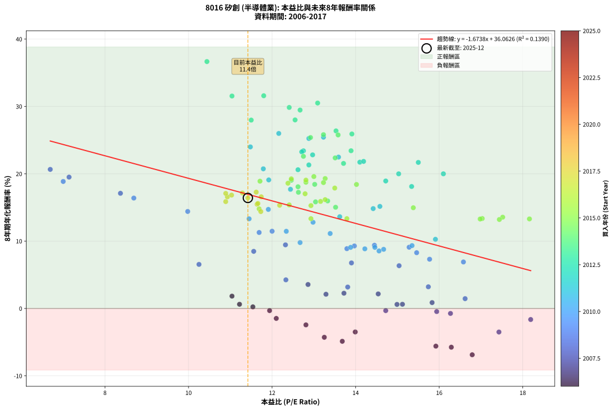
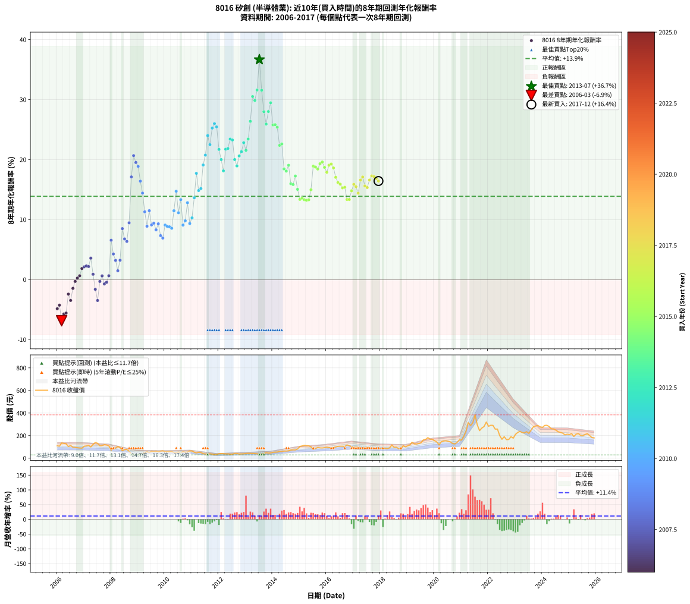

# 8016 矽創 - 本益比與未來報酬率分析

!!! info "報告資訊"
    - **股票代號**: 8016
    - **公司名稱**: 矽創
    - **產業別**: 半導體業
    - **分析期間**: 2006-2017 (144 個數據點)
    - **資料來源**: Type 12 (ShowMonthlyK_ChartFlow) 月收盤價與本益比
    - **報酬率口徑**: 含現金股利 (簡化: 年度合計，假設每年7/1入帳)
    - **報告生成時間**: 2026-01-06 19:15:57 CST

## 📈 視覺化圖表

### 圖表1: 本益比 vs 未來報酬率關係

*圖表1：8016 矽創 本益比與8年期未來報酬率關係 (2006-2017)*

### 圖表2: 歷年買入時點的8年期實際報酬率

*圖表2：8016 矽創 歷年買入時點的8年期實際報酬率 (2006-2017)*

## 📍 買點訊號說明

本報告提供兩種買點提示訊號（顯示於圖表2的股價子圖中）：

### ▲ 小綠色三角形（回測驗證）
- **計算方式**: 使用全部歷史資料計算本益比第25百分位數
- **用途**: 事後驗證，顯示歷史上哪些時點確實為低估區
- **限制**: 當下無法判斷，僅供回測參考
- **特性**: 後見之明（Look-Ahead Bias）

### ▲ 小橘色三角形（即時訊號）
- **計算方式**: 使用截至當月的過去5年資料計算本益比第25百分位數
- **用途**: 實際投資決策，當時即可判斷
- **優勢**: 可操作性強，符合實務需求
- **特性**: 無後見之明，滾動窗口計算

!!! tip "如何使用兩種訊號"
    - **綠色▲** 幫助理解歷史估值機會，驗證策略有效性
    - **橘色▲** 可作為實際買進參考，但仍需搭配基本面分析
    - 兩種訊號重疊時，表示即時判斷與事後驗證一致，信心度較高
    - 僅有綠色▲時，表示當時無法判斷（需要未來資料才能確認）
    - 僅有橘色▲時，表示即時判斷為買點，但事後可能不是最佳時機

## 📊 估值分析摘要

| 指標 | 數值 |
|:---:|:---:|
| **目前本益比** (2017-12) | **11.42 倍** |
| **歷史平均本益比** | 13.26 倍 |
| **估值水準** | 🟡 合理範圍 |
| **預期8年年化報酬率** | **+16.95%** |
| **歷史平均報酬率** | +13.87% |
| **相關係數 (R²)** | 0.1390 |
| **趨勢線斜率** | -1.6738 |

!!! abstract "核心洞察"
    目前本益比接近歷史平均，預期報酬率符合長期趨勢

    根據歷史數據回測，8016 矽創 在目前本益比 **11.4倍** 的估值水準下，
    預期未來8年年化報酬率約為 **+16.9%**。

    **重要提醒**: 本分析基於歷史數據統計，實際報酬率會受到公司基本面變化、產業趨勢、
    總體經濟環境等多重因素影響。R² = 0.14 表示本益比可解釋約 13.9% 的報酬率變異。

## 📈 歷史估值統計

### 最佳買點 (最高報酬率)

| 項目 | 數值 |
|:---:|:---:|
| 起始時間 | 2013-07 |
| 當時本益比 | 10.44 倍 |
| 起始價格 | 35.1 元 |
| 8年後價格 | 384.0 元 |
| **8年年化報酬率** | **+36.66%** |

### 最差買點 (最低報酬率)

| 項目 | 數值 |
|:---:|:---:|
| 起始時間 | 2006-03 |
| 當時本益比 | 16.79 倍 |
| 起始價格 | 135.0 元 |
| 8年後價格 | 54.6 元 |
| **8年年化報酬率** | **-6.88%** |

## 🎯 投資啟示

### 本益比與報酬率關係

趨勢線方程式: **y = -1.6738x + 36.0626**

!!! warning "強負相關"
    本益比與未來報酬率呈現強負相關。在高本益比時期買入，未來報酬率顯著較低；
    在低本益比時期買入，未來報酬率顯著較高。**估值紀律至關重要**。

### 估值區間建議

基於歷史數據分析:

- **🟢 低估區** (P/E < 10.6): 預期報酬率較高，可考慮增加持股
- **🟡 合理區** (P/E 10.6-15.9): 預期報酬率符合長期趨勢，正常持有
- **🔴 高估區** (P/E > 15.9): 預期報酬率較低，可考慮減碼或觀望

!!! danger "風險提示"
    - 過去表現不代表未來結果
    - 本分析假設公司基本面無重大結構性變化
    - 產業環境劇變可能使歷史規律失效
    - 應結合公司財報、產業趨勢、總體經濟等多重因素綜合判斷

!!! success "長期投資觀點"
    歷史數據顯示，在合理或低估的估值水準買入並長期持有，
    往往能獲得較佳的投資報酬。**耐心等待好價格**是價值投資的核心原則。

## 📊 數據品質

- **資料來源**: GoodInfo.tw Type 12 (ShowMonthlyK_ChartFlow)
- **資料頻率**: 月度收盤價與本益比
- **回測期間**: 2006-2017
- **數據點數量**: 144 個 (每個點代表一次8年期回測)

### 計算方法說明

1. **8年期年化報酬率**:
   - 對每個歷史時點，計算其後8年的實際投資報酬率
   - 期末價值(不含股利): 期末價格
   - 期末價值(含現金股利): 期末價格 + 持有期間內的現金股利合計 (簡化: 年度合計，假設每年7/1入帳)
   - 公式: 年化報酬率 = [(期末價值/期初價格)^(1/年數) - 1] × 100%

2. **本益比 (P/E Ratio)**:
   - 使用當時的月收盤價與EPS計算
   - 資料來源: Type 12 月度河流圖本益比數據

3. **趨勢線 (Linear Regression)**:
   - 使用最小平方法擬合線性趨勢線
   - R²值衡量本益比對報酬率的解釋能力

---

*本報告由 Stock Analysis System v1.9.0 自動生成*
*數據更新時間: 2026-01-06 19:15:57 CST*

## 📋 月度回測明細表

（每一列對應時間線圖中的一個買入點；可用來對照 SVG 圖上的每個點。）

| 買入月份 | 賣出月份 | 回測期限_年 | 實際持有年數 | 買入本益比_倍 | 買入收盤價_元 | 賣出收盤價_元 | 現金股利合計_元 | 總報酬率_pct | 年化報酬率_pct |
| --- | --- | --- | --- | --- | --- | --- | --- | --- | --- |
| 2006-01 | 2014-01 | 8 | 8.000 | 13.68 | 110.00 | 52.00 | 21.76 | -32.95 | -4.87 |
| 2006-02 | 2014-02 | 8 | 8.000 | 13.25 | 106.50 | 53.30 | 21.76 | -29.52 | -4.28 |
| 2006-03 | 2014-03 | 8 | 8.000 | 16.79 | 135.00 | 54.60 | 21.76 | -43.44 | -6.88 |
| 2006-04 | 2014-04 | 8 | 8.000 | 16.29 | 131.00 | 59.80 | 21.76 | -37.74 | -5.75 |
| 2006-05 | 2014-05 | 8 | 8.000 | 15.92 | 128.00 | 59.00 | 21.76 | -36.91 | -5.59 |
| 2006-06 | 2014-06 | 8 | 8.000 | 12.81 | 103.00 | 62.80 | 21.76 | -17.90 | -2.44 |
| 2006-07 | 2014-07 | 8 | 8.000 | 13.99 | 112.50 | 63.40 | 21.29 | -24.72 | -3.49 |
| 2006-08 | 2014-08 | 8 | 8.000 | 12.10 | 97.30 | 65.10 | 21.29 | -11.21 | -1.48 |
| 2006-09 | 2014-09 | 8 | 8.000 | 11.94 | 96.00 | 72.30 | 21.29 | -2.51 | -0.32 |
| 2006-10 | 2014-10 | 8 | 8.000 | 11.54 | 92.80 | 73.30 | 21.29 | +1.93 | +0.24 |
| 2006-11 | 2014-11 | 8 | 8.000 | 11.22 | 90.20 | 73.50 | 21.29 | +5.09 | +0.62 |
| 2006-12 | 2014-12 | 8 | 8.000 | 11.04 | 88.80 | 81.40 | 21.29 | +15.64 | +1.83 |
| 2007-01 | 2015-01 | 8 | 8.000 | 13.29 | 106.00 | 104.00 | 21.29 | +18.20 | +2.11 |
| 2007-02 | 2015-02 | 8 | 8.000 | 13.72 | 108.50 | 108.50 | 21.29 | +19.62 | +2.26 |
| 2007-03 | 2015-03 | 8 | 8.000 | 14.54 | 114.00 | 114.00 | 21.29 | +18.67 | +2.16 |
| 2007-04 | 2015-04 | 8 | 8.000 | 12.86 | 100.00 | 111.00 | 21.29 | +32.29 | +3.56 |
| 2007-05 | 2015-05 | 8 | 8.000 | 15.83 | 122.00 | 109.50 | 21.29 | +7.20 | +0.87 |
| 2007-06 | 2015-06 | 8 | 8.000 | 18.19 | 139.00 | 100.50 | 21.29 | -12.38 | -1.64 |
| 2007-07 | 2015-07 | 8 | 8.000 | 17.43 | 132.00 | 77.50 | 21.79 | -24.78 | -3.50 |
| 2007-08 | 2015-08 | 8 | 8.000 | 14.72 | 110.50 | 85.90 | 21.79 | -2.54 | -0.32 |
| 2007-09 | 2015-09 | 8 | 8.000 | 14.99 | 111.50 | 95.20 | 21.79 | +4.93 | +0.60 |
| 2007-10 | 2015-10 | 8 | 8.000 | 16.27 | 120.00 | 91.30 | 21.79 | -5.76 | -0.74 |
| 2007-11 | 2015-11 | 8 | 8.000 | 15.94 | 116.50 | 90.50 | 21.79 | -3.61 | -0.46 |
| 2007-12 | 2015-12 | 8 | 8.000 | 15.12 | 109.50 | 93.30 | 21.79 | +5.11 | +0.62 |
| 2008-01 | 2016-01 | 8 | 8.000 | 10.25 | 71.60 | 97.10 | 21.79 | +66.05 | +6.54 |
| 2008-02 | 2016-02 | 8 | 8.000 | 12.33 | 83.00 | 94.00 | 21.79 | +39.51 | +4.25 |
| 2008-03 | 2016-03 | 8 | 8.000 | 13.81 | 89.50 | 93.20 | 21.79 | +28.48 | +3.18 |
| 2008-04 | 2016-04 | 8 | 8.000 | 16.62 | 103.50 | 94.40 | 21.79 | +12.26 | +1.46 |
| 2008-05 | 2016-05 | 8 | 8.000 | 15.74 | 94.00 | 99.30 | 21.79 | +28.82 | +3.22 |
| 2008-06 | 2016-06 | 8 | 8.000 | 11.56 | 66.10 | 105.00 | 21.79 | +91.82 | +8.48 |
| 2008-07 | 2016-07 | 8 | 8.000 | 13.90 | 76.00 | 106.00 | 22.30 | +68.82 | +6.76 |
| 2008-08 | 2016-08 | 8 | 8.000 | 15.04 | 78.40 | 106.00 | 22.30 | +63.65 | +6.35 |
| 2008-09 | 2016-09 | 8 | 8.000 | 12.32 | 61.10 | 103.50 | 22.30 | +105.89 | +9.45 |
| 2008-10 | 2016-10 | 8 | 8.000 | 8.37 | 39.40 | 117.00 | 22.30 | +253.55 | +17.10 |
| 2008-11 | 2016-11 | 8 | 8.000 | 6.69 | 29.80 | 111.50 | 22.30 | +348.99 | +20.65 |
| 2008-12 | 2016-12 | 8 | 8.000 | 7.14 | 30.00 | 102.50 | 22.30 | +316.00 | +19.51 |
| 2009-01 | 2017-01 | 8 | 8.000 | 7.00 | 29.25 | 94.20 | 22.30 | +298.29 | +18.86 |
| 2009-02 | 2017-02 | 8 | 8.000 | 8.69 | 36.10 | 99.30 | 22.30 | +236.84 | +16.39 |
| 2009-03 | 2017-03 | 8 | 8.000 | 9.98 | 41.20 | 98.60 | 22.30 | +193.45 | +14.40 |
| 2009-04 | 2017-04 | 8 | 8.000 | 11.69 | 48.00 | 90.60 | 22.30 | +135.21 | +11.28 |
| 2009-05 | 2017-05 | 8 | 8.000 | 13.79 | 56.30 | 88.90 | 22.30 | +97.51 | +8.88 |
| 2009-06 | 2017-06 | 8 | 8.000 | 12.00 | 48.70 | 93.80 | 22.30 | +138.40 | +11.47 |
| 2009-07 | 2017-07 | 8 | 8.000 | 15.28 | 61.70 | 96.50 | 27.30 | +100.65 | +9.09 |
| 2009-08 | 2017-08 | 8 | 8.000 | 14.45 | 58.00 | 91.60 | 27.30 | +105.00 | +9.39 |
| 2009-09 | 2017-09 | 8 | 8.000 | 15.46 | 61.70 | 89.30 | 27.30 | +88.98 | +8.28 |
| 2009-10 | 2017-10 | 8 | 8.000 | 13.97 | 55.40 | 85.40 | 27.30 | +103.43 | +9.28 |
| 2009-11 | 2017-11 | 8 | 8.000 | 15.77 | 62.20 | 82.10 | 27.30 | +75.88 | +7.31 |
| 2009-12 | 2017-12 | 8 | 8.000 | 16.58 | 65.00 | 83.60 | 27.30 | +70.62 | +6.91 |
| 2010-01 | 2018-01 | 8 | 8.000 | 14.46 | 57.00 | 86.90 | 27.30 | +100.35 | +9.07 |
| 2010-02 | 2018-02 | 8 | 8.000 | 14.22 | 56.40 | 83.90 | 27.30 | +97.16 | +8.86 |
| 2010-03 | 2018-03 | 8 | 8.000 | 14.67 | 58.50 | 87.40 | 27.30 | +96.07 | +8.78 |
| 2010-04 | 2018-04 | 8 | 8.000 | 14.56 | 58.40 | 85.20 | 27.30 | +92.64 | +8.54 |
| 2010-05 | 2018-05 | 8 | 8.000 | 12.34 | 49.75 | 91.20 | 27.30 | +138.19 | +11.46 |
| 2010-06 | 2018-06 | 8 | 8.000 | 11.91 | 48.30 | 117.50 | 27.30 | +199.79 | +14.71 |
| 2010-07 | 2018-07 | 8 | 8.000 | 13.39 | 54.60 | 96.20 | 30.80 | +132.60 | +11.13 |
| 2010-08 | 2018-08 | 8 | 8.000 | 11.45 | 46.95 | 96.80 | 30.80 | +171.78 | +13.31 |
| 2010-09 | 2018-09 | 8 | 8.000 | 13.88 | 57.20 | 83.80 | 30.80 | +100.35 | +9.07 |
| 2010-10 | 2018-10 | 8 | 8.000 | 12.67 | 52.50 | 80.00 | 30.80 | +111.05 | +9.79 |
| 2010-11 | 2018-11 | 8 | 8.000 | 12.98 | 54.10 | 111.00 | 30.80 | +162.11 | +12.80 |
| 2010-12 | 2018-12 | 8 | 8.000 | 15.35 | 64.30 | 100.50 | 30.80 | +104.20 | +9.33 |
| 2011-01 | 2019-01 | 8 | 8.000 | 15.91 | 64.40 | 110.00 | 30.80 | +118.64 | +10.27 |
| 2011-02 | 2019-02 | 8 | 8.000 | 13.62 | 53.20 | 117.00 | 30.80 | +177.82 | +13.62 |
| 2011-03 | 2019-03 | 8 | 8.000 | 12.44 | 46.80 | 141.50 | 30.80 | +268.17 | +17.69 |
| 2011-04 | 2019-04 | 8 | 8.000 | 14.42 | 52.20 | 127.00 | 30.80 | +202.30 | +14.83 |
| 2011-05 | 2019-05 | 8 | 8.000 | 14.58 | 50.70 | 126.00 | 30.80 | +209.27 | +15.16 |
| 2011-06 | 2019-06 | 8 | 8.000 | 11.92 | 39.75 | 130.00 | 30.80 | +304.53 | +19.09 |
| 2011-07 | 2019-07 | 8 | 8.000 | 11.79 | 37.65 | 136.50 | 33.50 | +351.53 | +20.74 |
| 2011-08 | 2019-08 | 8 | 8.000 | 11.48 | 35.00 | 162.00 | 33.50 | +458.58 | +23.99 |
| 2011-09 | 2019-09 | 8 | 8.000 | 13.59 | 39.50 | 166.50 | 33.50 | +406.33 | +22.48 |
| 2011-10 | 2019-10 | 8 | 8.000 | 12.88 | 35.60 | 182.00 | 33.50 | +505.34 | +25.24 |
| 2011-11 | 2019-11 | 8 | 8.000 | 12.16 | 31.90 | 169.00 | 33.50 | +534.80 | +25.99 |
| 2011-12 | 2019-12 | 8 | 8.000 | 13.23 | 32.80 | 167.50 | 33.50 | +512.81 | +25.43 |
| 2012-01 | 2020-01 | 8 | 8.000 | 15.50 | 39.10 | 154.50 | 33.50 | +380.82 | +21.69 |
| 2012-02 | 2020-02 | 8 | 8.000 | 16.10 | 41.30 | 144.00 | 33.50 | +329.79 | +19.99 |
| 2012-03 | 2020-03 | 8 | 8.000 | 15.34 | 40.00 | 118.00 | 33.50 | +278.76 | +18.11 |
| 2012-04 | 2020-04 | 8 | 8.000 | 14.10 | 37.35 | 146.50 | 33.50 | +381.93 | +21.72 |
| 2012-05 | 2020-05 | 8 | 8.000 | 14.19 | 38.20 | 152.00 | 33.50 | +385.61 | +21.84 |
| 2012-06 | 2020-06 | 8 | 8.000 | 12.75 | 34.85 | 154.00 | 33.50 | +438.03 | +23.41 |
| 2012-07 | 2020-07 | 8 | 8.000 | 12.71 | 35.30 | 150.00 | 38.00 | +432.58 | +23.25 |
| 2012-08 | 2020-08 | 8 | 8.000 | 15.03 | 42.35 | 144.00 | 38.00 | +329.76 | +19.99 |
| 2012-09 | 2020-09 | 8 | 8.000 | 14.72 | 42.10 | 130.50 | 38.00 | +300.24 | +18.93 |
| 2012-10 | 2020-10 | 8 | 8.000 | 12.62 | 36.65 | 126.00 | 38.00 | +347.48 | +20.60 |
| 2012-11 | 2020-11 | 8 | 8.000 | 12.88 | 37.95 | 140.00 | 38.00 | +369.04 | +21.31 |
| 2012-12 | 2020-12 | 8 | 8.000 | 12.97 | 38.75 | 162.50 | 38.00 | +417.42 | +22.81 |
| 2013-01 | 2021-01 | 8 | 8.000 | 13.71 | 41.70 | 160.50 | 38.00 | +376.02 | +21.54 |
| 2013-02 | 2021-02 | 8 | 8.000 | 13.89 | 43.00 | 193.50 | 38.00 | +438.38 | +23.42 |
| 2013-03 | 2021-03 | 8 | 8.000 | 13.53 | 42.60 | 239.00 | 38.00 | +550.24 | +26.37 |
| 2013-04 | 2021-04 | 8 | 8.000 | 13.09 | 41.90 | 314.50 | 38.00 | +741.29 | +30.50 |
| 2013-05 | 2021-05 | 8 | 8.000 | 12.41 | 40.40 | 288.50 | 38.00 | +708.17 | +29.85 |
| 2013-06 | 2021-06 | 8 | 8.000 | 11.80 | 39.05 | 313.00 | 38.00 | +798.85 | +31.59 |
| 2013-07 | 2021-07 | 8 | 8.000 | 10.44 | 35.10 | 384.00 | 43.00 | +1116.53 | +36.66 |
| 2013-08 | 2021-08 | 8 | 8.000 | 11.04 | 37.70 | 295.00 | 43.00 | +796.56 | +31.54 |
| 2013-09 | 2021-09 | 8 | 8.000 | 11.50 | 39.90 | 244.00 | 43.00 | +619.30 | +27.97 |
| 2013-10 | 2021-10 | 8 | 8.000 | 13.91 | 49.00 | 266.50 | 43.00 | +531.64 | +25.91 |
| 2013-11 | 2021-11 | 8 | 8.000 | 12.55 | 44.90 | 280.50 | 43.00 | +620.49 | +28.00 |
| 2013-12 | 2021-12 | 8 | 8.000 | 12.67 | 46.00 | 320.00 | 43.00 | +689.13 | +29.46 |
| 2014-01 | 2022-01 | 8 | 8.000 | 13.58 | 52.00 | 282.50 | 43.00 | +525.97 | +25.77 |
| 2014-02 | 2022-02 | 8 | 8.000 | 13.23 | 53.30 | 291.50 | 43.00 | +527.58 | +25.81 |
| 2014-03 | 2022-03 | 8 | 8.000 | 12.92 | 54.60 | 290.50 | 43.00 | +510.81 | +25.38 |
| 2014-04 | 2022-04 | 8 | 8.000 | 13.51 | 59.80 | 257.50 | 43.00 | +402.51 | +22.36 |
| 2014-05 | 2022-05 | 8 | 8.000 | 12.75 | 59.00 | 258.00 | 43.00 | +410.17 | +22.59 |
| 2014-06 | 2022-06 | 8 | 8.000 | 13.02 | 62.80 | 200.00 | 43.00 | +286.95 | +18.43 |
| 2014-07 | 2022-07 | 8 | 8.000 | 12.62 | 63.40 | 167.50 | 72.00 | +277.76 | +18.07 |
| 2014-08 | 2022-08 | 8 | 8.000 | 12.46 | 65.10 | 190.50 | 72.00 | +303.23 | +19.04 |
| 2014-09 | 2022-09 | 8 | 8.000 | 13.33 | 72.30 | 164.50 | 72.00 | +227.11 | +15.97 |
| 2014-10 | 2022-10 | 8 | 8.000 | 13.04 | 73.30 | 165.50 | 72.00 | +224.01 | +15.83 |
| 2014-11 | 2022-11 | 8 | 8.000 | 12.63 | 73.50 | 190.50 | 72.00 | +257.14 | +17.25 |
| 2014-12 | 2022-12 | 8 | 8.000 | 13.52 | 81.40 | 177.50 | 72.00 | +206.51 | +15.03 |
| 2015-01 | 2023-01 | 8 | 8.000 | 17.03 | 104.00 | 211.50 | 72.00 | +172.60 | +13.35 |
| 2015-02 | 2023-02 | 8 | 8.000 | 17.52 | 108.50 | 228.00 | 72.00 | +176.50 | +13.56 |
| 2015-03 | 2023-03 | 8 | 8.000 | 18.16 | 114.00 | 237.50 | 72.00 | +171.49 | +13.30 |
| 2015-04 | 2023-04 | 8 | 8.000 | 17.44 | 111.00 | 227.50 | 72.00 | +169.82 | +13.21 |
| 2015-05 | 2023-05 | 8 | 8.000 | 16.98 | 109.50 | 225.00 | 72.00 | +171.23 | +13.28 |
| 2015-06 | 2023-06 | 8 | 8.000 | 15.38 | 100.50 | 234.50 | 72.00 | +204.98 | +14.96 |
| 2015-07 | 2023-07 | 8 | 8.000 | 11.71 | 77.50 | 220.00 | 89.50 | +299.36 | +18.90 |
| 2015-08 | 2023-08 | 8 | 8.000 | 12.81 | 85.90 | 250.00 | 89.50 | +295.23 | +18.74 |
| 2015-09 | 2023-09 | 8 | 8.000 | 14.02 | 95.20 | 278.50 | 89.50 | +286.56 | +18.41 |
| 2015-10 | 2023-10 | 8 | 8.000 | 13.27 | 91.30 | 285.00 | 89.50 | +310.19 | +19.30 |
| 2015-11 | 2023-11 | 8 | 8.000 | 13.00 | 90.50 | 289.00 | 89.50 | +318.23 | +19.59 |
| 2015-12 | 2023-12 | 8 | 8.000 | 13.23 | 93.30 | 278.00 | 89.50 | +293.89 | +18.69 |
| 2016-01 | 2024-01 | 8 | 8.000 | 13.50 | 97.10 | 272.50 | 89.50 | +272.81 | +17.88 |
| 2016-02 | 2024-02 | 8 | 8.000 | 12.81 | 94.00 | 290.00 | 89.50 | +303.72 | +19.06 |
| 2016-03 | 2024-03 | 8 | 8.000 | 12.46 | 93.20 | 291.50 | 89.50 | +308.80 | +19.24 |
| 2016-04 | 2024-04 | 8 | 8.000 | 12.38 | 94.40 | 280.00 | 89.50 | +291.42 | +18.60 |
| 2016-05 | 2024-05 | 8 | 8.000 | 12.79 | 99.30 | 260.00 | 89.50 | +251.96 | +17.03 |
| 2016-06 | 2024-06 | 8 | 8.000 | 13.27 | 105.00 | 258.50 | 89.50 | +231.43 | +16.16 |
| 2016-07 | 2024-07 | 8 | 8.000 | 13.16 | 106.00 | 248.50 | 96.50 | +225.47 | +15.89 |
| 2016-08 | 2024-08 | 8 | 8.000 | 12.93 | 106.00 | 234.00 | 96.50 | +211.79 | +15.27 |
| 2016-09 | 2024-09 | 8 | 8.000 | 12.41 | 103.50 | 228.50 | 96.50 | +214.01 | +15.38 |
| 2016-10 | 2024-10 | 8 | 8.000 | 13.79 | 117.00 | 222.00 | 96.50 | +172.22 | +13.34 |
| 2016-11 | 2024-11 | 8 | 8.000 | 12.93 | 111.50 | 207.00 | 96.50 | +172.20 | +13.33 |
| 2016-12 | 2024-12 | 8 | 8.000 | 11.69 | 102.50 | 212.50 | 96.50 | +201.46 | +14.79 |
| 2017-01 | 2025-01 | 8 | 8.000 | 10.89 | 94.20 | 209.50 | 96.50 | +224.84 | +15.87 |
| 2017-02 | 2025-02 | 8 | 8.000 | 11.64 | 99.30 | 217.50 | 96.50 | +216.21 | +15.48 |
| 2017-03 | 2025-03 | 8 | 8.000 | 11.73 | 98.60 | 192.50 | 96.50 | +193.10 | +14.39 |
| 2017-04 | 2025-04 | 8 | 8.000 | 10.93 | 90.60 | 212.50 | 96.50 | +241.06 | +16.57 |
| 2017-05 | 2025-05 | 8 | 8.000 | 10.89 | 88.90 | 217.50 | 96.50 | +253.21 | +17.09 |
| 2017-06 | 2025-06 | 8 | 8.000 | 11.66 | 93.80 | 202.50 | 96.50 | +218.76 | +15.59 |
| 2017-07 | 2025-07 | 8 | 8.000 | 12.18 | 96.50 | 199.50 | 102.50 | +212.95 | +15.33 |
| 2017-08 | 2025-08 | 8 | 8.000 | 11.74 | 91.60 | 210.00 | 102.50 | +241.16 | +16.58 |
| 2017-09 | 2025-09 | 8 | 8.000 | 11.62 | 89.30 | 217.00 | 102.50 | +257.78 | +17.27 |
| 2017-10 | 2025-10 | 8 | 8.000 | 11.29 | 85.40 | 200.50 | 102.50 | +254.80 | +17.15 |
| 2017-11 | 2025-11 | 8 | 8.000 | 11.03 | 82.10 | 182.50 | 102.50 | +247.14 | +16.83 |
| 2017-12 | 2025-12 | 8 | 8.000 | 11.42 | 83.60 | 179.50 | 102.50 | +237.32 | +16.41 |
