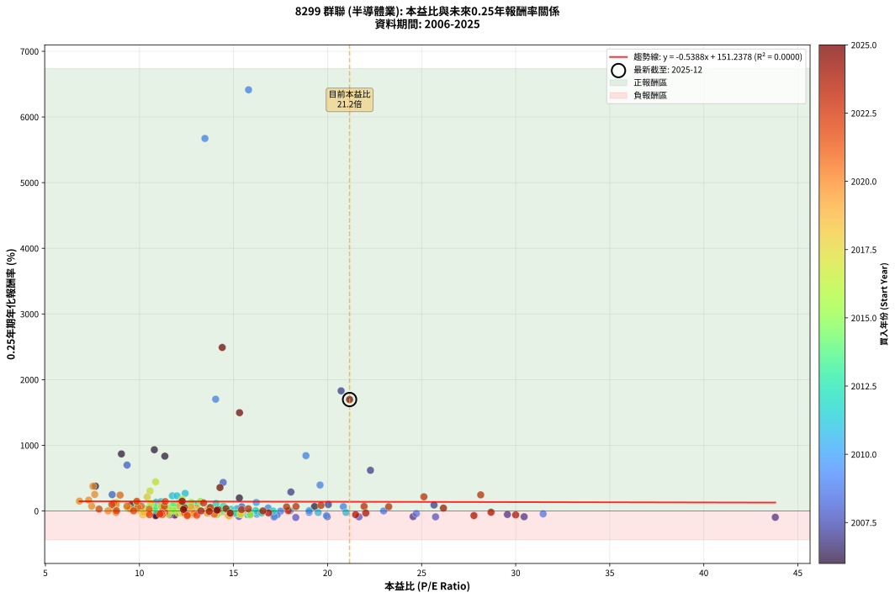
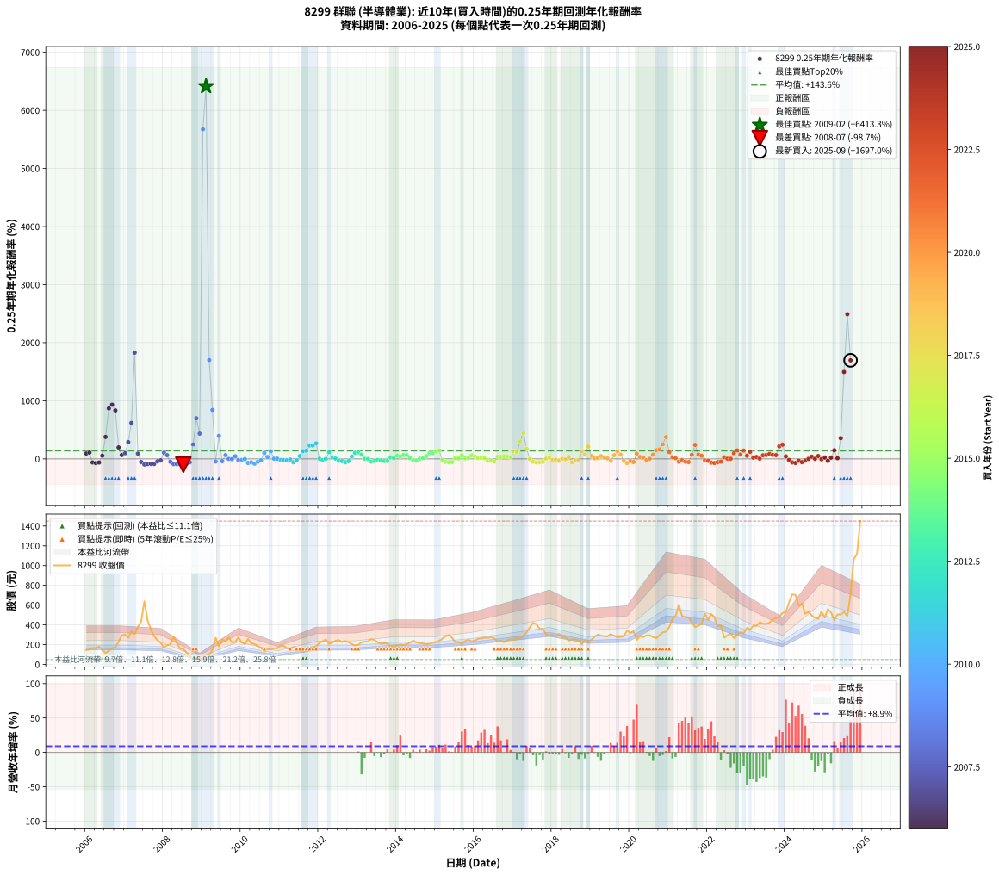

# 8299 群聯 - 本益比與未來報酬率分析

!!! info "報告資訊"
    - **股票代號**: 8299
    - **公司名稱**: 群聯
    - **產業別**: 半導體業
    - **分析期間**: 2006-2025 (237 個數據點)
    - **資料來源**: Type 12 (ShowMonthlyK_ChartFlow) 月收盤價與本益比
    - **報酬率口徑**: 含現金股利 (簡化: 年度合計，假設每年7/1入帳)
    - **報告生成時間**: 2026-01-13 01:18:46 CST

## 📈 視覺化圖表

### 圖表1: 本益比 vs 未來報酬率關係

*圖表1：8299 群聯 本益比與0.25年期未來報酬率關係 (2006-2025)*

### 圖表2: 歷年買入時點的0.25年期實際報酬率

*圖表2：8299 群聯 歷年買入時點的0.25年期實際報酬率 (2006-2025)*

## 📍 買點訊號說明

本報告提供兩種買點提示訊號（顯示於圖表2的股價子圖中）：

### ▲ 小綠色三角形（回測驗證）
- **計算方式**: 使用全部歷史資料計算本益比第25百分位數
- **用途**: 事後驗證，顯示歷史上哪些時點確實為低估區
- **限制**: 當下無法判斷，僅供回測參考
- **特性**: 後見之明（Look-Ahead Bias）

### ▲ 小橘色三角形（即時訊號）
- **計算方式**: 使用截至當月的過去5年資料計算本益比第25百分位數
- **用途**: 實際投資決策，當時即可判斷
- **優勢**: 可操作性強，符合實務需求
- **特性**: 無後見之明，滾動窗口計算

!!! tip "如何使用兩種訊號"
    - **綠色▲** 幫助理解歷史估值機會，驗證策略有效性
    - **橘色▲** 可作為實際買進參考，但仍需搭配基本面分析
    - 兩種訊號重疊時，表示即時判斷與事後驗證一致，信心度較高
    - 僅有綠色▲時，表示當時無法判斷（需要未來資料才能確認）
    - 僅有橘色▲時，表示即時判斷為買點，但事後可能不是最佳時機

## 📊 估值分析摘要

| 指標 | 數值 |
|:---:|:---:|
| **目前本益比** (2025-09) | **21.17 倍** |
| **歷史平均本益比** | 14.27 倍 |
| **估值水準** | 🔴 相對高估 |
| **預期0.25年年化報酬率** | **+139.83%** |
| **歷史平均報酬率** | +143.55% |
| **相關係數 (R²)** | 0.0000 |
| **趨勢線斜率** | -0.5388 |

!!! abstract "核心洞察"
    目前本益比顯著高於歷史平均，預期未來報酬率可能較低

    根據歷史數據回測，8299 群聯 在目前本益比 **21.2倍** 的估值水準下，
    預期未來0.25年年化報酬率約為 **+139.8%**。

    **重要提醒**: 本分析基於歷史數據統計，實際報酬率會受到公司基本面變化、產業趨勢、
    總體經濟環境等多重因素影響。R² = 0.00 表示本益比可解釋約 0.0% 的報酬率變異。

## 📈 歷史估值統計

### 最佳買點 (最高報酬率)

| 項目 | 數值 |
|:---:|:---:|
| 起始時間 | 2009-02 |
| 當時本益比 | 15.80 倍 |
| 起始價格 | 96.3 元 |
| 0.25年後價格 | 269.5 元 |
| **0.25年年化報酬率** | **+6413.30%** |

### 最差買點 (最低報酬率)

| 項目 | 數值 |
|:---:|:---:|
| 起始時間 | 2008-07 |
| 當時本益比 | 18.31 倍 |
| 起始價格 | 155.5 元 |
| 0.25年後價格 | 51.9 元 |
| **0.25年年化報酬率** | **-98.72%** |

## 🎯 投資啟示

### 本益比與報酬率關係

趨勢線方程式: **y = -0.5388x + 151.2378**

!!! warning "強負相關"
    本益比與未來報酬率呈現強負相關。在高本益比時期買入，未來報酬率顯著較低；
    在低本益比時期買入，未來報酬率顯著較高。**估值紀律至關重要**。

### 估值區間建議

基於歷史數據分析:

- **🟢 低估區** (P/E < 11.4): 預期報酬率較高，可考慮增加持股
- **🟡 合理區** (P/E 11.4-17.1): 預期報酬率符合長期趨勢，正常持有
- **🔴 高估區** (P/E > 17.1): 預期報酬率較低，可考慮減碼或觀望

!!! danger "風險提示"
    - 過去表現不代表未來結果
    - 本分析假設公司基本面無重大結構性變化
    - 產業環境劇變可能使歷史規律失效
    - 應結合公司財報、產業趨勢、總體經濟等多重因素綜合判斷

!!! success "長期投資觀點"
    歷史數據顯示，在合理或低估的估值水準買入並長期持有，
    往往能獲得較佳的投資報酬。**耐心等待好價格**是價值投資的核心原則。

## 📊 數據品質

- **資料來源**: GoodInfo.tw Type 12 (ShowMonthlyK_ChartFlow)
- **資料頻率**: 月度收盤價與本益比
- **回測期間**: 2006-2025
- **數據點數量**: 237 個 (每個點代表一次0.25年期回測)

### 計算方法說明

1. **0.25年期年化報酬率**:
   - 對每個歷史時點，計算其後0.25年的實際投資報酬率
   - 期末價值(不含股利): 期末價格
   - 期末價值(含現金股利): 期末價格 + 持有期間內的現金股利合計 (簡化: 年度合計，假設每年7/1入帳)
   - 公式: 年化報酬率 = [(期末價值/期初價格)^(1/年數) - 1] × 100%

2. **本益比 (P/E Ratio)**:
   - 使用當時的月收盤價與EPS計算
   - 資料來源: Type 12 月度河流圖本益比數據

3. **趨勢線 (Linear Regression)**:
   - 使用最小平方法擬合線性趨勢線
   - R²值衡量本益比對報酬率的解釋能力

---

*本報告由 Stock Analysis System v1.9.0 自動生成*
*數據更新時間: 2026-01-13 01:18:46 CST*

## 📋 月度回測明細表

（每一列對應時間線圖中的一個買入點；可用來對照 SVG 圖上的每個點。）

| 買入月份 | 賣出月份 | 回測期限_年 | 實際持有年數 | 買入本益比_倍 | 買入收盤價_元 | 賣出收盤價_元 | 現金股利合計_元 | 總報酬率_pct | 年化報酬率_pct |
| --- | --- | --- | --- | --- | --- | --- | --- | --- | --- |
| 2006-01 | 2006-05 | 0.25 | 0.329 | 9.57 | 145.00 | 180.00 | 0.00 | +24.14 | +93.12 |
| 2006-02 | 2006-05 | 0.25 | 0.246 | 9.90 | 150.00 | 180.00 | 0.00 | +20.00 | +109.58 |
| 2006-03 | 2006-07 | 0.25 | 0.334 | 10.89 | 165.00 | 116.00 | 3.98 | -27.29 | -61.48 |
| 2006-04 | 2006-07 | 0.25 | 0.249 | 10.86 | 164.50 | 116.00 | 3.98 | -27.07 | -71.83 |
| 2006-05 | 2006-08 | 0.25 | 0.252 | 11.88 | 180.00 | 137.00 | 3.98 | -21.68 | -62.10 |
| 2006-06 | 2006-09 | 0.25 | 0.252 | 9.90 | 150.00 | 163.50 | 3.98 | +11.65 | +54.88 |
| 2006-07 | 2006-10 | 0.25 | 0.252 | 7.66 | 116.00 | 172.00 | 0.00 | +48.28 | +377.71 |
| 2006-08 | 2006-12 | 0.25 | 0.334 | 9.04 | 137.00 | 292.50 | 0.00 | +113.50 | +868.70 |
| 2006-09 | 2006-12 | 0.25 | 0.249 | 10.79 | 163.50 | 292.50 | 0.00 | +78.90 | +932.53 |
| 2006-10 | 2007-01 | 0.25 | 0.252 | 11.35 | 172.00 | 302.00 | 0.00 | +75.58 | +834.56 |
| 2006-11 | 2007-03 | 0.25 | 0.329 | 15.31 | 232.00 | 332.00 | 0.00 | +43.10 | +197.69 |
| 2006-12 | 2007-03 | 0.25 | 0.246 | 19.31 | 292.50 | 332.00 | 0.00 | +13.50 | +67.21 |
| 2007-01 | 2007-05 | 0.25 | 0.329 | 20.04 | 302.00 | 378.00 | 0.00 | +25.17 | +98.02 |
| 2007-02 | 2007-05 | 0.25 | 0.246 | 18.05 | 270.50 | 378.00 | 0.00 | +39.74 | +288.84 |
| 2007-03 | 2007-07 | 0.25 | 0.334 | 22.28 | 332.00 | 638.00 | 3.79 | +93.31 | +619.46 |
| 2007-04 | 2007-07 | 0.25 | 0.249 | 20.72 | 307.00 | 638.00 | 3.79 | +109.05 | +1829.39 |
| 2007-05 | 2007-08 | 0.25 | 0.252 | 25.66 | 378.00 | 441.00 | 3.79 | +17.67 | +90.79 |
| 2007-06 | 2007-09 | 0.25 | 0.252 | 29.56 | 433.00 | 353.50 | 3.79 | -17.48 | -53.37 |
| 2007-07 | 2007-10 | 0.25 | 0.252 | 43.80 | 638.00 | 286.00 | 0.00 | -55.17 | -95.86 |
| 2007-08 | 2007-12 | 0.25 | 0.334 | 30.45 | 441.00 | 218.00 | 0.00 | -50.57 | -87.87 |
| 2007-09 | 2007-12 | 0.25 | 0.249 | 24.55 | 353.50 | 218.00 | 0.00 | -38.33 | -85.63 |
| 2007-10 | 2008-01 | 0.25 | 0.252 | 19.98 | 286.00 | 172.00 | 0.00 | -39.86 | -86.72 |
| 2007-11 | 2008-03 | 0.25 | 0.331 | 17.11 | 243.50 | 203.00 | 0.00 | -16.63 | -42.25 |
| 2007-12 | 2008-03 | 0.25 | 0.249 | 15.41 | 218.00 | 203.00 | 0.00 | -6.88 | -24.88 |
| 2008-01 | 2008-05 | 0.25 | 0.331 | 12.89 | 172.00 | 219.00 | 0.00 | +27.33 | +107.35 |
| 2008-02 | 2008-05 | 0.25 | 0.249 | 15.44 | 193.50 | 219.00 | 0.00 | +13.18 | +64.36 |
| 2008-03 | 2008-07 | 0.25 | 0.334 | 17.31 | 203.00 | 155.50 | 5.81 | -20.54 | -49.75 |
| 2008-04 | 2008-07 | 0.25 | 0.249 | 25.74 | 281.00 | 155.50 | 5.81 | -42.59 | -89.22 |
| 2008-05 | 2008-08 | 0.25 | 0.252 | 21.67 | 219.00 | 117.50 | 5.81 | -43.69 | -89.78 |
| 2008-06 | 2008-09 | 0.25 | 0.252 | 17.15 | 159.50 | 79.80 | 5.81 | -46.33 | -91.55 |
| 2008-07 | 2008-10 | 0.25 | 0.252 | 18.31 | 155.50 | 51.90 | 0.00 | -66.62 | -98.72 |
| 2008-08 | 2008-12 | 0.25 | 0.334 | 15.29 | 117.50 | 64.30 | 0.00 | -45.28 | -83.55 |
| 2008-09 | 2008-12 | 0.25 | 0.249 | 11.61 | 79.80 | 64.30 | 0.00 | -19.42 | -57.97 |
| 2008-10 | 2009-01 | 0.25 | 0.252 | 8.55 | 51.90 | 71.10 | 0.00 | +36.99 | +248.92 |
| 2008-11 | 2009-03 | 0.25 | 0.329 | 9.34 | 49.10 | 97.20 | 0.00 | +97.96 | +699.34 |
| 2008-12 | 2009-03 | 0.25 | 0.246 | 14.45 | 64.30 | 97.20 | 0.00 | +51.17 | +434.92 |
| 2009-01 | 2009-05 | 0.25 | 0.329 | 13.48 | 71.10 | 269.50 | 0.00 | +279.04 | +5672.78 |
| 2009-02 | 2009-05 | 0.25 | 0.246 | 15.80 | 96.30 | 269.50 | 0.00 | +179.85 | +6413.30 |
| 2009-03 | 2009-07 | 0.25 | 0.334 | 14.05 | 97.20 | 252.50 | 2.83 | +162.69 | +1701.97 |
| 2009-04 | 2009-07 | 0.25 | 0.249 | 18.85 | 146.00 | 252.50 | 2.83 | +74.89 | +842.67 |
| 2009-05 | 2009-08 | 0.25 | 0.252 | 31.46 | 269.50 | 230.00 | 2.83 | -13.61 | -44.04 |
| 2009-06 | 2009-09 | 0.25 | 0.252 | 19.60 | 184.00 | 272.50 | 2.83 | +49.64 | +395.38 |
| 2009-07 | 2009-10 | 0.25 | 0.252 | 24.72 | 252.50 | 222.00 | 0.00 | -12.08 | -40.02 |
| 2009-08 | 2009-12 | 0.25 | 0.334 | 20.84 | 230.00 | 272.50 | 0.00 | +18.48 | +66.14 |
| 2009-09 | 2009-12 | 0.25 | 0.249 | 22.98 | 272.50 | 272.50 | 0.00 | +0.00 | +0.00 |
| 2009-10 | 2010-01 | 0.25 | 0.252 | 17.50 | 222.00 | 220.00 | 0.00 | -0.90 | -3.53 |
| 2009-11 | 2010-03 | 0.25 | 0.329 | 16.84 | 227.50 | 257.00 | 0.00 | +12.97 | +44.93 |
| 2009-12 | 2010-03 | 0.25 | 0.246 | 19.02 | 272.50 | 257.00 | 0.00 | -5.69 | -21.15 |
| 2010-01 | 2010-05 | 0.25 | 0.329 | 15.88 | 220.00 | 205.00 | 0.00 | -6.82 | -19.34 |
| 2010-02 | 2010-05 | 0.25 | 0.246 | 15.41 | 206.00 | 205.00 | 0.00 | -0.49 | -1.96 |
| 2010-03 | 2010-07 | 0.25 | 0.334 | 19.94 | 257.00 | 166.00 | 5.00 | -33.46 | -70.47 |
| 2010-04 | 2010-07 | 0.25 | 0.249 | 17.32 | 215.00 | 166.00 | 5.00 | -20.47 | -60.11 |
| 2010-05 | 2010-08 | 0.25 | 0.252 | 17.18 | 205.00 | 128.50 | 5.00 | -34.88 | -81.78 |
| 2010-06 | 2010-09 | 0.25 | 0.252 | 16.24 | 186.00 | 152.00 | 5.00 | -15.59 | -48.98 |
| 2010-07 | 2010-10 | 0.25 | 0.252 | 15.13 | 166.00 | 154.50 | 0.00 | -6.93 | -24.80 |
| 2010-08 | 2010-12 | 0.25 | 0.334 | 12.25 | 128.50 | 163.00 | 0.00 | +26.85 | +103.81 |
| 2010-09 | 2010-12 | 0.25 | 0.249 | 15.18 | 152.00 | 163.00 | 0.00 | +7.24 | +32.37 |
| 2010-10 | 2011-01 | 0.25 | 0.252 | 16.21 | 154.50 | 190.50 | 0.00 | +23.30 | +129.69 |
| 2010-11 | 2011-03 | 0.25 | 0.329 | 18.01 | 163.00 | 164.50 | 0.00 | +0.92 | +2.83 |
| 2010-12 | 2011-03 | 0.25 | 0.246 | 19.02 | 163.00 | 164.50 | 0.00 | +0.92 | +3.79 |
| 2011-01 | 2011-05 | 0.25 | 0.329 | 20.98 | 190.50 | 175.00 | 0.00 | -8.14 | -22.76 |
| 2011-02 | 2011-05 | 0.25 | 0.246 | 19.50 | 187.00 | 175.00 | 0.00 | -6.42 | -23.60 |
| 2011-03 | 2011-07 | 0.25 | 0.334 | 16.29 | 164.50 | 145.00 | 4.34 | -9.21 | -25.13 |
| 2011-04 | 2011-07 | 0.25 | 0.249 | 14.52 | 154.00 | 145.00 | 4.34 | -3.02 | -11.59 |
| 2011-05 | 2011-08 | 0.25 | 0.252 | 15.74 | 175.00 | 137.50 | 4.34 | -18.95 | -56.57 |
| 2011-06 | 2011-09 | 0.25 | 0.252 | 13.98 | 162.50 | 146.50 | 4.34 | -7.17 | -25.58 |
| 2011-07 | 2011-10 | 0.25 | 0.252 | 11.95 | 145.00 | 160.50 | 0.00 | +10.69 | +49.66 |
| 2011-08 | 2011-12 | 0.25 | 0.334 | 10.88 | 137.50 | 182.50 | 0.00 | +32.73 | +133.41 |
| 2011-09 | 2011-12 | 0.25 | 0.249 | 11.14 | 146.50 | 182.50 | 0.00 | +24.57 | +141.55 |
| 2011-10 | 2012-01 | 0.25 | 0.252 | 11.75 | 160.50 | 217.00 | 0.00 | +35.20 | +231.15 |
| 2011-11 | 2012-03 | 0.25 | 0.331 | 12.00 | 170.00 | 252.50 | 0.00 | +48.53 | +230.09 |
| 2011-12 | 2012-03 | 0.25 | 0.249 | 12.43 | 182.50 | 252.50 | 0.00 | +38.36 | +268.07 |
| 2012-01 | 2012-05 | 0.25 | 0.331 | 14.76 | 217.00 | 220.00 | 0.00 | +1.38 | +4.23 |
| 2012-02 | 2012-05 | 0.25 | 0.249 | 15.85 | 233.50 | 220.00 | 0.00 | -5.78 | -21.26 |
| 2012-03 | 2012-07 | 0.25 | 0.334 | 17.11 | 252.50 | 245.00 | 7.00 | -0.20 | -0.60 |
| 2012-04 | 2012-07 | 0.25 | 0.249 | 14.07 | 208.00 | 245.00 | 7.00 | +21.15 | +116.01 |
| 2012-05 | 2012-08 | 0.25 | 0.252 | 14.86 | 220.00 | 226.00 | 7.00 | +5.91 | +25.59 |
| 2012-06 | 2012-09 | 0.25 | 0.252 | 16.18 | 240.00 | 236.50 | 7.00 | +1.46 | +5.91 |
| 2012-07 | 2012-10 | 0.25 | 0.252 | 16.49 | 245.00 | 224.50 | 0.00 | -8.37 | -29.31 |
| 2012-08 | 2012-12 | 0.25 | 0.334 | 15.18 | 226.00 | 192.50 | 0.00 | -14.82 | -38.14 |
| 2012-09 | 2012-12 | 0.25 | 0.249 | 15.86 | 236.50 | 192.50 | 0.00 | -18.60 | -56.23 |
| 2012-10 | 2013-01 | 0.25 | 0.252 | 15.03 | 224.50 | 199.50 | 0.00 | -11.14 | -37.42 |
| 2012-11 | 2013-03 | 0.25 | 0.329 | 13.70 | 205.00 | 230.00 | 0.00 | +12.20 | +41.94 |
| 2012-12 | 2013-03 | 0.25 | 0.246 | 12.84 | 192.50 | 230.00 | 0.00 | +19.48 | +105.92 |
| 2013-01 | 2013-05 | 0.25 | 0.329 | 13.12 | 199.50 | 255.50 | 0.00 | +28.07 | +112.35 |
| 2013-02 | 2013-05 | 0.25 | 0.246 | 14.46 | 223.00 | 255.50 | 0.00 | +14.57 | +73.70 |
| 2013-03 | 2013-07 | 0.25 | 0.334 | 14.71 | 230.00 | 224.00 | 8.00 | +0.87 | +2.63 |
| 2013-04 | 2013-07 | 0.25 | 0.249 | 14.67 | 232.50 | 224.00 | 8.00 | -0.22 | -0.86 |
| 2013-05 | 2013-08 | 0.25 | 0.252 | 15.90 | 255.50 | 210.00 | 8.00 | -14.68 | -46.75 |
| 2013-06 | 2013-09 | 0.25 | 0.252 | 15.14 | 246.50 | 213.00 | 8.00 | -10.34 | -35.18 |
| 2013-07 | 2013-10 | 0.25 | 0.252 | 13.58 | 224.00 | 212.00 | 0.00 | -5.36 | -19.64 |
| 2013-08 | 2013-12 | 0.25 | 0.334 | 12.57 | 210.00 | 190.50 | 0.00 | -9.29 | -25.31 |
| 2013-09 | 2013-12 | 0.25 | 0.249 | 12.58 | 213.00 | 190.50 | 0.00 | -10.56 | -36.12 |
| 2013-10 | 2014-01 | 0.25 | 0.252 | 12.37 | 212.00 | 190.00 | 0.00 | -10.38 | -35.27 |
| 2013-11 | 2014-03 | 0.25 | 0.329 | 10.46 | 181.50 | 196.00 | 0.00 | +7.99 | +26.36 |
| 2013-12 | 2014-03 | 0.25 | 0.246 | 10.84 | 190.50 | 196.00 | 0.00 | +2.89 | +12.24 |
| 2014-01 | 2014-05 | 0.25 | 0.329 | 10.82 | 190.00 | 220.00 | 0.00 | +15.79 | +56.24 |
| 2014-02 | 2014-05 | 0.25 | 0.246 | 11.51 | 202.00 | 220.00 | 0.00 | +8.91 | +41.40 |
| 2014-03 | 2014-07 | 0.25 | 0.334 | 11.17 | 196.00 | 222.50 | 10.22 | +18.73 | +67.21 |
| 2014-04 | 2014-07 | 0.25 | 0.249 | 11.69 | 205.00 | 222.50 | 10.22 | +13.52 | +66.37 |
| 2014-05 | 2014-08 | 0.25 | 0.252 | 12.55 | 220.00 | 216.50 | 10.22 | +3.05 | +12.69 |
| 2014-06 | 2014-09 | 0.25 | 0.252 | 13.72 | 240.50 | 212.00 | 10.22 | -7.60 | -26.94 |
| 2014-07 | 2014-10 | 0.25 | 0.252 | 12.70 | 222.50 | 205.00 | 0.00 | -7.87 | -27.76 |
| 2014-08 | 2014-12 | 0.25 | 0.334 | 12.36 | 216.50 | 219.00 | 0.00 | +1.15 | +3.50 |
| 2014-09 | 2014-12 | 0.25 | 0.249 | 12.11 | 212.00 | 219.00 | 0.00 | +3.30 | +13.93 |
| 2014-10 | 2015-01 | 0.25 | 0.252 | 11.72 | 205.00 | 226.00 | 0.00 | +10.24 | +47.28 |
| 2014-11 | 2015-03 | 0.25 | 0.329 | 11.84 | 207.00 | 260.00 | 0.00 | +25.60 | +100.14 |
| 2014-12 | 2015-03 | 0.25 | 0.246 | 12.53 | 219.00 | 260.00 | 0.00 | +18.72 | +100.66 |
| 2015-01 | 2015-05 | 0.25 | 0.329 | 12.75 | 226.00 | 297.00 | 0.00 | +31.42 | +129.69 |
| 2015-02 | 2015-05 | 0.25 | 0.246 | 13.25 | 238.00 | 297.00 | 0.00 | +24.79 | +145.66 |
| 2015-03 | 2015-07 | 0.25 | 0.334 | 14.28 | 260.00 | 227.50 | 11.20 | -8.19 | -22.58 |
| 2015-04 | 2015-07 | 0.25 | 0.249 | 15.41 | 284.50 | 227.50 | 11.20 | -16.10 | -50.57 |
| 2015-05 | 2015-08 | 0.25 | 0.252 | 15.88 | 297.00 | 226.50 | 11.20 | -19.97 | -58.70 |
| 2015-06 | 2015-09 | 0.25 | 0.252 | 14.12 | 267.50 | 207.00 | 11.20 | -18.43 | -55.46 |
| 2015-07 | 2015-10 | 0.25 | 0.252 | 11.86 | 227.50 | 235.50 | 0.00 | +3.52 | +14.71 |
| 2015-08 | 2015-12 | 0.25 | 0.334 | 11.66 | 226.50 | 232.50 | 0.00 | +2.65 | +8.14 |
| 2015-09 | 2015-12 | 0.25 | 0.249 | 10.52 | 207.00 | 232.50 | 0.00 | +12.32 | +59.41 |
| 2015-10 | 2016-01 | 0.25 | 0.252 | 11.82 | 235.50 | 240.00 | 0.00 | +1.91 | +7.80 |
| 2015-11 | 2016-03 | 0.25 | 0.331 | 12.35 | 249.00 | 262.00 | 0.00 | +5.22 | +16.60 |
| 2015-12 | 2016-03 | 0.25 | 0.249 | 11.39 | 232.50 | 262.00 | 0.00 | +12.69 | +61.52 |
| 2016-01 | 2016-05 | 0.25 | 0.331 | 11.56 | 240.00 | 268.00 | 0.00 | +11.67 | +39.53 |
| 2016-02 | 2016-05 | 0.25 | 0.249 | 12.26 | 259.00 | 268.00 | 0.00 | +3.47 | +14.69 |
| 2016-03 | 2016-07 | 0.25 | 0.334 | 12.20 | 262.00 | 264.00 | 12.00 | +5.34 | +16.86 |
| 2016-04 | 2016-07 | 0.25 | 0.249 | 12.35 | 269.50 | 264.00 | 12.00 | +2.41 | +10.04 |
| 2016-05 | 2016-08 | 0.25 | 0.252 | 12.08 | 268.00 | 229.50 | 12.00 | -9.89 | -33.86 |
| 2016-06 | 2016-09 | 0.25 | 0.252 | 12.29 | 277.00 | 238.00 | 12.00 | -9.75 | -33.45 |
| 2016-07 | 2016-10 | 0.25 | 0.252 | 11.53 | 264.00 | 224.00 | 0.00 | -15.15 | -47.92 |
| 2016-08 | 2016-12 | 0.25 | 0.334 | 9.87 | 229.50 | 255.50 | 0.00 | +11.33 | +37.89 |
| 2016-09 | 2016-12 | 0.25 | 0.249 | 10.08 | 238.00 | 255.50 | 0.00 | +7.35 | +32.95 |
| 2016-10 | 2017-01 | 0.25 | 0.252 | 9.35 | 224.00 | 247.00 | 0.00 | +10.27 | +47.41 |
| 2016-11 | 2017-03 | 0.25 | 0.329 | 10.01 | 243.50 | 272.50 | 0.00 | +11.91 | +40.84 |
| 2016-12 | 2017-03 | 0.25 | 0.246 | 10.36 | 255.50 | 272.50 | 0.00 | +6.65 | +29.88 |
| 2017-01 | 2017-05 | 0.25 | 0.329 | 9.86 | 247.00 | 326.00 | 0.00 | +31.98 | +132.72 |
| 2017-02 | 2017-05 | 0.25 | 0.246 | 10.60 | 269.50 | 326.00 | 0.00 | +20.96 | +116.50 |
| 2017-03 | 2017-07 | 0.25 | 0.334 | 10.56 | 272.50 | 420.00 | 14.00 | +59.27 | +302.83 |
| 2017-04 | 2017-07 | 0.25 | 0.249 | 10.86 | 284.50 | 420.00 | 14.00 | +52.55 | +444.69 |
| 2017-05 | 2017-08 | 0.25 | 0.252 | 12.27 | 326.00 | 407.00 | 14.00 | +29.14 | +176.02 |
| 2017-06 | 2017-09 | 0.25 | 0.252 | 13.93 | 375.50 | 360.00 | 14.00 | -0.40 | -1.58 |
| 2017-07 | 2017-10 | 0.25 | 0.252 | 15.37 | 420.00 | 358.50 | 0.00 | -14.64 | -46.66 |
| 2017-08 | 2017-12 | 0.25 | 0.334 | 14.69 | 407.00 | 292.00 | 0.00 | -28.26 | -63.00 |
| 2017-09 | 2017-12 | 0.25 | 0.249 | 12.82 | 360.00 | 292.00 | 0.00 | -18.89 | -56.84 |
| 2017-10 | 2018-01 | 0.25 | 0.252 | 12.59 | 358.50 | 298.00 | 0.00 | -16.88 | -51.99 |
| 2017-11 | 2018-03 | 0.25 | 0.329 | 10.54 | 304.00 | 308.50 | 0.00 | +1.48 | +4.57 |
| 2017-12 | 2018-03 | 0.25 | 0.246 | 9.99 | 292.00 | 308.50 | 0.00 | +5.65 | +24.99 |
| 2018-01 | 2018-05 | 0.25 | 0.329 | 10.41 | 298.00 | 275.50 | 0.00 | -7.55 | -21.25 |
| 2018-02 | 2018-05 | 0.25 | 0.246 | 10.21 | 286.00 | 275.50 | 0.00 | -3.67 | -14.08 |
| 2018-03 | 2018-07 | 0.25 | 0.334 | 11.26 | 308.50 | 254.00 | 17.00 | -12.16 | -32.16 |
| 2018-04 | 2018-07 | 0.25 | 0.249 | 10.06 | 269.50 | 254.00 | 17.00 | +0.56 | +2.25 |
| 2018-05 | 2018-08 | 0.25 | 0.252 | 10.52 | 275.50 | 254.00 | 17.00 | -1.63 | -6.33 |
| 2018-06 | 2018-09 | 0.25 | 0.252 | 9.43 | 241.00 | 243.00 | 17.00 | +7.88 | +35.16 |
| 2018-07 | 2018-10 | 0.25 | 0.252 | 10.18 | 254.00 | 203.00 | 0.00 | -20.08 | -58.93 |
| 2018-08 | 2018-12 | 0.25 | 0.334 | 10.43 | 254.00 | 228.00 | 0.00 | -10.24 | -27.62 |
| 2018-09 | 2018-12 | 0.25 | 0.249 | 10.24 | 243.00 | 228.00 | 0.00 | -6.17 | -22.57 |
| 2018-10 | 2019-01 | 0.25 | 0.252 | 8.78 | 203.00 | 250.00 | 0.00 | +23.15 | +128.60 |
| 2018-11 | 2019-03 | 0.25 | 0.329 | 11.15 | 251.00 | 302.00 | 0.00 | +20.32 | +75.60 |
| 2018-12 | 2019-03 | 0.25 | 0.246 | 10.41 | 228.00 | 302.00 | 0.00 | +32.46 | +212.90 |
| 2019-01 | 2019-05 | 0.25 | 0.329 | 11.36 | 250.00 | 286.00 | 0.00 | +14.40 | +50.60 |
| 2019-02 | 2019-05 | 0.25 | 0.246 | 12.67 | 280.00 | 286.00 | 0.00 | +2.14 | +8.99 |
| 2019-03 | 2019-07 | 0.25 | 0.334 | 13.61 | 302.00 | 307.00 | 13.00 | +5.96 | +18.93 |
| 2019-04 | 2019-07 | 0.25 | 0.249 | 13.03 | 290.50 | 307.00 | 13.00 | +10.15 | +47.43 |
| 2019-05 | 2019-08 | 0.25 | 0.252 | 12.78 | 286.00 | 288.50 | 13.00 | +5.42 | +23.31 |
| 2019-06 | 2019-09 | 0.25 | 0.252 | 12.59 | 283.00 | 276.50 | 13.00 | +2.30 | +9.43 |
| 2019-07 | 2019-10 | 0.25 | 0.252 | 13.60 | 307.00 | 277.50 | 0.00 | -9.61 | -33.04 |
| 2019-08 | 2019-12 | 0.25 | 0.334 | 12.73 | 288.50 | 340.50 | 0.00 | +18.02 | +64.24 |
| 2019-09 | 2019-12 | 0.25 | 0.249 | 12.15 | 276.50 | 340.50 | 0.00 | +23.15 | +130.64 |
| 2019-10 | 2020-01 | 0.25 | 0.252 | 12.14 | 277.50 | 319.50 | 0.00 | +15.14 | +74.99 |
| 2019-11 | 2020-03 | 0.25 | 0.331 | 12.39 | 284.50 | 248.00 | 0.00 | -12.83 | -33.93 |
| 2019-12 | 2020-03 | 0.25 | 0.249 | 14.77 | 340.50 | 248.00 | 0.00 | -27.17 | -71.98 |
| 2020-01 | 2020-05 | 0.25 | 0.331 | 12.88 | 319.50 | 275.00 | 0.00 | -13.93 | -36.41 |
| 2020-02 | 2020-05 | 0.25 | 0.249 | 12.55 | 333.50 | 275.00 | 0.00 | -17.54 | -53.89 |
| 2020-03 | 2020-07 | 0.25 | 0.334 | 8.76 | 248.00 | 294.50 | 13.00 | +23.99 | +90.37 |
| 2020-04 | 2020-07 | 0.25 | 0.249 | 9.52 | 286.50 | 294.50 | 13.00 | +7.33 | +32.83 |
| 2020-05 | 2020-08 | 0.25 | 0.252 | 8.64 | 275.00 | 277.00 | 13.00 | +5.45 | +23.47 |
| 2020-06 | 2020-09 | 0.25 | 0.252 | 8.75 | 294.00 | 264.50 | 13.00 | -5.61 | -20.49 |
| 2020-07 | 2020-10 | 0.25 | 0.252 | 8.33 | 294.50 | 296.50 | 0.00 | +0.68 | +2.72 |
| 2020-08 | 2020-12 | 0.25 | 0.334 | 7.46 | 277.00 | 332.50 | 0.00 | +20.04 | +72.76 |
| 2020-09 | 2020-12 | 0.25 | 0.249 | 6.81 | 264.50 | 332.50 | 0.00 | +25.71 | +150.51 |
| 2020-10 | 2021-01 | 0.25 | 0.252 | 7.30 | 296.50 | 379.00 | 0.00 | +27.82 | +165.02 |
| 2020-11 | 2021-03 | 0.25 | 0.329 | 7.62 | 323.00 | 488.50 | 0.00 | +51.24 | +252.25 |
| 2020-12 | 2021-03 | 0.25 | 0.246 | 7.53 | 332.50 | 488.50 | 0.00 | +46.92 | +376.47 |
| 2021-01 | 2021-05 | 0.25 | 0.329 | 8.63 | 379.00 | 488.00 | 0.00 | +28.76 | +115.85 |
| 2021-02 | 2021-05 | 0.25 | 0.246 | 10.52 | 459.50 | 488.00 | 0.00 | +6.20 | +27.66 |
| 2021-03 | 2021-07 | 0.25 | 0.334 | 11.25 | 488.50 | 476.00 | 33.00 | +4.20 | +13.10 |
| 2021-04 | 2021-07 | 0.25 | 0.249 | 13.98 | 604.00 | 476.00 | 33.00 | -15.73 | -49.68 |
| 2021-05 | 2021-08 | 0.25 | 0.252 | 11.36 | 488.00 | 427.00 | 33.00 | -5.74 | -20.91 |
| 2021-06 | 2021-09 | 0.25 | 0.252 | 11.23 | 480.00 | 377.00 | 33.00 | -14.58 | -46.52 |
| 2021-07 | 2021-10 | 0.25 | 0.252 | 11.20 | 476.00 | 390.50 | 0.00 | -17.96 | -54.44 |
| 2021-08 | 2021-12 | 0.25 | 0.334 | 10.10 | 427.00 | 512.00 | 0.00 | +19.91 | +72.20 |
| 2021-09 | 2021-12 | 0.25 | 0.249 | 8.97 | 377.00 | 512.00 | 0.00 | +35.81 | +241.62 |
| 2021-10 | 2022-01 | 0.25 | 0.252 | 9.34 | 390.50 | 448.50 | 0.00 | +14.85 | +73.29 |
| 2021-11 | 2022-03 | 0.25 | 0.329 | 9.91 | 412.00 | 475.50 | 0.00 | +15.41 | +54.70 |
| 2021-12 | 2022-03 | 0.25 | 0.246 | 12.39 | 512.00 | 475.50 | 0.00 | -7.13 | -25.93 |
| 2022-01 | 2022-05 | 0.25 | 0.329 | 11.16 | 448.50 | 395.50 | 0.00 | -11.82 | -31.80 |
| 2022-02 | 2022-05 | 0.25 | 0.246 | 13.05 | 510.00 | 395.50 | 0.00 | -22.45 | -64.37 |
| 2022-03 | 2022-07 | 0.25 | 0.334 | 12.54 | 475.50 | 293.00 | 23.28 | -33.48 | -70.50 |
| 2022-04 | 2022-07 | 0.25 | 0.249 | 10.53 | 387.50 | 293.00 | 23.28 | -18.38 | -55.74 |
| 2022-05 | 2022-08 | 0.25 | 0.252 | 11.09 | 395.50 | 312.50 | 23.28 | -15.10 | -47.79 |
| 2022-06 | 2022-09 | 0.25 | 0.252 | 7.85 | 271.00 | 265.50 | 23.28 | +6.56 | +28.70 |
| 2022-07 | 2022-10 | 0.25 | 0.252 | 8.78 | 293.00 | 295.50 | 0.00 | +0.85 | +3.43 |
| 2022-08 | 2022-12 | 0.25 | 0.334 | 9.69 | 312.50 | 315.00 | 0.00 | +0.80 | +2.41 |
| 2022-09 | 2022-12 | 0.25 | 0.249 | 8.53 | 265.50 | 315.00 | 0.00 | +18.64 | +98.61 |
| 2022-10 | 2023-01 | 0.25 | 0.252 | 9.86 | 295.50 | 371.00 | 0.00 | +25.55 | +146.78 |
| 2022-11 | 2023-03 | 0.25 | 0.329 | 11.32 | 326.50 | 392.00 | 0.00 | +20.06 | +74.45 |
| 2022-12 | 2023-03 | 0.25 | 0.246 | 11.37 | 315.00 | 392.00 | 0.00 | +24.44 | +142.91 |
| 2023-01 | 2023-05 | 0.25 | 0.329 | 13.77 | 371.00 | 427.50 | 0.00 | +15.23 | +53.95 |
| 2023-02 | 2023-05 | 0.25 | 0.246 | 13.41 | 351.00 | 427.50 | 0.00 | +21.79 | +122.59 |
| 2023-03 | 2023-07 | 0.25 | 0.334 | 15.43 | 392.00 | 409.00 | 8.88 | +6.60 | +21.09 |
| 2023-04 | 2023-07 | 0.25 | 0.249 | 15.79 | 389.00 | 409.00 | 8.88 | +7.42 | +33.30 |
| 2023-05 | 2023-08 | 0.25 | 0.252 | 17.91 | 427.50 | 423.50 | 8.88 | +1.14 | +4.61 |
| 2023-06 | 2023-09 | 0.25 | 0.252 | 17.82 | 411.50 | 456.00 | 8.88 | +12.97 | +62.29 |
| 2023-07 | 2023-10 | 0.25 | 0.252 | 18.32 | 409.00 | 465.50 | 0.00 | +13.81 | +67.15 |
| 2023-08 | 2023-12 | 0.25 | 0.334 | 19.65 | 423.50 | 520.00 | 0.00 | +22.79 | +84.89 |
| 2023-09 | 2023-12 | 0.25 | 0.249 | 21.94 | 456.00 | 520.00 | 0.00 | +14.04 | +69.41 |
| 2023-10 | 2024-01 | 0.25 | 0.252 | 23.25 | 465.50 | 528.00 | 0.00 | +13.43 | +64.90 |
| 2023-11 | 2024-03 | 0.25 | 0.331 | 25.12 | 483.50 | 708.00 | 0.00 | +46.43 | +216.22 |
| 2023-12 | 2024-03 | 0.25 | 0.249 | 28.14 | 520.00 | 708.00 | 0.00 | +36.15 | +245.11 |
| 2024-01 | 2024-05 | 0.25 | 0.331 | 26.16 | 528.00 | 595.00 | 0.00 | +12.69 | +43.42 |
| 2024-02 | 2024-05 | 0.25 | 0.249 | 28.69 | 628.00 | 595.00 | 0.00 | -5.25 | -19.48 |
| 2024-03 | 2024-07 | 0.25 | 0.334 | 30.00 | 708.00 | 513.00 | 8.66 | -26.32 | -59.92 |
| 2024-04 | 2024-07 | 0.25 | 0.249 | 27.78 | 703.00 | 513.00 | 8.66 | -25.80 | -69.80 |
| 2024-05 | 2024-08 | 0.25 | 0.252 | 22.03 | 595.00 | 532.00 | 8.66 | -9.13 | -31.63 |
| 2024-06 | 2024-09 | 0.25 | 0.252 | 21.49 | 617.00 | 494.00 | 8.66 | -18.53 | -55.68 |
| 2024-07 | 2024-10 | 0.25 | 0.252 | 16.86 | 513.00 | 471.50 | 0.00 | -8.09 | -28.46 |
| 2024-08 | 2024-12 | 0.25 | 0.334 | 16.56 | 532.00 | 534.00 | 0.00 | +0.38 | +1.13 |
| 2024-09 | 2024-12 | 0.25 | 0.249 | 14.60 | 494.00 | 534.00 | 0.00 | +8.10 | +36.69 |
| 2024-10 | 2025-01 | 0.25 | 0.252 | 13.27 | 471.50 | 473.00 | 0.00 | +0.32 | +1.27 |
| 2024-11 | 2025-03 | 0.25 | 0.329 | 12.39 | 461.50 | 526.00 | 0.00 | +13.98 | +48.91 |
| 2024-12 | 2025-03 | 0.25 | 0.246 | 13.71 | 534.00 | 526.00 | 0.00 | -1.50 | -5.94 |
| 2025-01 | 2025-05 | 0.25 | 0.329 | 12.34 | 473.00 | 506.00 | 0.00 | +6.98 | +22.79 |
| 2025-02 | 2025-05 | 0.25 | 0.246 | 14.83 | 559.00 | 506.00 | 0.00 | -9.48 | -33.25 |
| 2025-03 | 2025-07 | 0.25 | 0.334 | 14.18 | 526.00 | 530.00 | 31.31 | +6.71 | +21.47 |
| 2025-04 | 2025-07 | 0.25 | 0.249 | 12.27 | 447.50 | 530.00 | 31.31 | +25.43 | +148.31 |
| 2025-05 | 2025-08 | 0.25 | 0.252 | 14.12 | 506.00 | 489.00 | 31.31 | +2.83 | +11.71 |
| 2025-06 | 2025-09 | 0.25 | 0.252 | 14.28 | 503.00 | 706.00 | 31.31 | +46.58 | +356.42 |
| 2025-07 | 2025-10 | 0.25 | 0.252 | 15.32 | 530.00 | 1065.00 | 0.00 | +100.94 | +1496.75 |
| 2025-08 | 2025-12 | 0.25 | 0.334 | 14.40 | 489.00 | 1450.00 | 0.00 | +196.52 | +2489.85 |
| 2025-09 | 2025-12 | 0.25 | 0.249 | 21.17 | 706.00 | 1450.00 | 0.00 | +105.38 | +1696.99 |
