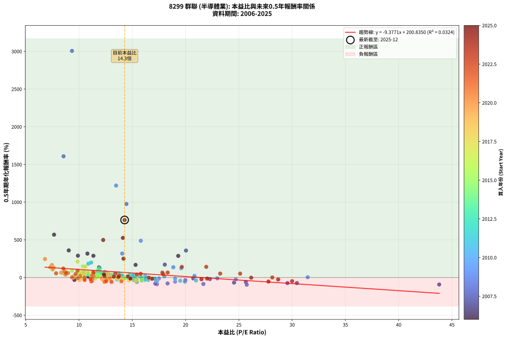
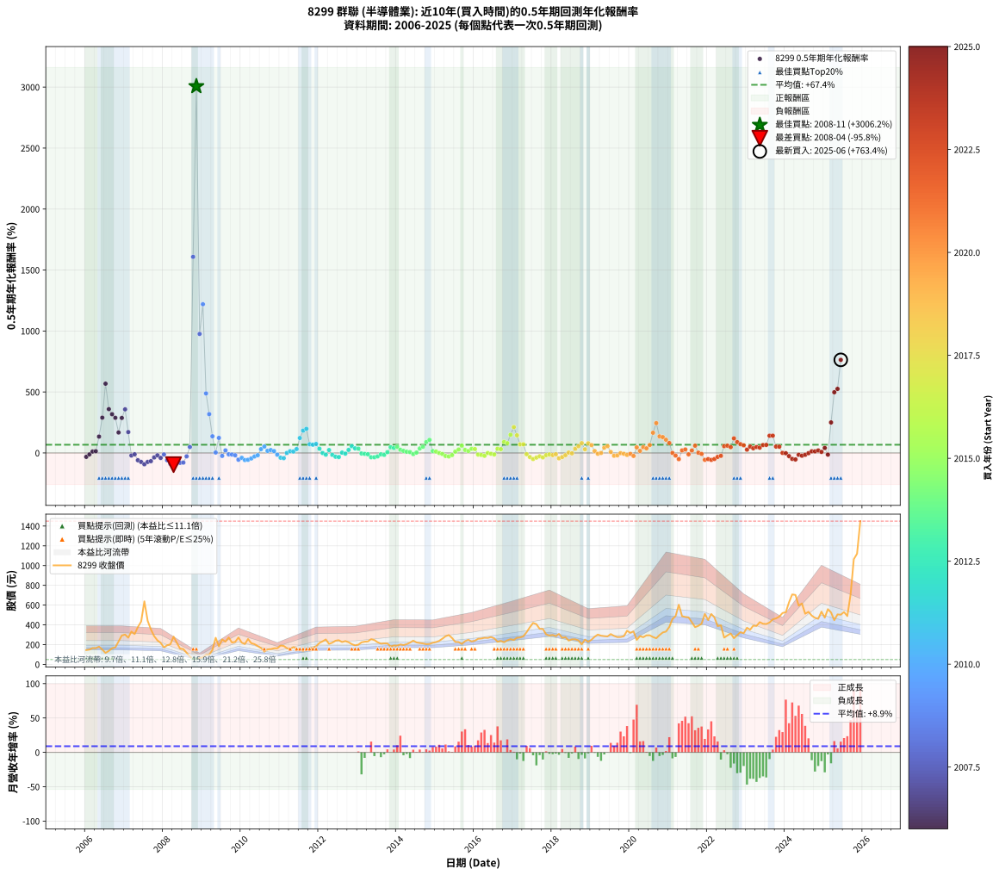

# 8299 群聯 - 本益比與未來報酬率分析

!!! info "報告資訊"
    - **股票代號**: 8299
    - **公司名稱**: 群聯
    - **產業別**: 半導體業
    - **分析期間**: 2006-2025 (234 個數據點)
    - **資料來源**: Type 12 (ShowMonthlyK_ChartFlow) 月收盤價與本益比
    - **報酬率口徑**: 含現金股利 (簡化: 年度合計，假設每年7/1入帳)
    - **報告生成時間**: 2026-01-05 21:22:49 CST

## 📈 視覺化圖表

### 圖表1: 本益比 vs 未來報酬率關係

*圖表1：8299 群聯 本益比與0.5年期未來報酬率關係 (2006-2025)*

### 圖表2: 歷年買入時點的0.5年期實際報酬率

*圖表2：8299 群聯 歷年買入時點的0.5年期實際報酬率 (2006-2025)*

## 📍 買點訊號說明

本報告提供兩種買點提示訊號（顯示於圖表2的股價子圖中）：

### ▲ 小綠色三角形（回測驗證）
- **計算方式**: 使用全部歷史資料計算本益比第25百分位數
- **用途**: 事後驗證，顯示歷史上哪些時點確實為低估區
- **限制**: 當下無法判斷，僅供回測參考
- **特性**: 後見之明（Look-Ahead Bias）

### ▲ 小橘色三角形（即時訊號）
- **計算方式**: 使用截至當月的過去5年資料計算本益比第25百分位數
- **用途**: 實際投資決策，當時即可判斷
- **優勢**: 可操作性強，符合實務需求
- **特性**: 無後見之明，滾動窗口計算

!!! tip "如何使用兩種訊號"
    - **綠色▲** 幫助理解歷史估值機會，驗證策略有效性
    - **橘色▲** 可作為實際買進參考，但仍需搭配基本面分析
    - 兩種訊號重疊時，表示即時判斷與事後驗證一致，信心度較高
    - 僅有綠色▲時，表示當時無法判斷（需要未來資料才能確認）
    - 僅有橘色▲時，表示即時判斷為買點，但事後可能不是最佳時機

## 📊 估值分析摘要

| 指標 | 數值 |
|:---:|:---:|
| **目前本益比** (2025-06) | **14.28 倍** |
| **歷史平均本益比** | 14.23 倍 |
| **估值水準** | 🟡 合理範圍 |
| **預期0.5年年化報酬率** | **+66.93%** |
| **歷史平均報酬率** | +67.39% |
| **相關係數 (R²)** | 0.0324 |
| **趨勢線斜率** | -9.3771 |

!!! abstract "核心洞察"
    目前本益比接近歷史平均，預期報酬率符合長期趨勢

    根據歷史數據回測，8299 群聯 在目前本益比 **14.3倍** 的估值水準下，
    預期未來0.5年年化報酬率約為 **+66.9%**。

    **重要提醒**: 本分析基於歷史數據統計，實際報酬率會受到公司基本面變化、產業趨勢、
    總體經濟環境等多重因素影響。R² = 0.03 表示本益比可解釋約 3.2% 的報酬率變異。

## 📈 歷史估值統計

### 最佳買點 (最高報酬率)

| 項目 | 數值 |
|:---:|:---:|
| 起始時間 | 2008-11 |
| 當時本益比 | 9.34 倍 |
| 起始價格 | 49.1 元 |
| 0.5年後價格 | 269.5 元 |
| **0.5年年化報酬率** | **+3006.22%** |

### 最差買點 (最低報酬率)

| 項目 | 數值 |
|:---:|:---:|
| 起始時間 | 2008-04 |
| 當時本益比 | 25.74 倍 |
| 起始價格 | 281.0 元 |
| 0.5年後價格 | 51.9 元 |
| **0.5年年化報酬率** | **-95.75%** |

## 🎯 投資啟示

### 本益比與報酬率關係

趨勢線方程式: **y = -9.3771x + 200.8350**

!!! warning "強負相關"
    本益比與未來報酬率呈現強負相關。在高本益比時期買入，未來報酬率顯著較低；
    在低本益比時期買入，未來報酬率顯著較高。**估值紀律至關重要**。

### 估值區間建議

基於歷史數據分析:

- **🟢 低估區** (P/E < 11.4): 預期報酬率較高，可考慮增加持股
- **🟡 合理區** (P/E 11.4-17.1): 預期報酬率符合長期趨勢，正常持有
- **🔴 高估區** (P/E > 17.1): 預期報酬率較低，可考慮減碼或觀望

!!! danger "風險提示"
    - 過去表現不代表未來結果
    - 本分析假設公司基本面無重大結構性變化
    - 產業環境劇變可能使歷史規律失效
    - 應結合公司財報、產業趨勢、總體經濟等多重因素綜合判斷

!!! success "長期投資觀點"
    歷史數據顯示，在合理或低估的估值水準買入並長期持有，
    往往能獲得較佳的投資報酬。**耐心等待好價格**是價值投資的核心原則。

## 📊 數據品質

- **資料來源**: GoodInfo.tw Type 12 (ShowMonthlyK_ChartFlow)
- **資料頻率**: 月度收盤價與本益比
- **回測期間**: 2006-2025
- **數據點數量**: 234 個 (每個點代表一次0.5年期回測)

### 計算方法說明

1. **0.5年期年化報酬率**:
   - 對每個歷史時點，計算其後0.5年的實際投資報酬率
   - 期末價值(不含股利): 期末價格
   - 期末價值(含現金股利): 期末價格 + 持有期間內的現金股利合計 (簡化: 年度合計，假設每年7/1入帳)
   - 公式: 年化報酬率 = [(期末價值/期初價格)^(1/年數) - 1] × 100%

2. **本益比 (P/E Ratio)**:
   - 使用當時的月收盤價與EPS計算
   - 資料來源: Type 12 月度河流圖本益比數據

3. **趨勢線 (Linear Regression)**:
   - 使用最小平方法擬合線性趨勢線
   - R²值衡量本益比對報酬率的解釋能力

---

*本報告由 Stock Analysis System v1.9.0 自動生成*
*數據更新時間: 2026-01-05 21:22:49 CST*

## 📋 月度回測明細表

（每一列對應時間線圖中的一個買入點；可用來對照 SVG 圖上的每個點。）

| 買入月份 | 賣出月份 | 回測期限_年 | 實際持有年數 | 買入本益比_倍 | 買入收盤價_元 | 賣出收盤價_元 | 現金股利合計_元 | 總報酬率_pct | 年化報酬率_pct |
| --- | --- | --- | --- | --- | --- | --- | --- | --- | --- |
| 2006-01 | 2006-07 | 0.5 | 0.496 | 9.57 | 145.00 | 116.00 | 3.98 | -17.26 | -31.77 |
| 2006-02 | 2006-08 | 0.5 | 0.498 | 9.90 | 150.00 | 137.00 | 3.98 | -6.02 | -11.71 |
| 2006-03 | 2006-10 | 0.5 | 0.586 | 10.89 | 165.00 | 172.00 | 3.98 | +6.65 | +11.62 |
| 2006-04 | 2006-10 | 0.5 | 0.501 | 10.86 | 164.50 | 172.00 | 3.98 | +6.98 | +14.41 |
| 2006-05 | 2006-12 | 0.5 | 0.586 | 11.88 | 180.00 | 292.50 | 3.98 | +64.71 | +134.36 |
| 2006-06 | 2006-12 | 0.5 | 0.501 | 9.90 | 150.00 | 292.50 | 3.98 | +97.65 | +289.57 |
| 2006-07 | 2007-01 | 0.5 | 0.504 | 7.66 | 116.00 | 302.00 | 0.00 | +160.34 | +568.17 |
| 2006-08 | 2007-03 | 0.5 | 0.580 | 9.04 | 137.00 | 332.00 | 0.00 | +142.34 | +359.52 |
| 2006-09 | 2007-03 | 0.5 | 0.496 | 10.79 | 163.50 | 332.00 | 0.00 | +103.06 | +317.60 |
| 2006-10 | 2007-05 | 0.5 | 0.580 | 11.35 | 172.00 | 378.00 | 0.00 | +119.77 | +288.29 |
| 2006-11 | 2007-05 | 0.5 | 0.496 | 15.31 | 232.00 | 378.00 | 0.00 | +62.93 | +167.80 |
| 2006-12 | 2007-07 | 0.5 | 0.580 | 19.31 | 292.50 | 638.00 | 3.79 | +119.42 | +287.22 |
| 2007-01 | 2007-07 | 0.5 | 0.496 | 20.04 | 302.00 | 638.00 | 3.79 | +112.51 | +357.77 |
| 2007-02 | 2007-08 | 0.5 | 0.498 | 18.05 | 270.50 | 441.00 | 3.79 | +64.43 | +171.31 |
| 2007-03 | 2007-10 | 0.5 | 0.586 | 22.28 | 332.00 | 286.00 | 3.79 | -12.71 | -20.71 |
| 2007-04 | 2007-10 | 0.5 | 0.501 | 20.72 | 307.00 | 286.00 | 3.79 | -5.61 | -10.88 |
| 2007-05 | 2007-12 | 0.5 | 0.586 | 25.66 | 378.00 | 218.00 | 3.79 | -41.33 | -59.75 |
| 2007-06 | 2007-12 | 0.5 | 0.501 | 29.56 | 433.00 | 218.00 | 3.79 | -48.78 | -73.69 |
| 2007-07 | 2008-01 | 0.5 | 0.504 | 43.80 | 638.00 | 172.00 | 0.00 | -73.04 | -92.59 |
| 2007-08 | 2008-03 | 0.5 | 0.583 | 30.45 | 441.00 | 203.00 | 0.00 | -53.97 | -73.56 |
| 2007-09 | 2008-03 | 0.5 | 0.498 | 24.55 | 353.50 | 203.00 | 0.00 | -42.57 | -67.15 |
| 2007-10 | 2008-05 | 0.5 | 0.583 | 19.98 | 286.00 | 219.00 | 0.00 | -23.43 | -36.73 |
| 2007-11 | 2008-05 | 0.5 | 0.498 | 17.11 | 243.50 | 219.00 | 0.00 | -10.06 | -19.17 |
| 2007-12 | 2008-07 | 0.5 | 0.583 | 15.41 | 218.00 | 155.50 | 5.81 | -26.01 | -40.34 |
| 2008-01 | 2008-07 | 0.5 | 0.498 | 12.89 | 172.00 | 155.50 | 5.81 | -6.22 | -12.08 |
| 2008-02 | 2008-08 | 0.5 | 0.501 | 15.44 | 193.50 | 117.50 | 5.81 | -36.27 | -59.32 |
| 2008-03 | 2008-10 | 0.5 | 0.586 | 17.31 | 203.00 | 51.90 | 5.81 | -71.57 | -88.31 |
| 2008-04 | 2008-10 | 0.5 | 0.501 | 25.74 | 281.00 | 51.90 | 5.81 | -79.46 | -95.75 |
| 2008-05 | 2008-12 | 0.5 | 0.586 | 21.67 | 219.00 | 64.30 | 5.81 | -67.99 | -85.69 |
| 2008-06 | 2008-12 | 0.5 | 0.501 | 17.15 | 159.50 | 64.30 | 5.81 | -56.04 | -80.61 |
| 2008-07 | 2009-01 | 0.5 | 0.504 | 18.31 | 155.50 | 71.10 | 0.00 | -54.28 | -78.85 |
| 2008-08 | 2009-03 | 0.5 | 0.580 | 15.29 | 117.50 | 97.20 | 0.00 | -17.28 | -27.88 |
| 2008-09 | 2009-03 | 0.5 | 0.496 | 11.61 | 79.80 | 97.20 | 0.00 | +21.80 | +48.89 |
| 2008-10 | 2009-05 | 0.5 | 0.580 | 8.55 | 51.90 | 269.50 | 0.00 | +419.27 | +1608.17 |
| 2008-11 | 2009-05 | 0.5 | 0.496 | 9.34 | 49.10 | 269.50 | 0.00 | +448.88 | +3006.22 |
| 2008-12 | 2009-07 | 0.5 | 0.580 | 14.45 | 64.30 | 252.50 | 2.83 | +297.10 | +976.04 |
| 2009-01 | 2009-07 | 0.5 | 0.496 | 13.48 | 71.10 | 252.50 | 2.83 | +259.12 | +1219.62 |
| 2009-02 | 2009-08 | 0.5 | 0.498 | 15.80 | 96.30 | 230.00 | 2.83 | +141.78 | +488.13 |
| 2009-03 | 2009-10 | 0.5 | 0.586 | 14.05 | 97.20 | 222.00 | 2.83 | +131.31 | +318.41 |
| 2009-04 | 2009-10 | 0.5 | 0.501 | 18.85 | 146.00 | 222.00 | 2.83 | +54.00 | +136.73 |
| 2009-05 | 2009-12 | 0.5 | 0.586 | 31.46 | 269.50 | 272.50 | 2.83 | +2.16 | +3.72 |
| 2009-06 | 2009-12 | 0.5 | 0.501 | 19.60 | 184.00 | 272.50 | 2.83 | +49.64 | +123.55 |
| 2009-07 | 2010-01 | 0.5 | 0.504 | 24.72 | 252.50 | 220.00 | 0.00 | -12.87 | -23.93 |
| 2009-08 | 2010-03 | 0.5 | 0.580 | 20.84 | 230.00 | 257.00 | 0.00 | +11.74 | +21.07 |
| 2009-09 | 2010-03 | 0.5 | 0.496 | 22.98 | 272.50 | 257.00 | 0.00 | -5.69 | -11.15 |
| 2009-10 | 2010-05 | 0.5 | 0.580 | 17.50 | 222.00 | 205.00 | 0.00 | -7.66 | -12.83 |
| 2009-11 | 2010-05 | 0.5 | 0.496 | 16.84 | 227.50 | 205.00 | 0.00 | -9.89 | -18.95 |
| 2009-12 | 2010-07 | 0.5 | 0.580 | 19.02 | 272.50 | 166.00 | 5.00 | -37.25 | -55.19 |
| 2010-01 | 2010-07 | 0.5 | 0.496 | 15.88 | 220.00 | 166.00 | 5.00 | -22.27 | -39.86 |
| 2010-02 | 2010-08 | 0.5 | 0.498 | 15.41 | 206.00 | 128.50 | 5.00 | -35.19 | -58.13 |
| 2010-03 | 2010-10 | 0.5 | 0.586 | 19.94 | 257.00 | 154.50 | 5.00 | -37.94 | -55.70 |
| 2010-04 | 2010-10 | 0.5 | 0.501 | 17.32 | 215.00 | 154.50 | 5.00 | -25.81 | -44.90 |
| 2010-05 | 2010-12 | 0.5 | 0.586 | 17.18 | 205.00 | 163.00 | 5.00 | -18.05 | -28.80 |
| 2010-06 | 2010-12 | 0.5 | 0.501 | 16.24 | 186.00 | 163.00 | 5.00 | -9.68 | -18.39 |
| 2010-07 | 2011-01 | 0.5 | 0.504 | 15.13 | 166.00 | 190.50 | 0.00 | +14.76 | +31.43 |
| 2010-08 | 2011-03 | 0.5 | 0.580 | 12.25 | 128.50 | 164.50 | 0.00 | +28.02 | +53.04 |
| 2010-09 | 2011-03 | 0.5 | 0.496 | 15.18 | 152.00 | 164.50 | 0.00 | +8.22 | +17.29 |
| 2010-10 | 2011-05 | 0.5 | 0.580 | 16.21 | 154.50 | 175.00 | 0.00 | +13.27 | +23.94 |
| 2010-11 | 2011-05 | 0.5 | 0.496 | 18.01 | 163.00 | 175.00 | 0.00 | +7.36 | +15.41 |
| 2010-12 | 2011-07 | 0.5 | 0.580 | 19.02 | 163.00 | 145.00 | 4.34 | -8.38 | -13.99 |
| 2011-01 | 2011-07 | 0.5 | 0.496 | 20.98 | 190.50 | 145.00 | 4.34 | -21.60 | -38.81 |
| 2011-02 | 2011-08 | 0.5 | 0.498 | 19.50 | 187.00 | 137.50 | 4.34 | -24.15 | -42.57 |
| 2011-03 | 2011-10 | 0.5 | 0.586 | 16.29 | 164.50 | 160.50 | 4.34 | +0.21 | +0.36 |
| 2011-04 | 2011-10 | 0.5 | 0.501 | 14.52 | 154.00 | 160.50 | 4.34 | +7.04 | +14.55 |
| 2011-05 | 2011-12 | 0.5 | 0.586 | 15.74 | 175.00 | 182.50 | 4.34 | +6.77 | +11.83 |
| 2011-06 | 2011-12 | 0.5 | 0.501 | 13.98 | 162.50 | 182.50 | 4.34 | +14.98 | +32.13 |
| 2011-07 | 2012-01 | 0.5 | 0.504 | 11.95 | 145.00 | 217.00 | 0.00 | +49.66 | +122.62 |
| 2011-08 | 2012-03 | 0.5 | 0.583 | 10.88 | 137.50 | 252.50 | 0.00 | +83.64 | +183.55 |
| 2011-09 | 2012-03 | 0.5 | 0.498 | 11.14 | 146.50 | 252.50 | 0.00 | +72.35 | +198.18 |
| 2011-10 | 2012-05 | 0.5 | 0.583 | 11.75 | 160.50 | 220.00 | 0.00 | +37.07 | +71.73 |
| 2011-11 | 2012-05 | 0.5 | 0.498 | 12.00 | 170.00 | 220.00 | 0.00 | +29.41 | +67.77 |
| 2011-12 | 2012-07 | 0.5 | 0.583 | 12.43 | 182.50 | 245.00 | 7.00 | +38.08 | +73.90 |
| 2012-01 | 2012-07 | 0.5 | 0.498 | 14.76 | 217.00 | 245.00 | 7.00 | +16.13 | +34.99 |
| 2012-02 | 2012-08 | 0.5 | 0.501 | 15.85 | 233.50 | 226.00 | 7.00 | -0.22 | -0.43 |
| 2012-03 | 2012-10 | 0.5 | 0.586 | 17.11 | 252.50 | 224.50 | 7.00 | -8.32 | -13.78 |
| 2012-04 | 2012-10 | 0.5 | 0.501 | 14.07 | 208.00 | 224.50 | 7.00 | +11.30 | +23.81 |
| 2012-05 | 2012-12 | 0.5 | 0.586 | 14.86 | 220.00 | 192.50 | 7.00 | -9.32 | -15.38 |
| 2012-06 | 2012-12 | 0.5 | 0.501 | 16.18 | 240.00 | 192.50 | 7.00 | -16.88 | -30.85 |
| 2012-07 | 2013-01 | 0.5 | 0.504 | 16.49 | 245.00 | 199.50 | 0.00 | -18.57 | -33.49 |
| 2012-08 | 2013-03 | 0.5 | 0.580 | 15.18 | 226.00 | 230.00 | 0.00 | +1.77 | +3.07 |
| 2012-09 | 2013-03 | 0.5 | 0.496 | 15.86 | 236.50 | 230.00 | 0.00 | -2.75 | -5.47 |
| 2012-10 | 2013-05 | 0.5 | 0.580 | 15.03 | 224.50 | 255.50 | 0.00 | +13.81 | +24.96 |
| 2012-11 | 2013-05 | 0.5 | 0.496 | 13.70 | 205.00 | 255.50 | 0.00 | +24.63 | +55.95 |
| 2012-12 | 2013-07 | 0.5 | 0.580 | 12.84 | 192.50 | 224.00 | 8.00 | +20.52 | +37.93 |
| 2013-01 | 2013-07 | 0.5 | 0.496 | 13.12 | 199.50 | 224.00 | 8.00 | +16.29 | +35.60 |
| 2013-02 | 2013-08 | 0.5 | 0.498 | 14.46 | 223.00 | 210.00 | 8.00 | -2.24 | -4.45 |
| 2013-03 | 2013-10 | 0.5 | 0.586 | 14.71 | 230.00 | 212.00 | 8.00 | -4.35 | -7.31 |
| 2013-04 | 2013-10 | 0.5 | 0.501 | 14.67 | 232.50 | 212.00 | 8.00 | -5.38 | -10.44 |
| 2013-05 | 2013-12 | 0.5 | 0.586 | 15.90 | 255.50 | 190.50 | 8.00 | -22.31 | -35.00 |
| 2013-06 | 2013-12 | 0.5 | 0.501 | 15.14 | 246.50 | 190.50 | 8.00 | -19.47 | -35.10 |
| 2013-07 | 2014-01 | 0.5 | 0.504 | 13.58 | 224.00 | 190.00 | 0.00 | -15.18 | -27.88 |
| 2013-08 | 2014-03 | 0.5 | 0.580 | 12.57 | 210.00 | 196.00 | 0.00 | -6.67 | -11.21 |
| 2013-09 | 2014-03 | 0.5 | 0.496 | 12.58 | 213.00 | 196.00 | 0.00 | -7.98 | -15.45 |
| 2013-10 | 2014-05 | 0.5 | 0.580 | 12.37 | 212.00 | 220.00 | 0.00 | +3.77 | +6.59 |
| 2013-11 | 2014-05 | 0.5 | 0.496 | 10.46 | 181.50 | 220.00 | 0.00 | +21.21 | +47.43 |
| 2013-12 | 2014-07 | 0.5 | 0.580 | 10.84 | 190.50 | 222.50 | 10.22 | +22.16 | +41.18 |
| 2014-01 | 2014-07 | 0.5 | 0.496 | 10.82 | 190.00 | 222.50 | 10.22 | +22.48 | +50.57 |
| 2014-02 | 2014-08 | 0.5 | 0.498 | 11.51 | 202.00 | 216.50 | 10.22 | +12.24 | +26.07 |
| 2014-03 | 2014-10 | 0.5 | 0.586 | 11.17 | 196.00 | 205.00 | 10.22 | +9.81 | +17.31 |
| 2014-04 | 2014-10 | 0.5 | 0.501 | 11.69 | 205.00 | 205.00 | 10.22 | +4.99 | +10.20 |
| 2014-05 | 2014-12 | 0.5 | 0.586 | 12.55 | 220.00 | 219.00 | 10.22 | +4.19 | +7.26 |
| 2014-06 | 2014-12 | 0.5 | 0.501 | 13.72 | 240.50 | 219.00 | 10.22 | -4.69 | -9.14 |
| 2014-07 | 2015-01 | 0.5 | 0.504 | 12.70 | 222.50 | 226.00 | 0.00 | +1.57 | +3.15 |
| 2014-08 | 2015-03 | 0.5 | 0.580 | 12.36 | 216.50 | 260.00 | 0.00 | +20.09 | +37.09 |
| 2014-09 | 2015-03 | 0.5 | 0.496 | 12.11 | 212.00 | 260.00 | 0.00 | +22.64 | +50.96 |
| 2014-10 | 2015-05 | 0.5 | 0.580 | 11.72 | 205.00 | 297.00 | 0.00 | +44.88 | +89.40 |
| 2014-11 | 2015-05 | 0.5 | 0.496 | 11.84 | 207.00 | 297.00 | 0.00 | +43.48 | +107.20 |
| 2014-12 | 2015-07 | 0.5 | 0.580 | 12.53 | 219.00 | 227.50 | 11.20 | +9.00 | +16.00 |
| 2015-01 | 2015-07 | 0.5 | 0.496 | 12.75 | 226.00 | 227.50 | 11.20 | +5.62 | +11.66 |
| 2015-02 | 2015-08 | 0.5 | 0.498 | 13.25 | 238.00 | 226.50 | 11.20 | -0.13 | -0.25 |
| 2015-03 | 2015-10 | 0.5 | 0.586 | 14.28 | 260.00 | 235.50 | 11.20 | -5.12 | -8.57 |
| 2015-04 | 2015-10 | 0.5 | 0.501 | 15.41 | 284.50 | 235.50 | 11.20 | -13.29 | -24.76 |
| 2015-05 | 2015-12 | 0.5 | 0.586 | 15.88 | 297.00 | 232.50 | 11.20 | -17.95 | -28.65 |
| 2015-06 | 2015-12 | 0.5 | 0.501 | 14.12 | 267.50 | 232.50 | 11.20 | -8.90 | -16.97 |
| 2015-07 | 2016-01 | 0.5 | 0.504 | 11.86 | 227.50 | 240.00 | 0.00 | +5.49 | +11.20 |
| 2015-08 | 2016-03 | 0.5 | 0.583 | 11.66 | 226.50 | 262.00 | 0.00 | +15.67 | +28.36 |
| 2015-09 | 2016-03 | 0.5 | 0.498 | 10.52 | 207.00 | 262.00 | 0.00 | +26.57 | +60.46 |
| 2015-10 | 2016-05 | 0.5 | 0.583 | 11.82 | 235.50 | 268.00 | 0.00 | +13.80 | +24.82 |
| 2015-11 | 2016-05 | 0.5 | 0.498 | 12.35 | 249.00 | 268.00 | 0.00 | +7.63 | +15.90 |
| 2015-12 | 2016-07 | 0.5 | 0.583 | 11.39 | 232.50 | 264.00 | 12.00 | +18.71 | +34.19 |
| 2016-01 | 2016-07 | 0.5 | 0.498 | 11.56 | 240.00 | 264.00 | 12.00 | +15.00 | +32.38 |
| 2016-02 | 2016-08 | 0.5 | 0.501 | 12.26 | 259.00 | 229.50 | 12.00 | -6.76 | -13.03 |
| 2016-03 | 2016-10 | 0.5 | 0.586 | 12.20 | 262.00 | 224.00 | 12.00 | -9.92 | -16.34 |
| 2016-04 | 2016-10 | 0.5 | 0.501 | 12.35 | 269.50 | 224.00 | 12.00 | -12.43 | -23.27 |
| 2016-05 | 2016-12 | 0.5 | 0.586 | 12.08 | 268.00 | 255.50 | 12.00 | -0.19 | -0.32 |
| 2016-06 | 2016-12 | 0.5 | 0.501 | 12.29 | 277.00 | 255.50 | 12.00 | -3.43 | -6.73 |
| 2016-07 | 2017-01 | 0.5 | 0.504 | 11.53 | 264.00 | 247.00 | 0.00 | -6.44 | -12.38 |
| 2016-08 | 2017-03 | 0.5 | 0.580 | 9.87 | 229.50 | 272.50 | 0.00 | +18.74 | +34.43 |
| 2016-09 | 2017-03 | 0.5 | 0.496 | 10.08 | 238.00 | 272.50 | 0.00 | +14.50 | +31.41 |
| 2016-10 | 2017-05 | 0.5 | 0.580 | 9.35 | 224.00 | 326.00 | 0.00 | +45.54 | +90.89 |
| 2016-11 | 2017-05 | 0.5 | 0.496 | 10.01 | 243.50 | 326.00 | 0.00 | +33.88 | +80.18 |
| 2016-12 | 2017-07 | 0.5 | 0.580 | 10.36 | 255.50 | 420.00 | 14.00 | +69.86 | +149.13 |
| 2017-01 | 2017-07 | 0.5 | 0.496 | 9.86 | 247.00 | 420.00 | 14.00 | +75.71 | +211.88 |
| 2017-02 | 2017-08 | 0.5 | 0.498 | 10.60 | 269.50 | 407.00 | 14.00 | +56.22 | +144.78 |
| 2017-03 | 2017-10 | 0.5 | 0.586 | 10.56 | 272.50 | 358.50 | 14.00 | +36.70 | +70.49 |
| 2017-04 | 2017-10 | 0.5 | 0.501 | 10.86 | 284.50 | 358.50 | 14.00 | +30.93 | +71.24 |
| 2017-05 | 2017-12 | 0.5 | 0.586 | 12.27 | 326.00 | 292.00 | 14.00 | -6.13 | -10.24 |
| 2017-06 | 2017-12 | 0.5 | 0.501 | 13.93 | 375.50 | 292.00 | 14.00 | -18.51 | -33.54 |
| 2017-07 | 2018-01 | 0.5 | 0.504 | 15.37 | 420.00 | 298.00 | 0.00 | -29.05 | -49.40 |
| 2017-08 | 2018-03 | 0.5 | 0.580 | 14.69 | 407.00 | 308.50 | 0.00 | -24.20 | -37.96 |
| 2017-09 | 2018-03 | 0.5 | 0.496 | 12.82 | 360.00 | 308.50 | 0.00 | -14.31 | -26.77 |
| 2017-10 | 2018-05 | 0.5 | 0.580 | 12.59 | 358.50 | 275.50 | 0.00 | -23.15 | -36.47 |
| 2017-11 | 2018-05 | 0.5 | 0.496 | 10.54 | 304.00 | 275.50 | 0.00 | -9.38 | -18.02 |
| 2017-12 | 2018-07 | 0.5 | 0.580 | 9.99 | 292.00 | 254.00 | 17.00 | -7.19 | -12.07 |
| 2018-01 | 2018-07 | 0.5 | 0.496 | 10.41 | 298.00 | 254.00 | 17.00 | -9.06 | -17.44 |
| 2018-02 | 2018-08 | 0.5 | 0.498 | 10.21 | 286.00 | 254.00 | 17.00 | -5.24 | -10.25 |
| 2018-03 | 2018-10 | 0.5 | 0.586 | 11.26 | 308.50 | 203.00 | 17.00 | -28.69 | -43.84 |
| 2018-04 | 2018-10 | 0.5 | 0.501 | 10.06 | 269.50 | 203.00 | 17.00 | -18.37 | -33.31 |
| 2018-05 | 2018-12 | 0.5 | 0.586 | 10.52 | 275.50 | 228.00 | 17.00 | -11.07 | -18.15 |
| 2018-06 | 2018-12 | 0.5 | 0.501 | 9.43 | 241.00 | 228.00 | 17.00 | +1.66 | +3.34 |
| 2018-07 | 2019-01 | 0.5 | 0.504 | 10.18 | 254.00 | 250.00 | 0.00 | -1.57 | -3.10 |
| 2018-08 | 2019-03 | 0.5 | 0.580 | 10.43 | 254.00 | 302.00 | 0.00 | +18.90 | +34.75 |
| 2018-09 | 2019-03 | 0.5 | 0.496 | 10.24 | 243.00 | 302.00 | 0.00 | +24.28 | +55.06 |
| 2018-10 | 2019-05 | 0.5 | 0.580 | 8.78 | 203.00 | 286.00 | 0.00 | +40.89 | +80.50 |
| 2018-11 | 2019-05 | 0.5 | 0.496 | 11.15 | 251.00 | 286.00 | 0.00 | +13.94 | +30.14 |
| 2018-12 | 2019-07 | 0.5 | 0.580 | 10.41 | 228.00 | 307.00 | 13.00 | +40.35 | +79.32 |
| 2019-01 | 2019-07 | 0.5 | 0.496 | 11.36 | 250.00 | 307.00 | 13.00 | +28.00 | +64.57 |
| 2019-02 | 2019-08 | 0.5 | 0.498 | 12.67 | 280.00 | 288.50 | 13.00 | +7.68 | +16.01 |
| 2019-03 | 2019-10 | 0.5 | 0.586 | 13.61 | 302.00 | 277.50 | 13.00 | -3.81 | -6.41 |
| 2019-04 | 2019-10 | 0.5 | 0.501 | 13.03 | 290.50 | 277.50 | 13.00 | +0.00 | +0.00 |
| 2019-05 | 2019-12 | 0.5 | 0.586 | 12.78 | 286.00 | 340.50 | 13.00 | +23.60 | +43.57 |
| 2019-06 | 2019-12 | 0.5 | 0.501 | 12.59 | 283.00 | 340.50 | 13.00 | +24.91 | +55.89 |
| 2019-07 | 2020-01 | 0.5 | 0.504 | 13.60 | 307.00 | 319.50 | 0.00 | +4.07 | +8.24 |
| 2019-08 | 2020-03 | 0.5 | 0.583 | 12.73 | 288.50 | 248.00 | 0.00 | -14.04 | -22.85 |
| 2019-09 | 2020-03 | 0.5 | 0.498 | 12.15 | 276.50 | 248.00 | 0.00 | -10.31 | -19.61 |
| 2019-10 | 2020-05 | 0.5 | 0.583 | 12.14 | 277.50 | 275.00 | 0.00 | -0.90 | -1.54 |
| 2019-11 | 2020-05 | 0.5 | 0.498 | 12.39 | 284.50 | 275.00 | 0.00 | -3.34 | -6.59 |
| 2019-12 | 2020-07 | 0.5 | 0.583 | 14.77 | 340.50 | 294.50 | 13.00 | -9.69 | -16.04 |
| 2020-01 | 2020-07 | 0.5 | 0.498 | 12.88 | 319.50 | 294.50 | 13.00 | -3.76 | -7.40 |
| 2020-02 | 2020-08 | 0.5 | 0.501 | 12.55 | 333.50 | 277.00 | 13.00 | -13.04 | -24.34 |
| 2020-03 | 2020-10 | 0.5 | 0.586 | 8.76 | 248.00 | 296.50 | 13.00 | +24.80 | +45.95 |
| 2020-04 | 2020-10 | 0.5 | 0.501 | 9.52 | 286.50 | 296.50 | 13.00 | +8.03 | +16.66 |
| 2020-05 | 2020-12 | 0.5 | 0.586 | 8.64 | 275.00 | 332.50 | 13.00 | +25.64 | +47.63 |
| 2020-06 | 2020-12 | 0.5 | 0.501 | 8.75 | 294.00 | 332.50 | 13.00 | +17.52 | +38.01 |
| 2020-07 | 2021-01 | 0.5 | 0.504 | 8.33 | 294.50 | 379.00 | 0.00 | +28.69 | +64.99 |
| 2020-08 | 2021-03 | 0.5 | 0.580 | 7.46 | 277.00 | 488.50 | 0.00 | +76.35 | +165.76 |
| 2020-09 | 2021-03 | 0.5 | 0.496 | 6.81 | 264.50 | 488.50 | 0.00 | +84.69 | +244.88 |
| 2020-10 | 2021-05 | 0.5 | 0.580 | 7.30 | 296.50 | 488.00 | 0.00 | +64.59 | +135.95 |
| 2020-11 | 2021-05 | 0.5 | 0.496 | 7.62 | 323.00 | 488.00 | 0.00 | +51.08 | +129.96 |
| 2020-12 | 2021-07 | 0.5 | 0.580 | 7.53 | 332.50 | 476.00 | 33.00 | +53.08 | +108.26 |
| 2021-01 | 2021-07 | 0.5 | 0.496 | 8.63 | 379.00 | 476.00 | 33.00 | +34.30 | +81.32 |
| 2021-02 | 2021-08 | 0.5 | 0.498 | 10.52 | 459.50 | 427.00 | 33.00 | +0.11 | +0.22 |
| 2021-03 | 2021-10 | 0.5 | 0.586 | 11.25 | 488.50 | 390.50 | 33.00 | -13.31 | -21.63 |
| 2021-04 | 2021-10 | 0.5 | 0.501 | 13.98 | 604.00 | 390.50 | 33.00 | -29.88 | -50.77 |
| 2021-05 | 2021-12 | 0.5 | 0.586 | 11.36 | 488.00 | 512.00 | 33.00 | +11.68 | +20.75 |
| 2021-06 | 2021-12 | 0.5 | 0.501 | 11.23 | 480.00 | 512.00 | 33.00 | +13.54 | +28.85 |
| 2021-07 | 2022-01 | 0.5 | 0.504 | 11.20 | 476.00 | 448.50 | 0.00 | -5.78 | -11.14 |
| 2021-08 | 2022-03 | 0.5 | 0.580 | 10.10 | 427.00 | 475.50 | 0.00 | +11.36 | +20.36 |
| 2021-09 | 2022-03 | 0.5 | 0.496 | 8.97 | 377.00 | 475.50 | 0.00 | +26.13 | +59.75 |
| 2021-10 | 2022-05 | 0.5 | 0.580 | 9.34 | 390.50 | 395.50 | 0.00 | +1.28 | +2.22 |
| 2021-11 | 2022-05 | 0.5 | 0.496 | 9.91 | 412.00 | 395.50 | 0.00 | -4.00 | -7.92 |
| 2021-12 | 2022-07 | 0.5 | 0.580 | 12.39 | 512.00 | 293.00 | 23.28 | -38.23 | -56.39 |
| 2022-01 | 2022-07 | 0.5 | 0.496 | 11.16 | 448.50 | 293.00 | 23.28 | -29.48 | -50.58 |
| 2022-02 | 2022-08 | 0.5 | 0.498 | 13.05 | 510.00 | 312.50 | 23.28 | -34.16 | -56.78 |
| 2022-03 | 2022-10 | 0.5 | 0.586 | 12.54 | 475.50 | 295.50 | 23.28 | -32.96 | -49.46 |
| 2022-04 | 2022-10 | 0.5 | 0.501 | 10.53 | 387.50 | 295.50 | 23.28 | -17.73 | -32.27 |
| 2022-05 | 2022-12 | 0.5 | 0.586 | 11.09 | 395.50 | 315.00 | 23.28 | -14.47 | -23.41 |
| 2022-06 | 2022-12 | 0.5 | 0.501 | 7.85 | 271.00 | 315.00 | 23.28 | +24.83 | +55.68 |
| 2022-07 | 2023-01 | 0.5 | 0.504 | 8.78 | 293.00 | 371.00 | 0.00 | +26.62 | +59.76 |
| 2022-08 | 2023-03 | 0.5 | 0.580 | 9.69 | 312.50 | 392.00 | 0.00 | +25.44 | +47.77 |
| 2022-09 | 2023-03 | 0.5 | 0.496 | 8.53 | 265.50 | 392.00 | 0.00 | +47.65 | +119.52 |
| 2022-10 | 2023-05 | 0.5 | 0.580 | 9.86 | 295.50 | 427.50 | 0.00 | +44.67 | +88.94 |
| 2022-11 | 2023-05 | 0.5 | 0.496 | 11.32 | 326.50 | 427.50 | 0.00 | +30.93 | +72.27 |
| 2022-12 | 2023-07 | 0.5 | 0.580 | 11.37 | 315.00 | 409.00 | 8.88 | +32.66 | +62.73 |
| 2023-01 | 2023-07 | 0.5 | 0.496 | 13.77 | 371.00 | 409.00 | 8.88 | +12.64 | +27.14 |
| 2023-02 | 2023-08 | 0.5 | 0.498 | 13.41 | 351.00 | 423.50 | 8.88 | +23.18 | +51.96 |
| 2023-03 | 2023-10 | 0.5 | 0.586 | 15.43 | 392.00 | 465.50 | 8.88 | +21.01 | +38.48 |
| 2023-04 | 2023-10 | 0.5 | 0.501 | 15.79 | 389.00 | 465.50 | 8.88 | +21.95 | +48.59 |
| 2023-05 | 2023-12 | 0.5 | 0.586 | 17.91 | 427.50 | 520.00 | 8.88 | +23.71 | +43.79 |
| 2023-06 | 2023-12 | 0.5 | 0.501 | 17.82 | 411.50 | 520.00 | 8.88 | +28.52 | +65.01 |
| 2023-07 | 2024-01 | 0.5 | 0.504 | 18.32 | 409.00 | 528.00 | 0.00 | +29.10 | +66.02 |
| 2023-08 | 2024-03 | 0.5 | 0.583 | 19.65 | 423.50 | 708.00 | 0.00 | +67.18 | +141.38 |
| 2023-09 | 2024-03 | 0.5 | 0.498 | 21.94 | 456.00 | 708.00 | 0.00 | +55.26 | +141.80 |
| 2023-10 | 2024-05 | 0.5 | 0.583 | 23.25 | 465.50 | 595.00 | 0.00 | +27.82 | +52.33 |
| 2023-11 | 2024-05 | 0.5 | 0.498 | 25.12 | 483.50 | 595.00 | 0.00 | +23.06 | +51.66 |
| 2023-12 | 2024-07 | 0.5 | 0.583 | 28.14 | 520.00 | 513.00 | 8.66 | +0.32 | +0.55 |
| 2024-01 | 2024-07 | 0.5 | 0.498 | 26.16 | 528.00 | 513.00 | 8.66 | -1.20 | -2.40 |
| 2024-02 | 2024-08 | 0.5 | 0.501 | 28.69 | 628.00 | 532.00 | 8.66 | -13.91 | -25.84 |
| 2024-03 | 2024-10 | 0.5 | 0.586 | 30.00 | 708.00 | 471.50 | 8.66 | -32.18 | -48.46 |
| 2024-04 | 2024-10 | 0.5 | 0.501 | 27.78 | 703.00 | 471.50 | 8.66 | -31.70 | -53.28 |
| 2024-05 | 2024-12 | 0.5 | 0.586 | 22.03 | 595.00 | 534.00 | 8.66 | -8.80 | -14.54 |
| 2024-06 | 2024-12 | 0.5 | 0.501 | 21.49 | 617.00 | 534.00 | 8.66 | -12.05 | -22.61 |
| 2024-07 | 2025-01 | 0.5 | 0.504 | 16.86 | 513.00 | 473.00 | 0.00 | -7.80 | -14.88 |
| 2024-08 | 2025-03 | 0.5 | 0.580 | 16.56 | 532.00 | 526.00 | 0.00 | -1.13 | -1.94 |
| 2024-09 | 2025-03 | 0.5 | 0.496 | 14.60 | 494.00 | 526.00 | 0.00 | +6.48 | +13.50 |
| 2024-10 | 2025-05 | 0.5 | 0.580 | 13.27 | 471.50 | 506.00 | 0.00 | +7.32 | +12.94 |
| 2024-11 | 2025-05 | 0.5 | 0.496 | 12.39 | 461.50 | 506.00 | 0.00 | +9.64 | +20.41 |
| 2024-12 | 2025-07 | 0.5 | 0.580 | 13.71 | 534.00 | 530.00 | 31.31 | +5.11 | +8.97 |
| 2025-01 | 2025-07 | 0.5 | 0.496 | 12.34 | 473.00 | 530.00 | 31.31 | +18.67 | +41.26 |
| 2025-02 | 2025-08 | 0.5 | 0.498 | 14.83 | 559.00 | 489.00 | 31.31 | -6.92 | -13.41 |
| 2025-03 | 2025-10 | 0.5 | 0.586 | 14.18 | 526.00 | 1065.00 | 31.31 | +108.42 | +250.25 |
| 2025-04 | 2025-10 | 0.5 | 0.501 | 12.27 | 447.50 | 1065.00 | 31.31 | +144.99 | +497.98 |
| 2025-05 | 2025-12 | 0.5 | 0.586 | 14.12 | 506.00 | 1450.00 | 31.31 | +192.75 | +525.47 |
| 2025-06 | 2025-12 | 0.5 | 0.501 | 14.28 | 503.00 | 1450.00 | 31.31 | +194.50 | +763.44 |
