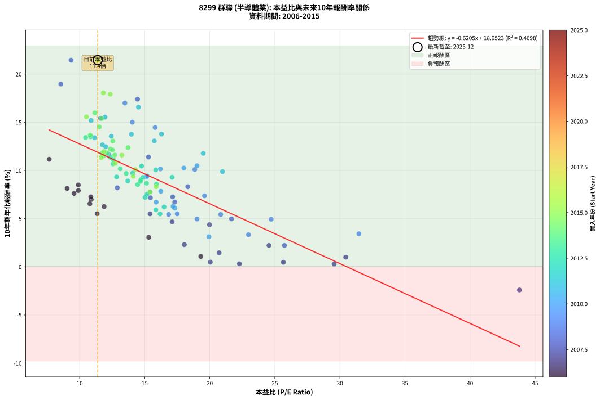
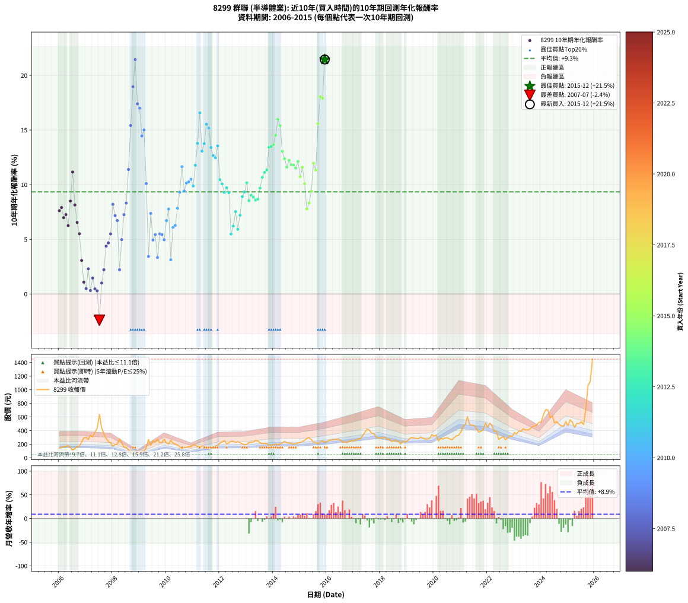

# 8299 群聯 - 本益比與未來報酬率分析

!!! info "報告資訊"
    - **股票代號**: 8299
    - **公司名稱**: 群聯
    - **產業別**: 半導體業
    - **分析期間**: 2006-2015 (120 個數據點)
    - **資料來源**: Type 12 (ShowMonthlyK_ChartFlow) 月收盤價與本益比
    - **報酬率口徑**: 含現金股利 (簡化: 年度合計，假設每年7/1入帳)
    - **報告生成時間**: 2026-01-10 19:15:52 CST

## 📈 視覺化圖表

### 圖表1: 本益比 vs 未來報酬率關係

*圖表1：8299 群聯 本益比與10年期未來報酬率關係 (2006-2015)*

### 圖表2: 歷年買入時點的10年期實際報酬率

*圖表2：8299 群聯 歷年買入時點的10年期實際報酬率 (2006-2015)*

## 📍 買點訊號說明

本報告提供兩種買點提示訊號（顯示於圖表2的股價子圖中）：

### ▲ 小綠色三角形（回測驗證）
- **計算方式**: 使用全部歷史資料計算本益比第25百分位數
- **用途**: 事後驗證，顯示歷史上哪些時點確實為低估區
- **限制**: 當下無法判斷，僅供回測參考
- **特性**: 後見之明（Look-Ahead Bias）

### ▲ 小橘色三角形（即時訊號）
- **計算方式**: 使用截至當月的過去5年資料計算本益比第25百分位數
- **用途**: 實際投資決策，當時即可判斷
- **優勢**: 可操作性強，符合實務需求
- **特性**: 無後見之明，滾動窗口計算

!!! tip "如何使用兩種訊號"
    - **綠色▲** 幫助理解歷史估值機會，驗證策略有效性
    - **橘色▲** 可作為實際買進參考，但仍需搭配基本面分析
    - 兩種訊號重疊時，表示即時判斷與事後驗證一致，信心度較高
    - 僅有綠色▲時，表示當時無法判斷（需要未來資料才能確認）
    - 僅有橘色▲時，表示即時判斷為買點，但事後可能不是最佳時機

## 📊 估值分析摘要

| 指標 | 數值 |
|:---:|:---:|
| **目前本益比** (2015-12) | **11.39 倍** |
| **歷史平均本益比** | 15.49 倍 |
| **估值水準** | 🟢 相對低估 |
| **預期10年年化報酬率** | **+11.88%** |
| **歷史平均報酬率** | +9.34% |
| **相關係數 (R²)** | 0.4698 |
| **趨勢線斜率** | -0.6205 |

!!! abstract "核心洞察"
    目前本益比顯著低於歷史平均，預期未來報酬率可能較高

    根據歷史數據回測，8299 群聯 在目前本益比 **11.4倍** 的估值水準下，
    預期未來10年年化報酬率約為 **+11.9%**。

    **重要提醒**: 本分析基於歷史數據統計，實際報酬率會受到公司基本面變化、產業趨勢、
    總體經濟環境等多重因素影響。R² = 0.47 表示本益比可解釋約 47.0% 的報酬率變異。

## 📈 歷史估值統計

### 最佳買點 (最高報酬率)

| 項目 | 數值 |
|:---:|:---:|
| 起始時間 | 2015-12 |
| 當時本益比 | 11.39 倍 |
| 起始價格 | 232.5 元 |
| 10年後價格 | 1450.0 元 |
| **10年年化報酬率** | **+21.45%** |

### 最差買點 (最低報酬率)

| 項目 | 數值 |
|:---:|:---:|
| 起始時間 | 2007-07 |
| 當時本益比 | 43.80 倍 |
| 起始價格 | 638.0 元 |
| 10年後價格 | 420.0 元 |
| **10年年化報酬率** | **-2.40%** |

## 🎯 投資啟示

### 本益比與報酬率關係

趨勢線方程式: **y = -0.6205x + 18.9523**

!!! warning "強負相關"
    本益比與未來報酬率呈現強負相關。在高本益比時期買入，未來報酬率顯著較低；
    在低本益比時期買入，未來報酬率顯著較高。**估值紀律至關重要**。

### 估值區間建議

基於歷史數據分析:

- **🟢 低估區** (P/E < 12.4): 預期報酬率較高，可考慮增加持股
- **🟡 合理區** (P/E 12.4-18.6): 預期報酬率符合長期趨勢，正常持有
- **🔴 高估區** (P/E > 18.6): 預期報酬率較低，可考慮減碼或觀望

!!! danger "風險提示"
    - 過去表現不代表未來結果
    - 本分析假設公司基本面無重大結構性變化
    - 產業環境劇變可能使歷史規律失效
    - 應結合公司財報、產業趨勢、總體經濟等多重因素綜合判斷

!!! success "長期投資觀點"
    歷史數據顯示，在合理或低估的估值水準買入並長期持有，
    往往能獲得較佳的投資報酬。**耐心等待好價格**是價值投資的核心原則。

## 📊 數據品質

- **資料來源**: GoodInfo.tw Type 12 (ShowMonthlyK_ChartFlow)
- **資料頻率**: 月度收盤價與本益比
- **回測期間**: 2006-2015
- **數據點數量**: 120 個 (每個點代表一次10年期回測)

### 計算方法說明

1. **10年期年化報酬率**:
   - 對每個歷史時點，計算其後10年的實際投資報酬率
   - 期末價值(不含股利): 期末價格
   - 期末價值(含現金股利): 期末價格 + 持有期間內的現金股利合計 (簡化: 年度合計，假設每年7/1入帳)
   - 公式: 年化報酬率 = [(期末價值/期初價格)^(1/年數) - 1] × 100%

2. **本益比 (P/E Ratio)**:
   - 使用當時的月收盤價與EPS計算
   - 資料來源: Type 12 月度河流圖本益比數據

3. **趨勢線 (Linear Regression)**:
   - 使用最小平方法擬合線性趨勢線
   - R²值衡量本益比對報酬率的解釋能力

---

*本報告由 Stock Analysis System v1.9.0 自動生成*
*數據更新時間: 2026-01-10 19:15:52 CST*

## 📋 月度回測明細表

（每一列對應時間線圖中的一個買入點；可用來對照 SVG 圖上的每個點。）

| 買入月份 | 賣出月份 | 回測期限_年 | 實際持有年數 | 買入本益比_倍 | 買入收盤價_元 | 賣出收盤價_元 | 現金股利合計_元 | 總報酬率_pct | 年化報酬率_pct |
| --- | --- | --- | --- | --- | --- | --- | --- | --- | --- |
| 2006-01 | 2016-01 | 10 | 9.999 | 9.57 | 145.00 | 240.00 | 62.17 | +108.39 | +7.62 |
| 2006-02 | 2016-02 | 10 | 9.999 | 9.90 | 150.00 | 259.00 | 62.17 | +114.11 | +7.91 |
| 2006-03 | 2016-03 | 10 | 10.001 | 10.89 | 165.00 | 262.00 | 62.17 | +96.47 | +6.99 |
| 2006-04 | 2016-04 | 10 | 10.001 | 10.86 | 164.50 | 269.50 | 62.17 | +101.62 | +7.26 |
| 2006-05 | 2016-05 | 10 | 10.001 | 11.88 | 180.00 | 268.00 | 62.17 | +83.43 | +6.25 |
| 2006-06 | 2016-06 | 10 | 10.001 | 9.90 | 150.00 | 277.00 | 62.17 | +126.11 | +8.50 |
| 2006-07 | 2016-07 | 10 | 10.001 | 7.66 | 116.00 | 264.00 | 70.19 | +188.10 | +11.16 |
| 2006-08 | 2016-08 | 10 | 10.001 | 9.04 | 137.00 | 229.50 | 70.19 | +118.75 | +8.14 |
| 2006-09 | 2016-09 | 10 | 10.001 | 10.79 | 163.50 | 238.00 | 70.19 | +88.50 | +6.54 |
| 2006-10 | 2016-10 | 10 | 10.001 | 11.35 | 172.00 | 224.00 | 70.19 | +71.04 | +5.51 |
| 2006-11 | 2016-11 | 10 | 10.001 | 15.31 | 232.00 | 243.50 | 70.19 | +35.21 | +3.06 |
| 2006-12 | 2016-12 | 10 | 10.001 | 19.31 | 292.50 | 255.50 | 70.19 | +11.35 | +1.08 |
| 2007-01 | 2017-01 | 10 | 10.001 | 20.04 | 302.00 | 247.00 | 70.19 | +5.03 | +0.49 |
| 2007-02 | 2017-02 | 10 | 10.001 | 18.05 | 270.50 | 269.50 | 70.19 | +25.58 | +2.30 |
| 2007-03 | 2017-03 | 10 | 10.001 | 22.28 | 332.00 | 272.50 | 70.19 | +3.22 | +0.32 |
| 2007-04 | 2017-04 | 10 | 10.001 | 20.72 | 307.00 | 284.50 | 70.19 | +15.54 | +1.45 |
| 2007-05 | 2017-05 | 10 | 10.001 | 25.66 | 378.00 | 326.00 | 70.19 | +4.81 | +0.47 |
| 2007-06 | 2017-06 | 10 | 10.001 | 29.56 | 433.00 | 375.50 | 70.19 | +2.93 | +0.29 |
| 2007-07 | 2017-07 | 10 | 10.001 | 43.80 | 638.00 | 420.00 | 80.40 | -21.57 | -2.40 |
| 2007-08 | 2017-08 | 10 | 10.001 | 30.45 | 441.00 | 407.00 | 80.40 | +10.52 | +1.01 |
| 2007-09 | 2017-09 | 10 | 10.001 | 24.55 | 353.50 | 360.00 | 80.40 | +24.58 | +2.22 |
| 2007-10 | 2017-10 | 10 | 10.001 | 19.98 | 286.00 | 358.50 | 80.40 | +53.46 | +4.38 |
| 2007-11 | 2017-11 | 10 | 10.001 | 17.11 | 243.50 | 304.00 | 80.40 | +57.87 | +4.67 |
| 2007-12 | 2017-12 | 10 | 10.001 | 15.41 | 218.00 | 292.00 | 80.40 | +70.83 | +5.50 |
| 2008-01 | 2018-01 | 10 | 10.001 | 12.89 | 172.00 | 298.00 | 80.40 | +120.00 | +8.20 |
| 2008-02 | 2018-03 | 10 | 10.081 | 15.44 | 193.50 | 308.50 | 80.40 | +100.98 | +7.17 |
| 2008-03 | 2018-03 | 10 | 9.999 | 17.31 | 203.00 | 308.50 | 80.40 | +91.58 | +6.72 |
| 2008-04 | 2018-04 | 10 | 9.999 | 25.74 | 281.00 | 269.50 | 80.40 | +24.52 | +2.22 |
| 2008-05 | 2018-05 | 10 | 9.999 | 21.67 | 219.00 | 275.50 | 80.40 | +62.51 | +4.98 |
| 2008-06 | 2018-06 | 10 | 9.999 | 17.15 | 159.50 | 241.00 | 80.40 | +101.51 | +7.26 |
| 2008-07 | 2018-07 | 10 | 9.999 | 18.31 | 155.50 | 254.00 | 91.59 | +122.25 | +8.31 |
| 2008-08 | 2018-08 | 10 | 9.999 | 15.29 | 117.50 | 254.00 | 91.59 | +194.12 | +11.39 |
| 2008-09 | 2018-09 | 10 | 9.999 | 11.61 | 79.80 | 243.00 | 91.59 | +319.29 | +15.41 |
| 2008-10 | 2018-10 | 10 | 9.999 | 8.55 | 51.90 | 203.00 | 91.59 | +467.62 | +18.96 |
| 2008-11 | 2018-11 | 10 | 9.999 | 9.34 | 49.10 | 251.00 | 91.59 | +597.75 | +21.45 |
| 2008-12 | 2018-12 | 10 | 9.999 | 14.45 | 64.30 | 228.00 | 91.59 | +397.04 | +17.39 |
| 2009-01 | 2019-01 | 10 | 9.999 | 13.48 | 71.10 | 250.00 | 91.59 | +380.44 | +17.00 |
| 2009-02 | 2019-02 | 10 | 9.999 | 15.80 | 96.30 | 280.00 | 91.59 | +285.87 | +14.46 |
| 2009-03 | 2019-03 | 10 | 9.999 | 14.05 | 97.20 | 302.00 | 91.59 | +304.93 | +15.01 |
| 2009-04 | 2019-04 | 10 | 9.999 | 18.85 | 146.00 | 290.50 | 91.59 | +161.71 | +10.10 |
| 2009-05 | 2019-05 | 10 | 9.999 | 31.46 | 269.50 | 286.00 | 91.59 | +40.11 | +3.43 |
| 2009-06 | 2019-06 | 10 | 9.999 | 19.60 | 184.00 | 283.00 | 91.59 | +103.58 | +7.37 |
| 2009-07 | 2019-07 | 10 | 9.999 | 24.72 | 252.50 | 307.00 | 101.76 | +61.89 | +4.94 |
| 2009-08 | 2019-08 | 10 | 9.999 | 20.84 | 230.00 | 288.50 | 101.76 | +69.68 | +5.43 |
| 2009-09 | 2019-09 | 10 | 9.999 | 22.98 | 272.50 | 276.50 | 101.76 | +38.81 | +3.33 |
| 2009-10 | 2019-10 | 10 | 9.999 | 17.50 | 222.00 | 277.50 | 101.76 | +70.84 | +5.50 |
| 2009-11 | 2019-11 | 10 | 9.999 | 16.84 | 227.50 | 284.50 | 101.76 | +69.78 | +5.44 |
| 2009-12 | 2019-12 | 10 | 9.999 | 19.02 | 272.50 | 340.50 | 101.76 | +62.30 | +4.96 |
| 2010-01 | 2020-01 | 10 | 9.999 | 15.88 | 220.00 | 319.50 | 101.76 | +91.48 | +6.71 |
| 2010-02 | 2020-02 | 10 | 9.999 | 15.41 | 206.00 | 333.50 | 101.76 | +111.29 | +7.77 |
| 2010-03 | 2020-03 | 10 | 10.001 | 19.94 | 257.00 | 248.00 | 101.76 | +36.09 | +3.13 |
| 2010-04 | 2020-04 | 10 | 10.001 | 17.32 | 215.00 | 286.50 | 101.76 | +80.59 | +6.09 |
| 2010-05 | 2020-05 | 10 | 10.001 | 17.18 | 205.00 | 275.00 | 101.76 | +83.79 | +6.27 |
| 2010-06 | 2020-06 | 10 | 10.001 | 16.24 | 186.00 | 294.00 | 101.76 | +112.77 | +7.84 |
| 2010-07 | 2020-07 | 10 | 10.001 | 15.13 | 166.00 | 294.50 | 109.76 | +143.53 | +9.31 |
| 2010-08 | 2020-08 | 10 | 10.001 | 12.25 | 128.50 | 277.00 | 109.76 | +200.98 | +11.65 |
| 2010-09 | 2020-09 | 10 | 10.001 | 15.18 | 152.00 | 264.50 | 109.76 | +146.22 | +9.43 |
| 2010-10 | 2020-10 | 10 | 10.001 | 16.21 | 154.50 | 296.50 | 109.76 | +162.95 | +10.15 |
| 2010-11 | 2020-11 | 10 | 10.001 | 18.01 | 163.00 | 323.00 | 109.76 | +165.50 | +10.26 |
| 2010-12 | 2020-12 | 10 | 10.001 | 19.02 | 163.00 | 332.50 | 109.76 | +171.33 | +10.50 |
| 2011-01 | 2021-01 | 10 | 10.001 | 20.98 | 190.50 | 379.00 | 109.76 | +156.57 | +9.88 |
| 2011-02 | 2021-02 | 10 | 10.001 | 19.50 | 187.00 | 459.50 | 109.76 | +204.42 | +11.77 |
| 2011-03 | 2021-03 | 10 | 10.001 | 16.29 | 164.50 | 488.50 | 109.76 | +263.68 | +13.78 |
| 2011-04 | 2021-04 | 10 | 10.001 | 14.52 | 154.00 | 604.00 | 109.76 | +363.48 | +16.57 |
| 2011-05 | 2021-05 | 10 | 10.001 | 15.74 | 175.00 | 488.00 | 109.76 | +241.58 | +13.07 |
| 2011-06 | 2021-06 | 10 | 10.001 | 13.98 | 162.50 | 480.00 | 109.76 | +262.93 | +13.76 |
| 2011-07 | 2021-07 | 10 | 10.001 | 11.95 | 145.00 | 476.00 | 138.42 | +323.74 | +15.53 |
| 2011-08 | 2021-08 | 10 | 10.001 | 10.88 | 137.50 | 427.00 | 138.42 | +311.21 | +15.19 |
| 2011-09 | 2021-09 | 10 | 10.001 | 11.14 | 146.50 | 377.00 | 138.42 | +251.82 | +13.40 |
| 2011-10 | 2021-10 | 10 | 10.001 | 11.75 | 160.50 | 390.50 | 138.42 | +229.54 | +12.66 |
| 2011-11 | 2021-11 | 10 | 10.001 | 12.00 | 170.00 | 412.00 | 138.42 | +223.77 | +12.46 |
| 2011-12 | 2021-12 | 10 | 10.001 | 12.43 | 182.50 | 512.00 | 138.42 | +256.39 | +13.55 |
| 2012-01 | 2022-01 | 10 | 10.001 | 14.76 | 217.00 | 448.50 | 138.42 | +170.47 | +10.46 |
| 2012-02 | 2022-03 | 10 | 10.081 | 15.85 | 233.50 | 475.50 | 138.42 | +162.92 | +10.06 |
| 2012-03 | 2022-03 | 10 | 9.999 | 17.11 | 252.50 | 475.50 | 138.42 | +143.14 | +9.29 |
| 2012-04 | 2022-04 | 10 | 9.999 | 14.07 | 208.00 | 387.50 | 138.42 | +152.84 | +9.72 |
| 2012-05 | 2022-05 | 10 | 9.999 | 14.86 | 220.00 | 395.50 | 138.42 | +142.69 | +9.27 |
| 2012-06 | 2022-06 | 10 | 9.999 | 16.18 | 240.00 | 271.00 | 138.42 | +70.59 | +5.49 |
| 2012-07 | 2022-07 | 10 | 9.999 | 16.49 | 245.00 | 293.00 | 154.70 | +82.73 | +6.21 |
| 2012-08 | 2022-08 | 10 | 9.999 | 15.18 | 226.00 | 312.50 | 154.70 | +106.73 | +7.53 |
| 2012-09 | 2022-09 | 10 | 9.999 | 15.86 | 236.50 | 265.50 | 154.70 | +77.67 | +5.92 |
| 2012-10 | 2022-10 | 10 | 9.999 | 15.03 | 224.50 | 295.50 | 154.70 | +100.53 | +7.21 |
| 2012-11 | 2022-11 | 10 | 9.999 | 13.70 | 205.00 | 326.50 | 154.70 | +134.73 | +8.91 |
| 2012-12 | 2022-12 | 10 | 9.999 | 12.84 | 192.50 | 315.00 | 154.70 | +144.00 | +9.33 |
| 2013-01 | 2023-01 | 10 | 9.999 | 13.12 | 199.50 | 371.00 | 154.70 | +163.51 | +10.18 |
| 2013-02 | 2023-02 | 10 | 9.999 | 14.46 | 223.00 | 351.00 | 154.70 | +126.77 | +8.53 |
| 2013-03 | 2023-03 | 10 | 9.999 | 14.71 | 230.00 | 392.00 | 154.70 | +137.70 | +9.05 |
| 2013-04 | 2023-04 | 10 | 9.999 | 14.67 | 232.50 | 389.00 | 154.70 | +133.85 | +8.87 |
| 2013-05 | 2023-05 | 10 | 9.999 | 15.90 | 255.50 | 427.50 | 154.70 | +127.87 | +8.59 |
| 2013-06 | 2023-06 | 10 | 9.999 | 15.14 | 246.50 | 411.50 | 154.70 | +129.70 | +8.67 |
| 2013-07 | 2023-07 | 10 | 9.999 | 13.58 | 224.00 | 409.00 | 155.58 | +152.04 | +9.69 |
| 2013-08 | 2023-08 | 10 | 9.999 | 12.57 | 210.00 | 423.50 | 155.58 | +175.75 | +10.68 |
| 2013-09 | 2023-09 | 10 | 9.999 | 12.58 | 213.00 | 456.00 | 155.58 | +187.12 | +11.13 |
| 2013-10 | 2023-10 | 10 | 9.999 | 12.37 | 212.00 | 465.50 | 155.58 | +192.96 | +11.35 |
| 2013-11 | 2023-11 | 10 | 9.999 | 10.46 | 181.50 | 483.50 | 155.58 | +252.11 | +13.42 |
| 2013-12 | 2023-12 | 10 | 9.999 | 10.84 | 190.50 | 520.00 | 155.58 | +254.63 | +13.50 |
| 2014-01 | 2024-01 | 10 | 9.999 | 10.82 | 190.00 | 528.00 | 155.58 | +259.78 | +13.66 |
| 2014-02 | 2024-02 | 10 | 9.999 | 11.51 | 202.00 | 628.00 | 155.58 | +287.91 | +14.52 |
| 2014-03 | 2024-03 | 10 | 10.001 | 11.17 | 196.00 | 708.00 | 155.58 | +340.60 | +15.98 |
| 2014-04 | 2024-04 | 10 | 10.001 | 11.69 | 205.00 | 703.00 | 155.58 | +318.82 | +15.40 |
| 2014-05 | 2024-05 | 10 | 10.001 | 12.55 | 220.00 | 595.00 | 155.58 | +241.17 | +13.06 |
| 2014-06 | 2024-06 | 10 | 10.001 | 13.72 | 240.50 | 617.00 | 155.58 | +221.24 | +12.38 |
| 2014-07 | 2024-07 | 10 | 10.001 | 12.70 | 222.50 | 513.00 | 154.02 | +199.78 | +11.60 |
| 2014-08 | 2024-08 | 10 | 10.001 | 12.36 | 216.50 | 532.00 | 154.02 | +216.87 | +12.22 |
| 2014-09 | 2024-09 | 10 | 10.001 | 12.11 | 212.00 | 494.00 | 154.02 | +205.67 | +11.82 |
| 2014-10 | 2024-10 | 10 | 10.001 | 11.72 | 205.00 | 471.50 | 154.02 | +205.13 | +11.80 |
| 2014-11 | 2024-11 | 10 | 10.001 | 11.84 | 207.00 | 461.50 | 154.02 | +197.35 | +11.51 |
| 2014-12 | 2024-12 | 10 | 10.001 | 12.53 | 219.00 | 534.00 | 154.02 | +214.16 | +12.13 |
| 2015-01 | 2025-01 | 10 | 10.001 | 12.75 | 226.00 | 473.00 | 154.02 | +177.44 | +10.74 |
| 2015-02 | 2025-02 | 10 | 10.001 | 13.25 | 238.00 | 559.00 | 154.02 | +199.59 | +11.60 |
| 2015-03 | 2025-03 | 10 | 10.001 | 14.28 | 260.00 | 526.00 | 154.02 | +161.54 | +10.09 |
| 2015-04 | 2025-04 | 10 | 10.001 | 15.41 | 284.50 | 447.50 | 154.02 | +111.43 | +7.77 |
| 2015-05 | 2025-05 | 10 | 10.001 | 15.88 | 297.00 | 506.00 | 154.02 | +122.23 | +8.31 |
| 2015-06 | 2025-06 | 10 | 10.001 | 14.12 | 267.50 | 503.00 | 154.02 | +145.61 | +9.40 |
| 2015-07 | 2025-07 | 10 | 10.001 | 11.86 | 227.50 | 530.00 | 174.12 | +209.51 | +11.96 |
| 2015-08 | 2025-08 | 10 | 10.001 | 11.66 | 226.50 | 489.00 | 174.12 | +192.77 | +11.34 |
| 2015-09 | 2025-09 | 10 | 10.001 | 10.52 | 207.00 | 706.00 | 174.12 | +325.18 | +15.57 |
| 2015-10 | 2025-10 | 10 | 10.001 | 11.82 | 235.50 | 1065.00 | 174.12 | +426.17 | +18.06 |
| 2015-11 | 2025-11 | 10 | 10.001 | 12.35 | 249.00 | 1120.00 | 174.12 | +419.73 | +17.91 |
| 2015-12 | 2025-12 | 10 | 10.001 | 11.39 | 232.50 | 1450.00 | 174.12 | +598.55 | +21.45 |
