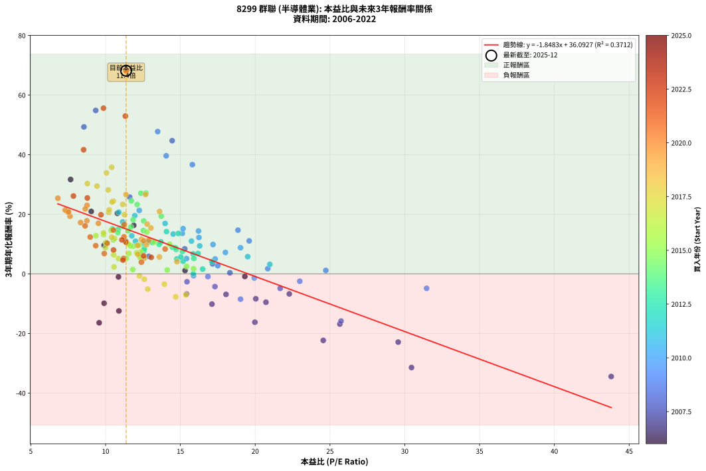
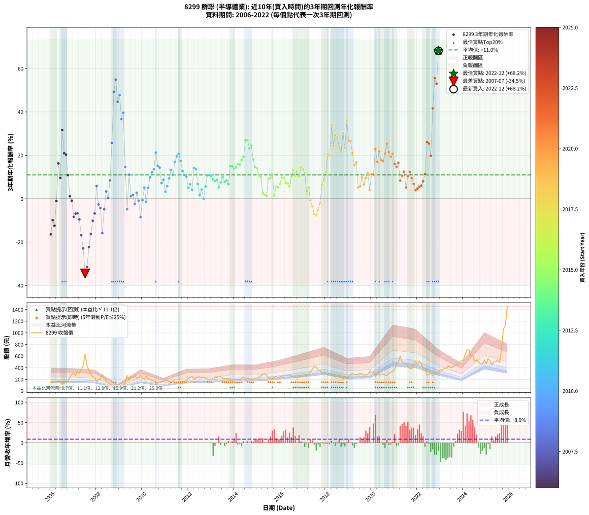

# 8299 群聯 - 本益比與未來報酬率分析

!!! info "報告資訊"
    - **股票代號**: 8299
    - **公司名稱**: 群聯
    - **產業別**: 半導體業
    - **分析期間**: 2006-2022 (204 個數據點)
    - **資料來源**: Type 12 (ShowMonthlyK_ChartFlow) 月收盤價與本益比
    - **報酬率口徑**: 含現金股利 (簡化: 年度合計，假設每年7/1入帳)
    - **報告生成時間**: 2026-01-10 19:15:33 CST

## 📈 視覺化圖表

### 圖表1: 本益比 vs 未來報酬率關係

*圖表1：8299 群聯 本益比與3年期未來報酬率關係 (2006-2022)*

### 圖表2: 歷年買入時點的3年期實際報酬率

*圖表2：8299 群聯 歷年買入時點的3年期實際報酬率 (2006-2022)*

## 📍 買點訊號說明

本報告提供兩種買點提示訊號（顯示於圖表2的股價子圖中）：

### ▲ 小綠色三角形（回測驗證）
- **計算方式**: 使用全部歷史資料計算本益比第25百分位數
- **用途**: 事後驗證，顯示歷史上哪些時點確實為低估區
- **限制**: 當下無法判斷，僅供回測參考
- **特性**: 後見之明（Look-Ahead Bias）

### ▲ 小橘色三角形（即時訊號）
- **計算方式**: 使用截至當月的過去5年資料計算本益比第25百分位數
- **用途**: 實際投資決策，當時即可判斷
- **優勢**: 可操作性強，符合實務需求
- **特性**: 無後見之明，滾動窗口計算

!!! tip "如何使用兩種訊號"
    - **綠色▲** 幫助理解歷史估值機會，驗證策略有效性
    - **橘色▲** 可作為實際買進參考，但仍需搭配基本面分析
    - 兩種訊號重疊時，表示即時判斷與事後驗證一致，信心度較高
    - 僅有綠色▲時，表示當時無法判斷（需要未來資料才能確認）
    - 僅有橘色▲時，表示即時判斷為買點，但事後可能不是最佳時機

## 📊 估值分析摘要

| 指標 | 數值 |
|:---:|:---:|
| **目前本益比** (2022-12) | **11.37 倍** |
| **歷史平均本益比** | 13.60 倍 |
| **估值水準** | 🟡 合理範圍 |
| **預期3年年化報酬率** | **+15.08%** |
| **歷史平均報酬率** | +10.96% |
| **相關係數 (R²)** | 0.3712 |
| **趨勢線斜率** | -1.8483 |

!!! abstract "核心洞察"
    目前本益比接近歷史平均，預期報酬率符合長期趨勢

    根據歷史數據回測，8299 群聯 在目前本益比 **11.4倍** 的估值水準下，
    預期未來3年年化報酬率約為 **+15.1%**。

    **重要提醒**: 本分析基於歷史數據統計，實際報酬率會受到公司基本面變化、產業趨勢、
    總體經濟環境等多重因素影響。R² = 0.37 表示本益比可解釋約 37.1% 的報酬率變異。

## 📈 歷史估值統計

### 最佳買點 (最高報酬率)

| 項目 | 數值 |
|:---:|:---:|
| 起始時間 | 2022-12 |
| 當時本益比 | 11.37 倍 |
| 起始價格 | 315.0 元 |
| 3年後價格 | 1450.0 元 |
| **3年年化報酬率** | **+68.18%** |

### 最差買點 (最低報酬率)

| 項目 | 數值 |
|:---:|:---:|
| 起始時間 | 2007-07 |
| 當時本益比 | 43.80 倍 |
| 起始價格 | 638.0 元 |
| 3年後價格 | 166.0 元 |
| **3年年化報酬率** | **-34.45%** |

## 🎯 投資啟示

### 本益比與報酬率關係

趨勢線方程式: **y = -1.8483x + 36.0927**

!!! warning "強負相關"
    本益比與未來報酬率呈現強負相關。在高本益比時期買入，未來報酬率顯著較低；
    在低本益比時期買入，未來報酬率顯著較高。**估值紀律至關重要**。

### 估值區間建議

基於歷史數據分析:

- **🟢 低估區** (P/E < 10.9): 預期報酬率較高，可考慮增加持股
- **🟡 合理區** (P/E 10.9-16.3): 預期報酬率符合長期趨勢，正常持有
- **🔴 高估區** (P/E > 16.3): 預期報酬率較低，可考慮減碼或觀望

!!! danger "風險提示"
    - 過去表現不代表未來結果
    - 本分析假設公司基本面無重大結構性變化
    - 產業環境劇變可能使歷史規律失效
    - 應結合公司財報、產業趨勢、總體經濟等多重因素綜合判斷

!!! success "長期投資觀點"
    歷史數據顯示，在合理或低估的估值水準買入並長期持有，
    往往能獲得較佳的投資報酬。**耐心等待好價格**是價值投資的核心原則。

## 📊 數據品質

- **資料來源**: GoodInfo.tw Type 12 (ShowMonthlyK_ChartFlow)
- **資料頻率**: 月度收盤價與本益比
- **回測期間**: 2006-2022
- **數據點數量**: 204 個 (每個點代表一次3年期回測)

### 計算方法說明

1. **3年期年化報酬率**:
   - 對每個歷史時點，計算其後3年的實際投資報酬率
   - 期末價值(不含股利): 期末價格
   - 期末價值(含現金股利): 期末價格 + 持有期間內的現金股利合計 (簡化: 年度合計，假設每年7/1入帳)
   - 公式: 年化報酬率 = [(期末價值/期初價格)^(1/年數) - 1] × 100%

2. **本益比 (P/E Ratio)**:
   - 使用當時的月收盤價與EPS計算
   - 資料來源: Type 12 月度河流圖本益比數據

3. **趨勢線 (Linear Regression)**:
   - 使用最小平方法擬合線性趨勢線
   - R²值衡量本益比對報酬率的解釋能力

---

*本報告由 Stock Analysis System v1.9.0 自動生成*
*數據更新時間: 2026-01-10 19:15:33 CST*

## 📋 月度回測明細表

（每一列對應時間線圖中的一個買入點；可用來對照 SVG 圖上的每個點。）

| 買入月份 | 賣出月份 | 回測期限_年 | 實際持有年數 | 買入本益比_倍 | 買入收盤價_元 | 賣出收盤價_元 | 現金股利合計_元 | 總報酬率_pct | 年化報酬率_pct |
| --- | --- | --- | --- | --- | --- | --- | --- | --- | --- |
| 2006-01 | 2009-01 | 3 | 3.001 | 9.57 | 145.00 | 71.10 | 13.57 | -41.60 | -16.41 |
| 2006-02 | 2009-02 | 3 | 3.001 | 9.90 | 150.00 | 96.30 | 13.57 | -26.75 | -9.85 |
| 2006-03 | 2009-03 | 3 | 3.001 | 10.89 | 165.00 | 97.20 | 13.57 | -32.86 | -12.43 |
| 2006-04 | 2009-04 | 3 | 3.001 | 10.86 | 164.50 | 146.00 | 13.57 | -2.99 | -1.01 |
| 2006-05 | 2009-05 | 3 | 3.001 | 11.88 | 180.00 | 269.50 | 13.57 | +57.26 | +16.29 |
| 2006-06 | 2009-06 | 3 | 3.001 | 9.90 | 150.00 | 184.00 | 13.57 | +31.72 | +9.62 |
| 2006-07 | 2009-07 | 3 | 3.001 | 7.66 | 116.00 | 252.50 | 12.43 | +128.39 | +31.68 |
| 2006-08 | 2009-08 | 3 | 3.001 | 9.04 | 137.00 | 230.00 | 12.43 | +76.96 | +20.95 |
| 2006-09 | 2009-09 | 3 | 3.001 | 10.79 | 163.50 | 272.50 | 12.43 | +74.27 | +20.33 |
| 2006-10 | 2009-10 | 3 | 3.001 | 11.35 | 172.00 | 222.00 | 12.43 | +36.30 | +10.87 |
| 2006-11 | 2009-11 | 3 | 3.001 | 15.31 | 232.00 | 227.50 | 12.43 | +3.42 | +1.13 |
| 2006-12 | 2009-12 | 3 | 3.001 | 19.31 | 292.50 | 272.50 | 12.43 | -2.59 | -0.87 |
| 2007-01 | 2010-01 | 3 | 3.001 | 20.04 | 302.00 | 220.00 | 12.43 | -23.04 | -8.36 |
| 2007-02 | 2010-02 | 3 | 3.001 | 18.05 | 270.50 | 206.00 | 12.43 | -19.25 | -6.88 |
| 2007-03 | 2010-03 | 3 | 3.001 | 22.28 | 332.00 | 257.00 | 12.43 | -18.85 | -6.72 |
| 2007-04 | 2010-04 | 3 | 3.001 | 20.72 | 307.00 | 215.00 | 12.43 | -25.92 | -9.51 |
| 2007-05 | 2010-05 | 3 | 3.001 | 25.66 | 378.00 | 205.00 | 12.43 | -42.48 | -16.83 |
| 2007-06 | 2010-06 | 3 | 3.001 | 29.56 | 433.00 | 186.00 | 12.43 | -54.17 | -22.90 |
| 2007-07 | 2010-07 | 3 | 3.001 | 43.80 | 638.00 | 166.00 | 13.64 | -71.84 | -34.45 |
| 2007-08 | 2010-08 | 3 | 3.001 | 30.45 | 441.00 | 128.50 | 13.64 | -67.77 | -31.43 |
| 2007-09 | 2010-09 | 3 | 3.001 | 24.55 | 353.50 | 152.00 | 13.64 | -53.14 | -22.32 |
| 2007-10 | 2010-10 | 3 | 3.001 | 19.98 | 286.00 | 154.50 | 13.64 | -41.21 | -16.22 |
| 2007-11 | 2010-11 | 3 | 3.001 | 17.11 | 243.50 | 163.00 | 13.64 | -27.46 | -10.14 |
| 2007-12 | 2010-12 | 3 | 3.001 | 15.41 | 218.00 | 163.00 | 13.64 | -18.97 | -6.77 |
| 2008-01 | 2011-01 | 3 | 3.001 | 12.89 | 172.00 | 190.50 | 13.64 | +18.69 | +5.88 |
| 2008-02 | 2011-03 | 3 | 3.080 | 15.44 | 193.50 | 164.50 | 13.64 | -7.94 | -2.65 |
| 2008-03 | 2011-03 | 3 | 2.998 | 17.31 | 203.00 | 164.50 | 13.64 | -12.25 | -4.26 |
| 2008-04 | 2011-04 | 3 | 2.998 | 25.74 | 281.00 | 154.00 | 13.64 | -40.34 | -15.83 |
| 2008-05 | 2011-05 | 3 | 2.998 | 21.67 | 219.00 | 175.00 | 13.64 | -13.86 | -4.86 |
| 2008-06 | 2011-06 | 3 | 2.998 | 17.15 | 159.50 | 162.50 | 13.64 | +10.43 | +3.37 |
| 2008-07 | 2011-07 | 3 | 2.998 | 18.31 | 155.50 | 145.00 | 12.18 | +1.08 | +0.36 |
| 2008-08 | 2011-08 | 3 | 2.998 | 15.29 | 117.50 | 137.50 | 12.18 | +27.39 | +8.41 |
| 2008-09 | 2011-09 | 3 | 2.998 | 11.61 | 79.80 | 146.50 | 12.18 | +98.84 | +25.77 |
| 2008-10 | 2011-10 | 3 | 2.998 | 8.55 | 51.90 | 160.50 | 12.18 | +232.71 | +49.33 |
| 2008-11 | 2011-11 | 3 | 2.998 | 9.34 | 49.10 | 170.00 | 12.18 | +271.03 | +54.86 |
| 2008-12 | 2011-12 | 3 | 2.998 | 14.45 | 64.30 | 182.50 | 12.18 | +202.77 | +44.70 |
| 2009-01 | 2012-01 | 3 | 2.998 | 13.48 | 71.10 | 217.00 | 12.18 | +222.33 | +47.76 |
| 2009-02 | 2012-02 | 3 | 2.998 | 15.80 | 96.30 | 233.50 | 12.18 | +155.12 | +36.67 |
| 2009-03 | 2012-03 | 3 | 3.001 | 14.05 | 97.20 | 252.50 | 12.18 | +172.30 | +39.63 |
| 2009-04 | 2012-04 | 3 | 3.001 | 18.85 | 146.00 | 208.00 | 12.18 | +50.81 | +14.67 |
| 2009-05 | 2012-05 | 3 | 3.001 | 31.46 | 269.50 | 220.00 | 12.18 | -13.85 | -4.85 |
| 2009-06 | 2012-06 | 3 | 3.001 | 19.60 | 184.00 | 240.00 | 12.18 | +37.05 | +11.08 |
| 2009-07 | 2012-07 | 3 | 3.001 | 24.72 | 252.50 | 245.00 | 16.34 | +3.50 | +1.15 |
| 2009-08 | 2012-08 | 3 | 3.001 | 20.84 | 230.00 | 226.00 | 16.34 | +5.37 | +1.76 |
| 2009-09 | 2012-09 | 3 | 3.001 | 22.98 | 272.50 | 236.50 | 16.34 | -7.21 | -2.46 |
| 2009-10 | 2012-10 | 3 | 3.001 | 17.50 | 222.00 | 224.50 | 16.34 | +8.49 | +2.75 |
| 2009-11 | 2012-11 | 3 | 3.001 | 16.84 | 227.50 | 205.00 | 16.34 | -2.71 | -0.91 |
| 2009-12 | 2012-12 | 3 | 3.001 | 19.02 | 272.50 | 192.50 | 16.34 | -23.36 | -8.49 |
| 2010-01 | 2013-01 | 3 | 3.001 | 15.88 | 220.00 | 199.50 | 16.34 | -1.89 | -0.63 |
| 2010-02 | 2013-02 | 3 | 3.001 | 15.41 | 206.00 | 223.00 | 16.34 | +16.18 | +5.13 |
| 2010-03 | 2013-03 | 3 | 3.001 | 19.94 | 257.00 | 230.00 | 16.34 | -4.15 | -1.40 |
| 2010-04 | 2013-04 | 3 | 3.001 | 17.32 | 215.00 | 232.50 | 16.34 | +15.74 | +4.99 |
| 2010-05 | 2013-05 | 3 | 3.001 | 17.18 | 205.00 | 255.50 | 16.34 | +32.60 | +9.86 |
| 2010-06 | 2013-06 | 3 | 3.001 | 16.24 | 186.00 | 246.50 | 16.34 | +41.31 | +12.21 |
| 2010-07 | 2013-07 | 3 | 3.001 | 15.13 | 166.00 | 224.00 | 19.34 | +46.59 | +13.59 |
| 2010-08 | 2013-08 | 3 | 3.001 | 12.25 | 128.50 | 210.00 | 19.34 | +78.48 | +21.29 |
| 2010-09 | 2013-09 | 3 | 3.001 | 15.18 | 152.00 | 213.00 | 19.34 | +52.86 | +15.19 |
| 2010-10 | 2013-10 | 3 | 3.001 | 16.21 | 154.50 | 212.00 | 19.34 | +49.74 | +14.40 |
| 2010-11 | 2013-11 | 3 | 3.001 | 18.01 | 163.00 | 181.50 | 19.34 | +23.22 | +7.20 |
| 2010-12 | 2013-12 | 3 | 3.001 | 19.02 | 163.00 | 190.50 | 19.34 | +28.74 | +8.78 |
| 2011-01 | 2014-01 | 3 | 3.001 | 20.98 | 190.50 | 190.00 | 19.34 | +9.89 | +3.19 |
| 2011-02 | 2014-02 | 3 | 3.001 | 19.50 | 187.00 | 202.00 | 19.34 | +18.36 | +5.78 |
| 2011-03 | 2014-03 | 3 | 3.001 | 16.29 | 164.50 | 196.00 | 19.34 | +30.91 | +9.39 |
| 2011-04 | 2014-04 | 3 | 3.001 | 14.52 | 154.00 | 205.00 | 19.34 | +45.68 | +13.36 |
| 2011-05 | 2014-05 | 3 | 3.001 | 15.74 | 175.00 | 220.00 | 19.34 | +36.77 | +11.00 |
| 2011-06 | 2014-06 | 3 | 3.001 | 13.98 | 162.50 | 240.50 | 19.34 | +59.90 | +16.93 |
| 2011-07 | 2014-07 | 3 | 3.001 | 11.95 | 145.00 | 222.50 | 25.22 | +70.84 | +19.54 |
| 2011-08 | 2014-08 | 3 | 3.001 | 10.88 | 137.50 | 216.50 | 25.22 | +75.79 | +20.68 |
| 2011-09 | 2014-09 | 3 | 3.001 | 11.14 | 146.50 | 212.00 | 25.22 | +61.92 | +17.42 |
| 2011-10 | 2014-10 | 3 | 3.001 | 11.75 | 160.50 | 205.00 | 25.22 | +43.44 | +12.77 |
| 2011-11 | 2014-11 | 3 | 3.001 | 12.00 | 170.00 | 207.00 | 25.22 | +36.60 | +10.95 |
| 2011-12 | 2014-12 | 3 | 3.001 | 12.43 | 182.50 | 219.00 | 25.22 | +33.82 | +10.19 |
| 2012-01 | 2015-01 | 3 | 3.001 | 14.76 | 217.00 | 226.00 | 25.22 | +15.77 | +5.00 |
| 2012-02 | 2015-03 | 3 | 3.080 | 15.85 | 233.50 | 260.00 | 25.22 | +22.15 | +6.71 |
| 2012-03 | 2015-03 | 3 | 2.998 | 17.11 | 252.50 | 260.00 | 25.22 | +12.96 | +4.15 |
| 2012-04 | 2015-04 | 3 | 2.998 | 14.07 | 208.00 | 284.50 | 25.22 | +48.90 | +14.20 |
| 2012-05 | 2015-05 | 3 | 2.998 | 14.86 | 220.00 | 297.00 | 25.22 | +46.46 | +13.57 |
| 2012-06 | 2015-06 | 3 | 2.998 | 16.18 | 240.00 | 267.50 | 25.22 | +21.97 | +6.85 |
| 2012-07 | 2015-07 | 3 | 2.998 | 16.49 | 245.00 | 227.50 | 29.42 | +4.87 | +1.60 |
| 2012-08 | 2015-08 | 3 | 2.998 | 15.18 | 226.00 | 226.50 | 29.42 | +13.24 | +4.23 |
| 2012-09 | 2015-09 | 3 | 2.998 | 15.86 | 236.50 | 207.00 | 29.42 | -0.03 | -0.01 |
| 2012-10 | 2015-10 | 3 | 2.998 | 15.03 | 224.50 | 235.50 | 29.42 | +18.00 | +5.68 |
| 2012-11 | 2015-11 | 3 | 2.998 | 13.70 | 205.00 | 249.00 | 29.42 | +35.81 | +10.75 |
| 2012-12 | 2015-12 | 3 | 2.998 | 12.84 | 192.50 | 232.50 | 29.42 | +36.06 | +10.82 |
| 2013-01 | 2016-01 | 3 | 2.998 | 13.12 | 199.50 | 240.00 | 29.42 | +35.05 | +10.54 |
| 2013-02 | 2016-02 | 3 | 2.998 | 14.46 | 223.00 | 259.00 | 29.42 | +29.34 | +8.96 |
| 2013-03 | 2016-03 | 3 | 3.001 | 14.71 | 230.00 | 262.00 | 29.42 | +26.70 | +8.21 |
| 2013-04 | 2016-04 | 3 | 3.001 | 14.67 | 232.50 | 269.50 | 29.42 | +28.57 | +8.73 |
| 2013-05 | 2016-05 | 3 | 3.001 | 15.90 | 255.50 | 268.00 | 29.42 | +16.41 | +5.19 |
| 2013-06 | 2016-06 | 3 | 3.001 | 15.14 | 246.50 | 277.00 | 29.42 | +24.31 | +7.52 |
| 2013-07 | 2016-07 | 3 | 3.001 | 13.58 | 224.00 | 264.00 | 33.42 | +32.78 | +9.91 |
| 2013-08 | 2016-08 | 3 | 3.001 | 12.57 | 210.00 | 229.50 | 33.42 | +25.20 | +7.78 |
| 2013-09 | 2016-09 | 3 | 3.001 | 12.58 | 213.00 | 238.00 | 33.42 | +27.43 | +8.41 |
| 2013-10 | 2016-10 | 3 | 3.001 | 12.37 | 212.00 | 224.00 | 33.42 | +21.42 | +6.68 |
| 2013-11 | 2016-11 | 3 | 3.001 | 10.46 | 181.50 | 243.50 | 33.42 | +52.57 | +15.12 |
| 2013-12 | 2016-12 | 3 | 3.001 | 10.84 | 190.50 | 255.50 | 33.42 | +51.66 | +14.89 |
| 2014-01 | 2017-01 | 3 | 3.001 | 10.82 | 190.00 | 247.00 | 33.42 | +47.59 | +13.85 |
| 2014-02 | 2017-02 | 3 | 3.001 | 11.51 | 202.00 | 269.50 | 33.42 | +49.96 | +14.46 |
| 2014-03 | 2017-03 | 3 | 3.001 | 11.17 | 196.00 | 272.50 | 33.42 | +56.08 | +15.99 |
| 2014-04 | 2017-04 | 3 | 3.001 | 11.69 | 205.00 | 284.50 | 33.42 | +55.08 | +15.75 |
| 2014-05 | 2017-05 | 3 | 3.001 | 12.55 | 220.00 | 326.00 | 33.42 | +63.37 | +17.77 |
| 2014-06 | 2017-06 | 3 | 3.001 | 13.72 | 240.50 | 375.50 | 33.42 | +70.03 | +19.35 |
| 2014-07 | 2017-07 | 3 | 3.001 | 12.70 | 222.50 | 420.00 | 37.20 | +105.48 | +27.13 |
| 2014-08 | 2017-08 | 3 | 3.001 | 12.36 | 216.50 | 407.00 | 37.20 | +105.17 | +27.06 |
| 2014-09 | 2017-09 | 3 | 3.001 | 12.11 | 212.00 | 360.00 | 37.20 | +87.36 | +23.27 |
| 2014-10 | 2017-10 | 3 | 3.001 | 11.72 | 205.00 | 358.50 | 37.20 | +93.02 | +24.50 |
| 2014-11 | 2017-11 | 3 | 3.001 | 11.84 | 207.00 | 304.00 | 37.20 | +64.83 | +18.12 |
| 2014-12 | 2017-12 | 3 | 3.001 | 12.53 | 219.00 | 292.00 | 37.20 | +50.32 | +14.55 |
| 2015-01 | 2018-01 | 3 | 3.001 | 12.75 | 226.00 | 298.00 | 37.20 | +48.32 | +14.04 |
| 2015-02 | 2018-02 | 3 | 3.001 | 13.25 | 238.00 | 286.00 | 37.20 | +35.80 | +10.74 |
| 2015-03 | 2018-03 | 3 | 3.001 | 14.28 | 260.00 | 308.50 | 37.20 | +32.96 | +9.96 |
| 2015-04 | 2018-04 | 3 | 3.001 | 15.41 | 284.50 | 269.50 | 37.20 | +7.80 | +2.54 |
| 2015-05 | 2018-05 | 3 | 3.001 | 15.88 | 297.00 | 275.50 | 37.20 | +5.29 | +1.73 |
| 2015-06 | 2018-06 | 3 | 3.001 | 14.12 | 267.50 | 241.00 | 37.20 | +4.00 | +1.32 |
| 2015-07 | 2018-07 | 3 | 3.001 | 11.86 | 227.50 | 254.00 | 43.00 | +30.55 | +9.29 |
| 2015-08 | 2018-08 | 3 | 3.001 | 11.66 | 226.50 | 254.00 | 43.00 | +31.13 | +9.45 |
| 2015-09 | 2018-09 | 3 | 3.001 | 10.52 | 207.00 | 243.00 | 43.00 | +38.16 | +11.38 |
| 2015-10 | 2018-10 | 3 | 3.001 | 11.82 | 235.50 | 203.00 | 43.00 | +4.46 | +1.46 |
| 2015-11 | 2018-11 | 3 | 3.001 | 12.35 | 249.00 | 251.00 | 43.00 | +18.07 | +5.69 |
| 2015-12 | 2018-12 | 3 | 3.001 | 11.39 | 232.50 | 228.00 | 43.00 | +16.56 | +5.24 |
| 2016-01 | 2019-01 | 3 | 3.001 | 11.56 | 240.00 | 250.00 | 43.00 | +22.08 | +6.88 |
| 2016-02 | 2019-03 | 3 | 3.080 | 12.26 | 259.00 | 302.00 | 43.00 | +33.20 | +9.76 |
| 2016-03 | 2019-03 | 3 | 2.998 | 12.20 | 262.00 | 302.00 | 43.00 | +31.68 | +9.61 |
| 2016-04 | 2019-04 | 3 | 2.998 | 12.35 | 269.50 | 290.50 | 43.00 | +23.75 | +7.37 |
| 2016-05 | 2019-05 | 3 | 2.998 | 12.08 | 268.00 | 286.00 | 43.00 | +22.76 | +7.08 |
| 2016-06 | 2019-06 | 3 | 2.998 | 12.29 | 277.00 | 283.00 | 43.00 | +17.69 | +5.58 |
| 2016-07 | 2019-07 | 3 | 2.998 | 11.53 | 264.00 | 307.00 | 44.00 | +32.95 | +9.97 |
| 2016-08 | 2019-08 | 3 | 2.998 | 9.87 | 229.50 | 288.50 | 44.00 | +44.88 | +13.16 |
| 2016-09 | 2019-09 | 3 | 2.998 | 10.08 | 238.00 | 276.50 | 44.00 | +34.66 | +10.44 |
| 2016-10 | 2019-10 | 3 | 2.998 | 9.35 | 224.00 | 277.50 | 44.00 | +43.53 | +12.81 |
| 2016-11 | 2019-11 | 3 | 2.998 | 10.01 | 243.50 | 284.50 | 44.00 | +34.91 | +10.50 |
| 2016-12 | 2019-12 | 3 | 2.998 | 10.36 | 255.50 | 340.50 | 44.00 | +50.49 | +14.61 |
| 2017-01 | 2020-01 | 3 | 2.998 | 9.86 | 247.00 | 319.50 | 44.00 | +47.17 | +13.76 |
| 2017-02 | 2020-02 | 3 | 2.998 | 10.60 | 269.50 | 333.50 | 44.00 | +40.07 | +11.90 |
| 2017-03 | 2020-03 | 3 | 3.001 | 10.56 | 272.50 | 248.00 | 44.00 | +7.16 | +2.33 |
| 2017-04 | 2020-04 | 3 | 3.001 | 10.86 | 284.50 | 286.50 | 44.00 | +16.17 | +5.12 |
| 2017-05 | 2020-05 | 3 | 3.001 | 12.27 | 326.00 | 275.00 | 44.00 | -2.15 | -0.72 |
| 2017-06 | 2020-06 | 3 | 3.001 | 13.93 | 375.50 | 294.00 | 44.00 | -9.99 | -3.45 |
| 2017-07 | 2020-07 | 3 | 3.001 | 15.37 | 420.00 | 294.50 | 43.00 | -19.64 | -7.03 |
| 2017-08 | 2020-08 | 3 | 3.001 | 14.69 | 407.00 | 277.00 | 43.00 | -21.38 | -7.70 |
| 2017-09 | 2020-09 | 3 | 3.001 | 12.82 | 360.00 | 264.50 | 43.00 | -14.58 | -5.12 |
| 2017-10 | 2020-10 | 3 | 3.001 | 12.59 | 358.50 | 296.50 | 43.00 | -5.30 | -1.80 |
| 2017-11 | 2020-11 | 3 | 3.001 | 10.54 | 304.00 | 323.00 | 43.00 | +20.39 | +6.38 |
| 2017-12 | 2020-12 | 3 | 3.001 | 9.99 | 292.00 | 332.50 | 43.00 | +28.60 | +8.74 |
| 2018-01 | 2021-01 | 3 | 3.001 | 10.41 | 298.00 | 379.00 | 43.00 | +41.61 | +12.29 |
| 2018-02 | 2021-02 | 3 | 3.001 | 10.21 | 286.00 | 459.50 | 43.00 | +75.70 | +20.66 |
| 2018-03 | 2021-03 | 3 | 3.001 | 11.26 | 308.50 | 488.50 | 43.00 | +72.29 | +19.88 |
| 2018-04 | 2021-04 | 3 | 3.001 | 10.06 | 269.50 | 604.00 | 43.00 | +140.07 | +33.89 |
| 2018-05 | 2021-05 | 3 | 3.001 | 10.52 | 275.50 | 488.00 | 43.00 | +92.74 | +24.44 |
| 2018-06 | 2021-06 | 3 | 3.001 | 9.43 | 241.00 | 480.00 | 43.00 | +117.01 | +29.46 |
| 2018-07 | 2021-07 | 3 | 3.001 | 10.18 | 254.00 | 476.00 | 59.00 | +110.63 | +28.18 |
| 2018-08 | 2021-08 | 3 | 3.001 | 10.43 | 254.00 | 427.00 | 59.00 | +91.34 | +24.14 |
| 2018-09 | 2021-09 | 3 | 3.001 | 10.24 | 243.00 | 377.00 | 59.00 | +79.42 | +21.51 |
| 2018-10 | 2021-10 | 3 | 3.001 | 8.78 | 203.00 | 390.50 | 59.00 | +121.43 | +30.33 |
| 2018-11 | 2021-11 | 3 | 3.001 | 11.15 | 251.00 | 412.00 | 59.00 | +87.65 | +23.34 |
| 2018-12 | 2021-12 | 3 | 3.001 | 10.41 | 228.00 | 512.00 | 59.00 | +150.44 | +35.79 |
| 2019-01 | 2022-01 | 3 | 3.001 | 11.36 | 250.00 | 448.50 | 59.00 | +103.00 | +26.61 |
| 2019-02 | 2022-02 | 3 | 3.001 | 12.67 | 280.00 | 510.00 | 59.00 | +103.21 | +26.66 |
| 2019-03 | 2022-03 | 3 | 3.001 | 13.61 | 302.00 | 475.50 | 59.00 | +76.99 | +20.96 |
| 2019-04 | 2022-04 | 3 | 3.001 | 13.03 | 290.50 | 387.50 | 59.00 | +53.70 | +15.40 |
| 2019-05 | 2022-05 | 3 | 3.001 | 12.78 | 286.00 | 395.50 | 59.00 | +58.92 | +16.69 |
| 2019-06 | 2022-06 | 3 | 3.001 | 12.59 | 283.00 | 271.00 | 59.00 | +16.61 | +5.25 |
| 2019-07 | 2022-07 | 3 | 3.001 | 13.60 | 307.00 | 293.00 | 69.28 | +18.01 | +5.67 |
| 2019-08 | 2022-08 | 3 | 3.001 | 12.73 | 288.50 | 312.50 | 69.28 | +32.33 | +9.79 |
| 2019-09 | 2022-09 | 3 | 3.001 | 12.15 | 276.50 | 265.50 | 69.28 | +21.08 | +6.58 |
| 2019-10 | 2022-10 | 3 | 3.001 | 12.14 | 277.50 | 295.50 | 69.28 | +31.45 | +9.54 |
| 2019-11 | 2022-11 | 3 | 3.001 | 12.39 | 284.50 | 326.50 | 69.28 | +39.11 | +11.63 |
| 2019-12 | 2022-12 | 3 | 3.001 | 14.77 | 340.50 | 315.00 | 69.28 | +12.86 | +4.11 |
| 2020-01 | 2023-01 | 3 | 3.001 | 12.88 | 319.50 | 371.00 | 69.28 | +37.80 | +11.28 |
| 2020-02 | 2023-03 | 3 | 3.080 | 12.55 | 333.50 | 392.00 | 69.28 | +38.31 | +11.11 |
| 2020-03 | 2023-03 | 3 | 2.998 | 8.76 | 248.00 | 392.00 | 69.28 | +86.00 | +23.00 |
| 2020-04 | 2023-04 | 3 | 2.998 | 9.52 | 286.50 | 389.00 | 69.28 | +59.96 | +16.96 |
| 2020-05 | 2023-05 | 3 | 2.998 | 8.64 | 275.00 | 427.50 | 69.28 | +80.65 | +21.81 |
| 2020-06 | 2023-06 | 3 | 2.998 | 8.75 | 294.00 | 411.50 | 69.28 | +63.53 | +17.83 |
| 2020-07 | 2023-07 | 3 | 2.998 | 8.33 | 294.50 | 409.00 | 65.16 | +61.00 | +17.22 |
| 2020-08 | 2023-08 | 3 | 2.998 | 7.46 | 277.00 | 423.50 | 65.16 | +76.41 | +20.85 |
| 2020-09 | 2023-09 | 3 | 2.998 | 6.81 | 264.50 | 456.00 | 65.16 | +97.03 | +25.39 |
| 2020-10 | 2023-10 | 3 | 2.998 | 7.30 | 296.50 | 465.50 | 65.16 | +78.97 | +21.43 |
| 2020-11 | 2023-11 | 3 | 2.998 | 7.62 | 323.00 | 483.50 | 65.16 | +69.86 | +19.33 |
| 2020-12 | 2023-12 | 3 | 2.998 | 7.53 | 332.50 | 520.00 | 65.16 | +75.99 | +20.75 |
| 2021-01 | 2024-01 | 3 | 2.998 | 8.63 | 379.00 | 528.00 | 65.16 | +56.51 | +16.11 |
| 2021-02 | 2024-02 | 3 | 2.998 | 10.52 | 459.50 | 628.00 | 65.16 | +50.85 | +14.70 |
| 2021-03 | 2024-03 | 3 | 3.001 | 11.25 | 488.50 | 708.00 | 65.16 | +58.27 | +16.53 |
| 2021-04 | 2024-04 | 3 | 3.001 | 13.98 | 604.00 | 703.00 | 65.16 | +27.18 | +8.34 |
| 2021-05 | 2024-05 | 3 | 3.001 | 11.36 | 488.00 | 595.00 | 65.16 | +35.28 | +10.59 |
| 2021-06 | 2024-06 | 3 | 3.001 | 11.23 | 480.00 | 617.00 | 65.16 | +42.12 | +12.43 |
| 2021-07 | 2024-07 | 3 | 3.001 | 11.20 | 476.00 | 513.00 | 40.81 | +16.35 | +5.18 |
| 2021-08 | 2024-08 | 3 | 3.001 | 10.10 | 427.00 | 532.00 | 40.81 | +34.15 | +10.29 |
| 2021-09 | 2024-09 | 3 | 3.001 | 8.97 | 377.00 | 494.00 | 40.81 | +41.86 | +12.36 |
| 2021-10 | 2024-10 | 3 | 3.001 | 9.34 | 390.50 | 471.50 | 40.81 | +31.19 | +9.47 |
| 2021-11 | 2024-11 | 3 | 3.001 | 9.91 | 412.00 | 461.50 | 40.81 | +21.92 | +6.83 |
| 2021-12 | 2024-12 | 3 | 3.001 | 12.39 | 512.00 | 534.00 | 40.81 | +12.27 | +3.93 |
| 2022-01 | 2025-01 | 3 | 3.001 | 11.16 | 448.50 | 473.00 | 40.81 | +14.56 | +4.63 |
| 2022-02 | 2025-02 | 3 | 3.001 | 13.05 | 510.00 | 559.00 | 40.81 | +17.61 | +5.55 |
| 2022-03 | 2025-03 | 3 | 3.001 | 12.54 | 475.50 | 526.00 | 40.81 | +19.20 | +6.03 |
| 2022-04 | 2025-04 | 3 | 3.001 | 10.53 | 387.50 | 447.50 | 40.81 | +26.02 | +8.01 |
| 2022-05 | 2025-05 | 3 | 3.001 | 11.09 | 395.50 | 506.00 | 40.81 | +38.26 | +11.40 |
| 2022-06 | 2025-06 | 3 | 3.001 | 7.85 | 271.00 | 503.00 | 40.81 | +100.67 | +26.13 |
| 2022-07 | 2025-07 | 3 | 3.001 | 8.78 | 293.00 | 530.00 | 48.84 | +97.56 | +25.47 |
| 2022-08 | 2025-08 | 3 | 3.001 | 9.69 | 312.50 | 489.00 | 48.84 | +72.11 | +19.84 |
| 2022-09 | 2025-09 | 3 | 3.001 | 8.53 | 265.50 | 706.00 | 48.84 | +184.31 | +41.65 |
| 2022-10 | 2025-10 | 3 | 3.001 | 9.86 | 295.50 | 1065.00 | 48.84 | +276.94 | +55.61 |
| 2022-11 | 2025-11 | 3 | 3.001 | 11.32 | 326.50 | 1120.00 | 48.84 | +257.99 | +52.96 |
| 2022-12 | 2025-12 | 3 | 3.001 | 11.37 | 315.00 | 1450.00 | 48.84 | +375.82 | +68.18 |
