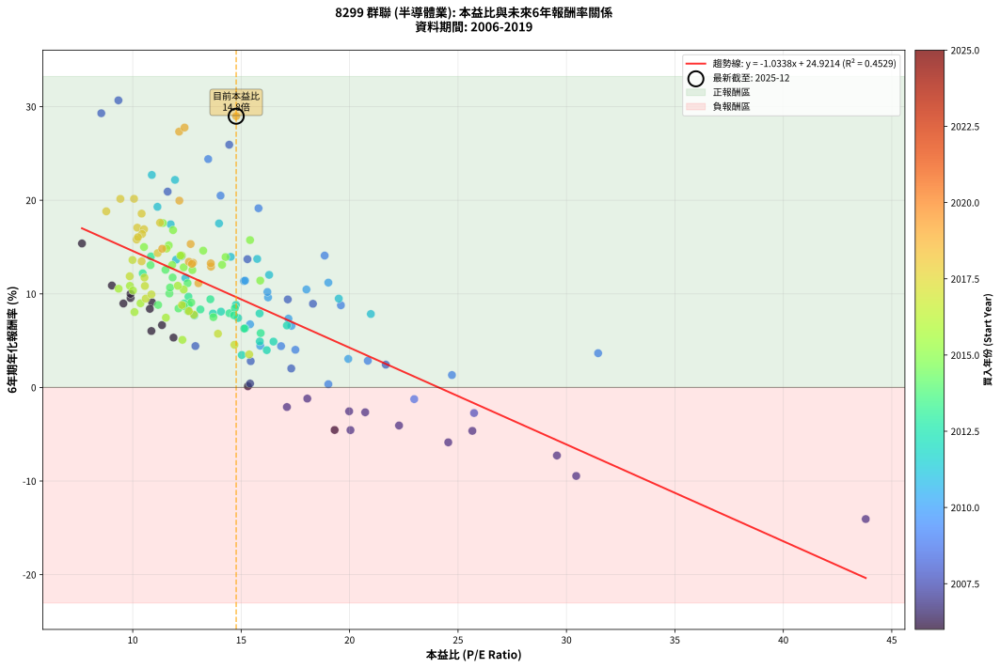
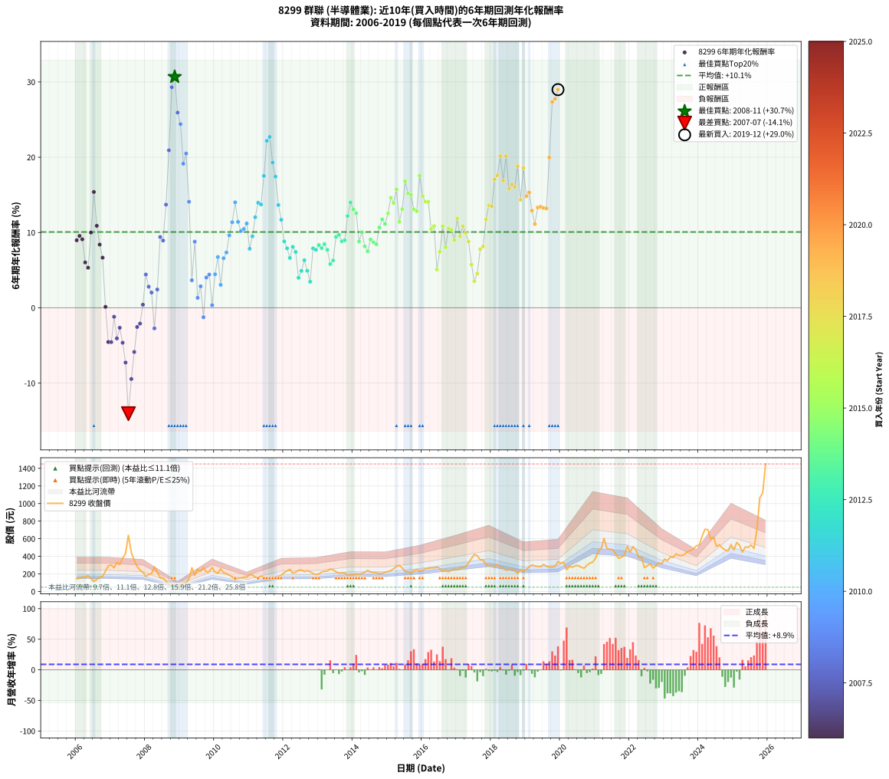

# 8299 群聯 - 本益比與未來報酬率分析

!!! info "報告資訊"
    - **股票代號**: 8299
    - **公司名稱**: 群聯
    - **產業別**: 半導體業
    - **分析期間**: 2006-2019 (168 個數據點)
    - **資料來源**: Type 12 (ShowMonthlyK_ChartFlow) 月收盤價與本益比
    - **報酬率口徑**: 含現金股利 (簡化: 年度合計，假設每年7/1入帳)
    - **報告生成時間**: 2026-01-09 21:25:10 CST

## 📈 視覺化圖表

### 圖表1: 本益比 vs 未來報酬率關係

*圖表1：8299 群聯 本益比與6年期未來報酬率關係 (2006-2019)*

### 圖表2: 歷年買入時點的6年期實際報酬率

*圖表2：8299 群聯 歷年買入時點的6年期實際報酬率 (2006-2019)*

## 📍 買點訊號說明

本報告提供兩種買點提示訊號（顯示於圖表2的股價子圖中）：

### ▲ 小綠色三角形（回測驗證）
- **計算方式**: 使用全部歷史資料計算本益比第25百分位數
- **用途**: 事後驗證，顯示歷史上哪些時點確實為低估區
- **限制**: 當下無法判斷，僅供回測參考
- **特性**: 後見之明（Look-Ahead Bias）

### ▲ 小橘色三角形（即時訊號）
- **計算方式**: 使用截至當月的過去5年資料計算本益比第25百分位數
- **用途**: 實際投資決策，當時即可判斷
- **優勢**: 可操作性強，符合實務需求
- **特性**: 無後見之明，滾動窗口計算

!!! tip "如何使用兩種訊號"
    - **綠色▲** 幫助理解歷史估值機會，驗證策略有效性
    - **橘色▲** 可作為實際買進參考，但仍需搭配基本面分析
    - 兩種訊號重疊時，表示即時判斷與事後驗證一致，信心度較高
    - 僅有綠色▲時，表示當時無法判斷（需要未來資料才能確認）
    - 僅有橘色▲時，表示即時判斷為買點，但事後可能不是最佳時機

## 📊 估值分析摘要

| 指標 | 數值 |
|:---:|:---:|
| **目前本益比** (2019-12) | **14.77 倍** |
| **歷史平均本益比** | 14.36 倍 |
| **估值水準** | 🟡 合理範圍 |
| **預期6年年化報酬率** | **+9.65%** |
| **歷史平均報酬率** | +10.07% |
| **相關係數 (R²)** | 0.4529 |
| **趨勢線斜率** | -1.0338 |

!!! abstract "核心洞察"
    目前本益比接近歷史平均，預期報酬率符合長期趨勢

    根據歷史數據回測，8299 群聯 在目前本益比 **14.8倍** 的估值水準下，
    預期未來6年年化報酬率約為 **+9.7%**。

    **重要提醒**: 本分析基於歷史數據統計，實際報酬率會受到公司基本面變化、產業趨勢、
    總體經濟環境等多重因素影響。R² = 0.45 表示本益比可解釋約 45.3% 的報酬率變異。

## 📈 歷史估值統計

### 最佳買點 (最高報酬率)

| 項目 | 數值 |
|:---:|:---:|
| 起始時間 | 2008-11 |
| 當時本益比 | 9.34 倍 |
| 起始價格 | 49.1 元 |
| 6年後價格 | 207.0 元 |
| **6年年化報酬率** | **+30.68%** |

### 最差買點 (最低報酬率)

| 項目 | 數值 |
|:---:|:---:|
| 起始時間 | 2007-07 |
| 當時本益比 | 43.80 倍 |
| 起始價格 | 638.0 元 |
| 6年後價格 | 224.0 元 |
| **6年年化報酬率** | **-14.06%** |

## 🎯 投資啟示

### 本益比與報酬率關係

趨勢線方程式: **y = -1.0338x + 24.9214**

!!! warning "強負相關"
    本益比與未來報酬率呈現強負相關。在高本益比時期買入，未來報酬率顯著較低；
    在低本益比時期買入，未來報酬率顯著較高。**估值紀律至關重要**。

### 估值區間建議

基於歷史數據分析:

- **🟢 低估區** (P/E < 11.5): 預期報酬率較高，可考慮增加持股
- **🟡 合理區** (P/E 11.5-17.2): 預期報酬率符合長期趨勢，正常持有
- **🔴 高估區** (P/E > 17.2): 預期報酬率較低，可考慮減碼或觀望

!!! danger "風險提示"
    - 過去表現不代表未來結果
    - 本分析假設公司基本面無重大結構性變化
    - 產業環境劇變可能使歷史規律失效
    - 應結合公司財報、產業趨勢、總體經濟等多重因素綜合判斷

!!! success "長期投資觀點"
    歷史數據顯示，在合理或低估的估值水準買入並長期持有，
    往往能獲得較佳的投資報酬。**耐心等待好價格**是價值投資的核心原則。

## 📊 數據品質

- **資料來源**: GoodInfo.tw Type 12 (ShowMonthlyK_ChartFlow)
- **資料頻率**: 月度收盤價與本益比
- **回測期間**: 2006-2019
- **數據點數量**: 168 個 (每個點代表一次6年期回測)

### 計算方法說明

1. **6年期年化報酬率**:
   - 對每個歷史時點，計算其後6年的實際投資報酬率
   - 期末價值(不含股利): 期末價格
   - 期末價值(含現金股利): 期末價格 + 持有期間內的現金股利合計 (簡化: 年度合計，假設每年7/1入帳)
   - 公式: 年化報酬率 = [(期末價值/期初價格)^(1/年數) - 1] × 100%

2. **本益比 (P/E Ratio)**:
   - 使用當時的月收盤價與EPS計算
   - 資料來源: Type 12 月度河流圖本益比數據

3. **趨勢線 (Linear Regression)**:
   - 使用最小平方法擬合線性趨勢線
   - R²值衡量本益比對報酬率的解釋能力

---

*本報告由 Stock Analysis System v1.9.0 自動生成*
*數據更新時間: 2026-01-09 21:25:10 CST*

## 📋 月度回測明細表

（每一列對應時間線圖中的一個買入點；可用來對照 SVG 圖上的每個點。）

| 買入月份 | 賣出月份 | 回測期限_年 | 實際持有年數 | 買入本益比_倍 | 買入收盤價_元 | 賣出收盤價_元 | 現金股利合計_元 | 總報酬率_pct | 年化報酬率_pct |
| --- | --- | --- | --- | --- | --- | --- | --- | --- | --- |
| 2006-01 | 2012-01 | 6 | 5.999 | 9.57 | 145.00 | 217.00 | 25.75 | +67.42 | +8.97 |
| 2006-02 | 2012-02 | 6 | 5.999 | 9.90 | 150.00 | 233.50 | 25.75 | +72.84 | +9.55 |
| 2006-03 | 2012-03 | 6 | 6.001 | 10.89 | 165.00 | 252.50 | 25.75 | +68.64 | +9.10 |
| 2006-04 | 2012-04 | 6 | 6.001 | 10.86 | 164.50 | 208.00 | 25.75 | +42.10 | +6.03 |
| 2006-05 | 2012-05 | 6 | 6.001 | 11.88 | 180.00 | 220.00 | 25.75 | +36.53 | +5.33 |
| 2006-06 | 2012-06 | 6 | 6.001 | 9.90 | 150.00 | 240.00 | 25.75 | +77.17 | +10.00 |
| 2006-07 | 2012-07 | 6 | 6.001 | 7.66 | 116.00 | 245.00 | 28.77 | +136.01 | +15.38 |
| 2006-08 | 2012-08 | 6 | 6.001 | 9.04 | 137.00 | 226.00 | 28.77 | +85.97 | +10.89 |
| 2006-09 | 2012-09 | 6 | 6.001 | 10.79 | 163.50 | 236.50 | 28.77 | +62.25 | +8.40 |
| 2006-10 | 2012-10 | 6 | 6.001 | 11.35 | 172.00 | 224.50 | 28.77 | +47.25 | +6.66 |
| 2006-11 | 2012-11 | 6 | 6.001 | 15.31 | 232.00 | 205.00 | 28.77 | +0.76 | +0.13 |
| 2006-12 | 2012-12 | 6 | 6.001 | 19.31 | 292.50 | 192.50 | 28.77 | -24.35 | -4.54 |
| 2007-01 | 2013-01 | 6 | 6.001 | 20.04 | 302.00 | 199.50 | 28.77 | -24.41 | -4.56 |
| 2007-02 | 2013-02 | 6 | 6.001 | 18.05 | 270.50 | 223.00 | 28.77 | -6.92 | -1.19 |
| 2007-03 | 2013-03 | 6 | 6.001 | 22.28 | 332.00 | 230.00 | 28.77 | -22.06 | -4.07 |
| 2007-04 | 2013-04 | 6 | 6.001 | 20.72 | 307.00 | 232.50 | 28.77 | -14.89 | -2.65 |
| 2007-05 | 2013-05 | 6 | 6.001 | 25.66 | 378.00 | 255.50 | 28.77 | -24.80 | -4.64 |
| 2007-06 | 2013-06 | 6 | 6.001 | 29.56 | 433.00 | 246.50 | 28.77 | -36.43 | -7.27 |
| 2007-07 | 2013-07 | 6 | 6.001 | 43.80 | 638.00 | 224.00 | 32.98 | -59.72 | -14.06 |
| 2007-08 | 2013-08 | 6 | 6.001 | 30.45 | 441.00 | 210.00 | 32.98 | -44.90 | -9.45 |
| 2007-09 | 2013-09 | 6 | 6.001 | 24.55 | 353.50 | 213.00 | 32.98 | -30.41 | -5.86 |
| 2007-10 | 2013-10 | 6 | 6.001 | 19.98 | 286.00 | 212.00 | 32.98 | -14.34 | -2.55 |
| 2007-11 | 2013-11 | 6 | 6.001 | 17.11 | 243.50 | 181.50 | 32.98 | -11.92 | -2.09 |
| 2007-12 | 2013-12 | 6 | 6.001 | 15.41 | 218.00 | 190.50 | 32.98 | +2.52 | +0.41 |
| 2008-01 | 2014-01 | 6 | 6.001 | 12.89 | 172.00 | 190.00 | 32.98 | +29.64 | +4.42 |
| 2008-02 | 2014-03 | 6 | 6.081 | 15.44 | 193.50 | 196.00 | 32.98 | +18.34 | +2.81 |
| 2008-03 | 2014-03 | 6 | 5.999 | 17.31 | 203.00 | 196.00 | 32.98 | +12.80 | +2.03 |
| 2008-04 | 2014-04 | 6 | 5.999 | 25.74 | 281.00 | 205.00 | 32.98 | -15.31 | -2.73 |
| 2008-05 | 2014-05 | 6 | 5.999 | 21.67 | 219.00 | 220.00 | 32.98 | +15.52 | +2.43 |
| 2008-06 | 2014-06 | 6 | 5.999 | 17.15 | 159.50 | 240.50 | 32.98 | +71.46 | +9.41 |
| 2008-07 | 2014-07 | 6 | 5.999 | 18.31 | 155.50 | 222.50 | 37.39 | +67.13 | +8.94 |
| 2008-08 | 2014-08 | 6 | 5.999 | 15.29 | 117.50 | 216.50 | 37.39 | +116.08 | +13.71 |
| 2008-09 | 2014-09 | 6 | 5.999 | 11.61 | 79.80 | 212.00 | 37.39 | +212.52 | +20.92 |
| 2008-10 | 2014-10 | 6 | 5.999 | 8.55 | 51.90 | 205.00 | 37.39 | +367.04 | +29.30 |
| 2008-11 | 2014-11 | 6 | 5.999 | 9.34 | 49.10 | 207.00 | 37.39 | +397.75 | +30.68 |
| 2008-12 | 2014-12 | 6 | 5.999 | 14.45 | 64.30 | 219.00 | 37.39 | +298.75 | +25.93 |
| 2009-01 | 2015-01 | 6 | 5.999 | 13.48 | 71.10 | 226.00 | 37.39 | +270.46 | +24.40 |
| 2009-02 | 2015-02 | 6 | 5.999 | 15.80 | 96.30 | 238.00 | 37.39 | +185.98 | +19.14 |
| 2009-03 | 2015-03 | 6 | 5.999 | 14.05 | 97.20 | 260.00 | 37.39 | +205.96 | +20.49 |
| 2009-04 | 2015-04 | 6 | 5.999 | 18.85 | 146.00 | 284.50 | 37.39 | +120.48 | +14.09 |
| 2009-05 | 2015-05 | 6 | 5.999 | 31.46 | 269.50 | 297.00 | 37.39 | +24.08 | +3.66 |
| 2009-06 | 2015-06 | 6 | 5.999 | 19.60 | 184.00 | 267.50 | 37.39 | +65.70 | +8.78 |
| 2009-07 | 2015-07 | 6 | 5.999 | 24.72 | 252.50 | 227.50 | 45.76 | +8.22 | +1.33 |
| 2009-08 | 2015-08 | 6 | 5.999 | 20.84 | 230.00 | 226.50 | 45.76 | +18.37 | +2.85 |
| 2009-09 | 2015-09 | 6 | 5.999 | 22.98 | 272.50 | 207.00 | 45.76 | -7.24 | -1.25 |
| 2009-10 | 2015-10 | 6 | 5.999 | 17.50 | 222.00 | 235.50 | 45.76 | +26.69 | +4.02 |
| 2009-11 | 2015-11 | 6 | 5.999 | 16.84 | 227.50 | 249.00 | 45.76 | +29.56 | +4.41 |
| 2009-12 | 2015-12 | 6 | 5.999 | 19.02 | 272.50 | 232.50 | 45.76 | +2.11 | +0.35 |
| 2010-01 | 2016-01 | 6 | 5.999 | 15.88 | 220.00 | 240.00 | 45.76 | +29.89 | +4.46 |
| 2010-02 | 2016-02 | 6 | 5.999 | 15.41 | 206.00 | 259.00 | 45.76 | +47.94 | +6.75 |
| 2010-03 | 2016-03 | 6 | 6.001 | 19.94 | 257.00 | 262.00 | 45.76 | +19.75 | +3.05 |
| 2010-04 | 2016-04 | 6 | 6.001 | 17.32 | 215.00 | 269.50 | 45.76 | +46.63 | +6.59 |
| 2010-05 | 2016-05 | 6 | 6.001 | 17.18 | 205.00 | 268.00 | 45.76 | +53.05 | +7.35 |
| 2010-06 | 2016-06 | 6 | 6.001 | 16.24 | 186.00 | 277.00 | 45.76 | +73.53 | +9.62 |
| 2010-07 | 2016-07 | 6 | 6.001 | 15.13 | 166.00 | 264.00 | 52.76 | +90.82 | +11.37 |
| 2010-08 | 2016-08 | 6 | 6.001 | 12.25 | 128.50 | 229.50 | 52.76 | +119.66 | +14.01 |
| 2010-09 | 2016-09 | 6 | 6.001 | 15.18 | 152.00 | 238.00 | 52.76 | +91.29 | +11.41 |
| 2010-10 | 2016-10 | 6 | 6.001 | 16.21 | 154.50 | 224.00 | 52.76 | +79.13 | +10.20 |
| 2010-11 | 2016-11 | 6 | 6.001 | 18.01 | 163.00 | 243.50 | 52.76 | +81.76 | +10.47 |
| 2010-12 | 2016-12 | 6 | 6.001 | 19.02 | 163.00 | 255.50 | 52.76 | +89.12 | +11.20 |
| 2011-01 | 2017-01 | 6 | 6.001 | 20.98 | 190.50 | 247.00 | 52.76 | +57.35 | +7.85 |
| 2011-02 | 2017-02 | 6 | 6.001 | 19.50 | 187.00 | 269.50 | 52.76 | +72.33 | +9.49 |
| 2011-03 | 2017-03 | 6 | 6.001 | 16.29 | 164.50 | 272.50 | 52.76 | +97.73 | +12.03 |
| 2011-04 | 2017-04 | 6 | 6.001 | 14.52 | 154.00 | 284.50 | 52.76 | +119.00 | +13.95 |
| 2011-05 | 2017-05 | 6 | 6.001 | 15.74 | 175.00 | 326.00 | 52.76 | +116.43 | +13.73 |
| 2011-06 | 2017-06 | 6 | 6.001 | 13.98 | 162.50 | 375.50 | 52.76 | +163.55 | +17.52 |
| 2011-07 | 2017-07 | 6 | 6.001 | 11.95 | 145.00 | 420.00 | 62.42 | +232.70 | +22.18 |
| 2011-08 | 2017-08 | 6 | 6.001 | 10.88 | 137.50 | 407.00 | 62.42 | +241.39 | +22.70 |
| 2011-09 | 2017-09 | 6 | 6.001 | 11.14 | 146.50 | 360.00 | 62.42 | +188.34 | +19.30 |
| 2011-10 | 2017-10 | 6 | 6.001 | 11.75 | 160.50 | 358.50 | 62.42 | +162.25 | +17.43 |
| 2011-11 | 2017-11 | 6 | 6.001 | 12.00 | 170.00 | 304.00 | 62.42 | +115.54 | +13.65 |
| 2011-12 | 2017-12 | 6 | 6.001 | 12.43 | 182.50 | 292.00 | 62.42 | +94.20 | +11.69 |
| 2012-01 | 2018-01 | 6 | 6.001 | 14.76 | 217.00 | 298.00 | 62.42 | +66.09 | +8.82 |
| 2012-02 | 2018-03 | 6 | 6.081 | 15.85 | 233.50 | 308.50 | 62.42 | +58.85 | +7.91 |
| 2012-03 | 2018-03 | 6 | 5.999 | 17.11 | 252.50 | 308.50 | 62.42 | +46.90 | +6.62 |
| 2012-04 | 2018-04 | 6 | 5.999 | 14.07 | 208.00 | 269.50 | 62.42 | +59.58 | +8.10 |
| 2012-05 | 2018-05 | 6 | 5.999 | 14.86 | 220.00 | 275.50 | 62.42 | +53.60 | +7.42 |
| 2012-06 | 2018-06 | 6 | 5.999 | 16.18 | 240.00 | 241.00 | 62.42 | +26.42 | +3.99 |
| 2012-07 | 2018-07 | 6 | 5.999 | 16.49 | 245.00 | 254.00 | 72.42 | +33.23 | +4.90 |
| 2012-08 | 2018-08 | 6 | 5.999 | 15.18 | 226.00 | 254.00 | 72.42 | +44.43 | +6.32 |
| 2012-09 | 2018-09 | 6 | 5.999 | 15.86 | 236.50 | 243.00 | 72.42 | +33.37 | +4.92 |
| 2012-10 | 2018-10 | 6 | 5.999 | 15.03 | 224.50 | 203.00 | 72.42 | +22.68 | +3.47 |
| 2012-11 | 2018-11 | 6 | 5.999 | 13.70 | 205.00 | 251.00 | 72.42 | +57.77 | +7.90 |
| 2012-12 | 2018-12 | 6 | 5.999 | 12.84 | 192.50 | 228.00 | 72.42 | +56.06 | +7.70 |
| 2013-01 | 2019-01 | 6 | 5.999 | 13.12 | 199.50 | 250.00 | 72.42 | +61.61 | +8.33 |
| 2013-02 | 2019-02 | 6 | 5.999 | 14.46 | 223.00 | 280.00 | 72.42 | +58.04 | +7.93 |
| 2013-03 | 2019-03 | 6 | 5.999 | 14.71 | 230.00 | 302.00 | 72.42 | +62.79 | +8.46 |
| 2013-04 | 2019-04 | 6 | 5.999 | 14.67 | 232.50 | 290.50 | 72.42 | +56.09 | +7.71 |
| 2013-05 | 2019-05 | 6 | 5.999 | 15.90 | 255.50 | 286.00 | 72.42 | +40.28 | +5.80 |
| 2013-06 | 2019-06 | 6 | 5.999 | 15.14 | 246.50 | 283.00 | 72.42 | +44.19 | +6.29 |
| 2013-07 | 2019-07 | 6 | 5.999 | 13.58 | 224.00 | 307.00 | 77.42 | +71.62 | +9.42 |
| 2013-08 | 2019-08 | 6 | 5.999 | 12.57 | 210.00 | 288.50 | 77.42 | +74.25 | +9.70 |
| 2013-09 | 2019-09 | 6 | 5.999 | 12.58 | 213.00 | 276.50 | 77.42 | +66.16 | +8.83 |
| 2013-10 | 2019-10 | 6 | 5.999 | 12.37 | 212.00 | 277.50 | 77.42 | +67.42 | +8.97 |
| 2013-11 | 2019-11 | 6 | 5.999 | 10.46 | 181.50 | 284.50 | 77.42 | +99.40 | +12.19 |
| 2013-12 | 2019-12 | 6 | 5.999 | 10.84 | 190.50 | 340.50 | 77.42 | +119.38 | +13.99 |
| 2014-01 | 2020-01 | 6 | 5.999 | 10.82 | 190.00 | 319.50 | 77.42 | +108.91 | +13.07 |
| 2014-02 | 2020-02 | 6 | 5.999 | 11.51 | 202.00 | 333.50 | 77.42 | +103.43 | +12.57 |
| 2014-03 | 2020-03 | 6 | 6.001 | 11.17 | 196.00 | 248.00 | 77.42 | +66.03 | +8.82 |
| 2014-04 | 2020-04 | 6 | 6.001 | 11.69 | 205.00 | 286.50 | 77.42 | +77.52 | +10.04 |
| 2014-05 | 2020-05 | 6 | 6.001 | 12.55 | 220.00 | 275.00 | 77.42 | +60.19 | +8.17 |
| 2014-06 | 2020-06 | 6 | 6.001 | 13.72 | 240.50 | 294.00 | 77.42 | +54.44 | +7.51 |
| 2014-07 | 2020-07 | 6 | 6.001 | 12.70 | 222.50 | 294.50 | 80.20 | +68.40 | +9.07 |
| 2014-08 | 2020-08 | 6 | 6.001 | 12.36 | 216.50 | 277.00 | 80.20 | +64.99 | +8.70 |
| 2014-09 | 2020-09 | 6 | 6.001 | 12.11 | 212.00 | 264.50 | 80.20 | +62.59 | +8.44 |
| 2014-10 | 2020-10 | 6 | 6.001 | 11.72 | 205.00 | 296.50 | 80.20 | +83.76 | +10.67 |
| 2014-11 | 2020-11 | 6 | 6.001 | 11.84 | 207.00 | 323.00 | 80.20 | +94.78 | +11.75 |
| 2014-12 | 2020-12 | 6 | 6.001 | 12.53 | 219.00 | 332.50 | 80.20 | +88.45 | +11.14 |
| 2015-01 | 2021-01 | 6 | 6.001 | 12.75 | 226.00 | 379.00 | 80.20 | +103.19 | +12.54 |
| 2015-02 | 2021-02 | 6 | 6.001 | 13.25 | 238.00 | 459.50 | 80.20 | +126.76 | +14.62 |
| 2015-03 | 2021-03 | 6 | 6.001 | 14.28 | 260.00 | 488.50 | 80.20 | +118.73 | +13.93 |
| 2015-04 | 2021-04 | 6 | 6.001 | 15.41 | 284.50 | 604.00 | 80.20 | +140.49 | +15.75 |
| 2015-05 | 2021-05 | 6 | 6.001 | 15.88 | 297.00 | 488.00 | 80.20 | +91.31 | +11.42 |
| 2015-06 | 2021-06 | 6 | 6.001 | 14.12 | 267.50 | 480.00 | 80.20 | +109.42 | +13.11 |
| 2015-07 | 2021-07 | 6 | 6.001 | 11.86 | 227.50 | 476.00 | 102.00 | +154.07 | +16.81 |
| 2015-08 | 2021-08 | 6 | 6.001 | 11.66 | 226.50 | 427.00 | 102.00 | +133.55 | +15.18 |
| 2015-09 | 2021-09 | 6 | 6.001 | 10.52 | 207.00 | 377.00 | 102.00 | +131.40 | +15.00 |
| 2015-10 | 2021-10 | 6 | 6.001 | 11.82 | 235.50 | 390.50 | 102.00 | +109.13 | +13.08 |
| 2015-11 | 2021-11 | 6 | 6.001 | 12.35 | 249.00 | 412.00 | 102.00 | +106.43 | +12.84 |
| 2015-12 | 2021-12 | 6 | 6.001 | 11.39 | 232.50 | 512.00 | 102.00 | +164.09 | +17.56 |
| 2016-01 | 2022-01 | 6 | 6.001 | 11.56 | 240.00 | 448.50 | 102.00 | +129.38 | +14.84 |
| 2016-02 | 2022-03 | 6 | 6.081 | 12.26 | 259.00 | 475.50 | 102.00 | +122.97 | +14.10 |
| 2016-03 | 2022-03 | 6 | 5.999 | 12.20 | 262.00 | 475.50 | 102.00 | +120.42 | +14.08 |
| 2016-04 | 2022-04 | 6 | 5.999 | 12.35 | 269.50 | 387.50 | 102.00 | +81.63 | +10.46 |
| 2016-05 | 2022-05 | 6 | 5.999 | 12.08 | 268.00 | 395.50 | 102.00 | +85.63 | +10.86 |
| 2016-06 | 2022-06 | 6 | 5.999 | 12.29 | 277.00 | 271.00 | 102.00 | +34.66 | +5.09 |
| 2016-07 | 2022-07 | 6 | 5.999 | 11.53 | 264.00 | 293.00 | 113.28 | +53.89 | +7.45 |
| 2016-08 | 2022-08 | 6 | 5.999 | 9.87 | 229.50 | 312.50 | 113.28 | +85.53 | +10.85 |
| 2016-09 | 2022-09 | 6 | 5.999 | 10.08 | 238.00 | 265.50 | 113.28 | +59.15 | +8.05 |
| 2016-10 | 2022-10 | 6 | 5.999 | 9.35 | 224.00 | 295.50 | 113.28 | +82.49 | +10.55 |
| 2016-11 | 2022-11 | 6 | 5.999 | 10.01 | 243.50 | 326.50 | 113.28 | +80.61 | +10.36 |
| 2016-12 | 2022-12 | 6 | 5.999 | 10.36 | 255.50 | 315.00 | 113.28 | +67.62 | +8.99 |
| 2017-01 | 2023-01 | 6 | 5.999 | 9.86 | 247.00 | 371.00 | 113.28 | +96.06 | +11.88 |
| 2017-02 | 2023-02 | 6 | 5.999 | 10.60 | 269.50 | 351.00 | 113.28 | +72.27 | +9.49 |
| 2017-03 | 2023-03 | 6 | 5.999 | 10.56 | 272.50 | 392.00 | 113.28 | +85.42 | +10.84 |
| 2017-04 | 2023-04 | 6 | 5.999 | 10.86 | 284.50 | 389.00 | 113.28 | +76.55 | +9.94 |
| 2017-05 | 2023-05 | 6 | 5.999 | 12.27 | 326.00 | 427.50 | 113.28 | +65.88 | +8.80 |
| 2017-06 | 2023-06 | 6 | 5.999 | 13.93 | 375.50 | 411.50 | 113.28 | +39.75 | +5.74 |
| 2017-07 | 2023-07 | 6 | 5.999 | 15.37 | 420.00 | 409.00 | 108.16 | +23.13 | +3.53 |
| 2017-08 | 2023-08 | 6 | 5.999 | 14.69 | 407.00 | 423.50 | 108.16 | +30.63 | +4.55 |
| 2017-09 | 2023-09 | 6 | 5.999 | 12.82 | 360.00 | 456.00 | 108.16 | +56.71 | +7.78 |
| 2017-10 | 2023-10 | 6 | 5.999 | 12.59 | 358.50 | 465.50 | 108.16 | +60.02 | +8.15 |
| 2017-11 | 2023-11 | 6 | 5.999 | 10.54 | 304.00 | 483.50 | 108.16 | +94.62 | +11.74 |
| 2017-12 | 2023-12 | 6 | 5.999 | 9.99 | 292.00 | 520.00 | 108.16 | +115.12 | +13.62 |
| 2018-01 | 2024-01 | 6 | 5.999 | 10.41 | 298.00 | 528.00 | 108.16 | +113.48 | +13.48 |
| 2018-02 | 2024-02 | 6 | 5.999 | 10.21 | 286.00 | 628.00 | 108.16 | +157.40 | +17.07 |
| 2018-03 | 2024-03 | 6 | 6.001 | 11.26 | 308.50 | 708.00 | 108.16 | +164.56 | +17.60 |
| 2018-04 | 2024-04 | 6 | 6.001 | 10.06 | 269.50 | 703.00 | 108.16 | +200.99 | +20.15 |
| 2018-05 | 2024-05 | 6 | 6.001 | 10.52 | 275.50 | 595.00 | 108.16 | +155.23 | +16.90 |
| 2018-06 | 2024-06 | 6 | 6.001 | 9.43 | 241.00 | 617.00 | 108.16 | +200.89 | +20.15 |
| 2018-07 | 2024-07 | 6 | 6.001 | 10.18 | 254.00 | 513.00 | 99.82 | +141.27 | +15.81 |
| 2018-08 | 2024-08 | 6 | 6.001 | 10.43 | 254.00 | 532.00 | 99.82 | +148.75 | +16.40 |
| 2018-09 | 2024-09 | 6 | 6.001 | 10.24 | 243.00 | 494.00 | 99.82 | +144.37 | +16.05 |
| 2018-10 | 2024-10 | 6 | 6.001 | 8.78 | 203.00 | 471.50 | 99.82 | +181.44 | +18.82 |
| 2018-11 | 2024-11 | 6 | 6.001 | 11.15 | 251.00 | 461.50 | 99.82 | +123.63 | +14.35 |
| 2018-12 | 2024-12 | 6 | 6.001 | 10.41 | 228.00 | 534.00 | 99.82 | +177.99 | +18.57 |
| 2019-01 | 2025-01 | 6 | 6.001 | 11.36 | 250.00 | 473.00 | 99.82 | +129.13 | +14.82 |
| 2019-02 | 2025-02 | 6 | 6.001 | 12.67 | 280.00 | 559.00 | 99.82 | +135.29 | +15.32 |
| 2019-03 | 2025-03 | 6 | 6.001 | 13.61 | 302.00 | 526.00 | 99.82 | +107.22 | +12.91 |
| 2019-04 | 2025-04 | 6 | 6.001 | 13.03 | 290.50 | 447.50 | 99.82 | +88.40 | +11.13 |
| 2019-05 | 2025-05 | 6 | 6.001 | 12.78 | 286.00 | 506.00 | 99.82 | +111.82 | +13.32 |
| 2019-06 | 2025-06 | 6 | 6.001 | 12.59 | 283.00 | 503.00 | 99.82 | +113.01 | +13.43 |
| 2019-07 | 2025-07 | 6 | 6.001 | 13.60 | 307.00 | 530.00 | 118.13 | +111.12 | +13.26 |
| 2019-08 | 2025-08 | 6 | 6.001 | 12.73 | 288.50 | 489.00 | 118.13 | +110.44 | +13.20 |
| 2019-09 | 2025-09 | 6 | 6.001 | 12.15 | 276.50 | 706.00 | 118.13 | +198.06 | +19.96 |
| 2019-10 | 2025-10 | 6 | 6.001 | 12.14 | 277.50 | 1065.00 | 118.13 | +326.35 | +27.33 |
| 2019-11 | 2025-11 | 6 | 6.001 | 12.39 | 284.50 | 1120.00 | 118.13 | +335.19 | +27.77 |
| 2019-12 | 2025-12 | 6 | 6.001 | 14.77 | 340.50 | 1450.00 | 118.13 | +360.54 | +28.98 |
