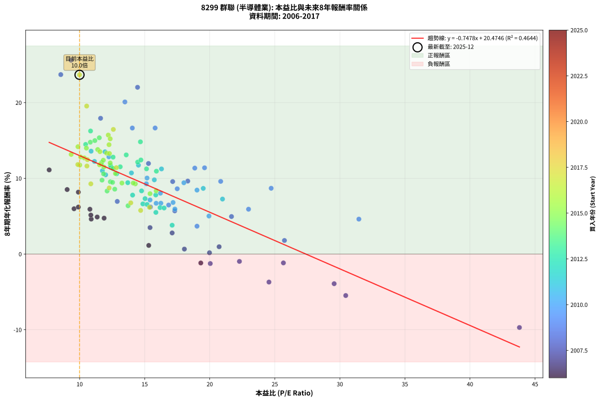
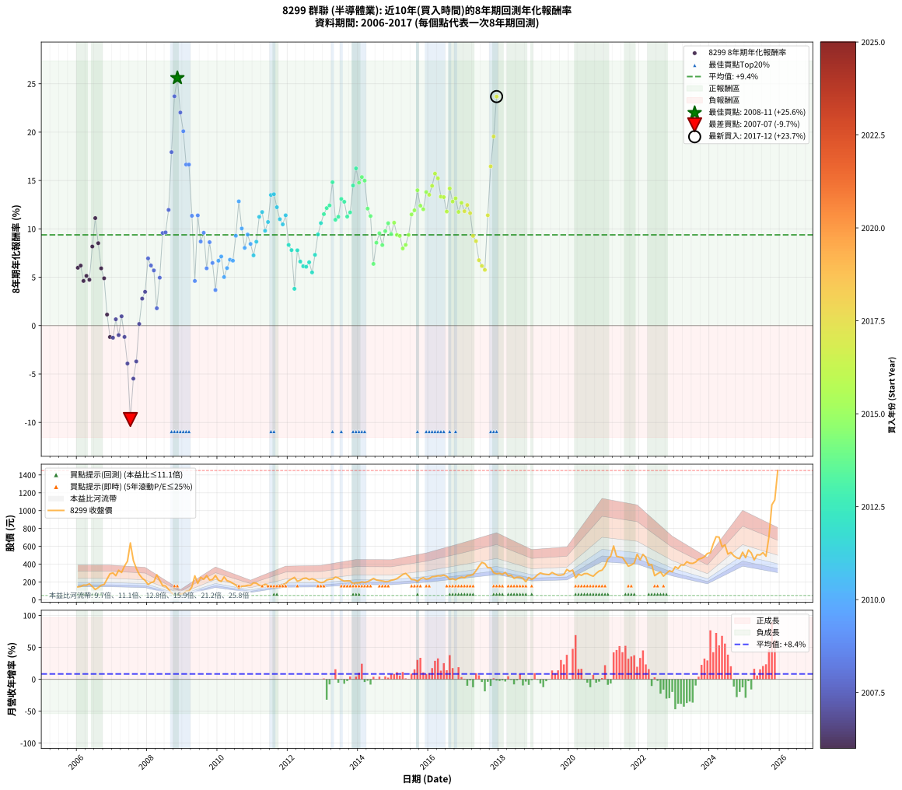

# 8299 群聯 - 本益比與未來報酬率分析

!!! info "報告資訊"
    - **股票代號**: 8299
    - **公司名稱**: 群聯
    - **產業別**: 半導體業
    - **分析期間**: 2006-2017 (144 個數據點)
    - **資料來源**: Type 12 (ShowMonthlyK_ChartFlow) 月收盤價與本益比
    - **報酬率口徑**: 含現金股利 (簡化: 年度合計，假設每年7/1入帳)
    - **報告生成時間**: 2026-01-04 08:52:04 CST

## 📈 視覺化圖表

### 圖表1: 本益比 vs 未來報酬率關係

*圖表1：8299 群聯 本益比與8年期未來報酬率關係 (2006-2017)*

### 圖表2: 歷年買入時點的8年期實際報酬率

*圖表2：8299 群聯 歷年買入時點的8年期實際報酬率 (2006-2017)*

## 📍 買點訊號說明

本報告提供兩種買點提示訊號（顯示於圖表2的股價子圖中）：

### ▲ 小綠色三角形（回測驗證）
- **計算方式**: 使用全部歷史資料計算本益比第25百分位數
- **用途**: 事後驗證，顯示歷史上哪些時點確實為低估區
- **限制**: 當下無法判斷，僅供回測參考
- **特性**: 後見之明（Look-Ahead Bias）

### ▲ 小橘色三角形（即時訊號）
- **計算方式**: 使用截至當月的過去5年資料計算本益比第25百分位數
- **用途**: 實際投資決策，當時即可判斷
- **優勢**: 可操作性強，符合實務需求
- **特性**: 無後見之明，滾動窗口計算

!!! tip "如何使用兩種訊號"
    - **綠色▲** 幫助理解歷史估值機會，驗證策略有效性
    - **橘色▲** 可作為實際買進參考，但仍需搭配基本面分析
    - 兩種訊號重疊時，表示即時判斷與事後驗證一致，信心度較高
    - 僅有綠色▲時，表示當時無法判斷（需要未來資料才能確認）
    - 僅有橘色▲時，表示即時判斷為買點，但事後可能不是最佳時機

## 📊 估值分析摘要

| 指標 | 數值 |
|:---:|:---:|
| **目前本益比** (2017-12) | **9.99 倍** |
| **歷史平均本益比** | 14.84 倍 |
| **估值水準** | 🟢 相對低估 |
| **預期8年年化報酬率** | **+13.00%** |
| **歷史平均報酬率** | +9.38% |
| **相關係數 (R²)** | 0.4644 |
| **趨勢線斜率** | -0.7478 |

!!! abstract "核心洞察"
    目前本益比顯著低於歷史平均，預期未來報酬率可能較高

    根據歷史數據回測，8299 群聯 在目前本益比 **10.0倍** 的估值水準下，
    預期未來8年年化報酬率約為 **+13.0%**。

    **重要提醒**: 本分析基於歷史數據統計，實際報酬率會受到公司基本面變化、產業趨勢、
    總體經濟環境等多重因素影響。R² = 0.46 表示本益比可解釋約 46.4% 的報酬率變異。

## 📈 歷史估值統計

### 最佳買點 (最高報酬率)

| 項目 | 數值 |
|:---:|:---:|
| 起始時間 | 2008-11 |
| 當時本益比 | 9.34 倍 |
| 起始價格 | 49.1 元 |
| 8年後價格 | 243.5 元 |
| **8年年化報酬率** | **+25.60%** |

### 最差買點 (最低報酬率)

| 項目 | 數值 |
|:---:|:---:|
| 起始時間 | 2007-07 |
| 當時本益比 | 43.80 倍 |
| 起始價格 | 638.0 元 |
| 8年後價格 | 227.5 元 |
| **8年年化報酬率** | **-9.71%** |

## 🎯 投資啟示

### 本益比與報酬率關係

趨勢線方程式: **y = -0.7478x + 20.4746**

!!! warning "強負相關"
    本益比與未來報酬率呈現強負相關。在高本益比時期買入，未來報酬率顯著較低；
    在低本益比時期買入，未來報酬率顯著較高。**估值紀律至關重要**。

### 估值區間建議

基於歷史數據分析:

- **🟢 低估區** (P/E < 11.9): 預期報酬率較高，可考慮增加持股
- **🟡 合理區** (P/E 11.9-17.8): 預期報酬率符合長期趨勢，正常持有
- **🔴 高估區** (P/E > 17.8): 預期報酬率較低，可考慮減碼或觀望

!!! danger "風險提示"
    - 過去表現不代表未來結果
    - 本分析假設公司基本面無重大結構性變化
    - 產業環境劇變可能使歷史規律失效
    - 應結合公司財報、產業趨勢、總體經濟等多重因素綜合判斷

!!! success "長期投資觀點"
    歷史數據顯示，在合理或低估的估值水準買入並長期持有，
    往往能獲得較佳的投資報酬。**耐心等待好價格**是價值投資的核心原則。

## 📊 數據品質

- **資料來源**: GoodInfo.tw Type 12 (ShowMonthlyK_ChartFlow)
- **資料頻率**: 月度收盤價與本益比
- **回測期間**: 2006-2017
- **數據點數量**: 144 個 (每個點代表一次8年期回測)

### 計算方法說明

1. **8年期年化報酬率**:
   - 對每個歷史時點，計算其後8年的實際投資報酬率
   - 期末價值(不含股利): 期末價格
   - 期末價值(含現金股利): 期末價格 + 持有期間內的現金股利合計 (簡化: 年度合計，假設每年7/1入帳)
   - 公式: 年化報酬率 = [(期末價值/期初價格)^(1/年數) - 1] × 100%

2. **本益比 (P/E Ratio)**:
   - 使用當時的月收盤價與EPS計算
   - 資料來源: Type 12 月度河流圖本益比數據

3. **趨勢線 (Linear Regression)**:
   - 使用最小平方法擬合線性趨勢線
   - R²值衡量本益比對報酬率的解釋能力

---

*本報告由 Stock Analysis System v1.9.0 自動生成*
*數據更新時間: 2026-01-04 08:52:04 CST*

## 📋 月度回測明細表

（每一列對應時間線圖中的一個買入點；可用來對照 SVG 圖上的每個點。）

| 買入月份 | 賣出月份 | 回測期限_年 | 實際持有年數 | 買入本益比_倍 | 買入收盤價_元 | 賣出收盤價_元 | 現金股利合計_元 | 總報酬率_pct | 年化報酬率_pct |
| --- | --- | --- | --- | --- | --- | --- | --- | --- | --- |
| 2006-01 | 2014-01 | 8 | 8.000 | 9.57 | 145.00 | 190.00 | 40.75 | +59.14 | +5.98 |
| 2006-02 | 2014-02 | 8 | 8.000 | 9.90 | 150.00 | 202.00 | 40.75 | +61.83 | +6.20 |
| 2006-03 | 2014-03 | 8 | 8.000 | 10.89 | 165.00 | 196.00 | 40.75 | +43.48 | +4.62 |
| 2006-04 | 2014-04 | 8 | 8.000 | 10.86 | 164.50 | 205.00 | 40.75 | +49.39 | +5.15 |
| 2006-05 | 2014-05 | 8 | 8.000 | 11.88 | 180.00 | 220.00 | 40.75 | +44.86 | +4.74 |
| 2006-06 | 2014-06 | 8 | 8.000 | 9.90 | 150.00 | 240.50 | 40.75 | +87.50 | +8.17 |
| 2006-07 | 2014-07 | 8 | 8.000 | 7.66 | 116.00 | 222.50 | 46.99 | +132.32 | +11.11 |
| 2006-08 | 2014-08 | 8 | 8.000 | 9.04 | 137.00 | 216.50 | 46.99 | +92.33 | +8.52 |
| 2006-09 | 2014-09 | 8 | 8.000 | 10.79 | 163.50 | 212.00 | 46.99 | +58.41 | +5.92 |
| 2006-10 | 2014-10 | 8 | 8.000 | 11.35 | 172.00 | 205.00 | 46.99 | +46.51 | +4.89 |
| 2006-11 | 2014-11 | 8 | 8.000 | 15.31 | 232.00 | 207.00 | 46.99 | +9.48 | +1.14 |
| 2006-12 | 2014-12 | 8 | 8.000 | 19.31 | 292.50 | 219.00 | 46.99 | -9.06 | -1.18 |
| 2007-01 | 2015-01 | 8 | 8.000 | 20.04 | 302.00 | 226.00 | 46.99 | -9.60 | -1.25 |
| 2007-02 | 2015-02 | 8 | 8.000 | 18.05 | 270.50 | 238.00 | 46.99 | +5.36 | +0.65 |
| 2007-03 | 2015-03 | 8 | 8.000 | 22.28 | 332.00 | 260.00 | 46.99 | -7.53 | -0.97 |
| 2007-04 | 2015-04 | 8 | 8.000 | 20.72 | 307.00 | 284.50 | 46.99 | +7.98 | +0.96 |
| 2007-05 | 2015-05 | 8 | 8.000 | 25.66 | 378.00 | 297.00 | 46.99 | -9.00 | -1.17 |
| 2007-06 | 2015-06 | 8 | 8.000 | 29.56 | 433.00 | 267.50 | 46.99 | -27.37 | -3.92 |
| 2007-07 | 2015-07 | 8 | 8.000 | 43.80 | 638.00 | 227.50 | 54.40 | -55.81 | -9.71 |
| 2007-08 | 2015-08 | 8 | 8.000 | 30.45 | 441.00 | 226.50 | 54.40 | -36.30 | -5.48 |
| 2007-09 | 2015-09 | 8 | 8.000 | 24.55 | 353.50 | 207.00 | 54.40 | -26.05 | -3.70 |
| 2007-10 | 2015-10 | 8 | 8.000 | 19.98 | 286.00 | 235.50 | 54.40 | +1.36 | +0.17 |
| 2007-11 | 2015-11 | 8 | 8.000 | 17.11 | 243.50 | 249.00 | 54.40 | +24.60 | +2.79 |
| 2007-12 | 2015-12 | 8 | 8.000 | 15.41 | 218.00 | 232.50 | 54.40 | +31.61 | +3.49 |
| 2008-01 | 2016-01 | 8 | 8.000 | 12.89 | 172.00 | 240.00 | 54.40 | +71.16 | +6.95 |
| 2008-02 | 2016-02 | 8 | 8.000 | 15.44 | 193.50 | 259.00 | 54.40 | +61.97 | +6.21 |
| 2008-03 | 2016-03 | 8 | 8.000 | 17.31 | 203.00 | 262.00 | 54.40 | +55.86 | +5.70 |
| 2008-04 | 2016-04 | 8 | 8.000 | 25.74 | 281.00 | 269.50 | 54.40 | +15.27 | +1.79 |
| 2008-05 | 2016-05 | 8 | 8.000 | 21.67 | 219.00 | 268.00 | 54.40 | +47.22 | +4.95 |
| 2008-06 | 2016-06 | 8 | 8.000 | 17.15 | 159.50 | 277.00 | 54.40 | +107.78 | +9.57 |
| 2008-07 | 2016-07 | 8 | 8.000 | 18.31 | 155.50 | 264.00 | 60.59 | +108.74 | +9.64 |
| 2008-08 | 2016-08 | 8 | 8.000 | 15.29 | 117.50 | 229.50 | 60.59 | +146.89 | +11.96 |
| 2008-09 | 2016-09 | 8 | 8.000 | 11.61 | 79.80 | 238.00 | 60.59 | +274.18 | +17.93 |
| 2008-10 | 2016-10 | 8 | 8.000 | 8.55 | 51.90 | 224.00 | 60.59 | +448.35 | +23.70 |
| 2008-11 | 2016-11 | 8 | 8.000 | 9.34 | 49.10 | 243.50 | 60.59 | +519.34 | +25.60 |
| 2008-12 | 2016-12 | 8 | 8.000 | 14.45 | 64.30 | 255.50 | 60.59 | +391.59 | +22.03 |
| 2009-01 | 2017-01 | 8 | 8.000 | 13.48 | 71.10 | 247.00 | 60.59 | +332.62 | +20.09 |
| 2009-02 | 2017-02 | 8 | 8.000 | 15.80 | 96.30 | 269.50 | 60.59 | +242.78 | +16.65 |
| 2009-03 | 2017-03 | 8 | 8.000 | 14.05 | 97.20 | 272.50 | 60.59 | +242.69 | +16.64 |
| 2009-04 | 2017-04 | 8 | 8.000 | 18.85 | 146.00 | 284.50 | 60.59 | +136.37 | +11.35 |
| 2009-05 | 2017-05 | 8 | 8.000 | 31.46 | 269.50 | 326.00 | 60.59 | +43.45 | +4.61 |
| 2009-06 | 2017-06 | 8 | 8.000 | 19.60 | 184.00 | 375.50 | 60.59 | +137.01 | +11.39 |
| 2009-07 | 2017-07 | 8 | 8.000 | 24.72 | 252.50 | 420.00 | 71.76 | +94.76 | +8.69 |
| 2009-08 | 2017-08 | 8 | 8.000 | 20.84 | 230.00 | 407.00 | 71.76 | +108.16 | +9.60 |
| 2009-09 | 2017-09 | 8 | 8.000 | 22.98 | 272.50 | 360.00 | 71.76 | +58.44 | +5.92 |
| 2009-10 | 2017-10 | 8 | 8.000 | 17.50 | 222.00 | 358.50 | 71.76 | +93.81 | +8.62 |
| 2009-11 | 2017-11 | 8 | 8.000 | 16.84 | 227.50 | 304.00 | 71.76 | +65.17 | +6.47 |
| 2009-12 | 2017-12 | 8 | 8.000 | 19.02 | 272.50 | 292.00 | 71.76 | +33.49 | +3.68 |
| 2010-01 | 2018-01 | 8 | 8.000 | 15.88 | 220.00 | 298.00 | 71.76 | +68.07 | +6.71 |
| 2010-02 | 2018-02 | 8 | 8.000 | 15.41 | 206.00 | 286.00 | 71.76 | +73.67 | +7.14 |
| 2010-03 | 2018-03 | 8 | 8.000 | 19.94 | 257.00 | 308.50 | 71.76 | +47.96 | +5.02 |
| 2010-04 | 2018-04 | 8 | 8.000 | 17.32 | 215.00 | 269.50 | 71.76 | +58.73 | +5.95 |
| 2010-05 | 2018-05 | 8 | 8.000 | 17.18 | 205.00 | 275.50 | 71.76 | +69.40 | +6.81 |
| 2010-06 | 2018-06 | 8 | 8.000 | 16.24 | 186.00 | 241.00 | 71.76 | +68.15 | +6.71 |
| 2010-07 | 2018-07 | 8 | 8.000 | 15.13 | 166.00 | 254.00 | 83.76 | +103.47 | +9.29 |
| 2010-08 | 2018-08 | 8 | 8.000 | 12.25 | 128.50 | 254.00 | 83.76 | +162.85 | +12.84 |
| 2010-09 | 2018-09 | 8 | 8.000 | 15.18 | 152.00 | 243.00 | 83.76 | +114.97 | +10.04 |
| 2010-10 | 2018-10 | 8 | 8.000 | 16.21 | 154.50 | 203.00 | 83.76 | +85.61 | +8.04 |
| 2010-11 | 2018-11 | 8 | 8.000 | 18.01 | 163.00 | 251.00 | 83.76 | +105.37 | +9.41 |
| 2010-12 | 2018-12 | 8 | 8.000 | 19.02 | 163.00 | 228.00 | 83.76 | +91.26 | +8.44 |
| 2011-01 | 2019-01 | 8 | 8.000 | 20.98 | 190.50 | 250.00 | 83.76 | +75.20 | +7.26 |
| 2011-02 | 2019-02 | 8 | 8.000 | 19.50 | 187.00 | 280.00 | 83.76 | +94.52 | +8.67 |
| 2011-03 | 2019-03 | 8 | 8.000 | 16.29 | 164.50 | 302.00 | 83.76 | +134.51 | +11.24 |
| 2011-04 | 2019-04 | 8 | 8.000 | 14.52 | 154.00 | 290.50 | 83.76 | +143.03 | +11.74 |
| 2011-05 | 2019-05 | 8 | 8.000 | 15.74 | 175.00 | 286.00 | 83.76 | +111.29 | +9.80 |
| 2011-06 | 2019-06 | 8 | 8.000 | 13.98 | 162.50 | 283.00 | 83.76 | +125.70 | +10.71 |
| 2011-07 | 2019-07 | 8 | 8.000 | 11.95 | 145.00 | 307.00 | 92.42 | +175.46 | +13.50 |
| 2011-08 | 2019-08 | 8 | 8.000 | 10.88 | 137.50 | 288.50 | 92.42 | +177.03 | +13.58 |
| 2011-09 | 2019-09 | 8 | 8.000 | 11.14 | 146.50 | 276.50 | 92.42 | +151.82 | +12.24 |
| 2011-10 | 2019-10 | 8 | 8.000 | 11.75 | 160.50 | 277.50 | 92.42 | +130.48 | +11.00 |
| 2011-11 | 2019-11 | 8 | 8.000 | 12.00 | 170.00 | 284.50 | 92.42 | +121.72 | +10.46 |
| 2011-12 | 2019-12 | 8 | 8.000 | 12.43 | 182.50 | 340.50 | 92.42 | +137.21 | +11.40 |
| 2012-01 | 2020-01 | 8 | 8.000 | 14.76 | 217.00 | 319.50 | 92.42 | +89.82 | +8.34 |
| 2012-02 | 2020-02 | 8 | 8.000 | 15.85 | 233.50 | 333.50 | 92.42 | +82.41 | +7.80 |
| 2012-03 | 2020-03 | 8 | 8.000 | 17.11 | 252.50 | 248.00 | 92.42 | +34.82 | +3.81 |
| 2012-04 | 2020-04 | 8 | 8.000 | 14.07 | 208.00 | 286.50 | 92.42 | +82.17 | +7.79 |
| 2012-05 | 2020-05 | 8 | 8.000 | 14.86 | 220.00 | 275.00 | 92.42 | +67.01 | +6.62 |
| 2012-06 | 2020-06 | 8 | 8.000 | 16.18 | 240.00 | 294.00 | 92.42 | +61.01 | +6.13 |
| 2012-07 | 2020-07 | 8 | 8.000 | 16.49 | 245.00 | 294.50 | 98.42 | +60.38 | +6.08 |
| 2012-08 | 2020-08 | 8 | 8.000 | 15.18 | 226.00 | 277.00 | 98.42 | +66.12 | +6.55 |
| 2012-09 | 2020-09 | 8 | 8.000 | 15.86 | 236.50 | 264.50 | 98.42 | +53.45 | +5.50 |
| 2012-10 | 2020-10 | 8 | 8.000 | 15.03 | 224.50 | 296.50 | 98.42 | +75.91 | +7.32 |
| 2012-11 | 2020-11 | 8 | 8.000 | 13.70 | 205.00 | 323.00 | 98.42 | +105.57 | +9.43 |
| 2012-12 | 2020-12 | 8 | 8.000 | 12.84 | 192.50 | 332.50 | 98.42 | +123.85 | +10.60 |
| 2013-01 | 2021-01 | 8 | 8.000 | 13.12 | 199.50 | 379.00 | 98.42 | +139.31 | +11.52 |
| 2013-02 | 2021-02 | 8 | 8.000 | 14.46 | 223.00 | 459.50 | 98.42 | +150.19 | +12.15 |
| 2013-03 | 2021-03 | 8 | 8.000 | 14.71 | 230.00 | 488.50 | 98.42 | +155.18 | +12.42 |
| 2013-04 | 2021-04 | 8 | 8.000 | 14.67 | 232.50 | 604.00 | 98.42 | +202.12 | +14.82 |
| 2013-05 | 2021-05 | 8 | 8.000 | 15.90 | 255.50 | 488.00 | 98.42 | +129.52 | +10.94 |
| 2013-06 | 2021-06 | 8 | 8.000 | 15.14 | 246.50 | 480.00 | 98.42 | +134.65 | +11.25 |
| 2013-07 | 2021-07 | 8 | 8.000 | 13.58 | 224.00 | 476.00 | 123.42 | +167.60 | +13.09 |
| 2013-08 | 2021-08 | 8 | 8.000 | 12.57 | 210.00 | 427.00 | 123.42 | +162.10 | +12.80 |
| 2013-09 | 2021-09 | 8 | 8.000 | 12.58 | 213.00 | 377.00 | 123.42 | +134.94 | +11.27 |
| 2013-10 | 2021-10 | 8 | 8.000 | 12.37 | 212.00 | 390.50 | 123.42 | +142.42 | +11.70 |
| 2013-11 | 2021-11 | 8 | 8.000 | 10.46 | 181.50 | 412.00 | 123.42 | +195.00 | +14.48 |
| 2013-12 | 2021-12 | 8 | 8.000 | 10.84 | 190.50 | 512.00 | 123.42 | +233.55 | +16.25 |
| 2014-01 | 2022-01 | 8 | 8.000 | 10.82 | 190.00 | 448.50 | 123.42 | +201.01 | +14.77 |
| 2014-02 | 2022-02 | 8 | 8.000 | 11.51 | 202.00 | 510.00 | 123.42 | +213.57 | +15.36 |
| 2014-03 | 2022-03 | 8 | 8.000 | 11.17 | 196.00 | 475.50 | 123.42 | +205.57 | +14.98 |
| 2014-04 | 2022-04 | 8 | 8.000 | 11.69 | 205.00 | 387.50 | 123.42 | +149.23 | +12.09 |
| 2014-05 | 2022-05 | 8 | 8.000 | 12.55 | 220.00 | 395.50 | 123.42 | +135.87 | +11.32 |
| 2014-06 | 2022-06 | 8 | 8.000 | 13.72 | 240.50 | 271.00 | 123.42 | +64.00 | +6.38 |
| 2014-07 | 2022-07 | 8 | 8.000 | 12.70 | 222.50 | 293.00 | 136.48 | +93.02 | +8.57 |
| 2014-08 | 2022-08 | 8 | 8.000 | 12.36 | 216.50 | 312.50 | 136.48 | +107.38 | +9.55 |
| 2014-09 | 2022-09 | 8 | 8.000 | 12.11 | 212.00 | 265.50 | 136.48 | +89.61 | +8.33 |
| 2014-10 | 2022-10 | 8 | 8.000 | 11.72 | 205.00 | 295.50 | 136.48 | +110.72 | +9.76 |
| 2014-11 | 2022-11 | 8 | 8.000 | 11.84 | 207.00 | 326.50 | 136.48 | +123.66 | +10.59 |
| 2014-12 | 2022-12 | 8 | 8.000 | 12.53 | 219.00 | 315.00 | 136.48 | +106.16 | +9.46 |
| 2015-01 | 2023-01 | 8 | 8.000 | 12.75 | 226.00 | 371.00 | 136.48 | +124.55 | +10.64 |
| 2015-02 | 2023-02 | 8 | 8.000 | 13.25 | 238.00 | 351.00 | 136.48 | +104.82 | +9.38 |
| 2015-03 | 2023-03 | 8 | 8.000 | 14.28 | 260.00 | 392.00 | 136.48 | +103.26 | +9.27 |
| 2015-04 | 2023-04 | 8 | 8.000 | 15.41 | 284.50 | 389.00 | 136.48 | +84.70 | +7.97 |
| 2015-05 | 2023-05 | 8 | 8.000 | 15.88 | 297.00 | 427.50 | 136.48 | +89.89 | +8.35 |
| 2015-06 | 2023-06 | 8 | 8.000 | 14.12 | 267.50 | 411.50 | 136.48 | +104.85 | +9.38 |
| 2015-07 | 2023-07 | 8 | 8.000 | 11.86 | 227.50 | 409.00 | 134.16 | +138.75 | +11.49 |
| 2015-08 | 2023-08 | 8 | 8.000 | 11.66 | 226.50 | 423.50 | 134.16 | +146.21 | +11.92 |
| 2015-09 | 2023-09 | 8 | 8.000 | 10.52 | 207.00 | 456.00 | 134.16 | +185.10 | +13.99 |
| 2015-10 | 2023-10 | 8 | 8.000 | 11.82 | 235.50 | 465.50 | 134.16 | +154.63 | +12.39 |
| 2015-11 | 2023-11 | 8 | 8.000 | 12.35 | 249.00 | 483.50 | 134.16 | +148.05 | +12.03 |
| 2015-12 | 2023-12 | 8 | 8.000 | 11.39 | 232.50 | 520.00 | 134.16 | +181.36 | +13.80 |
| 2016-01 | 2024-01 | 8 | 8.000 | 11.56 | 240.00 | 528.00 | 134.16 | +175.90 | +13.53 |
| 2016-02 | 2024-02 | 8 | 8.000 | 12.26 | 259.00 | 628.00 | 134.16 | +194.27 | +14.44 |
| 2016-03 | 2024-03 | 8 | 8.000 | 12.20 | 262.00 | 708.00 | 134.16 | +221.43 | +15.71 |
| 2016-04 | 2024-04 | 8 | 8.000 | 12.35 | 269.50 | 703.00 | 134.16 | +210.63 | +15.22 |
| 2016-05 | 2024-05 | 8 | 8.000 | 12.08 | 268.00 | 595.00 | 134.16 | +172.07 | +13.33 |
| 2016-06 | 2024-06 | 8 | 8.000 | 12.29 | 277.00 | 617.00 | 134.16 | +171.18 | +13.28 |
| 2016-07 | 2024-07 | 8 | 8.000 | 11.53 | 264.00 | 513.00 | 130.81 | +143.87 | +11.79 |
| 2016-08 | 2024-08 | 8 | 8.000 | 9.87 | 229.50 | 532.00 | 130.81 | +188.81 | +14.18 |
| 2016-09 | 2024-09 | 8 | 8.000 | 10.08 | 238.00 | 494.00 | 130.81 | +162.53 | +12.82 |
| 2016-10 | 2024-10 | 8 | 8.000 | 9.35 | 224.00 | 471.50 | 130.81 | +168.89 | +13.16 |
| 2016-11 | 2024-11 | 8 | 8.000 | 10.01 | 243.50 | 461.50 | 130.81 | +143.25 | +11.75 |
| 2016-12 | 2024-12 | 8 | 8.000 | 10.36 | 255.50 | 534.00 | 130.81 | +160.20 | +12.70 |
| 2017-01 | 2025-01 | 8 | 8.000 | 9.86 | 247.00 | 473.00 | 130.81 | +144.46 | +11.82 |
| 2017-02 | 2025-02 | 8 | 8.000 | 10.60 | 269.50 | 559.00 | 130.81 | +155.96 | +12.47 |
| 2017-03 | 2025-03 | 8 | 8.000 | 10.56 | 272.50 | 526.00 | 130.81 | +141.03 | +11.62 |
| 2017-04 | 2025-04 | 8 | 8.000 | 10.86 | 284.50 | 447.50 | 130.81 | +103.27 | +9.27 |
| 2017-05 | 2025-05 | 8 | 8.000 | 12.27 | 326.00 | 506.00 | 130.81 | +95.34 | +8.73 |
| 2017-06 | 2025-06 | 8 | 8.000 | 13.93 | 375.50 | 503.00 | 130.81 | +68.79 | +6.76 |
| 2017-07 | 2025-07 | 8 | 8.000 | 15.37 | 420.00 | 530.00 | 148.12 | +61.46 | +6.17 |
| 2017-08 | 2025-08 | 8 | 8.000 | 14.69 | 407.00 | 489.00 | 148.12 | +56.54 | +5.76 |
| 2017-09 | 2025-09 | 8 | 8.000 | 12.82 | 360.00 | 706.00 | 148.12 | +137.26 | +11.40 |
| 2017-10 | 2025-10 | 8 | 8.000 | 12.59 | 358.50 | 1065.00 | 148.12 | +238.39 | +16.46 |
| 2017-11 | 2025-11 | 8 | 8.000 | 10.54 | 304.00 | 1120.00 | 148.12 | +317.15 | +19.55 |
| 2017-12 | 2025-12 | 8 | 8.000 | 9.99 | 292.00 | 1450.00 | 148.12 | +447.30 | +23.67 |
