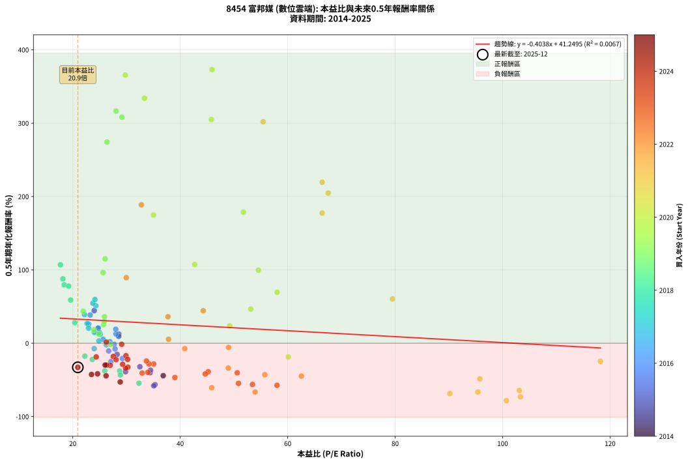

# 8454 富邦媒 - 本益比與未來報酬率分析

!!! info "報告資訊"
    - **股票代號**: 8454
    - **公司名稱**: 富邦媒
    - **產業別**: 數位雲端
    - **分析期間**: 2014-2025 (127 個數據點)
    - **資料來源**: Type 12 (ShowMonthlyK_ChartFlow) 月收盤價與本益比
    - **報酬率口徑**: 含現金股利 (簡化: 年度合計，假設每年7/1入帳)
    - **報告生成時間**: 2026-01-11 19:13:45 CST

## 📈 視覺化圖表

### 圖表1: 本益比 vs 未來報酬率關係

*圖表1：8454 富邦媒 本益比與0.5年期未來報酬率關係 (2014-2025)*

### 圖表2: 歷年買入時點的0.5年期實際報酬率

*圖表2：8454 富邦媒 歷年買入時點的0.5年期實際報酬率 (2014-2025)*

## 📍 買點訊號說明

本報告提供兩種買點提示訊號（顯示於圖表2的股價子圖中）：

### ▲ 小綠色三角形（回測驗證）
- **計算方式**: 使用全部歷史資料計算本益比第25百分位數
- **用途**: 事後驗證，顯示歷史上哪些時點確實為低估區
- **限制**: 當下無法判斷，僅供回測參考
- **特性**: 後見之明（Look-Ahead Bias）

### ▲ 小橘色三角形（即時訊號）
- **計算方式**: 使用截至當月的過去5年資料計算本益比第25百分位數
- **用途**: 實際投資決策，當時即可判斷
- **優勢**: 可操作性強，符合實務需求
- **特性**: 無後見之明，滾動窗口計算

!!! tip "如何使用兩種訊號"
    - **綠色▲** 幫助理解歷史估值機會，驗證策略有效性
    - **橘色▲** 可作為實際買進參考，但仍需搭配基本面分析
    - 兩種訊號重疊時，表示即時判斷與事後驗證一致，信心度較高
    - 僅有綠色▲時，表示當時無法判斷（需要未來資料才能確認）
    - 僅有橘色▲時，表示即時判斷為買點，但事後可能不是最佳時機

## 📊 估值分析摘要

| 指標 | 數值 |
|:---:|:---:|
| **目前本益比** (2025-06) | **20.94 倍** |
| **歷史平均本益比** | 37.25 倍 |
| **估值水準** | 🟢 相對低估 |
| **預期0.5年年化報酬率** | **+32.79%** |
| **歷史平均報酬率** | +26.21% |
| **相關係數 (R²)** | 0.0067 |
| **趨勢線斜率** | -0.4038 |

!!! abstract "核心洞察"
    目前本益比顯著低於歷史平均，預期未來報酬率可能較高

    根據歷史數據回測，8454 富邦媒 在目前本益比 **20.9倍** 的估值水準下，
    預期未來0.5年年化報酬率約為 **+32.8%**。

    **重要提醒**: 本分析基於歷史數據統計，實際報酬率會受到公司基本面變化、產業趨勢、
    總體經濟環境等多重因素影響。R² = 0.01 表示本益比可解釋約 0.7% 的報酬率變異。

## 📈 歷史估值統計

### 最佳買點 (最高報酬率)

| 項目 | 數值 |
|:---:|:---:|
| 起始時間 | 2020-12 |
| 當時本益比 | 45.93 倍 |
| 起始價格 | 637.0 元 |
| 0.5年後價格 | 1560.0 元 |
| **0.5年年化報酬率** | **+373.10%** |

### 最差買點 (最低報酬率)

| 項目 | 數值 |
|:---:|:---:|
| 起始時間 | 2021-11 |
| 當時本益比 | 100.70 倍 |
| 起始價格 | 1780.0 元 |
| 0.5年後價格 | 835.0 元 |
| **0.5年年化報酬率** | **-78.29%** |

## 🎯 投資啟示

### 本益比與報酬率關係

趨勢線方程式: **y = -0.4038x + 41.2495**

!!! note "負相關"
    本益比與未來報酬率呈現負相關。較低的本益比通常帶來較高的未來報酬率，
    但相關性不算非常強。**估值仍是重要參考指標之一**。

### 估值區間建議

基於歷史數據分析:

- **🟢 低估區** (P/E < 29.8): 預期報酬率較高，可考慮增加持股
- **🟡 合理區** (P/E 29.8-44.7): 預期報酬率符合長期趨勢，正常持有
- **🔴 高估區** (P/E > 44.7): 預期報酬率較低，可考慮減碼或觀望

!!! danger "風險提示"
    - 過去表現不代表未來結果
    - 本分析假設公司基本面無重大結構性變化
    - 產業環境劇變可能使歷史規律失效
    - 應結合公司財報、產業趨勢、總體經濟等多重因素綜合判斷

!!! success "長期投資觀點"
    歷史數據顯示，在合理或低估的估值水準買入並長期持有，
    往往能獲得較佳的投資報酬。**耐心等待好價格**是價值投資的核心原則。

## 📊 數據品質

- **資料來源**: GoodInfo.tw Type 12 (ShowMonthlyK_ChartFlow)
- **資料頻率**: 月度收盤價與本益比
- **回測期間**: 2014-2025
- **數據點數量**: 127 個 (每個點代表一次0.5年期回測)

### 計算方法說明

1. **0.5年期年化報酬率**:
   - 對每個歷史時點，計算其後0.5年的實際投資報酬率
   - 期末價值(不含股利): 期末價格
   - 期末價值(含現金股利): 期末價格 + 持有期間內的現金股利合計 (簡化: 年度合計，假設每年7/1入帳)
   - 公式: 年化報酬率 = [(期末價值/期初價格)^(1/年數) - 1] × 100%

2. **本益比 (P/E Ratio)**:
   - 使用當時的月收盤價與EPS計算
   - 資料來源: Type 12 月度河流圖本益比數據

3. **趨勢線 (Linear Regression)**:
   - 使用最小平方法擬合線性趨勢線
   - R²值衡量本益比對報酬率的解釋能力

---

*本報告由 Stock Analysis System v1.9.0 自動生成*
*數據更新時間: 2026-01-11 19:13:45 CST*

## 📋 月度回測明細表

（每一列對應時間線圖中的一個買入點；可用來對照 SVG 圖上的每個點。）

| 買入月份 | 賣出月份 | 回測期限_年 | 實際持有年數 | 買入本益比_倍 | 買入收盤價_元 | 賣出收盤價_元 | 現金股利合計_元 | 總報酬率_pct | 年化報酬率_pct |
| --- | --- | --- | --- | --- | --- | --- | --- | --- | --- |
| 2014-12 | 2015-07 | 0.5 | 0.580 | 36.83 | 335.50 | 230.50 | 8.48 | -28.77 | -44.26 |
| 2015-01 | 2015-07 | 0.5 | 0.496 | 34.38 | 308.50 | 230.50 | 8.48 | -22.53 | -40.27 |
| 2015-02 | 2015-08 | 0.5 | 0.498 | 35.30 | 312.00 | 197.50 | 8.48 | -33.98 | -56.54 |
| 2015-03 | 2015-10 | 0.5 | 0.586 | 29.82 | 259.50 | 186.00 | 8.48 | -25.06 | -38.88 |
| 2015-04 | 2015-10 | 0.5 | 0.501 | 35.08 | 300.50 | 186.00 | 8.48 | -35.28 | -58.04 |
| 2015-05 | 2015-12 | 0.5 | 0.586 | 34.46 | 290.50 | 213.50 | 8.48 | -23.59 | -36.82 |
| 2015-06 | 2015-12 | 0.5 | 0.501 | 32.49 | 269.50 | 213.50 | 8.48 | -17.63 | -32.10 |
| 2015-07 | 2016-01 | 0.5 | 0.504 | 28.25 | 230.50 | 212.00 | 0.00 | -8.03 | -15.30 |
| 2015-08 | 2016-03 | 0.5 | 0.583 | 24.62 | 197.50 | 214.00 | 0.00 | +8.35 | +14.75 |
| 2015-09 | 2016-03 | 0.5 | 0.498 | 24.72 | 195.00 | 214.00 | 0.00 | +9.74 | +20.51 |
| 2015-10 | 2016-05 | 0.5 | 0.583 | 23.99 | 186.00 | 230.50 | 0.00 | +23.92 | +44.46 |
| 2015-11 | 2016-05 | 0.5 | 0.498 | 28.56 | 217.50 | 230.50 | 0.00 | +5.98 | +12.36 |
| 2015-12 | 2016-07 | 0.5 | 0.583 | 28.54 | 213.50 | 218.00 | 7.00 | +5.39 | +9.41 |
| 2016-01 | 2016-07 | 0.5 | 0.498 | 28.04 | 212.00 | 218.00 | 7.00 | +6.13 | +12.69 |
| 2016-02 | 2016-08 | 0.5 | 0.501 | 28.00 | 214.00 | 226.50 | 7.00 | +9.11 | +19.01 |
| 2016-03 | 2016-10 | 0.5 | 0.586 | 27.71 | 214.00 | 205.00 | 7.00 | -0.93 | -1.59 |
| 2016-04 | 2016-10 | 0.5 | 0.501 | 26.91 | 210.00 | 205.00 | 7.00 | +0.95 | +1.91 |
| 2016-05 | 2016-12 | 0.5 | 0.586 | 29.24 | 230.50 | 194.00 | 7.00 | -12.80 | -20.84 |
| 2016-06 | 2016-12 | 0.5 | 0.501 | 26.68 | 212.50 | 194.00 | 7.00 | -5.41 | -10.51 |
| 2016-07 | 2017-01 | 0.5 | 0.504 | 27.09 | 218.00 | 188.50 | 0.00 | -13.53 | -25.07 |
| 2016-08 | 2017-03 | 0.5 | 0.580 | 27.87 | 226.50 | 216.00 | 0.00 | -4.64 | -7.85 |
| 2016-09 | 2017-03 | 0.5 | 0.496 | 25.65 | 210.50 | 216.00 | 0.00 | +2.61 | +5.34 |
| 2016-10 | 2017-05 | 0.5 | 0.580 | 24.73 | 205.00 | 228.50 | 0.00 | +11.46 | +20.56 |
| 2016-11 | 2017-05 | 0.5 | 0.496 | 23.24 | 194.50 | 228.50 | 0.00 | +17.48 | +38.42 |
| 2016-12 | 2017-07 | 0.5 | 0.580 | 22.96 | 194.00 | 214.00 | 8.00 | +14.43 | +26.15 |
| 2017-01 | 2017-07 | 0.5 | 0.496 | 22.17 | 188.50 | 214.00 | 8.00 | +17.77 | +39.11 |
| 2017-02 | 2017-08 | 0.5 | 0.498 | 22.68 | 194.00 | 210.50 | 8.00 | +12.63 | +26.96 |
| 2017-03 | 2017-10 | 0.5 | 0.586 | 25.10 | 216.00 | 223.00 | 8.00 | +6.94 | +12.14 |
| 2017-04 | 2017-10 | 0.5 | 0.501 | 24.95 | 216.00 | 223.00 | 8.00 | +6.94 | +14.34 |
| 2017-05 | 2017-12 | 0.5 | 0.586 | 26.24 | 228.50 | 217.50 | 8.00 | -1.31 | -2.23 |
| 2017-06 | 2017-12 | 0.5 | 0.501 | 24.03 | 210.50 | 217.50 | 8.00 | +7.13 | +14.73 |
| 2017-07 | 2018-01 | 0.5 | 0.504 | 24.29 | 214.00 | 263.50 | 0.00 | +23.13 | +51.14 |
| 2017-08 | 2018-03 | 0.5 | 0.580 | 23.75 | 210.50 | 271.00 | 0.00 | +28.74 | +54.54 |
| 2017-09 | 2018-03 | 0.5 | 0.496 | 24.12 | 215.00 | 271.00 | 0.00 | +26.05 | +59.54 |
| 2017-10 | 2018-05 | 0.5 | 0.580 | 24.87 | 223.00 | 227.00 | 0.00 | +1.79 | +3.11 |
| 2017-11 | 2018-05 | 0.5 | 0.496 | 22.95 | 207.00 | 227.00 | 0.00 | +9.66 | +20.46 |
| 2017-12 | 2018-07 | 0.5 | 0.580 | 23.98 | 217.50 | 200.00 | 8.00 | -4.37 | -7.41 |
| 2018-01 | 2018-07 | 0.5 | 0.496 | 28.71 | 263.50 | 200.00 | 8.00 | -21.06 | -37.95 |
| 2018-02 | 2018-08 | 0.5 | 0.498 | 32.32 | 300.00 | 194.50 | 8.00 | -32.50 | -54.56 |
| 2018-03 | 2018-10 | 0.5 | 0.586 | 28.86 | 271.00 | 186.50 | 8.00 | -28.23 | -43.23 |
| 2018-04 | 2018-10 | 0.5 | 0.501 | 25.96 | 246.50 | 186.50 | 8.00 | -21.10 | -37.68 |
| 2018-05 | 2018-12 | 0.5 | 0.586 | 23.64 | 227.00 | 188.00 | 8.00 | -13.66 | -22.17 |
| 2018-06 | 2018-12 | 0.5 | 0.501 | 22.25 | 216.00 | 188.00 | 8.00 | -9.26 | -17.63 |
| 2018-07 | 2019-01 | 0.5 | 0.504 | 20.37 | 200.00 | 226.50 | 0.00 | +13.25 | +28.02 |
| 2018-08 | 2019-03 | 0.5 | 0.580 | 19.60 | 194.50 | 254.50 | 0.00 | +30.85 | +58.92 |
| 2018-09 | 2019-03 | 0.5 | 0.496 | 17.70 | 177.50 | 254.50 | 0.00 | +43.38 | +106.91 |
| 2018-10 | 2019-05 | 0.5 | 0.580 | 18.40 | 186.50 | 262.00 | 0.00 | +40.48 | +79.61 |
| 2018-11 | 2019-05 | 0.5 | 0.496 | 19.23 | 197.00 | 262.00 | 0.00 | +32.99 | +77.78 |
| 2018-12 | 2019-07 | 0.5 | 0.580 | 18.16 | 188.00 | 262.00 | 9.00 | +44.15 | +87.76 |
| 2019-01 | 2019-07 | 0.5 | 0.496 | 21.95 | 226.50 | 262.00 | 9.00 | +19.65 | +43.62 |
| 2019-02 | 2019-08 | 0.5 | 0.498 | 23.92 | 246.00 | 258.50 | 9.00 | +8.74 | +18.31 |
| 2019-03 | 2019-10 | 0.5 | 0.586 | 24.83 | 254.50 | 264.00 | 9.00 | +7.27 | +12.72 |
| 2019-04 | 2019-10 | 0.5 | 0.501 | 26.97 | 275.50 | 264.00 | 9.00 | -0.91 | -1.80 |
| 2019-05 | 2019-12 | 0.5 | 0.586 | 25.73 | 262.00 | 290.00 | 9.00 | +14.12 | +25.29 |
| 2019-06 | 2019-12 | 0.5 | 0.501 | 25.86 | 262.50 | 290.00 | 9.00 | +13.90 | +29.67 |
| 2019-07 | 2020-01 | 0.5 | 0.504 | 25.90 | 262.00 | 306.00 | 0.00 | +16.79 | +36.09 |
| 2019-08 | 2020-03 | 0.5 | 0.583 | 25.64 | 258.50 | 383.00 | 0.00 | +48.16 | +96.24 |
| 2019-09 | 2020-03 | 0.5 | 0.498 | 26.02 | 261.50 | 383.00 | 0.00 | +46.46 | +115.08 |
| 2019-10 | 2020-05 | 0.5 | 0.583 | 26.36 | 264.00 | 570.00 | 0.00 | +115.91 | +274.29 |
| 2019-11 | 2020-05 | 0.5 | 0.498 | 28.05 | 280.00 | 570.00 | 0.00 | +103.57 | +316.44 |
| 2019-12 | 2020-07 | 0.5 | 0.583 | 29.15 | 290.00 | 650.00 | 8.50 | +127.07 | +308.07 |
| 2020-01 | 2020-07 | 0.5 | 0.498 | 29.78 | 306.00 | 650.00 | 8.50 | +115.20 | +365.54 |
| 2020-02 | 2020-08 | 0.5 | 0.501 | 33.34 | 353.50 | 729.00 | 8.50 | +108.63 | +333.95 |
| 2020-03 | 2020-10 | 0.5 | 0.586 | 35.04 | 383.00 | 684.00 | 8.50 | +80.81 | +174.80 |
| 2020-04 | 2020-10 | 0.5 | 0.501 | 42.69 | 480.50 | 684.00 | 8.50 | +44.12 | +107.40 |
| 2020-05 | 2020-12 | 0.5 | 0.586 | 49.21 | 570.00 | 637.00 | 8.50 | +13.25 | +23.65 |
| 2020-06 | 2020-12 | 0.5 | 0.501 | 60.12 | 716.00 | 637.00 | 8.50 | -9.85 | -18.69 |
| 2020-07 | 2021-01 | 0.5 | 0.504 | 53.12 | 650.00 | 788.00 | 0.00 | +21.23 | +46.55 |
| 2020-08 | 2021-03 | 0.5 | 0.580 | 58.03 | 729.00 | 990.00 | 0.00 | +35.80 | +69.43 |
| 2020-09 | 2021-03 | 0.5 | 0.496 | 54.54 | 703.00 | 990.00 | 0.00 | +40.83 | +99.54 |
| 2020-10 | 2021-05 | 0.5 | 0.580 | 51.75 | 684.00 | 1240.00 | 0.00 | +81.29 | +178.70 |
| 2020-11 | 2021-05 | 0.5 | 0.496 | 45.78 | 620.00 | 1240.00 | 0.00 | +100.00 | +305.01 |
| 2020-12 | 2021-07 | 0.5 | 0.580 | 45.93 | 637.00 | 1560.00 | 10.00 | +146.47 | +373.10 |
| 2021-01 | 2021-07 | 0.5 | 0.496 | 55.43 | 788.00 | 1560.00 | 10.00 | +99.24 | +301.90 |
| 2021-02 | 2021-08 | 0.5 | 0.498 | 66.41 | 967.00 | 1715.00 | 10.00 | +78.39 | +219.49 |
| 2021-03 | 2021-10 | 0.5 | 0.586 | 66.41 | 990.00 | 1790.00 | 10.00 | +81.82 | +177.42 |
| 2021-04 | 2021-10 | 0.5 | 0.501 | 67.53 | 1030.00 | 1790.00 | 10.00 | +74.76 | +204.70 |
| 2021-05 | 2021-12 | 0.5 | 0.586 | 79.49 | 1240.00 | 1625.00 | 10.00 | +31.85 | +60.32 |
| 2021-06 | 2021-12 | 0.5 | 0.501 | 118.20 | 1885.00 | 1625.00 | 10.00 | -13.26 | -24.72 |
| 2021-07 | 2022-01 | 0.5 | 0.504 | 95.76 | 1560.00 | 1115.00 | 0.00 | -28.53 | -48.66 |
| 2021-08 | 2022-03 | 0.5 | 0.580 | 103.10 | 1715.00 | 941.00 | 0.00 | -45.13 | -64.45 |
| 2021-09 | 2022-03 | 0.5 | 0.496 | 95.39 | 1620.00 | 941.00 | 0.00 | -41.91 | -66.59 |
| 2021-10 | 2022-05 | 0.5 | 0.580 | 103.30 | 1790.00 | 835.00 | 0.00 | -53.35 | -73.12 |
| 2021-11 | 2022-05 | 0.5 | 0.496 | 100.70 | 1780.00 | 835.00 | 0.00 | -53.09 | -78.29 |
| 2021-12 | 2022-07 | 0.5 | 0.580 | 90.18 | 1625.00 | 817.00 | 13.00 | -48.92 | -68.57 |
| 2022-01 | 2022-07 | 0.5 | 0.496 | 62.54 | 1115.00 | 817.00 | 13.00 | -25.56 | -44.88 |
| 2022-02 | 2022-08 | 0.5 | 0.498 | 55.74 | 983.00 | 730.00 | 13.00 | -24.42 | -42.98 |
| 2022-03 | 2022-10 | 0.5 | 0.586 | 53.94 | 941.00 | 482.50 | 13.00 | -47.34 | -66.54 |
| 2022-04 | 2022-10 | 0.5 | 0.501 | 45.85 | 791.00 | 482.50 | 13.00 | -37.36 | -60.68 |
| 2022-05 | 2022-12 | 0.5 | 0.586 | 48.94 | 835.00 | 642.00 | 13.00 | -21.56 | -33.93 |
| 2022-06 | 2022-12 | 0.5 | 0.501 | 37.82 | 638.00 | 642.00 | 13.00 | +2.66 | +5.39 |
| 2022-07 | 2023-01 | 0.5 | 0.504 | 48.99 | 817.00 | 793.00 | 0.00 | -2.94 | -5.75 |
| 2022-08 | 2023-03 | 0.5 | 0.580 | 44.28 | 730.00 | 903.00 | 0.00 | +23.70 | +44.26 |
| 2022-09 | 2023-03 | 0.5 | 0.496 | 32.77 | 534.00 | 903.00 | 0.00 | +69.10 | +188.66 |
| 2022-10 | 2023-05 | 0.5 | 0.580 | 29.96 | 482.50 | 699.00 | 0.00 | +44.87 | +89.39 |
| 2022-11 | 2023-05 | 0.5 | 0.496 | 37.71 | 600.00 | 699.00 | 0.00 | +16.50 | +36.10 |
| 2022-12 | 2023-07 | 0.5 | 0.580 | 40.84 | 642.00 | 599.00 | 15.00 | -4.36 | -7.40 |
| 2023-01 | 2023-07 | 0.5 | 0.496 | 50.61 | 793.00 | 599.00 | 15.00 | -22.57 | -40.32 |
| 2023-02 | 2023-08 | 0.5 | 0.498 | 50.84 | 794.00 | 520.00 | 15.00 | -32.62 | -54.72 |
| 2023-03 | 2023-10 | 0.5 | 0.586 | 58.01 | 903.00 | 533.00 | 15.00 | -39.31 | -57.36 |
| 2023-04 | 2023-10 | 0.5 | 0.501 | 53.44 | 829.00 | 533.00 | 15.00 | -33.90 | -56.23 |
| 2023-05 | 2023-12 | 0.5 | 0.586 | 45.21 | 699.00 | 509.00 | 15.00 | -25.04 | -38.85 |
| 2023-06 | 2023-12 | 0.5 | 0.501 | 44.65 | 688.00 | 509.00 | 15.00 | -23.84 | -41.93 |
| 2023-07 | 2024-01 | 0.5 | 0.504 | 39.00 | 599.00 | 436.00 | 0.00 | -27.21 | -46.77 |
| 2023-08 | 2024-03 | 0.5 | 0.583 | 33.97 | 520.00 | 387.00 | 0.00 | -25.58 | -39.74 |
| 2023-09 | 2024-03 | 0.5 | 0.498 | 32.91 | 502.00 | 387.00 | 0.00 | -22.91 | -40.67 |
| 2023-10 | 2024-05 | 0.5 | 0.583 | 35.06 | 533.00 | 439.00 | 0.00 | -17.64 | -28.30 |
| 2023-11 | 2024-05 | 0.5 | 0.498 | 34.19 | 518.00 | 439.00 | 0.00 | -15.25 | -28.26 |
| 2023-12 | 2024-07 | 0.5 | 0.583 | 33.71 | 509.00 | 418.00 | 14.80 | -14.97 | -24.28 |
| 2024-01 | 2024-07 | 0.5 | 0.498 | 29.10 | 436.00 | 418.00 | 14.80 | -0.73 | -1.47 |
| 2024-02 | 2024-08 | 0.5 | 0.501 | 29.90 | 444.50 | 390.00 | 14.80 | -8.93 | -17.03 |
| 2024-03 | 2024-10 | 0.5 | 0.586 | 26.24 | 387.00 | 375.50 | 14.80 | +0.85 | +1.46 |
| 2024-04 | 2024-10 | 0.5 | 0.501 | 30.21 | 442.00 | 375.50 | 14.80 | -11.70 | -21.99 |
| 2024-05 | 2024-12 | 0.5 | 0.586 | 30.25 | 439.00 | 333.50 | 14.80 | -20.66 | -32.63 |
| 2024-06 | 2024-12 | 0.5 | 0.501 | 29.84 | 429.50 | 333.50 | 14.80 | -18.91 | -34.18 |
| 2024-07 | 2025-01 | 0.5 | 0.504 | 29.28 | 418.00 | 352.50 | 0.00 | -15.67 | -28.70 |
| 2024-08 | 2025-03 | 0.5 | 0.580 | 27.54 | 390.00 | 347.50 | 0.00 | -10.90 | -18.03 |
| 2024-09 | 2025-03 | 0.5 | 0.496 | 28.06 | 394.00 | 347.50 | 0.00 | -11.80 | -22.39 |
| 2024-10 | 2025-05 | 0.5 | 0.580 | 26.97 | 375.50 | 305.00 | 0.00 | -18.77 | -30.11 |
| 2024-11 | 2025-05 | 0.5 | 0.496 | 26.33 | 363.50 | 305.00 | 0.00 | -16.09 | -29.82 |
| 2024-12 | 2025-07 | 0.5 | 0.580 | 24.36 | 333.50 | 283.00 | 12.80 | -11.30 | -18.67 |
| 2025-01 | 2025-07 | 0.5 | 0.496 | 26.02 | 352.50 | 283.00 | 12.80 | -16.09 | -29.80 |
| 2025-02 | 2025-08 | 0.5 | 0.498 | 28.83 | 386.50 | 253.00 | 12.80 | -31.23 | -52.83 |
| 2025-03 | 2025-10 | 0.5 | 0.586 | 26.19 | 347.50 | 233.50 | 12.80 | -29.12 | -44.43 |
| 2025-04 | 2025-10 | 0.5 | 0.501 | 24.61 | 323.00 | 233.50 | 12.80 | -23.75 | -41.79 |
| 2025-05 | 2025-12 | 0.5 | 0.586 | 23.49 | 305.00 | 207.50 | 12.80 | -27.77 | -42.61 |
| 2025-06 | 2025-12 | 0.5 | 0.501 | 20.94 | 269.00 | 207.50 | 12.80 | -18.10 | -32.88 |
