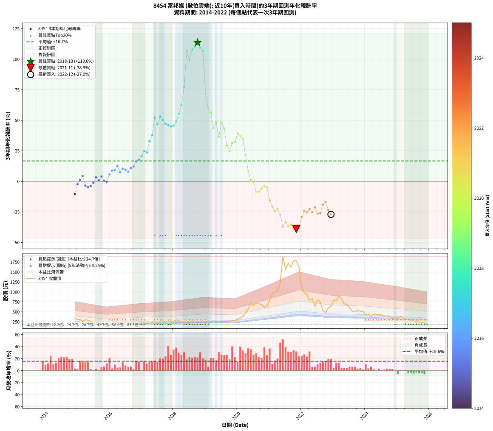

# 8454 富邦媒 - 本益比與未來報酬率分析

!!! info "報告資訊"
    - **股票代號**: 8454
    - **公司名稱**: 富邦媒
    - **產業別**: 數位雲端
    - **分析期間**: 2014-2022 (97 個數據點)
    - **資料來源**: Type 12 (ShowMonthlyK_ChartFlow) 月收盤價與本益比
    - **報酬率口徑**: 含現金股利 (簡化: 年度合計，假設每年7/1入帳)
    - **報告生成時間**: 2026-01-11 21:26:07 CST

## 📈 視覺化圖表

### 圖表1: 本益比 vs 未來報酬率關係

*圖表1：8454 富邦媒 本益比與3年期未來報酬率關係 (2014-2022)*

### 圖表2: 歷年買入時點的3年期實際報酬率

*圖表2：8454 富邦媒 歷年買入時點的3年期實際報酬率 (2014-2022)*

## 📍 買點訊號說明

本報告提供兩種買點提示訊號（顯示於圖表2的股價子圖中）：

### ▲ 小綠色三角形（回測驗證）
- **計算方式**: 使用全部歷史資料計算本益比第25百分位數
- **用途**: 事後驗證，顯示歷史上哪些時點確實為低估區
- **限制**: 當下無法判斷，僅供回測參考
- **特性**: 後見之明（Look-Ahead Bias）

### ▲ 小橘色三角形（即時訊號）
- **計算方式**: 使用截至當月的過去5年資料計算本益比第25百分位數
- **用途**: 實際投資決策，當時即可判斷
- **優勢**: 可操作性強，符合實務需求
- **特性**: 無後見之明，滾動窗口計算

!!! tip "如何使用兩種訊號"
    - **綠色▲** 幫助理解歷史估值機會，驗證策略有效性
    - **橘色▲** 可作為實際買進參考，但仍需搭配基本面分析
    - 兩種訊號重疊時，表示即時判斷與事後驗證一致，信心度較高
    - 僅有綠色▲時，表示當時無法判斷（需要未來資料才能確認）
    - 僅有橘色▲時，表示即時判斷為買點，但事後可能不是最佳時機

## 📊 估值分析摘要

| 指標 | 數值 |
|:---:|:---:|
| **目前本益比** (2022-12) | **40.84 倍** |
| **歷史平均本益比** | 38.46 倍 |
| **估值水準** | 🟡 合理範圍 |
| **預期3年年化報酬率** | **+13.79%** |
| **歷史平均報酬率** | +16.67% |
| **相關係數 (R²)** | 0.4681 |
| **趨勢線斜率** | -1.2068 |

!!! abstract "核心洞察"
    目前本益比接近歷史平均，預期報酬率符合長期趨勢

    根據歷史數據回測，8454 富邦媒 在目前本益比 **40.8倍** 的估值水準下，
    預期未來3年年化報酬率約為 **+13.8%**。

    **重要提醒**: 本分析基於歷史數據統計，實際報酬率會受到公司基本面變化、產業趨勢、
    總體經濟環境等多重因素影響。R² = 0.47 表示本益比可解釋約 46.8% 的報酬率變異。

## 📈 歷史估值統計

### 最佳買點 (最高報酬率)

| 項目 | 數值 |
|:---:|:---:|
| 起始時間 | 2018-10 |
| 當時本益比 | 18.40 倍 |
| 起始價格 | 186.5 元 |
| 3年後價格 | 1790.0 元 |
| **3年年化報酬率** | **+113.56%** |

### 最差買點 (最低報酬率)

| 項目 | 數值 |
|:---:|:---:|
| 起始時間 | 2021-11 |
| 當時本益比 | 100.70 倍 |
| 起始價格 | 1780.0 元 |
| 3年後價格 | 363.5 元 |
| **3年年化報酬率** | **-38.88%** |

## 🎯 投資啟示

### 本益比與報酬率關係

趨勢線方程式: **y = -1.2068x + 63.0773**

!!! warning "強負相關"
    本益比與未來報酬率呈現強負相關。在高本益比時期買入，未來報酬率顯著較低；
    在低本益比時期買入，未來報酬率顯著較高。**估值紀律至關重要**。

### 估值區間建議

基於歷史數據分析:

- **🟢 低估區** (P/E < 30.8): 預期報酬率較高，可考慮增加持股
- **🟡 合理區** (P/E 30.8-46.2): 預期報酬率符合長期趨勢，正常持有
- **🔴 高估區** (P/E > 46.2): 預期報酬率較低，可考慮減碼或觀望

!!! danger "風險提示"
    - 過去表現不代表未來結果
    - 本分析假設公司基本面無重大結構性變化
    - 產業環境劇變可能使歷史規律失效
    - 應結合公司財報、產業趨勢、總體經濟等多重因素綜合判斷

!!! success "長期投資觀點"
    歷史數據顯示，在合理或低估的估值水準買入並長期持有，
    往往能獲得較佳的投資報酬。**耐心等待好價格**是價值投資的核心原則。

## 📊 數據品質

- **資料來源**: GoodInfo.tw Type 12 (ShowMonthlyK_ChartFlow)
- **資料頻率**: 月度收盤價與本益比
- **回測期間**: 2014-2022
- **數據點數量**: 97 個 (每個點代表一次3年期回測)

### 計算方法說明

1. **3年期年化報酬率**:
   - 對每個歷史時點，計算其後3年的實際投資報酬率
   - 期末價值(不含股利): 期末價格
   - 期末價值(含現金股利): 期末價格 + 持有期間內的現金股利合計 (簡化: 年度合計，假設每年7/1入帳)
   - 公式: 年化報酬率 = [(期末價值/期初價格)^(1/年數) - 1] × 100%

2. **本益比 (P/E Ratio)**:
   - 使用當時的月收盤價與EPS計算
   - 資料來源: Type 12 月度河流圖本益比數據

3. **趨勢線 (Linear Regression)**:
   - 使用最小平方法擬合線性趨勢線
   - R²值衡量本益比對報酬率的解釋能力

---

*本報告由 Stock Analysis System v1.9.0 自動生成*
*數據更新時間: 2026-01-11 21:26:07 CST*

## 📋 月度回測明細表

（每一列對應時間線圖中的一個買入點；可用來對照 SVG 圖上的每個點。）

| 買入月份 | 賣出月份 | 回測期限_年 | 實際持有年數 | 買入本益比_倍 | 買入收盤價_元 | 賣出收盤價_元 | 現金股利合計_元 | 總報酬率_pct | 年化報酬率_pct |
| --- | --- | --- | --- | --- | --- | --- | --- | --- | --- |
| 2014-12 | 2017-12 | 3 | 3.001 | 36.83 | 335.50 | 217.50 | 23.48 | -28.17 | -10.44 |
| 2015-01 | 2018-01 | 3 | 3.001 | 34.38 | 308.50 | 263.50 | 23.48 | -6.98 | -2.38 |
| 2015-02 | 2018-02 | 3 | 3.001 | 35.30 | 312.00 | 300.00 | 23.48 | +3.68 | +1.21 |
| 2015-03 | 2018-03 | 3 | 3.001 | 29.82 | 259.50 | 271.00 | 23.48 | +13.48 | +4.30 |
| 2015-04 | 2018-04 | 3 | 3.001 | 35.08 | 300.50 | 246.50 | 23.48 | -10.16 | -3.51 |
| 2015-05 | 2018-05 | 3 | 3.001 | 34.46 | 290.50 | 227.00 | 23.48 | -13.78 | -4.82 |
| 2015-06 | 2018-06 | 3 | 3.001 | 32.49 | 269.50 | 216.00 | 23.48 | -11.14 | -3.86 |
| 2015-07 | 2018-07 | 3 | 3.001 | 28.25 | 230.50 | 200.00 | 23.00 | -3.25 | -1.10 |
| 2015-08 | 2018-08 | 3 | 3.001 | 24.62 | 197.50 | 194.50 | 23.00 | +10.13 | +3.27 |
| 2015-09 | 2018-09 | 3 | 3.001 | 24.72 | 195.00 | 177.50 | 23.00 | +2.82 | +0.93 |
| 2015-10 | 2018-10 | 3 | 3.001 | 23.99 | 186.00 | 186.50 | 23.00 | +12.63 | +4.04 |
| 2015-11 | 2018-11 | 3 | 3.001 | 28.56 | 217.50 | 197.00 | 23.00 | +1.15 | +0.38 |
| 2015-12 | 2018-12 | 3 | 3.001 | 28.54 | 213.50 | 188.00 | 23.00 | -1.17 | -0.39 |
| 2016-01 | 2019-01 | 3 | 3.001 | 28.04 | 212.00 | 226.50 | 23.00 | +17.69 | +5.58 |
| 2016-02 | 2019-03 | 3 | 3.080 | 28.00 | 214.00 | 254.50 | 23.00 | +29.67 | +8.80 |
| 2016-03 | 2019-03 | 3 | 2.998 | 27.71 | 214.00 | 254.50 | 23.00 | +29.67 | +9.05 |
| 2016-04 | 2019-04 | 3 | 2.998 | 26.91 | 210.00 | 275.50 | 23.00 | +42.14 | +12.45 |
| 2016-05 | 2019-05 | 3 | 2.998 | 29.24 | 230.50 | 262.00 | 23.00 | +23.64 | +7.34 |
| 2016-06 | 2019-06 | 3 | 2.998 | 26.68 | 212.50 | 262.50 | 23.00 | +34.35 | +10.35 |
| 2016-07 | 2019-07 | 3 | 2.998 | 27.09 | 218.00 | 262.00 | 25.00 | +31.65 | +9.61 |
| 2016-08 | 2019-08 | 3 | 2.998 | 27.87 | 226.50 | 258.50 | 25.00 | +25.17 | +7.77 |
| 2016-09 | 2019-09 | 3 | 2.998 | 25.65 | 210.50 | 261.50 | 25.00 | +36.10 | +10.83 |
| 2016-10 | 2019-10 | 3 | 2.998 | 24.73 | 205.00 | 264.00 | 25.00 | +40.98 | +12.14 |
| 2016-11 | 2019-11 | 3 | 2.998 | 23.24 | 194.50 | 280.00 | 25.00 | +56.81 | +16.19 |
| 2016-12 | 2019-12 | 3 | 2.998 | 22.96 | 194.00 | 290.00 | 25.00 | +62.37 | +17.55 |
| 2017-01 | 2020-01 | 3 | 2.998 | 22.17 | 188.50 | 306.00 | 25.00 | +75.60 | +20.66 |
| 2017-02 | 2020-02 | 3 | 2.998 | 22.68 | 194.00 | 353.50 | 25.00 | +95.10 | +24.97 |
| 2017-03 | 2020-03 | 3 | 3.001 | 25.10 | 216.00 | 383.00 | 25.00 | +88.89 | +23.61 |
| 2017-04 | 2020-04 | 3 | 3.001 | 24.95 | 216.00 | 480.50 | 25.00 | +134.03 | +32.76 |
| 2017-05 | 2020-05 | 3 | 3.001 | 26.24 | 228.50 | 570.00 | 25.00 | +160.39 | +37.57 |
| 2017-06 | 2020-06 | 3 | 3.001 | 24.03 | 210.50 | 716.00 | 25.00 | +252.02 | +52.11 |
| 2017-07 | 2020-07 | 3 | 3.001 | 24.29 | 214.00 | 650.00 | 25.50 | +215.65 | +46.68 |
| 2017-08 | 2020-08 | 3 | 3.001 | 23.75 | 210.50 | 729.00 | 25.50 | +258.43 | +53.02 |
| 2017-09 | 2020-09 | 3 | 3.001 | 24.12 | 215.00 | 703.00 | 25.50 | +238.84 | +50.18 |
| 2017-10 | 2020-10 | 3 | 3.001 | 24.87 | 223.00 | 684.00 | 25.50 | +218.16 | +47.07 |
| 2017-11 | 2020-11 | 3 | 3.001 | 22.95 | 207.00 | 620.00 | 25.50 | +211.84 | +46.08 |
| 2017-12 | 2020-12 | 3 | 3.001 | 23.98 | 217.50 | 637.00 | 25.50 | +204.60 | +44.95 |
| 2018-01 | 2021-01 | 3 | 3.001 | 28.71 | 263.50 | 788.00 | 25.50 | +208.73 | +45.60 |
| 2018-02 | 2021-02 | 3 | 3.001 | 32.32 | 300.00 | 967.00 | 25.50 | +230.83 | +48.99 |
| 2018-03 | 2021-03 | 3 | 3.001 | 28.86 | 271.00 | 990.00 | 25.50 | +274.72 | +55.31 |
| 2018-04 | 2021-04 | 3 | 3.001 | 25.96 | 246.50 | 1030.00 | 25.50 | +328.19 | +62.37 |
| 2018-05 | 2021-05 | 3 | 3.001 | 23.64 | 227.00 | 1240.00 | 25.50 | +457.49 | +77.29 |
| 2018-06 | 2021-06 | 3 | 3.001 | 22.25 | 216.00 | 1885.00 | 25.50 | +784.49 | +106.77 |
| 2018-07 | 2021-07 | 3 | 3.001 | 20.37 | 200.00 | 1560.00 | 27.50 | +693.75 | +99.45 |
| 2018-08 | 2021-08 | 3 | 3.001 | 19.60 | 194.50 | 1715.00 | 27.50 | +795.89 | +107.66 |
| 2018-09 | 2021-09 | 3 | 3.001 | 17.70 | 177.50 | 1620.00 | 27.50 | +828.17 | +110.12 |
| 2018-10 | 2021-10 | 3 | 3.001 | 18.40 | 186.50 | 1790.00 | 27.50 | +874.53 | +113.56 |
| 2018-11 | 2021-11 | 3 | 3.001 | 19.23 | 197.00 | 1780.00 | 27.50 | +817.51 | +109.31 |
| 2018-12 | 2021-12 | 3 | 3.001 | 18.16 | 188.00 | 1625.00 | 27.50 | +778.99 | +106.34 |
| 2019-01 | 2022-01 | 3 | 3.001 | 21.95 | 226.50 | 1115.00 | 27.50 | +404.42 | +71.48 |
| 2019-02 | 2022-02 | 3 | 3.001 | 23.92 | 246.00 | 983.00 | 27.50 | +310.77 | +60.14 |
| 2019-03 | 2022-03 | 3 | 3.001 | 24.83 | 254.50 | 941.00 | 27.50 | +280.55 | +56.11 |
| 2019-04 | 2022-04 | 3 | 3.001 | 26.97 | 275.50 | 791.00 | 27.50 | +197.10 | +43.75 |
| 2019-05 | 2022-05 | 3 | 3.001 | 25.73 | 262.00 | 835.00 | 27.50 | +229.20 | +48.75 |
| 2019-06 | 2022-06 | 3 | 3.001 | 25.86 | 262.50 | 638.00 | 27.50 | +153.52 | +36.35 |
| 2019-07 | 2022-07 | 3 | 3.001 | 25.90 | 262.00 | 817.00 | 31.50 | +223.85 | +47.94 |
| 2019-08 | 2022-08 | 3 | 3.001 | 25.64 | 258.50 | 730.00 | 31.50 | +194.58 | +43.34 |
| 2019-09 | 2022-09 | 3 | 3.001 | 26.02 | 261.50 | 534.00 | 31.50 | +116.25 | +29.31 |
| 2019-10 | 2022-10 | 3 | 3.001 | 26.36 | 264.00 | 482.50 | 31.50 | +94.70 | +24.86 |
| 2019-11 | 2022-11 | 3 | 3.001 | 28.05 | 280.00 | 600.00 | 31.50 | +125.54 | +31.13 |
| 2019-12 | 2022-12 | 3 | 3.001 | 29.15 | 290.00 | 642.00 | 31.50 | +132.24 | +32.42 |
| 2020-01 | 2023-01 | 3 | 3.001 | 29.78 | 306.00 | 793.00 | 31.50 | +169.44 | +39.14 |
| 2020-02 | 2023-03 | 3 | 3.080 | 33.34 | 353.50 | 903.00 | 31.50 | +164.36 | +37.11 |
| 2020-03 | 2023-03 | 3 | 2.998 | 35.04 | 383.00 | 903.00 | 31.50 | +143.99 | +34.65 |
| 2020-04 | 2023-04 | 3 | 2.998 | 42.69 | 480.50 | 829.00 | 31.50 | +79.08 | +21.45 |
| 2020-05 | 2023-05 | 3 | 2.998 | 49.21 | 570.00 | 699.00 | 31.50 | +28.16 | +8.63 |
| 2020-06 | 2023-06 | 3 | 2.998 | 60.12 | 716.00 | 688.00 | 31.50 | +0.49 | +0.16 |
| 2020-07 | 2023-07 | 3 | 2.998 | 53.12 | 650.00 | 599.00 | 38.00 | -2.00 | -0.67 |
| 2020-08 | 2023-08 | 3 | 2.998 | 58.03 | 729.00 | 520.00 | 38.00 | -23.46 | -8.53 |
| 2020-09 | 2023-09 | 3 | 2.998 | 54.54 | 703.00 | 502.00 | 38.00 | -23.19 | -8.42 |
| 2020-10 | 2023-10 | 3 | 2.998 | 51.75 | 684.00 | 533.00 | 38.00 | -16.52 | -5.85 |
| 2020-11 | 2023-11 | 3 | 2.998 | 45.78 | 620.00 | 518.00 | 38.00 | -10.32 | -3.57 |
| 2020-12 | 2023-12 | 3 | 2.998 | 45.93 | 637.00 | 509.00 | 38.00 | -14.13 | -4.95 |
| 2021-01 | 2024-01 | 3 | 2.998 | 55.43 | 788.00 | 436.00 | 38.00 | -39.85 | -15.60 |
| 2021-02 | 2024-02 | 3 | 2.998 | 66.41 | 967.00 | 444.50 | 38.00 | -50.10 | -20.70 |
| 2021-03 | 2024-03 | 3 | 3.001 | 66.41 | 990.00 | 387.00 | 38.00 | -57.07 | -24.56 |
| 2021-04 | 2024-04 | 3 | 3.001 | 67.53 | 1030.00 | 442.00 | 38.00 | -53.40 | -22.47 |
| 2021-05 | 2024-05 | 3 | 3.001 | 79.49 | 1240.00 | 439.00 | 38.00 | -61.53 | -27.27 |
| 2021-06 | 2024-06 | 3 | 3.001 | 118.20 | 1885.00 | 429.50 | 38.00 | -75.20 | -37.16 |
| 2021-07 | 2024-07 | 3 | 3.001 | 95.76 | 1560.00 | 418.00 | 42.80 | -70.46 | -33.40 |
| 2021-08 | 2024-08 | 3 | 3.001 | 103.10 | 1715.00 | 390.00 | 42.80 | -74.76 | -36.80 |
| 2021-09 | 2024-09 | 3 | 3.001 | 95.39 | 1620.00 | 394.00 | 42.80 | -73.04 | -35.39 |
| 2021-10 | 2024-10 | 3 | 3.001 | 103.30 | 1790.00 | 375.50 | 42.80 | -76.63 | -38.40 |
| 2021-11 | 2024-11 | 3 | 3.001 | 100.70 | 1780.00 | 363.50 | 42.80 | -77.17 | -38.88 |
| 2021-12 | 2024-12 | 3 | 3.001 | 90.18 | 1625.00 | 333.50 | 42.80 | -76.84 | -38.58 |
| 2022-01 | 2025-01 | 3 | 3.001 | 62.54 | 1115.00 | 352.50 | 42.80 | -64.55 | -29.22 |
| 2022-02 | 2025-02 | 3 | 3.001 | 55.74 | 983.00 | 386.50 | 42.80 | -56.33 | -24.13 |
| 2022-03 | 2025-03 | 3 | 3.001 | 53.94 | 941.00 | 347.50 | 42.80 | -58.52 | -25.42 |
| 2022-04 | 2025-04 | 3 | 3.001 | 45.85 | 791.00 | 323.00 | 42.80 | -53.75 | -22.66 |
| 2022-05 | 2025-05 | 3 | 3.001 | 48.94 | 835.00 | 305.00 | 42.80 | -58.35 | -25.31 |
| 2022-06 | 2025-06 | 3 | 3.001 | 37.82 | 638.00 | 269.00 | 42.80 | -51.13 | -21.23 |
| 2022-07 | 2025-07 | 3 | 3.001 | 48.99 | 817.00 | 283.00 | 42.60 | -60.15 | -26.40 |
| 2022-08 | 2025-08 | 3 | 3.001 | 44.28 | 730.00 | 253.00 | 42.60 | -59.51 | -26.01 |
| 2022-09 | 2025-09 | 3 | 3.001 | 32.77 | 534.00 | 241.50 | 42.60 | -46.80 | -18.97 |
| 2022-10 | 2025-10 | 3 | 3.001 | 29.96 | 482.50 | 233.50 | 42.60 | -42.78 | -16.98 |
| 2022-11 | 2025-11 | 3 | 3.001 | 37.71 | 600.00 | 227.00 | 42.60 | -55.07 | -23.40 |
| 2022-12 | 2025-12 | 3 | 3.001 | 40.84 | 642.00 | 207.50 | 42.60 | -61.04 | -26.96 |
