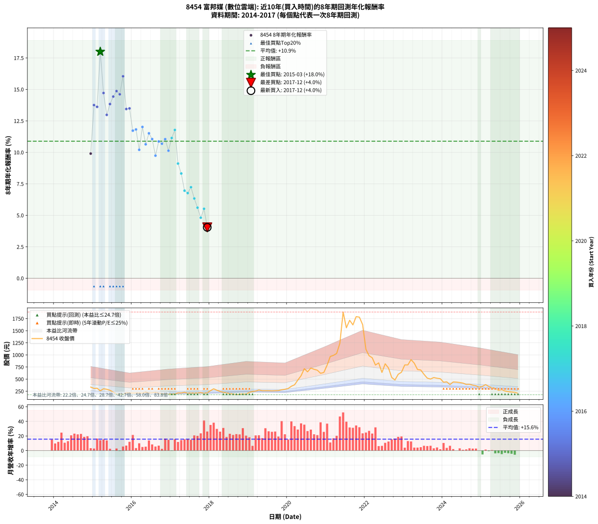

# 8454 富邦媒 - 本益比與未來報酬率分析

!!! info "報告資訊"
    - **股票代號**: 8454
    - **公司名稱**: 富邦媒
    - **產業別**: 數位雲端
    - **分析期間**: 2014-2017 (37 個數據點)
    - **資料來源**: Type 12 (ShowMonthlyK_ChartFlow) 月收盤價與本益比
    - **報酬率口徑**: 含現金股利 (簡化: 年度合計，假設每年7/1入帳)
    - **報告生成時間**: 2026-01-13 01:19:46 CST

## 📈 視覺化圖表

### 圖表1: 本益比 vs 未來報酬率關係

*圖表1：8454 富邦媒 本益比與8年期未來報酬率關係 (2014-2017)*

### 圖表2: 歷年買入時點的8年期實際報酬率

*圖表2：8454 富邦媒 歷年買入時點的8年期實際報酬率 (2014-2017)*

## 📍 買點訊號說明

本報告提供兩種買點提示訊號（顯示於圖表2的股價子圖中）：

### ▲ 小綠色三角形（回測驗證）
- **計算方式**: 使用全部歷史資料計算本益比第25百分位數
- **用途**: 事後驗證，顯示歷史上哪些時點確實為低估區
- **限制**: 當下無法判斷，僅供回測參考
- **特性**: 後見之明（Look-Ahead Bias）

### ▲ 小橘色三角形（即時訊號）
- **計算方式**: 使用截至當月的過去5年資料計算本益比第25百分位數
- **用途**: 實際投資決策，當時即可判斷
- **優勢**: 可操作性強，符合實務需求
- **特性**: 無後見之明，滾動窗口計算

!!! tip "如何使用兩種訊號"
    - **綠色▲** 幫助理解歷史估值機會，驗證策略有效性
    - **橘色▲** 可作為實際買進參考，但仍需搭配基本面分析
    - 兩種訊號重疊時，表示即時判斷與事後驗證一致，信心度較高
    - 僅有綠色▲時，表示當時無法判斷（需要未來資料才能確認）
    - 僅有橘色▲時，表示即時判斷為買點，但事後可能不是最佳時機

## 📊 估值分析摘要

| 指標 | 數值 |
|:---:|:---:|
| **目前本益比** (2017-12) | **23.98 倍** |
| **歷史平均本益比** | 27.14 倍 |
| **估值水準** | 🟡 合理範圍 |
| **預期8年年化報酬率** | **+9.70%** |
| **歷史平均報酬率** | +10.88% |
| **相關係數 (R²)** | 0.1989 |
| **趨勢線斜率** | 0.3751 |

!!! abstract "核心洞察"
    目前本益比接近歷史平均，預期報酬率符合長期趨勢

    根據歷史數據回測，8454 富邦媒 在目前本益比 **24.0倍** 的估值水準下，
    預期未來8年年化報酬率約為 **+9.7%**。

    **重要提醒**: 本分析基於歷史數據統計，實際報酬率會受到公司基本面變化、產業趨勢、
    總體經濟環境等多重因素影響。R² = 0.20 表示本益比可解釋約 19.9% 的報酬率變異。

## 📈 歷史估值統計

### 最佳買點 (最高報酬率)

| 項目 | 數值 |
|:---:|:---:|
| 起始時間 | 2015-03 |
| 當時本益比 | 29.82 倍 |
| 起始價格 | 259.5 元 |
| 8年後價格 | 903.0 元 |
| **8年年化報酬率** | **+17.99%** |

### 最差買點 (最低報酬率)

| 項目 | 數值 |
|:---:|:---:|
| 起始時間 | 2017-12 |
| 當時本益比 | 23.98 倍 |
| 起始價格 | 217.5 元 |
| 8年後價格 | 207.5 元 |
| **8年年化報酬率** | **+4.04%** |

## 🎯 投資啟示

### 本益比與報酬率關係

趨勢線方程式: **y = 0.3751x + 0.7017**

!!! info "弱相關或正相關"
    本益比與未來報酬率相關性較弱。這可能表示該股票的報酬率更多受到
    公司成長性、產業趨勢等因素影響，而非估值水準。**需綜合考量多項指標**。

### 估值區間建議

基於歷史數據分析:

- **🟢 低估區** (P/E < 21.7): 預期報酬率較高，可考慮增加持股
- **🟡 合理區** (P/E 21.7-32.6): 預期報酬率符合長期趨勢，正常持有
- **🔴 高估區** (P/E > 32.6): 預期報酬率較低，可考慮減碼或觀望

!!! danger "風險提示"
    - 過去表現不代表未來結果
    - 本分析假設公司基本面無重大結構性變化
    - 產業環境劇變可能使歷史規律失效
    - 應結合公司財報、產業趨勢、總體經濟等多重因素綜合判斷

!!! success "長期投資觀點"
    歷史數據顯示，在合理或低估的估值水準買入並長期持有，
    往往能獲得較佳的投資報酬。**耐心等待好價格**是價值投資的核心原則。

## 📊 數據品質

- **資料來源**: GoodInfo.tw Type 12 (ShowMonthlyK_ChartFlow)
- **資料頻率**: 月度收盤價與本益比
- **回測期間**: 2014-2017
- **數據點數量**: 37 個 (每個點代表一次8年期回測)

### 計算方法說明

1. **8年期年化報酬率**:
   - 對每個歷史時點，計算其後8年的實際投資報酬率
   - 期末價值(不含股利): 期末價格
   - 期末價值(含現金股利): 期末價格 + 持有期間內的現金股利合計 (簡化: 年度合計，假設每年7/1入帳)
   - 公式: 年化報酬率 = [(期末價值/期初價格)^(1/年數) - 1] × 100%

2. **本益比 (P/E Ratio)**:
   - 使用當時的月收盤價與EPS計算
   - 資料來源: Type 12 月度河流圖本益比數據

3. **趨勢線 (Linear Regression)**:
   - 使用最小平方法擬合線性趨勢線
   - R²值衡量本益比對報酬率的解釋能力

---

*本報告由 Stock Analysis System v1.9.0 自動生成*
*數據更新時間: 2026-01-13 01:19:46 CST*

## 📋 月度回測明細表

（每一列對應時間線圖中的一個買入點；可用來對照 SVG 圖上的每個點。）

| 買入月份 | 賣出月份 | 回測期限_年 | 實際持有年數 | 買入本益比_倍 | 買入收盤價_元 | 賣出收盤價_元 | 現金股利合計_元 | 總報酬率_pct | 年化報酬率_pct |
| --- | --- | --- | --- | --- | --- | --- | --- | --- | --- |
| 2014-12 | 2022-12 | 8 | 8.000 | 36.83 | 335.50 | 642.00 | 71.98 | +112.81 | +9.90 |
| 2015-01 | 2023-01 | 8 | 8.000 | 34.38 | 308.50 | 793.00 | 71.98 | +180.38 | +13.75 |
| 2015-02 | 2023-02 | 8 | 8.000 | 35.30 | 312.00 | 794.00 | 71.98 | +177.56 | +13.61 |
| 2015-03 | 2023-03 | 8 | 8.000 | 29.82 | 259.50 | 903.00 | 71.98 | +275.71 | +17.99 |
| 2015-04 | 2023-04 | 8 | 8.000 | 35.08 | 300.50 | 829.00 | 71.98 | +199.83 | +14.71 |
| 2015-05 | 2023-05 | 8 | 8.000 | 34.46 | 290.50 | 699.00 | 71.98 | +165.40 | +12.98 |
| 2015-06 | 2023-06 | 8 | 8.000 | 32.49 | 269.50 | 688.00 | 71.98 | +182.00 | +13.84 |
| 2015-07 | 2023-07 | 8 | 8.000 | 28.25 | 230.50 | 599.00 | 78.50 | +193.93 | +14.43 |
| 2015-08 | 2023-08 | 8 | 8.000 | 24.62 | 197.50 | 520.00 | 78.50 | +203.04 | +14.86 |
| 2015-09 | 2023-09 | 8 | 8.000 | 24.72 | 195.00 | 502.00 | 78.50 | +197.69 | +14.61 |
| 2015-10 | 2023-10 | 8 | 8.000 | 23.99 | 186.00 | 533.00 | 78.50 | +228.76 | +16.04 |
| 2015-11 | 2023-11 | 8 | 8.000 | 28.56 | 217.50 | 518.00 | 78.50 | +174.25 | +13.44 |
| 2015-12 | 2023-12 | 8 | 8.000 | 28.54 | 213.50 | 509.00 | 78.50 | +175.18 | +13.49 |
| 2016-01 | 2024-01 | 8 | 8.000 | 28.04 | 212.00 | 436.00 | 78.50 | +142.69 | +11.72 |
| 2016-02 | 2024-02 | 8 | 8.000 | 28.00 | 214.00 | 444.50 | 78.50 | +144.39 | +11.82 |
| 2016-03 | 2024-03 | 8 | 8.000 | 27.71 | 214.00 | 387.00 | 78.50 | +117.52 | +10.20 |
| 2016-04 | 2024-04 | 8 | 8.000 | 26.91 | 210.00 | 442.00 | 78.50 | +147.86 | +12.01 |
| 2016-05 | 2024-05 | 8 | 8.000 | 29.24 | 230.50 | 439.00 | 78.50 | +124.51 | +10.64 |
| 2016-06 | 2024-06 | 8 | 8.000 | 26.68 | 212.50 | 429.50 | 78.50 | +139.06 | +11.51 |
| 2016-07 | 2024-07 | 8 | 8.000 | 27.09 | 218.00 | 418.00 | 86.30 | +131.33 | +11.05 |
| 2016-08 | 2024-08 | 8 | 8.000 | 27.87 | 226.50 | 390.00 | 86.30 | +110.29 | +9.74 |
| 2016-09 | 2024-09 | 8 | 8.000 | 25.65 | 210.50 | 394.00 | 86.30 | +128.17 | +10.86 |
| 2016-10 | 2024-10 | 8 | 8.000 | 24.73 | 205.00 | 375.50 | 86.30 | +125.27 | +10.68 |
| 2016-11 | 2024-11 | 8 | 8.000 | 23.24 | 194.50 | 363.50 | 86.30 | +131.26 | +11.05 |
| 2016-12 | 2024-12 | 8 | 8.000 | 22.96 | 194.00 | 333.50 | 86.30 | +116.39 | +10.13 |
| 2017-01 | 2025-01 | 8 | 8.000 | 22.17 | 188.50 | 352.50 | 86.30 | +132.79 | +11.14 |
| 2017-02 | 2025-02 | 8 | 8.000 | 22.68 | 194.00 | 386.50 | 86.30 | +143.71 | +11.78 |
| 2017-03 | 2025-03 | 8 | 8.000 | 25.10 | 216.00 | 347.50 | 86.30 | +100.83 | +9.11 |
| 2017-04 | 2025-04 | 8 | 8.000 | 24.95 | 216.00 | 323.00 | 86.30 | +89.49 | +8.32 |
| 2017-05 | 2025-05 | 8 | 8.000 | 26.24 | 228.50 | 305.00 | 86.30 | +71.25 | +6.96 |
| 2017-06 | 2025-06 | 8 | 8.000 | 24.03 | 210.50 | 269.00 | 86.30 | +68.79 | +6.76 |
| 2017-07 | 2025-07 | 8 | 8.000 | 24.29 | 214.00 | 283.00 | 91.10 | +74.81 | +7.23 |
| 2017-08 | 2025-08 | 8 | 8.000 | 23.75 | 210.50 | 253.00 | 91.10 | +63.47 | +6.34 |
| 2017-09 | 2025-09 | 8 | 8.000 | 24.12 | 215.00 | 241.50 | 91.10 | +54.70 | +5.61 |
| 2017-10 | 2025-10 | 8 | 8.000 | 24.87 | 223.00 | 233.50 | 91.10 | +45.56 | +4.80 |
| 2017-11 | 2025-11 | 8 | 8.000 | 22.95 | 207.00 | 227.00 | 91.10 | +53.67 | +5.52 |
| 2017-12 | 2025-12 | 8 | 8.000 | 23.98 | 217.50 | 207.50 | 91.10 | +37.29 | +4.04 |
