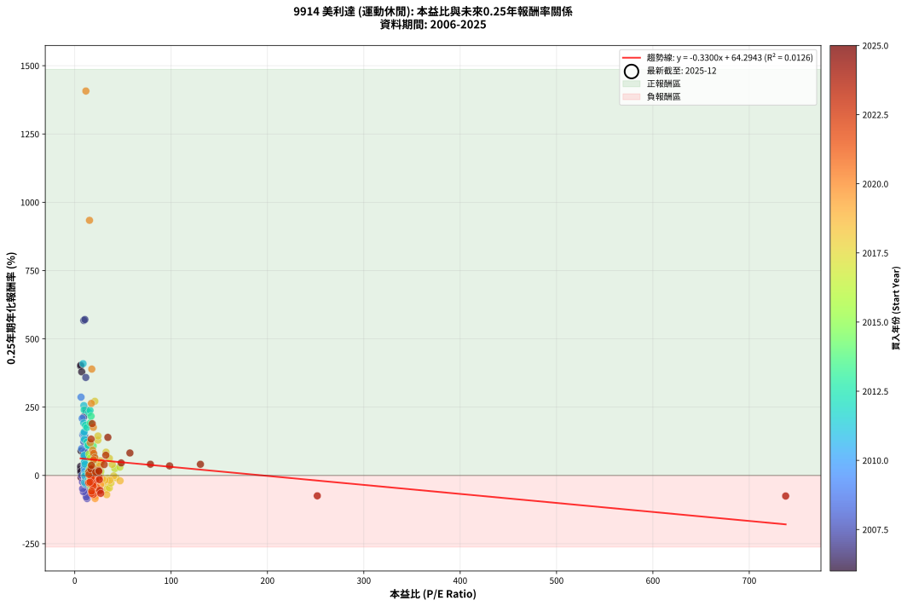
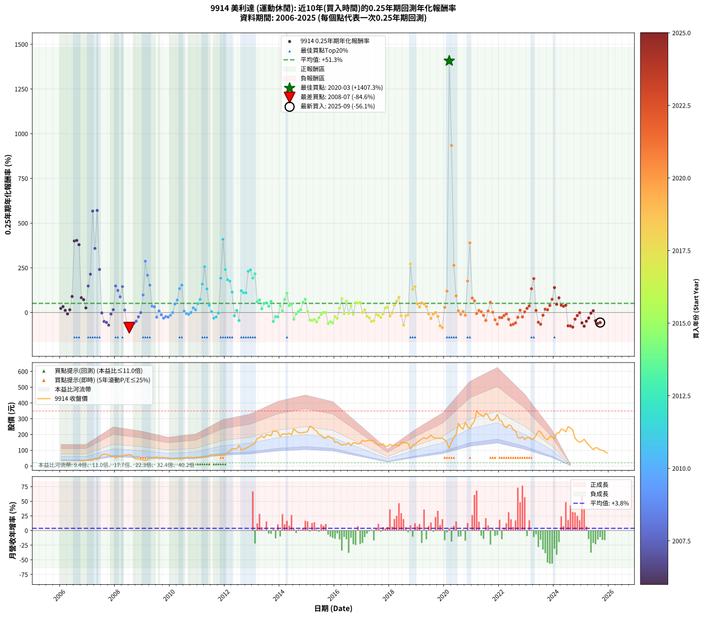

# 9914 美利達 - 本益比與未來報酬率分析

!!! info "報告資訊"
    - **股票代號**: 9914
    - **公司名稱**: 美利達
    - **產業別**: 運動休閒
    - **分析期間**: 2006-2025 (237 個數據點)
    - **資料來源**: Type 12 (ShowMonthlyK_ChartFlow) 月收盤價與本益比
    - **報酬率口徑**: 含現金股利 (簡化: 年度合計，假設每年7/1入帳)
    - **報告生成時間**: 2026-01-07 21:26:32 CST

## 📈 視覺化圖表

### 圖表1: 本益比 vs 未來報酬率關係

*圖表1：9914 美利達 本益比與0.25年期未來報酬率關係 (2006-2025)*

### 圖表2: 歷年買入時點的0.25年期實際報酬率

*圖表2：9914 美利達 歷年買入時點的0.25年期實際報酬率 (2006-2025)*

## 📍 買點訊號說明

本報告提供兩種買點提示訊號（顯示於圖表2的股價子圖中）：

### ▲ 小綠色三角形（回測驗證）
- **計算方式**: 使用全部歷史資料計算本益比第25百分位數
- **用途**: 事後驗證，顯示歷史上哪些時點確實為低估區
- **限制**: 當下無法判斷，僅供回測參考
- **特性**: 後見之明（Look-Ahead Bias）

### ▲ 小橘色三角形（即時訊號）
- **計算方式**: 使用截至當月的過去5年資料計算本益比第25百分位數
- **用途**: 實際投資決策，當時即可判斷
- **優勢**: 可操作性強，符合實務需求
- **特性**: 無後見之明，滾動窗口計算

!!! tip "如何使用兩種訊號"
    - **綠色▲** 幫助理解歷史估值機會，驗證策略有效性
    - **橘色▲** 可作為實際買進參考，但仍需搭配基本面分析
    - 兩種訊號重疊時，表示即時判斷與事後驗證一致，信心度較高
    - 僅有綠色▲時，表示當時無法判斷（需要未來資料才能確認）
    - 僅有橘色▲時，表示即時判斷為買點，但事後可能不是最佳時機

## 📊 估值分析摘要

| 指標 | 數值 |
|:---:|:---:|
| **目前本益比** (2025-09) | **nan 倍** |
| **歷史平均本益比** | 23.64 倍 |
| **估值水準** | 🟡 合理範圍 |
| **預期0.25年年化報酬率** | **+nan%** |
| **歷史平均報酬率** | +51.26% |
| **相關係數 (R²)** | 0.0126 |
| **趨勢線斜率** | -0.3300 |

!!! abstract "核心洞察"
    目前本益比接近歷史平均，預期報酬率符合長期趨勢

    根據歷史數據回測，9914 美利達 在目前本益比 **nan倍** 的估值水準下，
    預期未來0.25年年化報酬率約為 **+nan%**。

    **重要提醒**: 本分析基於歷史數據統計，實際報酬率會受到公司基本面變化、產業趨勢、
    總體經濟環境等多重因素影響。R² = 0.01 表示本益比可解釋約 1.3% 的報酬率變異。

## 📈 歷史估值統計

### 最佳買點 (最高報酬率)

| 項目 | 數值 |
|:---:|:---:|
| 起始時間 | 2020-03 |
| 當時本益比 | 11.54 倍 |
| 起始價格 | 111.0 元 |
| 0.25年後價格 | 270.5 元 |
| **0.25年年化報酬率** | **+1407.26%** |

### 最差買點 (最低報酬率)

| 項目 | 數值 |
|:---:|:---:|
| 起始時間 | 2008-07 |
| 當時本益比 | 12.72 倍 |
| 起始價格 | 73.7 元 |
| 0.25年後價格 | 46.0 元 |
| **0.25年年化報酬率** | **-84.61%** |

## 🎯 投資啟示

### 本益比與報酬率關係

趨勢線方程式: **y = -0.3300x + 64.2943**

!!! note "負相關"
    本益比與未來報酬率呈現負相關。較低的本益比通常帶來較高的未來報酬率，
    但相關性不算非常強。**估值仍是重要參考指標之一**。

### 估值區間建議

基於歷史數據分析:

- **🟢 低估區** (P/E < 18.9): 預期報酬率較高，可考慮增加持股
- **🟡 合理區** (P/E 18.9-28.4): 預期報酬率符合長期趨勢，正常持有
- **🔴 高估區** (P/E > 28.4): 預期報酬率較低，可考慮減碼或觀望

!!! danger "風險提示"
    - 過去表現不代表未來結果
    - 本分析假設公司基本面無重大結構性變化
    - 產業環境劇變可能使歷史規律失效
    - 應結合公司財報、產業趨勢、總體經濟等多重因素綜合判斷

!!! success "長期投資觀點"
    歷史數據顯示，在合理或低估的估值水準買入並長期持有，
    往往能獲得較佳的投資報酬。**耐心等待好價格**是價值投資的核心原則。

## 📊 數據品質

- **資料來源**: GoodInfo.tw Type 12 (ShowMonthlyK_ChartFlow)
- **資料頻率**: 月度收盤價與本益比
- **回測期間**: 2006-2025
- **數據點數量**: 237 個 (每個點代表一次0.25年期回測)

### 計算方法說明

1. **0.25年期年化報酬率**:
   - 對每個歷史時點，計算其後0.25年的實際投資報酬率
   - 期末價值(不含股利): 期末價格
   - 期末價值(含現金股利): 期末價格 + 持有期間內的現金股利合計 (簡化: 年度合計，假設每年7/1入帳)
   - 公式: 年化報酬率 = [(期末價值/期初價格)^(1/年數) - 1] × 100%

2. **本益比 (P/E Ratio)**:
   - 使用當時的月收盤價與EPS計算
   - 資料來源: Type 12 月度河流圖本益比數據

3. **趨勢線 (Linear Regression)**:
   - 使用最小平方法擬合線性趨勢線
   - R²值衡量本益比對報酬率的解釋能力

---

*本報告由 Stock Analysis System v1.9.0 自動生成*
*數據更新時間: 2026-01-07 21:26:32 CST*

## 📋 月度回測明細表

（每一列對應時間線圖中的一個買入點；可用來對照 SVG 圖上的每個點。）

| 買入月份 | 賣出月份 | 回測期限_年 | 實際持有年數 | 買入本益比_倍 | 買入收盤價_元 | 賣出收盤價_元 | 現金股利合計_元 | 總報酬率_pct | 年化報酬率_pct |
| --- | --- | --- | --- | --- | --- | --- | --- | --- | --- |
| 2006-01 | 2006-05 | 0.25 | 0.329 | 6.04 | 20.55 | 22.00 | 0.00 | +7.06 | +23.06 |
| 2006-02 | 2006-05 | 0.25 | 0.246 | 6.03 | 20.50 | 22.00 | 0.00 | +7.32 | +33.19 |
| 2006-03 | 2006-07 | 0.25 | 0.334 | 6.24 | 21.20 | 20.30 | 1.70 | +3.77 | +11.73 |
| 2006-04 | 2006-07 | 0.25 | 0.249 | 6.60 | 22.45 | 20.30 | 1.70 | -2.00 | -7.81 |
| 2006-05 | 2006-08 | 0.25 | 0.252 | 6.47 | 22.00 | 21.10 | 1.70 | +3.64 | +15.24 |
| 2006-06 | 2006-09 | 0.25 | 0.252 | 6.56 | 22.30 | 24.50 | 1.70 | +17.49 | +89.62 |
| 2006-07 | 2006-10 | 0.25 | 0.252 | 5.97 | 20.30 | 30.45 | 0.00 | +50.00 | +400.15 |
| 2006-08 | 2006-12 | 0.25 | 0.334 | 6.21 | 21.10 | 36.20 | 0.00 | +71.56 | +403.31 |
| 2006-09 | 2006-12 | 0.25 | 0.249 | 7.21 | 24.50 | 36.20 | 0.00 | +47.76 | +379.18 |
| 2006-10 | 2007-01 | 0.25 | 0.252 | 8.96 | 30.45 | 35.45 | 0.00 | +16.42 | +82.87 |
| 2006-11 | 2007-03 | 0.25 | 0.329 | 9.43 | 32.05 | 38.30 | 0.00 | +19.50 | +71.99 |
| 2006-12 | 2007-03 | 0.25 | 0.246 | 10.65 | 36.20 | 38.30 | 0.00 | +5.80 | +25.72 |
| 2007-01 | 2007-05 | 0.25 | 0.329 | 9.76 | 35.45 | 47.80 | 0.00 | +34.84 | +148.38 |
| 2007-02 | 2007-05 | 0.25 | 0.246 | 9.33 | 36.05 | 47.80 | 0.00 | +32.59 | +214.22 |
| 2007-03 | 2007-07 | 0.25 | 0.334 | 9.35 | 38.30 | 70.40 | 1.80 | +88.51 | +567.30 |
| 2007-04 | 2007-07 | 0.25 | 0.249 | 11.42 | 49.40 | 70.40 | 1.80 | +46.15 | +358.67 |
| 2007-05 | 2007-08 | 0.25 | 0.252 | 10.49 | 47.80 | 75.40 | 1.80 | +61.51 | +570.71 |
| 2007-06 | 2007-09 | 0.25 | 0.252 | 11.48 | 55.00 | 73.10 | 1.80 | +36.18 | +240.77 |
| 2007-07 | 2007-10 | 0.25 | 0.252 | 14.02 | 70.40 | 70.00 | 0.00 | -0.57 | -2.24 |
| 2007-08 | 2007-12 | 0.25 | 0.334 | 14.35 | 75.40 | 59.80 | 0.00 | -20.69 | -50.04 |
| 2007-09 | 2007-12 | 0.25 | 0.249 | 13.33 | 73.10 | 59.80 | 0.00 | -18.19 | -55.34 |
| 2007-10 | 2008-01 | 0.25 | 0.252 | 12.24 | 70.00 | 51.40 | 0.00 | -26.57 | -70.66 |
| 2007-11 | 2008-03 | 0.25 | 0.331 | 10.73 | 63.80 | 62.00 | 0.00 | -2.82 | -8.28 |
| 2007-12 | 2008-03 | 0.25 | 0.249 | 9.68 | 59.80 | 62.00 | 0.00 | +3.68 | +15.61 |
| 2008-01 | 2008-05 | 0.25 | 0.331 | 8.39 | 51.40 | 69.50 | 0.00 | +35.21 | +148.60 |
| 2008-02 | 2008-05 | 0.25 | 0.249 | 9.37 | 56.90 | 69.50 | 0.00 | +22.14 | +123.19 |
| 2008-03 | 2008-07 | 0.25 | 0.334 | 10.31 | 62.00 | 73.70 | 2.80 | +23.39 | +87.61 |
| 2008-04 | 2008-07 | 0.25 | 0.249 | 10.27 | 61.20 | 73.70 | 2.80 | +25.00 | +144.89 |
| 2008-05 | 2008-08 | 0.25 | 0.252 | 11.77 | 69.50 | 69.00 | 2.80 | +3.31 | +13.80 |
| 2008-06 | 2008-09 | 0.25 | 0.252 | 11.79 | 69.00 | 51.20 | 2.80 | -21.74 | -62.21 |
| 2008-07 | 2008-10 | 0.25 | 0.252 | 12.72 | 73.70 | 46.00 | 0.00 | -37.58 | -84.61 |
| 2008-08 | 2008-12 | 0.25 | 0.334 | 12.02 | 69.00 | 40.75 | 0.00 | -40.94 | -79.33 |
| 2008-09 | 2008-12 | 0.25 | 0.249 | 9.01 | 51.20 | 40.75 | 0.00 | -20.41 | -60.00 |
| 2008-10 | 2009-01 | 0.25 | 0.252 | 8.17 | 46.00 | 38.90 | 0.00 | -15.43 | -48.60 |
| 2008-11 | 2009-03 | 0.25 | 0.329 | 7.99 | 44.55 | 40.70 | 0.00 | -8.64 | -24.05 |
| 2008-12 | 2009-03 | 0.25 | 0.246 | 7.38 | 40.75 | 40.70 | 0.00 | -0.12 | -0.50 |
| 2009-01 | 2009-05 | 0.25 | 0.329 | 7.15 | 38.90 | 48.70 | 0.00 | +25.19 | +98.16 |
| 2009-02 | 2009-05 | 0.25 | 0.246 | 6.51 | 34.90 | 48.70 | 0.00 | +39.54 | +286.59 |
| 2009-03 | 2009-07 | 0.25 | 0.334 | 7.71 | 40.70 | 57.30 | 2.00 | +45.70 | +208.59 |
| 2009-04 | 2009-07 | 0.25 | 0.249 | 9.05 | 47.05 | 57.30 | 2.00 | +26.04 | +153.14 |
| 2009-05 | 2009-08 | 0.25 | 0.252 | 9.52 | 48.70 | 50.60 | 2.00 | +8.01 | +35.78 |
| 2009-06 | 2009-09 | 0.25 | 0.252 | 10.33 | 52.00 | 53.80 | 2.00 | +7.31 | +32.31 |
| 2009-07 | 2009-10 | 0.25 | 0.252 | 11.57 | 57.30 | 53.10 | 0.00 | -7.33 | -26.08 |
| 2009-08 | 2009-12 | 0.25 | 0.334 | 10.38 | 50.60 | 52.00 | 0.00 | +2.77 | +8.51 |
| 2009-09 | 2009-12 | 0.25 | 0.249 | 11.23 | 53.80 | 52.00 | 0.00 | -3.35 | -12.77 |
| 2009-10 | 2010-01 | 0.25 | 0.252 | 11.27 | 53.10 | 48.35 | 0.00 | -8.95 | -31.07 |
| 2009-11 | 2010-03 | 0.25 | 0.329 | 11.40 | 52.80 | 48.40 | 0.00 | -8.33 | -23.27 |
| 2009-12 | 2010-03 | 0.25 | 0.246 | 11.43 | 52.00 | 48.40 | 0.00 | -6.92 | -25.26 |
| 2010-01 | 2010-05 | 0.25 | 0.329 | 10.53 | 48.35 | 45.80 | 0.00 | -5.27 | -15.20 |
| 2010-02 | 2010-05 | 0.25 | 0.246 | 9.89 | 45.80 | 45.80 | 0.00 | +0.00 | +0.00 |
| 2010-03 | 2010-07 | 0.25 | 0.334 | 10.36 | 48.40 | 52.10 | 3.00 | +13.84 | +47.43 |
| 2010-04 | 2010-07 | 0.25 | 0.249 | 10.25 | 48.30 | 52.10 | 3.00 | +14.08 | +69.67 |
| 2010-05 | 2010-08 | 0.25 | 0.252 | 9.63 | 45.80 | 53.70 | 3.00 | +23.80 | +133.40 |
| 2010-06 | 2010-09 | 0.25 | 0.252 | 9.41 | 45.10 | 54.00 | 3.00 | +26.39 | +153.37 |
| 2010-07 | 2010-10 | 0.25 | 0.252 | 10.77 | 52.10 | 53.10 | 0.00 | +1.92 | +7.84 |
| 2010-08 | 2010-12 | 0.25 | 0.334 | 11.01 | 53.70 | 52.60 | 0.00 | -2.05 | -6.01 |
| 2010-09 | 2010-12 | 0.25 | 0.249 | 10.98 | 54.00 | 52.60 | 0.00 | -2.59 | -10.01 |
| 2010-10 | 2011-01 | 0.25 | 0.252 | 10.71 | 53.10 | 53.10 | 0.00 | +0.00 | +0.00 |
| 2010-11 | 2011-03 | 0.25 | 0.329 | 10.10 | 50.50 | 54.50 | 0.00 | +7.92 | +26.11 |
| 2010-12 | 2011-03 | 0.25 | 0.246 | 10.44 | 52.60 | 54.50 | 0.00 | +3.61 | +15.49 |
| 2011-01 | 2011-05 | 0.25 | 0.329 | 10.15 | 53.10 | 60.60 | 0.00 | +14.12 | +49.50 |
| 2011-02 | 2011-05 | 0.25 | 0.246 | 9.76 | 52.90 | 60.60 | 0.00 | +14.56 | +73.58 |
| 2011-03 | 2011-07 | 0.25 | 0.334 | 9.71 | 54.50 | 71.60 | 3.30 | +37.43 | +159.06 |
| 2011-04 | 2011-07 | 0.25 | 0.249 | 9.41 | 54.60 | 71.60 | 3.30 | +37.18 | +255.67 |
| 2011-05 | 2011-08 | 0.25 | 0.252 | 10.11 | 60.60 | 71.60 | 3.30 | +23.60 | +131.89 |
| 2011-06 | 2011-09 | 0.25 | 0.252 | 10.56 | 65.30 | 67.90 | 3.30 | +9.04 | +40.98 |
| 2011-07 | 2011-10 | 0.25 | 0.252 | 11.23 | 71.60 | 72.50 | 0.00 | +1.26 | +5.08 |
| 2011-08 | 2011-12 | 0.25 | 0.334 | 10.90 | 71.60 | 63.20 | 0.00 | -11.73 | -31.18 |
| 2011-09 | 2011-12 | 0.25 | 0.249 | 10.05 | 67.90 | 63.20 | 0.00 | -6.92 | -25.02 |
| 2011-10 | 2012-01 | 0.25 | 0.252 | 10.43 | 72.50 | 72.00 | 0.00 | -0.69 | -2.71 |
| 2011-11 | 2012-03 | 0.25 | 0.331 | 9.31 | 66.50 | 94.80 | 0.00 | +42.56 | +191.62 |
| 2011-12 | 2012-03 | 0.25 | 0.249 | 8.62 | 63.20 | 94.80 | 0.00 | +50.00 | +409.08 |
| 2012-01 | 2012-05 | 0.25 | 0.331 | 9.73 | 72.00 | 108.00 | 0.00 | +50.00 | +240.05 |
| 2012-02 | 2012-05 | 0.25 | 0.249 | 11.14 | 83.30 | 108.00 | 0.00 | +29.65 | +183.57 |
| 2012-03 | 2012-07 | 0.25 | 0.334 | 12.56 | 94.80 | 130.00 | 3.00 | +40.30 | +175.57 |
| 2012-04 | 2012-07 | 0.25 | 0.249 | 14.44 | 110.00 | 130.00 | 3.00 | +20.91 | +114.27 |
| 2012-05 | 2012-08 | 0.25 | 0.252 | 14.04 | 108.00 | 99.60 | 3.00 | -5.00 | -18.42 |
| 2012-06 | 2012-09 | 0.25 | 0.252 | 13.91 | 108.00 | 108.00 | 3.00 | +2.78 | +11.49 |
| 2012-07 | 2012-10 | 0.25 | 0.252 | 16.59 | 130.00 | 112.00 | 0.00 | -13.85 | -44.66 |
| 2012-08 | 2012-12 | 0.25 | 0.334 | 12.59 | 99.60 | 130.00 | 0.00 | +30.52 | +121.99 |
| 2012-09 | 2012-12 | 0.25 | 0.249 | 13.53 | 108.00 | 130.00 | 0.00 | +20.37 | +110.47 |
| 2012-10 | 2013-01 | 0.25 | 0.252 | 13.90 | 112.00 | 135.00 | 0.00 | +20.54 | +109.91 |
| 2012-11 | 2013-03 | 0.25 | 0.329 | 14.58 | 118.50 | 175.50 | 0.00 | +48.10 | +230.47 |
| 2012-12 | 2013-03 | 0.25 | 0.246 | 15.85 | 130.00 | 175.50 | 0.00 | +35.00 | +238.02 |
| 2013-01 | 2013-05 | 0.25 | 0.329 | 16.13 | 135.00 | 192.00 | 0.00 | +42.22 | +192.14 |
| 2013-02 | 2013-05 | 0.25 | 0.246 | 16.93 | 144.50 | 192.00 | 0.00 | +32.87 | +216.91 |
| 2013-03 | 2013-07 | 0.25 | 0.334 | 20.17 | 175.50 | 200.00 | 5.50 | +17.09 | +60.39 |
| 2013-04 | 2013-07 | 0.25 | 0.249 | 20.29 | 180.00 | 200.00 | 5.50 | +14.17 | +70.20 |
| 2013-05 | 2013-08 | 0.25 | 0.252 | 21.24 | 192.00 | 196.00 | 5.50 | +4.95 | +21.13 |
| 2013-06 | 2013-09 | 0.25 | 0.252 | 19.34 | 178.00 | 192.00 | 5.50 | +10.96 | +51.09 |
| 2013-07 | 2013-10 | 0.25 | 0.252 | 21.34 | 200.00 | 223.00 | 0.00 | +11.50 | +54.06 |
| 2013-08 | 2013-12 | 0.25 | 0.334 | 20.55 | 196.00 | 216.50 | 0.00 | +10.46 | +34.69 |
| 2013-09 | 2013-12 | 0.25 | 0.249 | 19.78 | 192.00 | 216.50 | 0.00 | +12.76 | +61.94 |
| 2013-10 | 2014-01 | 0.25 | 0.252 | 22.58 | 223.00 | 187.00 | 0.00 | -16.14 | -50.29 |
| 2013-11 | 2014-03 | 0.25 | 0.329 | 21.91 | 220.00 | 202.00 | 0.00 | -8.18 | -22.88 |
| 2013-12 | 2014-03 | 0.25 | 0.246 | 21.20 | 216.50 | 202.00 | 0.00 | -6.70 | -24.52 |
| 2014-01 | 2014-05 | 0.25 | 0.329 | 18.17 | 187.00 | 208.00 | 0.00 | +11.23 | +38.26 |
| 2014-02 | 2014-05 | 0.25 | 0.246 | 19.61 | 203.50 | 208.00 | 0.00 | +2.21 | +9.28 |
| 2014-03 | 2014-07 | 0.25 | 0.334 | 19.32 | 202.00 | 236.50 | 6.00 | +20.05 | +72.82 |
| 2014-04 | 2014-07 | 0.25 | 0.249 | 19.17 | 202.00 | 236.50 | 6.00 | +20.05 | +108.22 |
| 2014-05 | 2014-08 | 0.25 | 0.252 | 19.58 | 208.00 | 220.00 | 6.00 | +8.65 | +39.03 |
| 2014-06 | 2014-09 | 0.25 | 0.252 | 18.50 | 198.00 | 212.00 | 6.00 | +10.10 | +46.53 |
| 2014-07 | 2014-10 | 0.25 | 0.252 | 21.92 | 236.50 | 210.00 | 0.00 | -11.21 | -37.61 |
| 2014-08 | 2014-12 | 0.25 | 0.334 | 20.24 | 220.00 | 214.50 | 0.00 | -2.50 | -7.30 |
| 2014-09 | 2014-12 | 0.25 | 0.249 | 19.36 | 212.00 | 214.50 | 0.00 | +1.18 | +4.82 |
| 2014-10 | 2015-01 | 0.25 | 0.252 | 19.03 | 210.00 | 218.00 | 0.00 | +3.81 | +16.00 |
| 2014-11 | 2015-03 | 0.25 | 0.329 | 19.07 | 212.00 | 246.00 | 0.00 | +16.04 | +57.26 |
| 2014-12 | 2015-03 | 0.25 | 0.246 | 19.15 | 214.50 | 246.00 | 0.00 | +14.69 | +74.38 |
| 2015-01 | 2015-05 | 0.25 | 0.329 | 19.61 | 218.00 | 221.50 | 0.00 | +1.61 | +4.97 |
| 2015-02 | 2015-05 | 0.25 | 0.246 | 22.99 | 253.50 | 221.50 | 0.00 | -12.62 | -42.17 |
| 2015-03 | 2015-07 | 0.25 | 0.334 | 22.48 | 246.00 | 196.00 | 6.80 | -17.56 | -43.91 |
| 2015-04 | 2015-07 | 0.25 | 0.249 | 21.19 | 230.00 | 196.00 | 6.80 | -11.83 | -39.66 |
| 2015-05 | 2015-08 | 0.25 | 0.252 | 20.56 | 221.50 | 177.00 | 6.80 | -17.02 | -52.32 |
| 2015-06 | 2015-09 | 0.25 | 0.252 | 18.72 | 200.00 | 177.00 | 6.80 | -8.10 | -28.49 |
| 2015-07 | 2015-10 | 0.25 | 0.252 | 18.49 | 196.00 | 190.50 | 0.00 | -2.81 | -10.68 |
| 2015-08 | 2015-12 | 0.25 | 0.334 | 16.84 | 177.00 | 177.00 | 0.00 | +0.00 | +0.00 |
| 2015-09 | 2015-12 | 0.25 | 0.249 | 16.97 | 177.00 | 177.00 | 0.00 | +0.00 | +0.00 |
| 2015-10 | 2016-01 | 0.25 | 0.252 | 18.42 | 190.50 | 150.00 | 0.00 | -21.26 | -61.28 |
| 2015-11 | 2016-03 | 0.25 | 0.331 | 17.70 | 181.50 | 142.50 | 0.00 | -21.49 | -51.82 |
| 2015-12 | 2016-03 | 0.25 | 0.249 | 17.40 | 177.00 | 142.50 | 0.00 | -19.49 | -58.11 |
| 2016-01 | 2016-05 | 0.25 | 0.331 | 15.22 | 150.00 | 137.50 | 0.00 | -8.33 | -23.10 |
| 2016-02 | 2016-05 | 0.25 | 0.249 | 15.92 | 152.00 | 137.50 | 0.00 | -9.54 | -33.13 |
| 2016-03 | 2016-07 | 0.25 | 0.334 | 15.43 | 142.50 | 147.50 | 5.50 | +7.37 | +23.72 |
| 2016-04 | 2016-07 | 0.25 | 0.249 | 14.85 | 132.50 | 147.50 | 5.50 | +15.47 | +78.14 |
| 2016-05 | 2016-08 | 0.25 | 0.252 | 15.97 | 137.50 | 129.50 | 5.50 | -1.82 | -7.03 |
| 2016-06 | 2016-09 | 0.25 | 0.252 | 16.34 | 135.50 | 148.00 | 5.50 | +13.28 | +64.08 |
| 2016-07 | 2016-10 | 0.25 | 0.252 | 18.48 | 147.50 | 145.50 | 0.00 | -1.36 | -5.28 |
| 2016-08 | 2016-12 | 0.25 | 0.334 | 16.88 | 129.50 | 144.00 | 0.00 | +11.20 | +37.40 |
| 2016-09 | 2016-12 | 0.25 | 0.249 | 20.12 | 148.00 | 144.00 | 0.00 | -2.70 | -10.41 |
| 2016-10 | 2017-01 | 0.25 | 0.252 | 20.65 | 145.50 | 162.50 | 0.00 | +11.68 | +55.07 |
| 2016-11 | 2017-03 | 0.25 | 0.329 | 20.72 | 139.50 | 160.50 | 0.00 | +15.05 | +53.24 |
| 2016-12 | 2017-03 | 0.25 | 0.246 | 22.43 | 144.00 | 160.50 | 0.00 | +11.46 | +55.31 |
| 2017-01 | 2017-05 | 0.25 | 0.329 | 26.61 | 162.50 | 162.50 | 0.00 | +0.00 | +0.00 |
| 2017-02 | 2017-05 | 0.25 | 0.246 | 27.09 | 157.00 | 162.50 | 0.00 | +3.50 | +15.00 |
| 2017-03 | 2017-07 | 0.25 | 0.334 | 29.27 | 160.50 | 144.50 | 4.00 | -7.48 | -20.76 |
| 2017-04 | 2017-07 | 0.25 | 0.249 | 31.33 | 162.00 | 144.50 | 4.00 | -8.33 | -29.48 |
| 2017-05 | 2017-08 | 0.25 | 0.252 | 33.45 | 162.50 | 132.50 | 4.00 | -16.00 | -49.95 |
| 2017-06 | 2017-09 | 0.25 | 0.252 | 35.86 | 163.00 | 135.50 | 4.00 | -14.42 | -46.10 |
| 2017-07 | 2017-10 | 0.25 | 0.252 | 34.14 | 144.50 | 140.50 | 0.00 | -2.77 | -10.55 |
| 2017-08 | 2017-12 | 0.25 | 0.334 | 33.80 | 132.50 | 125.00 | 0.00 | -5.66 | -16.01 |
| 2017-09 | 2017-12 | 0.25 | 0.249 | 37.56 | 135.50 | 125.00 | 0.00 | -7.75 | -27.66 |
| 2017-10 | 2018-01 | 0.25 | 0.252 | 42.64 | 140.50 | 137.50 | 0.00 | -2.14 | -8.21 |
| 2017-11 | 2018-03 | 0.25 | 0.329 | 41.58 | 124.00 | 133.50 | 0.00 | +7.66 | +25.19 |
| 2017-12 | 2018-03 | 0.25 | 0.246 | 46.82 | 125.00 | 133.50 | 0.00 | +6.80 | +30.60 |
| 2018-01 | 2018-05 | 0.25 | 0.329 | 47.02 | 137.50 | 128.00 | 0.00 | -6.91 | -19.58 |
| 2018-02 | 2018-05 | 0.25 | 0.246 | 40.43 | 128.50 | 128.00 | 0.00 | -0.39 | -1.57 |
| 2018-03 | 2018-07 | 0.25 | 0.334 | 38.89 | 133.50 | 147.50 | 2.00 | +11.99 | +40.34 |
| 2018-04 | 2018-07 | 0.25 | 0.249 | 35.94 | 132.50 | 147.50 | 2.00 | +12.83 | +62.34 |
| 2018-05 | 2018-08 | 0.25 | 0.252 | 32.48 | 128.00 | 147.50 | 2.00 | +16.80 | +85.23 |
| 2018-06 | 2018-09 | 0.25 | 0.252 | 36.35 | 152.50 | 143.00 | 2.00 | -4.92 | -18.14 |
| 2018-07 | 2018-10 | 0.25 | 0.252 | 33.15 | 147.50 | 108.50 | 0.00 | -26.44 | -70.45 |
| 2018-08 | 2018-12 | 0.25 | 0.334 | 31.36 | 147.50 | 138.00 | 0.00 | -6.44 | -18.07 |
| 2018-09 | 2018-12 | 0.25 | 0.249 | 28.85 | 143.00 | 138.00 | 0.00 | -3.50 | -13.31 |
| 2018-10 | 2019-01 | 0.25 | 0.252 | 20.82 | 108.50 | 151.00 | 0.00 | +39.17 | +271.45 |
| 2018-11 | 2019-03 | 0.25 | 0.329 | 23.97 | 131.00 | 172.00 | 0.00 | +31.30 | +129.06 |
| 2018-12 | 2019-03 | 0.25 | 0.246 | 24.13 | 138.00 | 172.00 | 0.00 | +24.64 | +144.44 |
| 2019-01 | 2019-05 | 0.25 | 0.329 | 25.42 | 151.00 | 172.00 | 0.00 | +13.91 | +48.64 |
| 2019-02 | 2019-05 | 0.25 | 0.246 | 26.13 | 161.00 | 172.00 | 0.00 | +6.83 | +30.76 |
| 2019-03 | 2019-07 | 0.25 | 0.334 | 26.95 | 172.00 | 195.00 | 3.50 | +15.41 | +53.57 |
| 2019-04 | 2019-07 | 0.25 | 0.249 | 27.26 | 180.00 | 195.00 | 3.50 | +10.28 | +48.09 |
| 2019-05 | 2019-08 | 0.25 | 0.252 | 25.20 | 172.00 | 181.50 | 3.50 | +7.56 | +33.54 |
| 2019-06 | 2019-09 | 0.25 | 0.252 | 26.05 | 183.50 | 176.50 | 3.50 | -1.91 | -7.36 |
| 2019-07 | 2019-10 | 0.25 | 0.252 | 26.84 | 195.00 | 176.00 | 0.00 | -9.74 | -33.44 |
| 2019-08 | 2019-12 | 0.25 | 0.334 | 24.24 | 181.50 | 176.50 | 0.00 | -2.75 | -8.02 |
| 2019-09 | 2019-12 | 0.25 | 0.249 | 22.90 | 176.50 | 176.50 | 0.00 | +0.00 | +0.00 |
| 2019-10 | 2020-01 | 0.25 | 0.252 | 22.20 | 176.00 | 165.50 | 0.00 | -5.97 | -21.67 |
| 2019-11 | 2020-03 | 0.25 | 0.331 | 21.47 | 175.00 | 111.00 | 0.00 | -36.57 | -74.70 |
| 2019-12 | 2020-03 | 0.25 | 0.249 | 21.09 | 176.50 | 111.00 | 0.00 | -37.11 | -84.46 |
| 2020-01 | 2020-05 | 0.25 | 0.331 | 18.84 | 165.50 | 180.00 | 0.00 | +8.76 | +28.86 |
| 2020-02 | 2020-05 | 0.25 | 0.249 | 16.08 | 148.00 | 180.00 | 0.00 | +21.62 | +119.39 |
| 2020-03 | 2020-07 | 0.25 | 0.334 | 11.54 | 111.00 | 270.50 | 4.20 | +147.48 | +1407.26 |
| 2020-04 | 2020-07 | 0.25 | 0.249 | 15.30 | 153.50 | 270.50 | 4.20 | +78.96 | +933.89 |
| 2020-05 | 2020-08 | 0.25 | 0.252 | 17.23 | 180.00 | 245.00 | 4.20 | +38.44 | +263.81 |
| 2020-06 | 2020-09 | 0.25 | 0.252 | 18.50 | 201.00 | 233.00 | 4.20 | +18.01 | +92.99 |
| 2020-07 | 2020-10 | 0.25 | 0.252 | 23.98 | 270.50 | 277.00 | 0.00 | +2.40 | +9.89 |
| 2020-08 | 2020-12 | 0.25 | 0.334 | 20.95 | 245.00 | 236.00 | 0.00 | -3.67 | -10.60 |
| 2020-09 | 2020-12 | 0.25 | 0.249 | 19.24 | 233.00 | 236.00 | 0.00 | +1.29 | +5.27 |
| 2020-10 | 2021-01 | 0.25 | 0.252 | 22.11 | 277.00 | 265.50 | 0.00 | -4.15 | -15.49 |
| 2020-11 | 2021-03 | 0.25 | 0.329 | 19.31 | 250.00 | 349.00 | 0.00 | +39.60 | +176.05 |
| 2020-12 | 2021-03 | 0.25 | 0.246 | 17.66 | 236.00 | 349.00 | 0.00 | +47.88 | +389.29 |
| 2021-01 | 2021-05 | 0.25 | 0.329 | 19.60 | 265.50 | 322.50 | 0.00 | +21.47 | +80.76 |
| 2021-02 | 2021-05 | 0.25 | 0.246 | 20.77 | 285.00 | 322.50 | 0.00 | +13.16 | +65.15 |
| 2021-03 | 2021-07 | 0.25 | 0.334 | 25.09 | 349.00 | 335.00 | 7.00 | -2.01 | -5.89 |
| 2021-04 | 2021-07 | 0.25 | 0.249 | 23.63 | 333.00 | 335.00 | 7.00 | +2.70 | +11.30 |
| 2021-05 | 2021-08 | 0.25 | 0.252 | 22.60 | 322.50 | 319.00 | 7.00 | +1.09 | +4.38 |
| 2021-06 | 2021-09 | 0.25 | 0.252 | 21.65 | 313.00 | 292.50 | 7.00 | -4.31 | -16.06 |
| 2021-07 | 2021-10 | 0.25 | 0.252 | 22.89 | 335.00 | 289.00 | 0.00 | -13.73 | -44.37 |
| 2021-08 | 2021-12 | 0.25 | 0.334 | 21.52 | 319.00 | 327.50 | 0.00 | +2.66 | +8.19 |
| 2021-09 | 2021-12 | 0.25 | 0.249 | 19.50 | 292.50 | 327.50 | 0.00 | +11.97 | +57.40 |
| 2021-10 | 2022-01 | 0.25 | 0.252 | 19.03 | 289.00 | 290.00 | 0.00 | +0.35 | +1.38 |
| 2021-11 | 2022-03 | 0.25 | 0.329 | 19.52 | 300.00 | 253.00 | 0.00 | -15.67 | -40.47 |
| 2021-12 | 2022-03 | 0.25 | 0.246 | 21.06 | 327.50 | 253.00 | 0.00 | -22.75 | -64.92 |
| 2022-01 | 2022-05 | 0.25 | 0.329 | 19.08 | 290.00 | 260.50 | 0.00 | -10.17 | -27.86 |
| 2022-02 | 2022-05 | 0.25 | 0.246 | 19.06 | 283.00 | 260.50 | 0.00 | -7.95 | -28.55 |
| 2022-03 | 2022-07 | 0.25 | 0.334 | 17.45 | 253.00 | 230.00 | 8.00 | -5.93 | -16.72 |
| 2022-04 | 2022-07 | 0.25 | 0.249 | 17.14 | 242.50 | 230.00 | 8.00 | -1.86 | -7.24 |
| 2022-05 | 2022-08 | 0.25 | 0.252 | 18.88 | 260.50 | 223.00 | 8.00 | -11.32 | -37.94 |
| 2022-06 | 2022-09 | 0.25 | 0.252 | 19.00 | 255.50 | 180.50 | 8.00 | -26.22 | -70.10 |
| 2022-07 | 2022-10 | 0.25 | 0.252 | 17.57 | 230.00 | 176.00 | 0.00 | -23.48 | -65.44 |
| 2022-08 | 2022-12 | 0.25 | 0.334 | 17.50 | 223.00 | 167.00 | 0.00 | -25.11 | -57.93 |
| 2022-09 | 2022-12 | 0.25 | 0.249 | 14.57 | 180.50 | 167.00 | 0.00 | -7.48 | -26.80 |
| 2022-10 | 2023-01 | 0.25 | 0.252 | 14.62 | 176.00 | 181.50 | 0.00 | +3.12 | +12.99 |
| 2022-11 | 2023-03 | 0.25 | 0.329 | 15.82 | 185.00 | 168.50 | 0.00 | -8.92 | -24.75 |
| 2022-12 | 2023-03 | 0.25 | 0.246 | 14.73 | 167.00 | 168.50 | 0.00 | +0.90 | +3.70 |
| 2023-01 | 2023-05 | 0.25 | 0.329 | 16.70 | 181.50 | 194.50 | 0.00 | +7.16 | +23.44 |
| 2023-02 | 2023-05 | 0.25 | 0.246 | 17.32 | 180.00 | 194.50 | 0.00 | +8.06 | +36.95 |
| 2023-03 | 2023-07 | 0.25 | 0.334 | 16.99 | 168.50 | 216.50 | 7.00 | +32.64 | +132.96 |
| 2023-04 | 2023-07 | 0.25 | 0.249 | 18.15 | 171.50 | 216.50 | 7.00 | +30.32 | +189.49 |
| 2023-05 | 2023-08 | 0.25 | 0.252 | 21.68 | 194.50 | 193.00 | 7.00 | +2.83 | +11.71 |
| 2023-06 | 2023-09 | 0.25 | 0.252 | 26.12 | 222.00 | 175.00 | 7.00 | -18.02 | -54.56 |
| 2023-07 | 2023-10 | 0.25 | 0.252 | 26.97 | 216.50 | 165.50 | 0.00 | -23.56 | -65.58 |
| 2023-08 | 2023-12 | 0.25 | 0.334 | 25.55 | 193.00 | 182.50 | 0.00 | -5.44 | -15.42 |
| 2023-09 | 2023-12 | 0.25 | 0.249 | 24.72 | 175.00 | 182.50 | 0.00 | +4.29 | +18.34 |
| 2023-10 | 2024-01 | 0.25 | 0.252 | 25.05 | 165.50 | 171.50 | 0.00 | +3.63 | +15.19 |
| 2023-11 | 2024-03 | 0.25 | 0.331 | 30.57 | 187.50 | 209.50 | 0.00 | +11.73 | +39.78 |
| 2023-12 | 2024-03 | 0.25 | 0.249 | 32.24 | 182.50 | 209.50 | 0.00 | +14.79 | +73.98 |
| 2024-01 | 2024-05 | 0.25 | 0.331 | 34.35 | 171.50 | 229.00 | 0.00 | +33.53 | +139.36 |
| 2024-02 | 2024-05 | 0.25 | 0.249 | 48.19 | 208.50 | 229.00 | 0.00 | +9.83 | +45.71 |
| 2024-03 | 2024-07 | 0.25 | 0.334 | 57.24 | 209.50 | 250.00 | 6.00 | +22.20 | +82.24 |
| 2024-04 | 2024-07 | 0.25 | 0.249 | 78.51 | 235.00 | 250.00 | 6.00 | +8.94 | +40.99 |
| 2024-05 | 2024-08 | 0.25 | 0.252 | 98.42 | 229.00 | 241.00 | 6.00 | +7.86 | +35.04 |
| 2024-06 | 2024-09 | 0.25 | 0.252 | 130.40 | 216.50 | 230.00 | 6.00 | +9.01 | +40.83 |
| 2024-07 | 2024-10 | 0.25 | 0.252 | 251.70 | 250.00 | 177.00 | 0.00 | -29.20 | -74.61 |
| 2024-08 | 2024-12 | 0.25 | 0.334 | 737.80 | 241.00 | 151.00 | 0.00 | -37.34 | -75.33 |
| 2024-09 | 2024-12 | 0.25 | 0.249 |  | 230.00 | 151.00 | 0.00 | -34.35 | -81.53 |
| 2024-10 | 2025-01 | 0.25 | 0.252 |  | 177.00 | 157.50 | 0.00 | -11.02 | -37.09 |
| 2024-11 | 2025-03 | 0.25 | 0.329 |  | 160.00 | 150.50 | 0.00 | -5.94 | -17.00 |
| 2024-12 | 2025-03 | 0.25 | 0.246 |  | 151.00 | 150.50 | 0.00 | -0.33 | -1.34 |
| 2025-01 | 2025-05 | 0.25 | 0.329 |  | 157.50 | 118.50 | 0.00 | -24.76 | -57.94 |
| 2025-02 | 2025-05 | 0.25 | 0.246 |  | 169.50 | 118.50 | 0.00 | -30.09 | -76.60 |
| 2025-03 | 2025-07 | 0.25 | 0.334 |  | 150.50 | 116.50 | 4.00 | -19.93 | -48.60 |
| 2025-04 | 2025-07 | 0.25 | 0.249 |  | 132.00 | 116.50 | 4.00 | -8.71 | -30.64 |
| 2025-05 | 2025-08 | 0.25 | 0.252 |  | 118.50 | 113.50 | 4.00 | -0.84 | -3.31 |
| 2025-06 | 2025-09 | 0.25 | 0.252 |  | 103.00 | 101.50 | 4.00 | +2.43 | +9.99 |
| 2025-07 | 2025-10 | 0.25 | 0.252 |  | 116.50 | 100.00 | 0.00 | -14.16 | -45.46 |
| 2025-08 | 2025-12 | 0.25 | 0.334 |  | 113.50 | 82.70 | 0.00 | -27.14 | -61.24 |
| 2025-09 | 2025-12 | 0.25 | 0.249 |  | 101.50 | 82.70 | 0.00 | -18.52 | -56.05 |
