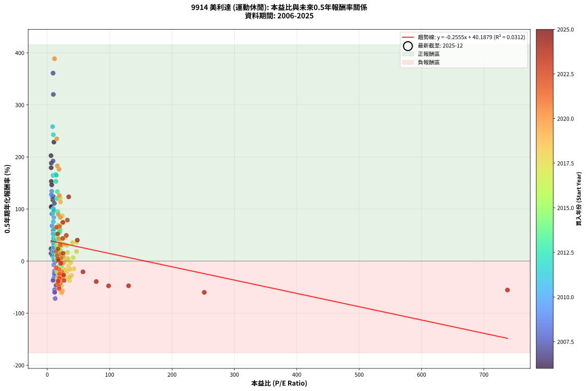
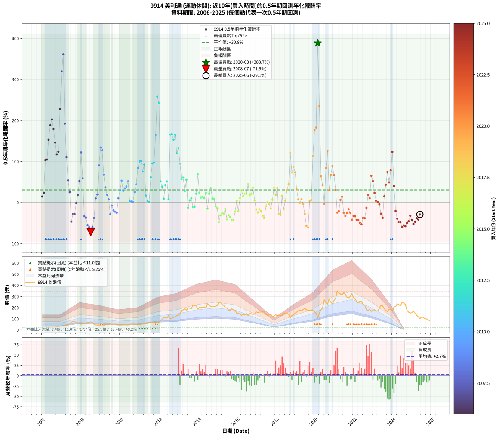

# 9914 美利達 - 本益比與未來報酬率分析

!!! info "報告資訊"
    - **股票代號**: 9914
    - **公司名稱**: 美利達
    - **產業別**: 運動休閒
    - **分析期間**: 2006-2025 (234 個數據點)
    - **資料來源**: Type 12 (ShowMonthlyK_ChartFlow) 月收盤價與本益比
    - **報酬率口徑**: 含現金股利 (簡化: 年度合計，假設每年7/1入帳)
    - **報告生成時間**: 2026-01-04 08:52:08 CST

## 📈 視覺化圖表

### 圖表1: 本益比 vs 未來報酬率關係

*圖表1：9914 美利達 本益比與0.5年期未來報酬率關係 (2006-2025)*

### 圖表2: 歷年買入時點的0.5年期實際報酬率

*圖表2：9914 美利達 歷年買入時點的0.5年期實際報酬率 (2006-2025)*

## 📍 買點訊號說明

本報告提供兩種買點提示訊號（顯示於圖表2的股價子圖中）：

### ▲ 小綠色三角形（回測驗證）
- **計算方式**: 使用全部歷史資料計算本益比第25百分位數
- **用途**: 事後驗證，顯示歷史上哪些時點確實為低估區
- **限制**: 當下無法判斷，僅供回測參考
- **特性**: 後見之明（Look-Ahead Bias）

### ▲ 小橘色三角形（即時訊號）
- **計算方式**: 使用截至當月的過去5年資料計算本益比第25百分位數
- **用途**: 實際投資決策，當時即可判斷
- **優勢**: 可操作性強，符合實務需求
- **特性**: 無後見之明，滾動窗口計算

!!! tip "如何使用兩種訊號"
    - **綠色▲** 幫助理解歷史估值機會，驗證策略有效性
    - **橘色▲** 可作為實際買進參考，但仍需搭配基本面分析
    - 兩種訊號重疊時，表示即時判斷與事後驗證一致，信心度較高
    - 僅有綠色▲時，表示當時無法判斷（需要未來資料才能確認）
    - 僅有橘色▲時，表示即時判斷為買點，但事後可能不是最佳時機

## 📊 估值分析摘要

| 指標 | 數值 |
|:---:|:---:|
| **目前本益比** (2025-06) | **nan 倍** |
| **歷史平均本益比** | 23.64 倍 |
| **估值水準** | 🟡 合理範圍 |
| **預期0.5年年化報酬率** | **+nan%** |
| **歷史平均報酬率** | +30.83% |
| **相關係數 (R²)** | 0.0312 |
| **趨勢線斜率** | -0.2555 |

!!! abstract "核心洞察"
    目前本益比接近歷史平均，預期報酬率符合長期趨勢

    根據歷史數據回測，9914 美利達 在目前本益比 **nan倍** 的估值水準下，
    預期未來0.5年年化報酬率約為 **+nan%**。

    **重要提醒**: 本分析基於歷史數據統計，實際報酬率會受到公司基本面變化、產業趨勢、
    總體經濟環境等多重因素影響。R² = 0.03 表示本益比可解釋約 3.1% 的報酬率變異。

## 📈 歷史估值統計

### 最佳買點 (最高報酬率)

| 項目 | 數值 |
|:---:|:---:|
| 起始時間 | 2020-03 |
| 當時本益比 | 11.54 倍 |
| 起始價格 | 111.0 元 |
| 0.5年後價格 | 277.0 元 |
| **0.5年年化報酬率** | **+388.67%** |

### 最差買點 (最低報酬率)

| 項目 | 數值 |
|:---:|:---:|
| 起始時間 | 2008-07 |
| 當時本益比 | 12.72 倍 |
| 起始價格 | 73.7 元 |
| 0.5年後價格 | 38.9 元 |
| **0.5年年化報酬率** | **-71.87%** |

## 🎯 投資啟示

### 本益比與報酬率關係

趨勢線方程式: **y = -0.2555x + 40.1879**

!!! note "負相關"
    本益比與未來報酬率呈現負相關。較低的本益比通常帶來較高的未來報酬率，
    但相關性不算非常強。**估值仍是重要參考指標之一**。

### 估值區間建議

基於歷史數據分析:

- **🟢 低估區** (P/E < 18.9): 預期報酬率較高，可考慮增加持股
- **🟡 合理區** (P/E 18.9-28.4): 預期報酬率符合長期趨勢，正常持有
- **🔴 高估區** (P/E > 28.4): 預期報酬率較低，可考慮減碼或觀望

!!! danger "風險提示"
    - 過去表現不代表未來結果
    - 本分析假設公司基本面無重大結構性變化
    - 產業環境劇變可能使歷史規律失效
    - 應結合公司財報、產業趨勢、總體經濟等多重因素綜合判斷

!!! success "長期投資觀點"
    歷史數據顯示，在合理或低估的估值水準買入並長期持有，
    往往能獲得較佳的投資報酬。**耐心等待好價格**是價值投資的核心原則。

## 📊 數據品質

- **資料來源**: GoodInfo.tw Type 12 (ShowMonthlyK_ChartFlow)
- **資料頻率**: 月度收盤價與本益比
- **回測期間**: 2006-2025
- **數據點數量**: 234 個 (每個點代表一次0.5年期回測)

### 計算方法說明

1. **0.5年期年化報酬率**:
   - 對每個歷史時點，計算其後0.5年的實際投資報酬率
   - 期末價值(不含股利): 期末價格
   - 期末價值(含現金股利): 期末價格 + 持有期間內的現金股利合計 (簡化: 年度合計，假設每年7/1入帳)
   - 公式: 年化報酬率 = [(期末價值/期初價格)^(1/年數) - 1] × 100%

2. **本益比 (P/E Ratio)**:
   - 使用當時的月收盤價與EPS計算
   - 資料來源: Type 12 月度河流圖本益比數據

3. **趨勢線 (Linear Regression)**:
   - 使用最小平方法擬合線性趨勢線
   - R²值衡量本益比對報酬率的解釋能力

---

*本報告由 Stock Analysis System v1.9.0 自動生成*
*數據更新時間: 2026-01-04 08:52:08 CST*

## 📋 月度回測明細表

（每一列對應時間線圖中的一個買入點；可用來對照 SVG 圖上的每個點。）

| 買入月份 | 賣出月份 | 回測期限_年 | 實際持有年數 | 買入本益比_倍 | 買入收盤價_元 | 賣出收盤價_元 | 現金股利合計_元 | 總報酬率_pct | 年化報酬率_pct |
| --- | --- | --- | --- | --- | --- | --- | --- | --- | --- |
| 2006-01 | 2006-07 | 0.5 | 0.496 | 6.04 | 20.55 | 20.30 | 1.70 | +7.06 | +14.75 |
| 2006-02 | 2006-08 | 0.5 | 0.498 | 6.03 | 20.50 | 21.10 | 1.70 | +11.22 | +23.79 |
| 2006-03 | 2006-10 | 0.5 | 0.586 | 6.24 | 21.20 | 30.45 | 1.70 | +51.65 | +103.55 |
| 2006-04 | 2006-10 | 0.5 | 0.501 | 6.60 | 22.45 | 30.45 | 1.70 | +43.21 | +104.78 |
| 2006-05 | 2006-12 | 0.5 | 0.586 | 6.47 | 22.00 | 36.20 | 1.70 | +72.27 | +153.03 |
| 2006-06 | 2006-12 | 0.5 | 0.501 | 6.56 | 22.30 | 36.20 | 1.70 | +69.96 | +188.22 |
| 2006-07 | 2007-01 | 0.5 | 0.504 | 5.97 | 20.30 | 35.45 | 0.00 | +74.63 | +202.43 |
| 2006-08 | 2007-03 | 0.5 | 0.580 | 6.21 | 21.10 | 38.30 | 0.00 | +81.52 | +179.31 |
| 2006-09 | 2007-03 | 0.5 | 0.496 | 7.21 | 24.50 | 38.30 | 0.00 | +56.33 | +146.35 |
| 2006-10 | 2007-05 | 0.5 | 0.580 | 8.96 | 30.45 | 47.80 | 0.00 | +56.98 | +117.47 |
| 2006-11 | 2007-05 | 0.5 | 0.496 | 9.43 | 32.05 | 47.80 | 0.00 | +49.14 | +124.04 |
| 2006-12 | 2007-07 | 0.5 | 0.580 | 10.65 | 36.20 | 70.40 | 1.80 | +99.45 | +228.52 |
| 2007-01 | 2007-07 | 0.5 | 0.496 | 9.76 | 35.45 | 70.40 | 1.80 | +103.67 | +320.13 |
| 2007-02 | 2007-08 | 0.5 | 0.498 | 9.33 | 36.05 | 75.40 | 1.80 | +114.15 | +360.99 |
| 2007-03 | 2007-10 | 0.5 | 0.586 | 9.35 | 38.30 | 70.00 | 1.80 | +87.47 | +192.30 |
| 2007-04 | 2007-10 | 0.5 | 0.501 | 11.42 | 49.40 | 70.00 | 1.80 | +45.34 | +110.93 |
| 2007-05 | 2007-12 | 0.5 | 0.586 | 10.49 | 47.80 | 59.80 | 1.80 | +28.87 | +54.17 |
| 2007-06 | 2007-12 | 0.5 | 0.501 | 11.48 | 55.00 | 59.80 | 1.80 | +12.00 | +25.38 |
| 2007-07 | 2008-01 | 0.5 | 0.504 | 14.02 | 70.40 | 51.40 | 0.00 | -26.99 | -46.44 |
| 2007-08 | 2008-03 | 0.5 | 0.583 | 14.35 | 75.40 | 62.00 | 0.00 | -17.77 | -28.50 |
| 2007-09 | 2008-03 | 0.5 | 0.498 | 13.33 | 73.10 | 62.00 | 0.00 | -15.18 | -28.14 |
| 2007-10 | 2008-05 | 0.5 | 0.583 | 12.24 | 70.00 | 69.50 | 0.00 | -0.71 | -1.22 |
| 2007-11 | 2008-05 | 0.5 | 0.498 | 10.73 | 63.80 | 69.50 | 0.00 | +8.93 | +18.74 |
| 2007-12 | 2008-07 | 0.5 | 0.583 | 9.68 | 59.80 | 73.70 | 2.80 | +27.93 | +52.55 |
| 2008-01 | 2008-07 | 0.5 | 0.498 | 8.39 | 51.40 | 73.70 | 2.80 | +48.83 | +122.12 |
| 2008-02 | 2008-08 | 0.5 | 0.501 | 9.37 | 56.90 | 69.00 | 2.80 | +26.19 | +59.08 |
| 2008-03 | 2008-10 | 0.5 | 0.586 | 10.31 | 62.00 | 46.00 | 2.80 | -21.29 | -33.54 |
| 2008-04 | 2008-10 | 0.5 | 0.501 | 10.27 | 61.20 | 46.00 | 2.80 | -20.26 | -36.36 |
| 2008-05 | 2008-12 | 0.5 | 0.586 | 11.77 | 69.50 | 40.75 | 2.80 | -37.34 | -54.97 |
| 2008-06 | 2008-12 | 0.5 | 0.501 | 11.79 | 69.00 | 40.75 | 2.80 | -36.88 | -60.09 |
| 2008-07 | 2009-01 | 0.5 | 0.504 | 12.72 | 73.70 | 38.90 | 0.00 | -47.22 | -71.87 |
| 2008-08 | 2009-03 | 0.5 | 0.580 | 12.02 | 69.00 | 40.70 | 0.00 | -41.01 | -59.73 |
| 2008-09 | 2009-03 | 0.5 | 0.496 | 9.01 | 51.20 | 40.70 | 0.00 | -20.51 | -37.07 |
| 2008-10 | 2009-05 | 0.5 | 0.580 | 8.17 | 46.00 | 48.70 | 0.00 | +5.87 | +10.33 |
| 2008-11 | 2009-05 | 0.5 | 0.496 | 7.99 | 44.55 | 48.70 | 0.00 | +9.32 | +19.69 |
| 2008-12 | 2009-07 | 0.5 | 0.580 | 7.38 | 40.75 | 57.30 | 2.00 | +45.52 | +90.85 |
| 2009-01 | 2009-07 | 0.5 | 0.496 | 7.15 | 38.90 | 57.30 | 2.00 | +52.44 | +134.15 |
| 2009-02 | 2009-08 | 0.5 | 0.498 | 6.51 | 34.90 | 50.60 | 2.00 | +50.72 | +127.80 |
| 2009-03 | 2009-10 | 0.5 | 0.586 | 7.71 | 40.70 | 53.10 | 2.00 | +35.38 | +67.70 |
| 2009-04 | 2009-10 | 0.5 | 0.501 | 9.05 | 47.05 | 53.10 | 2.00 | +17.11 | +37.06 |
| 2009-05 | 2009-12 | 0.5 | 0.586 | 9.52 | 48.70 | 52.00 | 2.00 | +10.88 | +19.28 |
| 2009-06 | 2009-12 | 0.5 | 0.501 | 10.33 | 52.00 | 52.00 | 2.00 | +3.85 | +7.82 |
| 2009-07 | 2010-01 | 0.5 | 0.504 | 11.57 | 57.30 | 48.35 | 0.00 | -15.62 | -28.62 |
| 2009-08 | 2010-03 | 0.5 | 0.580 | 10.38 | 50.60 | 48.40 | 0.00 | -4.35 | -7.37 |
| 2009-09 | 2010-03 | 0.5 | 0.496 | 11.23 | 53.80 | 48.40 | 0.00 | -10.04 | -19.22 |
| 2009-10 | 2010-05 | 0.5 | 0.580 | 11.27 | 53.10 | 45.80 | 0.00 | -13.75 | -22.49 |
| 2009-11 | 2010-05 | 0.5 | 0.496 | 11.40 | 52.80 | 45.80 | 0.00 | -13.26 | -24.95 |
| 2009-12 | 2010-07 | 0.5 | 0.580 | 11.43 | 52.00 | 52.10 | 3.00 | +5.96 | +10.49 |
| 2010-01 | 2010-07 | 0.5 | 0.496 | 10.53 | 48.35 | 52.10 | 3.00 | +13.96 | +30.18 |
| 2010-02 | 2010-08 | 0.5 | 0.498 | 9.89 | 45.80 | 53.70 | 3.00 | +23.80 | +53.49 |
| 2010-03 | 2010-10 | 0.5 | 0.586 | 10.36 | 48.40 | 53.10 | 3.00 | +15.91 | +28.66 |
| 2010-04 | 2010-10 | 0.5 | 0.501 | 10.25 | 48.30 | 53.10 | 3.00 | +16.15 | +34.82 |
| 2010-05 | 2010-12 | 0.5 | 0.586 | 9.63 | 45.80 | 52.60 | 3.00 | +21.40 | +39.23 |
| 2010-06 | 2010-12 | 0.5 | 0.501 | 9.41 | 45.10 | 52.60 | 3.00 | +23.28 | +51.85 |
| 2010-07 | 2011-01 | 0.5 | 0.504 | 10.77 | 52.10 | 53.10 | 0.00 | +1.92 | +3.85 |
| 2010-08 | 2011-03 | 0.5 | 0.580 | 11.01 | 53.70 | 54.50 | 0.00 | +1.49 | +2.58 |
| 2010-09 | 2011-03 | 0.5 | 0.496 | 10.98 | 54.00 | 54.50 | 0.00 | +0.93 | +1.88 |
| 2010-10 | 2011-05 | 0.5 | 0.580 | 10.71 | 53.10 | 60.60 | 0.00 | +14.12 | +25.56 |
| 2010-11 | 2011-05 | 0.5 | 0.496 | 10.10 | 50.50 | 60.60 | 0.00 | +20.00 | +44.47 |
| 2010-12 | 2011-07 | 0.5 | 0.580 | 10.44 | 52.60 | 71.60 | 3.30 | +42.40 | +83.85 |
| 2011-01 | 2011-07 | 0.5 | 0.496 | 10.15 | 53.10 | 71.60 | 3.30 | +41.05 | +100.20 |
| 2011-02 | 2011-08 | 0.5 | 0.498 | 9.76 | 52.90 | 71.60 | 3.30 | +41.59 | +100.95 |
| 2011-03 | 2011-10 | 0.5 | 0.586 | 9.71 | 54.50 | 72.50 | 3.30 | +39.08 | +75.60 |
| 2011-04 | 2011-10 | 0.5 | 0.501 | 9.41 | 54.60 | 72.50 | 3.30 | +38.83 | +92.47 |
| 2011-05 | 2011-12 | 0.5 | 0.586 | 10.11 | 60.60 | 63.20 | 3.30 | +9.74 | +17.18 |
| 2011-06 | 2011-12 | 0.5 | 0.501 | 10.56 | 65.30 | 63.20 | 3.30 | +1.84 | +3.70 |
| 2011-07 | 2012-01 | 0.5 | 0.504 | 11.23 | 71.60 | 72.00 | 0.00 | +0.56 | +1.11 |
| 2011-08 | 2012-03 | 0.5 | 0.583 | 10.90 | 71.60 | 94.80 | 0.00 | +32.40 | +61.82 |
| 2011-09 | 2012-03 | 0.5 | 0.498 | 10.05 | 67.90 | 94.80 | 0.00 | +39.62 | +95.38 |
| 2011-10 | 2012-05 | 0.5 | 0.583 | 10.43 | 72.50 | 108.00 | 0.00 | +48.97 | +98.06 |
| 2011-11 | 2012-05 | 0.5 | 0.498 | 9.31 | 66.50 | 108.00 | 0.00 | +62.41 | +164.64 |
| 2011-12 | 2012-07 | 0.5 | 0.583 | 8.62 | 63.20 | 130.00 | 3.00 | +110.44 | +258.19 |
| 2012-01 | 2012-07 | 0.5 | 0.498 | 9.73 | 72.00 | 130.00 | 3.00 | +84.72 | +242.66 |
| 2012-02 | 2012-08 | 0.5 | 0.501 | 11.14 | 83.30 | 99.60 | 3.00 | +23.17 | +51.58 |
| 2012-03 | 2012-10 | 0.5 | 0.586 | 12.56 | 94.80 | 112.00 | 3.00 | +21.31 | +39.05 |
| 2012-04 | 2012-10 | 0.5 | 0.501 | 14.44 | 110.00 | 112.00 | 3.00 | +4.55 | +9.28 |
| 2012-05 | 2012-12 | 0.5 | 0.586 | 14.04 | 108.00 | 130.00 | 3.00 | +23.15 | +42.67 |
| 2012-06 | 2012-12 | 0.5 | 0.501 | 13.91 | 108.00 | 130.00 | 3.00 | +23.15 | +51.53 |
| 2012-07 | 2013-01 | 0.5 | 0.504 | 16.59 | 130.00 | 135.00 | 0.00 | +3.85 | +7.78 |
| 2012-08 | 2013-03 | 0.5 | 0.580 | 12.59 | 99.60 | 175.50 | 0.00 | +76.20 | +165.37 |
| 2012-09 | 2013-03 | 0.5 | 0.496 | 13.53 | 108.00 | 175.50 | 0.00 | +62.50 | +166.37 |
| 2012-10 | 2013-05 | 0.5 | 0.580 | 13.90 | 112.00 | 192.00 | 0.00 | +71.43 | +153.10 |
| 2012-11 | 2013-05 | 0.5 | 0.496 | 14.58 | 118.50 | 192.00 | 0.00 | +62.03 | +164.81 |
| 2012-12 | 2013-07 | 0.5 | 0.580 | 15.85 | 130.00 | 200.00 | 5.50 | +58.08 | +120.10 |
| 2013-01 | 2013-07 | 0.5 | 0.496 | 16.13 | 135.00 | 200.00 | 5.50 | +52.22 | +133.47 |
| 2013-02 | 2013-08 | 0.5 | 0.498 | 16.93 | 144.50 | 196.00 | 5.50 | +39.45 | +94.90 |
| 2013-03 | 2013-10 | 0.5 | 0.586 | 20.17 | 175.50 | 223.00 | 5.50 | +30.20 | +56.90 |
| 2013-04 | 2013-10 | 0.5 | 0.501 | 20.29 | 180.00 | 223.00 | 5.50 | +26.94 | +60.99 |
| 2013-05 | 2013-12 | 0.5 | 0.586 | 21.24 | 192.00 | 216.50 | 5.50 | +15.62 | +28.12 |
| 2013-06 | 2013-12 | 0.5 | 0.501 | 19.34 | 178.00 | 216.50 | 5.50 | +24.72 | +55.41 |
| 2013-07 | 2014-01 | 0.5 | 0.504 | 21.34 | 200.00 | 187.00 | 0.00 | -6.50 | -12.49 |
| 2013-08 | 2014-03 | 0.5 | 0.580 | 20.55 | 196.00 | 202.00 | 0.00 | +3.06 | +5.33 |
| 2013-09 | 2014-03 | 0.5 | 0.496 | 19.78 | 192.00 | 202.00 | 0.00 | +5.21 | +10.79 |
| 2013-10 | 2014-05 | 0.5 | 0.580 | 22.58 | 223.00 | 208.00 | 0.00 | -6.73 | -11.31 |
| 2013-11 | 2014-05 | 0.5 | 0.496 | 21.91 | 220.00 | 208.00 | 0.00 | -5.45 | -10.70 |
| 2013-12 | 2014-07 | 0.5 | 0.580 | 21.20 | 216.50 | 236.50 | 6.00 | +12.01 | +21.58 |
| 2014-01 | 2014-07 | 0.5 | 0.496 | 18.17 | 187.00 | 236.50 | 6.00 | +29.68 | +68.95 |
| 2014-02 | 2014-08 | 0.5 | 0.498 | 19.61 | 203.50 | 220.00 | 6.00 | +11.06 | +23.42 |
| 2014-03 | 2014-10 | 0.5 | 0.586 | 19.32 | 202.00 | 210.00 | 6.00 | +6.93 | +12.12 |
| 2014-04 | 2014-10 | 0.5 | 0.501 | 19.17 | 202.00 | 210.00 | 6.00 | +6.93 | +14.31 |
| 2014-05 | 2014-12 | 0.5 | 0.586 | 19.58 | 208.00 | 214.50 | 6.00 | +6.01 | +10.47 |
| 2014-06 | 2014-12 | 0.5 | 0.501 | 18.50 | 198.00 | 214.50 | 6.00 | +11.36 | +23.96 |
| 2014-07 | 2015-01 | 0.5 | 0.504 | 21.92 | 236.50 | 218.00 | 0.00 | -7.82 | -14.93 |
| 2014-08 | 2015-03 | 0.5 | 0.580 | 20.24 | 220.00 | 246.00 | 0.00 | +11.82 | +21.22 |
| 2014-09 | 2015-03 | 0.5 | 0.496 | 19.36 | 212.00 | 246.00 | 0.00 | +16.04 | +35.01 |
| 2014-10 | 2015-05 | 0.5 | 0.580 | 19.03 | 210.00 | 221.50 | 0.00 | +5.48 | +9.62 |
| 2014-11 | 2015-05 | 0.5 | 0.496 | 19.07 | 212.00 | 221.50 | 0.00 | +4.48 | +9.25 |
| 2014-12 | 2015-07 | 0.5 | 0.580 | 19.15 | 214.50 | 196.00 | 6.80 | -5.45 | -9.21 |
| 2015-01 | 2015-07 | 0.5 | 0.496 | 19.61 | 218.00 | 196.00 | 6.80 | -6.97 | -13.57 |
| 2015-02 | 2015-08 | 0.5 | 0.498 | 22.99 | 253.50 | 177.00 | 6.80 | -27.50 | -47.55 |
| 2015-03 | 2015-10 | 0.5 | 0.586 | 22.48 | 246.00 | 190.50 | 6.80 | -19.80 | -31.38 |
| 2015-04 | 2015-10 | 0.5 | 0.501 | 21.19 | 230.00 | 190.50 | 6.80 | -14.22 | -26.37 |
| 2015-05 | 2015-12 | 0.5 | 0.586 | 20.56 | 221.50 | 177.00 | 6.80 | -17.02 | -27.27 |
| 2015-06 | 2015-12 | 0.5 | 0.501 | 18.72 | 200.00 | 177.00 | 6.80 | -8.10 | -15.51 |
| 2015-07 | 2016-01 | 0.5 | 0.504 | 18.49 | 196.00 | 150.00 | 0.00 | -23.47 | -41.20 |
| 2015-08 | 2016-03 | 0.5 | 0.583 | 16.84 | 177.00 | 142.50 | 0.00 | -19.49 | -31.05 |
| 2015-09 | 2016-03 | 0.5 | 0.498 | 16.97 | 177.00 | 142.50 | 0.00 | -19.49 | -35.28 |
| 2015-10 | 2016-05 | 0.5 | 0.583 | 18.42 | 190.50 | 137.50 | 0.00 | -27.82 | -42.83 |
| 2015-11 | 2016-05 | 0.5 | 0.498 | 17.70 | 181.50 | 137.50 | 0.00 | -24.24 | -42.72 |
| 2015-12 | 2016-07 | 0.5 | 0.583 | 17.40 | 177.00 | 147.50 | 5.50 | -13.56 | -22.11 |
| 2016-01 | 2016-07 | 0.5 | 0.498 | 15.22 | 150.00 | 147.50 | 5.50 | +2.00 | +4.05 |
| 2016-02 | 2016-08 | 0.5 | 0.501 | 15.92 | 152.00 | 129.50 | 5.50 | -11.18 | -21.08 |
| 2016-03 | 2016-10 | 0.5 | 0.586 | 15.43 | 142.50 | 145.50 | 5.50 | +5.96 | +10.39 |
| 2016-04 | 2016-10 | 0.5 | 0.501 | 14.85 | 132.50 | 145.50 | 5.50 | +13.96 | +29.80 |
| 2016-05 | 2016-12 | 0.5 | 0.586 | 15.97 | 137.50 | 144.00 | 5.50 | +8.73 | +15.35 |
| 2016-06 | 2016-12 | 0.5 | 0.501 | 16.34 | 135.50 | 144.00 | 5.50 | +10.33 | +21.68 |
| 2016-07 | 2017-01 | 0.5 | 0.504 | 18.48 | 147.50 | 162.50 | 0.00 | +10.17 | +21.20 |
| 2016-08 | 2017-03 | 0.5 | 0.580 | 16.88 | 129.50 | 160.50 | 0.00 | +23.94 | +44.74 |
| 2016-09 | 2017-03 | 0.5 | 0.496 | 20.12 | 148.00 | 160.50 | 0.00 | +8.45 | +17.78 |
| 2016-10 | 2017-05 | 0.5 | 0.580 | 20.65 | 145.50 | 162.50 | 0.00 | +11.68 | +20.97 |
| 2016-11 | 2017-05 | 0.5 | 0.496 | 20.72 | 139.50 | 162.50 | 0.00 | +16.49 | +36.07 |
| 2016-12 | 2017-07 | 0.5 | 0.580 | 22.43 | 144.00 | 144.50 | 4.00 | +3.12 | +5.44 |
| 2017-01 | 2017-07 | 0.5 | 0.496 | 26.61 | 162.50 | 144.50 | 4.00 | -8.62 | -16.62 |
| 2017-02 | 2017-08 | 0.5 | 0.498 | 27.09 | 157.00 | 132.50 | 4.00 | -13.06 | -24.48 |
| 2017-03 | 2017-10 | 0.5 | 0.586 | 29.27 | 160.50 | 140.50 | 4.00 | -9.97 | -16.41 |
| 2017-04 | 2017-10 | 0.5 | 0.501 | 31.33 | 162.00 | 140.50 | 4.00 | -10.80 | -20.40 |
| 2017-05 | 2017-12 | 0.5 | 0.586 | 33.45 | 162.50 | 125.00 | 4.00 | -20.62 | -32.57 |
| 2017-06 | 2017-12 | 0.5 | 0.501 | 35.86 | 163.00 | 125.00 | 4.00 | -20.86 | -37.31 |
| 2017-07 | 2018-01 | 0.5 | 0.504 | 34.14 | 144.50 | 137.50 | 0.00 | -4.84 | -9.39 |
| 2017-08 | 2018-03 | 0.5 | 0.580 | 33.80 | 132.50 | 133.50 | 0.00 | +0.75 | +1.30 |
| 2017-09 | 2018-03 | 0.5 | 0.496 | 37.56 | 135.50 | 133.50 | 0.00 | -1.48 | -2.96 |
| 2017-10 | 2018-05 | 0.5 | 0.580 | 42.64 | 140.50 | 128.00 | 0.00 | -8.90 | -14.83 |
| 2017-11 | 2018-05 | 0.5 | 0.496 | 41.58 | 124.00 | 128.00 | 0.00 | +3.23 | +6.62 |
| 2017-12 | 2018-07 | 0.5 | 0.580 | 46.82 | 125.00 | 147.50 | 2.00 | +19.60 | +36.12 |
| 2018-01 | 2018-07 | 0.5 | 0.496 | 47.02 | 137.50 | 147.50 | 2.00 | +8.73 | +18.39 |
| 2018-02 | 2018-08 | 0.5 | 0.498 | 40.43 | 128.50 | 147.50 | 2.00 | +16.34 | +35.50 |
| 2018-03 | 2018-10 | 0.5 | 0.586 | 38.89 | 133.50 | 108.50 | 2.00 | -17.23 | -27.58 |
| 2018-04 | 2018-10 | 0.5 | 0.501 | 35.94 | 132.50 | 108.50 | 2.00 | -16.60 | -30.40 |
| 2018-05 | 2018-12 | 0.5 | 0.586 | 32.48 | 128.00 | 138.00 | 2.00 | +9.38 | +16.53 |
| 2018-06 | 2018-12 | 0.5 | 0.501 | 36.35 | 152.50 | 138.00 | 2.00 | -8.20 | -15.69 |
| 2018-07 | 2019-01 | 0.5 | 0.504 | 33.15 | 147.50 | 151.00 | 0.00 | +2.37 | +4.77 |
| 2018-08 | 2019-03 | 0.5 | 0.580 | 31.36 | 147.50 | 172.00 | 0.00 | +16.61 | +30.31 |
| 2018-09 | 2019-03 | 0.5 | 0.496 | 28.85 | 143.00 | 172.00 | 0.00 | +20.28 | +45.15 |
| 2018-10 | 2019-05 | 0.5 | 0.580 | 20.82 | 108.50 | 172.00 | 0.00 | +58.53 | +121.18 |
| 2018-11 | 2019-05 | 0.5 | 0.496 | 23.97 | 131.00 | 172.00 | 0.00 | +31.30 | +73.24 |
| 2018-12 | 2019-07 | 0.5 | 0.580 | 24.13 | 138.00 | 195.00 | 3.50 | +43.84 | +87.07 |
| 2019-01 | 2019-07 | 0.5 | 0.496 | 25.42 | 151.00 | 195.00 | 3.50 | +31.46 | +73.66 |
| 2019-02 | 2019-08 | 0.5 | 0.498 | 26.13 | 161.00 | 181.50 | 3.50 | +14.91 | +32.16 |
| 2019-03 | 2019-10 | 0.5 | 0.586 | 26.95 | 172.00 | 176.00 | 3.50 | +4.36 | +7.56 |
| 2019-04 | 2019-10 | 0.5 | 0.501 | 27.26 | 180.00 | 176.00 | 3.50 | -0.28 | -0.55 |
| 2019-05 | 2019-12 | 0.5 | 0.586 | 25.20 | 172.00 | 176.50 | 3.50 | +4.65 | +8.07 |
| 2019-06 | 2019-12 | 0.5 | 0.501 | 26.05 | 183.50 | 176.50 | 3.50 | -1.91 | -3.77 |
| 2019-07 | 2020-01 | 0.5 | 0.504 | 26.84 | 195.00 | 165.50 | 0.00 | -15.13 | -27.79 |
| 2019-08 | 2020-03 | 0.5 | 0.583 | 24.24 | 181.50 | 111.00 | 0.00 | -38.84 | -56.97 |
| 2019-09 | 2020-03 | 0.5 | 0.498 | 22.90 | 176.50 | 111.00 | 0.00 | -37.11 | -60.57 |
| 2019-10 | 2020-05 | 0.5 | 0.583 | 22.20 | 176.00 | 180.00 | 0.00 | +2.27 | +3.93 |
| 2019-11 | 2020-05 | 0.5 | 0.498 | 21.47 | 175.00 | 180.00 | 0.00 | +2.86 | +5.82 |
| 2019-12 | 2020-07 | 0.5 | 0.583 | 21.09 | 176.50 | 270.50 | 4.20 | +55.64 | +113.52 |
| 2020-01 | 2020-07 | 0.5 | 0.498 | 18.84 | 165.50 | 270.50 | 4.20 | +65.98 | +176.46 |
| 2020-02 | 2020-08 | 0.5 | 0.501 | 16.08 | 148.00 | 245.00 | 4.20 | +68.38 | +182.91 |
| 2020-03 | 2020-10 | 0.5 | 0.586 | 11.54 | 111.00 | 277.00 | 4.20 | +153.33 | +388.67 |
| 2020-04 | 2020-10 | 0.5 | 0.501 | 15.30 | 153.50 | 277.00 | 4.20 | +83.19 | +234.76 |
| 2020-05 | 2020-12 | 0.5 | 0.586 | 17.23 | 180.00 | 236.00 | 4.20 | +33.44 | +63.63 |
| 2020-06 | 2020-12 | 0.5 | 0.501 | 18.50 | 201.00 | 236.00 | 4.20 | +19.50 | +42.70 |
| 2020-07 | 2021-01 | 0.5 | 0.504 | 23.98 | 270.50 | 265.50 | 0.00 | -1.85 | -3.64 |
| 2020-08 | 2021-03 | 0.5 | 0.580 | 20.95 | 245.00 | 349.00 | 0.00 | +42.45 | +83.97 |
| 2020-09 | 2021-03 | 0.5 | 0.496 | 19.24 | 233.00 | 349.00 | 0.00 | +49.79 | +125.99 |
| 2020-10 | 2021-05 | 0.5 | 0.580 | 22.11 | 277.00 | 322.50 | 0.00 | +16.43 | +29.96 |
| 2020-11 | 2021-05 | 0.5 | 0.496 | 19.31 | 250.00 | 322.50 | 0.00 | +29.00 | +67.17 |
| 2020-12 | 2021-07 | 0.5 | 0.580 | 17.66 | 236.00 | 335.00 | 7.00 | +44.92 | +89.49 |
| 2021-01 | 2021-07 | 0.5 | 0.496 | 19.60 | 265.50 | 335.00 | 7.00 | +28.81 | +66.69 |
| 2021-02 | 2021-08 | 0.5 | 0.498 | 20.77 | 285.00 | 319.00 | 7.00 | +14.39 | +30.96 |
| 2021-03 | 2021-10 | 0.5 | 0.586 | 25.09 | 349.00 | 289.00 | 7.00 | -15.19 | -24.51 |
| 2021-04 | 2021-10 | 0.5 | 0.501 | 23.63 | 333.00 | 289.00 | 7.00 | -11.11 | -20.95 |
| 2021-05 | 2021-12 | 0.5 | 0.586 | 22.60 | 322.50 | 327.50 | 7.00 | +3.72 | +6.43 |
| 2021-06 | 2021-12 | 0.5 | 0.501 | 21.65 | 313.00 | 327.50 | 7.00 | +6.87 | +14.18 |
| 2021-07 | 2022-01 | 0.5 | 0.504 | 22.89 | 335.00 | 290.00 | 0.00 | -13.43 | -24.90 |
| 2021-08 | 2022-03 | 0.5 | 0.580 | 21.52 | 319.00 | 253.00 | 0.00 | -20.69 | -32.93 |
| 2021-09 | 2022-03 | 0.5 | 0.496 | 19.50 | 292.50 | 253.00 | 0.00 | -13.50 | -25.38 |
| 2021-10 | 2022-05 | 0.5 | 0.580 | 19.03 | 289.00 | 260.50 | 0.00 | -9.86 | -16.38 |
| 2021-11 | 2022-05 | 0.5 | 0.496 | 19.52 | 300.00 | 260.50 | 0.00 | -13.17 | -24.79 |
| 2021-12 | 2022-07 | 0.5 | 0.580 | 21.06 | 327.50 | 230.00 | 8.00 | -27.33 | -42.30 |
| 2022-01 | 2022-07 | 0.5 | 0.496 | 19.08 | 290.00 | 230.00 | 8.00 | -17.93 | -32.89 |
| 2022-02 | 2022-08 | 0.5 | 0.498 | 19.06 | 283.00 | 223.00 | 8.00 | -18.37 | -33.47 |
| 2022-03 | 2022-10 | 0.5 | 0.586 | 17.45 | 253.00 | 176.00 | 8.00 | -27.27 | -41.93 |
| 2022-04 | 2022-10 | 0.5 | 0.501 | 17.14 | 242.50 | 176.00 | 8.00 | -24.12 | -42.36 |
| 2022-05 | 2022-12 | 0.5 | 0.586 | 18.88 | 260.50 | 167.00 | 8.00 | -32.82 | -49.29 |
| 2022-06 | 2022-12 | 0.5 | 0.501 | 19.00 | 255.50 | 167.00 | 8.00 | -31.51 | -53.01 |
| 2022-07 | 2023-01 | 0.5 | 0.504 | 17.57 | 230.00 | 181.50 | 0.00 | -21.09 | -37.51 |
| 2022-08 | 2023-03 | 0.5 | 0.580 | 17.50 | 223.00 | 168.50 | 0.00 | -24.44 | -38.30 |
| 2022-09 | 2023-03 | 0.5 | 0.496 | 14.57 | 180.50 | 168.50 | 0.00 | -6.65 | -12.96 |
| 2022-10 | 2023-05 | 0.5 | 0.580 | 14.62 | 176.00 | 194.50 | 0.00 | +10.51 | +18.79 |
| 2022-11 | 2023-05 | 0.5 | 0.496 | 15.82 | 185.00 | 194.50 | 0.00 | +5.14 | +10.63 |
| 2022-12 | 2023-07 | 0.5 | 0.580 | 14.73 | 167.00 | 216.50 | 7.00 | +33.83 | +65.21 |
| 2023-01 | 2023-07 | 0.5 | 0.496 | 16.70 | 181.50 | 216.50 | 7.00 | +23.14 | +52.20 |
| 2023-02 | 2023-08 | 0.5 | 0.498 | 17.32 | 180.00 | 193.00 | 7.00 | +11.11 | +23.55 |
| 2023-03 | 2023-10 | 0.5 | 0.586 | 16.99 | 168.50 | 165.50 | 7.00 | +2.37 | +4.09 |
| 2023-04 | 2023-10 | 0.5 | 0.501 | 18.15 | 171.50 | 165.50 | 7.00 | +0.58 | +1.17 |
| 2023-05 | 2023-12 | 0.5 | 0.586 | 21.68 | 194.50 | 182.50 | 7.00 | -2.57 | -4.35 |
| 2023-06 | 2023-12 | 0.5 | 0.501 | 26.12 | 222.00 | 182.50 | 7.00 | -14.64 | -27.09 |
| 2023-07 | 2024-01 | 0.5 | 0.504 | 26.97 | 216.50 | 171.50 | 0.00 | -20.79 | -37.03 |
| 2023-08 | 2024-03 | 0.5 | 0.583 | 25.55 | 193.00 | 209.50 | 0.00 | +8.55 | +15.10 |
| 2023-09 | 2024-03 | 0.5 | 0.498 | 24.72 | 175.00 | 209.50 | 0.00 | +19.71 | +43.49 |
| 2023-10 | 2024-05 | 0.5 | 0.583 | 25.05 | 165.50 | 229.00 | 0.00 | +38.37 | +74.52 |
| 2023-11 | 2024-05 | 0.5 | 0.498 | 30.57 | 187.50 | 229.00 | 0.00 | +22.13 | +49.37 |
| 2023-12 | 2024-07 | 0.5 | 0.583 | 32.24 | 182.50 | 250.00 | 6.00 | +40.27 | +78.66 |
| 2024-01 | 2024-07 | 0.5 | 0.498 | 34.35 | 171.50 | 250.00 | 6.00 | +49.27 | +123.43 |
| 2024-02 | 2024-08 | 0.5 | 0.501 | 48.19 | 208.50 | 241.00 | 6.00 | +18.47 | +40.24 |
| 2024-03 | 2024-10 | 0.5 | 0.586 | 57.24 | 209.50 | 177.00 | 6.00 | -12.65 | -20.61 |
| 2024-04 | 2024-10 | 0.5 | 0.501 | 78.51 | 235.00 | 177.00 | 6.00 | -22.13 | -39.30 |
| 2024-05 | 2024-12 | 0.5 | 0.586 | 98.42 | 229.00 | 151.00 | 6.00 | -31.44 | -47.50 |
| 2024-06 | 2024-12 | 0.5 | 0.501 | 130.40 | 216.50 | 151.00 | 6.00 | -27.48 | -47.34 |
| 2024-07 | 2025-01 | 0.5 | 0.504 | 251.70 | 250.00 | 157.50 | 0.00 | -37.00 | -60.03 |
| 2024-08 | 2025-03 | 0.5 | 0.580 | 737.80 | 241.00 | 150.50 | 0.00 | -37.55 | -55.57 |
| 2024-09 | 2025-03 | 0.5 | 0.496 |  | 230.00 | 150.50 | 0.00 | -34.57 | -57.51 |
| 2024-10 | 2025-05 | 0.5 | 0.580 |  | 177.00 | 118.50 | 0.00 | -33.05 | -49.91 |
| 2024-11 | 2025-05 | 0.5 | 0.496 |  | 160.00 | 118.50 | 0.00 | -25.94 | -45.44 |
| 2024-12 | 2025-07 | 0.5 | 0.580 |  | 151.00 | 116.50 | 4.00 | -20.20 | -32.21 |
| 2025-01 | 2025-07 | 0.5 | 0.496 |  | 157.50 | 116.50 | 4.00 | -23.49 | -41.75 |
| 2025-02 | 2025-08 | 0.5 | 0.498 |  | 169.50 | 113.50 | 4.00 | -30.68 | -52.07 |
| 2025-03 | 2025-10 | 0.5 | 0.586 |  | 150.50 | 100.00 | 4.00 | -30.90 | -46.78 |
| 2025-04 | 2025-10 | 0.5 | 0.501 |  | 132.00 | 100.00 | 4.00 | -21.21 | -37.86 |
| 2025-05 | 2025-12 | 0.5 | 0.586 |  | 118.50 | 82.70 | 4.00 | -26.84 | -41.33 |
| 2025-06 | 2025-12 | 0.5 | 0.501 |  | 103.00 | 82.70 | 4.00 | -15.83 | -29.10 |
