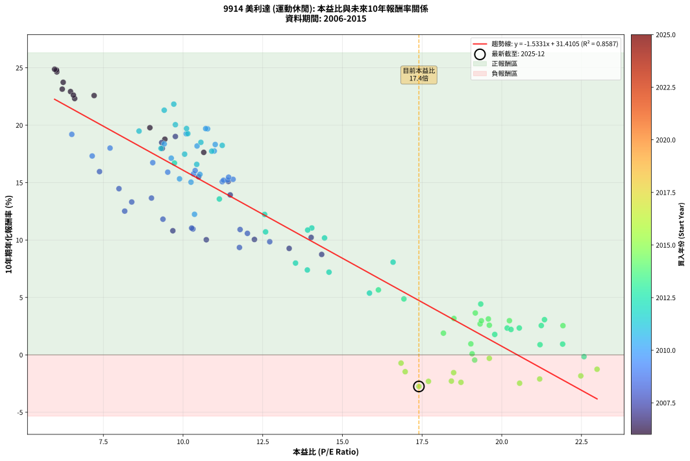
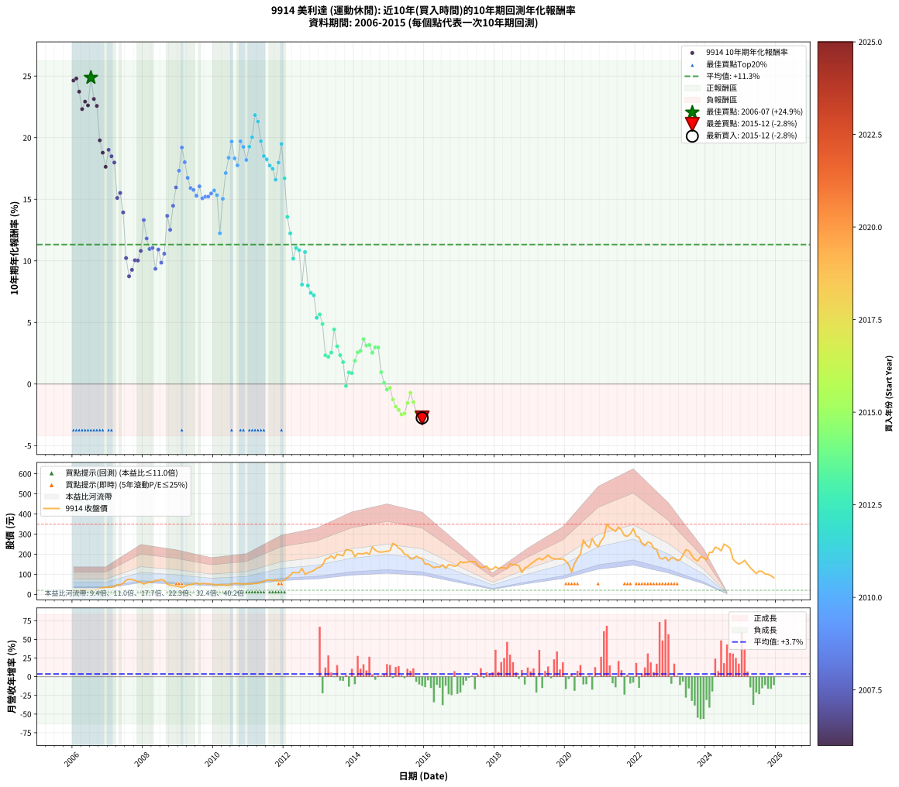

# 9914 美利達 - 本益比與未來報酬率分析

!!! info "報告資訊"
    - **股票代號**: 9914
    - **公司名稱**: 美利達
    - **產業別**: 運動休閒
    - **分析期間**: 2006-2015 (120 個數據點)
    - **資料來源**: Type 12 (ShowMonthlyK_ChartFlow) 月收盤價與本益比
    - **報酬率口徑**: 含現金股利 (簡化: 年度合計，假設每年7/1入帳)
    - **報告生成時間**: 2026-01-06 23:19:47 CST

## 📈 視覺化圖表

### 圖表1: 本益比 vs 未來報酬率關係

*圖表1：9914 美利達 本益比與10年期未來報酬率關係 (2006-2015)*

### 圖表2: 歷年買入時點的10年期實際報酬率

*圖表2：9914 美利達 歷年買入時點的10年期實際報酬率 (2006-2015)*

## 📍 買點訊號說明

本報告提供兩種買點提示訊號（顯示於圖表2的股價子圖中）：

### ▲ 小綠色三角形（回測驗證）
- **計算方式**: 使用全部歷史資料計算本益比第25百分位數
- **用途**: 事後驗證，顯示歷史上哪些時點確實為低估區
- **限制**: 當下無法判斷，僅供回測參考
- **特性**: 後見之明（Look-Ahead Bias）

### ▲ 小橘色三角形（即時訊號）
- **計算方式**: 使用截至當月的過去5年資料計算本益比第25百分位數
- **用途**: 實際投資決策，當時即可判斷
- **優勢**: 可操作性強，符合實務需求
- **特性**: 無後見之明，滾動窗口計算

!!! tip "如何使用兩種訊號"
    - **綠色▲** 幫助理解歷史估值機會，驗證策略有效性
    - **橘色▲** 可作為實際買進參考，但仍需搭配基本面分析
    - 兩種訊號重疊時，表示即時判斷與事後驗證一致，信心度較高
    - 僅有綠色▲時，表示當時無法判斷（需要未來資料才能確認）
    - 僅有橘色▲時，表示即時判斷為買點，但事後可能不是最佳時機

## 📊 估值分析摘要

| 指標 | 數值 |
|:---:|:---:|
| **目前本益比** (2015-12) | **17.40 倍** |
| **歷史平均本益比** | 13.10 倍 |
| **估值水準** | 🔴 相對高估 |
| **預期10年年化報酬率** | **+4.73%** |
| **歷史平均報酬率** | +11.32% |
| **相關係數 (R²)** | 0.8587 |
| **趨勢線斜率** | -1.5331 |

!!! abstract "核心洞察"
    目前本益比顯著高於歷史平均，預期未來報酬率可能較低

    根據歷史數據回測，9914 美利達 在目前本益比 **17.4倍** 的估值水準下，
    預期未來10年年化報酬率約為 **+4.7%**。

    **重要提醒**: 本分析基於歷史數據統計，實際報酬率會受到公司基本面變化、產業趨勢、
    總體經濟環境等多重因素影響。R² = 0.86 表示本益比可解釋約 85.9% 的報酬率變異。

## 📈 歷史估值統計

### 最佳買點 (最高報酬率)

| 項目 | 數值 |
|:---:|:---:|
| 起始時間 | 2006-07 |
| 當時本益比 | 5.97 倍 |
| 起始價格 | 20.3 元 |
| 10年後價格 | 147.5 元 |
| **10年年化報酬率** | **+24.87%** |

### 最差買點 (最低報酬率)

| 項目 | 數值 |
|:---:|:---:|
| 起始時間 | 2015-12 |
| 當時本益比 | 17.40 倍 |
| 起始價格 | 177.0 元 |
| 10年後價格 | 82.7 元 |
| **10年年化報酬率** | **-2.75%** |

## 🎯 投資啟示

### 本益比與報酬率關係

趨勢線方程式: **y = -1.5331x + 31.4105**

!!! warning "強負相關"
    本益比與未來報酬率呈現強負相關。在高本益比時期買入，未來報酬率顯著較低；
    在低本益比時期買入，未來報酬率顯著較高。**估值紀律至關重要**。

### 估值區間建議

基於歷史數據分析:

- **🟢 低估區** (P/E < 10.5): 預期報酬率較高，可考慮增加持股
- **🟡 合理區** (P/E 10.5-15.7): 預期報酬率符合長期趨勢，正常持有
- **🔴 高估區** (P/E > 15.7): 預期報酬率較低，可考慮減碼或觀望

!!! danger "風險提示"
    - 過去表現不代表未來結果
    - 本分析假設公司基本面無重大結構性變化
    - 產業環境劇變可能使歷史規律失效
    - 應結合公司財報、產業趨勢、總體經濟等多重因素綜合判斷

!!! success "長期投資觀點"
    歷史數據顯示，在合理或低估的估值水準買入並長期持有，
    往往能獲得較佳的投資報酬。**耐心等待好價格**是價值投資的核心原則。

## 📊 數據品質

- **資料來源**: GoodInfo.tw Type 12 (ShowMonthlyK_ChartFlow)
- **資料頻率**: 月度收盤價與本益比
- **回測期間**: 2006-2015
- **數據點數量**: 120 個 (每個點代表一次10年期回測)

### 計算方法說明

1. **10年期年化報酬率**:
   - 對每個歷史時點，計算其後10年的實際投資報酬率
   - 期末價值(不含股利): 期末價格
   - 期末價值(含現金股利): 期末價格 + 持有期間內的現金股利合計 (簡化: 年度合計，假設每年7/1入帳)
   - 公式: 年化報酬率 = [(期末價值/期初價格)^(1/年數) - 1] × 100%

2. **本益比 (P/E Ratio)**:
   - 使用當時的月收盤價與EPS計算
   - 資料來源: Type 12 月度河流圖本益比數據

3. **趨勢線 (Linear Regression)**:
   - 使用最小平方法擬合線性趨勢線
   - R²值衡量本益比對報酬率的解釋能力

---

*本報告由 Stock Analysis System v1.9.0 自動生成*
*數據更新時間: 2026-01-06 23:19:47 CST*

## 📋 月度回測明細表

（每一列對應時間線圖中的一個買入點；可用來對照 SVG 圖上的每個點。）

| 買入月份 | 賣出月份 | 回測期限_年 | 實際持有年數 | 買入本益比_倍 | 買入收盤價_元 | 賣出收盤價_元 | 現金股利合計_元 | 總報酬率_pct | 年化報酬率_pct |
| --- | --- | --- | --- | --- | --- | --- | --- | --- | --- |
| 2006-01 | 2016-01 | 10 | 9.999 | 6.04 | 20.55 | 150.00 | 35.90 | +804.62 | +24.64 |
| 2006-02 | 2016-02 | 10 | 9.999 | 6.03 | 20.50 | 152.00 | 35.90 | +816.59 | +24.80 |
| 2006-03 | 2016-03 | 10 | 10.001 | 6.24 | 21.20 | 142.50 | 35.90 | +741.51 | +23.74 |
| 2006-04 | 2016-04 | 10 | 10.001 | 6.60 | 22.45 | 132.50 | 35.90 | +650.11 | +22.32 |
| 2006-05 | 2016-05 | 10 | 10.001 | 6.47 | 22.00 | 137.50 | 35.90 | +688.18 | +22.93 |
| 2006-06 | 2016-06 | 10 | 10.001 | 6.56 | 22.30 | 135.50 | 35.90 | +668.61 | +22.62 |
| 2006-07 | 2016-07 | 10 | 10.001 | 5.97 | 20.30 | 147.50 | 39.70 | +822.17 | +24.87 |
| 2006-08 | 2016-08 | 10 | 10.001 | 6.21 | 21.10 | 129.50 | 39.70 | +701.90 | +23.14 |
| 2006-09 | 2016-09 | 10 | 10.001 | 7.21 | 24.50 | 148.00 | 39.70 | +666.12 | +22.58 |
| 2006-10 | 2016-10 | 10 | 10.001 | 8.96 | 30.45 | 145.50 | 39.70 | +508.21 | +19.78 |
| 2006-11 | 2016-11 | 10 | 10.001 | 9.43 | 32.05 | 139.50 | 39.70 | +459.13 | +18.78 |
| 2006-12 | 2016-12 | 10 | 10.001 | 10.65 | 36.20 | 144.00 | 39.70 | +407.46 | +17.63 |
| 2007-01 | 2017-01 | 10 | 10.001 | 9.76 | 35.45 | 162.50 | 39.70 | +470.38 | +19.02 |
| 2007-02 | 2017-02 | 10 | 10.001 | 9.33 | 36.05 | 157.00 | 39.70 | +445.63 | +18.49 |
| 2007-03 | 2017-03 | 10 | 10.001 | 9.35 | 38.30 | 160.50 | 39.70 | +422.72 | +17.98 |
| 2007-04 | 2017-04 | 10 | 10.001 | 11.42 | 49.40 | 162.00 | 39.70 | +308.30 | +15.10 |
| 2007-05 | 2017-05 | 10 | 10.001 | 10.49 | 47.80 | 162.50 | 39.70 | +323.01 | +15.51 |
| 2007-06 | 2017-06 | 10 | 10.001 | 11.48 | 55.00 | 163.00 | 39.70 | +268.55 | +13.93 |
| 2007-07 | 2017-07 | 10 | 10.001 | 14.02 | 70.40 | 144.50 | 41.90 | +164.77 | +10.23 |
| 2007-08 | 2017-08 | 10 | 10.001 | 14.35 | 75.40 | 132.50 | 41.90 | +131.30 | +8.75 |
| 2007-09 | 2017-09 | 10 | 10.001 | 13.33 | 73.10 | 135.50 | 41.90 | +142.68 | +9.27 |
| 2007-10 | 2017-10 | 10 | 10.001 | 12.24 | 70.00 | 140.50 | 41.90 | +160.57 | +10.05 |
| 2007-11 | 2017-11 | 10 | 10.001 | 10.73 | 63.80 | 124.00 | 41.90 | +160.03 | +10.03 |
| 2007-12 | 2017-12 | 10 | 10.001 | 9.68 | 59.80 | 125.00 | 41.90 | +179.10 | +10.81 |
| 2008-01 | 2018-01 | 10 | 10.001 | 8.39 | 51.40 | 137.50 | 41.90 | +249.03 | +13.31 |
| 2008-02 | 2018-03 | 10 | 10.081 | 9.37 | 56.90 | 133.50 | 41.90 | +208.26 | +11.81 |
| 2008-03 | 2018-03 | 10 | 9.999 | 10.31 | 62.00 | 133.50 | 41.90 | +182.90 | +10.96 |
| 2008-04 | 2018-04 | 10 | 9.999 | 10.27 | 61.20 | 132.50 | 41.90 | +184.97 | +11.04 |
| 2008-05 | 2018-05 | 10 | 9.999 | 11.77 | 69.50 | 128.00 | 41.90 | +144.46 | +9.35 |
| 2008-06 | 2018-06 | 10 | 9.999 | 11.79 | 69.00 | 152.50 | 41.90 | +181.74 | +10.92 |
| 2008-07 | 2018-07 | 10 | 9.999 | 12.72 | 73.70 | 147.50 | 41.10 | +155.90 | +9.85 |
| 2008-08 | 2018-08 | 10 | 9.999 | 12.02 | 69.00 | 147.50 | 41.10 | +173.33 | +10.58 |
| 2008-09 | 2018-09 | 10 | 9.999 | 9.01 | 51.20 | 143.00 | 41.10 | +259.57 | +13.65 |
| 2008-10 | 2018-10 | 10 | 9.999 | 8.17 | 46.00 | 108.50 | 41.10 | +225.22 | +12.52 |
| 2008-11 | 2018-11 | 10 | 9.999 | 7.99 | 44.55 | 131.00 | 41.10 | +286.31 | +14.47 |
| 2008-12 | 2018-12 | 10 | 9.999 | 7.38 | 40.75 | 138.00 | 41.10 | +339.51 | +15.96 |
| 2009-01 | 2019-01 | 10 | 9.999 | 7.15 | 38.90 | 151.00 | 41.10 | +393.83 | +17.32 |
| 2009-02 | 2019-02 | 10 | 9.999 | 6.51 | 34.90 | 161.00 | 41.10 | +479.08 | +19.20 |
| 2009-03 | 2019-03 | 10 | 9.999 | 7.71 | 40.70 | 172.00 | 41.10 | +423.59 | +18.01 |
| 2009-04 | 2019-04 | 10 | 9.999 | 9.05 | 47.05 | 180.00 | 41.10 | +369.93 | +16.74 |
| 2009-05 | 2019-05 | 10 | 9.999 | 9.52 | 48.70 | 172.00 | 41.10 | +337.58 | +15.91 |
| 2009-06 | 2019-06 | 10 | 9.999 | 10.33 | 52.00 | 183.50 | 41.10 | +331.92 | +15.76 |
| 2009-07 | 2019-07 | 10 | 9.999 | 11.57 | 57.30 | 195.00 | 42.60 | +314.66 | +15.29 |
| 2009-08 | 2019-08 | 10 | 9.999 | 10.38 | 50.60 | 181.50 | 42.60 | +342.89 | +16.05 |
| 2009-09 | 2019-09 | 10 | 9.999 | 11.23 | 53.80 | 176.50 | 42.60 | +307.25 | +15.08 |
| 2009-10 | 2019-10 | 10 | 9.999 | 11.27 | 53.10 | 176.00 | 42.60 | +311.68 | +15.20 |
| 2009-11 | 2019-11 | 10 | 9.999 | 11.40 | 52.80 | 175.00 | 42.60 | +312.12 | +15.22 |
| 2009-12 | 2019-12 | 10 | 9.999 | 11.43 | 52.00 | 176.50 | 42.60 | +321.35 | +15.47 |
| 2010-01 | 2020-01 | 10 | 9.999 | 10.53 | 48.35 | 165.50 | 42.60 | +330.40 | +15.72 |
| 2010-02 | 2020-02 | 10 | 9.999 | 9.89 | 45.80 | 148.00 | 42.60 | +316.16 | +15.33 |
| 2010-03 | 2020-03 | 10 | 10.001 | 10.36 | 48.40 | 111.00 | 42.60 | +217.36 | +12.24 |
| 2010-04 | 2020-04 | 10 | 10.001 | 10.25 | 48.30 | 153.50 | 42.60 | +306.00 | +15.04 |
| 2010-05 | 2020-05 | 10 | 10.001 | 9.63 | 45.80 | 180.00 | 42.60 | +386.03 | +17.13 |
| 2010-06 | 2020-06 | 10 | 10.001 | 9.41 | 45.10 | 201.00 | 42.60 | +440.13 | +18.37 |
| 2010-07 | 2020-07 | 10 | 10.001 | 10.77 | 52.10 | 270.50 | 43.80 | +503.26 | +19.69 |
| 2010-08 | 2020-08 | 10 | 10.001 | 11.01 | 53.70 | 245.00 | 43.80 | +437.80 | +18.32 |
| 2010-09 | 2020-09 | 10 | 10.001 | 10.98 | 54.00 | 233.00 | 43.80 | +412.59 | +17.75 |
| 2010-10 | 2020-10 | 10 | 10.001 | 10.71 | 53.10 | 277.00 | 43.80 | +504.14 | +19.70 |
| 2010-11 | 2020-11 | 10 | 10.001 | 10.10 | 50.50 | 250.00 | 43.80 | +481.78 | +19.25 |
| 2010-12 | 2020-12 | 10 | 10.001 | 10.44 | 52.60 | 236.00 | 43.80 | +431.94 | +18.19 |
| 2011-01 | 2021-01 | 10 | 10.001 | 10.15 | 53.10 | 265.50 | 43.80 | +482.49 | +19.27 |
| 2011-02 | 2021-02 | 10 | 10.001 | 9.76 | 52.90 | 285.00 | 43.80 | +521.55 | +20.04 |
| 2011-03 | 2021-03 | 10 | 10.001 | 9.71 | 54.50 | 349.00 | 43.80 | +620.73 | +21.83 |
| 2011-04 | 2021-04 | 10 | 10.001 | 9.41 | 54.60 | 333.00 | 43.80 | +590.11 | +21.31 |
| 2011-05 | 2021-05 | 10 | 10.001 | 10.11 | 60.60 | 322.50 | 43.80 | +504.46 | +19.71 |
| 2011-06 | 2021-06 | 10 | 10.001 | 10.56 | 65.30 | 313.00 | 43.80 | +446.40 | +18.51 |
| 2011-07 | 2021-07 | 10 | 10.001 | 11.23 | 71.60 | 335.00 | 47.50 | +434.22 | +18.24 |
| 2011-08 | 2021-08 | 10 | 10.001 | 10.90 | 71.60 | 319.00 | 47.50 | +411.87 | +17.74 |
| 2011-09 | 2021-09 | 10 | 10.001 | 10.05 | 67.90 | 292.50 | 47.50 | +400.74 | +17.48 |
| 2011-10 | 2021-10 | 10 | 10.001 | 10.43 | 72.50 | 289.00 | 47.50 | +364.14 | +16.59 |
| 2011-11 | 2021-11 | 10 | 10.001 | 9.31 | 66.50 | 300.00 | 47.50 | +422.56 | +17.98 |
| 2011-12 | 2021-12 | 10 | 10.001 | 8.62 | 63.20 | 327.50 | 47.50 | +493.35 | +19.49 |
| 2012-01 | 2022-01 | 10 | 10.001 | 9.73 | 72.00 | 290.00 | 47.50 | +368.75 | +16.70 |
| 2012-02 | 2022-03 | 10 | 10.081 | 11.14 | 83.30 | 253.00 | 47.50 | +260.74 | +13.57 |
| 2012-03 | 2022-03 | 10 | 9.999 | 12.56 | 94.80 | 253.00 | 47.50 | +216.98 | +12.23 |
| 2012-04 | 2022-04 | 10 | 9.999 | 14.44 | 110.00 | 242.50 | 47.50 | +163.64 | +10.18 |
| 2012-05 | 2022-05 | 10 | 9.999 | 14.04 | 108.00 | 260.50 | 47.50 | +185.19 | +11.05 |
| 2012-06 | 2022-06 | 10 | 9.999 | 13.91 | 108.00 | 255.50 | 47.50 | +180.56 | +10.87 |
| 2012-07 | 2022-07 | 10 | 9.999 | 16.59 | 130.00 | 230.00 | 52.50 | +117.31 | +8.07 |
| 2012-08 | 2022-08 | 10 | 9.999 | 12.59 | 99.60 | 223.00 | 52.50 | +176.61 | +10.71 |
| 2012-09 | 2022-09 | 10 | 9.999 | 13.53 | 108.00 | 180.50 | 52.50 | +115.74 | +7.99 |
| 2012-10 | 2022-10 | 10 | 9.999 | 13.90 | 112.00 | 176.00 | 52.50 | +104.02 | +7.39 |
| 2012-11 | 2022-11 | 10 | 9.999 | 14.58 | 118.50 | 185.00 | 52.50 | +100.42 | +7.20 |
| 2012-12 | 2022-12 | 10 | 9.999 | 15.85 | 130.00 | 167.00 | 52.50 | +68.85 | +5.38 |
| 2013-01 | 2023-01 | 10 | 9.999 | 16.13 | 135.00 | 181.50 | 52.50 | +73.33 | +5.66 |
| 2013-02 | 2023-02 | 10 | 9.999 | 16.93 | 144.50 | 180.00 | 52.50 | +60.90 | +4.87 |
| 2013-03 | 2023-03 | 10 | 9.999 | 20.17 | 175.50 | 168.50 | 52.50 | +25.93 | +2.33 |
| 2013-04 | 2023-04 | 10 | 9.999 | 20.29 | 180.00 | 171.50 | 52.50 | +24.44 | +2.21 |
| 2013-05 | 2023-05 | 10 | 9.999 | 21.24 | 192.00 | 194.50 | 52.50 | +28.65 | +2.55 |
| 2013-06 | 2023-06 | 10 | 9.999 | 19.34 | 178.00 | 222.00 | 52.50 | +54.21 | +4.43 |
| 2013-07 | 2023-07 | 10 | 9.999 | 21.34 | 200.00 | 216.50 | 54.00 | +35.25 | +3.07 |
| 2013-08 | 2023-08 | 10 | 9.999 | 20.55 | 196.00 | 193.00 | 54.00 | +26.02 | +2.34 |
| 2013-09 | 2023-09 | 10 | 9.999 | 19.78 | 192.00 | 175.00 | 54.00 | +19.27 | +1.78 |
| 2013-10 | 2023-10 | 10 | 9.999 | 22.58 | 223.00 | 165.50 | 54.00 | -1.57 | -0.16 |
| 2013-11 | 2023-11 | 10 | 9.999 | 21.91 | 220.00 | 187.50 | 54.00 | +9.77 | +0.94 |
| 2013-12 | 2023-12 | 10 | 9.999 | 21.20 | 216.50 | 182.50 | 54.00 | +9.24 | +0.89 |
| 2014-01 | 2024-01 | 10 | 9.999 | 18.17 | 187.00 | 171.50 | 54.00 | +20.59 | +1.89 |
| 2014-02 | 2024-02 | 10 | 9.999 | 19.61 | 203.50 | 208.50 | 54.00 | +28.99 | +2.58 |
| 2014-03 | 2024-03 | 10 | 10.001 | 19.32 | 202.00 | 209.50 | 54.00 | +30.45 | +2.69 |
| 2014-04 | 2024-04 | 10 | 10.001 | 19.17 | 202.00 | 235.00 | 54.00 | +43.07 | +3.65 |
| 2014-05 | 2024-05 | 10 | 10.001 | 19.58 | 208.00 | 229.00 | 54.00 | +36.06 | +3.13 |
| 2014-06 | 2024-06 | 10 | 10.001 | 18.50 | 198.00 | 216.50 | 54.00 | +36.62 | +3.17 |
| 2014-07 | 2024-07 | 10 | 10.001 | 21.92 | 236.50 | 250.00 | 54.00 | +28.54 | +2.54 |
| 2014-08 | 2024-08 | 10 | 10.001 | 20.24 | 220.00 | 241.00 | 54.00 | +34.09 | +2.98 |
| 2014-09 | 2024-09 | 10 | 10.001 | 19.36 | 212.00 | 230.00 | 54.00 | +33.96 | +2.97 |
| 2014-10 | 2024-10 | 10 | 10.001 | 19.03 | 210.00 | 177.00 | 54.00 | +10.00 | +0.96 |
| 2014-11 | 2024-11 | 10 | 10.001 | 19.07 | 212.00 | 160.00 | 54.00 | +0.94 | +0.09 |
| 2014-12 | 2024-12 | 10 | 10.001 | 19.15 | 214.50 | 151.00 | 54.00 | -4.43 | -0.45 |
| 2015-01 | 2025-01 | 10 | 10.001 | 19.61 | 218.00 | 157.50 | 54.00 | -2.98 | -0.30 |
| 2015-02 | 2025-02 | 10 | 10.001 | 22.99 | 253.50 | 169.50 | 54.00 | -11.83 | -1.25 |
| 2015-03 | 2025-03 | 10 | 10.001 | 22.48 | 246.00 | 150.50 | 54.00 | -16.87 | -1.83 |
| 2015-04 | 2025-04 | 10 | 10.001 | 21.19 | 230.00 | 132.00 | 54.00 | -19.13 | -2.10 |
| 2015-05 | 2025-05 | 10 | 10.001 | 20.56 | 221.50 | 118.50 | 54.00 | -22.12 | -2.47 |
| 2015-06 | 2025-06 | 10 | 10.001 | 18.72 | 200.00 | 103.00 | 54.00 | -21.50 | -2.39 |
| 2015-07 | 2025-07 | 10 | 10.001 | 18.49 | 196.00 | 116.50 | 51.20 | -14.44 | -1.55 |
| 2015-08 | 2025-08 | 10 | 10.001 | 16.84 | 177.00 | 113.50 | 51.20 | -6.95 | -0.72 |
| 2015-09 | 2025-09 | 10 | 10.001 | 16.97 | 177.00 | 101.50 | 51.20 | -13.73 | -1.47 |
| 2015-10 | 2025-10 | 10 | 10.001 | 18.42 | 190.50 | 100.00 | 51.20 | -20.63 | -2.28 |
| 2015-11 | 2025-11 | 10 | 10.001 | 17.70 | 181.50 | 92.50 | 51.20 | -20.83 | -2.31 |
| 2015-12 | 2025-12 | 10 | 10.001 | 17.40 | 177.00 | 82.70 | 51.20 | -24.35 | -2.75 |
